## 附录 A. 分享与协作

Scratch 让你能够轻松地与全球的人们协作并分享你的作品，本附录重点介绍了 Scratch 2 中促进与他人连接的功能。具体来说，你将学习如何创建账户，如何使用背包与他人创建的角色和脚本合作，如何混合他人的项目，以及如何发布你的作品并与 Scratch 社区分享。

## 创建一个 Scratch 账户

尽管你不需要账户就可以使用 Scratch，但拥有账户会带来一些好处。它让你能够在 Scratch 网站上保存你的作品，与其他用户交流，并在线分享你的作品。按照以下步骤创建一个 Scratch 账户：

1.  访问 *[`scratch.mit.edu/`](http://scratch.mit.edu/)*，然后点击屏幕右上角的 **加入 Scratch** 链接。在弹出的对话框中（参见 图 A-1），输入用户名和密码，然后点击 **下一步**。

    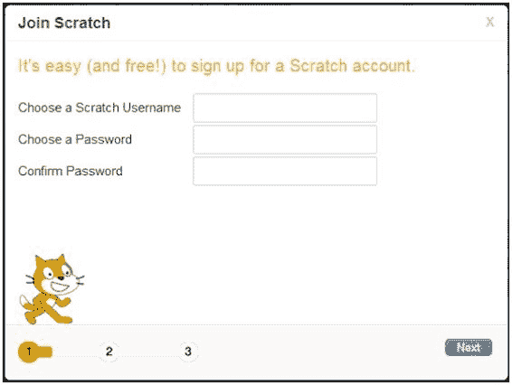图 A-1. 账户创建过程中的第一个对话框

1.  在第二个对话框中（参见 图 A-2），输入你的出生日期、性别、国家和电子邮件地址。然后点击 **下一步**。

    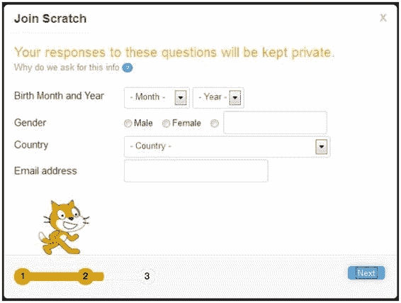图 A-2. 账户创建过程中的第二个对话框

1.  你将看到一个欢迎你加入 Scratch 用户社区的对话框（参见 图 A-3）。点击 **确定，开始吧！**，你将登录到你的新账户。

    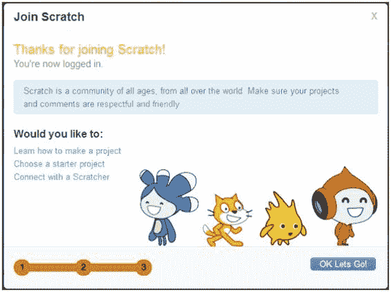图 A-3. 账户创建过程中的最后一个对话框

屏幕顶部的导航栏将显示你的用户名，如 图 A-4 所示。使用导航栏中的四个链接（创建、探索、讨论和帮助）来启动 Scratch 的项目编辑器，探索可用项目，与其他 Scratch 用户协作，并查找有用的指南和额外的 Scratch 资源。

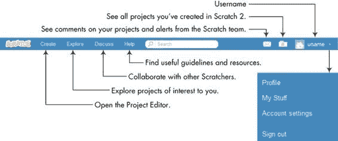图 A-4. 登录用户的导航栏

以下部分将讨论一些在你登录 Scratch 账户后可以使用的功能。

## 使用背包

背包（仅限登录用户使用）允许你从任何项目中复制精灵、脚本、服装、背景和音效，并在自己的项目中使用。点击**探索**链接，如图 A-4 所示，进入项目探索页面，如图 A-5 所示。在这里，你可以试用其他人创建的 Scratch 项目。

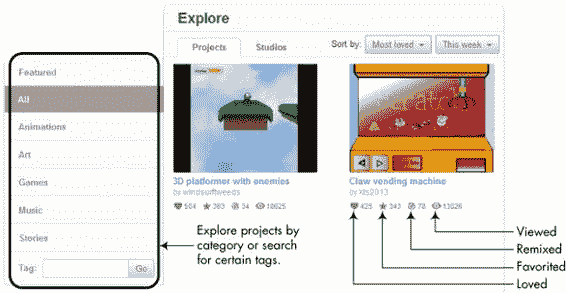图 A-5. 项目探索页面

你可以按类别查看项目，搜索包含特定标签的项目，并根据不同的标准进行排序（分享、最受喜爱、最多浏览或最多混合）。当你找到想要探索的项目时，双击其缩略图进入该项目的页面，如图 A-6 所示。

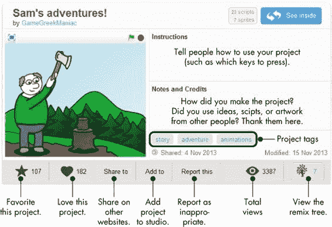图 A-6. 一个示例项目页面

点击右上角的**查看内部**按钮，查看此项目的内容，如图 A-7 所示。

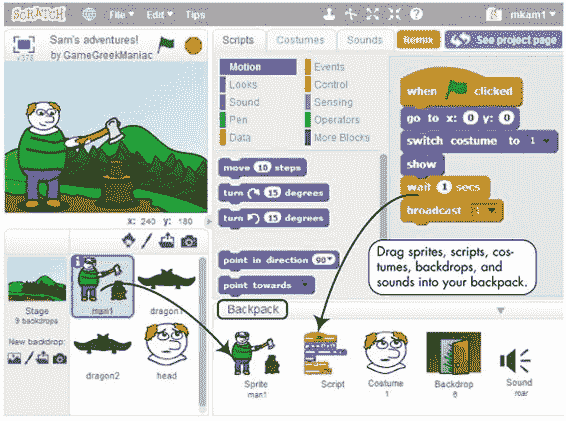图 A-7. 查看另一个 Scratcher 项目的内容

如果你想在自己的应用程序中使用此项目的部分内容（如精灵、脚本、服装、背景或音效文件），只需将这些部分拖到你的背包中。要删除背包中的项目，右键点击并从弹出菜单中选择“删除”。

你的背包内容保存在 Scratch 服务器上，因此你登出时不会丢失它们。要使用背包中的项目，只需将它从背包拖到你的项目中。

## 创建你自己的项目

有许多方法可以开始在 Scratch 中编程。你可以创建一个干净的项目， remix 一个已经在 Scratch 网站上分享的项目，或者打开一个旧项目并进行修改。我们将逐一看看这些选项。

### 开始一个新项目

要开始一个全新的项目，点击导航栏中的**创建**链接，打开 Scratch 的项目编辑器，如图 A-8 所示。

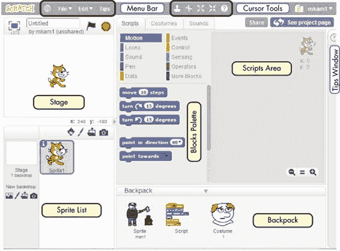图 A-8. 登录用户的 Scratch 项目编辑器

这个界面与你未登录时看到的非常相似，但也有一些重要的区别：

+   背包面板可见。

+   右上角会出现两个新按钮（**分享**和**查看项目页面**）。

+   手提箱图标和用户名出现在工具栏的右侧。

+   文件菜单中有了新的选项。

工具栏及其新选项的详细信息显示在图 A-9 中。

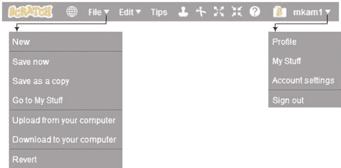图 A-9. 已登录用户的工具栏

当你登录时，Scratch 会自动将你的作品保存到云端（即 Scratch 服务器），但在退出 Scratch 前，仍然建议你点击保存。**另存为副本**选项可以将当前项目保存为不同的名称。例如，如果当前项目名为*Test*，新项目将被命名为*Test copy*。（你可以通过在项目名称编辑框中输入新名称来更改该名称。）**恢复**选项会丢弃自打开当前项目以来所做的所有更改。

如果你希望将项目保存在电脑上而非云端，可以使用**下载到电脑**选项。相反，**从电脑上传**选项允许你从电脑加载一个 Scratch 项目到项目编辑器中。你可以使用此选项上传使用 Scratch 1.4 创建的项目并将其转换为 Scratch 2 格式。

### 重混一个项目

当你有新的想法想要添加到其他 Scratch 用户的项目中时，点击**重混**按钮。这将把所选项目复制到你的账户，并为你的工作提供一个起点。

你还可以点击项目页面上的**查看重混树**（见图 A-6）查看项目如何随着时间发展，并选择你想要复制的分支。

如果你分享了你的重混项目，项目页面将列出原始创作者并提供链接到他们的项目。

### 项目页面

点击右上角的**查看项目页面**按钮，进入图 A-8 以编辑你的项目页面，该页面如图 A-10 所示。你可以为使用你应用程序的人输入说明，给使用过你想法或作品的人致谢，并指定一些标签，帮助其他人找到你的应用。

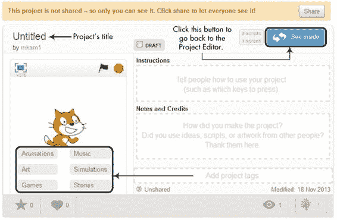图 A-10. 项目页面

### 分享你的项目

完成应用程序后，你可以通过点击**分享**按钮将其分享给 Scratch 社区。当你分享一个项目时，任何人都可以在网上找到它并查看其中的内容。

要查看所有项目的列表，点击工具栏中用户名下方的下拉箭头，并从下拉菜单中选择**我的内容**。 （你也可以点击行李箱图标。）这将带你到“我的内容”页面，如图 A-11 所示。

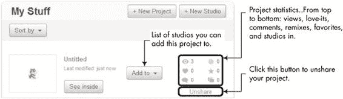图 A-11. 我的内容页面

“我的内容”页面让你可以控制和查看项目和工作室的各个方面。你可以在此页面创建、分享、编辑、取消分享和删除项目。你还可以创建*工作室*——项目的集合——并将项目添加到其中。工作室使得将相关项目分组变得更加方便。

### 注意

*如果你删除了未共享的项目，该项目将被移动到回收站文件夹，回收站文件夹充当项目的回收站。回收站文件夹的界面允许你将已删除的项目恢复到“我的内容”页面。*
