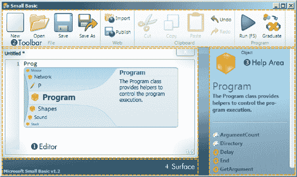
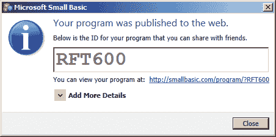
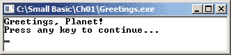
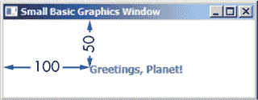
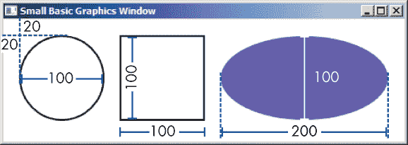

## **1**

**介绍小型 Basic**


比尔·盖茨曾经有一个目标：让每个家庭都有一台计算机。现在，几乎每个桌子上都有个人计算机——所以几乎每个人也可以学习编程了。在本书中，你将学习使用一种名为 Microsoft Small Basic 的编程语言。

我们将从解释一些基本的计算机概念和 Small Basic 本身开始本章内容。接着，我们将向你展示如何设置使用 Small Basic 所需的一切，并最后写出你的第一个程序！

### **什么是计算机？**

计算机是一种电子设备，它根据一组指令处理数据——它就是你口袋里或桌面上或膝上的那个神奇设备。计算机可以进行计算（就像你的数学老师一样），并比较数字（比如在幻想足球中），它们能够以高速和高精度存储、检索和处理数据（就像父母记住宵禁时间一样）。

计算机的硬件是指你能触摸到的所有部分——每台计算机内部都包含数百个相互连接的电子元件。如果你想象计算机中的数据，可以把它想象成一个庞大的商场，里面有成百上千的商店，成千上万的顾客像时钟一样在商店之间移动。

但没有一些额外的东西，这些硬件什么也做不了。每台计算机都需要程序来告诉它该做什么——我们称这些指令为*软件*。能够编写软件的人被称为*程序员*——今天你就要成为其中一员。

### **什么是计算机程序？**

计算机程序是一组指令，给计算机执行某个任务（就像老师布置的作业清单）。你的网页浏览器、你最喜欢的视频游戏、文字处理器——这些都是计算机程序。

程序告诉计算机要读取哪些数据（比如数字或文本）、从哪里读取数据（比如从用户、文件或互联网）、如何处理这些数据（可能是搜索、排序或计算数据）、要生成什么样的信息（比如段落、报告或图表）、将生成的输出存储在哪里（比如磁盘、网络或数据库），以及如何显示结果（比如通过显示器、打印机或绘图仪）。哇，这真是很多内容！

计算机程序指定了执行过程中的每个细节。计算机使用机器语言进行通信，这种语言由一堆 1 和 0 组成。（你能想象和朋友们用 1 和 0 交流吗？）很久以前，第一批计算机程序实际上是通过在计算机前面板上切换一些开关来输入的（1 为开，0 为关）。你想整天切换开关吗？想象一下可能出现的错误！

幸运的是，计算机科学家发明了编程语言，这些语言比机器语言更容易使用。今天有成百上千种编程语言，但在本书中你将学习的编程语言就是 Small Basic！

### **什么是小型 Basic？**

小型基础是一种微软为任何想学习编程的人创建的免费编程语言。你可以使用小型基础编写各种应用程序，包括游戏、模拟、动画等。

这个语言是如何诞生的呢？它源于微软的一位程序员 Vijaye Raji。Raji 刚刚读了 David Brin 的文章《为什么 Johnny 不会编程》，^(1) 文章描述了学习和教授 BASIC 编程语言的价值。在文章中，Brin 挑战微软创造一种新的 BASIC 语言，帮助孩子们学习编程，Raji 接受了这个挑战。尽管 BASIC 在 1970 年代、1980 年代和 1990 年代对微软的成功至关重要，但在 2007 年，实际上并没有适合初学者的优秀编程语言。

所以 Raji 想知道是否可以只使用原始语言中最简单的部分，创建一个简化版的 BASIC。2008 年 10 月 23 日，他发布了微软小型基础 v0.1，这是小型基础的第一个版本。

### **小型基础的愿景**

小型基础的四个目标将帮助你获得尽可能棒的学习体验：

• **简单**。小型基础是一种简单的编程语言，配有便捷的代码编辑器和帮助区域，使得编程变得轻松。

• **有趣**。小型基础让你立即开始创建游戏和其他有趣的程序。它还允许你控制海龟绘制艺术，非常有趣！

• **社交性**。使用小型基础，你可以将你的游戏发布到微软画廊网站上，展示给朋友们，并将它嵌入到你的博客或网站上。你的朋友们可以导入你的程序，与您合作改进它。

• **渐进性**。一旦你掌握了小型基础的编程基础，就可以轻松地将代码导出到免费的 Visual Studio Community，并开始新的冒险，学习 Visual Basic .NET，这是一种被数百万专业程序员使用的编程语言，也是你学习旅程中的一个重要步骤。

在本书中，我们将涵盖你开始使用小型基础所需的所有内容！

### **小型基础的基础**

小型基础的三个主要部分是语言、支持库和*编程环境*，后者是你用来编写自己程序的界面。现在，让我们来探索每个元素。

#### ***小型基础语言***

为了在英语中形成一个有效的句子，你需要遵循其语法规则。同样，要编写一个有效的小型基础程序，你必须遵循小型基础的语法规则，这些规则被称为*语法规则*。语法包括标点、拼写、语句顺序等。当你违反这些规则时，小型基础会检测到程序中的所有*语法错误*并报告给你，以便你修复它们。

#### ***小型基础库***

Small Basic *库* 包含了数百种方法，你可以在程序中使用它们来执行不同的任务。例如，当你想让计算机在屏幕上显示图片、画圆形、从互联网上下载文件，甚至计算 275,625 的平方根时，你都可以使用这些方法。

#### ***Small Basic 开发环境***

Small Basic 配备了一个*集成开发环境（IDE）*，这是你用来编写程序的应用程序。IDE 包含一个文本编辑器（你将在其中输入程序）和一个工具栏。工具栏有一些按钮，可以让你保存和运行程序，打开程序以便修改，分享程序到网页，将程序转换为 Visual Basic 等等。

### **安装 Small Basic**

你学习旅程的第一步是将 Small Basic 安装到你的计算机上。打开你的网页浏览器，访问微软的 Small Basic 网站 *[`www.smallbasic.com/`](http://www.smallbasic.com/)*，并点击右上角的 **下载** 按钮。你将进入下载页面，选择操作系统和语言。开始下载时，会弹出一个对话框，询问是否允许打开 *SmallBasic.msi* 文件。点击 **运行** 或 **打开** 按钮开始安装向导。

启动安装向导后，在第一页点击 **下一步**，接受许可协议，再次点击 **下一步**，选择默认设置并点击 **安装**。（如果弹出用户访问控制对话框并请求安装许可，点击 **是**。）安装完成后，点击 **完成**。如果你需要查看这些步骤的详细信息，请访问 *[`tiny.cc/installationguide/`](http://tiny.cc/installationguide/)*。

### **Small Basic IDE**

现在你的安装完成了，让我们来看看 Small Basic IDE。打开 Windows 开始菜单，输入 **Small Basic** 来搜索并打开它，或者选择 **所有程序**  **Small Basic**  **Microsoft Small Basic**。当你第一次运行程序时，你会看到类似于 图 1-1 的界面（在编辑器中输入 `Prog` 来查看 IntelliSense 菜单）。

IDE 包含四个主要部分。编辑器 ➊ 是你输入 Small Basic 程序的地方。你可以同时打开并处理多个编辑器窗口，但每次只有一个编辑器窗口是活动的。右键点击编辑器可以查看包含剪切、复制、粘贴和查找等选项的弹出菜单。该菜单还包含一个“格式化程序”选项，可以对程序中的行进行缩进，使其更容易阅读。



*图 1-1：Small Basic IDE*

工具栏 ➋ 包含按钮，允许你编辑和运行程序，帮助区域 ➌ 提供关于你输入编辑器的代码的即时信息。工作区 ➍ 是一个开放区域，你可以在这里移动和整理每个 Small Basic 程序的编辑器窗口。

你将经常使用工具栏，所以让我们详细了解它。

#### ***打开和保存你的工作***

在工具栏的文件组中，点击**新建**（CTRL-N）从头开始编程，或点击**打开**（CTRL-O）继续写程序。**保存**（CTRL-S）经常保存，以免丢失工作，并点击**另存为**将程序保存在新文件中。

#### ***分享你的作品并导入游戏***

假设你的朋友刚刚将一个新游戏发布到 Small Basic 网站，而你想看看。点击网页组中的**导入**，输入导入 ID（你从朋友那里获得的），然后下载你朋友的代码。然后，你可以通过自己的修改使这个游戏更酷。

让我们尝试打开别人已经制作的游戏。点击**导入**，然后输入代码**TETRIS**。你将看到某人写的代码，重现了著名的游戏，并可以看到它是如何制作的。现在，点击**运行**来玩游戏。

稍后，当你准备好分享自己的程序时，可以点击**发布**，Small Basic 将把你的程序发布到网页上，供你的朋友在线玩你的游戏或应用，并查看你的代码。你还可以在 Small Basic 论坛分享你的程序，直接向社区寻求帮助。Small Basic 甚至允许你嵌入代码片段，这样你就可以将项目添加到你的网站上。你可以在发布的网页上找到嵌入代码。

当你点击**发布**时，你将看到一个对话框，类似于图 1-2。



*图 1-2：发布到网页对话框*

当你发布代码时，除了获得导入 ID 和网页 URL 外，你还可以点击**添加更多详细信息**，输入程序的标题、描述和类别（如*游戏*、*示例练习*、*示例*、*数学*、*娱乐*或*杂项*）。

#### ***复制和粘贴；撤销和重做***

在 Small Basic 中，你可以像编辑任何文本一样编辑代码。在剪贴板组中，点击**剪切**（CTRL-X）将代码从编辑器中的一个位置移除并粘贴到另一个位置。为了避免重新输入代码，点击**复制**（CTRL-C）。要选择所有代码，按 CTRL-A，然后剪切或复制它。

在剪切或复制之后，点击**粘贴**（CTRL-V）将内容粘贴到编辑器中。如果你犯了错误，不用担心！只需点击**撤销**（CTRL-Z）。如果你点击了**撤销**太多次，点击**重做**（CTRL-Y）来恢复更改。你还可以在一个大型文件中查找某段代码。要打开查找窗口并搜索文本，只需按 F3，按 CTRL-F，或右击编辑器并在上下文菜单中点击**查找**。

#### ***运行你的程序并毕业***

当你完成一个程序时，点击**运行**（F5）按钮进行*编译*；Small Basic 编译器，作为 IDE 的一部分，会检查是否有错误，如果没有，则构建你的程序。当你掌握了 Small Basic 后，只需点击**毕业**按钮，将代码导出到 Visual Studio Community 中的 Visual Basic，并开始学习下一种语言。

### **编写和运行你的第一个程序**

现在你已经熟悉了 IDE，让我们写一个 Small Basic 程序。首先，在你的计算机上创建一个名为*Small Basic*的新文件夹；这里将是你保存本书中创建的所有程序的地方。

然后点击**新建**按钮打开一个新的编辑器窗口，并按照以下步骤操作：

1.  在编辑器中输入清单 1-1 中的程序。你需要准确地按照所示输入。

    ```
    1 ' Greetings.sb
    2 TextWindow.WriteLine("Greetings, Planet!")
    ```

    *清单 1-1：你的第一个程序*

    **注意**

    *当你输入清单并尝试时，不要包括左侧的行号！这些行号仅供参考；我们会用它们来解释代码。你在编辑器中也会看到这些行号，但它们不是代码的一部分。*

1.  点击工具栏上的**保存**按钮（或按 CTRL-S），浏览到你刚创建的*Small Basic*文件夹，并将程序保存为*Greetings.sb*。

1.  点击工具栏上的**运行**按钮。如果没有输入错误，你将看到一个类似于图 1-3 的输出窗口。

    

    *图 1-3：* Greetings.sb 的输出

    **注意**

    *当你运行这个程序时，窗口将有一个黑色的背景；这是文本窗口的默认背景色。本书中的图片使用白色背景，便于你阅读。*

尽管这段程序很短，但它是一个完整的 Small Basic 程序！那么每一部分程序是做什么的呢？让我们来分析一下。

#### ***对象和方法***

图 1-3 中的窗口是*文本窗口*，它只能显示文本。你通过`TextWindow`（Small Basic 库中的许多*对象*之一）告诉 Small Basic 弹出文本窗口。你可以将对象看作是为特定任务提供工具的小工具箱，例如解决数学问题、定义单词或绘制图片。

Small Basic 中的对象可以通过使用*方法*执行预定义的任务。方法就像是你对象工具箱中的工具。为了让大多数方法完成某个任务，你需要给它们一个或多个值（如文本或数字）来操作。每个值都称为*参数*。

`WriteLine()`是`TextWindow`对象的一个方法，消息`"Greetings, Planet!"`是传递给括号的一个参数。语句`TextWindow.WriteLine()`指示计算机在文本窗口中显示消息`Greetings, Planet!`。

在本书中，我们将包括方法名称的括号，例如`WriteLine()`，以便你能轻松辨认出它们是方法。

#### ***命名你的程序***

项目名称可以帮助你轻松识别项目的内容；这些名称对 Small Basic 来说并不重要。虽然我们建议你将该程序保存为*Greetings.sb*，因为它代表了程序的内容，但你也可以将它保存为*SecretGarden.sb*、*FuzzyKittens.sb*，甚至是*HungerBoardGames.sb*，如果你真想这么做的话。只是不要更改文件名的* .sb *部分，这叫做*扩展名*。Small Basic 程序默认使用这个扩展名，没有理由去更改它！

#### ***Small Basic 生成的文件***

当你点击运行按钮时，Small Basic 会生成其他文件以便运行你的程序。打开你保存*Greetings.sb*程序的文件夹。表 1-1 列出了你在该文件夹中应该找到的文件，如果你之前点击了运行。

**表 1-1：** Small Basic 编译器生成的文件

| **文件** | **描述** |
| --- | --- |
| *Greetings.sb* | 这是你的*源代码*文件，包含你在 IDE 中输入的所有内容。如果你想编辑代码并使其更好，你就编辑这个文件。 |
| *Greetings.exe* | 这是 Small Basic 创建的可执行文件。这个文件是你电脑实际运行的文件。双击该文件，你的程序就会运行。 |
| *SmallBasicLibrary.dll* | 你现在可以忽略这个文件。动态链接库（*.dll*）文件包含补充*Greetings.exe*文件的可执行代码。没有这个文件，*Greetings.exe* 文件无法运行！ |
| *Greetings.pdb* | 你目前可以忽略这个文件。这个程序数据库（* .pdb *）文件包含高级工具用来*调试*，或修复程序中的错误所需的信息。 |

现在你已经编译了源代码，你也可以在不使用 IDE 的情况下运行*Greetings.sb*程序。你只需双击*Greetings.exe*文件即可。

**注意**

*当你编辑源文件后点击运行时，Small Basic 会覆盖* .exe、.dll *和* .pdb *文件。如果你想保留这些文件，你需要在点击运行之前手动将它们复制到其他位置。另外，别忘了点击保存，以便保存对* .sb *文件的更改。*

#### ***帮助提示：智能感知和语法高亮***

如果你正在跟着操作并在 Small Basic 中输入，你会看到它会在你完成输入单词之前就分析你输入的内容。Small Basic 会提供一个建议列表，帮助你完成输入的内容。你可以通过按键盘上的上下箭头来滚动这个列表。按回车键或双击选项来将高亮的文本插入到代码中。这项技术叫做*智能感知*，简称*IntelliSense*。利用它可以加速你的输入速度，并减少语法错误。

**提示**

*你可以通过按住* CTRL *键来使 IntelliSense 变得透明，以便查看下面的代码。*

你可能还注意到 Small Basic 编辑器使用不同的颜色显示了程序中的某些单词。这个功能叫做*语法高亮*。*关键字*是对 Small Basic 有特殊含义的保留字，显示为蓝紫色。*字符串*是用引号括起来的字符序列，显示为橙色，数字也是如此。方法名称是深红色的，对象名称是蓝绿色的，依此类推。语法高亮帮助你区分代码的不同部分，并使你的程序更易于阅读。你将在本书后面学到更多关于这些代码部分的内容。

### **使用 Small Basic 绘图**

我们之前使用的`TextWindow`对象非常适合没有*图形用户界面 (GUI)* 的应用程序，GUI 是包含按钮、文本框和图像的用户界面，例如 Microsoft Word 或 Angry Birds（或 Angry Words）。例如，你可以使用`TextWindow`来编写执行数学题目或处理数据的应用程序，其中的输入和输出只使用字符（如文本）。这被称为*基于文本的用户界面*。如果你想创建一个具有 GUI（发音为*gooey*，像糖果条一样）的应用程序，包含按钮和图像，你可以使用 Small Basic 库中的`GraphicsWindow`对象。使用`GraphicsWindow`，你可以创建展示按钮、图像等内容供用户互动的应用程序。让我们试试吧！

将清单 1-2 中的程序输入到编辑器中，然后点击工具栏中的**运行**。

```
1 ' Graphic.sb
2 GraphicsWindow.DrawText(100, 50, "Greetings, Planet!")
```

*清单 1-2：你的第一个图形程序*

这个程序使用了`GraphicsWindow`对象的`DrawText()`方法来显示一条消息。`DrawText()`方法需要三个参数。前两个参数告诉 Small Basic 输出消息的水平（*x*）和垂直（*y*）位置，从窗口的左上角开始。第三个参数告诉 Small Basic 显示什么文本。这个程序的输出如图 1-4 所示。你可以看到，消息显示在位置 (100, 50)。



*图 1-4：Graphic.sb 的输出*

`GraphicsWindow`对象包含许多其他方法，允许你创建 GUI 应用程序；在试试看 1-1 中可以探索其中的一些方法。

**试试看 1-1**

将以下程序输入到编辑器中，然后运行它，看看会发生什么：

```
GraphicsWindow.DrawEllipse(20, 20, 100, 100)
GraphicsWindow.DrawRectangle(140, 20, 100, 100)
GraphicsWindow.FillEllipse(260, 20, 200, 100)
```

程序的输出如图 1-5 所示。数字显示了 Small Basic 如何跟随你的代码。



*图 1-5：程序的输出*

### **编程挑战**

如果你遇到问题，可以查看 *[`nostarch.com/smallbasic/`](http://nostarch.com/smallbasic/)* 获取解决方案以及更多的资源和教师、学生的复习问题。

1.  在以下代码片段中识别对象、方法、参数和关键字。（提示：Small Basic 编辑器会将关键字显示为蓝紫色。）

    ```
    If (today = "Friday") Then
      TextWindow.WriteLine("Today is Friday.")
    Else
        TextWindow.WriteLine("I lost track of what day it is.")
    EndIf
    ```

1.  编写一个程序，在文本窗口中显示你的名字。

1.  编写一个程序，使用`GraphicsWindow`对象在消息框中显示你的名字。（提示：使用`ShowMessage()`方法。）
