## 2

**入门**


现在我们将逐步讲解一些代码，让你了解重要的组成部分。在阅读时，输入这些示例，我们将解释如何运行它们并进行修改。但不要止步于此：通过实验为你的程序增添个人特色。我们在每一节的末尾都附有练习，帮助你成为编程大师（像绝地武士一样，但没有危险的光剑）。尝试完成这些练习来磨练你的技能。

### 程序的组成部分

让我们通过查看一个简单的示例来探索程序的不同部分。清单 2-1 展示了一个与第一章中你编写的*Greetings.sb*程序类似的程序。将这个程序输入到 Small Basic 编辑器中，然后点击工具栏上的**运行**按钮（或者按键盘上的 F5 键）来运行它。

```
1 ' Welcome.sb
2 TextWindow.WriteLine("Welcome to Small Basic.")
```

*清单 2-1：编写欢迎信息*

这两行是你*Welcome.sb*程序的*源代码*。当你运行这段代码时，你将看到一个输出窗口，类似于图 2-1 所示。（注意，窗口的标题显示了我们保存文件的位置，因此你的可能会不同。）

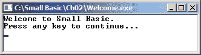

*图 2-1：Welcome.sb 的输出窗口*

**注意**

*你的控制台窗口看起来会与这个略有不同，因为窗口默认有黑色背景。在本书的其余部分，我们将以文本形式展示输出，除非必须查看窗口时。*

Small Basic 会自动将文本 `Press any key to continue...` 添加到窗口中，让你有机会查看输出结果（键盘上并没有一个*任意*键，所以不要寻找它）。否则，屏幕会闪烁显示输出，然后消失。

#### *注释和语句*

以单引号（`'`）开头的行被称为*注释*。你可以添加注释来解释程序的功能，而 Small Basic 会忽略它们。第 1 行的注释是包含你源代码的文件名。

**注意**

*你应该养成注释代码的习惯，因为你会经常到论坛或向朋友寻求帮助，他们需要理解你的代码在做什么。*

Small Basic 编辑器将所有注释显示为绿色，这样你可以轻松地区分它们与实际代码行，后者称为*语句*。注释使程序更容易阅读，你可以在任何地方添加它们！但要小心，不要使用过多的注释，否则可能会让代码更难以阅读！在代码开头写注释来描述程序或解释任何难懂的部分是一个好习惯。

如果你添加一个空行来分隔注释和代码，Small Basic 也会忽略它，所以你可以根据需要添加任意数量的空行，以便让程序更易读！*Welcome.sb*中的第 2 行是你程序的第一条语句，程序就是从这里开始执行的。（别担心：没有人会死！）

图 2-2 展示了我们语句的各个部分。让我们逐一分析，看看每部分的作用！

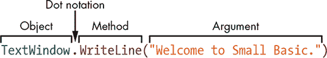

*图 2-2：Welcome.sb 中的语句*

`TextWindow` 是 Small Basic 内置的一个对象，用于接收文本输入并将文本输出到屏幕上。`WriteLine()` 是 `TextWindow` 对象的方法。该方法将传递给它的数据显示在输出窗口中。当你使用 `TextWindow.WriteLine()` 时，你是告诉 `TextWindow` 对象执行它的 `WriteLine()` 方法。这被称为*点符号表示法*，因为对象和方法之间有一个点。点符号表示法用于访问对象的方法，格式如下：`ObjectName.MethodName(Arguments)`。在这个示例中，`"Welcome to Small Basic."` 是 `WriteLine()` 方法的一个参数。它明确告诉方法你想要写的内容。

#### *字符和字符串*

字母、数字、标点符号（如句号、冒号、分号等）以及其他符号统称为*字符*。这些字符组成的序列，如果被双引号包围，就叫做*字符串*。引号显示了字符串的开始和结束位置。

在我们的*Welcome.sb*程序中，显示的文本 `"Welcome to Small Basic."` 是一个字符串。

#### *参数和方法*

你通过方法的圆括号内传递*参数*。参数可以是一个字符串、一个数字或其他值。`WriteLine()`方法只接受一个参数，在你的*Welcome.sb*程序中，你将字符串 `"Welcome to Small Basic."` 作为它的参数传递。

点击编辑器中的 `WriteLine()` 方法，然后查看 Small Basic 的帮助区域（图 2-3）。它会告诉你应该传递什么类型的数据给该方法。

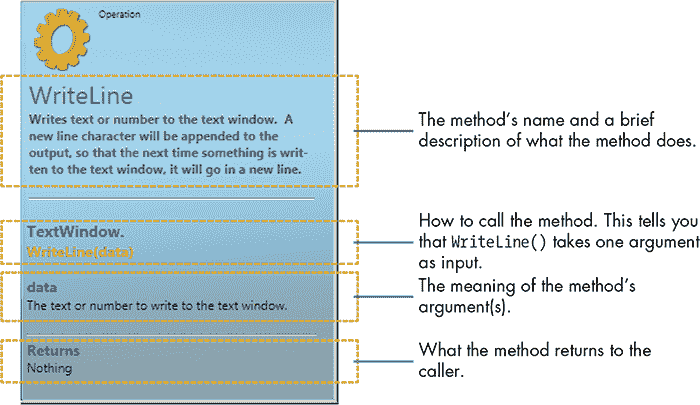

*图 2-3：`WriteLine()` 方法的帮助区域信息*

帮助区域是你的好帮手！阅读它可以避免不必要的错误和困惑。

**试试看 2-1**

请指出以下调用中的对象、方法和参数：

1.  `Shapes`.AddRectangle(100, 50)

1.  `Math`.Max(5, 10)

1.  `Sound`.PlayBellRing()

### 探索其他特性

在本节中，你将通过对*Welcome.sb*程序进行一些小改动，探索 Small Basic 的其他关键特性。每个示例都突出展示了一个不同的特性，快来一起试试看吧！Small Basic 是友好且易于上手的！

#### *大小写敏感*

你最初输入的是 `TextWindow.WriteLine("Welcome to Small Basic.")`，但如果你更改了`TextWindow`或`WriteLine`中的字母大小写，Small Basic 也不会在意。例如，你可以写成：`TextWindow.writeLINE("Welcome to Small Basic.")`。这将得到与之前相同的输出，因为 Small Basic 是*不区分大小写*的，这意味着你的代码是写成大写字母还是小写字母都不重要。

像`Writeline`、`writeline`和`WRiTeLiNe`这样的标识符在*编译器*中会被相同地解释，编译器会读取每一行代码并构建应用程序。但是，你应该养成尊重标识符大小写的习惯，因为其他语言是*区分大小写*的。Small Basic 就像一个友好的教练，不会因为大小写不当而对你大喊大叫。得益于 IntelliSense 的自动纠正功能，它甚至会帮你修正打字错误。

如果你改变字符串会发生什么呢？试试将欢迎信息输入为全大写字母：

```
TextWindow.WriteLine("WELCOME TO SMALL BASIC.")
```

当你运行这个程序时，`WELCOME TO SMALL BASIC.`将在输出窗口以全大写字母显示。为什么？原因是 Small Basic 的`WriteLine()`方法会准确地显示双引号之间的内容，正如你输入的那样！

#### *顺序执行*

示例 2-1 只显示一行文本，但你可以显示任意多的行。让我们按照示例 2-2 扩展程序，显示三行内容！

```
1 ' ThreeLines.sb
2 TextWindow.WriteLine("Welcome to Small Basic.")
3 TextWindow.WriteLine("")
4 TextWindow.WriteLine("Anyone can code!")
```

*示例 2-2：显示更多行*

当你运行这个程序时，你将看到以下输出：

```
Welcome to Small Basic.

Anyone can code!
```

你的程序输出显示了每一行代码按程序中列出的顺序从上到下执行。你看到输出中的空行了吗？那是第 3 行的语句创建的，那里你给`WriteLine()`传递了一个没有字符的双引号。因为`""`不包含任何字符，它被称为*空字符串*。空字符串在你想显示空行来分隔程序输出并使其更易读时非常有用。

#### *显示数字并进行数学运算*

你也可以使用`WriteLine()`来显示数字。试试示例 2-3。

```
1 ' TextAndNum.sb
2 TextWindow.WriteLine("5 + 7")
3 TextWindow.WriteLine(5 + 7)
```

*示例 2-3：显示字符串和数字的区别*

这是该程序的输出：

```
5 + 7
12
```

当你将任何内容传递给`WriteLine()`并用双引号括起来时，输出窗口会显示双引号内的内容。因此，当你在第 2 行将`"5 + 7"`传递给`WriteLine()`时，Small Basic 会将字符串中的加号当作普通字符处理，而不会把它看作加法运算！

然而，第 3 行的`WriteLine()`命令不同。你传递给`WriteLine()`的是`5 + 7`，*没有*用双引号括起来。在这种情况下，Small Basic 明白这些是数字，而不是字符串的一部分。它在幕后将 5 和 7 相加得到 12，并将和传递给`WriteLine()`。

#### *连接字符串*

你还可以将字符串连接在一起，构建句子或添加短语，正如在示例 2-4 中所示。将字符串合并称为*拼接*。

```
1 ' JoinString.sb
2 TextWindow.WriteLine("Hello," + " oblate spheroid!")
```

*示例 2-4：解释拼接*

在 清单 2-4 的第 2 行中，`WriteLine()` 方法接收两个字符串，`"Hello,"` 和 `" oblate spheroid!"`，它们之间用加号（`+`）连接。在这种情况下，由于你没有执行加法操作，加号的意义不同：它被称为 *连接运算符*，它将两个字符串连接成一个字符串。注意 `" oblate spheroid!"` 中的额外空格。它使得你的消息在单词之间显示空格。

加号（`+`）将 `"Hello,"` 拼接到 `" oblate spheroid!"` 上，生成新的字符串 `"Hello, oblate spheroid!"`。

你还可以将字符串和数字连接在一起。Small Basic 会自动将任何数字转换为字符串，以便进行连接操作！查看 清单 2-5 及其在 图 2-4 中的输出。

```
1 ' JoinNum.sb
2 TextWindow.WriteLine("Let's concatenate: 5 + 7 = " + 12)
```

*清单 2-5：将数字添加到文本中*

`WriteLine()` 方法需要一个字符串作为参数。为了创建该字符串，Small Basic 会将整个参数转换为字符串，如 图 2-4 所示。它将数字 12 转换为字符串（`"12"`），然后将其与 `"Let's concatenate: 5 + 7 = "` 拼接在一起，生成一个新的字符串：`"Let's concatenate: 5 + 7 = 12"`。

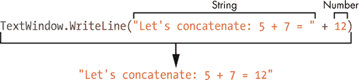

*图 2-4：使用加号连接字符串和数字*

**尝试 2-2**

编写程序以显示 图 2-5。

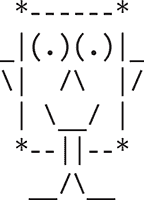

*图 2-5：制作一个面孔*

### 对象属性

Small Basic 对象可以具有 *属性*（或特性），你可以更改这些属性。如果更改这些属性，调用对象方法时可能会得到不同的结果。

例如，假设我们有一个名为 `Frog` 的新对象，它包含两个方法，`Jump()` 和 `Eat()`，以及一个名为 `EnergyLevel` 的属性。当你调用 `Jump()` 方法时，`Frog` 会跳跃，但每次跳跃都会使其 `EnergyLevel` 降低。你可以调用 `Eat()` 方法来恢复它的能量。如果你不停地让 `Frog` 跳跃却不给它食物，`Frog` 就会耗尽能量，无法再跳跃。调用 `Jump()` 方法的结果取决于 `EnergyLevel` 属性的当前值。这个属性改变了 `Frog` 对象的 *状态*（它是否能跳跃）。在一个状态下（`EnergyLevel` 高时）调用 `Jump()` 与在另一个状态下（`EnergyLevel` 低时）调用 `Jump()` 会产生不同的结果。可怜的饥饿青蛙！

#### *设置和更改属性值*

下面是设置或更改对象属性的常规格式：

```
ObjectName.PropertyName = Value
```

例如，要让 `TextWindow` 对象输出黄色文本，你可以输入：

```
TextWindow.ForegroundColor = "Yellow"
```

该语句会改变 `TextWindow` 对象的状态：在此语句执行后，任何通过调用 `WriteLine()` 输出的文本都会以黄色显示。但已经显示在文本窗口中的文本不会受到影响。该语句告诉 `TextWindow` 对象：“从此开始，使用黄色显示文本。”

#### *处理属性*

示例 2-6 展示了一些使用`TextWindow`属性的方法。

```
 1 ' Properties.sb
 2 TextWindow.Title = "Discovering Properties..."
 3 TextWindow.BackgroundColor = "Yellow"
 4 TextWindow.Clear()
 5
 6 TextWindow.CursorLeft = 4
 7 TextWindow.CursorTop = 1
 8 TextWindow.ForegroundColor = "Blue"
 9 TextWindow.Write("BLUE TEXT")
10
11 TextWindow.CursorTop = 3
12 TextWindow.ForegroundColor = "Red"
13 TextWindow.Write("RED TEXT")
14
15 TextWindow.CursorLeft = 1
16 TextWindow.CursorTop = 5
17 TextWindow.BackgroundColor = "Green"
```

*示例 2-6：放置和着色文本*

运行这段代码会在图 2-6 中显示输出结果。

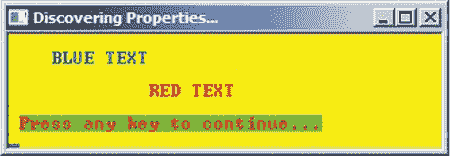

*图 2-6：* Properties.sb 的输出

现在让我们逐步分析代码。图 2-7 将帮助你更好地理解发生了什么。它展示了文本窗口作为一个矩形的字符网格，并显示了在 Small Basic 执行每条语句后光标的位置。

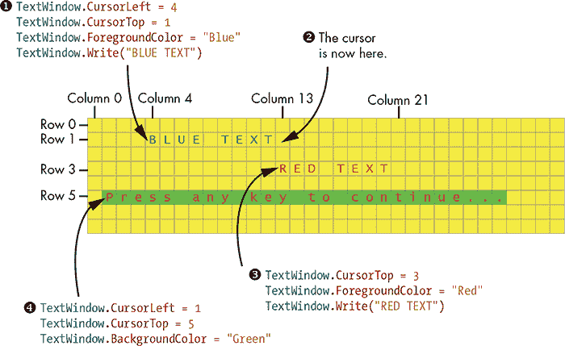

*图 2-7：展示* Properties.sb 的输出

第 2 行设置了`Title`属性，告诉 Small Basic 文本窗口的标题。第 3 行将`BackgroundColor`属性设置为“黄色”，用于接下来所有的文本输出。`Clear()`方法（第 4 行）告诉`TextWindow`使用其`BackgroundColor`属性重新绘制自己，这使得窗口的背景变成了黄色。尝试从程序中删除这一行，看看程序的输出会发生什么变化。

第 6 到第 8 行将光标位置设置为第 4 列，第 1 行，并将前景色（文本颜色）设置为蓝色，以便下一个输出。第 9 行的`Write()`方法写入字符串`"BLUE TEXT"`，从当前光标位置开始。`Write()`方法与`WriteLine()`方法类似，不同之处在于它不会在显示字符串后将光标移动到下一行。调用此方法后，光标位于第 13 列，但仍在第 1 行。

第 11 行将光标移动到第 3 行。第 12 行将前景色设置为红色，第 13 行调用`Write()`显示字符串`"RED TEXT"`。

第 15 行和第 16 行将光标移动到第 1 列，第 5 行；第 17 行将背景色设置为绿色。这是最后一条语句，因此程序在此时*终止*（因为没有更多的代码可供执行）。由于文本窗口的前景色仍然设置为红色，`Press any key to continue...`消息将在绿色背景上以红色显示。

**提示**

*要查看可以在文本窗口中使用的完整颜色列表，请访问* [`tiny.cc/twcolors/`](http://tiny.cc/twcolors/)。

**试一试 2-3**

现在你有机会在下一个情人节展示高科技。编写一个程序，绘制一个类似于图 2-8 所示的卡片，并与喜欢的人分享。（提示：先用红色画心形图案。然后将前景色切换为绿色，并调用`Write()`三次来绘制文本。）发挥你的创造力，选择个人化的颜色。

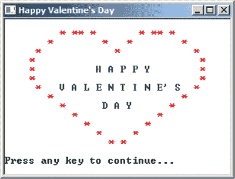

*图 2-8：情人节心形图案*

### 算术运算符

计算机非常擅长处理数字（它们有兆字节！）并且作为高级计算器非常有效。Small Basic 包括了四种基本的算术运算：加法、减法、乘法和除法，分别由`+`、`–`、`*`和`/`表示。这些符号叫做*运算符*，因为它们对数值进行操作，而这些数值被称为*操作数*。让我们来看一些例子。这些数学运算你应该很熟悉。试着在编辑器中输入这些行：

```
TextWindow.Writeline(4 + 5)
TextWindow.Writeline(3 / 6)
TextWindow.Writeline(8.0 / 4)
TextWindow.Writeline(3 * 4)
TextWindow.Writeline(9 - 3)
```

当你运行这个程序时，每个答案都会出现在新的一行，像这样：

```
9
0.5
2
12
6
```

但是，Small Basic 如何计算像`6 * 2 + 3`这样的表达式结果呢？这是否意味着先乘以 6 和 2，然后加 3，结果是 15，还是先乘以 6 再加上 2 和 3 的和，结果是 30？当一个算术表达式包含不同的运算符时，Small Basic 会按照代数中相同的*优先级*来完成运算，正如在图 2-9 中所示。

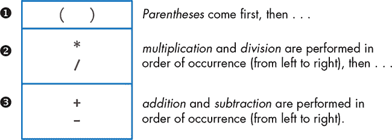

*图 2-9：Small Basic 中的运算顺序*

所以，对于没有括号的`6 * 2 + 3`，Small Basic 会先乘以 6 和 2，然后加上 3，得到 15。

如同普通数学一样，在 Small Basic 程序中，每个左括号必须有一个匹配的右括号。例如，表达式`(6 + 4)`是有效的，但`(6 + (8 – 2)))`是无效的，因为它有多余的右括号。

为了确保你得到正确的结果，使用括号来明确运算顺序。这有助于避免错误，并使你的代码更容易理解。例如，输入以下内容：

```
TextWindow.WriteLine((3.5 + 6.5) - (5 - 2.5))
```

如果你正确放置了括号，应该得到 7.5。

在运算符的两边加一个空格也是个不错的主意。例如，表达式`5 + 4 * 8`比`5+4*8`更容易阅读。虽然 Small Basic 能够读取两个连续的算术运算符，例如`3*–8`，但最好将负数放在括号中，如`3 * (–8)`，这样可以让你的代码更易读，避免任何混淆。

**试试看 2-4**

在刘易斯·卡罗尔的*《镜中奇遇》*中，红皇后和白皇后让爱丽丝在仙境中做一些加法和减法。使用`WriteLine()`方法，创建 Small Basic 程序帮助她解决这两个问题：

“你会做加法吗？”白皇后问。“一加一加一加一加一加一加一加一加一加一是多少？”

“我不知道，”爱丽丝说，“我数错了。”

“她不会做加法，”红皇后打断道，“你会做减法吗？从八中减去九。”

“九减八我做不到，你知道的，”爱丽丝很快回答：“但是——”

### 编程错误

仅仅因为程序运行了，并不意味着它是正确的。所有程序员都会犯错误，尤其是在编写长程序时。但不用担心！你练得越多，错误就越少。编程中的三种主要错误类型是语法错误、逻辑错误和运行时错误；我们将教你如何找到并修复它们。

#### *语法错误*

当程序违反语言的语法规则时，就会出现错误。语法错误的例子包括以下几种：

• 缺少标点符号，例如`TextWindow.WriteLine("Hello)`，它包含一个没有结束引号的字符串

• 语句末尾的额外标点符号

• 拼写错误的关键字，例如`Whle`而不是`While`

• 错误使用算术运算符，例如`5 ** 2`

• 算术表达式中的括号不匹配，例如`5 * (6 - (3 + 2)`

**注意**

*A*关键字*是一个特殊的词，告诉 Small Basic 做某事，比如重复执行一条语句。我们将在后续章节中解释每个关键字。*

幸运的是，一旦你点击运行按钮，Small Basic 会发现所有语法错误，并在*错误消息*中描述它们。错误消息会列出在源代码中发现错误的行号（请参阅图 2-10）。如果程序包含语法错误，查看包含错误的行，并看看你能否修复它！

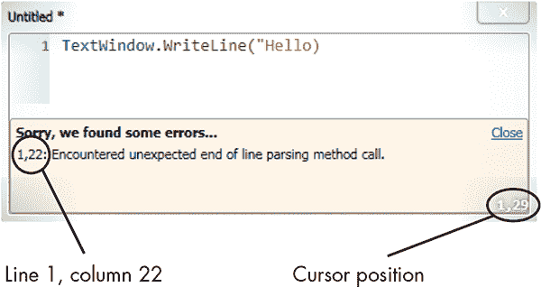

*图 2-10：语法错误的示例*

需要快速找到问题？只需双击错误消息，即可跳转到包含错误的行。（相当酷吧？）

#### *逻辑错误*

有时，你可能会在程序的逻辑中犯错。这些*逻辑错误*导致程序输出错误的结果。例如，如果你不小心用了减号代替加号，你就犯了一个逻辑错误。程序正常运行，但输出不正确！

逻辑错误被称为*bug*，而*调试*是我们用来查找和修复这些 bug 的过程。对于短小的程序，你可能能够通过*手动追踪*来定位 bug，这意味着你逐行阅读程序，并记录每一步你期望的输出。另一种常见的技术是插入额外的`WriteLine()`语句，以在程序的不同部分显示输出。这有助于你缩小可能出错的代码行。

#### *运行时错误*

*运行时错误*发生在你运行程序后，当程序遇到无法在代码中解决的问题时。例如，用户可能输入不合适的数字，导致程序停止工作或崩溃。当你开始使用 Small Basic 时，你会亲自发现这些错误。

### 编程挑战

如果遇到困难，可以访问* [`nostarch.com/smallbasic/`](http://nostarch.com/smallbasic/) *以获取解决方案以及更多针对教师和学生的资源和复习问题。

1.  编写一个显示你名字和年龄的程序，类似于以下输出。使用颜色使输出符合你自己的风格！

    ```
    My name is Sandra Wilson
    I am 12 years old
    ```

1.  用字符串替换下面程序中的问号，使其向用户提供有关元素在周期表中顺序的信息。运行程序以检查其输出。

    ```
    TextWindow.Write("?" + " is the " + "?")
    TextWindow.WriteLine(" element in the periodic table.")
    ```

1.  凯西编写了以下程序，以计算她通过做保姆赚了多少钱。但是有一个问题：她的程序无法正常工作。帮凯西找到程序中的错误并修复它。

    ```
    ' This program computes my earnings from babysitting.
    ' Hours worked: 20
    ' Pay rate: $4 per hour

    TextWindow.WriteLine("I earned: $" (20 * 4))
    ```

1.  编写一个程序，创建一张类似于这里展示的圣诞卡片。使用任意颜色装饰树木。

    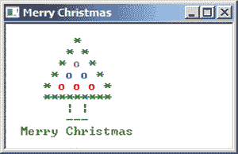
