## **3**

**绘图基础**


使用 Small Basic，你可以成为一位技艺精湛的艺术家。你拥有的不是画笔，而是代码的力量。让我们开始吧，让你可以开始创作属于自己的杰作！我们已经向你展示了`TextWindow`对象，但在本章中，你将探索`GraphicsWindow`对象，它包含绘制线条、三角形、矩形、椭圆甚至花式文本的方法。

### **图形坐标系统**

将图形窗口看作一个矩形网格。网格上的每个点都用两个数字来描述，这两个数字叫做*坐标*。x 坐标告诉你点的水平位置，y 坐标告诉你点的垂直位置。你可以使用括号指定点的位置，像这样：（*x*，*y*）。

在你在学校使用的坐标系统中，点（0，0）位于图表的中心，但在图形窗口中情况有所不同。图 3-1 向你展示了点（0，0）位于图形窗口的左上角，这意味着你只能看到具有正 x 和 y 值的点。

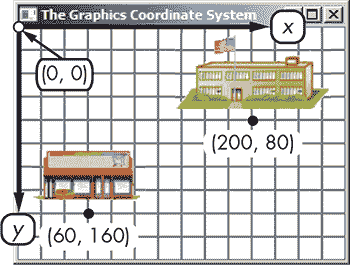

*图 3-1：图形窗口的坐标系统*

现在你已经了解了图形窗口的坐标系统是如何工作的，让我们来玩一玩它。接下来的部分将带你游览一些你可以用来绘制简单图形的方法。在本章中，我们将展示如何用 Small Basic 创建图形，并且我们会加入网格线帮助你可视化每个形状中涉及的坐标。

### **绘制线条**

要绘制一条线，你可以使用`DrawLine()`方法：

```
GraphicsWindow.DrawLine(x1, y1, x2, y2)
```

参数`x1`、`y1`和`x2`、`y2`是表示线条两个端点的 x 和 y 坐标。要使这个方法发挥作用，运行示例 3-1 中的程序，它绘制了两条平行线。

```
1 ' ParallelLines.sb
2 GraphicsWindow.Title = "Parallel Lines"
3 GraphicsWindow.DrawLine(40, 50, 100, 50)   ' Top line
4 GraphicsWindow.DrawLine(40, 70, 100, 70)   ' Bottom line
```

*示例 3-1：绘制平行线*

在第 3 行，Small Basic 从左上角开始，然后向右移动 40，再向下 50。接着，它绘制一条到达（100，50）终点的线。然后，在第 4 行，它跳到（40，70），并绘制第二条线到达（100，70）终点。每对终点使用相同的 x 坐标；不同的 y 坐标则将第二条线绘制在第一条线的下方。

做得很好！但是单独的线条并不太引人注目（除非它们是在迪士尼乐园的短线）。让我们使用几条不同的线条，像图 3-2 中那样画一艘帆船。

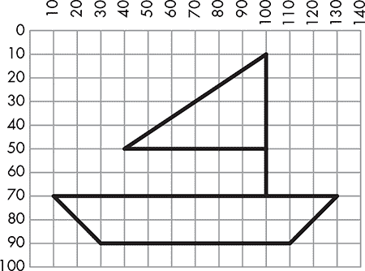

*图 3-2：完全由线段绘制的帆船*

这个形状由七个线段组成，你的程序包括七个`DrawLine()`语句。该程序的代码见示例 3-2，你可以在图 3-3 中看到它的输出。

```
1 ' SailBoat.sb
2 GraphicsWindow.Title = "SailBoat"
3 GraphicsWindow.DrawLine(10, 70, 130, 70)  ' Top of the boat
4 GraphicsWindow.DrawLine(130, 70, 110, 90) ' Right side
5 GraphicsWindow.DrawLine(110, 90, 30, 90)  ' Bottom of the boat
6 GraphicsWindow.DrawLine(30, 90, 10, 70)   ' Left edge
7 GraphicsWindow.DrawLine(100, 70, 100, 10) ' Mast
8 GraphicsWindow.DrawLine(100, 10, 40, 50)  ' Slanted sail edge
9 GraphicsWindow.DrawLine(40, 50, 100, 50)  ' Bottom edge of sail
```

*示例 3-2：用七条线绘制一艘船*

恭喜你，你刚刚在 Small Basic 中绘制了你的第一幅画。你已经在成为一位伟大艺术家的路上了。

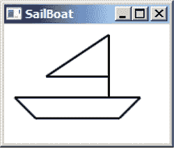

*图 3-3：* SailBoat.sb 的输出

### **绘制形状**

你可以使用线条绘制许多酷炫的图形，但那会非常慢。通过使用内置的方法绘制几何图形，你可以简化代码，这也能节省你大量的时间！

#### ***三角形***

使用`DrawTriangle()`和`FillTriangle()`方法绘制三角形：

```
GraphicsWindow.DrawTriangle(x1, y1, x2, y2, x3, y3)
GraphicsWindow.FillTriangle(x1, y1, x2, y2, x3, y3)
```

这些方法接受三角形三个角的 x 和 y 坐标。

`DrawTriangle()`方法绘制三角形的轮廓，而`FillTriangle()`方法则使用你为`BrushColor`属性设置的颜色填充三角形的内部。

**提示**

*有关你可以在图形窗口中使用的完整颜色列表，请参见* [`tiny.cc/hexcolors/`](http://tiny.cc/hexcolors/)。

例如，要用蓝色填充一个三角形，使用以下两个语句：

```
GraphicsWindow.BrushColor = "Blue"
GraphicsWindow.FillTriangle(100, 10, 40, 50, 100, 50)
```

如果你想看到边框，可以添加对`DrawTriangle()`的调用：

```
GraphicsWindow.BrushColor = "Blue"
GraphicsWindow.FillTriangle(100, 10, 40, 50, 100, 50)
GraphicsWindow.DrawTriangle(100, 10, 40, 50, 100, 50)
```

尝试这些方法来绘制各种三角形。通过实验 3-1 检查你的理解。

**实验 3-1**

编写一个程序，绘制图 3-4 中显示的形状。（提示：先绘制四个蓝色三角形，再绘制四个黄色三角形。）


*图 3-4：一个花式风车*

#### ***矩形和正方形***

使用`DrawRectangle()`和`FillRectangle()`方法，你可以绘制不同大小的矩形或正方形：

```
GraphicsWindow.DrawRectangle(x, y, width, height)
GraphicsWindow.FillRectangle(x, y, width, height)
```

在这两种方法中，前两个参数（`x`和`y`）是矩形左上角的坐标。第三个参数设置宽度，第四个参数设置高度。使用相同的数字作为第三和第四个参数来绘制正方形。

为了试验这些方法，让我们编写一个程序，绘制图 3-5 中显示的房子。

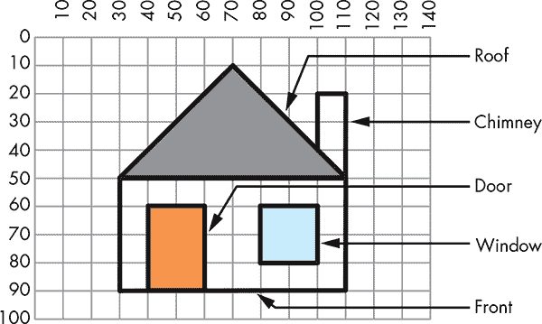

*图 3-5：绘制房子*

完整的程序显示在列表 3-3 中。

```
 1 ' House.sb
 2 GraphicsWindow.Title = "House"
 3 GraphicsWindow.DrawRectangle(30, 50, 80, 40)     ' Front of the house
 4
 5 GraphicsWindow.BrushColor = "Orange"             ' Door is light orange
 6 GraphicsWindow.FillRectangle(40, 60, 20, 30)          ' Door
 7 GraphicsWindow.DrawRectangle(40, 60, 20, 30)          ' Door border
 8
 9 GraphicsWindow.BrushColor = "Lightblue"               ' Window is light blue
10 GraphicsWindow.FillRectangle(80, 60, 20, 20)          ' Window
11 GraphicsWindow.DrawRectangle(80, 60, 20, 20)          ' Window border
12
13 GraphicsWindow.DrawRectangle(100, 20, 10, 30)         ' Chimney
14
15 GraphicsWindow.BrushColor = "Gray"                    ' Roof is gray
16 GraphicsWindow.FillTriangle(30, 50, 70, 10, 110, 50)  ' Roof
17 GraphicsWindow.DrawTriangle(30, 50, 70, 10, 110, 50)  ' Roof border
```

*列表 3-3：建造你梦想中的房子*

图 3-6 显示了输出的效果。前面是一个矩形，其左上角位于(30, 50)，宽度为 80，高度为 40（第 3 行）。门是一个填充的矩形，其左上角位于(40, 60)，宽度为 20，高度为 30（第 6 行）。

窗户是一个填充的正方形，其左上角位于(80, 60)，边长为 20（第 10 行）。屋顶是一个填充的三角形，其三个角点分别位于(30, 50)、(70, 10)和(110, 50)。

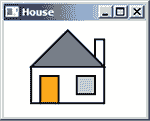

*图 3-6：* House.sb 的输出

烟囱也是一个矩形，其左上角位于(100, 20)。宽度为 10，高度为 30（第 13 行）。然而，这个矩形的一部分被屋顶覆盖，因此你需要先绘制烟囱，然后再在其上方绘制屋顶，遮住烟囱的底部。

现在你拥有了你梦想中的房子！

**实验 3-2**

现在你可以绘制线条、三角形、矩形和正方形，写一个程序绘制出 图 3-7 中的狐狸。并为其添加一些颜色。


*图 3-7：绘制并上色狐狸*

#### ***椭圆和圆形***

`GraphicsWindow` 还具有绘制椭圆（椭圆形）和圆形的方法。这里有两个使用四个参数的椭圆方法：

```
GraphicsWindow.DrawEllipse(x, y, width, height)
GraphicsWindow.FillEllipse(x, y, width, height)
```

图 3-8 解释了这四个参数。前两个参数 `x` 和 `y` 设置椭圆的左上坐标。第三个参数 `width` 设置椭圆的宽度，第四个参数 `height` 设置椭圆的高度。要绘制一个圆形，只需将椭圆的宽度和高度设置为相同的值。

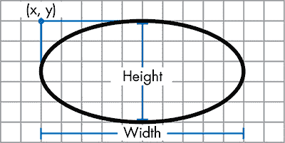

*图 3-8：椭圆绘制方法的四个参数*

要使用这些绘图方法，让我们编写一个程序，绘制出 图 3-9 中的面孔。


*图 3-9：绘制面孔*

要绘制面孔，你只需要绘制一个圆形和一些不同的椭圆，使用正确的参数。完整的程序请参见 列表 3-4。

```
 1 ' Face.sb
 2 GraphicsWindow.Title = "Face"
 3
 4 GraphicsWindow.BrushColor = "Yellow"         ' Color of the two ears
 5 GraphicsWindow.FillEllipse(20, 30, 10, 40)   ' Left ear
 6 GraphicsWindow.DrawEllipse(20, 30, 10, 40)   ' Left ear border
 7
 8 GraphicsWindow.FillEllipse(100, 30, 10, 40)  ' Right ear
 9 GraphicsWindow.DrawEllipse(100, 30, 10, 40)  ' Right ear border
10
11 GraphicsWindow.BrushColor = "Lime"           ' Color of the two eyes
12 GraphicsWindow.FillEllipse(40, 30, 10, 10)   ' Left eye
13 GraphicsWindow.DrawEllipse(40, 30, 10, 10)   ' Left eye border
14
15 GraphicsWindow.FillEllipse(80, 30, 10, 10)   ' Right eye
16 GraphicsWindow.DrawEllipse(80, 30, 10, 10)   ' Right eye border
17
18 GraphicsWindow.BrushColor = "SandyBrown"     ' Color of the nose
19 GraphicsWindow.FillEllipse(60, 40, 10, 20)   ' Nose
20 GraphicsWindow.DrawEllipse(60, 40, 10, 20)   ' Nose border
21
22 GraphicsWindow.BrushColor = "LightCyan"      ' Color of the mouth
23 GraphicsWindow.FillEllipse(50, 65, 30, 10)   ' Mouth
24 GraphicsWindow.DrawEllipse(50, 65, 30, 10)   ' Mouth border
25
26 GraphicsWindow.DrawEllipse(30, 10, 70, 70)   ' Face border
```

*列表 3-4：绘制史上最酷的椭圆面孔*

这个程序的输出如 图 3-10 所示。图中的所有椭圆都使用相同的笔宽和颜色，但你可以通过改变这些属性，给你的 Small Basic 绘图添加更多细节。让我们看看怎么做。

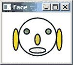

*图 3-10：* Face.sb 的输出

#### ***笔的大小和颜色***

要改变笔的大小和颜色，可以在绘制线条或形状之前设置以下属性：

```
GraphicsWindow.PenWidth = 20         ' Sets line width
GraphicsWindow.PenColor = "Green"    ' Sets line color
```

如果你想让程序每次运行时都有不同的效果，可以通过使用 `GraphicsWindow` 对象的 `GetRandomColor()` 方法每次改变笔的颜色。看看这个：

```
GraphicsWindow.PenColor = GraphicsWindow.GetRandomColor()
```

这个方法没有任何参数，这就是为什么 `GetRandomColor()` 方法的括号里什么也没有；它返回一个随机选定的颜色。试试看吧！

#### ***笔宽和形状大小***

在绘制三角形、矩形和椭圆时，你使用的笔宽会影响形状的大小。列表 3-5 显示了我们的意思。

```
 1 ' PenWidthDemo.sb
 2 GraphicsWindow.Title = "Pen Width Demo"
 3
 4 GraphicsWindow.PenWidth = 20                   ' Width of circle
 5 GraphicsWindow.PenColor = "Lime"               ' Color of circle
 6 GraphicsWindow.DrawEllipse(20, 20, 100, 100)   ' Circle border
 7
 8 GraphicsWindow.PenWidth = 1                    ' Width of square
 9 GraphicsWindow.PenColor = "Black"              ' Color of square
10 GraphicsWindow.DrawRectangle(20, 20, 100, 100) ' Square border
```

*列表 3-5：使用笔宽改变形状的大小*

这个程序使用宽度为 20 的笔绘制圆形的边框。图 3-11 显示了边框从正方形的周围延伸出 10 像素，尽管圆形和正方形具有相同的尺寸。当测量外部边缘时，输出圆形的直径为 120 像素，而不是指定的 100 像素。

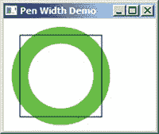

*图 3-11：* PenWidthDemo.sb 的输出

**试一试 3-3**

编写一个程序，绘制如图 3-12 所示的自行车。（提示：使用给定的网格线来确定不同形状的坐标，以便更容易编写代码。）

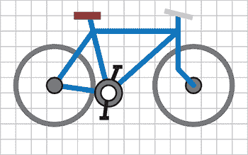

*图 3-12：绘制一辆自行车*

### **绘制文本**

一张图片可能胜过千言万语，但你也可以像这样在图形窗口中绘制文本：

```
GraphicsWindow.DrawText(x, y, "text")
```

`DrawText()`接受三个参数。前两个参数设置文本左上角的 x 和 y 坐标，第三个参数接受你要绘制的文本（或数字）字符串。记得将字符串放在引号内。

如果你想更改文本的显示方式，请使用表 3-1 中`GraphicsWindow`对象的属性。

**表 3-1：** 字体名称、大小、样式和颜色的`GraphicsWindow`属性

| **属性** | **默认值** | **描述** |
| --- | --- | --- |
| `FontName` | `"Tahoma"` | 字体名称 |
| `FontSize` | `12` | 字体大小 |
| `FontBold` | `"True"` | 字体是否加粗 |
| `FontItalic` | `"False"` | 字体是否斜体 |
| `BrushColor` | `"SlateBlue"` | 绘制文本的画笔颜色 |

如果你没有更改这些属性，Small Basic 将使用表 3-1 中列出的默认值。列表 3-6 中的程序更改了这些属性来绘制一些华丽的文本。

```
 1 ' Fonts.sb
 2 GraphicsWindow.Title = "Fonts"
 3 GraphicsWindow.BackgroundColor = "LightYellow"
 4 GraphicsWindow.FontName = "Times New Roman"
 5 GraphicsWindow.FontSize = 120
 6 GraphicsWindow.FontItalic = "True"
 7
 8 GraphicsWindow.BrushColor = "Silver"    ' Text shadow color
 9 GraphicsWindow.DrawText(5, 5, "Hello!") ' Shadow position/text
10
11 GraphicsWindow.BrushColor = "RosyBrown" ' Text color
12 GraphicsWindow.DrawText(0, 0, "Hello!") ' Position and text
```

*列表 3-6：尝试一些字体*

在第 3 行，`BackgroundColor`属性更改图形窗口的背景颜色。第 4 到 6 行设置在任何调用`DrawText()`时使用的字体的名称、大小和斜体属性。第 8 行使用`BrushColor`属性设置字体颜色，第 9 行从点(5, 5)开始绘制字符串`"Hello!"`。这一行绘制了你在图 3-13 中看到的背景阴影。在第 11 行，程序更改了`BrushColor`属性，然后第 12 行在略微不同的位置绘制了相同的字符串。这创建了带有背景阴影的文本效果，如图 3-13 所示。

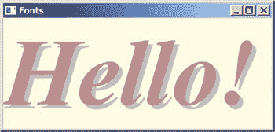

*图 3-13：* Fonts.sb 的输出

通过将文本层叠在其他文本上方，你可以创造一些很酷的效果。试着玩玩这段代码，看看你能做出什么！

你还可以通过使用`DrawBoundText()`方法将文本绘制为适应特定宽度：

```
GraphicsWindow.DrawBoundText(x, y, width, "text")
```

参数 `x`、`y` 和 `"text"` 的含义与 `DrawText()` 方法中的相同：`x` 和 `y` 是你开始绘制的位置，而 `"text"` 是要绘制的文本或数字字符串。第三个参数 `width` 告诉 Small Basic 输出中文本的最大可用宽度。如果文本超出了给定的宽度，它将继续换行。尽管文本所显示的矩形区域宽度是固定的，但文本会继续显示，因此矩形文本区域会根据需要垂直扩展。但是，如果一个单词太长，无法适应你定义的*边界*矩形（尤其是在字体过大的情况下），那么它会被截断！列表 3-7 中的程序和 图 3-14 中的输出会向你展示我们所说的意思。

```
 1 ' BoundTextDemo.sb
 2 GraphicsWindow.Title = "DrawBoundText Demo"
 3
 4 ' No clipping
 5 GraphicsWindow.FontSize = 15       ' Smaller font
 6 GraphicsWindow.DrawBoundText(10, 10, 70, "Today is my birthday")
 7
 8 ' With clipping
 9 GraphicsWindow.FontSize = 18       ' Larger font
10 GraphicsWindow.DrawBoundText(150, 10, 70, "Today is my birthday")
11 GraphicsWindow.DrawRectangle(150, 10, 70, 80)
```

*列表 3-7：包含文本的边界*

左侧不可见矩形中的文本会自动换行，以确保文本不会超出你指定的宽度。在右侧的*边界*矩形中，文本被截断，因为它太长无法适应。Small Basic 会显示三个点，即*省略号*，表示文本已经被截断。


*图 3-14：*BoundTextDemo.sb* 的输出*

### **插入图像**

有些图像可能太复杂，无法用基本形状绘制，或者它们可能需要花费太长时间来编码。相反，你可以提前用画图程序绘制这些图像，然后在你的应用程序中使用它们。`GraphicsWindow` 提供了两种方法来插入图像。尽管这些方法的名称以*Draw*开头，但它们实际上是在图形窗口中插入一个已有的图像：

```
GraphicsWindow.DrawImage(imageName, x, y)
GraphicsWindow.DrawResizedImage(imageName, x, y, width, height)
```

这两种方法都需要图像路径名以及 x 和 y 坐标来确定图像在图形窗口中的位置。`DrawResizedImage()` 方法额外接受两个参数（`width` 和 `height`），让你能够调整输入图像的大小。

列表 3-8 展示了带有示例图像的 `DrawImage()` 方法。

```
1 ' ImageDemo.sb
2 GraphicsWindow.Title = "Image Demo"
3 GraphicsWindow.Width = 320    ' Same width as background image
4 GraphicsWindow.Height = 240   ' Same height as image
5 GraphicsWindow.DrawImage("C:\Small Basic\Ch03\BkGnd.bmp", 0, 0)
6
7 GraphicsWindow.BrushColor = "White"    ' Text color
8 GraphicsWindow.FontSize = 50
9 GraphicsWindow.DrawText(10, 120, "Hello Moon!")
```

*列表 3-8：插入你的第一张图像*

程序开始时设置了 `GraphicsWindow` 的宽度和高度，分别为 320 和 240 像素，以匹配图像的大小。第 5 行调用了 `DrawImage()` 并传入了图像保存的路径名。在第 7 到第 9 行，程序在背景图像上绘制了白色文本 `Hello Moon!`。当你在电脑上运行这个程序时，确保将第 5 行中的路径设置为你电脑上 *BkGnd.bmp* 文件的正确位置。图 3-15 显示了输出结果。

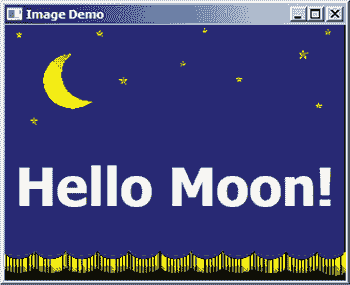

*图 3-15：*ImageDemo.sb* 的输出*

**注意**

*Small Basic 还可以从网络上绘制图像。以下是一个示例：*

```
GraphicsWindow.DrawImage("http://smallbasic.com/bkgnd.jpg", 0, 0)
```

### **编程挑战**

如果你遇到困难，可以访问 *[`nostarch.com/smallbasic/`](http://nostarch.com/smallbasic/)* 查找解决方案，并获取更多的资源和针对教师和学生的复习题目。

1.  编写一个程序，用线段连接以下六个点：（20, 110），（110, 50），（10, 50），（100, 110），（60, 20），（20, 110）。你得到的是什么形状？

1.  以下程序的输出是什么？

    ```
    GraphicsWindow.DrawLine(50, 18, 61, 37)
    GraphicsWindow.DrawLine(61, 37, 83, 43)
    GraphicsWindow.DrawLine(83, 43, 69, 60)
    GraphicsWindow.DrawLine(69, 60, 71, 82)
    GraphicsWindow.DrawLine(71, 82, 50, 73)
    GraphicsWindow.DrawLine(50, 73, 29, 82)
    GraphicsWindow.DrawLine(29, 82, 31, 60)
    GraphicsWindow.DrawLine(31, 60, 17, 43)
    GraphicsWindow.DrawLine(17, 43, 39, 37)
    GraphicsWindow.DrawLine(39, 37, 50, 18)
    ```

1.  以下程序的输出是什么？

    ```
    GraphicsWindow.DrawRectangle(10, 10, 90, 50)
    GraphicsWindow.DrawRectangle(15, 60, 75, 4)
    GraphicsWindow.DrawRectangle(34, 64, 6, 6)
    GraphicsWindow.DrawRectangle(74, 64, 6, 6)
    GraphicsWindow.DrawRectangle(30, 70, 75, 10)
    GraphicsWindow.DrawRectangle(20, 80, 80, 2)
    ```

1.  你家里最奇怪的东西是什么？用`DrawLine()`方法画出来。

以下问题显示了一个网格，以便你更容易绘制形状。你可以选择任何大小的网格。我们推荐使用 20 像素。

1.  编写一个程序，绘制这颗星星。

    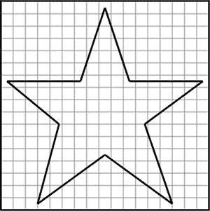

1.  编写一个程序，绘制这座银行，使用你喜欢的任何颜色。

    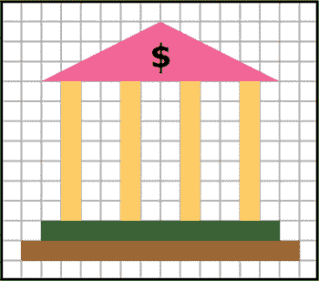

1.  编写一个程序，绘制这辆卡车。额外加分，添加前轮。

    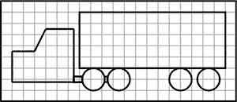

1.  编写一个程序，绘制像这样的交通信号灯。

    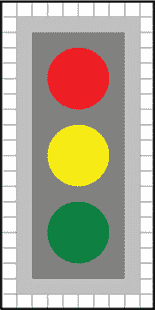

1.  编写一个程序，绘制像这样的火车。

    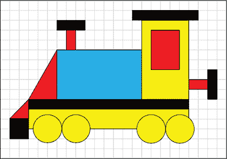

1.  编写一个程序，绘制以下形状。

    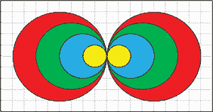

1.  编写一个程序，绘制这个人。

    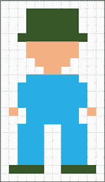

1.  编写一个程序，绘制一个类似这样的足球场。

    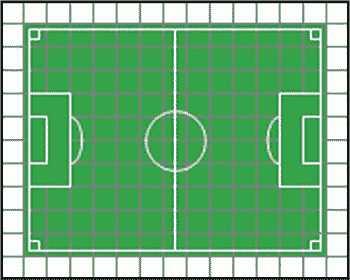
