## 第六章：5

**用海龟图形绘制形状**


在第三章中，你学会了如何使用代码绘制图形，但在 Small Basic 中，你可以编程让一只友好的海龟为你绘画！在本章中，你将探索 `Turtle` 对象。你还将学习如何使用 `For` 循环重复多次代码行来绘制美丽的设计。

### 认识海龟

在 Small Basic 编辑器中输入以下语句：

```
Turtle.Show()
```

然后点击 **运行**。瞧！海龟应该出现在图形窗口的中央（图 5-1），等待你的指令。

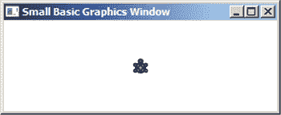

*图 5-1：你好，海龟！*

你可能会想，这个缓慢的生物能有多大用处，但不要低估它的能力。曾几何时，一只海龟赢得了与地球上最快的兔子的比赛！

Small Basic 的海龟使用 `GraphicsWindow` 对象的笔来绘制线条。它总是带着这支笔（也许它藏在它的壳里，旁边是海龟蜡），你可以决定笔是上还是下！当笔在下时，海龟在移动时会画出轨迹；当笔在上时，海龟移动时不会留下痕迹。你可以使用 `PenDown()` 和 `PenUp()` 方法命令海龟放下或抬起它的笔（参见图 5-2）。

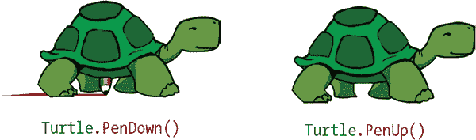

*图 5-2：演示* `PenUp()` *和* `PenDown()` *方法*

默认的笔状态是下，海龟从出生那天起就准备好绘画了。现在让我们探索它能做什么。

### 移动海龟

你可以输入命令告诉海龟该做什么。就像小智指挥比卡丘一样，你也可以指挥你的海龟。首先，让我们使用 `Turtle` 对象来告诉海龟移动！

在编辑器中输入这些代码行来推动它。然后点击 **运行**。

```
Turtle.Show()
Turtle.Move(100)
```

去吧，海龟，去吧！这个例子中的 `Move()` 方法命令海龟向前移动 100 像素。

现在让我们看看移动海龟的两种不同方式：绝对运动和相对运动。

#### *绝对运动*

使用*绝对运动*，你告诉海龟去图形窗口中的某个点。无论海龟在哪里，它都会移动到你选择的准确位置。

将海龟移动到图形窗口中的某个特定位置的一种方法是改变它的 `X` 和 `Y` 属性。要查看如何实现，请运行清单 5-1 中的程序。

```
1 ' SetTurtle.sb
2 Turtle.Show()
3 Program.Delay(1000)
4 Turtle.X = 100
5 Turtle.Y = 140
```

*清单 5-1：设置海龟的位置*

`Show()`方法（第 2 行）使海龟出现在图形窗口的中心附近（320, 240）。第 3 行的`Delay()`方法使程序暂停 1,000 毫秒（即 1 秒），这样你可以看到海龟的初始位置。第 4 行将海龟的`X`位置设置为 100，第 5 行将海龟的`Y`位置设置为 140。运行第 4 和第 5 行后，海龟将出现在图形窗口的 (100, 140) 位置，如图 5-3 所示。注意，海龟在移动到新位置时没有留下任何痕迹；就像海龟被捡起并放置到 (100, 140) 一样。

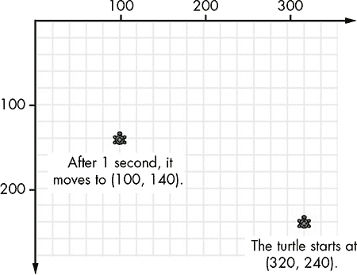

*图 5-3：通过设置海龟的`X`和`Y`属性来移动海龟*

另一种将海龟移动到图形窗口中绝对位置的方法是使用`MoveTo()`方法。此方法将目标位置的 x 和 y 坐标作为参数。运行示例 5-2 中的程序，查看该方法的效果。

```
1 ' MoveTo.sb
2 Turtle.Show()
3 Program.Delay(1000)
4 Turtle.MoveTo(100, 140)
```

*示例 5-2：使用绝对运动移动海龟*

你可以在图 5-4 中看到此程序的输出。再次强调，海龟从 (320, 240) 开始，朝北（第 2 行），程序暂停 1 秒以便你观察海龟的动作（第 3 行）。1 秒后，海龟转向 (100, 140)，然后开始缓慢地朝该点移动。这一次，海龟在移动时会留下轨迹（因为海龟的笔默认是放下的）。如果你在调用`MoveTo()`之前的任何地方添加`Turtle.PenUp()`，海龟将移动到 (100, 140) 而不留下任何痕迹。

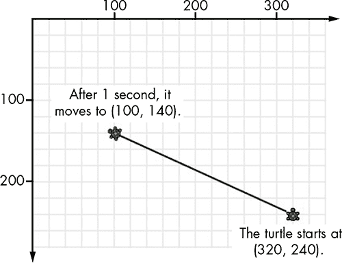

*图 5-4：使用`MoveTo()`设置海龟的绝对位置*

请注意，当它停止移动时，海龟保持朝向它转向的方向。它不会重新设置为朝北。比较此图与图 5-3，在图 5-3 中海龟仍然朝北，就像它被捡起并移动到新位置一样。

假设你希望海龟在完成它的旅程后面朝北方。在示例 5-2 的末尾添加以下语句：

```
Turtle.Angle = 0
```

当海龟到达 (100, 140) 时，它将原地转向朝北。试试看！参见图 5-5，了解`Angle`属性与海龟朝向之间的关系。


*图 5-5：对于海龟，0 表示北方，90 表示东方，180 表示南方，270 表示西方。*

正如你在图 5-5 中看到的，当你将海龟的`Angle`设置为 0 或 360 时，它面朝北方。你可以将海龟的`Angle`设置为 45，使其面朝东北；90，面朝东；135（东南）；180（南）；225（西南）；270（西）；315（西北）；以及 360（再次朝北）。当然，你也可以将海龟的`Angle`设置为任何你想要的数字。通过将`Turtle`对象的`Angle`属性设置为不同的数字，尝试看看海龟会朝向哪些方向。别忘了尝试负数。

#### *相对运动*

使用*相对运动*时，你告诉海龟从当前位置移动多远；也就是说，你告诉它相对于当前位置移动多远。

让我们练习一下，让海龟击中一个假想的目标。清单 5-3 展示了编程海龟击中目标的一种方法。

```
1 ' RelativeMotion.sb
2 Turtle.Show()
3 Turtle.Move(150)
4 Turtle.TurnRight()
5 Turtle.Move(100)
```

*清单 5-3：使用相对运动移动海龟*

输出结果如图 5-6 所示。第 3 行将海龟向上移动 150 像素，第 4 行将海龟右转，第 5 行让海龟前进 100 像素。

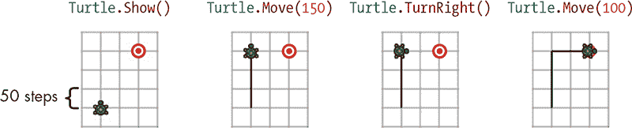

*图 5-6：使用相对运动命令移动海龟*

相对运动与绝对运动的区别在于，我们告诉海龟移动一定的距离，而不是告诉它去一个特定的坐标。

当你向`Move()`传递一个负数时，海龟会向后移动。你也可以使用`Turn()`方法命令海龟在原地按你想要的角度转动。输入清单 5-4 中的代码来尝试这些选项，然后运行程序看看实际效果。

```
1 ' Turn.sb
2 Turtle.Show()
3 Turtle.Turn(45)
4 Turtle.Move(100)
5 Turtle.Turn(-90)
6 Turtle.Move(-100)
```

*清单 5-4：使用相对运动转动海龟*

第 3 行将海龟右转 45 度。第 4 行让海龟前进 100 像素（见图 5-7 左图）。第 5 行的–90 将海龟左转 90 度。第 6 行让海龟后退 100 像素（见图 5-7 右图）。

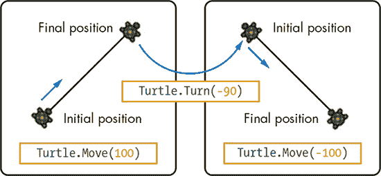

*图 5-7：说明海龟的* `Move()` *和* `Turn()` *方法*

#### *为你的步骤上色*

你可以通过`GraphicsWindow`的`PenWidth`和`PenColor`属性来设置海龟的画笔大小和颜色。例如，以下代码让海龟用一个宽度为 5 像素的红色画笔绘制。

```
GraphicsWindow.PenColor = "Red"
GraphicsWindow.PenWidth = 5
```

在命令海龟移动之前，先添加这段代码，然后观察会发生什么。

#### *控制你的速度*

`Turtle`对象还有一个你需要知道的属性。`Speed`属性设置海龟的移动速度。`Speed`的值范围是 1 到 10。跟着清单 5-5 来看看海龟如何在屏幕上飞速移动。

```
 1 ' TurtleSpeed.sb
 2 Turtle.Show()
 3 Turtle.Speed = 2    ' Sets the initial speed to 2
 4 Turtle.Move(100)    ' Moves the turtle forward 100 pixels
 5 Turtle.Speed = 5    ' Changes the speed to 5
 6 Turtle.TurnRight()  ' Turns the turtle to its right
 7 Turtle.Move(100)
 8 Turtle.Speed = 9    ' Changes the speed to 9
 9 Turtle.TurnRight()
10 Turtle.Move(100)
```

*清单 5-5：设置海龟的速度*

第 3 行将乌龟的速度设置为 2。乌龟缓慢地移动 100 像素（第 4 行），然后在第 5 行加速。你可以看到乌龟转向右侧（第 6 行）并快速前进 100 像素（第 7 行）。接下来，你将乌龟的速度设置为 9（第 8 行）。乌龟快速向右转（第 9 行），并冲刺前进另 100 像素（第 10 行）。如果你不想在绘制时看到乌龟慢慢移动，可以在程序开始时将 `Speed` 属性设置为 10。乌龟将以非常快的速度移动，你几乎看不见它。它是超级乌龟！

**动手试一试 5-1**

编写一个程序，让你的乌龟画出这个星形图案（图 5-8）。每个点的坐标已包含在内。

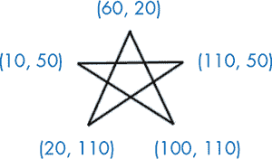

*图 5-8：一个星形图案*

### 介绍 For 循环

当你开始编写更长的程序时，你需要重复某些语句。例如，让我们让乌龟画一个正方形：输入列表 5-6 中显示的代码。

```
1 ' Square1.sb
2 Turtle.Move(60)    ' Moves 60 pixels
3 Turtle.TurnRight() ' Turns right 90 degrees
4 Turtle.Move(60)    ' Moves 60 pixels
5 Turtle.TurnRight() ' Turns right 90 degrees
6 Turtle.Move(60)    ' Moves 60 pixels
7 Turtle.TurnRight() ' Turns right 90 degrees
8 Turtle.Move(60)    ' Moves 60 pixels
9 Turtle.TurnRight() ' Turns right 90 degrees
```

*列表 5-6：让乌龟画一个正方形*

乌龟开始时面朝上方。此代码指示乌龟向上移动 60 像素，绘制正方形的一条边，然后向右转 90 度，移动 60 像素绘制另一条边，再向下转 90 度，移动 60 像素绘制第三条边，向左转 90 度，再移动 60 像素完成正方形。最后，乌龟再向右转 90 度，恢复最初的上方向。查看图 5-9 中的结果。你的屏幕看起来一样吗？

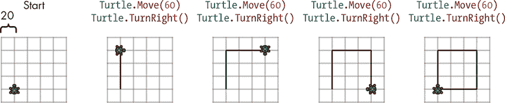

*图 5-9：使用移动和转向命令绘制正方形*

你将 `Move(60)` 和 `TurnRight()` 方法重复了四次。计算机不介意重复这些任务，但你输入这些代码时会觉得很无聊。如果你能用更简单的方法让乌龟绘制这个正方形，那该多好啊？

当然可以！你可以让乌龟画出与列表 5-6 中相同的正方形，只需使用几行代码。使用一个 `For` 循环，就像列表 5-7 中所示。

```
1 ' Square2.sb
2 For I = 1 To 4       ' Repeats 4 times
3   Turtle.Move(60)    ' Draws one side
4   Turtle.TurnRight() ' Turns right 90 degrees
5 EndFor
```

*列表 5-7：使用 `For` 循环让乌龟画正方形*

`For` 循环运行 `Turtle.Move(60)` 和 `Turtle.TurnRight()` 四次。你会在知道重复执行某些代码的次数时使用 `For` 循环（有关 `For` 循环的更多内容，参见第十三章）。在这个例子中，程序启动循环，运行两行代码，然后返回到循环的起始位置，再次运行。这会运行四次，然后退出循环。试试看吧！

在这个简短的程序中，你将使用三个新的 Small Basic 关键字：`For`、`To` 和 `EndFor`。

**注意**

*关键字（*`For`*、`To`*和*`EndFor`*）不需要像在 Listing 5-7 中那样大写，`For`*循环中的语句也不需要缩进，但这些是默认格式。编辑器会在你输入时自动缩进`For`*循环中的语句，使代码更易读。*

Figure 5-10 展示了发生了什么。

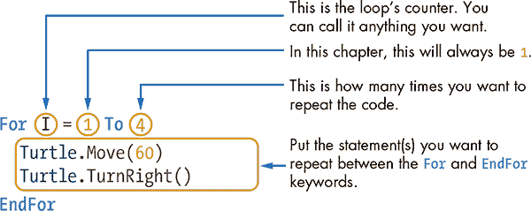

*Figure 5-10: `For`* 循环的各部分

要重复代码行，只需将你想要重复的语句放在`For`和`EndFor`关键字之间。如果你想重复这些语句四次，可以这样写：

```
For I = 1 To 4
```

变量`I`是*计数器*。它跟踪循环执行了多少次，还剩多少次每次程序运行时，它会将计数器加一。

下次在学校遇到麻烦时记得使用`For`循环！如果老师抓到你在嚼口香糖，要求你写*我以后不在课堂上嚼口香糖* 100 次，Small Basic 可以来救你！这时你可以这样写：

```
For I = 1 To 100
  TextWindow.WriteLine("I won't chew gum in class again.")
EndFor
```

试试看吧。不是在课堂上嚼口香糖；是试试这个程序！

**注意**

*程序员通常使用一个字母的变量名来命名循环计数器（比如*I、J*或*K*），但其他任何名字也可以。如果你使用大写或小写字母也没关系——Small Basic 会将*I*和*i*视为同一个变量。*

**尝试一下 5-2**

预测以下程序的输出。然后运行程序来检查你的答案。

```
GraphicsWindow.PenColor = "Red"
GraphicsWindow.PenWidth = 3

For I = 1 To 4
  Turtle.Move(30)
  Turtle.Turn(-60)
  Turtle.Move(30)
  Turtle.Turn(120)
  Turtle.Move(30)
  Turtle.Turn(-60)
  Turtle.Move(30)
  Turtle.TurnRight()
EndFor
```

### 绘制规则多边形

你可以轻松地修改绘制正方形的程序（Listing 5-7）来绘制其他多边形。（别那么“死板”！）*多边形*只是一个简单的闭合图形。关于一些例子，看看 Figure 5-11 中的三个多边形。

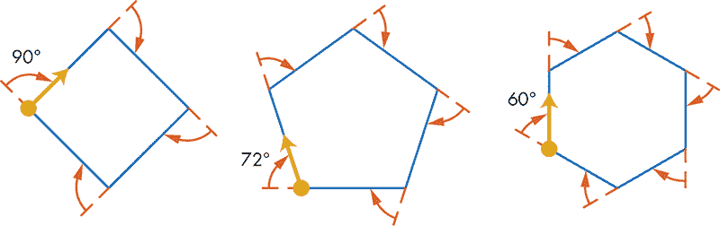

*Figure 5-11: 三个多边形的外角*

你使用一种通用的模式来绘制这些形状。要在 Figure 5-11 中绘制正方形，你需要画四条边，每画一条边后转 90 度（即 360 度除以 4）。对于五边形（中间的多边形），你需要画五条边，每画一条边后转 72 度（360 度除以 5）。对于六边形（右侧的多边形），你需要画六条边，每画一条边后转 60 度（360 度除以 6）。你看出规律了吗？角度是 360 度除以边的数量。有了这个规律，你可以在 Listing 5-8 中创建绘制多边形的程序。

```
1 ' Polygon.sb
2 numSides = 5       ' Set to 3 (triangle), 4 (square), 5 (pentagon)...
3
4 For I = 1 To numSides
5   Turtle.Move(60)  ' Polygon's side length
6   Turtle.Turn(360 / numSides)
7 EndFor
```

*Listing 5-8: 绘制规则多边形*

要绘制不同的多边形，只需将第 2 行中`numSides`变量的整数值替换为其他数字。Figure 5-12 展示了你可以用这个程序绘制的八个多边形（它们的边长相同）。试试看吧！

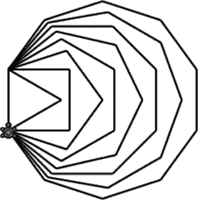

*Figure 5-12: 使用不同`numSides`值时* Polygon.sb *的输出*

当你为`numSides`设置一个较大的数值时，会发生什么？多边形开始看起来像一个圆形！将`numSides`设置为 36，将第 5 行的`Move(60)`改为`Move(20)`，然后看看会发生什么。

#### *星星诞生了*

根据你现在对不同形状角度的了解，当你将海龟按 72 度的倍数旋转时（这是你用来绘制五边形的角度），比如 2 *×* 72 = 144 度或 3 *×* 72 = 216 度，会发生什么？运行清单 5-9 中显示的程序，看看结果。

```
1 ' PentaStar.sb
2 For I = 1 To 5
3   Turtle.Move(150)
4   Turtle.Turn(144)  ' The turn angle is 2 * 72
5 EndFor
```

*清单 5-9：绘制五角星*

如果转角是 144 而不是 72，输出的将是一个星形，而不是五边形。查看图 5-13 看看是如何实现的。

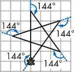

*图 5-13：展示* PentaStar.sb *的输出结果*

**注意**

*如果你想在创建完作品后隐藏海龟，可以在程序的最后调用* `Turtle.Hide()` *。*

尝试通过不同的多边形和转角进行实验，发现你可以创造出哪些不同的星形。图 5-14 展示了三个示例，帮助你开始实验。

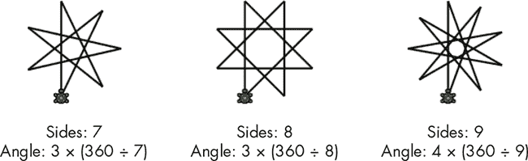

*图 5-14：通过使用清单 5-9 绘制不同的星形*

**动手试试 5-3**

编写一个程序，让海龟绘制图 5-15 中的五边形。（提示：使用`Angle`属性来设置海龟的初始方向。）

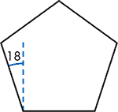

*图 5-15：五边形*

#### *使用嵌套循环创建多边形艺术*

你可以使用多边形和星形创造出美丽的图案。在本节中，我们将通过将正方形旋转 12 次来绘制一个图案（见图 5-16）。


*图 5-16：旋转多边形的输出* RotatedPolygon.sb

要制作这幅艺术作品，你将使用*嵌套循环*，即将一个循环放在另一个循环内部。每次外部循环运行时，它也会运行内部循环。清单 5-10 展示了如何使用嵌套循环创建图 5-16 中的漂亮图案。

```
 1 ' RotatedPolygon.sb
 2  numSides = 4        ' Set to 3 (triangle), 4 (square)...
 3  repeatCount = 12    ' How many times to rotate the polygon
 4
 5 For I = 1 To repeatCount
 6   ' 1) Draw the desired polygon
 7   For J = 1 To numSides
 8     Turtle.Move(60)  ' The polygon's side length
 9     Turtle.Turn(360 / numSides)
10   EndFor
11   ' 2) Turn the turtle a little
12   Turtle.Turn(360 / repeatCount)
13 EndFor
```

*清单 5-10：绘制旋转多边形的图案*

这个程序有两个循环，一个嵌套在另一个里面。外部循环（第 5 行）使用名为`I`的循环计数器，并重复 12 次绘制 12 个正方形。在每一轮外部循环中，程序执行两个任务。首先，它使用另一个名为`J`的循环计数器（第 7 行）绘制一个正方形。然后，在第 12 行，它会让海龟稍微转动一下（在这种情况下，360° ÷ 12 = 30°），然后再次执行第 5 行的循环，绘制下一个正方形。真是太炫了！

使用嵌套循环时，确保为循环计数器使用不同的名称。在清单 5-10 中，我们为外部循环使用了`I`变量，为内部循环使用了`J`变量。

修改`numSides`和`repeatCount`变量，尝试不同的多边形和旋转次数。图 5-17 展示了你可以通过旋转六边形创建的一些形状。尝试更改笔的颜色和宽度，为你的作品增添一些别致的元素。可能性是无穷无尽的！

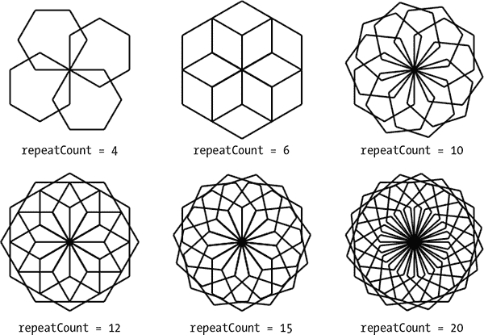

*图 5-17：通过旋转六边形创建的图案*

**尝试 5-4**

预测以下程序的输出。在运行代码之前，尽量想象代码的结果。然后运行代码，检查你的答案。

```
repeatCount = 5

For I = 1 To repeatCount
  For J = 1 To 4        ' Draws a square
    Turtle.Move(60)
    Turtle.Turn(90)
  EndFor

  For J = 1 To 3        ' Draws a triangle
    Turtle.Move(60)
    Turtle.Turn(120)
  EndFor

  Turtle.Turn(360 / repeatCount)
EndFor
```

#### *无尽的图形*

在清单 5-10 中，你通过旋转单个多边形创建了图案。你也可以使用两个或更多不同大小的多边形来创建图案。为了简化代码，我们将绘制两个不同大小的多边形并旋转它们。

运行清单 5-11 中显示的程序，看看你能创建什么图案。

```
 1 ' PolygonArt.sb
 2 Turtle.Speed = 10
 3 numSides = 6     ' Set to 3 (triangle), 4 (square)...
 4 repeatCount = 8  ' How many times to rotate
 5 sideLen1 = 30    ' Side length of polygon 1
 6 sideLen2 = 40    ' Side length of polygon 2
 7
 8 For I = 1 To repeatCount
 9   For J = 1 To numSides  ' Draws the first polygon
10     Turtle.Move(sideLen1)
11     Turtle.Turn(360 / numSides)
12   EndFor
13
14   For J = 1 To numSides  ' Draws the second polygon
15     Turtle.Move(sideLen2)
16     Turtle.Turn(360 / numSides)
17   EndFor
18
19   ' Turns the turtle to prepare for the next round
20   Turtle.Turn(360 / repeatCount)
21 EndFor
```

*清单 5-11：旋转两个相似的多边形*

图 5-18 展示了这个程序的输出。该程序旋转了两个六边形（第一个边长为 30，第二个边长为 40）八次。第 8 行的外循环会根据`repeatCount`中的数字重复执行。每次程序循环时，代码会执行三个动作：

1.  使用`sideLen1`中的边长绘制第一个多边形（第 9-12 行）。

1.  使用`sideLen2`中的边长绘制第二个多边形（第 14-17 行）。

1.  将海龟转向，准备下一轮循环（第 20 行）。

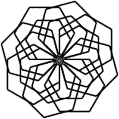

*图 5-18：* PolygonArt.sb 的输出

现在尝试使用图 5-19 中的`repeatCount`值，创建许多不同的图案。尝试将`sideLen1 = 40`和`sideLen2 = 60`！

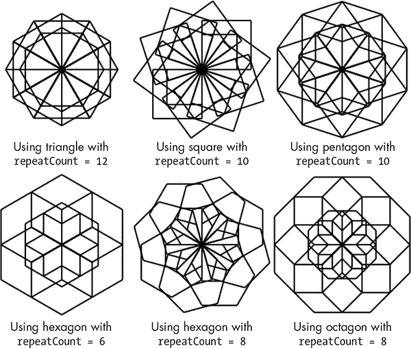

*图 5-19：你可以通过实验* PolygonArt.sb 创建的一些图案

尝试这个程序，看看你还能发现什么其他形状！

**尝试 5-5**

修改清单 5-11，绘制三个不同大小的多边形（而不是两个），然后旋转它们。将你的发现保存到下一个艺术画廊中。（或者，如果你不想成为百万富翁，可以访问*[`tiny.cc/turtlepatterns/`](http://tiny.cc/turtlepatterns/)*并与全世界分享！）

### 编程挑战

如果遇到问题，可以查看*[`nostarch.com/smallbasic/`](http://nostarch.com/smallbasic/)*，获取解决方案、更多资源以及教师和学生的复习问题。

1.  这段代码绘制了一个圆：

    ```
    For K = 1 To 36
      Turtle.Move(6)
      Turtle.Turn(10)
    EndFor
    ```

    编写一个程序，让海龟重复这段代码 12 次，创建如下图案：

    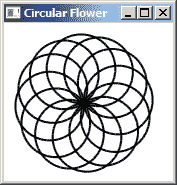

1.  编写一个程序，绘制像这样的花盆：

    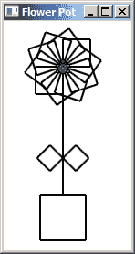

1.  重新创建以下代码并进行实验：

    ```
    For I = 1 To 20    ' Repeats 20 times
      For K = 1 To 36  ' Draws a circle
        Turtle.Move(12)
        Turtle.Turn(10)
      EndFor
      Turtle.Turn(18)  ' Gets ready for next circle
      Turtle.Move(12)  ' Moves a little bit before drawing next circle
    EndFor
    ```

    修改`Move()`的距离，在旋转每个圆之后发现新图案！

    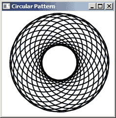
