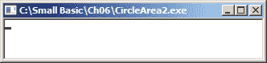
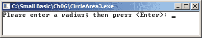

## 6

**获取用户输入**


为了执行有用的任务或提供有用的信息，一些程序需要来自您的输入。例如，在 Microsoft Word 中，您输入文本，点击按钮使其看起来更好，并输入文件名以保存它。在网页浏览器中，您点击链接或输入 URL 或搜索词来找到网页。在绘图程序中，您通过点击和拖动鼠标来绘制。当您使用程序并向其提供帮助其完成工作的信息时，这些信息被称为*用户输入*。

程序需要一种方式来向用户请求输入，处理这些输入，并做出正确的响应。能够做到这一点的程序是*交互式的*。在本章中，您将通过使程序能够接受并响应用户输入（该输入将是字符串和数字的形式）来让程序变得互动。

### 与计算机对话

到目前为止，您的程序所需的所有信息都在源代码中。例如，看看清单 6-1 中的程序。

```
1 ' CircleArea.sb
2 radius = 5
3 area = 3.1416 * radius * radius
4 TextWindow.WriteLine("Area = " + area)
```

*清单 6-1：计算圆的面积*

这个程序在第 2 行使用一个固定值 5 作为半径。这被称为*硬编码*数据。硬编码数据是程序的一部分。如果您想要更改这些数据，必须更改源代码。例如，要使用不同的半径来计算圆的面积，您需要打开文件，在代码中更改半径值，保存文件并运行新代码。每次想要更改变量的值时这样做非常麻烦。而且如果将这段代码交给一个不懂编程的人，它就不会很有用。

#### *请输入您的号码？*

很显然，如果您能计算任何圆的面积，而无需更改源代码，那将是最好的。所以让我们来探索如何直接读取用户输入的值。我们希望程序询问用户输入半径的值，然后在计算中使用该值。为此，您将使用 `TextWindow` 方法 `ReadNumber()`。将清单 6-1 中的第 2 行替换为以下语句：

```
radius = TextWindow.ReadNumber()
```

当此语句运行时，文本窗口中会出现一个闪烁的光标，如图 6-1 所示。光标是程序的方式告诉你：“轮到你输入了。我在等你。别让我过来找你！”



*图 6-1：运行* `ReadNumber()` *方法*

当用户输入一个数字并按下 ENTER 键时，输入会被存储，供程序的其余部分使用。用户输入的数字现在存储在 `radius` 变量中。

**注意**

*运行程序并尝试输入一个非数字字符。会发生什么？程序不会接受任何不是数字的输入！这就是该方法被命名为* `ReadNumber()` *的原因。*

#### *向计算机自我介绍*

程序还可以接受用户以文本或字符串的形式输入数据。假设我们想要用玩家的名字来问候他们。我们将把玩家的名字存储在一个名为`userName`的变量中，但使用一个新的`TextWindow`方法，叫做`Read()`。运行以下程序，并在看到光标时输入你的名字：

```
userName = TextWindow.Read()
TextWindow.Write("Hello " + userName + ". ")
TextWindow.WriteLine("It's really nice to meet you.")
```

第一条语句接受用户在文本窗口中输入的文本，并将其存储在`userName`中。程序然后用用户的名字来问候他们。

那么，`Read()`和`ReadNumber()`有什么区别呢？`Read()`的工作方式和`ReadNumber()`完全相同：它们都会显示一个闪烁的光标，并等待用户输入并按下 ENTER。事实上，你甚至可以使用`Read()`来获取数字。但`ReadNumber()`只接受用户输入的*数字*，因此我们建议在你需要用户输入数字时使用它。

#### *为输入编写提示*

一个闪烁的光标没有任何提示，无法告诉用户应输入何种数据（比如数字、姓名、地址或最喜欢的猴子类型）。除非你的程序是为魔术师或像教授 X 这样的读心术师编写的，否则你应该在允许程序从`Read()`或`ReadNumber()`接受输入之前，提供一些指引。为此，你将显示一个*提示*，这是告诉用户应输入哪种数据的消息。

从清单 6-1 中，将第 2 行替换为以下两行：

```
TextWindow.Write("Please enter a radius; then press <Enter>: ")
radius = TextWindow.ReadNumber()
```

首先，我们调用`Write()`方法并传递一条消息来显示。在这个程序中，你传递的消息是一个提示，告诉用户输入半径的值并按下 ENTER。你用冒号结束提示，以便告诉用户程序在等待键盘输入。（你可以不加冒号，但这样会让用户更清楚。）使用`Write()`而不是`WriteLine()`，这样光标就会停留在与提示相同的行上。调用`Write()`后，接着调用`ReadNumber()`来接受用户输入的数字并将其存储在`radius`变量中。

添加这两条语句后，运行你的程序，应该会看到类似于图 6-2 的内容。



*图 6-2：文本窗口等待用户输入*

当 Small Basic 执行语句`radius = TextWindow.ReadNumber()`时，它会等待用户输入一个数字并按下 ENTER。程序不会在用户按下 ENTER 之前读取他们输入的内容。当用户按下 ENTER 后，程序会获取用户的输入，并将其赋值给`radius`变量。然后，程序会继续执行`ReadNumber()`方法后的语句。

现在你已经接受了用户的半径，剩下的就是计算面积并显示结果。清单 6-2 展示了完整的程序。

```
1 ' CircleArea3.sb
2 TextWindow.Write("Please enter a radius; then press <Enter>: ")
3 radius = TextWindow.ReadNumber()
4
5 area = 3.1416 * radius * radius
6 TextWindow.WriteLine("Area = " + area)
```

*清单 6-2：让用户输入半径*

让我们来看一下如果输入半径为 8 时，输出会是什么样子：

```
Please enter a radius; then press <Enter>: 8
Area = 201.0624
```

自己试试看吧！

#### *请稍等片刻（暂停）*

有时你可能需要向用户展示一些说明（比如解释“捉迷藏”游戏的规则），然后等待他们阅读这些说明。例如，你可能会显示说明内容，并跟上“按任意键继续...”的提示，然后等待用户按键表示他们准备继续。你可以通过使用`Pause()`方法来实现这一点。

为了看到这个方法的实际效果，让我们写一个程序，把计算机变成一个智慧机器。每次用户按下一个键时，计算机会显示一条新的智慧名言。该程序如清单 6-3 所示。

```
 1 ' WisdomMachine.sb
 2 TextWindow.WriteLine("WISDOM OF THE DAY")
 3
 4 TextWindow.WriteLine("A friend in need is a friend indeed.")
 5 TextWindow.Pause()
 6
 7 TextWindow.WriteLine("A hungry man is an angry man.")
 8 TextWindow.Pause()
 9
10 TextWindow.WriteLine("Love your enemies. They hate that.")
```

*清单 6-3：演示* `Pause()` *方法*

在显示第一句智慧名言（第 4 行）之后，程序调用`Pause()`给用户时间阅读（第 5 行）。这个调用会显示“按任意键继续...”并等待用户按键。当用户按下一个键时，程序会显示下一句智慧名言（第 7 行），然后再次暂停（第 8 行）。程序会继续这样做，直到执行最后一句话。向程序中添加更多智慧名言，然后与他人分享！

如果你想显示与“按任意键继续...”不同的语句，例如“按任意键查看下一条智慧名言...”，该怎么办呢？好消息是，Small Basic 为此提供了`PauseWithoutMessage()`方法。你可以像平常一样使用`Write()`或`WriteLine()`编写自定义提示，然后调用`PauseWithoutMessage()`等待用户。试试看吧。将清单 6-3 中第 5 行和第 8 行的`Pause()`调用替换为以下语句：

```
TextWindow.WriteLine("Press any key to see the next line of wisdom...")
TextWindow.PauseWithoutMessage()
```

你的程序运行方式与之前相同，但使用了更具描述性的提示。

### 处理用户输入

让我们通过编写几个程序来运用你学到的新知识，这些程序将从用户那里读取输入，处理输入，并将输出显示给用户。

#### *将华氏度转换为摄氏度*

接下来，你将创建一个程序，将温度从华氏度转换为摄氏度。程序会提示用户输入华氏温度，然后使用以下公式将其转换为摄氏度：

*C* = (5 ÷ 9) × (*F* – 32)

多次运行清单 6-4 中的程序，看看它是如何工作的。要使用度符号，请按住 ALT 键，输入数字小键盘上的`248`，然后释放 ALT 键。

```
1 ' Fahrenheit2Celsius.sb
2 TextWindow.Write("Enter a temperature in °F: ")
3 F = TextWindow.ReadNumber()
4 C = (5 / 9) * (F - 32)
5 C = Math.Round(C)  ' Rounds to nearest integer
6 TextWindow.WriteLine(F + " °F = " + C + " °C")
```

*清单 6-4：将华氏度转换为摄氏度*

首先，程序提示用户输入温度。当用户按下 ENTER 键时，输入的值会被赋给变量 `F`。然后，程序将存储在 `F` 中的值转换为摄氏度，并将结果存储在变量 `C` 中（这一切都在第 4 行完成）。接下来，程序在第 5 行使用 `Math.Round()` 对 `C` 的当前值进行四舍五入，将四舍五入后的值存储回 `C`，替换掉原来的值。你将在第七章中学习更多关于 `Round()` 方法的内容，但我们在这里使用它是为了让程序的输出更易读。最后，程序在第 6 行显示输出结果。

**动手实践 6-1**

尝试猜测以下程序的功能。运行它来检查你的答案：

```
TextWindow.Write("How old are you? ")
age = TextWindow.ReadNumber()
TextWindow.WriteLine("In ten years, you'll be " + (age + 10))
TextWindow.WriteLine("Wow! You'll be so old!")
```

#### *计算数字平均值*

让我们编写一个程序，计算用户提供的四个数字的平均值。实现这个目标有几种方式；第一种是使用五个变量，如清单 6-5 所示。

```
1 ' Avg1.sb
2 TextWindow.Write("Enter 4 numbers. ")
3 TextWindow.WriteLine("Press <Enter> after each one:")
4 n1 = TextWindow.ReadNumber()
5 n2 = TextWindow.ReadNumber()
6 n3 = TextWindow.ReadNumber()
7 n4 = TextWindow.ReadNumber()
8 avg = (n1 + n2 + n3 + n4) / 4
9 TextWindow.WriteLine("Average = " + avg)
```

*清单 6-5: 计算四个数字的平均值*

当我们输入 10、20、15 和 25 时，查看输出：

```
Enter 4 numbers. Press <Enter> after each one:
10
20
15
25
Average = 17.5
```

程序提示用户输入四个数字，每输入一个数字后按下 ENTER 键。它逐个读取这些数字，并将它们保存在四个变量中：`n1`、`n2`、`n3` 和 `n4`（第 4 到 7 行）。然后，它计算这些数字的平均值，并将平均值存储在变量 `avg` 中（第 8 行），最后显示结果（第 9 行）。

清单 6-6 展示了另一种编写此程序的方式。输入这个程序后运行它。这次你将只使用一个名为 `sum` 的变量。

```
1 ' Avg2.sb
2 TextWindow.Write("Enter 4 numbers. ")
3 TextWindow.WriteLine("Press <Enter> after each one:")
4 sum = TextWindow.ReadNumber()
5 sum = sum + TextWindow.ReadNumber()
6 sum = sum + TextWindow.ReadNumber()
7 sum = sum + TextWindow.ReadNumber()
8 TextWindow.WriteLine("Average = " + (sum / 4))
```

*清单 6-6: 使用累加器计算四个数字的平均值*

为了理解程序是如何工作的，假设用户输入了数字 10、20、15 和 25 作为回应。所以，在第 4 行，`sum` 变成了 10。在第 5 行，第二个数字（20）加到第一个数字（10）上，结果保存在 `sum` 变量中（总共 30）。在第 6 到 7 行，第三个数字（15）和第四个数字（25）被加到一起并保存在 `sum` 中（总共 70）。程序然后显示平均值，即 `sum / 4`，给用户看（第 8 行）。

因为 `sum` 变量不断将输入值累加到自己上（或称为积累），它被称为*累加器*（也称为*累计和*）。(这可能类似于你积累发圈或宝可梦卡片的方式，但这些数字只占用计算机内存，不会让你的房间变得杂乱。)

#### *读取文本*

接下来，让我们编写一个简单的程序，使用莎士比亚名言中的单词来构建搞笑的句子：“*To be* or not to *be*: that is the *question*。”你将要求用户输入两个动词和一个名词，然后用这些输入替换莎士比亚名言中的 *be*、*be* 和 *question*。清单 6-7 展示了完整的程序。

```
 1 ' Silly.sb
 2 TextWindow.Write("Please enter a verb: ")
 3 verb1 = TextWindow.Read()
 4
 5 TextWindow.Write("Please enter another verb: ")
 6 verb2 = TextWindow.Read()
 7
 8 TextWindow.Write("Now, please enter a noun: ")
 9 noun = TextWindow.Read()
10
11 TextWindow.Write("To " + verb1)
12 TextWindow.Write(" or not to " + verb2 + ":")
13 TextWindow.Write(" that is the " + noun + ".")
14 TextWindow.WriteLine("")
```

*清单 6-7: 搞笑的莎士比亚句子*

当我们运行这段代码时，我们输入了*eat*、*swim* 和 *cow*。这是输出结果：

```
Please enter a verb: eat
Please enter another verb: swim
Now, please enter a noun: cow
To eat or not to swim: that is the cow.
```

尝试一下，然后回来。我们等你。你回来了么？你的输出比我们的更好笑吗？那就去给别人看看吧！

**试试看 6-2**

编写一个互动的 Mad Libs 风格程序，要求用户输入他们最喜欢的公主的名字（比如白雪公主）、某个邪恶的东西、公主学校的名字、某个美味的东西、一个矮小巫师的名字、某个他们永远不会卖掉的珍贵物品、一个动词、小生物的名称和超级英雄的力量。

然后向用户展示以下故事，并用用户的输入替换方括号中的词语：

“公主[PrincessName]正在穿越森林，突然邪恶的[SomethingEvil]跳出来向她递了一只苹果。公主[PrincessName]拒绝了，因为她的母亲让她去[NameOfSchool]，在那里她学到了不要从陌生人那里接受未包装的食物（因为那可能是被下了毒的）。于是公主[PrincessName]继续穿越森林，直到她遇到了一座由[SomethingYummy]做成的房子！她不想破坏私人财产，所以继续走。接下来，公主[PrincessName]遇到了一个纺车，纺车旁站着一个名叫[ShortWizard’sName]的小个子巫师，他诱使她使用一个魔法纺车来制造黄金（以交换她的[SomethingValuable]）。但是公主[PrincessName]的母亲早就告诉过她，当她还是婴儿时，一位邪恶的仙女对她施下了诅咒，如果她在纺车上刺破手指，她将永远[Verb]。因此，公主[PrincessName]继续前行，最终安全回到家，家里有七个[SmallCreatures]，她把自己锁在房间里过完了余生，因为她拥有[SuperHeroPower]的力量。”

然后制作一个自己的互动故事程序，创建一个新角色（比如英雄、忍者、海盗，或者小马宝莉），并分享它！

### 编程挑战

如果你遇到困难，可以查看 *[`nostarch.com/smallbasic/`](http://nostarch.com/smallbasic/)*，这里有解决方案以及更多资源和针对教师和学生的复习问题。

1.  使用 Small Basic，你可以轻松将你的计算机变成一个数字魔法师！打开本章节文件夹中的 *Magician.sb* 文件并运行它。解释这个程序是如何工作的。

1.  创建一个愚蠢的 Mad Libs 风格游戏，使用这个短语：“一个人的垃圾是另一个人的宝藏。”这个短语的另一个版本是：“一个人的失落是另一个人的收获。”在你的版本中，要求用户提供两个活物名称和两个不同的名词。然后让你的程序输出如下格式：“一个[Creature1]的[Noun1]是另一个[Creature2]的[Noun2]。”

1.  伊芙的妈妈正在举办车库销售。因为伊芙想赚些钱，她在车道上摆了张桌子，卖柠檬水、饼干和她亲手做的贺卡（她是个天才销售员，所以卖得很好）。通过编写一个程序，帮助伊芙计算顾客给她的钱，程序会要求伊芙输入她赚到的美元、quarters（四分之一美元硬币）、dimes（十分之一美元硬币）、nickels（五分之一美元硬币）和 pennies（分币）的数量。然后，程序会将这些钱转换成总金额，以美元和分（比如 $23.34）的形式显示出来。尝试使用以下金额来测试你的程序，确保它能正常工作：

    a. 35 美元，3 个 quarter（四分之一美元硬币），3 个 penny（分币）

    b. 2 美元，1 个 quarter（四分之一美元硬币），2 个 penny（分币）

    c. 10 美元，1 个 nickel（五分之一美元硬币），3 个 penny（分币）

    d. 6 美元，1 个 quarter（四分之一美元硬币），3 个 penny（分币）

    e. 3 美元，2 个 quarter（四分之一美元硬币），1 个 dime（十分之一美元硬币），1 个 nickel（五分之一美元硬币），3 个 penny（分币）

    f. 1 美元，2 个 dime（十分之一美元硬币），1 个 nickel（五分之一美元硬币），4 个 penny（分币）
