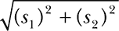
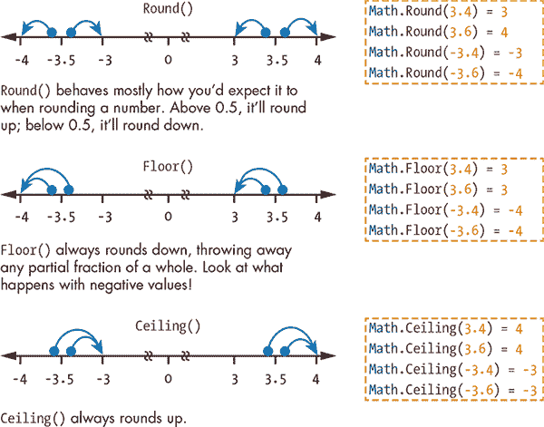
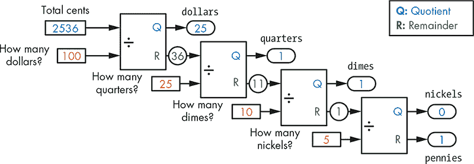
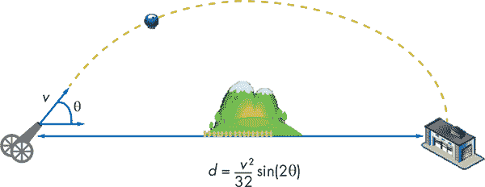
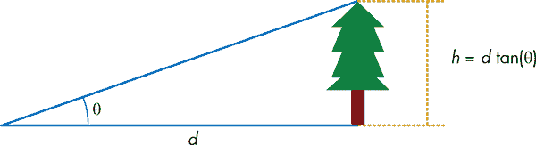
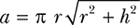
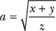

## **7**

**用数学赋能程序**


如果数学让你感到无聊或害怕，那也没关系。你很快就会发现，Small Basic 让你编写执行数学运算的程序变得非常简单。许多程序仅使用加法、减法、乘法和除法等基本运算。对于这些类型的问题，你只需要四个基本的数学运算符（`+`、`–`、`*`和`/`）。星号（`*`）表示乘法，而斜杠（`/`）表示除法。

其他程序可能需要使用一些你在代数中学过的数学函数（例如平方根、绝对值和三角函数）。Small Basic 的`Math`对象提供了这些函数以及其他许多函数。

如果你不知道什么是平方根或三角函数，别担心；你依然可以使用这些函数编写程序。而且，你也可以跳过本章的一些示例。

要使用任何`Math`对象的方法，你将编写如下语句：

```
ans = Math.SquareRoot(16)
```

在这个示例中，你调用`SquareRoot()`方法并传入 16（来求 16 的平方根）。方法的输出结果称为*返回值*。在这个语句中，方法的返回值被赋值给`ans`变量（即*答案*的缩写）。在本章中，你将学习`Math`对象的方法，并了解如何将它们投入实际使用。

### **指数方法**

`Math`对象有四个与指数相关的方法，但本书只会介绍`SquareRoot()`和`Power()`这两个。

#### ***SquareRoot() 和古老的毕达哥拉斯***

在这个第一个示例中，我们将找到直角三角形的最长边，或称*斜边*的长度。如果你将其他两条边的长度称为`s1`和`s2`，那么勾股定理告诉你，斜边的长度是每条边的平方和的平方根。公式如下：



我们将这个公式放入了列表 7-1 的程序中，这样你就不必过多思考它了。给定直角三角形的两条边长，以下程序使用勾股定理计算斜边的长度。

```
1 ' SquareRootDemo.sb
2 TextWindow.Write("Enter the length of side 1: ")
3 s1 = TextWindow.ReadNumber()
4
5 TextWindow.Write("Enter the length of side 2: ")
6 s2 = TextWindow.ReadNumber()
7
8 hypot = Math.SquareRoot(s1 * s1 + s2 * s2)
9 TextWindow.WriteLine("Hypotenuse = " + hypot)
```

*列表 7-1：求斜边长度*

该程序提示用户输入第一条边的长度（第 2 行），然后将输入值保存在`s1`中（第 3 行）。接着它要求输入第二个值并保存在`s2`中（第 6 行）。然后它计算斜边的长度（第 8 行）并显示结果（第 9 行）。在第 8 行，注意到` s1`（和`s2`）的平方是通过将`s1`（和`s2`）乘以它们自己来计算的。

这是我们程序的一个示范运行。记住，这个程序只适用于直角三角形：

```
Enter the length of side 1: 3
Enter the length of side 2: 4
Hypotenuse = 5
```

#### ***强大的指数运算***

你可以使用 `Power()` 进行各种涉及指数的计算，比如计算 3 的 5 次方。你可能在数学课上看到它写作 3⁵，它等于 3 × 3 × 3 × 3 × 3。这里的 3 被称为 *底数*，5 被称为 *指数*。以下是如何在 Small Basic 中进行此计算：

```
answer = Math.Power(3, 5)
TextWindow.Write(answer)
```

请注意，`Power()` 接受两个参数：第一个是底数，第二个是指数。结果保存在 `answer` 变量中。第二条语句显示输出结果，以便你检查答案。

现在让我们来看一个稍微复杂的程序。我们将使用 `Power()` 方法来展示钱是如何增长的。如果你在一家银行存入 *P* 美元，利率为 *r*%，那么在 *n* 年后你将拥有 *A* 美元：

*A* = *P* × (1 + *r*)^(*n*)

不用担心这个公式的来源，让我们编写一个程序来计算给定 *P*、*r* 和 *n*（由用户输入）的 *A* 的值。将程序输入到示例 7-2 中。

```
 1 ' PowerDemo.sb
 2 TextWindow.Write("Principal (in dollars)........: ")
 3 P = TextWindow.ReadNumber()
 4
 5 TextWindow.Write("Interest rate (decimal form)..: ")
 6 r = TextWindow.ReadNumber()
 7
 8 TextWindow.Write("Number of years...............: ")
 9 n = TextWindow.ReadNumber()
10
11 A = P * Math.Power(1 + r, n)
12
13 TextWindow.WriteLine("")
14 TextWindow.Write("After " + n + " years, ")
15 TextWindow.WriteLine("you will have $" + A)
16 TextWindow.WriteLine("That fortune is almost as big as Batman's!")
```

*示例 7-2：计算你的钱如何增长*

运行程序，看看如果你存入 1,000 美元，年利率为 6%，20 年后你将拥有多少钱：

```
Principal (in dollars)........: 1000
Interest rate (decimal form)..: 0.06
Number of years...............: 20

After 20 years, you will have $3207.1354722128500
That fortune is almost as big as Batman's!
```

我们承认看到美元和分数写得有那么多小数位数确实很奇怪。在这种情况下，你不需要这么多的小数位。接下来，你将学习如何将这个长的答案四舍五入到最接近的美元和分。

**尝试一下 7-1**

马戏团正在寻找人才，他们认为你就是那个人！他们愿意支付你 1 美元来让你在头上平衡一只猫，2 美元来让你平衡两只猫，4 美元来平衡第三只猫，以此类推，每增加一只猫，报酬翻倍！编写一个程序，计算当你在头上平衡 *n* 只猫时，你会得到多少钱，其中 *n* 是由用户输入的。这些钱够你退休并买个猫咪大宅吗？

### **四舍五入方法**

有时你需要在程序中对数字进行四舍五入。例如，如果你的程序计算了你所在社区每户的平均子女数，你肯定不希望程序显示 2.25（每户两个零点二五个孩子）。这显然不合适！

`Math` 对象提供了三个方法来对数字进行四舍五入或截断：`Round()`、`Floor()` 和 `Ceiling()`。请参见图 7-1，快速了解每个方法对数字的作用。

`Round(x)` 返回最接近 `x` 的整数。`Floor(x)` 返回小于或等于 `x` 的整数，而 `Ceiling(x)` 返回大于或等于 `x` 的整数。试验这些不同的方法，看看你得到什么结果。

让我们利用这些四舍五入的知识来修正我们利息计算器的输出。在示例 7-2 的第 11 行后添加以下语句：

```
A = Math.Round(A)
```

计算完`A`后，你将其四舍五入并将四舍五入后的结果重新赋值给`A`。当你用相同的输入重新运行程序时，它将显示$3207。太好了！



*图 7-1：带有示例参数和返回值的四舍五入方法*

#### ***传统四舍五入***

当你使用`Round()`方法时，如果数字的小数部分恰好是 0.5，请小心。在这种情况下，`Round()`方法会将数字四舍五入到最接近的偶数整数（这叫做*银行家舍入*）。例如，0.5 和-0.5 会四舍五入为 0，1.5 和 2.5 会四舍五入为 2.0，-1.5 和-2.5 会四舍五入为-2。这与你在代数中学到的不同，在代数中 0.5 的分数总是向上舍入到 1！尽管这不是你习惯的方式，但银行家舍入非常常见，并且被银行家广泛使用，因此得名。

但是我们如何让 Small Basic 按照你在学校学到的方式四舍五入数字（即 0.5 的分数总是向上舍入）呢？我们将使用`Floor()`方法而不是`Round()`方法来做一些巧妙的处理，如下所示：

```
Math.Floor(x + 0.5)
```

使用这个技巧，`x`表示你想要四舍五入的任何值。所以如果`x`是 0.6，那么`x` + 0.5 = 1.1，`Floor(1.1)` = 1。酷吧！这正是我们期望的效果。

假设`x`是 2.5。如果我们只使用`Math.Round(2.5)`，我们会得到 2，这不是你希望的传统四舍五入的结果。我们想要四舍五入并得到 3。使用我们巧妙的技巧，你会得到`x` + 0.5 = 3.0，`Floor(3.0)` = 3。现在这才是我们想要的！这样就得到了你期望的结果，如果你想四舍五入一个带有.5 的小数。

#### ***四舍五入到最接近的百分位数***

让我们再看看例子 7-2。使用`Round()`或`Floor()`处理结果会得到一个整数（只有美元）。但如果你想要显示到最接近的便士的金额怎么办？如何让 Small Basic 将答案四舍五入到最接近的百分位数呢？考虑这个语句：

```
Math.Floor(100 * x + 0.5) / 100
```

例如，如果`x = 2.8735`，那么`100 * x + 0.5 = 287.85`，`Floor()`方法返回 287。将 287 除以 100 得到 2.87，这是我们想要的结果。

你也可以使用以下语句四舍五入到最接近的百分位数：

```
Math.Round(x * 100) / 100
```

我们使用第二种技术将例子 7-2 中的答案四舍五入到最接近的便士。在例子 7-2 的第 11 行之后，添加以下语句：

```
A = Math.Round(A * 100) / 100
```

在第 11 行计算完`A`后，程序将其四舍五入到最接近的百分位数（最接近的便士），并将四舍五入后的答案保存回`A`。如果你现在使用原始输入重新运行程序，输出将是$3207.14。完美！现在我们在谈钱了！

**尝试一下 7-2**

海伦在商店遇到了一些麻烦。她用计算器把 6%的销售税加到购买价格上。例如，如果顾客的总额是 27.46 美元，她会将 27.46 乘以 1.06 得到 29.1076。但是，她应该向顾客收取 29.10 美元还是 29.11 美元？她没有时间自己做这些计算！她的店铺把她忙得不可开交！

海伦听说了你的编程技能，因此她来找你帮忙。她需要一个程序，让她输入总购买金额。然后，她希望程序能加上销售税，将结果四舍五入到最接近的分，并显示答案。为海伦创建这个程序。

### **Abs()、Min()和 Max()方法**

`Math`对象为你提供了一些方法来计算一个数字的绝对值。当你计算一个数字的绝对值时，实际上是在找它与零的距离，这个值始终是一个正数。例如，–1 和 1 的绝对值都是 1。

这段代码示范了几个例子：

```
Math.Abs(-2)         ' = 2
Math.Abs(-3.5)       ' = 3.5
Math.Abs(4)          ' = 4
```

`Abs()`方法接受一个数字（无论是正数还是负数），并返回该数字与 0 的距离，即其绝对值。这个返回值始终是一个正数。（换句话说，`Abs()`去掉了负号。）

例如，假设你的游戏玩家需要猜一个秘密数字（10），但猜测不必完全准确。相反，你的游戏接受 8 到 12 之间的任何猜测。为了检查玩家的猜测是否合理，你可以测试玩家的猜测（保存在`guess`变量中）和 10 之间的绝对差值；即`Abs(guess - 10)`。如果结果小于或等于 2，那么玩家的猜测就可以接受。你将在下一章学习如何使用`If`语句执行这样的检查。

现在让我们找出两个数字中的最小值或最大值。`Min()`方法返回两个数字中的较小值，而`Max()`方法返回较大的数字：

```
Math.Min(5, 10)      ' = 5
Math.Min(-3.5, -5.5) ' = -5.5
Math.Max(3, 8)       ' = 8
Math.Max(-2.5, -4.7) ' = -2.5
```

你可以使用这些方法来限制用户输入的数字。例如，如果你的程序期望一个小于 100 的数字，你可以写出以下代码：

```
ans = TextWindow.ReadNumber()
ans = Math.Min(ans, 100)
TextWindow.WriteLine(ans)
```

试试看！运行这段代码两次。第一次输入一个小于 100 的数字，第二次输入一个大于 100 的数字。会发生什么？你能修改代码，使输入的数字不能低于 0 吗？

如果你想找到三个数字中的最小值怎么办？例如，假设你想找出上周参加的三场数学测验中的最低分。一个方法是这样写：

```
minScore = Math.Min(Math.Min(score1, score2), score3)
```

内部的`Min()`方法找到`score1`和`score2`变量中的最小值。该结果和`score3`被传递到外部的`Min()`方法中，以确定哪个较小：第一个最小值（来自`score1`和`score2`）还是`score3`。最终结果保存在`minScore`变量中。

**尝试一下 7-3**

你最喜欢的薯片在三个本地商店出售；每一袋的价格都不一样。写一个程序，提示你输入每个商店的价格，然后显示最低价格。节省下来的钱就能买更多的薯片！

### **Remainder() 方法**

你可以通过使用`Remainder()`方法从任何除法操作中得到余数。例如，`Math.Remainder(10, 3)`返回 1，因为 10 ÷ 3 = 3，余数为 1。

你可以使用`Remainder()`方法测试一个整数（整数）是否能被另一个更小的整数整除。余数为 0 表示较大的数字可以被较小的数字整除（比如 9 可以被 3 整除）。知道是否有余数有各种有趣的用途。例如，如果你想检查一个数字是偶数还是奇数，你可以检查这个数字除以 2 的余数：如果余数是 0，数字是偶数；否则，它是奇数。

为了演示`Remainder()`方法的作用，让我们编写一个程序，查找给定金额中的美元、四分之一美元、一角硬币、五分硬币和一美分硬币的数量。为了找到最有效的美元和硬币数量，你需要从最大面额（美元）开始，然后逐步处理到最小面额（美分）。清单 7-3 展示了完整的程序，并在注释中包含了示例输出。阅读程序，看看你是否能弄清楚输入为 25.36 时会发生什么。

```
 1 ' Money.sb
 2 TextWindow.Write("Enter an amount of money (such as 25.36): ")
 3 total = TextWindow.ReadNumber()      ' In dollars and cents = 25.36
 4 cents = Math.Floor(total * 100)      ' Total cents = 2536
 5 dollars = Math.Floor(cents / 100)    ' Number of dollars = 25
 6 cents = Math.Remainder(cents, 100)   ' Remaining cents = 36
 7 quarters = Math.Floor(cents / 25)    ' Number of quarters = 1
 8 cents = Math.Remainder(cents, 25)    ' Remaining cents = 11
 9 dimes = Math.Floor(cents / 10)       ' Number of dimes = 1
10 cents = Math.Remainder(cents, 10)    ' Remaining cents = 1
11 nickels = Math.Floor(cents / 5)      ' Number of nickels = 0
12 pennies = Math.Remainder(cents, 5)   ' Number of pennies = 1
13 TextWindow.Write("$" + total + " = ")
14 TextWindow.Write("$" + dollars + ", ")
15 TextWindow.Write(quarters + "Q, ")
16 TextWindow.Write(dimes + "D, ")
17 TextWindow.Write(nickels + "N, ")
18 TextWindow.Write(pennies + "P.")
19 TextWindow.WriteLine("")
```

*清单 7-3：查找美元和硬币面额*

让我们逐行分析这个程序，了解它是如何工作的。用户在第 2 行输入 25.36（即 25 美元和 36 美分），因此`total = 25.36`。第 4 行计算总的`cents`为`Floor(25.36 * 100) = 2536`。这个数字然后被除以 100 得到 25 并保存到`dollars`（第 5 行），剩下的 36 被保存到`cents`（第 6 行）。接下来，36 美分除以 25 得到 1 个四分之一美元（第 7 行）和剩余的 11 美分（第 8 行）。剩余的 11 美分然后被除以 10 得到 1 个一角硬币（第 9 行），剩下 1 美分（第 10 行）。第 11 行和第 12 行以相同的方式计算可用的`nickels`和剩余的`pennies`。程序的其余部分（第 13–19 行）显示结果。图 7-2 说明了这个程序。



*图 7-2：展示 Money.sb 的输出*

让我们试试不同的金额，看看输出是什么：

```
Enter an amount of money (such as 25.36): 23.78
$23.78 = $23, 3Q, 0D, 0N, 3P.
```

如果你要找零钱，这个方法非常有用！

**尝试 7-4**

编写一个程序，读取一个三位数，并输出每个数字后面跟着它的位值。例如，如果输入是 368，程序应该显示如下内容：

```
3 Hundreds
6 Tens
8 Ones
```

（提示：如果你将 368 除以 100，你得到 3，余数为 68。如果你将 68 除以 10，你得到 6，余数为 8。）

### **随机数**

随机数在许多应用中都有使用，比如仿真和游戏。它们还被用于软件测试（查看程序如何响应不同的输入值）或模拟随机事件（如彩票）。

`GetRandomNumber()`方法返回一个介于 1 和你传入的方法的上限之间的随机整数。通过这个方法，你的程序可以生成随机数，应用于各种有趣的场景，例如查看一个巨魔是否会敲打你英雄的头。让我们来看一些例子。

要模拟掷骰子，写下如下代码：

```
dice = Math.GetRandomNumber(6)
TextWindow.WriteLine("You rolled: " + dice)
```

变量`dice`包含一个 1 到 6 之间的随机数，类似于从帽子里随机抽取（但不是霍格沃茨的分院帽）。运行程序几次，亲自感受一下。

要模拟投掷硬币，你可以编写如下代码：

```
coinFlip = Math.GetRandomNumber(2)
TextWindow.WriteLine("Outcome: " + coinFlip)
```

变量`coinFlip`的值为 1 或 2。值 1 表示正面，值 2 表示反面（或者你也可以反过来，取决于你！）。

要模拟掷一对骰子并计算它们的和，你可以编写如下代码：

```
num1 = Math.GetRandomNumber(6)
num2 = Math.GetRandomNumber(6)
outcome = num1 + num2
TextWindow.Write("You got (" + num1 + "," + num2 + "). ")
TextWindow.WriteLine("The total is " + outcome)
```

虽然你的结果会在 2（掷出两个 1）和 12（掷出两个 6）之间，但不要犯这样的错误：

```
outcome = 1 + Math.GetRandomNumber(11)
```

尽管这个语句会给你一个 2 到 12 之间的数字，但从一个随机数得到的概率与将两个随机数相加得到的概率是不同的。

**动手试试 7-5**

一个袋子里有 20 个球，编号从 1 到 20。编写一个程序，模拟随机抽取一个球。

### **三角方法**

三角函数是那些让高中生头疼的“恶魔”（正弦、余弦、正切等等）。我们不会解释这些是什么，但如果你对三角函数毫无概念，或者从未听说过*三角学*这个词，别担心。你可以跳过这部分，直接看第八章。否则，让我们通过一个例子来快速入门。

假设来自未来的机器人穿越时空来到我们这个时代，目的是摧毁人类，而你是唯一能够阻止他们攻击的人。你需要用你的大炮摧毁他们的武器仓库，如图 7-3 所示。



*图 7-3：摧毁机器人仓库*

你的大炮以初始速度`v`为 160 英尺每秒发射，仓库距离 500 英尺。你只需要计算发射角度θ（希腊字母 Theta）。清单 7-4 中的程序会提示你输入所需的角度，然后根据图中显示的公式计算导弹射程*d*（单位：英尺）。

你需要多次运行程序（使用不同的发射角度）来找到最适合的发射角度。

```
 1 ' AndroidAttack.sb
 2 v = 160 ' Initial speed = 160 feet/sec
 3
 4 TextWindow.WriteLine("Shoot the cannon to destroy the warehouse!")
 5 TextWindow.Write("Enter launch angle in degrees: ")
 6 angle = TextWindow.ReadNumber()
 7 theta = Math.GetRadians(angle)  ' Angle in radians
 8
 9 d = (v * v) * Math.Sin(2 * theta) / 32
10 d = Math.Round(d)  ' Rounds to the nearest integer
11
12 TextWindow.WriteLine("Distance = " + d + " feet.")
```

*清单 7-4：计算发射角度*

在提示符后，程序读取你的输入并将其保存在变量`angle`中（第 6 行）。然后，第 7 行使用`GetRadians()`方法将角度从度数转换为弧度（`Sin()`方法要求其输入为弧度）。

接下来，程序使用给定的公式计算距离（第 9 行），四舍五入到最接近的整数（第 10 行），然后显示结果（第 12 行）。

这是一个示例运行：

```
Shoot the cannon to destroy the warehouse!
Enter launch angle in degrees: 45
Distance = 800 feet.
```

看来人类还没有完全安全。继续在程序中输入不同的角度，直到你得到正确的答案。

除了`Sin()`方法，`Math`对象还提供`Cos()`、`Tan()`、`ArcSin()`、`ArcCos()`和`ArcTan()`方法。你可以在本章的附加资源部分阅读更多关于这些方法的信息，地址是*[`www.nostarch.com/smallbasic/`](http://www.nostarch.com/smallbasic/)*。

**尝试一下 7-6**

你想从一片森林中选一棵 20 英尺高的圣诞树（用于你学校的节日庆典）。找对树的一种方法是把卷尺绑在猴子身上，让它爬上每棵树，但我们不如用一点三角学来代替。通过测量从树基到树顶的距离*d*和角度θ，如图 7-4 所示，你可以像下面这样计算树的高度*h*：

*h* = *d* tan(θ)

编写一个程序，允许你输入*d*和θ，并计算树的高度。



*图 7-4：计算树的高度*

### **编程挑战**

如果你遇到困难，可以访问*[`nostarch.com/smallbasic/`](http://nostarch.com/smallbasic/)*查看解决方案、更多资源以及供教师和学生复习的问题。

1.  为以下代数表达式编写一个 Small Basic 语句：

    a. 

    b. *a* = *x*^((*y^z*))

    c. 

1.  以下难题是公元前 1650 年埃及抄写员 Ahmes 编写的。

    “七座房子，每座房子里有七只猫。每只猫抓到七只老鼠。每只老鼠，如果活着的话，能吃掉七穗粮食。每穗粮食能产出七蒲式耳的小麦。这些猫节省了多少蒲式耳的小麦？”

    编写一个 Small Basic 程序来找到答案。（提示：使用`Power()`方法。）

1.  创建一个程序，将用户输入的秒数转换为相应的小时、分钟和秒数。例如，如果用户输入 8110 秒，程序将显示 2 小时 15 分钟 10 秒。
