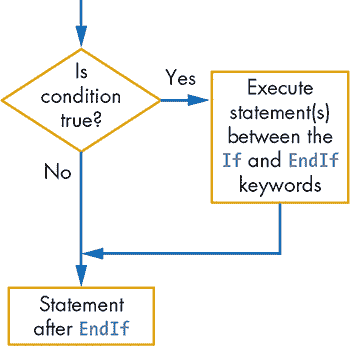
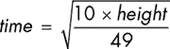
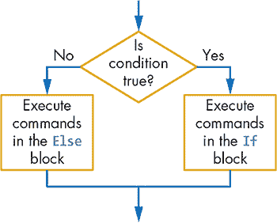
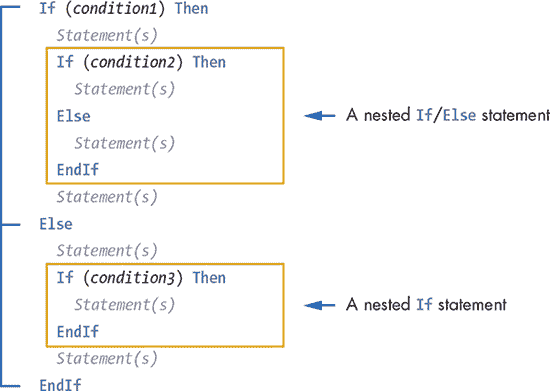

## 第九章：8

**使用 If 语句做决策**


我该穿哪件衬衫？我该吃什么晚餐？我该去哪里？我应该把裤子穿得那么低，以至于我的内裤都露出来吗？你每天都会问自己这样的问题并给出答案。就像你做决策一样，你的程序也能做到！当然，它们不会自己做出决策。你的程序只会做你希望它们做的比较，然后执行一些语句或跳过它们。在本章中，你将编写能够做出决策的程序。

到目前为止，你编写的程序遵循了一条简单的路径，其中语句从上到下执行。但有时你可能需要在某个条件为真时执行一些语句，或者在某个条件为假时执行其他语句。这就像你在生活中做决策的方式。例如，你可能会说：“如果下雪，我就去滑雪”或者“如果我在下午 4 点前完成工作，我就去看电影；否则，我就去史蒂夫家。”在这两种情况下，你采取的行动取决于一个*条件*。

Small Basic 使用几种不同的方法来控制程序中哪些语句会被执行：选择语句（`If`，`If/Else`，`If/ElseIf`），跳转语句（`Goto`）以及迭代或循环语句（`For`和`While`）。在本章和下一章中，我们将解释选择语句和跳转语句，而循环语句将在第十三章和第十四章中讲解。本章中，你将了解关系运算符、布尔表达式，以及如何使用`If/Else`语句编写一些有趣的程序。

### If 语句

假设你妈妈打电话告诉你：“回家的路上，停在 Captain Snarf 的披萨店。如果它开门，给我们买一个大披萨。”她的指示没有说如果披萨店关门该怎么办；你假设自己会空手回家。清单 8-1 将这个情景用代码表示出来。

```
1 ' SnarfPizza.sb
2 TextWindow.WriteLine("Is Snarf's Pizza open?")
3 TextWindow.Write("Enter 1 (for open) or 2 (for closed): ")
4 status = TextWindow.ReadNumber()
5
6 If (status = 1) Then
7   TextWindow.WriteLine("You bought a delicious pizza!")
8 EndIf
9 TextWindow.WriteLine("Time to go home!")
```

*清单 8-1：使用* `If` *和* `EndIf` *关键字*

运行这个程序并在提示时输入`1`（表示 Snarf’s 开门）。由于第 6 行的条件为真，程序会显示第 7 行的信息，内容是“你买了一个美味的披萨！”第 9 行的语句（即`EndIf`关键字之后的语句）无论你是否买了披萨都会执行。再次运行这段代码，这次在提示时输入`2`。会发生什么呢？

第 6 行的语句是一个`If`语句。语句中`If`关键字后的部分（`status = 1`）是*条件*。程序检查该条件是否为真。在这个例子中，它检查 Captain Snarf 的披萨店是否开门。`Then`和`EndIf`关键字之间的代码是*动作*——程序要执行的内容。只有在条件为真时，程序才会执行动作。程序员通常使用*代码块*这个术语，来指代`If`和`EndIf`关键字之间的语句（第 6 行到第 8 行之间）。

**注意**

*Small Basic 不要求你在条件表达式周围加括号，这意味着你可以像这样写第 6 行的语句：* `If status = 1 Then`*。但括号使语句更易读，所以我们在本书中会使用它们。*

Small Basic 在你输入代码时会自动缩进`If`语句，这使得程序更易读，并清楚地显示哪些语句是代码块的一部分。如果你的代码失去了缩进，可以右击编辑器并从弹出菜单中选择**格式化程序**来重新缩进所有代码。太棒了！

`If`语句是 Small Basic 中所有决策的基础。查看图 8-1 中的插图，了解它是如何工作的。

`If`语句的条件是一个*逻辑表达式*（也叫*布尔表达式*或*条件表达式*），其值要么为真，要么为假。如果条件为真，程序会执行`If`和`EndIf`之间的语句（这部分称为`If`语句的*主体*）。但如果条件为假，语句块中的语句将被跳过。无论条件是否为真，程序都会执行`EndIf`之后的语句。



*图 8-1：`If/Then/EndIf` 块的流程图*

**提示**

*你可以把* `If` *语句看作是程序流程中的一个绕行，它就像是一个可选的过山车回路。*

**现实世界中的布尔值**

布尔（Boolean）这个词是为了纪念乔治·布尔（George Boole），这位 19 世纪的英国数学家发明了一种基于两种值（1 和 0，或者真和假）的逻辑系统。布尔代数最终成为现代计算机科学的基础。

在现实生活中，我们常常使用布尔表达式来做决定。计算机也使用它们来确定程序的执行路径。比如，当你在商场刷卡时，远程服务器可能会根据你的信用卡是否有效（真）或者无效（假）来授予或拒绝访问权限。车辆中的计算机会在判断发生碰撞时自动弹出安全气囊（`collision = true`）。当手机电池电量低时，可能会显示警告图标（`batteryLow = true`），而当电池电量恢复正常时，图标会消失（`batteryLow = false`）。

这些只是计算机通过检查布尔条件结果来执行不同操作的几个例子。

你可以使用关系运算符测试各种条件，接下来我们将讨论这些运算符。

#### *关系运算符*

Listing 8-1 中的条件（`status = 1`）测试变量`status`是否等于 1。我们把这里的等号称为*关系运算符*（或*比较运算符*），因为它测试两个值（或表达式）之间的关系。Small Basic 支持另外五个关系运算符，你可以在条件中使用它们。表 8-1 展示了这些关系运算符。

**表 8-1：** 小基础中的关系运算符

| **运算符** | **含义** | **数学符号** |
| --- | --- | --- |
| `=` | 等于 | = |
| `<` | 小于 | < |
| `<=` | 小于或等于 | ≤ |
| `>` | 大于 | > |
| `>=` | 大于或等于 | ≥ |
| `<>` | 不等于 | ≠ |

让我们看几个简短的示例，看看这些运算符是如何工作的。很多人都想参加《与星共舞》。你被雇佣编写一个申请表，潜在的舞者会填写。一个要求是申请人必须至少 18 岁。你如何在程序中检查这个条件？

好吧，这很简单。你可以写出类似这样的代码：

```
TextWindow.Write("How old are you? ")
age = TextWindow.ReadNumber()

If (age < 18) Then
  TextWindow.WriteLine("Sorry! You're not old enough!")
EndIf
```

`If` 条件检查 `age` 是否小于 18。如果是，申请人不够年龄，他们与明星共舞的梦想就此结束。好样的，小舞者！

另一种检查申请人年龄的方法如下：

```
If (age >= 18) Then
  TextWindow.WriteLine("So far so good. You may have a chance!")
EndIf
```

`If` 条件检查 `age` 是否大于或等于 18。如果条件为真，申请人通过了这一条件，仍然有机会与明星共舞。

但如果申请人还需要恰好有 9 年的舞蹈经验呢？（别问为什么！）你可以写出类似这样的代码：

```
TextWindow.Write("How many years of dancing experience do you have? ")
experience = TextWindow.ReadNumber()
If (experience <> 9) Then
  TextWindow.WriteLine("Sorry! You don't have the required experience.")
EndIf
```

注意，`If` 条件使用了不等于（`<>`）运算符。如果申请人输入的不是 9，那么这个舞者的游戏就结束了！

**尝试 8-1**

圣诞老人希望更高效地送礼物。为了避免从烟囱爬下来，他决定从雪橇上将礼物掉入烟囱。他需要一个程序，输入雪橇当前的高度（以米为单位），然后计算礼物掉到烟囱的时间（以秒为单位）。公式如下：



程序必须在计算时间之前检查圣诞老人输入的高度是否为正数。运行以下程序两次。第一次输入一个正高度，第二次输入一个负高度。解释每种情况下发生了什么。

```
TextWindow.Write("Please enter the height (meters): ")
height = TextWindow.ReadNumber()
If (height > 0) Then
  time = Math.SquareRoot(10 * height / 49)
  time = Math.Round(time * 100) / 100 ' Rounds to 2 decimal places
  TextWindow.WriteLine("Fall time = " + time + " sec. ")
EndIf
```

#### *复杂的 If 条件*

和算术运算符一样，关系运算符也需要两个操作数，分别位于两边。这些操作数可以是简单的，使用变量和常量，也可以是复杂的数学表达式。例如，如果你想检查是否有足够的钱来购买两张大披萨并支付 5 美元的小费，可以输入如下内容：

```
If (myMoney >= (2 * pizzaPrice + 5)) Then
```

小基础首先计算 `2 * pizzaPrice + 5` 的值（使用当前的 `pizzaPrice` 值）。然后将结果与当前的 `myMoney` 值进行比较，以查看 `If` 条件是否为真或假。

你还可以使用任何在 `If` 条件中返回值的方法。例如，如果你制作一个披萨外送视频游戏，并希望在玩家的得分达到 100、200、300 等时给予玩家一条额外生命，你可以输入如下内容：

```
If (Math.Remainder(score, 100) = 0) Then
```

该条件检查当前得分 `score` 除以 100 后的余数。如果余数为 0，`If` 条件为真，玩家获得了他们应得的额外生命。

**实践练习 8-2**

将以下每个语句转换为逻辑表达式，然后检查条件是否为真或假。假设 *x* = 4 且 *y* = 5。

1.  *x* 和 3 的和小于 8。

1.  *x* 除以 3 的余数是 2。

1.  *x*² 和 *y*² 的和大于或等于 40。

1.  *x* 可以被 2 整除。

1.  *x* 和 *y* 的最小值小于或等于 10。

#### *比较字符串*

我们刚刚展示了如何使用关系运算符比较数字，但在某些应用中，你需要比较字符串。例如，你可能需要检查用户是否输入了正确的密码，或者他们是否在猜词游戏中猜对了单词。

你可以使用 `=`（等于）或 `<>`（不等于）运算符来测试两个字符串是否相同。示例 8-2 让用户猜测秘密密码。

```
1 ' SecretCode.sb
2 TextWindow.Write("Guess the secret code! ")
3 guess = TextWindow.Read()
4 If (guess = "Pizza rules!") Then
5   TextWindow.WriteLine("You're right!")
6 EndIf
7 TextWindow.WriteLine("Goodbye!")
```

*示例 8-2：在 Small Basic 中比较字符串*

多次运行此程序，并尝试几种不同的猜测。例如，尝试输入 `pizza rules!`（使用小写 *p*）。会发生什么？再运行一次程序，这次输入 `Pizza rules!`（使用大写 *P*）。这次成功了吗？没错！原因是，当你比较字符串时，它们必须完全匹配。所有的大小写、空格和标点符号必须完全一致。

请注意，其他关系运算符（`<, <=`, `>`, 和 `>=`）不能与字符串一起使用。如果你将这些运算符与非数字字符串一起使用，结果总是为假。

### If/Else 语句

你妈妈再次打电话给你，并给你更多的指示：“还有一件事！如果 Captain Snarf’s 关门了，请顺便去 LongLine Grocery 买一个冷冻比萨。”现在你可以在 Small Basic 中使用 `If/Else` 语句来帮助你了！

`If/Else` 语句（也称为 *二选一* `If` *语句*）让你在条件为真时采取一种行动，在条件为假时采取另一种行动。图 8-2 演示了这个语句的工作原理。



*图 8-2：* `If/Else` *语句的流程图*

如果条件为真，Small Basic 将执行 `If` 块中的语句（位于 `If` 和 `Else` 关键字之间）。如果条件为假，Small Basic 将执行 `Else` 块中的语句（位于 `Else` 和 `EndIf` 关键字之间）。因此，Small Basic 只会执行两个块中的一个（`If` 块或 `Else` 块）。

你可以按照 示例 8-3 中所示编写你妈妈的新指示。

```
 1 ' SnarfPizza2.sb
 2 TextWindow.WriteLine("Is Snarf's Pizza open?")
 3 TextWindow.Write("Enter 1 (for open) or 2 (for closed): ")
 4 status = TextWindow.ReadNumber()
 5
 6 If (status = 1) Then
 7   TextWindow.WriteLine("You bought a delicious pizza!")
 8 Else
 9   TextWindow.WriteLine("You got a frozen pizza!")
10 EndIf
11 TextWindow.WriteLine("Time to go home!")
```

*示例 8-3：演示* `If/Else` *语句*

如果 `status = 1`，意味着 Captain Snarf’s 是开放的，你将买一个美味的比萨并回家。但如果 `status` 不是 1（Captain Snarf’s 没有开门），你将从 LongLine Grocery 买一个冷冻比萨并回家。

你妈妈的指令假设 LongLine 总是开着，并且你能找到你需要的东西。但如果杂货店没有冷冻披萨了呢？敬请关注；你可能会接到妈妈的另一个电话，给你新的指令！

**尝试 8-3**

完成以下程序，创建一个脑筋急转弯测验。这个程序会用它的答案让你吃惊。一定要在展示正确答案时发挥创意！

```
' Asks first question
TextWindow.Write("If you take 2 apples from 3 apples, how many apples
do you have? ")
ans = TextWindow.ReadNumber()
If (ans = 2) Then
  TextWindow.Write("Correct. ")
Else
  TextWindow.Write("Nope. ")
EndIf
TextWindow.WriteLine("If you take 2 apples, then you have 2 apples!")
TextWindow.WriteLine("")

' Ask more fun questions here
```

这里有一些问题建议，你可以添加：

1.  一个深 1 英尺、宽 1 英尺的坑里有多少英寸的土壤？

    （答案：0。显示：坑里没有土壤！）

1.  一吨金子比一吨羽毛重吗？（是或否）

    （答案：不。显示：任何东西一吨就是一吨！）

1.  一打有多少个 4 分钱邮票？

    （答案：12。显示：一打总是有 12 个！）

### 嵌套的 If 和 If/Else 语句

你在`If`（或`Else`）块中的语句可以是任何类型的小基本语句，包括另一个`If`或`If/Else`语句。在另一个语句中写`If`（或`If/Else`）语句会创建一个*嵌套的* `If` *语句*（见图 8-3）。内层的`If`语句也可以包含其他的`If`或`If/Else`语句，嵌套可以继续到你想要的任何层级。但要小心，不要嵌套太多层次，否则你会迷失在所有的层次中，可能会觉得自己像超级马里奥掉进了无尽的深坑！

当你需要对同一个变量进行多次检查或需要测试多个条件时，你可以使用嵌套的`If`语句。让我们来看一个示例，使用嵌套的`If/Else`块来测试多个条件。



*图 8-3：演示嵌套的* `If` *和* `If/Else` *语句*

挂掉电话后，你妈妈觉得 LongLine Grocery 可能没有冷冻披萨了。所以她再次打电话给你，说：“听着，如果 Captain Snarf’s 关门了，而且 LongLine 没有冷冻披萨，那么就买一袋冷冻鸡翅。”列表 8-4 展示了如何将这些指令转化为代码。

```
 1 ' SnarfPizza3.sb
 2 TextWindow.WriteLine("Is Snarf's Pizza Open?")
 3 TextWindow.Write("Enter 1 (for open) or 2 (for closed): ")
 4 status = TextWindow.ReadNumber()
 5
 6 If (status = 1) Then ' Snarf's is open
 7   TextWindow.WriteLine("You bought a delicious pizza!")
 8 Else ' Snarf's is closed, so you'll go to LongLine
 9   TextWindow.WriteLine("Snarf's is closed. Try LongLine Grocery.")
10   hasPizza = Math.GetRandomNumber(2) ' Checks your luck
11   If (hasPizza = 1) Then
12     TextWindow.WriteLine("You got a frozen pizza!")
13   Else
14     TextWindow.WriteLine("You got a bag of frozen chicken wings!")
15   EndIf
16 EndIf
17 TextWindow.WriteLine("Time to go home!")
```

*列表 8-4：演示嵌套的* `If` *条件*

就是这个——一个嵌套的`If/Else`语句！如果 Captain Snarf’s 关门了，你就运行一个嵌套的`If/Else`语句来决定从杂货店买什么。第 10 行将变量`hasPizza`随机设置为 1 或 2。1 表示 LongLine 仍然有冷冻披萨，而 2 表示杂货店没有了。多次运行这个程序，看看今晚你会买什么晚餐。

等等，你妈妈刚刚意识到你可能没有钱，于是她打电话回来：“抱歉，我忘了告诉你。如果你没有足够的钱，就去史蒂夫家吃饭！”现在我们需要再添加一个嵌套层级。列表 8-5 展示了如何处理这种情况。

```
 1 ' SnarfPizza4.sb
 2 TextWindow.Write("How many dollars do you have? ")
 3 myMoney = TextWindow.ReadNumber()
 4
 5 If (myMoney >= 25) Then ' I have enough money
 6   TextWindow.WriteLine("Is Snarf's Pizza Open?")
 7   TextWindow.Write("Enter 1 (for open) or 2 (for closed): ")
 8   status = TextWindow.ReadNumber()
 9
10   If (status = 1) Then ' Snarf's is open
11     TextWindow.WriteLine("You bought a delicious pizza!")
12   Else ' Snarf's is closed, so you'll go to LongLine
13     TextWindow.WriteLine("Snarf's is closed. Try LongLine Grocery.")
14     hasPizza = Math.GetRandomNumber(2) ' Checks your luck
15     If (hasPizza = 1) Then
16       TextWindow.WriteLine("You got a frozen pizza!")
17     Else
18       TextWindow.WriteLine("You got a bag of frozen chicken wings!")
19     EndIf
20   EndIf
21 Else ' I don't have enough money
22   TextWindow.Write("Go to Steve's house for dinner ")
23   TextWindow.WriteLine("(it's earthworm pizza night).")
24 EndIf
25 TextWindow.WriteLine("Time to go home!")
```

*列表 8-5：更多的嵌套层级*

如你所见，你在程序中做决策的方式与现实生活中做决策的方式是一样的！

**动手试试 8-4**

修改以下程序，使其开始时读取用户输入的 `x` 和 `y` 的值。修改输出消息，让用户发笑！

```
If (x > 5) Then
  If (y > 5) Then
    TextWindow.WriteLine("The skylight is falling!")
  Else
    TextWindow.WriteLine("Now it's time to play the piper!")
  EndIf
Else
  TextWindow.WriteLine("I'll huff, puff, and blow $5 on tacos!")
EndIf
```

### Goto 语句

`Goto` 语句通过让你跳转到程序中较早或较晚的某个语句来改变程序的流程。请查看 Mark 和 Andy 在清单 8-6 中的烦人对话。

```
1 ' GotoDemo.sb
2 Again:
3 TextWindow.Write("Mark: Pete and Repeat were in a boat. ")
4 TextWindow.WriteLine("Pete fell out, who was left?")
5 TextWindow.WriteLine("Andy: Repeat.")
6 TextWindow.WriteLine("")
7 Program.Delay(1000) ' Waits 1 sec to slow the program down
8 Goto Again
```

*清单 8-6：一个无尽的* `Goto` *循环*

第 2 行的语句被称为*标签*；它用于标识程序中的特定行。标签以冒号结尾，你可以将它们放置在程序的任何地方。

程序随后运行第 3 行到第 7 行。当它到达第 8 行时，它会返回到第 2 行（跳转到 `Again` 标签），然后 Small Basic 会再次执行第 3 行到第 7 行。*循环*指的是运行相同代码块多次，这个循环会永无止境（就像*永无止境的歌*和《Barney 歌》）。运行此程序查看其输出（并尽量把那些歌曲从脑海中赶出去；哈哈）。

`Goto` 语句是一种*无条件跳转*（或*无条件转移*）语句，因为程序会无条件地跳转到 `Goto` 标签指定的位置（不问任何问题）。而 `If/Then` 语句则是一种*条件转移*语句，因为程序只有在满足某个条件时才会改变其正常流程。

大多数程序员建议你不要使用 `Goto` 语句，因为它们会把程序变成*意大利面条代码*——那种混乱复杂到没人能理解的代码！但有时候 `Goto` 语句会非常有用，了解它在什么时候可能派上用场是很有帮助的。

`Goto` 的一个常见用法是检查用户输入的数据，确保其正确，如清单 8-7 所示。

```
1 ' VaildateWithGoto.sb
2 TryAgain:
3 TextWindow.Write("Enter a positive number: ")
4 num = TextWindow.ReadNumber()
5 If (num <= 0) Then
6   Goto TryAgain
7 EndIf
8 TextWindow.Write("You entered: " + num)
```

*清单 8-7：使用* `Goto` *来检查用户输入*

这段代码要求用户输入一个正数（第 3 行），并将输入读取到 `num` 变量中（第 4 行）。如果用户输入的数字不是正数（第 5 行），`Goto` 语句会将程序跳转回 `TryAgain` 标签，要求用户重新输入。如果输入的是正数，程序继续执行第 8 行的语句。你将在第十四章中学习另一种使用 `While` 循环检查用户输入的方法。

**动手试试 8-5**

我们（本书的作者）计划使用以下程序来衡量读者的满意度。你认为这样公平吗？我们觉得是！重写它并使其更具个人化。然后让别人参与你的调查！

```
Again:
TextWindow.Write("How many stars do you give this book [1-5]? ")
ans = TextWindow.ReadNumber()
ans = Math.Floor(ans) ' In case the user typed a decimal
If (ans <> 5) Then
  TextWindow.Write("Invalid number! Please enter an integer. ")
  TextWindow.WriteLine("That's greater than 4 but less than 6.")
  Goto Again
EndIf
TextWindow.WriteLine("Wow! Thank you. You made our day!")
```

### 编程挑战

如果你遇到困难，请查看 *[`nostarch.com/smallbasic/`](http://nostarch.com/smallbasic/)* 获取解决方案以及更多的资源和教师与学生的复习问题。

1.  以下程序创建了一个简单的掷硬币游戏，用户需要掷硬币并输入 *h*（代表正面）或 *t*（代表反面）。根据用户的输入，程序会显示不同的信息。你认为计算机在玩一个公平的游戏吗？看看你能否找个家人或朋友一起玩这个不公平的掷硬币游戏！

    ```
    TextWindow.Write("Toss a coin. Heads(h) or Tails(t)? ")
    ans = TextWindow.Read()
    If (ans = "h") Then
      TextWindow.WriteLine("I won. I'm the champion!")
    Else
      TextWindow.WriteLine("You lost. Cry home to Momma.")
    EndIf
    ```

1.  詹姆斯·P·科克船长正在驾驶“世纪鹰”号企业级星际飞船。他截获了来自敌人克林戈夫（Clingoffs）的消息，并需要你的帮助破解密码！这条消息包含数百万组三位数字；每组数字都需要排序后重新输入才能理解消息。编写一个程序，要求用户输入三个数字，然后将这些数字按从小到大的顺序显示给科克船长。我们已经为你写好了排序逻辑，但你需要编写用户输入部分。打开本章文件夹中的 *CaptainCork_Incomplete.sb* 文件，按照注释完成这个应用程序，帮助科克船长阻止邪恶的克林戈夫！

1.  你正在启动一个名为“罐装泥土”的新业务。你有泥土，而人们需要它，那为什么不把它装进罐子里呢？编写一个程序，让客户输入罐子的高度和半径。程序应计算罐子的体积（以确定该放入多少泥土）。如果用户输入了负值的高度或半径，程序应显示适当的错误信息。

1.  如同童话故事所述，鲁姆普尔斯蒂尔茨金帮助一位妇女将稻草纺成金子。作为交换，她答应将第一个孩子交给他。当孩子出生时，妇女拒绝交出孩子。鲁姆普尔斯蒂尔茨金同意，如果妇女能在三天内猜出他的名字，他就放弃对孩子的要求。编写一个程序，提示妇女输入她的猜测，并检查她的猜测是否正确。以下是程序的示例运行：

    ```
    What is my name? Paul
    No! Your child will be mine! Mwahaha!
    What is my name? Peter
    No! Your child will be mine! Mwahaha!
    What is my name? Rumpelstiltskin
    Correct. You can keep the child. She's a brat anyway!
    ```
