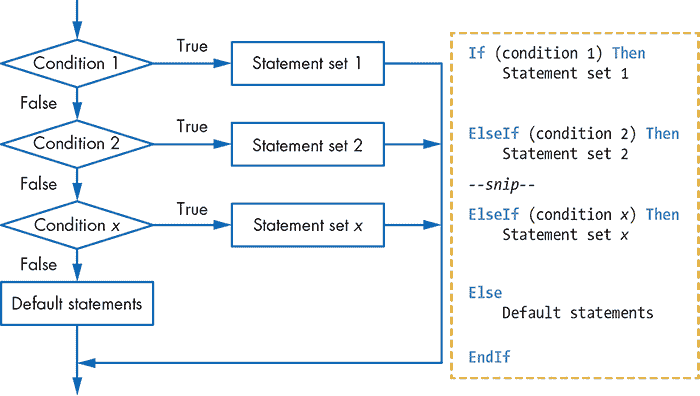
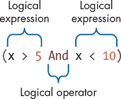
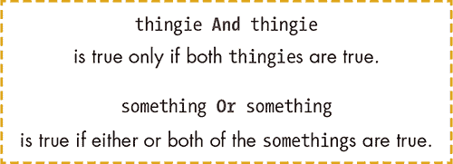
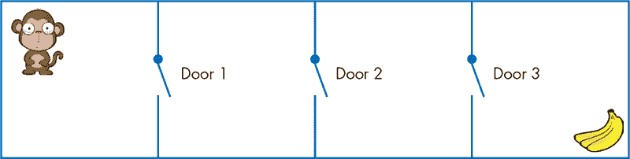
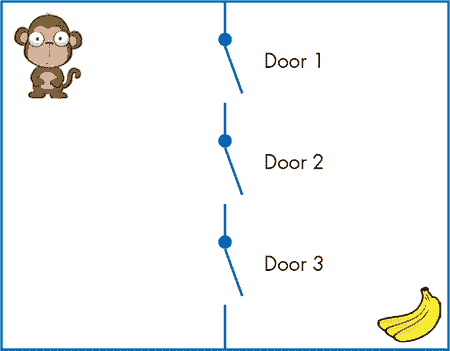
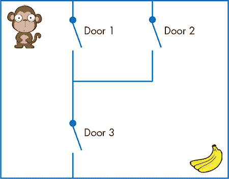
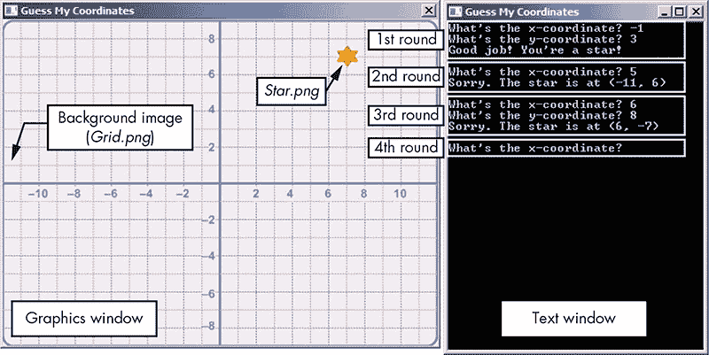
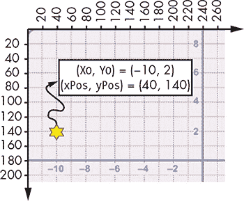
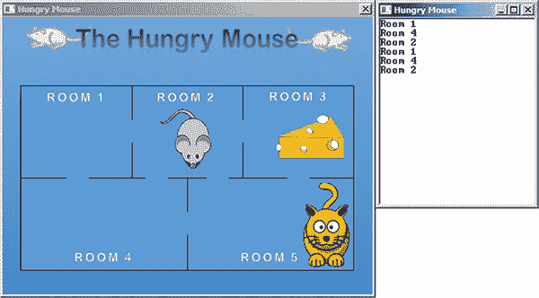

## **9**

**使用决策来制作游戏**


有时候决策是复杂的。假设一个男孩和一个女孩想去看电影。她想看一部动作片，但他想看一部喜剧片。如果这部喜剧片有动作元素，且评价很好，并且有她喜欢的女演员，她愿意去看。但这部电影必须在晚上 10 点之前开始，并且必须在距离他们正在用餐的餐厅 10 英里的范围内。想象一下，要做出这样的决策，代码会是什么样子的！

在本章中，我们将继续探讨决策相关的话题，并介绍一些新的语句。我们将首先介绍`If/ElseIf`语句，并展示它如何简化编写嵌套`If`语句的过程。接着，你将学习逻辑运算符`And`和`Or`，它们可以让你在`If`语句中做更多的操作。我们还将介绍`Shapes`对象，让你更加熟悉图形的操作。最后，你将通过构建一个叫做“猜我的坐标！”的游戏，将所有这些新知识付诸实践！

### **If/ElseIf 阶梯**

这个消息已经在新闻中报道了！外星怪物弗兰科已经逃脱了看守。幸运的是，当你看到他在邻里攻击人们时，你正好带着激光枪。你瞄准并开火。运行清单 9-1 中的程序，看看接下来会发生什么！

```
 1 ' AlienAttack.sb
 2 TextWindow.Write("A salivating alien monster approaches. ")
 3 TextWindow.WriteLine("Press any key to shoot...")
 4 TextWindow.PauseWithoutMessage()
 5
 6 damage = Math.GetRandomNumber(5) ' Randomly picks an outcome
 7 If (damage = 1) Then
 8   TextWindow.Write("Wow! You got him. ")
 9   TextWindow.WriteLine("Now you can watch SpongeBob!")
10 ElseIf (damage = 2) Then
11   TextWindow.Write("You injured him. ")
12   TextWindow.WriteLine("He wants a Band-aid.")
13 ElseIf (damage = 3) Then
14   TextWindow.Write("Weak shot. Run for your life! ")
15   TextWindow.WriteLine("Now dance! You'll confuse him.")
16 Else
17   TextWindow.Write("You missed! He got you. ")
18   TextWindow.WriteLine("You should stick to video games.")
19 EndIf
```

*清单 9-1：攀登* `If/ElseIf` *阶梯*

程序从 1 到 5 之间随机选择一个数字（第 6 行），然后检查该数字来决定外星人的命运。第 7 到第 19 行构成了`If/ElseIf`阶梯，这是用来构建一连串`If`语句的常见方法。它的一般形式在图 9-1 中有所展示。

从第一个语句开始，程序会依次检查每个测试条件。一旦找到一个条件为真的语句，它会执行该语句，并跳到`EndIf`之后的语句，跳过阶梯中的其他部分。如果没有任何条件为真，程序会执行`Else`子句中的语句，然后继续执行`EndIf`之后的语句。

这就是为什么最终的`Else`语句通常被称为*默认情况*。如果你在阶梯中不包括最后的`Else`语句，且所有测试条件都为假，`If/ElseIf`阶梯将不会执行任何操作，程序将继续执行`EndIf`关键字之后的语句。



*图 9-1：* `If/ElseIf` *阶梯的结构*

让我们看看另一种使用`If/ElseIf`阶梯的方法。

#### ***字母成绩***

在这个例子中，你将创建一个程序，读取一个 0 到 100 之间的测试分数，并从表 9-1 中显示相应的字母成绩。

**表 9-1：** 字母成绩评分

| **分数** | **字母成绩** |
| --- | --- |
| 分数 ≥ 90 | A |
| 80 ≤ 分数 < 90 | B |
| 70 ≤ 分数 < 80 | C |
| 60 ≤ 分数 < 70 | D |
| 分数 < 60 | F |

完整的程序可以在清单 9-2 中查看。

```
 1 ' GradeLetter.sb
 2 TextWindow.Write("Enter the score: ")
 3 score = TextWindow.ReadNumber()
 4 If (score >= 90) Then
 5   grade = "A"
 6 ElseIf (score >= 80) Then
 7   grade = "B"
 8 ElseIf (score >= 70) Then
 9   grade = "C"
10 ElseIf (score >= 60) Then
11   grade = "D"
12 Else
13   grade = "F"
14 EndIf
15 TextWindow.WriteLine("The grade is " + grade)
```

*清单 9-2：评分作业*

尝试运行程序并输入一些数字查看结果。以下是一些输出示例：

```
Enter the score: 90
The grade is A
Enter the score: 72
The grade is C
```

这个程序使用`If/ElseIf`阶梯来测试输入的成绩。让我们一步步地走过这个程序的工作原理。

程序测试第一个条件`score >= 90`是否为真（第 4 行）。如果为真，`grade`设置为`A`，程序跳转到第 15 行。

如果不成立，`score`一定小于 90，程序会检查下一个条件`score >= 80`，即第 6 行的条件。如果这个条件为真（意味着`score`大于或等于 80 但小于 90），`grade`将被设置为`B`，程序跳转到第 15 行。

如果条件不成立，那么`score`一定小于 80，程序会检查第 8 行的条件`score >= 70`。如果这个条件成立（意味着`score`大于或等于 70 但小于 80），`grade`将被设置为`C`，程序跳转到第 15 行。

如果这个条件也不成立，那么`score`一定小于 70。此时，程序会检查第 10 行的条件`score >= 60`。如果此条件为真（意味着`score`大于或等于 60 但小于 70），`grade`会被设置为`D`，程序跳转到第 15 行。

最后，如果最后一个条件仍然不成立，`score`一定小于 60。在这种情况下，程序不检查任何条件，`grade`被设置为`F`，程序跳转到第 15 行。

#### ***阶梯上的错误***

当你编写`If/ElseIf`阶梯时，条件语句的顺序非常重要。在测试条件时，务必小心顺序。例如，回到列表 9-2，并将第 4 到第 7 行替换为以下代码：

```
If (score >= 80) Then
  grade = "B"
ElseIf (score >= 90) Then
  grade = "A"
```

这个程序的更改意味着你首先检查条件`score >= 80`，而不是`score >= 90`。现在，如果用户输入 95，程序首先测试第一个条件，看到`score >= 80`为真，并将`grade`设置为`B`。在这段代码中，`grade`永远不会被设置为`A`，无论`score`的值有多高。没有人能得`A`！当程序在这个`If/ElseIf`阶梯中找到一个为真的条件时，它会跳过所有其他语句，直接跳到`EndIf`。

为了避免这个问题，确保`If/ElseIf`阶梯中的条件顺序正确。你可能永远不想先检查中间值。此外，在用户之前一定要多次运行程序，测试值并发现任何问题。

**试试 9-1**

在列表 9-2 中，你从检查条件`score >= 90`开始。你也可以从检查最后一个条件`score < 60`开始，然后是`60 <= score < 70`，接着是`70 <= score < 80`，依此类推。使用这种反向检查顺序重写程序。

### **让我们来看看逻辑**

有时你可能需要检查多个条件来决定是否执行某个语句。例如，你可能只有在狗既大又经过厕所训练且有三只头时，才会收养它。测试多个条件的一种方法是像在前几章中那样嵌套`If`和`If/Else`语句。另一种方法是使用*逻辑运算符*（也叫*布尔运算符*）。使用逻辑运算符，你可以编写结合两个或更多逻辑表达式的测试条件。让我们看看怎么做。

你还记得在小学数学课上学过的像 5 < *x* < 10 这样的*不等式*吗？这个表达式描述了一个数字 *x*，它大于 5 且小于 10。图 9-2 向你展示了如何在 Small Basic 中写出这个表达式。



*图 9-2：Small Basic 中的复合条件*

这是一个由两个逻辑表达式 *x* > 5 和 *x* < 10 组成的*复合条件*，你使用逻辑运算符 `And` 将它们结合起来。为了使这个复合条件为真，两个表达式必须都为真。

Small Basic 支持两个逻辑运算符：`And` 和 `Or`。图 9-3 描述了它们的工作原理。



*图 9-3：解释逻辑运算符* `And` *和* `Or`

接下来，我们将更详细地解释这些运算符。

#### ***动物园中的逻辑运算符***

看一下图 9-4，并回答这个问题：猴子该如何得到香蕉？没错：门 1 `和` 门 2 `和` 门 3 必须都打开。如果三扇门中有任何一扇关着，可怜的猴子就无法得到香蕉了！



*图 9-4：使用* `And` *运算符进行逻辑运算*

现在看一下图 9-5。在这个例子中，猴子只需要一扇门打开：门 1 `或` 门 2 `或` 门 3。这个猴子对它的机会很有信心！



*图 9-5：使用* `Or` *运算符进行逻辑运算*

在图 9-6 中，猴子有两个选择。



*图 9-6：使用* `And` *和* `Or` *运算符进行逻辑运算*

如果它走上上面的小路，它需要两扇门（门 1 `和` 门 2）都打开。如果它走下下面的小路，只需要门 3 打开。如果你在编程这个条件，你会这样描述：

```
((Door1 = open) And (Door2 = open)) Or (Door3 = open)
```

你准备好练习使用 `And` 和 `Or` 运算符了吗？

#### ***And 运算符***

`And` 运算符将两个逻辑表达式作为操作数。*操作数*是指运算符作用的对象。表 9-2（称为真值表）列出了 `And` 运算符对其两个操作数 `X` 和 `Y` 的所有可能组合的输出。

**表 9-2：** `And` 运算符的真值表

| **如果** `X` **是** | **如果** `Y` **是** | **那么** `(X 和 Y)` **是** |
| --- | --- | --- |
| `"真"` | `"真"` | `"真"` |
| `"真"` | `"假"` | `"假"` |
| `"假"` | `"真"` | `"假"` |
| `"假"` | `"假"` | `"假"` |

如果 `X` 和 `Y` 都为真，则 `X And Y` 也为真。但如果其中一个操作数为假，则 `X And Y` 也为假。

列表 9-3 显示了使用 `And` 运算符结合的两个条件（`gameLevel = 1` 和 `score > 100`）。当这两个条件都为真时，会显示消息 `You get 200 bonus points!`。

```
 1 ' AndDemo.sb
 2 TextWindow.Write("Game level: ")
 3 gameLevel = TextWindow.ReadNumber()
 4
 5 TextWindow.Write("Score.....: ")
 6 score = TextWindow.ReadNumber()
 7
 8 If ((gameLevel = 1) And (score > 100)) Then
 9   TextWindow.WriteLine("You get 200 bonus points!")
10 EndIf
```

*列表 9-3：* `And` *运算符*

只有当 `gameLevel` 等于 1 且 `score` 大于 100 时，`If` 块中的语句（第 9 行）才会执行。如果这两个条件中有一个为假，那么整个条件就是假的，Small Basic 将不会在第 9 行执行 `WriteLine()` 方法。

你可以通过将第 8 到第 10 行替换为以下嵌套的 `If` 语句来执行相同的检查：

```
If (gameLevel = 1) Then
  If (score > 100) Then
    TextWindow.WriteLine("You get 200 bonus points!")
  EndIf
EndIf
```

你看到 `And` 运算符是如何更简洁地测试多个条件的吗？嵌套的 `If` 语句需要五行代码，但使用 `And`，你只需三行代码就能做到同样的事情！

#### ***Or 运算符***

你喜欢你的比萨吗？你可能只想吃有四种肉或者外皮是黏糊糊的比萨。当你有多个条件时，如果只有一个条件需要为真，`Or` 运算符就派上用场了。请查看 表 9-3 中 `Or` 运算符的真值表。

**表 9-3：** `Or` 运算符的真值表

| **如果** `X` **为** | **如果** `Y` **为** | **那么** `(X Or Y)` **为** |
| --- | --- | --- |
| `"True"` | `"True"` | `"True"` |
| `"True"` | `"False"` | `"True"` |
| `"False"` | `"True"` | `"True"` |
| `"False"` | `"False"` | `"False"` |

如果两个操作数中有一个为真，或者它们都为真，那么组合的逻辑表达式为真。只有当两个操作数都为假时，逻辑表达式才为假。

列表 9-4 显示了使用 `Or` 运算符的一个例子。目标是在没有时间继续游戏时（`timeLeft = 0`）或者玩家失去所有能量时（`energyLevel = 0`），结束游戏。

```
 1 ' OrDemo.sb
 2 TextWindow.Write("Time left: ")
 3 timeLeft = TextWindow.ReadNumber()
 4
 5 TextWindow.Write("Energy level: ")
 6 energyLevel = TextWindow.ReadNumber()
 7
 8 If ((timeLeft = 0) Or (energyLevel = 0)) Then
 9   TextWindow.WriteLine("Game Over!")
10 EndIf
```

*列表 9-4：* `Or` *运算符*

如果 `timeLeft` 为 0 或 `energyLevel` 为 0，Small Basic 会执行 `If` 块中的命令（第 9 行）。多次运行此程序，使用不同的输入来确保你理解 `Or` 运算符的工作原理。

你可以使用嵌套的 `If` 语句来做同样的事情。例如，你可以将第 8 到第 10 行替换为以下代码：

```
If (timeLeft = 0) Then
  TextWindow.WriteLine("Game Over!")
Else
  If (energyLevel = 0) Then
    TextWindow.WriteLine("Game Over!")
  EndIf
EndIf
```

然而，正如你所看到的，使用嵌套的 `If` 语句需要七行代码，而使用 `Or` 只需要三行！使用 `Or` 运算符是一种更简洁的方式来测试多个条件。

#### ***评估的宇宙顺序***

看一下下面的条件。Small Basic 如何评估这个表达式？

```
If (A = 1 Or B = 1 And C = 1) Then
```

事实证明，Small Basic 给 `And` 运算符的优先级高于 `Or`。这意味着它首先会找到 `B = 1 And C = 1`，然后将结果作为 `Or` 表达式的右操作数。要改变运算顺序，可以使用括号，例如：

```
If ((A = 1 Or B = 1) And C = 1) Then
```

这段代码首先计算 `A = 1 Or B = 1`，然后将结果作为 `And` 表达式的左操作数。我们建议你使用括号，以避免任何混淆！

**注意**

*逻辑运算符，如* `And` *和* `Or` *会在* *任何算术运算符（*`+`、`-`、`*`、`/`*）和关系运算符（*`=`、`<`、`<=`、`>`、`>=`、`<>`*）的组合表达式之后进行计算。在逻辑运算符中，* `And` *优先于* `Or` *；使用括号可以改变顺序，使代码更易读。*

是时候应用你所学的所有决策信息，并构建一些令人兴奋的应用程序了。但在此之前，我们需要介绍一个新的 Small Basic 对象——`Shapes` 对象，它允许你使用丰富的图形来构建应用程序。让我们制作一些漂亮的图形吧！

**动手试一试 9-2**

打开本章文件夹中的 *DiceGame_Incomplete.sb* 文件，并编写缺失的代码来完成这个游戏。玩家输入他们的赌注（从 $1 到 $10），然后掷一对骰子。如果骰子的点数和为 2 或 12，玩家赢得赌注的三倍。如果点数和为 4 或 10，玩家赢得赌注的两倍。如果点数和为 7 或 11，玩家输掉赌注。否则，玩家的余额不变，玩家继续掷骰子。

### **Shapes 对象**

在 第三章 中，你学会了如何在图形窗口中绘制各种形状和图像。但那些形状是*固定的*：一旦你在某个位置绘制了形状，唯一移动它到另一个位置的方法就是清空整个窗口并重新绘制该形状。如果你需要在程序中移动一些形状（比如当玩家按下一个键时移动一个角色），最好使用 `Shapes` 对象。

`Shapes` 对象让你在图形窗口中添加、移动和旋转图形。运行这段代码来绘制一个矩形：

```
rectID = Shapes.AddRectangle(100, 50)
Program.Delay(1000)
Shapes.Move(rectID, 400, 200)
```

程序调用 `AddRectangle()` 来添加一个 100×50 的矩形，并将创建的图形标识符保存到 `rectID` 中。创建的矩形默认出现在图形窗口的左上角。第二条语句使程序暂停 1 秒，以便你查看矩形的初始位置。第三条语句调用 `Move()` 来移动该矩形，使其左上角位于 (400, 200) 处。请注意，`rectID` 被作为 `Move()` 的第一个参数传入，以便它知道要移动的是哪个图形。

把 `Shapes` 对象当作一个“形状工厂”——一个制造线条、三角形、矩形、椭圆以及其他形状的工厂。当你请求它创建一个新的形状时，它会制造该形状并返回一个标识符。每当你想对已创建的形状进行操作时，你都需要将这个标识符传递给 `Shapes` 对象（作为你调用的方法的参数）。

我们不会在这里涵盖 `Shapes` 对象的所有方法。相反，我们会讨论你在下一个程序中将使用到的方法。随着你阅读本书，你会学习到其他方法。

我们现在要使用的两个方法是`AddImage()`和`Move()`。要了解这些方法是如何工作的，请打开本章文件夹中的*ImageDemo.sb*文件。你将看到清单 9-5 中展示的代码，该代码用于移动图像。

```
1 ' ImageDemo.sb
2 path = Program.Directory + "\Flower.png"
3 imgID = Shapes.AddImage(path)
4 Shapes.Move(imgID, 60, 20)
```

*清单 9-5：使用`Shapes`对象移动图像*

点击**运行**按钮。该程序的输出如图 9-7 所示（我们添加了网格线和数字，以展示代码的工作原理）。


*图 9-7：移动花朵图像*

假设这个程序被保存到*C:\Book\Ch09\ImageDemo*。*imageDemo*文件夹中还包含*Flower.png*图像文件。`Program.Directory`属性（第 2 行）指向目录*C:\Book\Ch09\ImageDemo*，该目录包含可执行程序（*.exe*文件）。第 2 行使用`+`符号将两件事附加到目录中：一个斜杠（\）和图像文件名（*Flower.png*）。当程序运行第 2 行时，`path`变量会被赋予完整的文件路径（*C:\Book\Ch09\ImageDemo\Flower.png*）。

第 3 行调用了`AddImage()`方法，并将`path`变量作为参数传递。该方法从文件加载图像并返回加载图像的标识符；该标识符保存在名为`imgID`的变量中。标识符就像是`Shapes`对象用来跟踪它创建的形状的标签（例如，`"Image1"`、`"Rectangle3"`、`"Line100"`等）。加载的图像显示在图形窗口的左上角。

第 4 行调用了`Move()`方法来移动图像。第一个参数是形状的标识符，它是程序从`AddImage()`获取并保存在`imgID`（第 3 行）中的。其他两个参数是新位置的左上角坐标。图 9-7 显示了花朵图像，其左上角位于(60, 20)。

*Flower.png*图像的宽度为 100 像素，高度为 140 像素。如果你想将图像移动到其中心位于(100, 100)，你可以这样写：

```
Shapes.Move(imgID, 100 - 50, 100 - 70)
```

因为你想让图像的中心位于(100, 100)，你需要减去图像宽度的一半（50）来水平居中，减去图像高度的一半（70）来垂直居中。

这是你在下一节构建应用程序时需要学习的有关`Shapes`对象的所有信息。现在是时候制作一个猜谜游戏了！

**动手练习 9-3**

使用类似以下的代码，在你的计算机上指向一张小图像，并在图形窗口中显示它：

```
imgID = Shapes.AddImage("C:\Temp\icon.png")
Shapes.Move(imgID, 40, 60)
```

更新路径为你图像的正确路径。更改第二条语句，将图像移动到以下位置：(100, 40)、(10, 10)、(27, 78)，然后将其居中于图形窗口。

### **创建一个游戏：猜我的坐标**

游戏开始了！在本节中，你将开发一个互动游戏，叫做“猜我的坐标”，它测试玩家对笛卡尔坐标系统的知识，或者说是他们读取 x、y 坐标图的能力。游戏展示一个代表笛卡尔网格上某一点的星星；图 9-8 展示了界面的样子。在每一轮游戏中，星星会移动到一个随机位置，并要求玩家猜测它的 x 和 y 坐标。游戏会检查玩家的答案，并显示反馈信息。它像是*战舰*游戏，但对于数学迷来说更有趣！

该游戏同时使用图形窗口和文本窗口。图形窗口显示网格和星星，文本窗口读取玩家的答案并显示程序的反馈信息。现在，我们将一步步带你完成创建这个游戏的过程。



*图 9-8：猜测我的坐标游戏的用户界面*

#### ***步骤 1：打开启动文件***

从本章文件夹中打开*GuessMyCoordinate_Incomplete.sb*文件开始。该文件仅包含注释，你将一步一步地添加代码。

本章文件夹中还包含你将使用的两张图片（*Grid.png*和*Star.png*）。*Grid.png*是一个 480×360 的笛卡尔网格图像，而*Star.png*是一个 24×24 的星星图像。

**注意**

*如果你遇到任何问题，可以查看本章文件夹中包含的完成版程序*（GuessMyCoordinates.sb），*看看你做错了什么。*

#### ***步骤 2：设置游戏***

在清单 9-6 中输入代码以设置游戏的用户界面。该代码应放在文件的开头。

```
 1 GraphicsWindow.Title = "Guess My Coordinates"
 2 GraphicsWindow.CanResize = "False"
 3 GraphicsWindow.Width = 480   ' Same as background image
 4 GraphicsWindow.Height = 360  ' Same as background image
 5 GraphicsWindow.Top = 200     ' Position on your desktop
 6 GraphicsWindow.Left = 50     ' Position on your desktop
 7 TextWindow.Title = "Guess My Coordinates"
 8 TextWindow.Top = GraphicsWindow.Top
 9 TextWindow.Left = GraphicsWindow.Left + GraphicsWindow.Width + 15
10
11 path = Program.Directory                     ' Program's directory
12 bkgnd = Shapes.AddImage(path + "\Grid.png")  ' Bkgnd (480 x 360)
13 star = Shapes.AddImage(path + "\Star.png")   ' Star image (24 x 24)
14
15 While ("True")                               ' Runs forever
16   ' You'll add code from Listings 9-7 and 9-8 here
17 EndWhile
```

*清单 9-6：设置游戏*

第 1 行到第 6 行设置图形窗口的标题、大小和位置。窗口的大小设置为与网格图像的大小相同（第 3–4 行）。第 7 行到第 9 行设置文本窗口的标题，并将其位置设置在图形窗口的右侧（见图 9-8）。程序接着将程序的目录保存到`path`中（第 11 行），你将使用它来为两张图片生成完整路径，以便在屏幕上绘制它们。接下来，程序加载这两张图片，并将它们的标识符（由`Shapes`对象返回）保存在这两个变量中：`bkgnd`和`star`（第 12–13 行）。

行 15 和行 17 中的`While`/`EndWhile`关键字将在第十四章中详细解释。现在，你只需要知道这些代码创建了一个*无限循环*（一个会永远重复的循环，像你在第八章中写的 Pete and Repeat 程序，*GotoDemo.sb*）。你将在这些`While`/`EndWhile`关键字之间添加应用程序的其余代码。

测试到目前为止写的代码。你应该能看到两个并排的窗口，就像在图 9-8 中一样。星星图像出现在图形窗口的左上角，但暂时没有任何动作，因为你还没有编写代码来移动它。

现在关闭图形窗口或文本窗口，以便你可以添加剩余的代码。

#### ***步骤 3：隐藏星星***

在游戏的每一轮中，你将把星星移动到网格上的一个随机位置，然后让玩家猜测其坐标。现在我们来添加代码来移动星星。

将列表 9-7 中的代码添加到 `While` 循环中（位于列表 9-6 的第 16 行）。

```
1   ' Finds the star's random position (in grid units)
2   X0 = Math.GetRandomNumber(23) - 12 ' Ranges from -11 to 11
3   Y0 = Math.GetRandomNumber(17) - 9  ' Ranges from -8 to 8
4   pt = "(" + X0 + ", " + Y0 + ")"    ' Example: (5, -3)
5
6   ' Sets to pixel units and moves the star to the random position
7   xPos = ((X0 + 12) * 20) - 12   ' Sets 12 pixels to the left
8   yPos = ((9 - Y0) * 20) - 12    ' And 12 pixels up
9   Shapes.Move(star, xPos, yPos)  ' Moves the star
```

*列表 9-7：放置星星*

在图 9-8 中，你可以看到网格在 x 方向上从 –12 到 12，在 y 方向上从 –9 到 9。如果你将星星放置在网格边界的任何一点，玩家只能看到星星的一部分；网格外部的部分会被裁剪掉。这就是为什么你需要将星星的 x 坐标限制在 [–11, 11] 范围内，y 坐标限制在 [–8, 8] 范围内。

但如何生成一个在 –11 到 11 之间的随机数呢？这很简单！从 –11 到 11 共包含 23 个整数（–11, –10, ..., 10, 11）。如果你调用 `GetRandomNumber(23)`，你会得到一个介于 1 和 23 之间的随机整数。如果你从这个整数中减去 12，结果将是一个介于 –11（1 – 12）和 11（23 – 12）之间的整数，这正是你需要的。接下来，我们将解释代码。

你使用两个变量，`X0` 和 `Y0`，来存储星星的随机坐标。在第 2 行，`X0` 变量被赋予一个在 –11 到 11 之间的随机值，如前所述。在第 3 行，`Y0` 变量被赋予一个在 –8 到 8 之间的随机数。这些 `X0` 和 `Y0` 的随机值告诉你星星落在哪个网格交点上。接下来，程序构建一个名为 `pt`（表示点的缩写）的字符串，格式为 `(X0, Y0)`。如果玩家输入错误的答案，这个字符串会显示正确的坐标给玩家。

现在，你需要将星星移动到你刚刚创建的这个新坐标 `(X0, Y0)`。图 9-9 展示了网格的一部分，以及星星可能被设置的位置示例。如图所示，网格上的每个单位映射到图形窗口中的 20 像素；你可以将其与图 9-8 进行对比，以了解网格的整体缩放比例。



*图 9-9：图形窗口中的像素位置的网格坐标*

为了将星星移动到一个随机位置，你首先需要将 `(X0, Y0)` 网格单位（用户在网格图像上看到的内容）转换为 `(xPos, yPos)` 像素单位（Small Basic 中的坐标）。我们现在就来做这个转换。

如果星星的 x 坐标是–11，你需要在图形窗口的水平位置 20 绘制星星。如果星星的 x 坐标是–10，你需要在水平位置 40 绘制它，依此类推。所以你需要一个公式将星星的 x 坐标`X0` = {–11, –10, –9, ..., 0}，映射到图形窗口中对应的水平位置`xPos` = {20, 40, 60, ..., 240}。为此，你需要将 12 加到`X0`上，得到{1, 2, 3, ..., 12}，然后将结果乘以 20。测试一下！当`X0` = –11 时，（–11 + 12）× 20 = 20。当`X0` = –10 时，（–10 + 12）× 20 = 40，依此类推。这正是你想要的。

对于 y 坐标的映射方式是相同的。如果星星的 y 坐标是 8，你需要在图形窗口的垂直位置 20 绘制它。如果星星的 y 坐标是 7，你需要在垂直位置 40 绘制它，依此类推。所以你需要一个公式将星星的 y 坐标`Y0` = {8, 7, 6, ..., 0}，映射到图形窗口中对应的垂直位置`yPos` = {20, 40, 60, ..., 180}。你通过从 9 中减去`Y0`并将结果乘以 20 来实现这一点。来测试一下吧！当`Y0` = 8 时，（9 – 8）× 20 = 20。当`Y0` = 7 时，（9 – 7）× 20 = 40，依此类推，这正是你需要的。

你还有一个小细节需要考虑。假设星星的`(X0, Y0)`坐标是(–10, 2)，如图 9-9 所示。你将这些坐标映射到像素，并发现需要在图形窗口中将星星显示在点`(xPos, yPos)` = (40, 140)的位置。但你需要使星星的中心位于(40, 140)。由于星星图像是 24×24 像素，星星的左边位置必须是 28（40 – 12），星星的顶部位置必须是 128（140 – 12）。这些数字是你需要传递给`Move()`方法的。换句话说，为了让星星的中心与网格线的交点对齐，你必须从`xPos`中减去星星的宽度（12 像素），从`yPos`中减去星星的高度（12 像素）。

在清单 9-7 中，第 7 行找到星星的`xPos`，第 8 行找到星星在图形窗口中的`yPos`。然后第 9 行调用`Move()`方法，将星星放置在网格上的目标位置。

#### ***步骤 4：让用户猜测***

现在星星已经显示在网格上，你需要让玩家猜测它的坐标。在你从清单 9-7 中添加的代码之后，仍然在`While`循环内，加入清单 9-8 中的代码。

```
 1   TextWindow.Write("What is the x-coordinate? ")
 2   xAns = TextWindow.ReadNumber()
 3   If (xAns = X0) Then    ' Player guessed the correct x-coordinate
 4     TextWindow.Write("What is the y-coordinate? ")
 5     yAns = TextWindow.ReadNumber()
 6     If (yAns = Y0) Then  ' Player guessed the correct y-coordinate
 7       TextWindow.WriteLine("Good job! You're a star!")
 8     Else ' Player entered an incorrect y-coordinate
 9       TextWindow.WriteLine("Sorry. The star is at " + pt)
10     EndIf
11   Else  ' Player entered an incorrect x-coordinate
12     TextWindow.WriteLine("Sorry. The star is at " + pt)
13   EndIf
14
15   TextWindow.WriteLine("")  ' Empties the line before a new round
```

*清单 9-8：猜测坐标*

这段代码要求玩家输入星星的 x 坐标，并等待答案（第 1–2 行）。然后它检查 x 坐标的猜测是否正确（第 3 行）。如果答案不正确，程序将跳转到第 12 行显示星星的正确坐标（见 Figure 9-8 中标记为 *2nd Round* 的框）。但如果 x 坐标猜测正确，代码会要求玩家输入星星的 y 坐标并等待答案（第 4–5 行）。如果玩家答对了（第 7 行），程序会显示 `Good Job! You're a star!`。如果没有，程序将跳转到第 9 行显示正确的坐标。

在所有这些情况下，程序都会最终到达第 15 行，显示一个空行，然后 `While` 循环会重复进行下一轮游戏。游戏永远不会结束！（这正是你父母在你玩电子游戏时的感受。）

游戏现在完成了。现在试着玩一玩吧！

**尝试一下 9-4**

修改 Listing 9-8，要求玩家输入 x 和 y 坐标，然后使用 `And` 运算符在单个 `If` 语句中检查 `xAns` 和 `yAns`。

### **编程挑战**

如果你卡住了，可以查看 *[`nostarch.com/smallbasic/`](http://nostarch.com/smallbasic/)* 获取解决方案以及更多教师和学生资源和复习问题。

1.  爱情计量器给出一个从 1 到 5 的数字，表示你心中的温暖程度（数字越低表示越温暖）。编写一个程序，要求用户输入他们的爱情指数数字，然后显示以下消息之一：

    ```
    1: Your heart is lava hot!
    2: Your heart is warm.
    3: Your heart is neutral.
    4: Your heart is cold, like the North Pole!
    5: If your heart was a movie, it would be Frozen!
    ```

1.  编写一个程序来模拟老鼠寻找食物的过程（见下图）。老鼠从房间 1 开始。从那里，随机让老鼠进入房间 2 或房间 4（随机决定）。暂停并向用户显示这一动作。如果老鼠进入房间 4，那么下一步它可以进入房间 1、房间 2 或房间 5（随机决定，然后显示移动）。当老鼠进入房间 3（并找到奶酪）或进入房间 5，猫正在那里耐心地等待它的零食时，结束模拟。打开本章文件夹中的 *HungryMouse_Incomplete.sb* 文件，按照指示完成模拟。

    

1.  欧比·旺·肯诺比需要知道星期几。但 R2-D2 只是对着他发出嗡嗡声。欧比·旺数了数嗡嗡声，但他需要你的帮助，将这个数字转换成星期几。编写一个 `If/ElseIf` 梯形结构，比较变量 `dayNum` 的值与 1、2、3、...、7，然后将变量 `dayName` 设置为 `"Sunday"`、`"Monday"`、`"Tuesday"`、...、`"Saturday"`（所以 1 是星期天，7 是星期六）。帮助欧比·旺·肯诺比。你是他的唯一希望！
