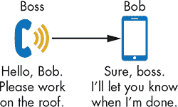
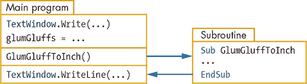
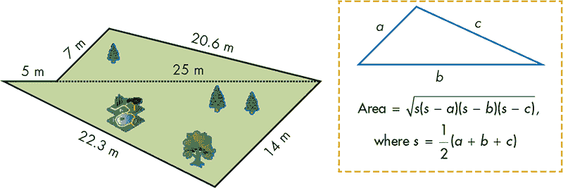
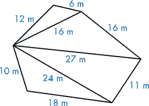
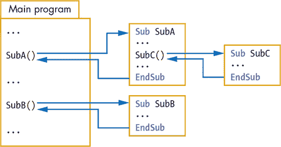
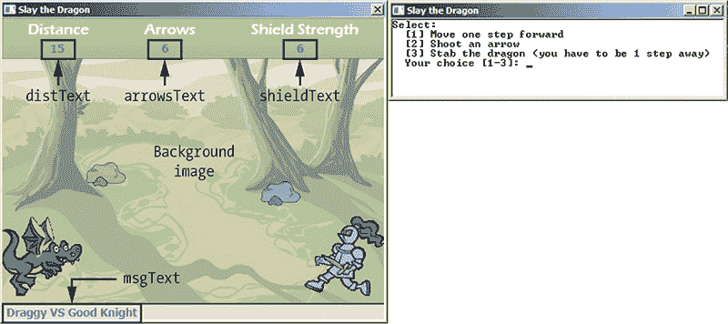
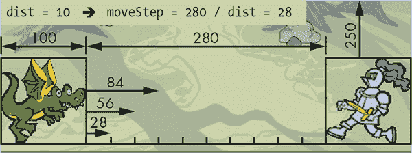
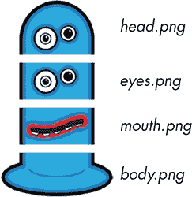
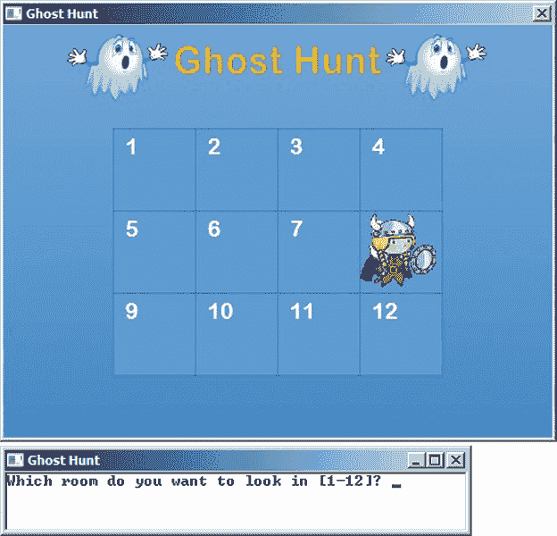

## 10

**使用子程序解决问题**


到目前为止，你写的程序都很简短，容易理解。但随着你开始处理更复杂的问题，你将需要编写更长的程序。理解长程序可能会是一个挑战，因为你需要跟踪程序中的许多不同部分。在本章中，你将学习如何将程序组织成更小的部分。

一种名为*结构化编程*的方法始于 1960 年代中期，目的是简化编写、理解和维护计算机程序的过程。与其编写一个单一的、大型程序，不如将程序分成更小的部分。每个部分解决整个任务的一部分，*子程序*实现这些较小的部分，作为长程序的一部分。

子程序是创建大型程序的基本构建块（见图 10-1）。在本章中，你将深入了解子程序的奇妙世界，学习如何在它们之间传递数据，并利用它们来构建大型程序和有趣的游戏！


*图 10-1：子程序是大型程序的构建块*

### 为什么使用子程序？

假设你经营一家建筑公司。你的工作是协调承包商的工作并建造房屋。作为经理，你不需要了解建房的所有细节：水管工负责水管工作，屋顶工铺设屋顶瓦片，电工负责布线。每个承包商都知道自己的工作，并且在接到你的电话时，随时准备工作。

这非常类似于子程序的工作方式！每个子程序都有自己的名字，就像水管工的名字是马里奥一样。每个子程序执行不同的任务，就像水管工和屋顶工有不同的工作，但所有人都在建造房屋时不可或缺。作为程序员，你是经理，你的工作是在构建程序时解决问题。你调用你的承包商（也就是你的子程序），并告诉他们你何时需要他们工作（见图 10-2）。你通过在编辑器中键入语句来开始编写程序。当你需要执行一个子程序处理的任务时，只需调用该子程序并等待。当子程序完成任务后，你就可以继续执行程序中的下一步。



*图 10-2：老板（主程序）调用 Bob 子程序*

这种“呼叫与等待”的策略没有什么新鲜的，你从第一章开始就已经在使用它了。当你调用一个对象的方法时，你实际上是在把工作交给那个在 Small Basic 库中的对象。子程序就像方法，但*你*必须编写子程序中的所有语句。子程序帮助你组织思维过程，并使修复错误变得更加容易。

### 编写子程序

让我们用一个有趣的例子来学习如何编写子程序：在他的旅行中，格列佛曾与小人国的国王和王后共进晚餐。在晚餐时，国王解释说自己有 8.5 个 glum-gluffs 高。格列佛后来得知，1 个 glum-gluff 大约等于 0.75 英寸。为了了解小人国的物品大小与我们这边的物品大小如何比较，编写清单 10-1 中的程序，将 glum-gluffs 转换为英寸。

```
1 ' GlumGluff.sb
2 TextWindow.Write("How many glum-gluffs? ")
3 glumGluffs = TextWindow.ReadNumber()
4
5 inches = 0.75 * glumGluffs               ' Converts to inches
6 inches = Math.Round(inches * 100) / 100  ' Rounds to 2 decimal places
7 TextWindow.WriteLine("That's about " + inches + " inches.")
```

*清单 10-1：转换度量单位*

这个程序看起来和你已经习惯的那些程序一样！你提示用户输入 glum-gluff 的度量值（第 2 行），将输入值读入`glumGluffs`变量（第 3 行），将输入的数字转换为英寸（第 5 行），将结果四舍五入到小数点后两位（第 6 行），然后显示结果（第 7 行）。运行程序来计算国王的身高是多少英寸；记住他是 8.5 个 glum-gluffs 高。

接下来，让我们重写这个程序，并将转换语句（第 5–6 行）放入一个名为`GlumGluffToInch()`的子程序中。请在清单 10-2 中输入代码。

```
 1 ' GlumGluff2.sb
 2 TextWindow.Write("How many glum-gluffs? ")
 3 glumGluffs = TextWindow.ReadNumber()
 4
 5 GlumGluffToInch()    ' Calls the subroutine
 6 TextWindow.WriteLine("That's about " + inches + " inches.")
 7
 8 ' This subroutine converts from glum-gluffs to inches
 9 ' Input: glumGluff; the size in glum-gluff units
10 ' Output: inches; the size in inches rounded to 2 decimal places
11 Sub GlumGluffToInch
12   inches = 0.75 * glumGluffs
13   inches = Math.Round(inches * 100) / 100
14 EndSub
```

*清单 10-2：调用子程序*

这段代码的功能与清单 10-1 中的代码相同，但它使用了一个子程序。子程序是一组完成特定任务的语句（就像雇佣马里奥水管工来建造一个豪华厕所）。在这个例子中，你的子程序将 glum-gluffs 转换为英寸。构成子程序的语句被`Sub`和`EndSub`关键字包围（第 11–14 行）。子程序的名称跟在`Sub`关键字后面（第 11 行）。定义子程序时，不要在其名称后加上圆括号。

但仅仅定义了一个子程序，并不意味着你的程序会自动执行它。要运行一个子程序，你需要*调用*（或*激活*）它！要调用子程序，你需要输入子程序的名称，后面跟上圆括号（第 5 行）。第 5 行的语句意味着“运行名为`GlumGluffToInch()`的子程序，然后返回到子程序调用后的下一行”（在这个例子中是第 6 行）。这就像你在打扫房间时休息去看电视，然后回来继续原来的工作。图 10-3 展示了子程序在程序中的工作原理。



*图 10-3：展示* GlumGuff2.sb *如何调用* `GlumGluffToInch()` *子程序*

这是该程序的输出示例：

```
How many glum-gluffs? 8.5
That's about 6.38 inches.
```

子程序可以访问主程序中的所有变量，主程序也可以访问子程序中的所有变量。变量`glumGluffs`是在主程序中创建并赋值的（第 3 行），但是它被子程序用来知道需要转换多少个 glum-gluffs（第 12 行）。而变量`inches`是在子程序内部创建的（第 12 行），但主程序读取它并将其值显示给用户（第 6 行）。

下面是将单位转换代码放入子程序的一些好理由：

1.  你将单位转换的细节从主程序中隔离（或分离）出来。现在主程序不必担心转换是如何进行的。这使得你的代码更易于阅读和维护。

1.  如果出现错误，你知道在哪里查找，这使得调试变得更容易。

1.  你不必一遍遍地写相同的代码！如果不使用子程序，当程序需要多次执行相同的语句时，你必须在代码中重复这些语句。但如果将这些语句放入子程序中，你可以在程序的任何位置调用它（*代码复用*）。你将在下一节中练习这个技巧。

**注意**

*在本书中，我们会将子程序的名称以大写字母开头。我们还会将所有子程序写在每个主程序的底部。我们建议你在自己的程序中也采用这种做法：它会帮助你保持条理！*

**试试看 10-1**

当格列佛问什么是 glum-gluff 时，他被告知它是 mumgluff 的 1/20。编写一个名为`MumGluffToFoot()`的子程序，将 mum-gluff 转换为英尺。编写一个程序，提示用户输入一个 mum-gluff 的测量值，调用子程序，然后显示结果。

### 子程序的输入和输出

你可以将子程序视为一个为主程序提供服务的小程序。当主程序需要该服务时，它准备好子程序所需的输入，然后调用子程序开始工作。子程序运行并将其输出保存在某些变量中，然后返回主程序。当主程序继续时，它查看来自子程序的任何新信息，并根据这些数据决定接下来该做什么。

Small Basic 不允许你像在对象的方法中那样通过括号向子程序传递参数（例如`GraphicsWindow`的`DrawLine()`方法）。它也没有定义直接返回值的子程序（就像`Math.Round()`方法一样）。所以你需要使用变量在主程序和子程序之间传递数据。让我们看看这是如何工作的。

好消息！你继承了一块土地（图 10-4）来自钱袋叔叔。但是在你能卖掉这块土地之前，你需要知道这块土地的面积。图中还显示了海伦公式，它可以根据三角形的三条边长计算面积。如果你不熟悉这个公式也不用担心；你不需要完全理解某个东西才能使用它（否则大多数人都不能上厕所了）。



*图 10-4：计算你继承的土地面积*

因为这块土地由两个三角形组成，你可以计算这两个三角形的面积，然后将它们相加。请参阅清单 10-3，注意我们如何将计算三角形面积的代码（海伦公式）放入子程序中。

```
 1 ' LandArea.sb
 2 ' Calculates the area of the first triangle
 3 side1 = 7
 4 side2 = 20.6
 5 side3 = 25
 6 TriangleArea()
 7 totalArea = area    ' Saves the result from the subroutine call
 8
 9 ' Calculates the area of the second triangle
10 side1 = 30
11 side2 = 14
12 side3 = 22.3
13 TriangleArea()
14 totalArea = totalArea + area    ' Adds the new area
15
16 totalArea = Math.Round(totalArea * 100) /  100 ' Rounds the answer
17 TextWindow.WriteLine("Area = " + totalArea + " square meters")
18
19 ' Subroutine: computes the area of a triangle given its three sides
20 ' Inputs: side1, side2, and side3; the length of the three sides
21 ' Outputs: area; the area of the triangle
22 ' Temporary variables: s; the semiperimeter
23 Sub TriangleArea
24   s = 0.5 * (side1 + side2 + side3)
25   area = Math.SquareRoot(s * (s - side1) * (s - side2) * (s - side3))
26 EndSub
```

*清单 10-3：多次调用子程序*

这是此程序的输出：

```
Area = 208.63 square meters
```

主程序设置第一个三角形的三条边的长度（第 3-5 行），然后调用`TriangleArea()`子程序（第 6 行）。子程序（第 23-26 行）将计算出的面积保存在一个名为`area`的变量中。子程序调用之后，主程序将第一个面积存储在`totalArea`变量中（第 7 行）。如果没有这一步，下一次调用`TriangleArea()`子程序时，存储在`area`中的值会丢失。接着，主程序设置计算第二个三角形面积的值（第 10-12 行），并再次调用子程序（第 13 行）。当子程序结束时，主程序将新的面积加到`totalArea`中（第 14 行）。然后，主程序将结果四舍五入（第 16 行）并显示出来（第 17 行）。

`TriangleArea()`子程序使用一个名为`s`的临时变量来存储*半周长*，即当前形状周长的一半（第 24 行）。注意这个变量是如何在第 25 行用于计算面积的。这个变量并不是为了供主程序使用的，主程序只关心`area`变量。但是主程序知道它的存在（例如，它可以显示该变量）。由于你的子程序可能会改变属于主程序的变量，请确保你的变量命名清晰明确。例如，如果`s`变量容易混淆，可以将它重命名为`semiperimeter`，这样你就能记住它的作用。

**试试这个 10-2**

钱袋叔叔又给你留了一块地（图 10-5）！更新清单 10-3 中的程序来计算它的面积（所有尺寸单位为米）。



*图 10-5：你的新土地*

### 嵌套子程序

如果你的任务是打扫房子，你可能会通过和你妹妹商量让她清洁窗户，并让你的狗打扫桌子下的地板来得到帮助。同样，一个子程序可能会调用其他子程序来帮助它完成更大的任务。在图 10-6 中，主程序调用了一个子程序`SubA()`，然后`SubA()`又调用了另一个子程序`SubC()`。从其他子程序中调用的子程序被称为*嵌套子程序*。



*图 10-6：展示嵌套子程序*

**注意**

*如果你的程序包含许多子程序，你可以将这些子程序放在程序的末尾，按照你喜欢的顺序排列。例如，`SubA()`的代码放在`SubB()`之前或之后都没关系。重要的是你调用这些子程序的顺序，而不是它们在代码中的位置！*

为了尝试这个概念，你将与计算机一起玩“辣椒敢挑战”，一款刺激的机会游戏。游戏开始时，玩家会拿到 10 张虚拟卡片，背面朝下。其中一张卡片上有一个哈瓦那辣椒，其他的都是空白的。玩家抽一张卡片，希望是空白卡片。如果玩家抽到带有辣椒的卡片，玩家必须吃下辣椒，计算机获胜！如果玩家没有抽到辣椒卡片，计算机会轮到自己。游戏在玩家或计算机吃到辣椒并急忙去喝水时结束。输入清单 10-4 中的主程序到 Small Basic。稍后你将添加子程序。

```
 1 ' PepperDare.sb
 2 player = 1  ' 1 for player, 2 for computer
 3 pepper = Math.GetRandomNumber(10) ' Which card has the pepper
 4
 5 Again:
 6 Pick()      ' Updates the two variables: card and name
 7 If (card = pepper) Then
 8   TextWindow.Write("Hot tamale, it's a pepper! ")
 9   TextWindow.WriteLine(name + " wins!")
10   TextWindow.WriteLine("")
11 Else
12   TextWindow.Write("The card is blank. ")
13   TextWindow.WriteLine("You put it back in and shuffle the deck.")
14   TextWindow.WriteLine("")
15   player = 3 - player   ' Switches the player
16   Goto Again
17 EndIf
```

*清单 10-4：设置辣椒敢挑战*

游戏通过将`player`变量设置为 1 来开始，赋予你第一回合（第 2 行）。然后它随机选取 10 张卡片中的 1 张作为辣椒卡片（第 3 行）。接着它开始一个循环（第 5–17 行）来轮流进行。在每一轮中，游戏通过调用`Pick()`子程序（第 6 行）随机为玩家（或计算机）选一张卡片。如果选中的卡片上有辣椒（第 7 行），游戏会显示获胜者的名字（第 9 行），并结束游戏，因为程序会跳出`If`循环，从第 10 行跳到第 17 行，跳过第 16 行的`Goto`循环。

否则，程序会显示`卡片是空白的。你把它放回去并重新洗牌。`（第 12–13 行），表示玩家（或计算机）抽到了一张空白卡片。然后游戏会切换到下一个玩家（第 15 行）并开始新一轮（第 16 行）。第 15 行的语句是这样工作的：如果`player`是 1（你，用户），则 3 - 1 等于 2（切换到计算机的回合）；如果`player`是 2（计算机），则 3 - 2 等于 1（切换回用户的回合）。

接下来，你将把清单 10-5 中的`Pick()`子程序添加到程序的底部。

```
 1 Sub Pick
 2   If (player = 1) Then
 3     name = "The computer"
 4     TextWindow.WriteLine("Your turn. Pick a card.")
 5   Else
 6     name = "The player"
 7     TextWindow.WriteLine("The computer picks a card.")
 8   EndIf
 9
10   TextWindow.Write("[Press any key...]")
11   TextWindow.PauseWithoutMessage()
12   TextWindow.WriteLine("")
13
14   card = Math.GetRandomNumber(10) ' Picks a random card
15   Animate() ' Animates the delay in picking a card
16 EndSub
```

*清单 10-5：辣椒敢挑战的* `Pick()` *子程序*

子程序首先检查当前的玩家（你或计算机），然后设置`name`变量（第 3 行和第 6 行）。接下来，它要求你按任意键让你或计算机抽一张卡片（第 10–12 行）。然后它随机抽取一张卡片（第 14 行），并调用嵌套的`Animate()`子程序在文本窗口中显示一个箭头的动画。

现在将清单 10-6 中的`Animate()`子程序添加到程序的底部。

```
1 Sub Animate
2   For N = 1 To card
3     TextWindow.Write("-")
4     Program.Delay(100)
5   EndFor
6   TextWindow.Write("-> ")
7 EndSub
```

*清单 10-6：动画延迟的子程序*

不用担心这里的`For`循环。你将在第十三章中深入学习它。目前，这段代码只是缓慢地显示一个可变长度的箭头。以下是完成的辣椒敢挑战程序的示例运行：

```
Your turn. Pick a card.
[Press any key...]
--> The card is blank. You put it back in and shuffle the deck.

The computer picks a card.
[Press any key...]
--------> The card is blank. You put it back in and shuffle the deck.

Your turn. Pick a card.
[Press any key...]
---------> Hot tamale, it's a pepper! The computer wins!
```

**注意**

*子程序不仅可以调用其他子程序，还可以调用自身（这称为*递归*）！请查看在线资源了解更多内容。*

**尝试 10-3**

多次玩《胡椒敢挑战》游戏，理解它是如何运作的。想出一些改进的想法，然后尝试实现这些想法。

### 创建龙游戏

上一个示例向你展示了子程序如何为你的程序增加结构性和清晰度。你将程序分解成更小的部分，逐一解决它们。尽管每个问题都不同，没有一种通用的解决方案，我们建议你考虑一些方法来思考任何问题。

首先，花些时间彻底理解问题。在跳入泳池之前，你不会先看看水的情况吧？（如果池水里是布丁怎么办？）当你清楚需要解决的问题时，规划一个总体解决方案。然后将其分解为主要任务。作为解决方案的规划者，你决定这些任务是什么。没有对错之分；通过练习，你会在做这些选择时变得更好。但如果你从整体解决方案开始并将其分解成较小的任务，程序的逻辑会更清晰。

为了展示这个问题解决策略，我们来制作一个如图 10-7 所示的龙游戏。



*图 10-7：龙游戏的用户界面*

在这个游戏中，你控制骑士，而你的任务是击杀龙。屏幕上你可以看到用于记录分数的变量，并且玩家可以选择三种行动方式来进行游戏。

游戏开始时，勇敢的骑士位于右侧，距离龙龙（Draggy）有一定的距离。勇敢的骑士有一把弓和一些箭矢，他的盾牌有一定的强度（程序会随机选择这些数值）。骑士先行动。他可以向前移动一步、射箭攻击龙，或者用剑刺击龙（但仅当他与龙相距 1 步时）。如果箭矢击中龙，它会立刻杀死龙！使用剑时，骑士有 50%的机会击杀龙（但仅在足够接近时）。如果勇敢的骑士击杀了龙龙，他将成为年度骑士，赢得一场属于自己的舞会，并把自己的画像挂在城堡墙上。

一旦勇敢的骑士行动，龙龙就会向骑士喷火。如果火焰击中骑士，它会削弱骑士的盾牌。当盾牌失去强度时，骑士变得毫无防备。从这一点开始，如果龙的火焰再次击中骑士，它将烧死骑士！整个城市将受到无情、凶猛的龙的攻击。游戏结束！

游戏使用了五个图像，你可以在本章的文件夹中找到它们：背景图像（你的战场）、两张龙的图像（一张图像显示龙的火焰）、骑士的图像，以及一张箭矢的图像。按照步骤 1-10 制作一个有趣的龙游戏！

#### *步骤 1：打开启动文件*

打开本章代码文件夹中的*Dragon_Incomplete.sb*文件。这个文件包含了示例 10-7 中的代码，并为你的子例程预留了空白位置。你将一步步添加这些子例程的代码。程序的文件夹中也包含了你所需要的所有图像，还提供了完整的游戏代码*Dragon.sb*，以防你遇到困难。

```
 1 ' Dragon_Incomplete.sb
 2 SetUp()    ' Does one-time set up
 3
 4 NewGame()  ' Sets the parameters for a new game
 5
 6 UpdateUserInterface() ' Shows values on background image
 7
 8 NextMove:
 9 GetChoice()     ' Displays options and gets the knight's choice
10
11 ProcessChoice() ' Processes the user's choice
12
13 DragonFire()    ' Now it's the dragon's turn
14 Goto NextMove
```

*示例 10-7：龙游戏的高级结构*

首先，你调用`SetUp()`子例程（第 2 行），绘制背景图像，创建文本形状（用于显示距离、箭的数量等），并加载游戏的图像（龙、骑士和箭）。第 4 行调用`NewGame()`来设置新游戏的参数，包括骑士的箭数、盾牌强度和与龙的距离。在第 6 行，你调用`UpdateUserInterface()`来更新游戏的用户界面（UI）。然后，代码进入一个循环（第 8–14 行）来管理游戏。每轮，你询问骑士的下一步操作（第 9 行），通过调用`ProcessChoice()`来处理他的选择（第 11 行），然后轮到龙（第 13 行）。正如你将看到的，这些子例程会跟踪游戏状态，并在有赢家时结束游戏！

接下来，你将逐个处理这些子例程。

#### *步骤 2：编写 SetUp() 子例程*

你将从编写`SetUp()`子例程开始，这个子例程为你的游戏创建场景。将示例 10-8 中的代码添加到你的程序中。

```
 1 Sub SetUp
 2   GraphicsWindow.Title = "Slay the Dragon"
 3   TextWindow.Title = GraphicsWindow.Title
 4
 5   GraphicsWindow.Width = 480
 6   GraphicsWindow.Height = 380
 7   GraphicsWindow.CanResize = 0
 8   GraphicsWindow.FontSize = 14
 9   GraphicsWindow.Left = 40
10   ' Positions the text window
11   TextWindow.Left = GraphicsWindow.Left + GraphicsWindow.Width + 20
12   TextWindow.Top = GraphicsWindow.Top
13
14   path = Program.Directory
15   GraphicsWindow.DrawImage(path + "\bkgnd.png", 0, 0)
16
17   ' Creates text objects to show distance, arrows,
18   ' shield strength, and message
19   distText = Shapes.AddText("")
20   arrowsText = Shapes.AddText("")
21   shieldText = Shapes.AddText("")
22   msgText = Shapes.AddText("Draggy VS Good Knight")
23   Shapes.Move(distText, 60, 30)
24   Shapes.Move(arrowsText, 200, 30)
25   Shapes.Move(shieldText, 370, 30)
26   Shapes.Move(msgText, 5, 362)
27
28   ' Loads the images for the knight, dragon, and arrow
29   knightImg = Shapes.AddImage(path + "\knight.png")
30   dragon1Img = Shapes.AddImage(path + "\dragon1.png")
31   dragon2Img = Shapes.AddImage(path + "\dragon2.png")
32   arrowImg = Shapes.AddImage(path + "\arrow.png")
33   Shapes.Move(dragon1Img, 0, 250)
34   Shapes.Move(dragon2Img, 0, 250)
35   Shapes.Move(knightImg, 380, 250)
36
37   Shapes.HideShape(dragon2Img)
38   Shapes.HideShape(arrowImg)
39 EndSub
```

*示例 10-8：设置窗口和属性*

这段代码包含了你游戏的一次性设置；虽然有点长，但我们会一步步讲解。你设置了图形窗口和文本窗口的标题（第 2–3 行）。这些标题将在游戏运行时显示在这些窗口的标题栏中（见图 10-7）。

然后你设置图形窗口的大小（第 5–7 行）、字体大小（第 8 行）和位置（第 9 行）。接着，你将文本窗口定位到图形窗口的右侧（第 11–12 行）。在绘制背景图像（第 14–15 行）之后，你创建并定位文本形状，用于显示游戏界面上的所有数字（第 19–26 行）。然后，你加载并定位骑士、龙和箭的图像（第 29–35 行）。最后，你隐藏龙喷火和箭的图像，因为此时并不需要（第 37–38 行）：当龙喷火和骑士射箭时，你会显示这些图像。

当我们构建这个程序时，我们通过反复试探的方法确定了文本和图像（包括我们使用的数字）在背景图像上的位置（我们猜测并调整，直到找对位置）。你在设计自己未来的游戏 UI 时，可能也需要采用这种方法。

#### *步骤 3：加入一点运气元素*

接下来，你需要为游戏添加一些运气因素。每次运行游戏时，我们希望好骑士能获得不同数量的箭矢，距离龙有不同的远近，盾牌强度也有所不同。为此，在清单 10-9 中将 `NewGame()` 子程序添加到你的程序中。

```
1 Sub NewGame
2   dist = 9 + Math.GetRandomNumber(10) ' 10 to 19
3   arrows = Math.Floor(0.4 * dist)       ' 4 to 8
4   shield = Math.Floor(0.4 * dist)       ' 4 to 8
5   moveStep = 280 / dist                 ' Knight's move in pixels
6 EndSub
```

*清单 10-9：设置新游戏*

在第 2 行，你将 1 到 10 之间的随机数加上 9，这样就设置了距离 `dist`，它的值在 10 到 19 之间。这是好骑士必须走的步数，才能到达龙的地方。接下来，你将箭矢的数量设置为距离的 40%（第 3 行）。骑士离龙越远，他拥有的箭矢就越多。在第 4 行，你设置骑士盾牌的强度——同样是基于他与龙的距离来设置。

让我们稍微考虑一下 `moveStep` 这一行。背景图片的宽度是 480 像素。龙的宽度是 100 像素，骑士的宽度也是 100 像素。当我们将龙和骑士放置在背景上时，从龙的右边缘到骑士的左边缘的距离是 280 像素。所以每次好骑士向前移动时，我们将把他的图像向左移动 `280 / dist` 像素。

**提示**

*你可以将第 3 行和第 4 行中的分数从 0.4 改为其他值，以使游戏变得更容易或更难。完成游戏后，尝试更改分数并玩几次游戏！*

#### *步骤 4：让玩家知道发生了什么*

在设置好游戏参数后，你需要将这些信息展示给用户。在清单 10-10 中添加 `UpdateUserInterface()` 子程序。

```
1 Sub UpdateUserInterface
2   Shapes.SetText(distText, dist)
3   Shapes.SetText(arrowsText, arrows)
4   Shapes.SetText(shieldText, shield)
5 EndSub
```

*清单 10-10：更新文本的子程序*

这个子程序非常基础（而且很小！）。你只需要使用 `Shapes` 对象的 `SetText()` 方法，并传入文本形状的标识符以及你要显示的数字。回想一下，我们在 `SetUp()` 子程序中创建这些文本形状时保存了这些标识符（清单 10-8 中的第 19 到 21 行）。

#### *步骤 5：通过 GetChoice() 获取玩家的选择*

如果你现在运行游戏，你应该能看到所有的图片和数字都已经就位，但还什么都不会发生。你需要开始接受骑士的命令，因此是时候在清单 10-11 中添加 `GetChoice()` 子程序了。

```
 1 Sub GetChoice
 2   AskAgain:
 3   TextWindow.WriteLine("Select:")
 4   TextWindow.WriteLine("  [1] Move 1 step forward")
 5   TextWindow.WriteLine("  [2] Shoot an arrow")
 6   TextWindow.WriteLine("  [3] Stab the dragon (you have to be 1 step away)")
 7   TextWindow.Write("  Your choice [1-3]: ")
 8
 9   choice = TextWindow.ReadNumber()
10   If((choice <> 1) And (choice <> 2) And (choice <> 3)) Then
11     Goto AskAgain
12   EndIf
13
14   If ((choice = 2) And (arrows = 0)) Then
15     Shapes.SetText(msgText, "You ran out of arrows! Borrow some from Link.")
16     Goto AskAgain
17   EndIf
18
19   If ((choice = 3) And (dist > 1)) Then
20     Shapes.SetText(msgText, "You're too far to use your sword. Too bad
       you can't train dragons.")
21     Goto AskAgain
22   EndIf
23
24   Shapes.SetText(msgText, "")
25   TextWindow.WriteLine("")
26 EndSub
```

*清单 10-11：获取用户选择并显示任何错误*

你首先显示选项给用户（第 3-7 行）。你读取用户对“勇敢骑士”的选择（第 9 行），并确保它是有效的。如果用户输入的数字不是 1、2 或 3，你会要求他们重新输入（第 10-12 行）。如果用户选择射箭但没有箭，你会告诉他们箭已用完并再次询问（第 14-17 行）。如果他们想刺杀龙但距离太远，你会告诉他们距离太远并要求重新选择（第 19-22 行）。否则，用户做出的选择是可接受的。你清除第 24 行的消息文本，向文本窗口添加一行空白文本以准备下一个提示（第 25 行），然后返回主程序（第 26 行）。

#### *第 6 步：处理玩家的选择*

现在用户已做出选择，你需要检查`choice`变量来决定接下来要做什么。将清单 10-12 中的`ProcessChoice()`子程序添加到你的程序中。

```
1 Sub ProcessChoice
2   If (choice = 1) Then     ' Move-forward subroutine
3     MoveKnight()
4   ElseIf (choice = 2) Then ' Shoot-arrow subroutine
5     ShootArrow()
6   Else ' Stab subroutine
7     StabDragon()
8   EndIf
9 EndSub
```

*清单 10-12：跳转到选择的子程序*

你在`choice`变量上使用`If/Else`条件结构，并为每个选择调用不同的子程序。接下来，你将编写这三个子程序！

#### *第 7 步：通过 MoveKnight()添加运动效果*

将清单 10-13 中的`MoveKnight()`子程序添加进来，让“勇敢骑士”有了生气，并开始移动。

```
 1 Sub MoveKnight
 2   dist = dist - 1
 3   Shapes.SetText(distText, dist)
 4
 5   Shapes.Move(knightImg, 100 + dist * moveStep, 250)
 6
 7   If (dist = 0) Then  ' Checks whether the knight touched the dragon
 8     Shapes.SetText(msgText, "The dragon swallowed you! You taste like chicken.")
 9     GameOver()
10   EndIf
11 EndSub
```

*清单 10-13：移动“勇敢骑士”的子程序*

你首先通过减少骑士与龙的距离 1 步（第 2 行），然后在游戏界面上显示新的距离（第 3 行）。接着，你将骑士的图像向左移动（第 5 行）。

为了理解这个过程，假设骑士与龙的初始距离为`dist`，为 10，这使得`moveStep = 28`，如图 10-7 所示。当骑士距离龙 10 步时，骑士图像的左上角位于(100 + (10 × 28), 250)。当骑士距离龙 9 步时，骑士图像的左上角位于(100 + (9 × 28), 250)，而当他距离龙 8 步时，图像的左上角位于(100 + (8 × 28), 250)，依此类推。为了移动骑士，你将图像的水平位置设置为 100 加上当前距离`dist`乘以`moveStep`，并将图像的垂直位置设置为 250（见图 10-8）。



*图 10-8：展示骑士的运动*

移动骑士后，你检查他是否碰到了龙（第 7 行）。如果碰到了，你告诉“勇敢骑士”龙觉得他非常美味，并调用`GameOver()`子程序。这个子程序在清单 10-14 中；现在将它添加到你的程序中。

```
1 Sub GameOver
2   TextWindow.Pause()
3   Program.End()
4 EndSub
```

*清单 10-14：运行`GameOver()`子程序*

这个子程序调用`Pause()`方法，给用户一个阅读消息的机会（第 2 行）。当用户按下任意键时，`Pause()`方法结束，你调用`End()`方法退出程序（第 3 行）。

#### *步骤 8：使用 ShootArrow() 射箭*

将清单 10-15 中的 `ShootArrow()` 子程序添加到程序中，让勇敢的骑士成为一个超越鹰眼的弓箭高手。

```
 1 Sub ShootArrow
 2   arrows = arrows - 1
 3   Shapes.SetText(arrowsText, arrows)
 4
 5   range = Math.GetRandomNumber(dist)
 6
 7   ' Animates the arrow
 8   pos1X = 100 + dist * moveStep
 9   pos2X = 100 + (dist - range)* moveStep
10   Shapes.Move(arrowImg, pos1X, 280)
11   Shapes.ShowShape(arrowImg)
12   Shapes.Animate(arrowImg, pos2X, 280, 2000)
13   Program.Delay(2000)
14   Shapes.HideShape(arrowImg)
15
16   If (range = dist) Then    ' You hit the dragon right on
17     Shapes.SetText(msgText, "Perfect shot. The dragon's dead! You kiss the
       princess's frog.")
18     GameOver()
19   Else
20     Shapes.SetText(msgText, "Your arrow missed! Robin Hood is giving lessons.")
21     Program.Delay(2000)     ' To read the message
22   EndIf
23 EndSub
```

*清单 10-15：射箭*

你开始时使用一支箭（第 2 行），并在界面上显示剩余的箭（第 3 行）。接着，随机设置箭的射程为 1 到龙的距离之间的某个数字（第 5 行）。骑士离龙越近，他击中目标的概率越高。接下来的代码块（第 8–14 行）展示箭的动画。水平起始位置 `pos1X` 和骑士的位置相同（第 8 行），终点位置 `pos2X` 基于选定的射程（第 9 行）。你将箭移到起始位置（第 10 行），显示它（第 11 行），将其动画化到最终位置（第 12 行），等待箭到达目标（第 13 行），然后将其隐藏（第 14 行）。你可以更改第 12 行和第 13 行中的值 `2000` 来调整动画的时长。

动画完成后，你检查箭是否击中了龙（第 16 行）。如果击中，游戏结束（第 17–18 行），舞会属于你！否则，你告诉勇敢的骑士他的箭错过了（第 20 行），延迟程序以便用户阅读信息（第 21 行），然后返回 `ProcessChoice()` 子程序，再次返回主程序，轮到龙行动。

#### *步骤 9：使用 StabDragon() 挥剑*

现在，添加清单 10-16 中的最后一个骑士子程序。

```
1 Sub StabDragon
2   If (Math.GetRandomNumber(2) = 1) Then
3     Shapes.SetText(msgText, "You killed the dragon! You marry the princess
      and 7 dwarves.")
4     GameOver()
5   Else
6     Shapes.SetText(msgText, "Your sword missed! Good one, Lance-a-Little!")
7     Program.Delay(2000) ' To read the message
8   EndIf
9 EndSub
```

*清单 10-16：刺击龙*

你随机选择数字 1 或 2。如果数字是 1（第 2 行），骑士击中了龙，游戏结束（第 3–4 行）。如果骑士未击中，你告诉骑士他错过了（第 6 行），并延迟程序以便用户阅读信息（第 7 行），然后返回 `ProcessChoice()` 子程序。

#### *步骤 10：喷火*

如果骑士没有击杀龙并结束游戏，主程序调用 `DragonFire()` 让龙有一个公平的机会。将清单 10-17 添加到你的程序中。

```
 1 Sub DragonFire
 2   Shapes.SetText(msgText, "The dragon ignited his fire. The Pokemon run.")
 3   Shapes.HideShape(dragon1Img)
 4   Shapes.ShowShape(dragon2Img)
 5   Program.Delay(1000)
 6   Shapes.HideShape(dragon2Img)
 7   Shapes.ShowShape(dragon1Img)
 8
 9   If (Math.GetRandomNumber(2) = 1) Then ' Knight is hit
10     If (shield = 0) Then                ' Shield is damaged
11       Shapes.SetText(msgText, "The dragon's fire BURNINATED you!")
12       GameOver()
13     Else
14       shield = shield - 1
15       Shapes.SetText(shieldText, shield)
16       Shapes.SetText(msgText, "You're hit! Your shield became weaker. Use
         the force!")
17     EndIf
18   Else
19     Shapes.SetText(msgText, "The fire missed you! Aunt Mildred could've used
       your luck.")
20   EndIf
21 EndSub
```

*清单 10-17：龙对勇敢的骑士喷火*

第 3–7 行展示龙的火焰动画。你隐藏正常的龙图像（第 3 行），并显示喷火的龙图像（第 4 行）。等待 1 秒（第 5 行），然后切换回原图像（第 6–7 行）。之后，龙有 50% 的机会用火焰击中骑士。你随机选择一个数字，1 或 2。如果是 1，表示龙击中了骑士（第 9 行）。在这种情况下，你检查盾牌的耐久度（第 10 行）；如果盾牌的耐久度为 0，游戏结束（第 11–12 行）。如果不是 0，你将盾牌的耐久度减 1（第 14 行），显示新的值（第 15 行），告诉骑士他被击中了（第 16 行），然后返回主程序。如果随机数是 2（第 18 行），你告诉骑士龙的火焰未击中他（第 19 行），然后返回主程序。

游戏完成了！多玩几次，享受你创造的游戏吧！

**尝试一下 10-4**

龙的游戏很有趣，但并不完美。当你多次玩这个游戏时，你会注意到一些你不喜欢的地方或可以改进的地方。现在这个游戏是你的，你可以做出任何你认为能让游戏更好的改动。你甚至可以改变消息和图形。前往 *[`tiny.cc/dragongame/`](http://tiny.cc/dragongame/)* 在画廊中分享你的游戏，并查看别人做了什么！

### 编程挑战

如果你卡住了，可以查看 *[`nostarch.com/smallbasic/`](http://nostarch.com/smallbasic/)* 获取解决方案，以及更多的资源和供教师与学生使用的复习问题。

1.  本挑战的文件夹包含了外星生物的头部、眼睛、嘴巴和身体的图像（见下图）。

    

    编写一个程序，提示用户输入外星生物的眼睛数量（2、4 或 6）和嘴巴数量（1 或 2）。然后让你的主程序调用 `DrawHead()`、`DrawEyes()`、`DrawMouths()` 和 `DrawBody()` 来绘制外星生物！例如，下面是一个有六只眼睛和两个嘴巴的外星人：

    

1.  在这个挑战中，你将开发一个游戏《鬼魂狩猎》（见下图）。打开本章文件夹中的文件 *GhostHunt_Incomplete.sb*（该文件夹中包含了你所需的所有图像）。一个鬼魂藏在 12 个房间中的 1 个房间里。为了找到鬼魂，用户选择一个房间。如果用户在那个房间找到鬼魂，他们就赢了！否则，鬼魂会试图找到用户（通过随机选择一个房间号）。如果鬼魂找到用户，游戏结束。否则，鬼魂会移动到另一个房间，用户可以再试一次。

    
