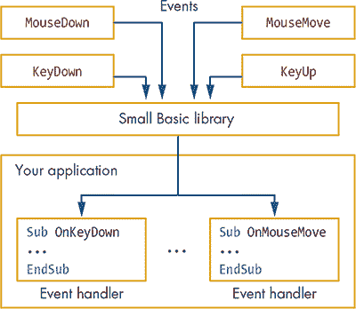
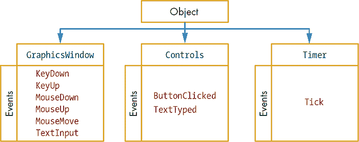
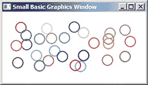
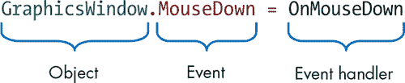
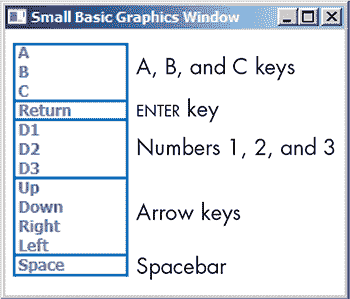
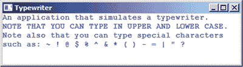
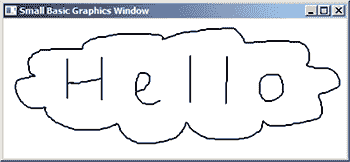

## 11

**事件驱动编程**


到目前为止，你写的程序大多是 *顺序执行* 的，因为它们是按照代码行的顺序，从上到下执行的。某些语句可能会进行比较或调用子程序以绕行，但总体来说，语句的顺序大多是线性的。

在某种程度上，这类似于你日常的生活方式：你起床、整理床铺、洗澡、吃早餐、看电视、梳头发，依此类推。但如果在这个过程中电话响了呢？如果你在等朋友打电话确认今晚的聚会，你最好接一下！即使你此时正在做某件事，你也会注意听电话。一旦你听到铃声（事件），你会放下手头的一切去接电话（希望不是你阿姨打来问你是否已经读完《高速公路上的小屋》）。

类似地，许多计算机程序（特别是游戏）使用 *事件驱动编程*，这意味着它们会监听并响应操作系统触发的事件（见图 11-1）。可以把 *事件* 看作是对某个动作做出反应的信号，例如移动或点击鼠标、点击按钮、敲击键盘、计时器到期等。Small Basic 库中的一些对象可以看到这些事件并告诉你它们何时发生。程序员称某个对象 *触发* 了一个事件。你可以通过处理这些事件来编写一些有趣的应用程序和游戏（比如一个超级有趣的爆炸农场游戏）。这些游戏通常会耐心等待玩家移动鼠标或按下某些键，然后执行相应的动作。



*图 11-1：基于事件的编程模型*

在图 11-1 中，事件位于顶部。当用户触发某个动作（如按键）时，Small Basic 库就会知道。如果你想知道某个事件发生的时刻，可以让 Small Basic 在事件发生时通知你，这样你就可以编写响应某些事件的程序。

Small Basic 库有三个处理事件的对象（见图 11-2）：`GraphicsWindow`、`Timer` 和 `Controls`。本章将研究 `GraphicsWindow` 和 `Timer` 对象的事件，而 `Controls` 对象的事件将在下一章讨论。



*图 11-2：Small Basic 中可用的事件*

### GraphicsWindow 事件

让我们先来探索`GraphicsWindow`中的事件。当用户与应用程序互动时，`GraphicsWindow`知道何时按下键、按下了哪些键，以及用户是否点击或移动鼠标。尽管`GraphicsWindow`知道这些事件的发生情况，但它并不会在事件发生时自动做任何事情。你需要指示`GraphicsWindow`在这些事件发生时通知你，这样你就可以使用它们。接下来，你将学习如何利用 Small Basic 关于用户的信息来创建有趣的互动应用。

#### *通过 MouseDown 事件创建图案*

让我们制作一个简单的应用程序，每次用户点击图形窗口时，都画一个随机颜色的圆。输入清单 11-1 中的代码。

```
1 ' Circles.sb
2 GraphicsWindow.MouseDown = OnMouseDown
3
4 Sub OnMouseDown
5   GraphicsWindow.PenColor = GraphicsWindow.GetRandomColor()
6   X0 = GraphicsWindow.MouseX - 10
7   Y0 = GraphicsWindow.MouseY - 10
8   GraphicsWindow.DrawEllipse(X0, Y0, 20, 20)
9 EndSub
```

*清单 11-1：点击鼠标画圆*

运行程序。一个示例输出显示在图 11-3 中。当你点击图形窗口内时，会画出一个随机颜色的圆形。制作一个有趣的图案，展示给别人，并试图说服他们这幅画是巴勃罗·毕加索画的！



*图 11-3：Circles.sb 的示例输出*

让我们看看清单 11-1 中的代码，了解 Small Basic 是如何处理事件驱动编程的。图 11-4 显示了该程序中的一行重要代码：第 2 行。



*图 11-4：事件处理器注册语句*

第 2 行的语句告诉`GraphicsWindow`对象，当发生`MouseDown`事件时，应该运行`OnMouseDown()`子程序。这个子程序也被称为*事件处理器*，因为它的目的是处理或处理一个事件。虽然你可以为这个子程序命名任何你想要的名称，但通常使用`OnEventName`的格式，这就是我们将处理器命名为`OnMouseDown`的原因。第 2 行的语句被称为*注册*事件处理器。在这个例子中，每次用户点击图形窗口时，Small Basic 都会调用`OnMouseDown()`子程序。

当用户点击图形窗口时，鼠标的 x 和 y 位置（相对于窗口的左上角）会保存在`GraphicsWindow`的`MouseX`和`MouseY`属性中。由于程序画一个直径为 20 的圆，并以鼠标点击位置为圆心，它从`MouseX`和`MouseY`中减去 10（以标记圆的左上角位置），然后将结果保存在`X0`和`Y0`变量中（第 6–7 行）。然后，子程序会画一个以鼠标点击位置为圆心、直径为 20 的圆（第 8 行）。

**试试 11-1**

修改清单 11-1 中的代码，改为画三角形和正方形，而不是圆形。如果你需要帮助，可以参考第三章回顾`GraphicsWindow`的绘图方法。

#### *通过 KeyDown 事件发射导弹*

许多电脑游戏使用键盘进行操作。例如，玩家可能使用方向键来移动主角，空格键来发射导弹，F1 键来获取帮助，P 键来捏角色的鼻子，以及 ESC 键来退出游戏。如果你想制作一个使用键盘输入的游戏，你需要在程序中添加`KeyDown`事件，这样你就可以知道用户按下了哪个键以及何时按下。

为了理解`KeyDown`事件，让我们编写一个简单的应用程序，显示用户按下的每个键的名称。在列表 11-2 中输入程序。

```
1 ' KeyDown.sb
2 yPos = 10
3 GraphicsWindow.KeyDown = OnKeyDown
4
5 Sub OnKeyDown
6   GraphicsWindow.DrawText(10, yPos, GraphicsWindow.LastKey)
7   yPos = yPos + 15
8 EndSub
```

*列表 11-2：显示用户按下的每个键*

一个带有一些注释的示例运行结果见于图 11-5。



*图 11-5：KeyDown.sb 的示例运行结果*

`yPos`变量设置了显示用户按下的键名的垂直位置。它从 10 开始，在显示完上一个按下的键名后（第 7 行），会增加 15。

你在第 3 行注册了`KeyDown`事件处理程序。每当用户按下一个键时，程序都会运行`OnKeyDown()`子程序。该子程序会显示按下的键的名称（第 6 行），并将`yPos`增加 15（第 7 行），以准备在下一行显示下一个键的名称。第 6 行的`GraphicsWindow.LastKey`属性提供了按下键的名称（作为字符串）。这个只读属性告诉你用户最后按下的是哪个键。

这个示例的重要性在于，它展示了 Small Basic 为不同的键盘键分配的名称。如果你想创建一个响应这些键的应用程序，你需要知道 Small Basic 是如何命名它们的。以下是你应该了解的其他一些细节：

1.  字母键（A–Z）的名称始终是大写的。例如，即使你输入字母`"a"`，`LastKey`也会将其注册为大写的`"A"`，无论是否打开大写锁定键或按下了 SHIFT 键。

1.  数字键（0-9）的名称采用`"Ddigit"`的形式。例如，数字 5 键的名称是`"D5"`。

1.  四个方向键分别命名为`"Up"`、`"Down"`、`"Right"`和`"Left"`。

1.  回车（或返回）键的名称是`"Return"`，而空格键的名称是`"Space"`。

1.  只要按下一个键，`KeyDown`事件会不断触发（大约每 35 毫秒一次）。这与`MouseDown`事件不同，后者仅在点击左键时触发一次。

如果你想在程序中测试某些键的按下，了解键名是很重要的。

**尝试一下 11-2**

输入并运行以下代码。按下键盘上的一些键，并观察它们在文本窗口中的名称。按住一个键一段时间，看看会发生什么。（确保在你输入时，图形窗口是活动窗口。）

```
TextWindow.Show()
GraphicsWindow.Show()
GraphicsWindow.KeyDown = OnKeyDown

Sub OnKeyDown
  TextWindow.WriteLine(GraphicsWindow.LastKey)
EndSub
```

当你尝试这个示例时，你注意到了什么？

#### *使用 TextInput 事件制作打字机*

`TextInput` 事件与 `KeyDown` 事件非常相似，但它仅在用户按下与文本相关的键时触发。这包括字母（A–Z）、数字（0–9）、特殊字符（如 !@#$%^&）以及其他键，如 ENTER、空格键、TAB 和 BACKSPACE。当 `TextInput` 事件被触发时，键盘上最后按下的字符会保存在 `GraphicsWindow.LastText` 属性中。

让我们看看这个事件是如何工作的。输入代码 Listing 11-3 来模拟打字机。我们知道打字机是旧式的，但嘿，情况还不算最糟；我们本可以在模拟算盘！

```
 1 ' Typewriter.sb
 2 x = 0                ' x position for displaying the last character
 3 y = 0                ' y position for displaying the last character
 4 GraphicsWindow.Title = "Typewriter"
 5 GraphicsWindow.FontName = "Courier New"
 6 GraphicsWindow.TextInput = OnTextInput
 7
 8 Sub OnTextInput
 9   Sound.PlayClick()     ' Plays a typewriter sound effect
10   If (GraphicsWindow.LastKey = "Return") Then
11     x = 0               ' Moves to next line
12     y = y + 15
13   Else
14     GraphicsWindow.DrawText(x, y, GraphicsWindow.LastText)
15     x = x + 8        ' Advances x position for the next character
16     If (x > GraphicsWindow.Width) Then ' If more than right margin
17       x = 0          ' Moves to the next line
18       y = y + 15
19     EndIf
20   EndIf
21 EndSub
```

*Listing 11-3：每次按键时发出打字机声音*

查看 Figure 11-6 中的示例输出。



*图 11-6：打字机的示例输出*

第 2 和第 3 行将光标设置在图形窗口的角落。第 4 行为窗口设置标题，第 5 行设置字体样式，第 6 行注册事件处理程序。第 9 行播放点击声音，第 10 到第 12 行在用户按下 ENTER 时前进一行。第 14 行写入用户输入的字符，第 15 行将光标移动到下一个位置，第 16 到第 18 行当光标到达右边缘时，将光标移动到下一行。

**注意**

*当你在此应用程序中进行实验时，你会注意到 `TextInput` 事件会在设置 `LastText` 属性的值之前，检查不同键的状态。例如，如果你在按住 SHIFT 键的同时按下 A 键，`LastText` 属性会报告大写字母 `"A"`；如果不按住 SHIFT 键，它则报告小写字母 `"a"`。*

**试一试 11-3**

更新 Listing 11-3，使每个字符显示为随机颜色。查看 Listing 11-1，获取如何随机更改颜色的灵感。

#### *使用 MouseMove 事件绘制图片*

为了理解如何使用 `MouseMove` 事件，你将编写一个应用程序，允许用户通过鼠标绘画。用户在图形窗口中点击左键，然后拖动鼠标进行绘画。完整程序见 Listing 11-4。

```
 1 ' Scribble.sb
 2 GraphicsWindow.MouseMove = OnMouseMove
 3
 4 Sub OnMouseMove
 5   x = GraphicsWindow.MouseX   ' Current x position of mouse
 6   y = GraphicsWindow.MouseY   ' Current y position of mouse
 7
 8   If (Mouse.IsLeftButtonDown) Then
 9     GraphicsWindow.DrawLine(prevX, prevY, x, y)
10   EndIf
11
12   prevX = x                   ' Updates the last (previous) position
13   prevY = y
14 EndSub
```

*Listing 11-4：用户移动鼠标时绘制线条*

*Scribble.sb 的示例输出见 Figure 11-7。*



*图 11-7：Scribble.sb 的示例输出*

`OnMouseMove()`子程序绘制一条从上次鼠标位置（你在第 12 行和第 13 行的`prevX`和`prevY`变量中保存的位置）到当前鼠标位置（你通过`GraphicsWindow`的`MouseX`和`MouseY`属性获取的当前位置）的线段。因为你希望用户仅在按下左键时绘制，所以`OnMouseMove()`子程序通过`Mouse.IsLeftButtonDown`属性（第 8 行）检查左键的状态。这个属性表示左键是否被按下。如果该值为真，子程序会绘制一条线段（第 9 行）；如果值不为真，则不会绘制线条。

**试试看 11-4**

更改清单 11-4，使用`TextInput`事件来设置画笔的颜色（R 代表红色，G 代表绿色，B 代表黑色，等等）。

### 实用提示

在继续之前，我们将给你一些处理事件和事件处理程序的提示。你可以使用相同的子程序处理多个事件。例如，看看这些语句：

```
GraphicsWindow.MouseDown = OnMouseEvent
GraphicsWindow.MouseMove = OnMouseEvent
```

这些语句使得`MouseDown`和`MouseMove`事件调用`OnMouseEvent()`子程序。这个功能对于使用许多事件的复杂游戏非常有用，所以请记住这一点。

你可以在注册事件处理程序子程序后修改它。例如，假设你使用以下语句注册了`OnMouseDown()`子程序来处理`MouseDown`事件：

```
GraphicsWindow.MouseDown = OnMouseDown
```

如果你后来决定停止响应`MouseDown`事件（例如，游戏结束时），你可以写出以下语句：

```
GraphicsWindow.MouseDown = DoNothing
```

现在，`DoNothing`是新的`MouseDown`事件处理程序。如果你在`DoNothing()`子程序中不写任何语句，程序将不会对`MouseDown`事件做出任何响应。

`MouseDown`事件通常会后跟一个`MouseUp`事件，但不要总是依赖`MouseUp`事件的发生。如果你在图形窗口内点击左键，然后在松开按钮之前将光标移到图形窗口外部，你的应用程序只会收到一个`MouseDown`事件通知。如果你编写的应用程序需要将这两个事件配对（例如，点击抓住一个球，松开来扔它），记住这一点非常重要。

在接下来的部分，你将通过创建一个完整的游戏来实践到目前为止所学的内容。你还将了解`Timer`对象及其`Tick`事件。准备好迎接一场激动人心的计算机游戏冒险吧！

### 创建一个金币狂潮游戏

让我们创建一个简单的游戏，玩家使用方向键控制乌龟移动，尽可能多地收集金币袋（见图 11-8）。金币袋会随机出现在网格上的某个位置。如果玩家在 2 秒内没有抓到金币袋，它会移动到其他地方。看看你能多快让乌龟移动吧！


*图 11-8：帮助乌龟抓取尽可能多的金币袋。*

**注意**

*网格是背景图像的一部分，但我们在图 11-8 中添加了 x 和 y 坐标，帮助你理解代码中使用的数字。请参考此图，想象乌龟和金袋是如何移动的。*

#### *步骤 1：打开启动文件*

打开本章文件夹中的 *GoldRush_Incomplete.sb* 文件。该文件夹中还包含了你需要的三张图像。按照接下来的四个步骤逐步了解应用程序的代码。启动文件包含程序的主要代码，如清单 11-5 所示。它准备了游戏的用户界面，注册了事件处理程序，并初始化了游戏的变量。该文件还包含了所有你将添加的子例程的空占位符（未在清单 11-5 中显示）。

```
 1 ' GoldRush_Incomplete.sb
 2 GraphicsWindow.Title = "GOLD RUSH"
 3 GraphicsWindow.CanResize = "False"
 4 GraphicsWindow.Width = 480
 5 GraphicsWindow.Height = 360
 6
 7 path = Program.Directory
 8 grid = Shapes.AddImage(path + "\Grid.png")
 9 player = Shapes.AddImage(path + "\Turtle.png")
10 gold = Shapes.AddImage(path + "\Gold.png")
11
12 ' Places the player (turtle) near the middle
13 XP = 4               ' x position (from 0 to 7)
14 YP = 3               ' y position (from 0 to 5)
15 Shapes.Move(player, XP * 60, YP * 60)
16
17 ' Creates the score text shape (over a black rectangle)
18 GraphicsWindow.BrushColor = "Black"
19 Shapes.AddRectangle(90, 20)
20 GraphicsWindow.FontSize = 14
21 GraphicsWindow.BrushColor = "Red"
22 scoreID = Shapes.AddText("Score: 0") ' For now
23
24 ' Registers two event handlers
25 GraphicsWindow.KeyDown = OnKeyDown
26 Timer.Tick = OnTick
27
28 ' Initializes variables
29 Timer.Interval = 2000 ' Ticks every 2 sec
30 score = 0             ' Keeps track of player's score
31 bagCount = 0          ' Counts how many bags so far
```

*清单 11-5：设置 Gold Rush 游戏*

第 3 到 5 行设置图形窗口的大小，以匹配背景图像的大小（*grid.png*）。第 8 到 10 行使用 `Shapes` 对象加载三张图像（背景网格、乌龟和金袋），并保存返回的标识符。你稍后需要这些标识符来移动乌龟和金袋。第 13 到 15 行将乌龟放置在网格的中间附近。请注意，网格上的每个方格大小为 60×60 像素。

第 18 到 22 行创建了你将用于显示玩家得分的文本形状。得分会以红色显示在屏幕左上角的黑色背景上（见图 11-8）。第 25 到 26 行注册了两个事件处理程序。`OnKeyDown` 处理程序检查箭头键，然后根据玩家的控制移动乌龟。`OnTick` 处理程序处理 `Timer` 对象的 `Tick` 事件，限制玩家到达每个金袋的时间。第 29 行将计时器间隔设置为 2 秒（2,000 毫秒），告诉 `Timer` 对象每 2 秒触发一次 `Tick` 事件。然后，代码将两个变量 `score` 和 `bagCount` 初始化为 0：`score` 跟踪玩家的得分（第 30 行），而 `bagCount` 跟踪到目前为止出现了多少个金袋（第 31 行）。

运行代码，你应该能看到乌龟位于网格的中间，金袋位于网格的左上角，得分文本显示为 0。

#### *步骤 2：移动乌龟*

为了让乌龟在玩家按下箭头键时移动，将清单 11-6 中的代码添加到文件的底部。

```
 1 Sub OnKeyDown
 2  key = GraphicsWindow.LastKey
 3   If ((key = "Up") And (YP > 0)) Then
 4     YP = YP - 1
 5   ElseIf ((key = "Down") And (YP < 5)) Then
 6     YP = YP + 1
 7   ElseIf ((key = "Left") And (XP > 0)) Then
 8     XP = XP - 1
 9   ElseIf ((key = "Right") And (XP < 7)) Then
10     XP = XP + 1
11   EndIf
 12  Shapes.Move(player, XP * 60, YP * 60)
13  CheckTouch()          ' Checks if the player touched the bag
14 EndSub
```

***清单 11-6：随着玩家按下箭头键，移动乌龟***

网格有 8 个水平方格和 6 个垂直方格。水平方格编号为 0 到 7，垂直方格编号为 0 到 5。也就是说，`XP`变量（玩家的 x 坐标）可以取 0 到 7 之间的任何值，`YP`变量（玩家的 y 坐标）可以取 0 到 5 之间的任何值。`OnKeyDown()`子例程使用`If/ElseIf`结构检查按下的键是否是四个方向键之一。如果在图形窗口内按下方向键之一，子例程会根据按下的方向键调整`XP`或`YP`。

例如，第 3 行和第 4 行检查玩家是否按下了向上箭头，如果海龟还没有到达顶部边缘，海龟将上移一个方格。你可以通过将方格编号乘以 60（因为每个方格是 60 像素）来找到网格上的确切位置（以像素为单位），第 12 行就是这么做的。然后，代码会调用`CheckTouch()`子例程来检查玩家是否碰到了金袋。

再次运行应用程序，检查你刚刚添加的代码。你应该能够通过键盘上的方向键控制海龟在方格网格上移动。它活了！

#### *步骤 3：移动金袋*

现在你将添加`OnTick`处理程序，以创建时间限制，并移动金袋到新位置的代码。将列表 11-7 中的子例程添加到程序的底部。

```
1 Sub OnTick  ' Timer expires
2   NewRound()
3 EndSub
```

*列表 11-7：`OnTick()`子例程*

如前所述，金袋会出现在一个随机位置，并给玩家 2 秒钟的时间去抓取它。如果计时器到期，玩家就输了，因为他们没有及时抓住金袋。在这种情况下，`OnTick`处理程序会调用`NewRound()`子例程（第 2 行），以开始新一轮游戏。

`NewRound()`子例程在列表 11-8 中显示。将它添加到程序的底部。

```
 1 Sub NewRound
 2   bagCount = bagCount + 1
 3   If (bagCount <= 20) Then
 4     XG = Math.GetRandomNumber(8) - 1    ' From 0 to 7
 5     YG = Math.GetRandomNumber(6) - 1    ' From 0 to 5
 6     Shapes.Move(gold, XG * 60, YG * 60)
 7     CheckTouch()
 8   Else
 9     Shapes.Remove(gold)                 ' Deletes the gold bag shape
10     GraphicsWindow.KeyDown = OnGameOver ' Do nothing
11     Timer.Tick = OnGameOver             ' Do nothing
12   EndIf
13 EndSub
```

*列表 11-8：当计时器到期时开始新一轮*

`NewRound()`子例程首先将`bagCount`增加 1（第 2 行）；`bagCount`仅用于统计目前已出现的金袋数量。计划是向玩家展示总共 20 个金袋。如果还没有展示 20 个金袋（第 3 行），子例程会为金袋选择一个随机位置（第 4–5 行），然后将金袋移动到图形窗口中的该位置（第 6 行）。我们在`CheckTouch()`子例程中使用变量`XG`和`YG`（分别代表金袋的 x 和 y 坐标）。移动金袋后，代码会调用`CheckTouch()`来检查金袋是否正好放置在玩家上方（第 7 行）——真幸运！

如果`bagCount`大于 20（第 8 行），我们会删除金币袋形状（第 9 行），并为`KeyDown`和`Tick`事件注册`OnGameOver`处理程序，它是一个没有语句的子程序，用来结束游戏。然后，当玩家按下箭头键，或者在第 20 个金币袋出现后计时器到期时，什么也不会发生。当然，这可能会让用户感到惊讶。还有其他方式来结束游戏，但如果你以后想修改，留给你发挥的空间。

你需要添加的下一个子程序是示例 11-9 中显示的`OnGameOver()`子程序。

```
1 Sub OnGameOver
2 EndSub
```

*示例 11-9：* `OnGameOver()` *子程序*

如果此时运行游戏，金币袋应该会每 2 秒钟移动到网格上的随机位置。你仍然可以使用箭头键来移动海龟。出现 20 个金币袋后，金币袋会消失，箭头键将无法再移动海龟。

在测试这个游戏时，你可能会决定给用户更多时间来捡起金币袋，或者去掉幸运功能，让金币袋不能直接出现在玩家身上。尽情玩弄这个代码，直到你觉得游戏好玩为止。

#### *步骤 4：更新用户得分*

要完成游戏，在示例 11-10 中添加`CheckTouch()`子程序来检查玩家是否成功捡起了金币袋，如果是的话，就增加他们的得分。

```
 1 Sub CheckTouch
 2   If ((XP = XG) And (YP = YG)) Then
 3     score = score + 1    ' Gives the player one point
 4     Shapes.SetText(scoreID, "Score: " + score)
 5     Sound.PlayClick()    ' Adds sound effect
 6     Timer.Pause()        ' Resets the timer
 7     Timer.Resume()       ' Starts the timer
 8     NewRound()           ' Starts a new round
 9   EndIf
10 EndSub
```

*示例 11-10：检查海龟是否捡到钱*

如果玩家的 x 和 y 位置与金币袋相同，海龟就会抓到金币袋（第 2 行）。快乐的海龟！如果幸运的海龟抓到金币袋，我们就增加分数（第 3 行），并显示出来（第 4 行），同时使用`Sound`对象播放短促的点击声（第 5 行），以带来良好的音效。

我们还需要将计时器重置为 2 秒，以开始新的一轮。我们通过暂停计时器（第 6 行）然后再恢复它（第 7 行）来实现这一点。接着，我们调用`NewRound()`来在这场历史性胜利之后，在随机位置放置另一个金币袋。你的海龟能再来一次吗？

这样就完成了游戏，在经历了这些努力之后，你应该可以享受自己的创作了。你的最高得分是多少？（提示：按住箭头键可以更快地横跨格子。）与朋友们分享（只需点击工具栏中的发布按钮），看看他们能否打破你的得分。玩得开心！

**尝试一下 11-5**

想一想有哪些方法可以增强这个游戏，尝试一下你的想法。以下是一些你可以尝试的点子：

• 以更盛大的方式结束游戏！显示一条消息或展示一些有趣的图形。

• 添加第二个金币袋。

• 每次用户抓到金币袋后，缩短时间限制。

前往*[`tiny.cc/turtlegame/`](http://tiny.cc/turtlegame/)*，分享你的海龟游戏更新。

### 编程挑战

如果遇到困难，可以访问*[`nostarch.com/smallbasic/`](http://nostarch.com/smallbasic/)*，查看解决方案以及更多的资源和供教师与学生使用的复习题。

1.  希曼正在和他的朋友们一起玩 *暮光* 知识竞赛，需要一个按钮来在朋友答错问题时使用。当希曼点击鼠标左键时，编写一个程序在图形窗口中画出一个大大的 X，并播放一个声音。下次点击应删除这个 X。确保希曼可以随时重复这一操作（毕竟这是一个漫长的知识竞赛游戏）。

1.  编写一个程序，每当用户点击鼠标时，在点击的位置印上一个乌龟脸图像。图像文件 *turtleface.jpg* 可以从本章文件夹中找到。（提示：可以从清单 11-1 中的代码开始，并使用 `GraphicsWindow.DrawImage()` 方法绘制图像。）

1.  打开本章文件夹中的 *Maze_Incomplete.sb* 文件。目标是以尽可能短的时间退出迷宫，但这个迷宫目前没有出口。找出如何添加迷宫出口条件。当玩家退出迷宫时，显示解决迷宫所用的时间。
