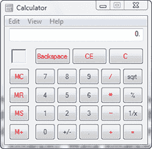
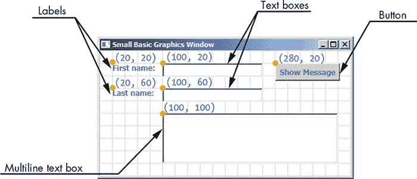
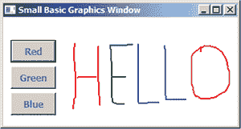
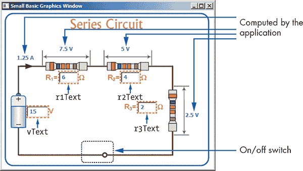
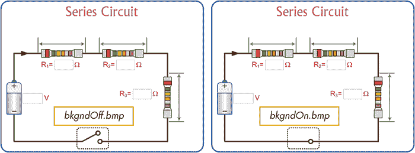
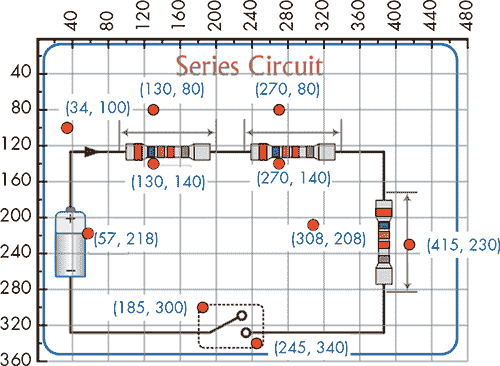
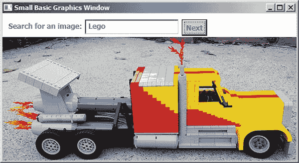
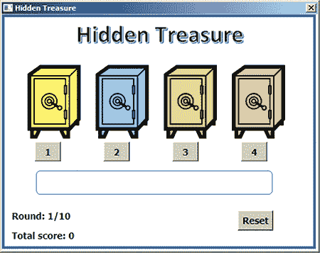
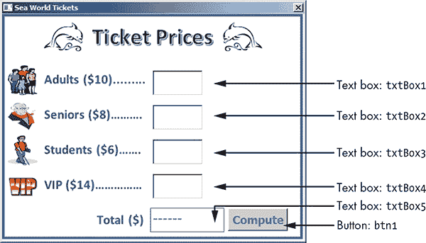

## **12**

**构建图形用户界面**


每个设备都有一套*接口*。例如，接口可以是微波炉或电梯中的按钮，洗碗机上的旋钮，或者甚至是你最喜欢的汉堡店的汽水分配器。计算机程序也有接口。早期的程序只有文本菜单，但现在我们使用不同的方式与计算机交互，比如桌面上的图标。

尽管你在本书中编写了一些非常有用的程序，但它们看起来并不像你习惯的程序，比如文字处理器、绘图程序、网页浏览器、视频游戏等。

如今，大多数程序都使用*图形用户界面*，或简称*GUI*（发音为“gooey”，但别担心，它不粘）。GUI 可以包含菜单、按钮、文本框等等。

一个例子是图 12-1 中展示的计算器程序。当用户点击程序中的一个数字按钮时，该数字会出现在窗口顶部的文本框中。当用户点击=按钮时，程序会计算数学运算的结果并显示出来。

在本章中，你将学习 `Controls` 对象，它让你为程序和游戏创建图形界面。



*图 12-1：计算器程序的用户界面*

### **使用 Controls 对象设计用户界面**

我们从一个简单的程序开始，让用户输入他们的名字和姓氏，然后程序通过友好的信息用名字问候他们。图 12-2 展示了你将要创建的*FirstGUIApp.sb*，这是你要创建的图形用户界面（GUI）。图中的网格线和坐标点不是输出的一部分，它们是用来说明界面中不同组件的 x 和 y 坐标的。



*图 12-2：* FirstGUIApp.sb *用户界面*

#### ***步骤 1：设计阶段***

在这个程序中，用户在文本框中输入他们的名字和姓氏，然后点击显示信息按钮。如果他们的名字是 Alpaca，姓氏是 Bag，程序将在多行文本框中显示如下信息：

```
Hello there, Alpaca Bag!
```

启动 Small Basic，输入以下两行：

```
GraphicsWindow.DrawText(20, 20, "First name:")  ' Label
fnText = Controls.AddTextBox(100, 20)           ' First name text box
```

第一条语句在位置（20，20）绘制文本*名字：*。在第二条语句中，`Controls` 对象创建了一个文本框，左上角位于（100，20）。这个文本框的标识符被保存在变量 `fnText` 中（表示名字文本框）。当你想知道用户在这个文本框中输入了什么时，你将需要这个标识符。

点击**运行**，你将看到*名字：*标签和位于其右侧的文本框。文本框的大小大约是 160×20（默认大小）。

接下来，添加以下两行来创建*姓氏：*标签及其关联的文本框：

```
GraphicsWindow.DrawText(20, 60, "Last name:") ' Label
lnText = Controls.AddTextBox(100, 60)         ' Last name text box
```

在这里，框的标识符保存在`lnText`（姓氏文本框）中。再次点击**运行**，你应该能在图形窗口中看到文本框及其标签完美对齐。

现在你将通过调用`Controls`对象的`AddButton()`方法来创建“Show Message”按钮：

```
showBtn = Controls.AddButton("Show Message", 280, 20) ' Button
```

`AddButton()`的第一个参数是按钮的标题，`"Show Message"`。第二个和第三个参数告诉`Controls`对象按钮的左上角应放置在哪里。按钮的标识符保存在`showBtn`（显示按钮）中。点击**运行**查看你刚刚创建的内容。默认情况下，按钮的宽度将与其标签一样宽。尝试拉长或缩短按钮的标签，然后再次运行程序，看看会发生什么。

接下来，你需要添加最后一个 GUI 元素——显示输出消息的框。因为你可以根据需要用一条长消息来问候用户，所以我们使用多行文本框。多行文本框有水平和垂直滚动条，如果需要的话会自动出现，就像哈利·波特的需求室一样。要创建一个多行文本框，调用`AddMultiLineTextBox()`方法：

```
msgText = Controls.AddMultiLineTextBox(100, 100) ' Message text box
```

再次，两个参数指定了框的左上角位置。框的标识符保存在`msgText`（消息文本框）中；稍后你需要它来设置框的文本。点击**运行**，你将看到一个位于(100, 100)的多行文本框。默认情况下，这个框的大小大约是 200×80。让我们通过调用`SetSize()`方法来使这个框更宽。就在创建多行文本框后添加这一行代码：

```
Controls.SetSize(msgText, 280, 80)  ' Makes width = 280 and height = 80
```

第一个参数是你想要调整大小的控件标识符，在本例中是`msgText`。第二个参数（`280`）是宽度，第三个参数（`80`）是高度。如果你现在运行代码，你会看到一个与图 12-2 类似的界面。注意，调用`SetSize()`时，消息文本框的左上角并没有发生变化。

#### ***步骤 2：程序交互性***

你已经创建了所有需要的控件，并将它们放置在你希望的位置。接下来，你需要使这些控件具有交互性。你需要编写一些代码来响应按钮的点击。当用户点击按钮时，程序需要读取姓氏和名字文本框的内容，并在多行文本框中显示问候语。添加第 13 到 21 行，如清单 12-1 所示，以完成程序（你已经写好了第 2 到 11 行来创建 GUI 元素）。

```
 1 ' FirstGUIApp.sb
 2 GraphicsWindow.DrawText(20, 20, "First name:")  ' Label
 3 fnText = Controls.AddTextBox(100, 20)           ' First name text box
 4
 5 GraphicsWindow.DrawText(20, 60, "Last name:") ' Label
 6 lnText = Controls.AddTextBox(100, 60)         ' Last name text box
 7
 8 showBtn = Controls.AddButton("Show Message", 280, 20) ' Button
 9
10 msgText = Controls.AddMultiLineTextBox(100, 100)      ' Message text box
11 Controls.SetSize(msgText, 280, 80)        ' Makes width = 280 and height = 80
12
13 Controls.ButtonClicked = OnButtonClicked  ' Handler for button click
14
15 Sub OnButtonClicked
16   firstName = Controls.GetTextBoxText(fnText)  ' First name text box
17   lastName = Controls.GetTextBoxText(lnText)   ' Last name text box
18   fullName = firstName + " " + lastName        ' Constructs full name
19   message = "Hello there, " + fullName + "!"   ' Greeting message
20   Controls.SetTextBoxText(msgText, message)
21 EndSub
```

*清单 12-1：创建一个简单的 GUI 程序*

第 13 行注册了一个处理`ButtonClicked`事件的处理程序。这一行代码告诉`Controls`对象，每当用户点击“Show Message”按钮时，调用`OnButtonClicked()`子程序。

在`OnButtonClicked()`子例程中，首先调用`GetTextBoxText()`来获取输入在名字文本框中的文本，并将其保存到`firstName`变量中（第 16 行）。这个方法接受一个参数——需要获取文本的文本框的标识符。然后再次调用`GetTextBoxText()`，但传入不同的参数，以获取输入在姓氏文本框中的文本，并将其保存到`lastName`中（第 17 行）。接着，通过将`firstName`和`lastName`之间加入空格来设置`fullName`变量（第 18 行）。在第 19 行，你创建了问候语并将其保存在`message`变量中。最后，你调用`SetTextBoxText()`来设置消息文本框的文本，第一个参数是控制项的标识符，第二个参数是新文本（第 20 行）。运行程序，输入一些文本到文本框中，然后点击按钮查看程序是如何工作的。

在接下来的章节中，你将学习如何制作具有多个按钮的 GUI 程序。现在你可以按下 Small Basic 的按钮了！

**动手试一试 12-1**

使用清单 12-1 中的代码，获取用户的名字和姓氏，然后更新代码来显示一个包含用户姓名的搞笑短故事。

### **制作一个多彩的绘图程序**

如果你创建一个包含多个按钮的程序，当用户点击这些按钮中的任何一个时，`ButtonClicked`事件处理程序会被调用。为了找出点击了哪个按钮，你可以使用`Controls.LastClickedButton`属性来获取被点击按钮的标识符；这就像是请你的朋友告诉你是谁注意到了你那双全新的鞋子。

为了向你展示如何在一个程序有多个按钮时使用`ButtonClicked`事件，我们将继续在第十一章中创建的*Scribble.sb*程序（请参见第 156 页的清单 11-4）。用户可以通过点击按钮来选择笔的颜色。查看程序的 GUI 界面，参考图 12-3。



*图 12-3：* Scribble2.sb 的示例输出

尝试运行更新后的程序*Scrible2.sb*，如清单 12-2 所示。你可能会注意到，这个程序使用了与清单 11-4 中的`OnMouseMove`事件处理程序相同的事件处理程序。

```
 1 ' Scribble2.sb
 2 btnR = Controls.AddButton("Red", 10, 30)
 3 btnG = Controls.AddButton("Green", 10, 65)
 4 btnB = Controls.AddButton("Blue", 10, 100)
 5 Controls.SetSize(btnR, 60, 30)
 6 Controls.SetSize(btnG, 60, 30)
 7 Controls.SetSize(btnB, 60, 30)
 8
 9 GraphicsWindow.MouseMove = OnMouseMove
10 Controls.ButtonClicked = OnButtonClicked
11
12 Sub OnButtonClicked         ' Changes the pen color
13   If (Controls.LastClickedButton = btnR) Then
14     GraphicsWindow.PenColor = "Red"
15   ElseIf (Controls.LastClickedButton = btnG) Then
16     GraphicsWindow.PenColor = "Green"
17   Else
18     GraphicsWindow.PenColor = "Blue"
19   EndIf
20 EndSub
21
22 Sub OnMouseMove
23   x = GraphicsWindow.MouseX   ' Current x position of mouse
24   y = GraphicsWindow.MouseY   ' Current y position of mouse
25
26   If (Mouse.IsLeftButtonDown) Then
27     GraphicsWindow.DrawLine(prevX, prevY, x, y)
28   EndIf
29
30   prevX = x ' Updates the last (previous) position
31   prevY = y
32 EndSub
```

*清单 12-2：点击按钮来改变笔的颜色*

第 2 至第 4 行创建了三个颜色选择按钮。这三个按钮的左上角坐标分别是(10, 30)、(10, 65)和(10, 100)。第 5 至第 7 行的语句设置每个按钮的大小为 60 *×* 30（宽度 = 60，高度 = 30）。第 9 至第 10 行注册了`MouseMove`和`ButtonClicked`事件的处理程序。

程序在用户点击任意一个按钮时调用 `OnButtonClicked()` 子程序（第 12 行）。为了知道哪个按钮被点击，子程序使用 `If/ElseIf` 语句比较 `LastClickedButton` 属性与三个按钮的标识符（第 13 至 19 行）。在识别出被点击的按钮后，子程序将 `GraphicsWindow` 的 `PenColor` 属性设置为选定的颜色。`OnMouseMove()` 子程序与程序的前一个版本相同，它定义在第 22 至 32 行。

**提示**

*你也可以这样编写* `OnButtonClicked()` *子程序：*

```
Sub OnButtonClicked
  btnID = Controls.LastClickedButton
  GraphicsWindow.PenColor = Controls.GetButtonCaption(btnID)
EndSub
```

*你不再硬编码点击按钮的颜色，而是通过* `GetButtonCaption()` *方法从被点击按钮的标题中获取颜色。*

**试试看 12-2**

你可以通过在创建按钮之前设置 `GraphicsWindow` 的 `BrushColor` 属性来更改按钮标题的颜色。修改 Listing 12-2，使每个按钮的文字颜色与其标题一致（将蓝色按钮的文字写成蓝色，依此类推）。

### **使用代码探索电路**

在本节中，你将创建一个演示电气串联电路的程序。（你的技能真是太震撼了！）电路包括一个电池、三个电阻和一个串联的开关。用户可以通过在文本框中输入数值来改变电池电压和三个电阻的数值。当用户在任意文本框中输入新值时，`Controls` 对象会触发 `TextTyped` 事件。作为响应，程序会自动计算（并显示）电路中的电流以及每个电阻上的电压（参见 图 12-4）。



*图 12-4：一个展示串联电路运行的程序*

以下是描述该程序背后科学原理的方程式：

**总电阻** *R[tot]* = *R*[1] + *R*[2] + *R*[3]

**电路中的电流** *I* = *V* ÷ *R[tot]*，其中 *V* 是电池电压

**电压跨越 *R*[1]** *V*[1] = *I* × *R*[1]

**电压跨越 *R*[2]** *V*[2] = *I* × *R*[2]

**电压跨越 *R*[3]** *V*[3] = *I* × *R*[3]

让我们来看一下计算过程。你通过将三个电阻的数值相加来计算总电阻 (*R[tot]*)。接下来，你通过将电池电压 (*V*) 除以总电阻来计算电路中的电流 (*I*)。然后，你通过将电流乘以每个电阻的数值来计算每个电阻上的电压。（试着大声读这段话给你的朋友听，仿佛它超级简单。这会让他们震惊！）

以下步骤将引导你创建这个程序。所以系好安全带，紧紧抓住，准备好进入激动人心的计算机模拟世界。

#### ***步骤 1：打开启动文件***

要开始创建这个电路模拟器，从本章文件夹中打开*SeriesCircuit_Incomplete.sb*。该文件包含注释，告诉你在哪里添加代码，以及你将编写的子程序的空占位符。

本章的文件夹中还包括了你需要的两个背景图像：*bkgndOff.bmp*和*bkgndOn.bmp*（见图 12-5；我们添加了图像名称以便于理解）。这两张图像除了开关状态不同外，其他完全相同：*bkgndOff.bmp*中的开关处于打开状态，而*bkgndOn.bmp*中的开关处于关闭状态。



*图 12-5：* SeriesCircuit.sb *的两个背景图像*

当你开始编写这个程序的代码时，你会看到许多硬编码的数字。这些数字表示文本框和标签的坐标点，以及用于检查开关边界的坐标点。为了帮助你理解这些数字的来源，请参考图 12-6。在这张图中，我们在背景图像上添加了坐标轴和网格线，并标出了程序中将使用的所有点的坐标。



*图 12-6：展示在* SeriesCircuit.sb *中使用的魔法数字*

#### ***步骤 2：添加主要代码***

如同之前的示例，你将从设计用户界面开始。你将编写代码来加载背景图像，创建并定位 GUI 元素（文本框），然后注册事件处理程序。接下来，添加程序的主要部分，详见列表 12-3。

```
 1 ' SeriesCircuit_Incomplete.sb
 2 offImg = ImageList.LoadImage(Program.Directory + "\bkgndOff.bmp")
 3 onImg = ImageList.LoadImage(Program.Directory + "\bkgndOn.bmp")
 4 bkgndImg = offImg   ' Starts with the switch-off image
 5
 6 GraphicsWindow.Width = ImageList.GetWidthOfImage(offImg)
 7 GraphicsWindow.Height = ImageList.GetHeightOfImage(offImg)
 8 GraphicsWindow.DrawImage(bkgndImg, 0, 0)
 9
10 r1Text = Controls.AddTextBox(130, 140)  ' R1 text box
11 r2Text = Controls.AddTextBox(270, 140)  ' R2 text box
12 r3Text = Controls.AddTextBox(308, 208)  ' R3 text box
13 vText = Controls.AddTextBox(57, 218)    ' Voltage text box
14 Controls.SetSize(r1Text, 42, 25)        ' Resizes the text boxes
15 Controls.SetSize(r2Text, 42, 25)
16 Controls.SetSize(r3Text, 42, 25)
17 Controls.SetSize(vText, 48, 25)
18 Controls.SetTextBoxText(vText, 10)      ' Sets the initial values
19 Controls.SetTextBoxText(r1Text, 4)
20 Controls.SetTextBoxText(r2Text, 4)
21 Controls.SetTextBoxText(r3Text, 2)
22
23 GraphicsWindow.MouseDown = OnMouseDown
24 Controls.TextTyped = OnTextTyped
```

*列表 12-3：设置 GUI*

你首先加载两个背景图像，并将它们的标识符保存在`offImg`和`onImg`变量中（第 2 至 3 行）。`bkgndImg`变量保存当前的背景图像，用户点击开关时该图像会发生变化。当程序启动时，开关是打开的，所以程序将`bkgndImg = offImg`（第 4 行）。第 6 至 7 行调整图形窗口的宽度和高度，使其与背景图像的大小匹配，第 8 行在图形窗口中绘制背景图像（此时为`offImg`）。

第 10 至 17 行创建了四个文本框（分别用于三个电阻和电池电压），并调整其大小，使它们精确地位于背景图像中的对应位置。在第 18 至 21 行，你为这些文本框设置了默认值。在第 23 行，你注册了一个`MouseDown`事件的处理程序，因为你需要知道用户何时点击开关。第 24 行注册了一个`TextTyped`事件的处理程序，因为当用户在任意四个文本框中输入新值时，你将自动计算并显示`I`、`V1`、`V2`和`V3`的值。

#### ***步骤 3：切换开关***

当用户点击开关时，你需要更改背景图像来切换开关。在列表 12-4 中添加`OnMouseDown()`子程序。

```
 1 Sub OnMouseDown ' Switches the background image
 2   x = GraphicsWindow.MouseX
 3   y = GraphicsWindow.MouseY
 4   If ((x > 185) And (x < 245) And (y > 300) And (y < 340)) Then
 5     If (bkgndImg = offImg) Then
 6       bkgndImg = onImg
 7     Else
 8       bkgndImg = offImg
 9     EndIf
10     UpdateUserInterface()
11   EndIf
12 EndSub
```

*列表 12-4：更改背景图像*

该子程序首先获取鼠标点击位置的 x 和 y 坐标，并将它们赋值给`x`和`y`变量（第 2 到第 3 行）。第 4 行检查该点是否位于开关的矩形区域内；如果鼠标位于开关的边界内，子程序将在第 5 到第 9 行切换`bkgndImg`变量的当前值（从开到关或从关到开），然后调用`UpdateUserInterface()`子程序来切换背景图像并更新计算值（第 10 行）。如你所见，如果用户打开开关，程序只会显示`offImg`背景图像；因为开关打开时电路中没有电流流动，所以`I`、`V1`、`V2`和`V3`的值不会显示。

#### ***步骤 4：响应变化***

在清单 12-5 中添加`OnTextTyped()`子程序。此子程序在用户在任意四个文本框中输入新值时被调用。如你所见，该子程序只是调用`UpdateUserInterface()`，该函数会更新用户界面，显示当前的`V`、`R1`、`R2`和`R3`的值以及开关的状态。

```
1 Sub OnTextTyped
2   UpdateUserInterface()
3 EndSub
```

*清单 12-5：* `OnTextTyped()` *子程序*

#### ***步骤 5：更新程序界面***

现在在清单 12-6 中添加`UpdateUserInterface()`子程序。

```
 1 Sub UpdateUserInterface   ' Puts new values on the background
 2   GraphicsWindow.DrawImage(bkgndImg, 0, 0)
 3   If (bkgndImg = onImg) Then
 4     R1 = Controls.GetTextBoxText(r1Text)
 5     R2 = Controls.GetTextBoxText(r2Text)
 6     R3 = Controls.GetTextBoxText(r3Text)
 7     V = Controls.GetTextBoxText(vText)
 8     Rtot = R1 + R2 + R3
 9     If (Rtot > 0) Then
10       I = V / Rtot
11       V1 = Math.Round(I * R1 * 100) / 100
12       V2 = Math.Round(I * R2 * 100) / 100
13       V3 = Math.Round(I * R3 * 100) / 100
14       I = Math.Round(I * 100) / 100
15       GraphicsWindow.DrawText(130, 80, V1 + " V")
16       GraphicsWindow.DrawText(270, 80, V2 + " V")
17       GraphicsWindow.DrawText(415, 230, V3 + " V")
18       GraphicsWindow.DrawText(34, 100, I + " A")
19     EndIf
20   EndIf
21 EndSub
```

*清单 12-6：更新文本框*

`UpdateUserInterface()`子程序首先会重新绘制选定的背景图像。如果开关处于关闭位置，第 3 行的`If`语句为假，子程序结束；用户界面不会显示任何计算结果（因为电路中没有电流流动）。但是，如果开关是开启状态（这意味着当前背景图像设置为`onImg`），子程序将继续计算`I`、`V1`、`V2`和`V3`的值。它首先收集四个文本框的内容（第 4 到第 7 行）。然后，它通过将`R1`、`R2`和`R3`的值相加来计算总电阻（第 8 行）。如果总电阻大于 0（第 9 行），子程序将计算电路中流过的电流（`I`）（第 10 行）以及`V1`、`V2`和`V3`的值，并将每个值四舍五入到最接近的百分位（第 11 到第 14 行）。然后，子程序会将计算出的值显示在背景图像的正确位置（第 15 到第 18 行）。

本程序的大部分工作是设计 GUI（绘制背景图像并将文本框放置在背景图像之上）。然后，你需要编写处理事件的代码，执行计算并显示结果。恭喜你，你已经创建了一个虚拟电路！

在下一节中，你将编写一个 GUI 程序，解释 Small Basic 库中的另一个对象——`Flickr`对象。

**动手试试 12-3**

想想办法将这个模拟程序改造成其他形式。使用不同的背景图片，例如建筑蓝图、披萨，或是你所在社区的 Google Maps 照片。然后更新文本框的位置以及输入逻辑/数学，以匹配你新的主题。前往 *[`tiny.cc/sharesimulation/`](http://tiny.cc/sharesimulation/)* 展示你的程序，并看看其他人创建了什么。

### **编程自己的图像查看器**

在本节中，你将创建一个名为 *ImageViewer.sb* 的图像查看器，根据用户输入的搜索内容显示来自 Flickr（一种照片分享网站）的图像。Small Basic 提供了一个名为 `Flickr` 的对象，它可以从 Flickr 网站获取图片：* [`www.flickr.com/`](http://www.flickr.com/)*。 图 12-7 显示了该程序的 GUI。



*图 12-7：* ImageViewer.sb 程序的示例输出

**注意**

*你需要使用 Small Basic 1.1 或更高版本才能使用 `Flickr` 对象。*

*ImageViewer.sb* 程序包括一个文本框，用户可以在其中输入搜索标签，以及一个按钮（标记为“下一步”）。当用户点击按钮时，程序使用 `Flickr` 对象根据用户的搜索标签获取（并显示）一张图片。该程序在 Listing 12-7 中展示。

```
 1 ' ImageViewer.sb
 2 GraphicsWindow.DrawText(10, 14, "Search for an image:")
 3 tagText = Controls.AddTextBox(140, 10)
 4 Controls.SetSize(tagText, 160, 26)
 5 Controls.AddButton("Next", 305, 10)
 6
 7 Controls.ButtonClicked = OnButtonClicked
 8
 9 Sub OnButtonClicked
10   tag = Controls.GetTextBoxText(tagText)
11   If (tag <> "") Then
12     img = ImageList.LoadImage(Flickr.GetRandomPicture(tag))
13     If (img = "") Then
14       GraphicsWindow.ShowMessage("No images found.", "Sorry.")
15     Else
16       GraphicsWindow.Width = ImageList.GetWidthOfImage(img)
17       GraphicsWindow.Height = ImageList.GetHeightOfImage(img) + 40
18       GraphicsWindow.DrawImage(img, 0, 40)
19     EndIf
20   EndIf
21 EndSub
```

*Listing 12-7：从 Flickr 加载图片*

程序从设计 GUI 开始（第 2–5 行），并注册 `ButtonClicked` 事件处理程序（第 7 行）。当按钮被点击时，`OnButtonClicked()` 子程序从文本框中获取搜索文本，并将其保存在 `tag` 变量中（第 10 行）。如果 `tag` 不为空（第 11 行），代码会使用给定的 `tag` 文本搜索 Flickr，寻找一张随机图片，然后通过 `Flickr.GetRandomPicture()` 获取该图片的 URL（第 12 行）。

该 URL 会传递给 `ImageList.LoadImage()`，它会从文件或互联网上加载图片，并将其保存到 `img` 变量中（第 12 行）。如果 `img` 为空，意味着 Flickr 没有找到符合用户标签的图片，你会通过消息框通知用户（第 14 行）。如果 Flickr 找到了图片，你会调整图形窗口的大小以适应加载的图片尺寸（第 16–17 行），并将图片绘制在文本框和按钮的正下方（第 18 行）。

**尝试一下 12-4**

编写一个程序，询问用户他们最喜欢的动物是什么。然后，使用 `Flickr` 对象搜索该动物并显示返回的图片。接下来，询问用户：“喜欢这个吗？”并显示两个按钮，分别标记为“是”和“否”。如果用户点击“是”，则在消息框中显示 *太好了！*。如果他们点击“否”，则显示该动物的另一张随机图片，并询问：“这个怎么样？”继续这些步骤，直到用户点击“是”。你刚刚将一个简单的程序变成了一个游戏！

### **编程挑战**

如果遇到困难，请查看 *[`nostarch.com/smallbasic/`](http://nostarch.com/smallbasic/)*，获取解决方案以及更多的资源和供教师和学生使用的复习问题。

1.  在这个程序中，你将创建一个隐藏宝藏游戏。打开本章文件夹中的*HiddenTreasure_Incomplete.sb*文件。当你运行程序时，你将看到以下界面。

    

    游戏的目的是猜测隐藏宝藏的位置。玩家通过按下四个按钮之一来进行猜测。如果猜对了，他们将获得 10 美元。否则，他们将失去 5 美元。游戏在 10 轮后结束。按照程序源代码中的注释编写缺失的代码，完成程序。

1.  在这个练习中，你将创建一个程序来计算参加海洋世界特别表演的总费用。打开本章文件夹中的*SeaWorld_Incomplete.sb*文件。当你运行程序时，你将看到以下用户界面。用户输入他们想购买的成人票、老年票、学生票和 VIP 票的数量，然后点击“计算”按钮来计算总费用。完成程序，使其在用户点击“计算”时显示总费用。

    
