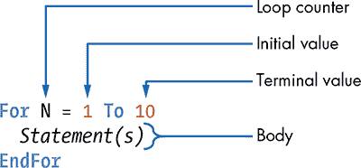
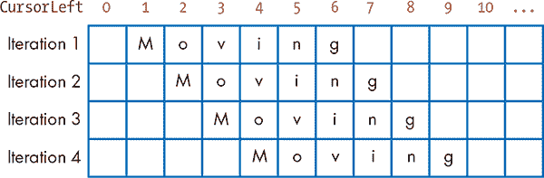
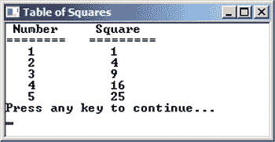
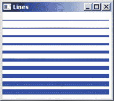
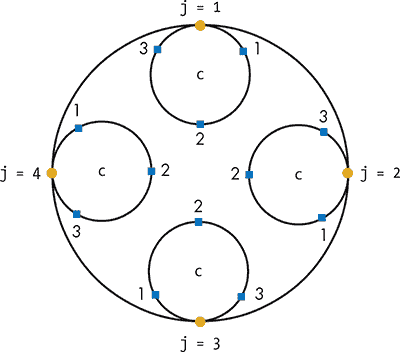
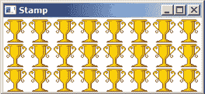

## **13**

**重复的 For 循环**


你有没有注意到，无论你多少次倒垃圾、洗脏碗和做洗衣，最后总是要再做一次？如果每个任务只需要做一次，然后你创建一个机器人版本的自己来每次代替做呢？那会很棒！

在 Small Basic 宇宙中，自动化重复性任务轻而易举。你只需要为一个重复性任务编写一次代码，然后就可以使用循环重复执行该任务，无论你需要多少次。

Small Basic 使用两种类型的循环语句：`For` *循环* 和 `While` *循环*。在本章中，你将学习`For`循环，深入探索嵌套`For`循环，并创建一些利用你计算机对重复任务的热情的程序。你将学会在各种实际应用中使用`For`循环。让我们开始循环吧！

### **For 循环**

假设你想写一个程序，显示九的乘法表：1 *×* 9，2 *×* 9，3 *×* 9，一直到 10 *×* 9。你第一次尝试可能是这样的：

```
TextWindow.WriteLine(" 1 x 9 = " + (1 * 9))
TextWindow.WriteLine(" 2 x 9 = " + (2 * 9))
TextWindow.WriteLine(" 3 x 9 = " + (3 * 9))
TextWindow.WriteLine(" 4 x 9 = " + (3 * 9))
TextWindow.WriteLine(" 5 x 9 = " + (3 * 9))
TextWindow.WriteLine(" 6 x 9 = " + (3 * 9))
TextWindow.WriteLine(" 7 x 9 = " + (3 * 9))
TextWindow.WriteLine(" 8 x 9 = " + (3 * 9))
TextWindow.WriteLine(" 9 x 9 = " + (3 * 9))
TextWindow.WriteLine("10 x 9 = " + (10 * 9))
```

呼！看看这段代码墙！虽然 Small Basic 让你轻松地复制和粘贴选定的语句，但这个程序重复了很多代码。如果你想显示乘法表直到 100 或 1000 呢？显然，这不是编写程序的最佳方式。这里是一个使用`For`循环来实现相同结果的程序版本：

```
For N = 1 To 10
  TextWindow.WriteLine(N + " x 9 = " + (N * 9))
EndFor
```

运行这个程序，看看会发生什么。难道这不是比写出每一行代码更简单吗？现在你已经看到了循环的威力！

循环每次运行相同的语句，但`N`的值不同。首先，代码将`N`的值设置为 1，这是我们希望从中开始创建乘法表的值。接下来，它运行`For`和`EndFor`关键字之间的所有语句。在这种情况下，它运行`WriteLine()`方法，将`N`替换为当前值。这称为循环的*迭代*。

然后它将`N`设置为 2。`N`的值与循环的结束值（或*终止值*）进行比较，在这个例子中为 10。如果`N`小于 10，`For`循环体内的语句将再次执行，完成下一次循环迭代。请注意，`For`循环会在每次迭代时自动将`N`增加 1。这个过程会继续，使用`N = 3`，然后是`N = 4`，直到`N = 10`。

在程序执行第十次迭代后，它会跳转到`EndFor`关键字后的语句（如果有的话），并且循环完成。

现在你已经看到了基本的`For`循环的实际操作，看看图 13-1 中的语法吧。



*图 13-1：基本* `For` *循环的语法*

每个`For`循环以关键字`For`开始。`For`和`EndFor`之间的语句被称为`For`循环的*主体*。变量`N`是*循环控制变量*（或*循环计数器*）。它控制循环执行的次数，并且像程序中的其他变量一样使用。`1 To 10`部分决定了循环运行的次数。

需要注意的是，检查循环是否执行的条件是在循环顶部进行的。例如，下面的代码将`N`设置为 1，然后将其与终止值-10 进行比较。因为 1 大于-10，所以代码根本不会执行：

```
For N = 1 To -10
  TextWindow.WriteLine(N)    ' This won't be executed
EndFor
```

我们来看一些有趣的例子，向你展示如何使用`For`循环。

**动手试一试 13-1**

思考一些你可以通过循环自动化的其他重复性任务。描述一个你会用`For`循环构建的程序。

#### ***神奇的移动文字***

在这个例子中，你将创建一个程序，使一个单词或句子从文本窗口的左侧移动到右侧。图 13-2 显示了每次迭代中，上一轮显示的单词消失，因此文字看起来像是动画效果，正向屏幕右侧移动。



*图 13-2：使用* `Write()` *方法将一个单词移动到文本窗口*

回想一下在第二章中，你使用`CursorLeft`属性将文本显示在文本窗口的不同位置。在这个例子中，你将`CursorLeft`设置为 0，并使用`Write()`方法写出单词。稍作延迟后，你将`CursorLeft`改为 1，再次写出单词。接着，你将`CursorLeft`改为 2，再到 3，依此类推。通过`For`循环，你将自动化这一过程，使得单词看起来像是从左到右在文本窗口中移动。请输入程序代码，见列表 13-1。

```
1 ' MovingWord.sb
2 For N = 0 To 40
3   TextWindow.CursorLeft = N
4   TextWindow.Write(" Moving") ' Erases the previous line
5   Program.Delay(250)          ' Delays so you can read it
6 EndFor
7 TextWindow.WriteLine("")
```

*列表 13-1：将一个单词移动到文本窗口*

该程序启动一个从`N = 0 To 40`的循环（第 2 行）。在每次迭代中，它将`CursorLeft`属性设置为循环计数器`N`（第 3 行），然后使用`Write()`方法写出单词（第 4 行）。`Moving`前面的空格有助于擦除之前的单词。第 5 行的`Program.Delay(250)`调用使程序在开始下一次迭代之前等待 250 毫秒。当循环结束时，程序会写出一个空行（第 7 行）。

让我们进入另一个例子。

**提示**

*虽然不是必需的，但将`For`循环主体中的语句进行缩进能使代码更易读。*

**动手试一试 13-2**

修改列表 13-1 来为你自己创建动画，发送给你的朋友或家人，并与他们分享。我的例子是“我喜欢塔可饼！”

#### ***加起来***

在编程中，循环有不同的使用方式。循环的一个重要用途被称为*累加器循环*，它在每次迭代时累加（或加总）一个值。累加器循环常用于程序中记录数值。

假设你需要计算从 1 到 10 的所有整数的和：1 + 2 + 3 + ... + 10。这正是清单 13-2 中的程序所做的。

```
1 ' Sum.sb
2 sum = 0
3 For N = 1 To 10
4   sum = sum + N     ' Adds the new value of N to the sum
5 EndFor
6 TextWindow.WriteLine("sum = " + sum)
```

*清单 13-2：使用* `For` *循环添加数字*

该程序使用一个名为`sum`的变量来保存累计值（这个变量通常被称为*累加器*）。程序首先将`sum`初始化为 0（第 2 行）。然后，一个名为`N`的循环计数器在`For`循环中从 1 运行到 10（第 3 行）。在每次迭代中，程序使用第 4 行的语句将`N`的值加到累加器中。该语句将`N`的当前值加到`sum`的当前值，并将结果重新存储回`sum`中。第一次迭代后，`sum`为 1（0 + 1）；第二次迭代后，`sum`为 3（1 + 2）；第三次迭代后，`sum`为 6（3 + 3）；以此类推。当循环结束时，程序在第 6 行显示`sum`变量的值：`sum = 55`。

**尝试 13-3**

当伟大的数学家卡尔·高斯首次上学时，他的老师要求全班同学计算 1 到 100 之间所有数字的和，即 1 + 2 + 3 + 4 + ... + 100。高斯看了一眼题目，立即把答案放在了老师的桌子上。老师惊讶了——高斯是对的！写一个程序来找出高斯脑海中算出来的答案。当然，高斯当时并没有使用 Small Basic，但他确实找到了一个捷径。你能找出他的方法吗？

#### ***格式化输出***

显示程序输出的方式通常与显示的信息本身同样重要。如果输出难以阅读，人们就无法理解信息的含义。良好的显示布局是程序设计的重要部分，但正确的格式化可能会很繁琐。为了简化这一过程，你可以使用`For`循环。例如，使用`For`循环编写一个程序，以表格格式输出 1 到 5 的平方（见图 13-3）。



*图 13-3：* SquareTable.sb *的输出*

输入并运行清单 13-3 中的程序。

```
 1 ' SquareTable.sb
 2 TextWindow.Title = "Table of Squares"
 3 TextWindow.WriteLine(" Number     Square")
 4 TextWindow.WriteLine("========   =========")
 5
 6 For N = 1 To 5
 7   TextWindow.CursorLeft = 3   ' Moves to middle of col 1
 8   TextWindow.Write(N)         ' Writes the number
 9   TextWindow.CursorLeft = 14  ' Moves to next column
10   TextWindow.WriteLine(N * N) ' Writes its square
11 EndFor
```

*清单 13-3：使用* `For` *循环显示表格数据*

第 3 至 4 行编写了两列表格的标题。第 6 行的循环写入五个数字及其平方。`TextWindow.CursorLeft` 属性设置了每列下方的期望位置（第 7 行和第 9 行）。每次代码循环时，它会将正确的值显示在适当的位置。

**尝试 13-4**

那首著名的歌曲《圣诞十二日》是这样的：“在圣诞节的第一天，我的真爱给了我一只停在梨树上的鹧鸪。在圣诞节的第二天，我的真爱给了我两只海鸽和一只停在梨树上的鹧鸪……”如此继续，直到第 12 天。到了第十二天，歌手收到了 12 + 11 + … + 2 + 1 份礼物。编写一个程序，显示每一天收到的总礼物数。输出结果应包括两列：天数和当天收到的总礼物数。

#### ***绘制各种线条***

你可以使用 `For` 循环来改变各种值，包括视觉显示。示例 13-4 在图形窗口中绘制了 10 条逐渐加宽的线条。

```
1 ' Lines.sb
2 GraphicsWindow.Title = "Lines"
3 GraphicsWindow.PenColor = "Blue"
4 For N = 1 To 10
5   GraphicsWindow.PenWidth = N
6   y = N * 15    ' Vertical position of the line
7   GraphicsWindow.DrawLine(0, y, 200, y)
8 EndFor
```

*示例 13-4：每次迭代增加线条宽度*

在设置窗口标题和画笔颜色（第 2–3 行）之后，程序开始执行一个名为 `N` 的 `For` 循环，该循环的计数器从 1 运行到 10（第 4 行）。在每次迭代中，程序将画笔的宽度设置为当前的 `N` 值（第 5 行），设置线条的垂直位置（第 6 行），然后绘制一条 200 像素长的线（第 7 行）。输出结果如图 13-4 所示。



*图 13-4：* Lines.sb 的输出

**尝试示例 13-5**

以下程序做了什么？运行程序检查你的答案。

```
For N = 1 To 200
  GraphicsWindow.PenColor = GraphicsWindow.GetRandomColor()
  x2 = Math.GetRandomNumber(300)
  y2 = Math.GetRandomNumber(300)
  GraphicsWindow.DrawLine(0, 0, x2, y2)
EndFor
```

### **更改步长**

上一部分向你展示了 `For` 循环的语法，该语法在每次迭代后自动将循环计数器增加 1。但 `For` 循环有一个通用形式，它允许你控制循环控制变量的 `Step` 大小，从而按照你想要的任何幅度增加或减少它。这里是 `For` 循环的一般形式：

```
For N = A To B Step C
  Statement(s)
EndFor
```

它的工作方式类似于你之前看到的简化循环。但与每次递增循环计数器 `N` 1 的情况不同，你可以决定如何改变 `N`。你通过设置 `Step` 大小中的值 `C` 来实现这一点，`C` 可以是正数、负数或任何 Small Basic 表达式。让我们看看一些示例，展示如何使用这种通用的 `For` 循环形式。

#### ***按二递减计数***

在这个例子中，程序从一个起始值（此处为 10）开始倒计时到 0，每次减去 2，因此程序在文本窗口中写出数字 10、8、6、4、2、0。输入并运行示例 13-5 中的程序。

```
1 ' CountDown.sb
2 For N = 10 To 0 Step -2    ' Uses a negative step size
3   TextWindow.WriteLine(N)
4 EndFor
```

*示例 13-5：用`Step` 进行倒计数*

在 `Step` 大小（第 2 行）使用了负值，以便在每次迭代后将循环计数器的值减少 2。

这是输出结果：

```
10
8
6
4
2
0
```

#### ***制作分数步长***

`Step` 大小不一定非得是整数值。你也可以使用小数值，如在示例 13-6 中所示。

```
 1  ' DecimalStep.sb
 2  GraphicsWindow.FontSize = 10
 3  GraphicsWindow.BrushColor = "Black"
 4
 5  yPos = 0
 6  For angle = 0 To (2 * Math.PI) Step 0.3
 7    xPos = 100 * (1 + Math.Sin(angle))
 8    GraphicsWindow.DrawText(xPos, yPos, "Hello")
 9    yPos = yPos + 8
10 EndFor
```

*示例 13-6：用文本做设计*

在这个例子中，循环计数器是一个角度（以弧度为单位），它使用从 0 到 2π的值，步进为 0.3（第 6 行）。在每次迭代中，计算该角度的正弦值，并使用该值设置光标的水平位置（第 7 行）。然后在该位置显示单词`Hello`（第 8 行），并调整变量`yPos`来设置下一个输出文本的垂直位置（第 9 行）。尝试不同的`Step`大小可以创造出一些非常酷的效果，比如图 13-5 中展示的波浪设计。


*图 13-5：* DecimalStep.sb *的输出*

**试一试 13-6**

编写一个程序，计算从 5 到 25 所有奇数的和。

### **嵌套循环**

`For`循环体中的语句可以是任何 Small Basic 语句，包括另一个`For`循环。*嵌套*是指将一个`For`循环放在另一个`For`循环内部（不涉及鸟类）。使用嵌套循环可以创建二维或更多维度的迭代。这种技巧很重要，可以用来解决广泛的编程问题。

要理解嵌套`For`循环的概念，你将查看一个程序，它使得计算机“跳”四次，每跳一次后“拍手”三次。因为程序需要计算两个动作（跳跃和拍手），所以需要使用两个循环，如示例 13-7 所示。外部循环的计数器`j`从 1 到 4，内部循环的计数器`c`从 1 到 3。

```
1 ' NestedLoops.sb
2 For j = 1 To 4     ' The jump counter
3   TextWindow.Write("Jump " + j + ": ")
4   For c = 1 To 3   ' The clap counter
5     TextWindow.Write("Clap " + c + " ")
6   EndFor
7   TextWindow.WriteLine("")
8 EndFor
```

*示例 13-7：* 嵌套`For` *循环*

在外循环的第一次迭代中（即`j = 1`），内循环重复三次（对应`c`的三个值）；每次迭代时，它都会写出单词`Clap`，后面跟着一个空格，当前`c`的值，再加上一个空格（第 5 行）。当你像这样嵌套`For`循环时，内循环会在外循环的每次迭代中执行所有迭代。因此，外循环的第一次迭代会使程序显示`Jump 1: Clap 1 Clap 2 Clap 3`。当内循环结束时，程序输出一个空行（第 7 行），将光标移到下一行的开头，然后第二次外循环以`j = 2`开始。内循环再次运行，`c = 1`、`c = 2`和`c = 3`，这会导致程序显示`Jump 2: Clap 1 Clap 2 Clap 3`。如此继续，程序依次显示`Jump 3: Clap 1 Clap 2 Clap 3`，然后是`Jump 4: Clap 1 Clap 2 Clap 3`，最后程序结束。也许你的电脑想成为啦啦队员！

图 13-6 有助于解释程序的工作原理。外圈表示外部循环每次运行的情况：例如，在外圈的顶部，当外循环中的`j = 1`时，内循环运行三次，`c`的值依次为 1、2 和 3。跟随外循环并思考每一次内循环。继续直到走完外圈一圈。



*图 13-6：* 嵌套循环.sb *的工作原理*

输出应该如下所示：

```
Jump 1: Clap 1 Clap 2 Clap 3
Jump 2: Clap 1 Clap 2 Clap 3
Jump 3: Clap 1 Clap 2 Clap 3
Jump 4: Clap 1 Clap 2 Clap 3
```

现在让我们来看一些需要嵌套 `For` 循环的其他问题吧！

#### ***为了乐趣进行镶嵌***

在这个例子中，应用程序通过在图形窗口上盖上一个小图像来覆盖窗口。完整的程序显示在 列表 13-8 中。

```
 1 ' Stamp.sb
 2 GraphicsWindow.Title = "Stamp"
 3
 4 path = Program.Directory
 5 img = ImageList.LoadImage(path + "\Trophy.ico")
 6
 7 width = ImageList.GetWidthOfImage(img)    ' Width of image
 8 height = ImageList.GetHeightOfImage(img)  ' Height of image
 9
10 GraphicsWindow.Width = 8 * width    ' 8 columns
11 GraphicsWindow.Height = 3 * height  ' 3 rows
12
13 For row = 0 To 2      ' 3 rows
14   For col = 0 To 7    ' 8 columns
15     GraphicsWindow.DrawImage(img, col * width, row * height)
16   EndFor
17 EndFor
```

*列表 13-8：在图形窗口中盖上图案*

将本章文件夹中的 *Trophy.ico* 文件复制到你的应用程序文件夹中，然后运行这个程序查看结果。你的屏幕应该像 图 13-7 一样。干得好，冠军！



*图 13-7：* Stamp.sb 的输出

程序从你的应用程序文件夹加载一个图像文件 (*Trophy.ico*) 并将图像的标识符保存到名为 `img` 的变量中（第 5 行）。这是通过调用 `ImageList` 对象的 `LoadImage()` 方法完成的。程序然后使用 `ImageList` 对象的方法来告诉你加载图像的宽度和高度（以像素为单位）（第 7–8 行）。图像的标识符（即 `img` 变量）作为参数传递给调用的方法。在第 10–11 行，程序调整图形窗口的大小，使其可以容纳八列和三行图像的副本。接着，程序使用一个嵌套循环在不同的位置盖上图像。外层循环运行三行，内层循环运行八列，总共进行 24 次迭代（3 *×* 8）（第 13–14 行）。在每次迭代中，图像的 x 和 y 位置根据图像的尺寸进行计算，并在该位置绘制图像（第 15 行）。现在，你的奖杯收藏比迈克尔·乔丹的还要大！

**尝试一下 13-7**

更新 列表 13-8，用不同的图像替代奖杯图标。然后展示给你的朋友和家人看！

#### ***多重嵌套层级***

你可以有超过两个嵌套层级。列表 13-9 显示所有可能的 25 分、10 分和 5 分硬币的组合，总和为 50 分。

```
 1 ' CoinsAdder.sb
 2 TextWindow.WriteLine("Quarters    Dimes    Nickels")
 3 TextWindow.WriteLine("--------    -----    -------")
 4
 5 For Q = 0 To 2       ' Quarters
 6   For D = 0 To 5     ' Dimes
 7     For N = 0 To 10  ' Nickels
 8       If (Q * 25 + D * 10 + N * 5 = 50) Then
 9         TextWindow.Write(Q)
10         TextWindow.CursorLeft = 13
11         TextWindow.Write(D)
12         TextWindow.CursorLeft = 24
13         TextWindow.WriteLine(N)
14       EndIf
15     EndFor
16   EndFor
17 EndFor
```

*列表 13-9：列出所有加起来为 50 分的硬币组合*

第一个循环最初通过设置 `Q = 0` 来跟踪 25 分硬币。第二个循环运行六次，计数所有的 10 分硬币：`For D = 0 To 5`。对于第二个循环的每次执行，第三个循环运行 11 次，跟踪 5 分硬币：`For N = 0 To 10`。这意味着第 8 行的 `If` 条件会被检查 198 次（3 *×* 6 × 11）！如果硬币的总和为 50 分，就会显示该组合（第 9–13 行）。在循环过程中，代码使用 `CursorLeft` 属性来正确对齐列和行。以下是输出：

```
Quarters    Dimes    Nickels
--------    -----    -------
0            0          10
0            1          8
0            2          6
0            3          4
0            4          2
0            5          0
1            0          5
1            1          3
1            2          1
2            0          0
```

**尝试一下 13-8**

编写一个程序，找出所有小于 20 的三整数集合，这些整数可以作为直角三角形的三边。

### **编程挑战**

如果你卡住了，可以访问 *[`nostarch.com/smallbasic/`](http://nostarch.com/smallbasic/)* 查找解决方案和更多的资源、教师和学生的复习问题。

1.  编写一个 `For` 循环，显示以下输出：

    ```
    I had 1 slices of pizza.
    I had 2 slices of pizza.
    I had 3 slices of pizza.
    ...
    I had 10 slices of pizza.
    ```

1.  尽管在上一个练习中的比萨看起来很好吃，但它在语法上并不正确，因为程序输出的是 `1 slices of pizza`。修正程序，使其输出符合语法规则（这样你就不会让你的英语老师尴尬了）。(提示：在 `For` 循环中使用 `If` 语句。)

1.  我们为你设计了一个游戏，来考察 Alice 的乘法能力，这样她就能准备好应对女王的提问。程序会生成 10 道随机乘法题，并要求 Alice 输入每道题的答案。每答对一道题，Alice 得一分。如果她输入错误的答案，程序会显示正确答案。程序最后会显示她的总得分。重新创建这个程序，运行它，并解释它是如何工作的：

    ```
    score = 0
    For N = 1 To 10   ' Asks 10 questions
      n1 = Math.GetRandomNumber(10)
      n2 = Math.GetRandomNumber(10)

      TextWindow.Write(n1 + " x " + n2 + "? ")
      ans = TextWindow.ReadNumber()

      If (ans = n1 * n2) Then   ' Increases the score
        score = score + 1
      Else                      ' Shows the correct answer
        TextWindow.WriteLine("Incorrect --> " + (n1 * n2))
      EndIf
    EndFor
    TextWindow.WriteLine("Your score is: " + score + "/10")
    ```

1.  编写一个程序，绘制以下图像。（提示：使用 `For` 循环绘制每个角落的线条模式。）

    
