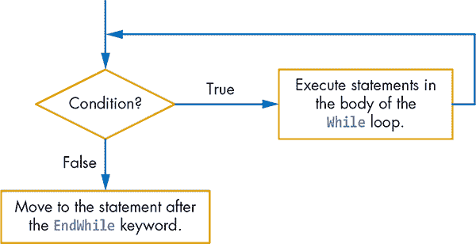
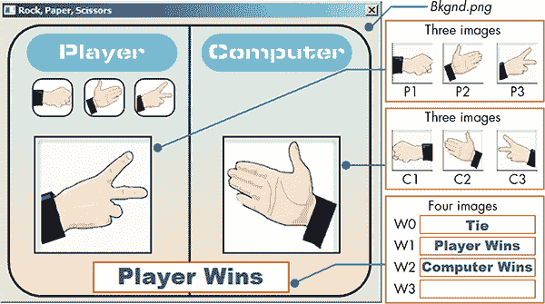
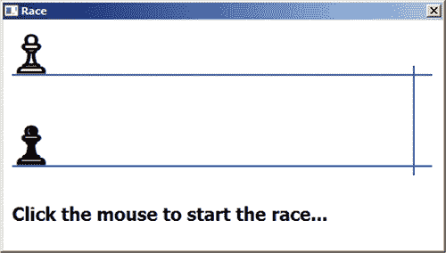
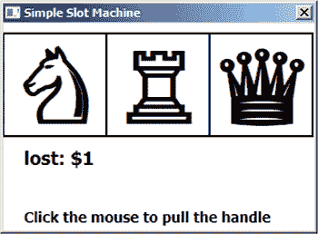
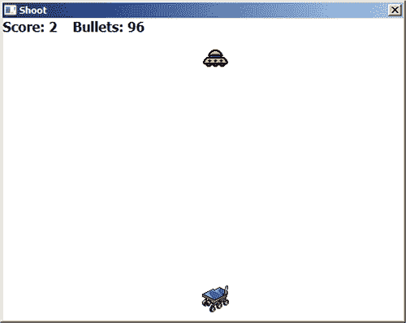

## **14**

**创建条件的 While 循环**


在第十三章中，我们向你展示了如何使用`For`循环来重复执行代码一定次数。当你确切知道要重复执行多少次代码时，`For`循环是理想选择。`While`是另一个 Small Basic 的关键字，可以用来创建循环。当你事先不知道要重复多少次循环时，`While`循环非常有用，因为`While`循环会一直运行代码，直到条件为假。

`While`循环的条件就像父母一直告诉你要把房间打扫得一尘不染，或者你吃感恩节火鸡直到吃撑一样！当循环的条件变为假时，循环结束，程序继续执行。

在本章中，你将学习如何编写`While`循环，并使用它们来验证用户输入和制作游戏。`While`循环是一个强大的编程概念，一旦掌握了它们，你将能够制作各种酷炫的应用程序。

### **何时使用 While 循环**

假设你想制作一个数字猜谜游戏，游戏会随机选择一个 1 到 100 之间的数字，并提示玩家猜测。如果玩家猜错了，游戏会告诉他们猜测的数字是比秘密数字高还是低，然后再次提示玩家猜测。游戏会一直提示玩家猜数字，直到他们猜对为止。

在这里，`For`循环不是最佳选择，因为你无法预测玩家猜测秘密数字所需的次数。也许玩家第一次就猜对了，或者可能需要猜 100 次！在这种情况下，`While`循环是完美的选择。

在下一节中，你将学习`While`循环的语法，并用它来创建自己的数字猜谜游戏。

### **编写 While 循环**

请尝试清单 14-1 中的代码。

```
 1 ' GuessMyNumber.sb
 2 num = Math.GetRandomNumber(100) ' From 1 to 100
 3 ans = 0               ' Any value that isn't equal to num
 4 While (ans <> num)    ' Repeats as long as the guess is wrong
 5   TextWindow.Write("Enter your guess [1-100]: ")
 6   ans = TextWindow.ReadNumber()
 7   If (ans = num) Then ' Player guessed correctly
 8     TextWindow.WriteLine("Good job! You get sprinkles!")
 9   ElseIf (ans > num) Then
10     TextWindow.WriteLine("Too High. Lower your standards.")
11   Else
12     TextWindow.WriteLine("Too Low. Aim for the stars!")
13   EndIf
14 EndWhile
```

*清单 14-1：数字猜谜游戏*

程序随机选择一个 1 到 100 之间的数字，并将其赋值给`num`（第 2 行）。然后，创建一个名为`ans`的变量，用来保存玩家的猜测，并将其初始化为 0（第 3 行）。我们将初始值设置为 0，因为它需要与正确答案不同。让我们仔细看看`While`循环的第一行（第 4 行）：

```
While (ans <> num)
```

这段代码的意思是，“只要`ans`不等于`num`，就执行`While`和`EndWhile`之间的语句。”

首先，测试条件（`ans <> num`）会被评估。如果为真，程序会执行循环体内的语句，并继续重复，直到条件变为假。当测试条件变为假时，循环结束，程序继续执行`EndWhile`关键字后的下一条语句。图 14-1 的流程图展示了`While`循环的工作原理。



*图 14-1：`While` 循环的流程图*

在数字猜谜游戏中，当程序第一次执行第 4 行时，条件（`ans <> num`）为真（因为我们知道`num`不可能是 0），因此循环执行其主体中的语句（第 5 到 13 行）。在循环的每次迭代中，玩家被提示输入一个猜测（第 5 行），该猜测保存在变量`ans`中（第 6 行）。然后，代码将玩家的猜测与秘密数字进行比较。如果玩家猜对了（第 7 行），代码会显示`Good Job! You get sprinkles!`并跳转到`EndIf`后的语句。在这个例子中，它找到`EndWhile`，将程序带回检查`While`循环的条件。由于`ans`现在等于`num`，测试条件为假，`While`循环终止，程序结束（因为`EndWhile`后没有语句）。

如果玩家的猜测不正确，代码会检查猜测是否高于秘密数字（第 9 行）。如果是高于的，程序会显示`Too High. Lower your standards.`然后进入下一轮。如果玩家的猜测低于秘密数字（第 11 行的`Else`语句），程序会显示`Too Low. Aim for the stars!`（第 12 行），并开始另一轮。

这里是一个运气相当好的用户玩游戏的例子：

```
Enter your guess [1-100]: 50
Too High. Lower your standards.
Enter your guess [1-100]: 25
Too Low. Aim for the stars!
Enter your guess [1-100]: 37
Good Job! You get sprinkles!
```

多玩几次这个游戏，看看它是如何工作的！

**注意**

*尽管 Small Basic 并没有强制要求这样做，我们为了让程序更易读，通常会在`While`循环的条件周围加上括号，并缩进`While`循环的主体部分。*

在接下来的部分，我们将展示如何使用`While`循环检查用户输入的数据。

**试试看 14-1**

如果一只土拨鼠能扔木头，那么它能扔多少木头呢？打开本章文件夹中的*Woodchuck.sb*文件，运行它来回答这个古老的问题。然后想出一些方法来改进程序。

### **验证您的输入**

当你编写一个需要从用户处读取数据的程序时，应该始终在继续执行程序之前检查输入的数据。这被称为*验证*。在本节中，我们将向你展示如何使用`While`循环来确保用户输入正确的数据。

假设你需要用户输入一个 1 到 5 之间的数字（包括 1 和 5）。如果他们输入的数字小于 1 或大于 5，你需要提示他们重新输入一个数字。Listing 14-2 展示了如何使用`While`循环来实现这一点。

```
1 ' InputValidation.sb
2 num = -1   ' Invalid value (to force a pass through the loop)
3
4 While ((num < 1) Or (num > 5))
5   TextWindow.Write("Enter a number between 1 and 5: ")
6   num = TextWindow.ReadNumber()
7 EndWhile
8 TextWindow.WriteLine("You entered: " + num)
```

*Listing 14-2：使用* `While` *循环检查输入的数字*

第 2 行将变量`num`（用于存储用户输入的数字）设置为-1。这使得`While`循环的条件（第 4 行）为真，因此循环的主体至少执行一次。虽然在这个例子中，如果没有第 2 行的初始化语句（因为变量`num`会被认为是 0），循环依然能正常运行，但我们建议你始终初始化变量，而不要依赖它们的默认值。这将帮助你避免未来的错误。

该程序提示用户输入一个数字，并将他们的输入赋值给`num`变量（第 5–6 行）。然后循环再次执行。如果`num`小于 1 或大于 5（用户输入了无效数字），循环体会再次执行，提示用户重新输入数字。如果`num`在 1 到 5 之间（包括 1 和 5），循环结束，程序跳到第 8 行显示数字。

**提示**

*确保在`While`循环的测试条件中使用任何变量之前对其进行初始化。如果不初始化，程序可能会跳过循环！*

现在你知道如何使用`While`循环验证用户输入了。

**尝试一下 14-2**

编写一个程序，询问用户是否认为海绵宝宝能成为圣诞老人，然后提示他们输入`Y`（是）或`N`（否）。他们也可以输入`y`或`n`。编写一个`While`循环，仅接受`Y`、`y`、`N`或`n`作为有效输入。每次用户输入错误时，告诉他们哪里出了问题。

### **无限循环**

如果`While`循环的条件始终不为假，循环将永远运行，形成*无限循环*。有时这会导致问题，但有时无限循环很有用，比如当你想让游戏永远运行时。

但是如何在 Small Basic 中创建无限循环呢？有几种方法可以做到这一点，但这是许多 Small Basic 程序员常用的快捷方式：

```
While ("True")
  TextWindow.WriteLine("Loop forever!")
EndWhile
```

在这段代码中，循环的条件始终为真；循环永不停止，并且永远显示`Loop forever!`。要查看这一点，你将编写一个简单的游戏，测试孩子们的加法技能。完整代码见清单 14-3。运行这个程序，看看它是如何工作的。

```
 1 ' AddTutor.sb
 2 While ("True")
 3   num1 = Math.GetRandomNumber(10) ' Sets num1 between 1 and 10
 4   num2 = Math.GetRandomNumber(10) ' Sets num2 between 1 and 10
 5   correctAns = num1 + num2        ' Adds both numbers
 6   TextWindow.Write("What is " + num1 + " + " + num2 + "? ")
 7   ans = TextWindow.ReadNumber()   ' User enters an answer
 8   If (ans = correctAns) Then      ' Checks if the answer is correct
 9     TextWindow.WriteLine("This is correct.")
10   Else                            ' Gives the correct answer
11     TextWindow.WriteLine("Sorry. The answer is " + correctAns)
12   EndIf
13 EndWhile
```

*清单 14-3：一个向用户提问加法题目的程序*

在第 3 和第 4 行，`num1`和`num2`被设置为 1 到 10 之间的随机数字。第 5 行将它们相加得到正确答案。第 6 行提示用户输入正确答案。第 7 行获取用户的答案。第 8 行检查答案是否正确，如果正确，第 9 行告诉他们答案正确。否则，第 11 行告诉他们正确答案是什么。游戏将一直运行。当用户想退出时，可以通过点击应用程序窗口右上角的 X 图标关闭应用程序。

**提示**

*你可以在`While`循环内使用`Goto`语句跳转到循环外的标签，以便退出循环。*

现在是时候将你在本章所学的内容付诸实践，设计一个完整的游戏了。在继续阅读之前，去冰箱拿些大脑食品吧！

**尝试一下 14-3**

更改*AddTutor.sb*程序，以便当玩家答错时不提供正确答案。相反，程序应告诉玩家他们的答案是错误的，并让他们再试一次。

### **创建一个石头剪刀布游戏**

在这一节中，你将创建一个石头剪刀布游戏，玩家与计算机对战。图 14-2 显示了这个游戏的用户界面。三个按钮分别代表石头、布和剪刀。玩家通过点击其中一个按钮来做出选择。然后计算机随机选择一个动作。决定胜者的规则是布胜石头，石头胜剪刀，剪刀胜布。



*图 14-2：石头剪刀布游戏的用户界面*

图像*P1*、*P2*和*P3*显示玩家的选择，图像*C1*、*C2*和*C3*显示计算机的选择。图像*W0*、*W1*、*W2*和*W3*显示每轮游戏的结果。在图 14-2 中，除了背景图像外，你还可以看到代表三种按钮的石头、布和剪刀图像。

#### ***步骤 1：打开启动文件***

打开本章文件夹中的*RockPaper_Incomplete.sb*文件并跟随操作。该文件夹包含了你玩这个游戏所需的所有图像。启动文件显示在清单 14-4 中，包含了游戏的主要部分。它还包含了你需要添加的所有子程序的空占位符。

```
 1 ' RockPaper_Incomplete.sb
 2 GraphicsWindow.Title = "Rock, Paper, Scissors"
 3 GraphicsWindow.CanResize = "False"
 4 GraphicsWindow.Width = 480
 5 GraphicsWindow.Height = 360
 6
 7 path = Program.Directory
 8 GraphicsWindow.DrawImage(path + "\Bkgnd.png", 0, 0)
 9 choice1 = 0              ' 0 = Unknown; 1 = Rock; 2 = Paper; 3 = Scissors
10 GraphicsWindow.MouseDown = OnMouseDown
11
12 While ("True")                        ' Loops forever
13   If (choice1 <> 0) Then              ' If player made a choice
14     blankImg = path + "\W3.png"       ' Clears last result
15     GraphicsWindow.DrawImage(blankImg, 115, 310)
16     choice2 = Math.GetRandomNumber(3) ' 1 to 3
17     SwitchImages()                    ' Shows player and computer choices
18     ShowWinner()                      ' Shows image for the result
19     choice1 = 0                       ' Ready for another round
20   EndIf
21   Program.Delay(10)                   ' Waits a little, then checks again
22 EndWhile
```

*清单 14-4：设置窗口和选择*

如果你现在运行程序，你看到的只有背景图像，因为你还没有创建任何子程序。你会做到的，但首先让我们来看看游戏的设置和主循环。首先，设置图形窗口的大小，然后绘制背景图像（第 2–8 行）。变量`choice1`保存玩家的选择：`0`表示未知，`1`表示石头，`2`表示布，`3`表示剪刀。为了开始，我们将`choice1`设置为`0`，因为玩家还没有做出选择（第 9 行）。接着，我们为`MouseDown`事件注册一个处理器，以便能够得知玩家何时点击三个按钮中的一个（第 10 行）。然后，游戏的主循环开始（第 12–22 行）。

循环持续检查`choice1`的值。正如你马上会看到的，当玩家做出选择时，`OnMouseDown()`子程序会改变这个变量。如果`choice1`是 0，循环会等待 10 毫秒（第 21 行），然后再次检查。使用循环可以让程序等待`choice1`变为非 0 值（这叫做*轮询*；类似于长途旅行中反复问“我们到了吗？”）。当`choice1`变为非 0 值时（第 13 行），`If`块的主体会被执行（第 14–19 行）。我们绘制图像`W3`来显示一个空的结果（第 14–15 行）。接下来，我们将计算机的选择`choice2`设置为 1 到 3 之间的随机值（第 16 行）。然后，我们调用`SwitchImages()`来显示与`choice1`和`choice2`相对应的图像（第 17 行）。接着，我们调用`ShowWinner()`来显示这一轮游戏的结果（第 18 行）。最后，我们将`choice1`重置为`0`，告诉`OnMouseDown()`子程序主循环已经准备好进行新的一轮游戏（第 19 行）。

接下来，你将逐个添加每个子程序。

#### ***步骤 2：添加 MouseDown 处理程序***

现在我们来处理 `MouseDown` 事件，确定玩家的选择。在程序的底部添加 清单 14-5 中的 `OnMouseDown()` 子程序。

```
 1 Sub OnMouseDown
 2   If (choice1 = 0) Then        ' Ready for another round
 3     y = GraphicsWindow.MouseY  ' Vertical click position
 4     If ((y > 80) And (y < 120)) Then  ' Within range
 5       x = GraphicsWindow.MouseX       ' Horizontal click
 6       If ((x > 40) And (x < 80)) Then       ' Rock
 7         choice1 = 1
 8       ElseIf ((x > 110) And (x < 150)) Then ' Paper
 9         choice1 = 2
10       ElseIf ((x > 175) And (x < 215)) Then ' Scissors
11         choice1 = 3
12       EndIf
13     EndIf
14   EndIf
15 EndSub
```

*清单 14-5：检查用户点击的选择*

小基础语言会在玩家点击图形窗口的任何地方时调用这个子程序。首先，子程序会检查 `choice1` 的值（第 2 行）。如果 `choice1` 的值为 `0`，子程序会检查玩家点击的位置，看看他们是否点击了三个按钮之一。如果 `choice1` 不是 0，这意味着主循环仍在处理玩家的上一个选择，所以子程序会忽略这次鼠标点击。这样，即使玩家在窗口的各个位置乱点击，游戏也不会混乱。

要查看玩家是否点击了三个图片按钮之一，子程序会检查点击的垂直位置（第 4 行）。如果点击位置在图片的范围内，子程序会检查水平位置（第 6 行）。接着，`If/ElseIf` 结构会将水平位置与每个图片的左右边缘进行比较，并相应地设置 `choice1`（第 6 到 12 行）。

**提示**

*如果你想知道三个图片按钮的准确位置，可以将这段代码添加到你的程序中：*

```
GraphicsWindow.MouseMove = OnMouseMove
Sub OnMouseMove
  mx = GraphicsWindow.MouseX
  my = GraphicsWindow.MouseY
  TextWindow.WriteLine(mx + ", " + my)
EndSub
```

*将鼠标移到背景图片上，可以看到文本窗口中显示的坐标。别忘了在和朋友分享游戏之前删除这段代码！*

#### ***步骤 3：切换图片***

当玩家做出选择后，你需要显示电脑的选择，这样他们就知道电脑没有作弊。为了增加一些兴奋感，你将在显示最终选择前先播放图片动画。在清单 14-6 中添加 `SwitchImages()` 子程序。

```
 1 Sub SwitchImages
 2   For M = 1 To 10  ' Flips images 10 times
 3     N = 1 + Math.Remainder(M, 3)     ' N = 1,2,3,1,2,3...
 4     img1 = path + "\P" + N + ".png"  ' {\P1, \P2, or \P3}.png
 5     img2 = path + "\C" + N + ".png"  ' {\C1, \C2, or \C3}.png
 6     GraphicsWindow.DrawImage(img1,  40, 150) ' Draws img1
 7     GraphicsWindow.DrawImage(img2, 280, 150) ' Draws img2
 8     Program.Delay(100)               ' Waits a short time
 9   EndFor
10
11   ' Shows the actual choices of the player and the computer
12   img1 = path + "\P" + choice1 + ".png"
13   img2 = path + "\C" + choice2 + ".png"
14   GraphicsWindow.DrawImage(img1,  40, 150)
15   GraphicsWindow.DrawImage(img2, 280, 150)
16 EndSub
```

*清单 14-6：切换图片以实现视觉效果*

`SwitchImages()` 子程序首先会快速切换玩家和电脑的图片 10 次，制造一个有趣的视觉效果（第 2 到 9 行）。然后，代码会通过在 `P` 和 `C` 字母后附加数字来显示与 `choice1` 和 `choice2` 对应的图片，这两个字母分别代表图片的名称。

运行代码进行测试。当你点击任何一个图片按钮时，玩家和电脑的选择会在最终显示实际选择的图片之前变化 10 次。（不要翻得太快，不然会头晕！）

#### ***步骤 4：宣布获胜者***

游戏的最后部分，`ShowWinner()` 子程序会检查结果并显示获胜者。在清单 14-7 中添加 `ShowWinner()` 子程序。

```
 1 Sub ShowWinner
 2   ' W0: Tie; W1: Player1; W2: Computer
 3   If ((choice1 = 1) And (choice2 = 2)) Then     ' Paper (2) beats rock (1)
 4     img = "\W2.png"
 5   ElseIf ((choice1 = 1) And (choice2 = 3)) Then ' Rock (1) beats scissors (3)
 6     img = "\W1.png"
 7   ElseIf ((choice1 = 2) And (choice2 = 1)) Then ' Paper (2) beats rock (1)
 8     img = "\W1.png"
 9   ElseIf ((choice1 = 2) And (choice2 = 3)) Then ' Scissors (3) beats paper (2)
10     img = "\W2.png"
11   ElseIf ((choice1 = 3) And (choice2 = 1)) Then ' Rock (1) beats scissors (3)
12     img = "\W2.png"
13   ElseIf ((choice1 = 3) And (choice2 = 2)) Then ' Scissors (3) beats paper (2)
14     img = "\W1.png"
15   Else
16     img = "\W0.png"
17   EndIf
18
19   GraphicsWindow.DrawImage(path + img, 115, 310)
20 EndSub
```

*清单 14-7：检查谁赢了并显示正确的图片*

这个子程序使用 `If/ElseIf` 结构比较 `choice1` 和 `choice2` 的值，并决定显示哪张图片（`img`）（第 3 到 17 行）。记住，选择 `1` 代表石头，`2` 代表剪刀，`3` 代表布。然后，第 19 行会绘制选定的图片。

**动手试试 14-4**

看看你是否能够将剪刀石头布游戏改成两人游戏！

### **编程挑战**

如果遇到困难，可以访问 *[`nostarch.com/smallbasic/`](http://nostarch.com/smallbasic/)* 查找解决方案，并获取更多的资源以及适用于教师和学生的复习题目。

1.  打开本章文件夹中的*Race_Incomplete.sb*文件。这个应用程序模拟了两名玩家之间的比赛。当你运行程序时，你将看到以下界面。请根据应用程序源代码中的注释，编写缺失的代码并完成应用程序。

    

1.  打开本章文件夹中的*SimpleSlot.sb*文件。这个程序模拟了一个简单的老虎机，如下图所示。当你点击鼠标时，游戏会随机显示三个物体。如果三个物体相同，你赢得$20。如果两个物体相同，你赢得$5；否则，你将输掉$1。玩完游戏后，研究代码并解释程序的工作原理。

    

1.  打开本章文件夹中的*Space.sb*文件。在这个游戏中，你需要射击飞过屏幕顶部的 UFO（见下图）。使用左右箭头键移动，按空格键射击。你只有 100 发子弹，游戏会记录你的得分。想一想可以改进游戏的方式并添加进去。

    
