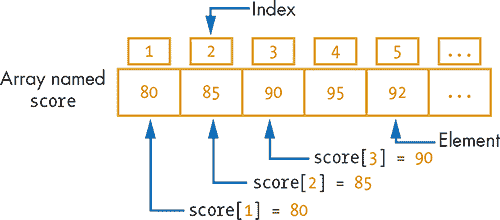
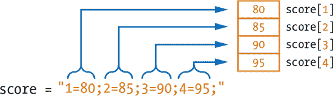
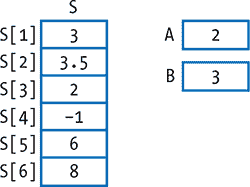
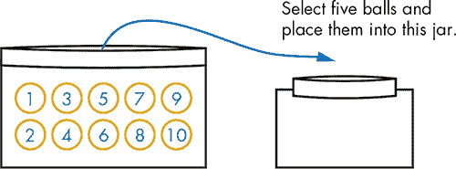
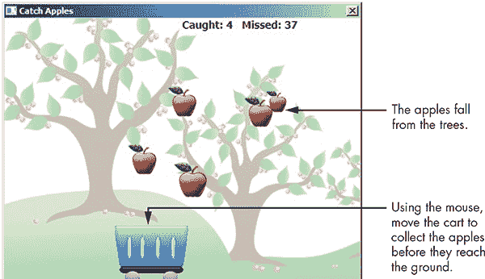
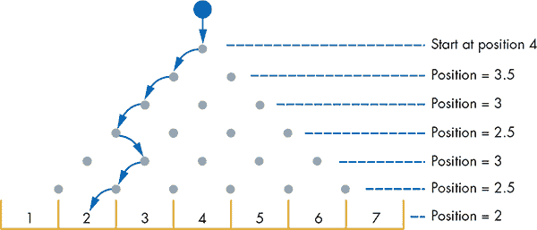
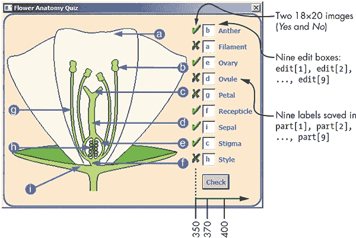
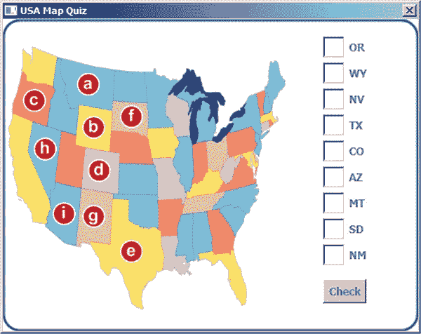

## 15

**将数据分组在一维数组中**


到目前为止，您已经使用变量存储单个信息片段，并创建了一些非常棒的程序。但是，通过将大量信息存储在单个变量中，您可以创建更令人惊叹的程序！在 Small Basic 中，您可以通过使用数组来实现这一点。

*数组* 是一种内置数据类型，让您可以处理数据组。例如，您不会为您拥有的每双鞋子建立单独的衣柜（除非您是一个喜欢购鞋的巨人）；您会把它们都放在一个衣柜里。好吧，数组让您一起存储许多数据片段，以便更容易一次性处理它们。您可以将衣柜看作包含一排鞋盒的一维数组。

Small Basic 有两种类型的数组：索引数组和关联数组。*索引数组* 中的数据片段使用整数索引引用，例如 `score[1]`，`name[3]` 等。这就像在衣柜里的每个鞋盒上贴上编号标签一样。但*关联数组* 的元素使用字符串索引引用，例如 `price["apple"]` 或 `address["John"]`。本章将探讨索引数组。我们将在下一章介绍关联数组，也称为*哈希*或*映射*。

### 开始使用索引数组

假设您想编写一个程序，从用户那里获取四个测试分数，然后显示这些分数以及它们的平均值。根据您目前所学的知识，您可能会编写类似于 清单 15-1 中的程序。

```
 1 ' Average1.sb
 2 TextWindow.Write("Enter 4 scores. ")
 3 TextWindow.WriteLine("Press <Enter> after each score.")
 4 s1 = TextWindow.ReadNumber()    ' Reads the 1st score
 5 s2 = TextWindow.ReadNumber()    ' Reads the 2nd score
 6 s3 = TextWindow.ReadNumber()    ' Reads the 3rd score
 7 s4 = TextWindow.ReadNumber()    ' Reads the 4th score
 8 avg = (s1 + s2 + s3 + s4) / 4   ' Calculates the average
 9 TextWindow.Write("Numbers: " + s1 + ", " + s2 + ", ")
10 TextWindow.WriteLine(s3 + ", " + s4)
11 TextWindow.WriteLine("Average: " + avg)
```

*清单 15-1：将分数存储在单独的变量中*

此程序提示用户输入四个分数（第 2–3 行）。它读取这些分数并将它们保存在四个变量`s1`，`s2`，`s3`和`s4`中（第 4–7 行）。然后计算平均值（第 8 行），在一行上显示这四个数字（第 9–10 行），并显示计算出的平均值（第 11 行）。

现在想象一下，您希望用户输入 100 个分数而不是 4 个。定义 100 个变量并复制几乎相同的语句 100 次将花费很长时间。好吧，Small Basic 的数组存储值的集合。使用数组，您不必单独创建每个变量。您可以将所有值放入一个*数组变量*中。例如，您可以读取用户输入的 10 个分数并将它们存储在一个数组中，使用以下循环：

```
For N = 1 To 10
  score[N] = TextWindow.ReadNumber()
EndFor
TextWindow.WriteLine(score)
```

您不需要创建 10 个变量，如`s1`，`s2`等到`s10`，而是创建一个名为`score`的数组变量。要引用`score`数组中的每个数据片段，您使用语法`score[N]`，其中`N`是一个将取值 1 到 10 的变量。编写`score[N]`就像编写`score[1]`，`score[2]`，...，`score[10]`，而`For`循环会为您递增`N`。

运行此代码。在输入 10 个不同的数字后，Small Basic 显示`score`数组，并且您可以看到其中存储的所有 10 个值（我们将在本章后面展示更好的显示数组的方法）。

将数组看作是共享相同名称的一组变量。例如，美国十大城市的年平均降水量可以保存在`rainLevel[1]`到`rainLevel[10]`中，而你所在地区 100 家麦当劳的日销售额可以保存在`sales[1]`到`sales[100]`中。想象一下所有的快乐儿童餐！

数组可以帮助你以一种方式组织数据，使得数据更容易修改和使用。数组的命名遵循与你为变量命名时相同的规则和指导原则。

### 数组基础

数组中的每个信息单元称为*元素*。要访问数组中的一个元素，你可以使用以下语法：

```
arrayName[index]
```

`arrayName`变量是数组的名称，`index`是一个标识符，可以是数字或字符串，用于标识数组中的元素（参见图 15-1）。这种语法被称为*带索引的变量*，或*下标变量*。索引位于方括号中，唯一标识数组中的一个元素。



*图 15-1：一维数组的图形表示*

你可以像对待常规变量一样，通过使用正确的语法来处理带有索引的变量。例如，下面的语句会初始化并显示`score`数组中前面三个元素，如图 15-1 所示：

```
score[1] = 80
score[2] = 85
score[3] = 90
TextWindow.WriteLine(score[1] + ", " + score[2] + ", " + score[3])
```

如果你运行这段代码，你将看到以下输出：

```
80, 85, 90
```

如果你想改变第一个成绩，你可以写下如下语句：

```
score[1] = score[1] + 5
```

这行代码将 5 加到索引为 1 的第一个`score`上。如果你现在显示`score`的值，你会看到`score[1] = 85`。你可以使用下一条语句来将索引 1 和 2 的两个元素相乘：

```
score[1] = score[1] * score[2]
```

如果`score[1]`是 80，`score[2]`是 85，它们相乘得到 6800，并将结果保存回`score[1]`。高分！

### 初始化数组

在程序中使用数组之前，你需要先为它填充（或初始化）一些数据。在 Small Basic 中，你可以通过两种方式来做到这一点：直接的（逐个元素）初始化或字符串初始化。

假设你想创建一个包含四个成绩的数组（不是阿布·林肯那种类型的）。这里是直接做法：

```
score[1] = 80
score[2] = 85
score[3] = 90
score[4] = 95
```

你也可以使用*字符串初始化器*，它允许你仅用一行代码设置四个值，如下所示：

```
score = "1=80;2=85;3=90;4=95;"
```

这个字符串初始化器有四个标记（或字段），它们以分号结束。每个标记的形式如下（不，你不能用这些标记换取奖品）：

```
index=value;
```

在这个例子中，第一个标记是`1=80`，第二个是`2=85`，第三个是`3=90`，第四个是`4=95`。等号前面的数字是元素的索引，等号后面的数字是存储在该元素中的值。注意等号前后没有空格。图 15-2 展示了这个字符串初始化器的工作原理。



*图 15-2：数组字符串初始化器的语法*

字符串初始化器允许你在一条语句中填充数组，但其语法有些复杂，且可能不小心引入代码错误。在你更加熟悉数组之前，我们建议你在程序中坚持使用基本的逐个元素初始化方法。不过，如果你使用了字符串初始化器并遇到问题，可以尝试逐个元素地重新初始化数组。本书中将同时使用这两种初始化方法，以节省空间并帮助你更好地掌握它们。

**注意**

*Small Basic 允许你为索引选择任何你想要的数字。它甚至允许使用负数和小数，并且不要求索引是连续的。但在本书中，我们将始终使用从 1 开始的整数索引来表示第一个数组元素。*

数组和`For`循环经常一起使用。当数组的大小已知时，你可以使用`For`循环遍历数组并对每个元素执行操作。接下来的示例展示了如何使用`For`循环对数组执行操作。

**尝试示例 15-1**

假设数组`S`中的元素以及变量`A`和`B`的值如图 15-3 所示。那么`S[A]`、`S[B]`、`S[A * B - 2]`、`S[A + B]`和`S[A] - 2 * S[B]`的值分别是多少？



*图 15-3: `S`数组及变量`A`和`B`中的值*

### 使用 For 循环填充数组

许多时候，你需要使用常量值、随机值、通过公式计算的值或用户输入的值来填充数组的元素。让我们来看每种情况！

#### *常量初始化*

以下代码片段展示了如何使用常量值 0 初始化一个美味的数组（名为`scoobySnack`）的前 10 个元素。

```
For N = 1 To 10
  scoobySnack[N] = 0
EndFor
```

`For`循环执行 10 次。在第一次迭代中，`N`的值为 1，因此循环将`scoobySnack[1] = 0`。在第二次迭代中，`N`的值为 2，因此循环将`scoobySnack[2] = 0`，依此类推。这样就创建了一个包含 10 个元素的数组，所有元素的值都为 0。

#### *随机初始化*

你也可以通过随机数填充`scoobySnack`数组的元素，如下所示：

```
For N = 1 To 10
  scoobySnack[N] = Math.GetRandomNumber(5)
EndFor
```

`For`循环迭代 10 次。在第`N`次迭代中，索引为`N`的元素`scoobySnack[N]`将被赋值为 1 到 5 之间的随机数。试着显示`scoobySnack`的值，看看你得到的随机数！在`For`循环中设置`scoobySnack[N]`之后，添加以下语句：

```
TextWindow.WriteLine(scoobySnack[N])
```

#### *公式初始化*

你还可以使用公式初始化数组的元素。在此示例中，你将把`scoobySnack`数组的第`N`个元素设置为`N * 8`；这段代码将把 8 的乘法表存储在数组中：

```
For N = 1 To 10
  scoobySnack[N] = N * 8
EndFor
```

添加代码以显示`scoobySnack`的值，查看结果！

#### *用户初始化*

如果你想使用用户输入的值来初始化数组的元素呢？以下程序提示用户输入五个数字，并在每个数字后按下 ENTER 键。然后程序开始一个`For`循环，读取这五个数字并将它们存储在`thunderCat[1]`、`thunderCat[2]`、...、`thunderCat[5]`中。

```
TextWindow.WriteLine("Enter 5 numbers. Press Enter after each one.")
For N = 1 To 5
  thunderCat[N] = TextWindow.ReadNumber()
EndFor
```

这种技术对于存储用户输入的海量数据非常有用。你还会请求哪些其他的数据集合呢？比如`breakfastMenu`、`favoriteGames`、`bestPasswords`、`funnyJokes`或`frozenNames`？

**动手实践 15-2**

编写一个程序，将一个名为`skeletor`的数组填充从 20 到 40 之间的偶数（例如，`skeletor[1] = 20, skeletor[2] = 22`，...）。

### 显示数组

假设我们有一个名为`age`的数组，保存了三兄弟的年龄，像这样：

```
age[1] = 14
age[2] = 15
age[3] = 16
```

你可以通过两种方式显示这个数组的内容。第一种也是最简单的方式是将数组的名称传递给`WriteLine()`方法，像这样：

```
TextWindow.WriteLine(age)
```

这是这个语句的输出：

```
1=14;2=15;3=16;
```

这个语句将在一行内显示数组的元素，每个元素之间用分号隔开。这个字符串中的每个标记显示了数组元素的索引和值。你现在能看出数组的字符串初始化语法是从哪里来的了吗？

如果你想以更易读的格式显示数组，可以使用`For`循环将数组的每个元素显示在单独的一行中：

```
For N = 1 To 3
  TextWindow.WriteLine("age[" + N + "] = " + age[N])
EndFor
```

这是这个循环的输出：

```
age[1] = 14
age[2] = 15
age[3] = 16
```

如果你处理的是一个较短的数组，显示在一行上没问题。但如果你处理的是大量数据，最好以易于阅读的格式显示数组。

**动手实践 15-3**

编写一个程序，将一个名为`burps`的数组填充五个介于 80 到 100 之间的随机数，并显示这个数组。尝试通过将数组的名称传递给`TextWindow.WriteLine()`来显示数组，然后再通过使用`For`循环来显示数组。哪种方式看起来更好？

### 处理数组

许多程序涉及处理数组的元素，例如对它们进行求和、找出它们的平均值、最小值、最大值等。你将在本节中学习如何执行这些任务。

#### *查找总和*

一位名叫 Super Here-O 的超级英雄想知道他从镇上的 10 个强盗手中救回了多少钱。以下程序让 Super Here-O 将他救回的金额输入到一个名为`moneyReturned`的数组中。程序会计算该数组中所有元素的总和：

```
sum = 0
TextWindow.WriteLine("Enter the 10 amounts that were returned:")
For N = 1 To 10
  moneyReturned[N] = TextWindow.ReadNumber()
  sum = sum + moneyReturned[N]
EndFor
For N = 1 To 10
  TextWindow.Write("$" + moneyReturned[N])
  TextWindow.WriteLine(" rescued from robber " + N)
EndFor
TextWindow.WriteLine("$" + sum + " was rescued by Super Here-O!")
```

要计算总和，首先将`sum`变量初始化为 0。然后，运行一个`For`循环，读取`moneyReturned`数组的每个元素并将其加到`sum`变量中。当循环结束时，开始另一个循环，显示每个强盗被救回的金额，然后显示总金额。运行程序，看看这些钱是否足够买一套新的超级英雄紧身衣！

#### *查找最大元素*

假设你正在和九个好朋友竞争，看看谁在 Facebook 上有最多的朋友。使用以下代码片段找到名为 `friends` 的数组中的最大值：

```
friends = "1=10;2=30;3=5;4=10;5=15;6=8;7=1;8=23;9=6;10=11"
max = friends[1]
For N = 2 To 10
  If (friends[N] > max) Then  ' Nth element is larger than max
    max = friends[N]          ' Update max to hold the new maximum
  EndIf
EndFor
TextWindow.WriteLine("The most friends is " + max + ".")
```

首先，我们填充了 `friends` 数组中的 10 个元素，表示你和你九个最亲密的朋友在 Facebook 上的朋友数量。在这个示例中，你的第一个朋友有 10 个朋友，第二个朋友有 30 个，第三个朋友有 5 个，以此类推，你（数组中的第 10 个）有 11 个朋友。你可以随意更改这些数字。程序开始时假设第一个元素 `friends[1]` 是最大的。然后它进入一个循环，检查数组中剩下的元素，从第二个元素开始。每次找到一个大于当前最大值的数字时，它会更新最大值 `max`。当循环结束时，最大值会被显示出来。

### 在数组中使用字符串值

数组不仅仅局限于数字，你也可以使用数组来存储字符串。例如，假设你想创建一个数组，用来存储你收藏书籍的名称。你可以像这样初始化这个数组：

```
book[1] = "The Hobbit"
book[2] = "Little Women"
book[3] = "My Little Pony vs Hello Kitty"
```

**注意**

*你也可以使用字符串初始化器来初始化* `book` *数组，像这样（确保整个语句在一行内）：*

```
book = "1=The Hobbit;2=Little Women;3=My Little Pony vs Hello Kitty"
```

**试一试 15-4**

编写一个程序，填充两个数组（`noun` 和 `verb`），存储你选择的复数名词和动词。让程序以这种形式显示随机句子：`noun verb noun`（例如，dogs delight cats）。

### 保存记录

你可以在一个数组中混合不同的数据类型。你可以存储数字（整数和小数）和字符串作为数组中的不同元素。例如，以下数组是有效的（你知道这座建筑吗？）：

```
arr[1] = 1600
arr[2] = "Pennsylvania Avenue NW"
arr[3] = 20500
```

这个数组的第一个和第三个元素是数字，第二个元素是字符串。这三个元素可以分别代表一个家的号码、街道名称和邮政编码。这是创建一个*记录*的方式，记录是一个包含相关数据片段的集合，在 Small Basic 中就是这样。

哇！好吧，我们已经学习了足够的内容来解决大量的问题。现在让我们花些时间写些有趣的程序吧！

### 使用索引数组

本节的第一个示例展示了如何从数组中选择随机元素。第二个示例模拟了一个魔法 8 号球游戏，计算机会随机选择答案来回应玩家的问题。让我们来进行随机选择吧！

#### *随机选择*

假设我们有一个袋子，里面装有编号从 1 到 10 的 10 个球，我们要从中随机取出五个球（见 图 15-4）。我们将编写一个程序，随机选择五个球，然后显示它们的编号。



*图 15-4：从袋子中随机选择五个球*

为了创建这个程序，我们将使用一个名为`ball`的数组来存储 10 个球的号码（`ball[1] = 1`，`ball[2] = 2`，...，`ball[10] = 10`）。然后程序随机选择一个 1 到 10 之间的数字来挑选一个球。例如，如果它选中了 2，那么它会将`ball[2] = 0`，表示第二个球已经被选中并且不再可用。然后它会选择另一个随机数。假设第二个数字也是 2。首先，程序检查`ball[2]`。由于它是 0，程序知道`ball[2]`已经被选中了（你不能把同一个球从袋子里拿出来两次！），所以它会选择另一个随机数。它会继续这样，直到选出五个不同的随机数。完整的程序请参见清单 15-2。

```
 1 ' RandomSelect.sb
 2 For N = 1 To 10  ' Puts the 10 balls in an array
 3   ball[N] = N
 4 EndFor
 5
 6 For N = 1 To 5                     ' Loops to select 5 balls
 7   idx = Math.GetRandomNumber(10)   ' Gets random ball number
 8   While (ball[idx] = 0)            ' Ball already selected
 9     idx = Math.GetRandomNumber(10) ' Gets another number
10   EndWhile
11
12   TextWindow.Write(ball[idx] + ", ") ' Displays selected ball
13   ball[idx] = 0                      ' Marks it out (taken)
14 EndFor
15 TextWindow.WriteLine("")
```

*清单 15-2：随机选择五个不同的球*

程序首先通过`For`循环设置`ball[1] = 1`，`ball[2] = 2`，...，`ball[10] = 10`（第 2–4 行）。然后它开始一个循环来选择五个球（第 6 行）。在每次循环迭代中，它选择一个 1 到 10 之间的随机数`idx`（第 7 行）。一个`While`循环不断设置`idx`，直到`ball[idx]`不为 0（第 8–10 行）。在选择一个唯一的球号后，程序会显示该号码（第 12 行），然后通过将该球的数组元素设置为 0 来标记它已被选中（第 13 行），以避免再次选择该号码。下面是该程序的一个示例运行：

```
5, 9, 10, 1, 2,
```

运行程序，看看你会得到哪些数字！

#### *魔术 8 球*

在这个例子中，我们将编写一个模拟魔术 8 球游戏的程序。用户提出一个是或否的问题，计算机会给出答案。当然，这只是为了好玩，所以不要用它来做重要决策，比如选择配偶或房子！完整的程序请参见清单 15-3。

```
 1 ' Magic8Ball.sb
 2 ans[1] = "It is certain. Like really, really certain."
 3 ans[2] = "It is decidedly so. By me. I decided."
 4 ans[3] = "Without a doubt. Maybe one doubt."
 5 ans[4] = "Yes, definitely. Isn't it obvious?"
 6 ans[5] = "Very doubtful. The doubt is very full."
 7 ans[6] = "Maybe. Depends on the horse race."
 8 ans[7] = "No. Wait, yes. Wait, no. Yes, it's no."
 9 ans[8] = "Let me consult my Magic 8 Ball... It says yes."
10 ans[9] = "Outlook not so good. Restart Outlook."
11 ans[10] = "Try again. It's funny when you shake things."
12
13 While ("True")
14   TextWindow.WriteLine("Ask me a yes-no question. Do it!")
15   ques = TextWindow.Read()
16   num = Math.GetRandomNumber(10)
17   TextWindow.WriteLine(ans[num])
18   TextWindow.WriteLine("")
19 EndWhile
```

*清单 15-3：魔术 8 球模拟*

游戏有 10 个可能的答案保存在`ans`数组中。在初始化数组（第 2–11 行）之后，游戏启动一个无限循环与用户互动。在每次循环中，游戏都会询问用户输入一个是或否的问题。它读取用户的问题（第 15 行），生成一个 1 到 10 之间的随机数（第 16 行），并使用这个数字通过`ans[num]`显示一个答案（第 17 行）。显示完信息后，我们会显示一个空白行（第 18 行）。对于那些不了解窍门的人，计算机看起来可能很聪明！邀请你的朋友玩这个游戏，看看他们怎么说。

你感觉怎么样？像海绵一样敏锐，像钉子一样新鲜？太好了，因为现在是游戏创建时间！

**尝试一下 15-5**

修改魔术 8 球游戏，使其每个答案只显示一次。当所有答案都显示完时结束游戏。

### 创建抓苹果游戏

图 15-5 显示了一个游戏，在图形窗口的顶部随机位置和时间出现苹果，然后掉落到地面。玩家需要通过鼠标移动手推车，抓住掉落的苹果，避免它们掉到地面。每个苹果值 1 分。别担心苹果会被撞坏，它们是硬核的！



*图 15-5：捉苹果游戏*

按照以下步骤，一步一步将这个精彩的游戏拼凑在一起。

#### *步骤 1：打开启动文件*

打开本章文件夹中的文件*CatchApples_Incomplete.sb*。文件夹中还包含了你需要的所有图像。启动文件包含主代码（见示例 15-4）和四个子程序的空占位符，你将编写这些子程序。我们从主代码开始。

```
 1 ' CatchApples_Incomplete.sb
 2 GraphicsWindow.Title = "Catch Apples"
 3 GraphicsWindow.CanResize = "False"
 4 GraphicsWindow.Width = 480
 5 GraphicsWindow.Height = 360
 6 GraphicsWindow.FontSize = 14
 7 GraphicsWindow.BrushColor = "Black"
 8
 9 path = Program.Directory
10 GraphicsWindow.DrawImage(path + "\Background.png", 0, 0)
11
12 msgID = Shapes.AddText("")
13 Shapes.Move(msgID, 240, 0)
14
15 MAX_APPLES = 5     ' Change this to have more apples
16 AddApples()        ' Creates the apple array
17
18 cartImg = Shapes.AddImage(path + "\Cart.png")  ' 100x80 pixels
19
20 numMissed = 0   ' Missed apples
21 numCaught = 0   ' Caught apples
22
23 While ("True")
24   Shapes.Move(cartImg, GraphicsWindow.MouseX - 50, 280)
25   MoveApples()
26   Program.Delay(5)
27 EndWhile
```

*示例 15-4：捉苹果游戏的主代码*

在第 2–7 行中，我们设置了图形窗口的标题；大小与背景图像的大小匹配；字体大小；以及字体颜色。然后，我们绘制背景图像（第 10 行），并创建显示捕捉和掉落苹果数量的文本形状（第 12–13 行）。第 15 行中的`MAX_APPLES`变量是将出现在图形窗口中的最大苹果数量。一旦游戏运行起来，你可以调整这个数字来让游戏更容易或更难。

第 16 行调用`AddApples()`子程序来创建将保存掉落苹果的数组。第 18 行添加手推车的图像，并将其标识符保存在`cartImg`中；我们需要这个标识符来移动手推车。

第 20–21 行初始化了`numMissed`（错过的苹果数量）和`numCaught`（捕获的苹果数量）变量为 0。然后，代码启动了游戏的主循环（第 23–27 行）。在每次迭代中，我们移动手推车，使其中心与鼠标的 x 位置对齐（第 24 行）。由于手推车的宽度是 100 像素，手推车的左侧位置设置为`MouseX – 50`。手推车的 y 位置是固定的。我们调用`MoveApples()`子程序让苹果掉落，并检查它们是否碰到手推车或地面（第 25 行）；然后我们等待 5 毫秒，再重复这些步骤（第 26 行）。不过不要告诉你爸爸等 5 毫秒，否则他可能以为你在顶嘴！

现在运行游戏，并移动鼠标。手推车会跟随鼠标，但苹果还没有出现。接下来，你将添加缺失的子程序来完成游戏。

#### *步骤 2：添加苹果*

在示例 15-5 中添加`AddApples()`子程序。

```
1 Sub AddApples
2   For aplNum = 1 To MAX_APPLES
3     apple[aplNum] = Shapes.AddImage(path + "\Apple.png")
4     scale =(3 + Math.GetRandomNumber(5)) / 10
5     Shapes.Zoom(apple[aplNum], scale, scale)
6     SetApplePosition()
7   EndFor
8 EndSub
```

*示例 15-5：`AddApples()`子程序*

这个子程序使用`For`循环来创建五个苹果。在每次迭代中，我们调用`AddImage()`从游戏文件夹加载苹果的图像，并将返回的标识符保存在`apple`数组中（第 3 行）。第一个苹果保存在`apple[1]`，第二个苹果保存在`apple[2]`，以此类推。

为了增加游戏的多样性，我们将改变苹果的大小。在第 4 行，我们将 `scale` 变量设置为来自集合 {0.4, 0.5, 0.6, 0.7, 0.8} 的随机值，计算方式为 `(3 + Math.GetRandomNumber(5)) / 10`。在第 5 行，我们将这个值传递给 `Zoom()` 方法来改变苹果的大小。这样，苹果的大小将是其原始大小的一个比例（介于 40% 到 80% 之间）。

接下来，我们将调用 `SetApplePosition()` 子程序来定位新的苹果。让我们看看这个子程序是如何工作的。

#### *步骤 3：定位苹果*

在清单 15-6 中添加 `SetApplePosition()` 子程序。

```
1 Sub SetApplePosition
2   xPos = Math.GetRandomNumber(420)
3   yPos = -Math.GetRandomNumber(500)
4   Shapes.Move(apple[aplNum], xPos, yPos)
5 EndSub
```

*清单 15-6：* `SetApplePosition()` *子程序*

我们将水平位置设置为 1 到 420 之间的随机整数（第 2 行），将垂直位置设置为 -1 到 -500 之间的负值（第 3 行）。在第 4 行调用 `Move()` 将苹果（在 `apple` 数组中索引为 `aplNum` 的元素）放置在图形窗口顶部的一个不可见的点，使用这两个数字 `xPos` 和 `yPos`。这样，当苹果开始掉落时，它们会在屏幕顶部随机出现；被放置在 `yPos = -100` 的苹果会比放置在 `yPos = -500` 的苹果更早出现，因为它需要掉落的距离更短。正如你稍后会看到的，我们还将在玩家抓住或错过苹果时调用这个子程序。

#### *步骤 4：移动苹果*

现在我们准备让苹果下雨了（让猫和狗休息一下）。将清单 15-7 中的代码添加到 `MoveApples()` 子程序的占位符中。

```
 1 Sub MoveApples
 2   For aplNum = 1 To MAX_APPLES
 3     xPos = Shapes.GetLeft(apple[aplNum])
 4     yPos = Shapes.GetTop (apple[aplNum])
 5     Shapes.Move(apple[aplNum], xPos, yPos + 1)
 6
 7     CheckCatch()       ' Checks if the apple landed in the cart
 8     If (gotIt = 1) Then
 9       Sound.PlayClick()
10       numCaught = numCaught + 1
11       SetApplePosition()
12     ElseIf (yPos > 320) Then
13       numMissed = numMissed + 1
14       SetApplePosition()
15     EndIf
16   EndFor
17
18   msg = "Caught: " + numCaught + "   Missed: " + numMissed
19   Shapes.SetText(msgID, msg)
20 EndSub
```

*清单 15-7：* `MoveApples()` *子程序*

在第 2 行，我们开始一个 `For` 循环来掉落五个苹果。我们获取每个苹果的左上角坐标（第 3–4 行），然后将其向下移动 1 像素（第 5 行）。然后我们调用 `CheckCatch()` 来检查这个苹果是否被玩家抓住（第 7 行）。正如你稍后会看到的，这个子程序会将 `gotIt` 标志设置为 1，如果玩家抓住了苹果；否则，它会将 `gotIt` 设置为 0。错过苹果是没关系的，不会伤害到苹果的皮。

当 `CheckCatch()` 返回时，我们检查 `gotIt` 标志。如果它是 1（第 8 行），意味着苹果被玩家抓住了。在这种情况下，我们播放点击音效，将 `numCaught` 增加 1，并调用 `SetApplePosition()` 重新定位苹果并让它再次掉落（第 9–11 行）。另一方面，如果 `gotIt` 不是 1，我们检查苹果的 y 坐标，看看它是否落到小车中心以下，意味着玩家没有接住它（第 12 行）。在这种情况下，我们将 `numMissed` 增加 1，并调用 `SetApplePosition()` 重新定位苹果并让它再次掉落（第 13–14 行）。如果苹果既没有被抓住也没有错过，那么它正在掉落，并将在下次调用 `MoveApples()` 时再次处理。

在移动并检查五个苹果的状态后，我们更新显示已抓住和错过苹果数量的消息（第 18–19 行）。

#### *步骤 5：抓住或错过*

最后一部分是添加`CheckCatch()`子程序，见 Listing 15-8。

```
 1 Sub CheckCatch
 2   xApple = Shapes.GetLeft(apple[aplNum]) + 32 ' Center point
 3   yApple = Shapes.GetTop(apple[aplNum]) + 32  ' Bottom point
 4   xCart = Shapes.GetLeft(cartImg) + 50        ' Center point
 5   yCart = Shapes.GetTop(cartImg) + 40         ' Around the center
 6   xdiff = Math.Abs(xApple - xCart)
 7   ydiff = Math.Abs(yApple - yCart)
 8   gotIt = 0  ' Assumes we didn't get the apple
 9   If ((xdiff < 20) And (ydiff < 20)) Then
10     gotIt = 1 ' We got it
11   EndIf
12 EndSub
```

*Listing 15-8: The* `CheckCatch()` *子程序*

这个子程序检查苹果中心（其索引由`aplNum`给出）和小车中心之间的距离。如果苹果距离小车中心 20 像素以内，子程序将`gotIt`设置为 1；否则，它将`gotIt`设置为 0。

游戏现在已经完成，你可以开始玩了！也许你会捉到足够多的苹果做一个苹果派。

**试试看 15-6**

当前，Catch Apples 游戏会一直运行。想想如何结束游戏，然后实现它。你能想到其他一些改进游戏的方法吗？也许如果玩家捉到一个大苹果，你可以给他们更多的分数！关于在`While`循环内移动小车的语句呢？你能把这个语句移到新的`MouseMove`事件处理程序中吗？

### 编程挑战

如果你卡住了，可以查看* [`nostarch.com/smallbasic/`](http://nostarch.com/smallbasic/)*获取解决方案、更多资源以及供教师和学生使用的复习问题。

1.  编写一个模拟掷骰子的程序。让程序掷骰子 10,000 次，并跟踪每个数字出现的次数。以下是程序的一个示例运行。（提示：使用一个名为`dice`的数组，它有六个元素。如果掷出 1，就增加`dice[1]`；如果掷出 2，就增加`dice[2]`，以此类推。）

    ```
    Num  Count  Probability
    1    1640   0.164
    2    1670   0.167
    3    1638   0.1638
    4    1684   0.1684
    5    1680   0.168
    6    1688   0.1688
    ```

1.  打开本章文件夹中的*PinBall.sb*文件。这个程序模拟了一个弹珠机。如下图所示，球从机器顶部掉下。当它向下滚动时，它会撞击固定的销钉，并以随机的方式向左或向右弹跳。最后，球会落入七个口袋中的一个。程序会让球掉落 10,000 次，并统计每次球落入哪个口袋。研究程序并解释它是如何工作的。

    

1.  打开本章文件夹中的*FlowerAnatomy.sb*文件。这个程序是一个教育游戏，测试玩家对花朵部位的认识（如下图所示）。玩家输入字母以匹配花朵的标签部位，然后点击“检查”按钮来检查答案。程序将用户的答案与正确答案进行比较，然后通过在每个正确答案旁边放一个绿色的对号，在每个错误答案旁边放一个红色的叉号，来显示玩家的成绩。研究这个程序，并解释它是如何工作的。

    

1.  打开本章文件夹中的*USMapQuiz_Incomplete.sb*文件。文件夹中还包含此处显示的背景图像（以及前一个练习中的*Yes*和*No*图像）。完善程序，使这个测验能够运行。显示九个州的两字母缩写，并提供九个文本框，让玩家将每个州与其代码匹配。

    
