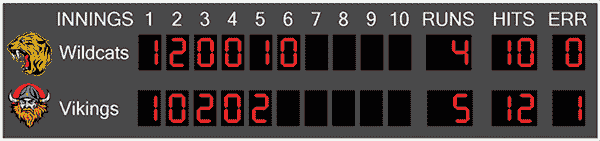
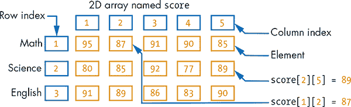
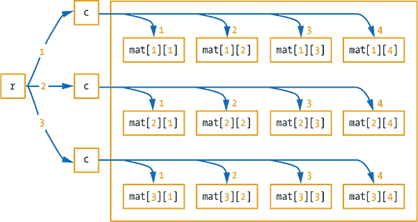
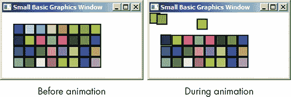
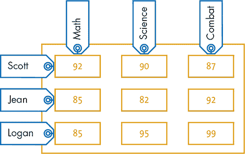
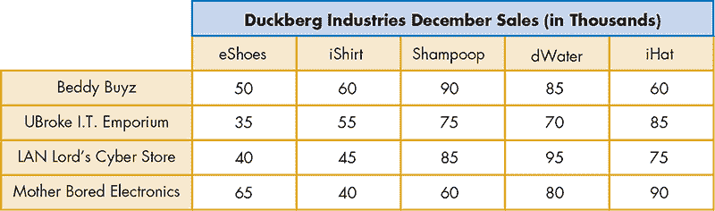
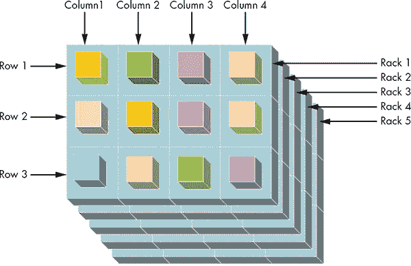
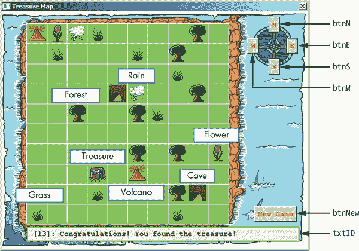
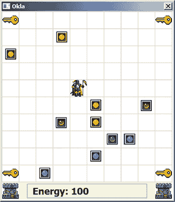
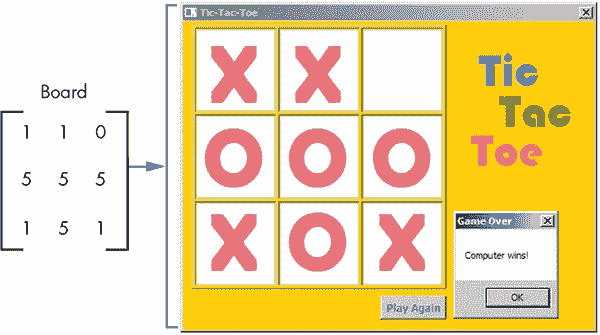

## 17

**扩展到高维数组**


在前两章中，你学习了如何使用一维数组来存储项目集合。本章将这一概念扩展到二维及更高维度。处理多维数组也叫做处理*高维*数组。

在*二维（2D）*数组中，你可以在表格或网格中存储值。例如，想象一下棒球比赛中的记分牌（见 Figure 17-1）。左侧列列出了队名，右侧列列出了局数和其他统计数据。



*Figure 17-1：棒球记分牌*

本章中你将创建的数组类似于记分牌。它们允许你将数据按行和列组织起来。

完成本章后，你将理解二维及其他高维数组，并能够使用它们来构建新类型的应用程序，包括寻宝游戏！

### 二维数组

一个二维数组有两个维度：行和列。你可以将二维数组视为一个表格。例如，Figure 17-2 显示了一个名为`score`的二维数组，用来存储学生在三门科目中的考试成绩。



*Figure 17-2：二维数组的图示视图*

第一行包含数学考试成绩，第二行记录了科学考试成绩，接下来的行存储了英语成绩。这种元素的二维排列也称为*矩阵*（复数为*矩阵*）。但这个矩阵不会教你慢动作功夫！

要访问矩阵中的单个元素，你需要两个索引：一个表示行，另一个表示列。以下是一些示例：

```
score[1][1] = 95 ' Row 1, column 1
score[1][2] = 87 ' Row 1, column 2
score[2][1] = 80 ' Row 2, column 1
score[2][3] = 92 ' Row 2, column 3
```

变量`score`是一个*双重脚本变量*，因为它需要两个索引来访问其元素。第一个索引是行号，第二个索引是列号。

与一维数组一样，每个维度的索引可以是数字或字符串。此外，矩阵中存储的值可以是数字、字符串或 Small Basic 库中对象返回的其他标识符。接下来我们来看一些二维数组的简单示例。

#### *随机矩阵*

一个名为 MI6 的客户需要你的帮助来为安全锁生成密码。程序 Listing 17-1 创建了一个名为`mat`的矩阵，其中包含随机数。该矩阵包含三行四列，是一个 3×4（读作*3 乘 4*）矩阵，或者是一个 3×4 数组。

```
 1 ' Random2DArray.sb
 2 For r = 1 To 3    ' 3 rows
 3   For c = 1 To 4  ' 4 columns
 4     mat[r][c] = Math.GetRandomNumber(9)
 5   EndFor
 6 EndFor
 7
 8 ' Displays the matrix to see its contents
 9 For r = 1 To 3    ' 3 rows
10   For c = 1 To 4  ' 4 columns
11     TextWindow.Write(mat[r][c] + " ")
12   EndFor
13   TextWindow.WriteLine("")
14 EndFor
```

*Listing 17-1：用随机数填充一个 3×4 数组*

程序使用嵌套的`For`循环填充矩阵的随机数（第 2–6 行）。嵌套的`For`循环在处理二维数组时非常有用，因为你可以使用一个循环遍历行，另一个循环遍历列。在这个例子中，外层循环使用控制变量`r`（表示*行*），从 1 运行到 3（第 2 行）；内层循环使用控制变量`c`（表示*列*），从 1 运行到 4（第 3 行）。

外层循环的第一次执行（`r = 1`）会导致内层循环执行四次（`c = 1`、`2`、`3`、`4`），填充`mat[1][1]`、`mat[1][2]`、`mat[1][3]`、`mat[1][4]`。外层循环的第二次执行（`r = 2`）会导致内层循环再执行四次（`c = 1`、`2`、`3`、`4`），填充`mat[2][1]`、`mat[2][2]`、`mat[2][3]`、`mat[2][4]`。同样，外层循环的第三次执行（`r = 3`）会填充矩阵的第三行。图 17-3 展示了这一过程。



*图 17-3：使用嵌套的* `For` *循环访问矩阵元素*

根据这张图，当`r = 1`时，程序执行顶部的`c`分支，填充二维数组的四组元素。当`r = 2`时，它会遍历中间的分支四次。当`r = 3`时，它会遍历底部的分支。

在用随机数填充矩阵之后，程序使用另一个嵌套循环以类似的方式显示其内容（第 9–14 行）。外层循环从 1 到 3 运行，用于索引三行（第 9 行），内层循环从 1 到 4 运行，用于索引四列（第 10 行）。第 11 行显示索引为`mat[r][c]`（第 r 行第 c 列）的元素，并跟着一个空格。当内层循环结束时，意味着一整行已经显示完毕，光标将移动到下一行，准备显示下一行（第 13 行）。

现在是时候将你的程序交给 MI6 客户了。下面是该程序的一个示例输出，但你的输出很可能会有所不同：

```
2 8 1 6
3 9 3 9
1 5 7 8
```

通过编程使矩阵能够接受用户输入，你可以使矩阵变得更加有用。接下来，我们将看看如何做到这一点。

**尝试一下 17-1**

在清单 17-1 中，矩阵中的数字按行存储。首先填充第 1 行，然后是第 2 行，最后是第 3 行。原因是我们将代表行的`r`循环设置为外层循环，将代表列的`c`循环设置为内层循环。修改程序，让它先按列填充矩阵，而不是按行填充。

#### *带有用户输入的矩阵*

你的 MI6 客户喜欢你编写的程序，但现在他们希望能够将某些数字输入到密码矩阵中。你可以轻松修改清单 17-1，让它从用户处获取输入，而不是使用随机数。只需将第 4 行替换为以下两行：

```
TextWindow.Write("mat[" + r + "][" + c + "]: ")
mat[r][c] = TextWindow.ReadNumber()
```

第一条语句提示用户输入矩阵中的一个元素，第二条语句读取并存储用户的输入。进行此更改，并尝试运行程序，看看它是如何工作的。

但矩阵不仅仅是数字。你也可以使用它们来制作一些有趣的彩色应用程序。在接下来的示例中，你将创建一个彩色网格并使其动画化。

#### *动画方块*

我们来编写一个程序，创建一个 4×8 的随机颜色方块网格，并将这些方块动画化，飞向图形窗口的左上角，如图 17-4 所示。



*图 17-4：展示* AnimatedSquares.sb 输出的效果

完整的应用程序在清单 17-2 中展示。

```
 1 ' AnimatedSquares.sb
 2 ' Creates a 4x8 grid of randomly colored squares
 3 For r = 1 To 4    ' 4 rows
 4   For c = 1 To 8  ' 8 columns
 5     clr = GraphicsWindow.GetRandomColor()
 6     GraphicsWindow.BrushColor = clr
 7     box[r][c] = Shapes.AddRectangle(20, 20) ' Adds a square
 8     Shapes.Move(box[r][c], c * 20, r * 20)  ' Positions it
 9   EndFor
10 EndFor
11
12 ' Animates the squares to the upper-left corner of the window
13 For r = 1 To 4
14   For c = 1 To 8
15     Shapes.Animate(box[r][c], 0, 0, 1000)
16     Program.Delay(400) ' A small delay (in milliseconds)
17   EndFor
18 EndFor
```

*清单 17-2：使用矩阵存储形状 ID*

程序使用嵌套的`For`循环来创建方块（第 3–10 行）。外部循环（创建行）运行四次，内部循环（创建列）运行八次（第 3–4 行），共进行 32 次迭代（4×8）。在每次内部循环中，方块的颜色通过更改`BrushColor`属性来设置（第 5–6 行），然后通过调用`AddRectangle()`创建一个方块。我们将其标识符保存在`box[r][c]`中（第 7 行），然后将创建的方块移动到它在方块网格中的位置（见图 17-4）。让我们仔细看一下第 7–8 行。

在第 7 行，`AddRectangle()`方法接受期望的矩形的宽度和高度，并返回创建的形状的标识符。在这个例子中，我们传递 20 作为两个参数来创建一个方块，并将返回的标识符保存在`box[r][c]`中。

要移动方块，我们调用`Shapes`对象的`Move()`方法（第 8 行）。该方法接受三个参数：我们要移动的形状标识符，以及我们要将其移动到的位置的 x 和 y 坐标。每一行中的方块的 x 位置（左边缘）分别是 1 × 20 = 20, 2 × 20 = 40, 3 × 20 = 60，依此类推。每一列中的方块的 y 位置（上边缘）分别是 1 × 20 = 20, 2 × 20 = 40, 3 × 20 = 60，依此类推。这就是为什么我们在调用`Move()`时使用`c * 20`和`r * 20`的原因。

在这个`For`循环的末尾，`box`矩阵包含了由`Shapes`对象创建的 32 个方块的 32 个唯一标识符。

程序随后通过动画化方块（第 13–18 行），使用嵌套的`For`循环来访问`box`的行和列。在每次迭代中，我们请求`Shapes`对象动画化一个方块（第 15 行），然后暂停一段时间（第 16 行）。`Animate()`方法接受四个参数：我们要动画化的形状的标识符、目标的 x 和 y 坐标，以及动画持续时间（毫秒）。我们要求`Shapes`对象将每个方块在 1 秒（1000 毫秒）内移动到点(0, 0)。

**尝试一下 17-2**

修改清单 17-2 中的程序，通过列而不是行来动画化方块。如果你有艺术感觉，可以尝试移动方块，创建图形窗口中的一个图案。

#### *使用字符串索引*

之前的示例使用整数索引来访问矩阵的元素。我们的下一个示例将教你如何使用字符串作为索引。你将查看一个应用程序，它用于跟踪学生在不同科目中的成绩。

欢迎来到教授 Xavier 的天才少年学校！目前班上只有三名学生：Scott、Jean 和 Logan（其他人正在执行一个重要任务）。学校只教授三门课程：数学、科学和战斗。让我们编写一个程序，提示用户输入学生的姓名，然后显示该学生的平均成绩。完整程序见示例 17-3。

```
 1 ' StudentAvg.sb
 2 score["Scott"]["Math"] = 92
 3 score["Scott"]["Science"] = 90
 4 score["Scott"]["Combat"] = 87
 5 score["Jean"]["Math"] = 85
 6 score["Jean"]["Science"] = 82
 7 score["Jean"]["Combat"] = 92
 8 score["Logan"]["Math"] = 85
 9 score["Logan"]["Science"] = 95
10 score["Logan"]["Combat"] = 99
11
12 TextWindow.Write("Enter student name: ")
13 name = TextWindow.Read()
14 sum = score[name]["Math"]
15 sum = sum + score[name]["Science"]
16 sum = sum + score[name]["Combat"]
17 avg = Math.Round(sum / 3)
18 TextWindow.WriteLine(name + " average score = " + avg)
```

*示例 17-3：使用字符串作为索引*

程序首先通过初始化`score`矩阵来设置三名学生的成绩（第 2–10 行）。行由学生的名字索引，列由科目索引。图 17-5 展示了`score`矩阵的可视化表示。



*图 17-5：在示例 17-3 中的成绩矩阵*

程序提示用户输入学生的姓名（第 12 行），并将输入的值赋给`name`变量（第 13 行）。然后，程序将该学生的数学成绩存入`sum`变量（第 14 行），将该学生的科学成绩加到`sum`中（第 15 行），并加上学生的战斗成绩（第 16 行）。最后，程序计算平均成绩（第 17 行）并显示出来（第 18 行）。

以下是一个示例运行的输出：

```
Enter student name: scott
scott average score = 90
```

字符串索引不区分大小写，这就是为什么当我们输入小写的*scott*时程序仍然能正常工作。你觉得如果输入无效的学生姓名，程序会怎样输出？运行程序来验证你的答案。

**动手实践 17-3**

更新示例 17-3 中的程序，以显示某学生在给定科目的成绩。让用户输入学生的姓名和科目。

#### *互动环节*

让我们探索一下如何从用户那里获取学生成绩，而不是像在示例 17-3 中那样将它们硬编码在程序中。我们将使用两个循环来遍历学生的姓名和科目，如下所示的伪代码（稍后你将学习如何将这个伪代码转化为真实的代码）：

```
For each student in the array: [Scott, Jean, Logan]
  For each subject in the array: [Math, Science, Combat]
    score[student][subject] = read score from user
  EndFor
EndFor
```

你可以将学生的名字保存在一个一维数组中，将科目的名字保存在另一个一维数组中，然后使用嵌套的`For`循环和整数索引来访问这两个数组的个别元素。接着，你可以使用字符串（学生名字和科目）作为`score`矩阵的索引。查看示例 17-4 了解代码如何运作。

```
 1 ' StudentAvg2.sb
 2 nameList = "1=Scott;2=Jean;3=Logan;"
 3 subjList = "1=Math;2=Science;3=Combat;"
 4
 5 For I = 1 To 3           ' Three students
 6   name = nameList[I]     ' Name of the Ith student
 7   For J = 1 To 3         ' Three subjects
 8     subj = subjList[J]   ' Name of Jth subject
 9     TextWindow.Write(name + "'s " + subj + " score: ")
10     score[name][subj] = TextWindow.ReadNumber()
11   EndFor
12 EndFor
13 TextWindow.Write("Enter student name: ")
14 name = TextWindow.Read()
15 sum = score[name]["Math"]
16 sum = sum + score[name]["Science"]
17 sum = sum + score[name]["Combat"]
18 avg = Math.Round(sum / 3)
19 TextWindow.WriteLine(name + " average score = " + avg)
```

*示例 17-4：从用户输入成绩*

程序首先创建学生姓名和科目数组（第 2–3 行）。然后，开始一个嵌套循环来填充`score`矩阵。外层循环遍历学生，内层循环遍历科目。

外部循环从 `I = 1` 开始。在这里，`name` 被赋值为 `nameList[1]`，即 `"Scott"`（第 6 行）。然后，内部循环执行三次，第一次 `J = 1`，`subject` 被赋值为 `subjList[1]`，即 `"Math"`（第 8 行）。第 9 行显示 `Scott's Math score:`，第 10 行等待用户输入。用户输入的数字被保存到 `score["Scott"]["Math"]`，然后内部循环在 `J = 2` 时重复。现在 `subject` 被赋值为 `subjList[2]`，即 `"Science"`。程序显示 `Scott's Science score:`，等待用户输入，将输入的数字存储在 `score["Scott"]["Science"]`，并在 `J = 3` 时继续重复内部循环。现在 `subject` 被赋值为 `subjList[3]`，即 `"Combat"`。程序显示 `Scott's Combat score:`，等待用户输入，并将输入的数字存储在 `score["Scott"]["Combat"]` 中。这结束了内部循环。

外部循环在 `I = 2` 时重复。这将 `name` 设置为 `nameList[2]`，即 `"Jean"`，然后内部循环再次运行，以填写 `score["Jean"]["Math"]`、`score["Jean"]["Science"]` 和 `score["Jean"]["Combat"]`。

外部循环在 `I = 3` 时重复。这将 `name` 设置为 `nameList[3]`，即 `"Logan"`，然后内部循环再次运行，以填写 `score["Logan"]["Math"]`、`score["Logan"]["Science"]` 和 `score["Logan"]["Combat"]`。

跟踪这个程序的第二个版本，理解它是如何工作的。思考每一步发生了什么是学习矩阵工作原理的好方法！

**尝试一下 17-4**

将清单 17-4 中用于计算 `sum` 的语句（第 15-17 行）替换为一个 `For` 循环，如下所示的代码片段：

```
sum = 0
For J = 1 To 3
  ' Add each student's score in the Jth subject to sum
EndFor
```

### 数字二维数组的常见操作

在本节中，我们将开发一套有用的子程序，能够对由数字组成的二维数组执行常见操作。我们将使用一个虚构公司 Duckberg Industries 的销售数据，该公司 12 月的销售报告如图 17-6 所示。该公司有四家门店（Beddy Buyz、UBroke I.T. Emporium、LAN Lord’s Cyber Store 和 Mother Bored Electronics），销售五种类型的产品：爆炸鞋（eShoes）、iShirt 计算机（iShirt）、Shampoop、脱水水（dWater）和隐形帽子（iHat）。这些数字代表每种产品的销售额（单位：千元）。



*图 17-6：Duckberg Industries 12 月销售报告*

打开本章文件夹中的 *Duckberg_Incomplete.sb* 文件。该文件包含图 17-6 中的数据，形式如下：

```
sales[1][1] = 50   ' Beddy Buyz store; Exploding Shoes sales
sales[1][2] = 60   ' Beddy Buyz store; iShirt Computer sales
--snip--
sales[4][4] = 80   ' Mother Bored Electronics; Dehydrated Water sales
sales[4][5] = 90   ' Mother Bored Electronics; Invisible Hat sales
```

程序还定义了以下变量：

```
ROWS = 4      ' Number of rows
COLS = 5      ' Number of columns
product = "1=eShoes;2=iShirt;3=Shampoop;4=dWater;5=iHat"
```

按照接下来的两节中的指示完成程序。

#### *步骤 1：添加所有元素*

销售经理 Donald 想知道公司总销售额。你需要将 `sales` 矩阵中的所有数字相加。清单 17-5 中的 `TotalSales()` 子程序展示了如何完成此操作。

```
1 Sub TotalSales
2   sum = 0                      ' Initializes the running sum
3   For r = 1 To ROWS            ' For all rows
4     For c = 1 To COLS          ' For all columns
5       sum = sum + sales[r][c]  ' Adds number at row r, column c
6     EndFor
7   EndFor
8   TextWindow.WriteLine("Total Sales: $" + sum + " K")
9 EndSub
```

*清单 17-5：对矩阵中的所有数字求和*

你首先将 `sum` 变量（用于保存运行总和）初始化为 0（第 2 行）。然后你使用嵌套循环遍历所有行和列（第 3–4 行）。对于每次迭代，你将 `sales[r][c]` 中存储的数字加到 `sum` 上（第 5 行）。当外部循环结束时，你显示结果，并在后面加上 `K` 表示千位（第 8 行）。

将此子程序添加到程序中，然后添加语句以调用它。以下是当你调用 `TotalSales()` 子程序时应该看到的结果：

```
Total Sales: $1340 K
```

#### *步骤 2：计算每列的总和*

Donald 还想查看每个 Duckberg Industries 产品的总销售额。他需要将这些数字与竞争对手的销售额进行对比，以评估他公司在市场中的份额。

为了给 Donald 提供这些信息，你将使用清单 17-6 中的 `ColumnSum()` 子程序来计算 `sales` 矩阵中每一列的总和。

```
 1 Sub ColumnSum
 2   For c = 1 To COLS           ' For each column
 3     sum = 0                   ' Initializes the sum for column c
 4     For r = 1 To ROWS         ' Iterates over the rows
 5       sum = sum + sales[r][c] ' Adds number at row r, column c
 6     EndFor
 7     colName = product[c] + " Sales: $" ' Name to display
 8     TextWindow.WriteLine(colName + sum + " K")
 9   EndFor
10 EndSub
```

*清单 17-6：`ColumnSum()` 子程序*

你开始外部循环，遍历五列（第 2 行）。对于每一列（每个 `c` 的值），你将该列的 `sum` 初始化为 0（第 3 行），然后启动一个 `For` 循环，将该列所有行的数字累加到 `sum`（第 4–6 行）。当内部循环结束时，你获取当前产品的名称（从 `product[c]` 中），在它后面附加 `"Sales: $"`，并将结果字符串保存在 `colName` 中（第 7 行）。在第 8 行，你显示该字符串，并显示你刚刚计算的总和。外部循环然后重新开始，计算并显示下一列的总和。

将此子程序添加到程序中，然后添加语句以调用它。以下是当你调用 `ColumnSum()` 子程序时应该看到的结果：

```
eShoes Sales: $190 K
iShirt Sales: $200 K
Shampoop Sales: $310 K
dWater Sales: $330 K
iHat Sales: $310 K
```

**动手试一试 17-5**

Donald 想通过比较每个商店的总销售额来回顾他四家店的业绩。编写一个子程序 `RowSum()`，计算并显示 `sales` 矩阵中每一行的总和。

### 三维或更高维度的数组

你已经了解到，使用 2D 数组是一种表示表格或矩阵的方便方式。Small Basic 还支持多于两维的数组。你可以扩展创建 2D 数组的语法，来创建更高维度的数组。接下来我们将探讨如何在 Small Basic 中创建*三维 (3D)* 数组。

让我们来操作一个有五个架子的货架。每个架子有三行四列，每个位置上都有一个盒子，盒子中包含不同大小的螺丝。看看图 17-7，并想象每一列和每一行中都有不同大小的螺丝盒子（总共是 12 个盒子）。接着想象所有五个架子上都有同样数量的盒子。这样总共有 60 个盒子！



*图 17-7：可视化 3D 数组*

我们将查看一个程序，该程序为每个盒子填充一个随机数，表示该盒子中螺丝的大小。程序展示在清单 17-7 中。

```
1 ' 3DArrayDemo.sb
2 For rack = 1 To 5     ' For each rack
3   For row = 1 To 3    ' For each row
4     For col = 1 To 4  ' For each column
5       box[rack][row][col] = Math.GetRandomNumber(9)
6     EndFor
7   EndFor
8 EndFor
```

*清单 17-7：演示 3D 数组的语法*

这个程序创建了一个名为`box`的三维数组。它的元素使用三个下标来索引：`rack`的范围是 1 到 5（第 2 行），`row`的范围是 1 到 3（第 3 行），`col`的范围是 1 到 4（第 4 行）。这个数组有 60 个元素（5×4×3），就像示例中的架子一样。第 5 行使用语法`box[rack] [row][col]`来访问编号为`rack`的架子、编号为`row`的行和编号为`col`的列中的盒子，并在该盒子中放入一个随机数。

请注意，使用了另一个嵌套的`For`循环，不过在这个例子中，我们嵌套了三个`For`循环，而不仅仅是两个（第 2–4 行）。通常，你需要为高维数组的每个维度使用一个`For`循环；这样，你就能够访问数组中的每一个元素！

在下一部分，你将运用迄今为止学到的知识，创建一个激动人心的寻宝游戏。准备好迎接又一次冒险吧！

**试试 17-6**

编写一个程序，显示清单 17-7 中`box`数组的输出。你的输出应该具有以下格式：

```
Rack 1:
2 7 3 2
4 3 1 3
1 2 6 4

Rack 2:
8 8 2 1
7 4 2 7
1 5 2 7
--snip--
```

### 创建一个寻宝游戏

你某天早晨醒来，发现自己孤身一人在一个岛屿上。旁边有一张藏宝图和一只旧指南针。你几乎抑制不住兴奋的心情！你决定去寻找宝藏。图 17-8 展示了岛屿的示例地图。



*图 17-8：寻宝游戏的用户界面*

你可以每次移动一格，向北、东、南或西。但由于指南针很旧，它可能会把你指向错误的方向。例如，如果你向北或向南走，有 20%的概率你还会向左或向右移动一格。如果你向东或向西走，也有 20%的概率你会向上或向下移动一格。每次移动时，你会收到关于当前位置的信息。如果你找到了宝藏，或者不小心掉进了有饥饿鲨鱼等待的水域，游戏就结束了！在玩这个游戏时不要想起*大白鲨*！（抱歉，这可能没什么帮助。）

由于你手中有藏宝图，你应该能够猜出自己的位置。例如，假设你在一片森林中，当你点击 S 按钮向南走时，游戏告诉你你现在站在一个火山旁边。看着地图，你可以推测出宝藏就在西边两格远的地方。

以下部分将一步步指导你如何将这个游戏拼凑起来。冒险在等待着你！

#### *步骤 1：打开启动文件*

打开本章文件夹中的*TreasureMap_Incomplete.sb*文件。该文件包含一些注释和占位符，供你填写所需的子程序。你将一步步添加所有的代码。

这个文件夹还包含了你将使用的八张图片。*Background.png*是游戏背景的 580×450 像素图像，另外七个 32×32 像素的图标代表藏宝图上的不同物体。

**注意**

*如果你遇到问题，可以查看完成的程序* TreasureMap.sb，*它也包含在本章的文件夹中。*

#### *步骤 2：创建 GUI 元素*

添加 清单 17-8 中的代码来初始化 `GraphicsWindow` 并创建游戏的控件（按钮和文本形状）。

```
 1 GraphicsWindow.Title = "Treasure Map"
 2 GraphicsWindow.Width = 580
 3 GraphicsWindow.Height = 450
 4 GraphicsWindow.CanResize = "False"
 5 GraphicsWindow.FontSize = 14
 6 GraphicsWindow.FontName = "Courier New"
 7
 8 ' Creates a text shape for showing the player's location
 9 GraphicsWindow.BrushColor = "Black"
10 txtID = Shapes.AddText("")
11 Shapes.Move(txtID, 60, 415)
12
13 ' Creates the 4 movement buttons and the new game button
14 GraphicsWindow.BrushColor = "Red"
15 btnN = Controls.AddButton("N", 507, 10)
16 btnS = Controls.AddButton("S", 507, 90)
17 btnW = Controls.AddButton("W", 467, 50)
18 btnE = Controls.AddButton("E", 541, 50)
19 btnNew = Controls.AddButton("New Game", 480, 370)
20
21 Controls.ButtonClicked = OnButtonClicked
22
23 NewGame()
```

*清单 17-8：初始化* `GraphicsWindow`

第 1 行到第 6 行设置 `GraphicsWindow` 的属性，第 9 行到第 11 行创建并定位显示玩家当前在岛上位置的文本，第 14 行到第 19 行创建五个按钮（见 图 17-8）。第 21 行注册一个处理程序来处理按钮，第 23 行调用 `NewGame()` 来开始新游戏。

#### *步骤 3：开始新游戏*

现在你将添加 `NewGame()` 子程序。该子程序（见 清单 17-9）在玩家点击“新游戏”按钮时被调用。

```
1 Sub NewGame
2   gameOver = 0   ' Game isn't over yet
3   moveNumber = 0 ' How many moves the player makes
4   path = Program.Directory
5
6   GraphicsWindow.DrawImage(path + "\Background.png", 0, 0)
7   CreateNewMap() ' Creates and draws a new treasure map
 8   ShowLocation() ' Gives feedback to the player
9 EndSub
```

*清单 17-9：* `NewGame()` *子程序*

你将 `gameOver` 标志设置为 0，因为游戏还没有结束（第 2 行）。你还将 `moveNumber` 设置为 0，因为玩家还没有进行任何移动（第 3 行）。接下来，你会找到程序的路径并将其赋值给 `path` 变量。你将使用这个变量在藏宝图上绘制不同的图标。在第 6 行，你会绘制一个新的背景图像来擦除之前的地图。然后，你会调用 `CreateNewMap()` 来创建并绘制新的藏宝图（第 7 行），并调用 `ShowLocation()` 来反馈玩家在岛上的当前位置（第 8 行）。`ShowLocation()` 更新文本信息，以描述玩家移动后的新位置。你接下来将添加这些子程序。

#### *步骤 4：创建新的藏宝图*

`CreateNewMap()` 子程序构建了一个 10×10 的数组来表示藏宝图。数组中的每个元素存储一个 0 到 7 之间的数字。数字 0 表示空地，1 表示草地，2 表示森林，3 表示火山，4 表示洞穴，5 表示雨，6 表示花朵，7 表示宝藏。`CreateNewMap()` 子程序的代码见 清单 17-10。

```
 1 Sub CreateNewMap
 2   For row = 1 To 10
 3     For col = 1 To 10
 4       map[row][col] = 0   ' Clears all cells
 5     EndFor
 6   EndFor
 7
 8   objId = "1=1;2=1;3=1;4=1;5=1;6=1;7=1;8=1;9=2;10=2;11=2;12=2;13=2;14=2;
     15=2;16=2;17=3;18=3;19=4;20=4;21=5;22=5;23=6;24=6;25=7;26=0"
 9   count = 1               ' Points to first element in objId
10   While (count <= Array.GetItemCount(objId))
11     row = Math.GetRandomNumber(10)
12     col = Math.GetRandomNumber(10)
13     If (map[row][col] = 0) Then    ' Cell is clear
14       map[row][col] = objId[count] ' Reserves the cell
15       DrawObject()
16       count = count + 1   ' Points to next element in objId
17     EndIf
18   EndWhile
19
20   rowP = row              ' Player's current row
21   colP = col              ' Player's current column
22 EndSub
```

*清单 17-10：* `CreateNewMap()` *子程序*

首先，你将地图的所有元素设置为 0（第 2 行到第 6 行）。在第 8 行，你定义了一个数组 `objId`，该数组保存你将添加到地图中的对象标识符。这个数组要求八个草地、八个森林、两个火山、两个洞穴、两个雨区、两个花地和一个宝藏点。数组中的最后一个元素被故意设置为 0，以便第 10 行的 `While` 循环能够找到玩家的空白起始位置。当你想要更具冒险精神时，可以修改 `objId` 数组，使藏宝图包含更多或更少的对象。

接下来，你开始一个`While`循环，将物体添加到藏宝图中。首先，你选择地图上的一个随机单元格（第 11-12 行）。如果该单元格为空（第 13 行），你用非零的数字标记它，以便为下一个来自`objId`的物体保留该位置（第 14 行），然后调用`DrawObject()`在藏宝图上绘制该物体（第 15 行），并递增`count`变量，指向`objId`中的下一个元素（第 16 行）。当循环完成时，你将玩家的当前行`rowP`和列`colP`设置为`While`循环最后一次迭代中找到的空单元格（第 20-21 行）。这样可以确保玩家从地图上的空单元格开始。

#### *步骤 5：在地图上绘制物体*

在你添加`ShowLocation()`子例程之前，需要先在清单 17-11 中添加`DrawObject()`子例程。你调用这个子例程来在`map[row][col]`的位置绘制物体。

```
 1 Sub DrawObject
 2   imgName = "1=Grass.ico;2=Tree.ico;3=Volcano.ico;4=Cave.ico;5=Rain.ico;
     6=Flower.ico;7=Treasure.ico"
 3
 4   imgID = map[row][col]
 5   If ((imgID >= 1) And (imgID <= 7)) Then
 6     imgPath = path + "\" + imgName[imgID]
 7
 8     xPos = 52 + (col - 1) * 38
 9     yPos = 25 + (row - 1) * 38
10     GraphicsWindow.DrawImage(imgPath, xPos, yPos)
11   EndIf
12 EndSub
```

*清单 17-11：* `DrawObject()` *子例程*

你定义了`imgName`数组，用于存储游戏中七个物体的图像文件名（第 2 行）。在第 4 行，你获取存储在地图上行号为`row`、列号为`col`的单元格中的数字，然后将该值赋给`imgID`。如果该数字介于 1 和 7 之间（第 5 行），你会构建对应数字的图像完整路径（第 6 行），并将该图像绘制在地图上的相应位置（第 8-10 行）。你在第 8-9 行看到的数字（52、38 和 25）来自背景图像。这些数字确保物体被绘制在图 17-8 中单元格的中心。

#### *步骤 6：显示玩家位置*

现在，你可以在清单 17-12 中添加`ShowLocation()`子例程，它会告诉玩家他们在岛上的当前位置。

```
 1 Sub ShowLocation
 2   locID = map[rowP][colP]
 3   If (locID = 1) Then
 4     msg = "You're in a grass field."
 5   ElseIf (locID = 2) Then
 6     msg = "You're in a forest."
 7   ElseIf (locID = 3) Then
 8     msg = "You're next to a volcano."
 9   ElseIf (locID = 4) Then
10     msg = "You're in a cave."
11   ElseIf (locID = 5) Then
12     msg = "You're in the rain."
13   ElseIf (locID = 6) Then
14     msg = "You're in a flower field."
15   ElseIf (locID = 7) Then
16     gameOver = 1
17     msg = "Congratulations! You found the treasure!"
18   Else
19     msg = "You're in the clear!"
20   EndIf
21
22   Shapes.SetText(txtID, "[" + moveNumber + "]: " + msg)
23 EndSub
```

*清单 17-12：* `ShowLocation()` *子例程*

该子例程使用`If/ElseIf`结构根据玩家当前的位置创建一条信息`msg`，该位置由`rowP`和`colP`标识（第 1-20 行）。然后，子例程调用`SetText()`通过由`txtID`标识的文本形状显示这条信息。注意信息中包含了玩家的移动次数`moveNumber`，这样玩家就能知道他们移动了多少次。

#### *步骤 7：处理按钮点击事件*

这是完成游戏的最后一步！你只需要处理按钮点击事件。添加在清单 17-13 中显示的`OnButtonClicked()`子例程。

```
 1 Sub OnButtonClicked
 2   btnID = Controls.LastClickedButton
 3
 4   If (btnID = btnNew) Then
 5     NewGame()
 6   ElseIf (gameOver = 0) Then
 7     moveNumber = moveNumber + 1
 8
 9     MovePlayer()     ' Finds the player's new row and column
10
11     If ((rowP < 1) Or (rowP > 10) Or (colP < 1) Or (colP > 10)) Then
12       gameOver = 1
13       Shapes.SetText(txtID, "Sorry! You were eaten by the shark!")
14     Else
15       ShowLocation() ' Tells the player their new position
16     EndIf
17   EndIf
18 EndSub
```

*清单 17-13：* `OnButtonClicked()` *子例程*

由于你使用了五个按钮，首先你需要找到被点击按钮的标识符（第 2 行）。如果是“新游戏”按钮（第 4 行），你调用`NewGame()`来重新开始（第 5 行）。否则，玩家点击了四个移动按钮中的一个。只有在游戏尚未结束时，你才需要处理玩家的请求。如果游戏仍在进行中（第 6 行），你增加`moveNumber`（第 7 行），调用`MovePlayer()`来设置玩家的新位置（第 9 行），然后检查此移动后的状态（第 11 行至第 16 行）。如果玩家掉入了鲨鱼出没的水域（第 11 行），你将`gameOver`设为 1（第 12 行），并通知玩家他们的运气不好（第 13 行）。否则，如果玩家仍然在岛上，你调用`ShowLocation()`来提供他们新位置的信息（第 15 行）。

你需要在这个游戏中添加的最后一个子程序位于示例 17-14。`MovePlayer()`子程序根据玩家点击的按钮（N、E、S 或 W）设置玩家的下一个位置。

```
 1 Sub MovePlayer
 2   shift = 0                  ' How much to shift direction
 3   randNum = Math.GetRandomNumber(10)
 4   If (randNum = 1) Then
 5     shift = 1
 6   ElseIf (randNum = 2) Then
 7     shift = -1
 8   EndIf
 9
10   If (btnID = btnN) Then     ' North
11     rowP = rowP - 1
12     colP = colP + shift
13   ElseIf (btnID = btnS) Then ' South
14     rowP = rowP + 1
15     colP = colP + shift
16   ElseIf (btnID = btnE) Then ' East
17     colP = colP + 1
18     rowP = rowP + shift
19   ElseIf (btnID = btnW) Then ' West
20     colP = colP - 1
21     rowP = rowP + shift
22   EndIf
23 EndSub
```

*示例 17-14：* `MovePlayer()` *子程序*

我们提到过旧指南针有 20%的可能性会出错。为了模拟这一点，你创建了变量`shift`来改变玩家的方向。首先，你生成一个介于 1 到 10 之间的随机数（第 3 行）。如果这个数字是 1，你将`shift`设为 1。如果这个数字是 2，你将`shift`设为–1（第 4 行至第 8 行）。否则，你将保持`shift`为 0，这意味着你不会改变玩家的移动（第 2 行）。

你开始使用`If/ElseIf`阶梯来处理被点击的按钮（第 10 行至第 22 行）。如果玩家点击了北方按钮 N（第 10 行），你将他们向上移动一行（第 11 行），并使用`shift`变量改变他们当前的列（第 12 行）。如果`shift`为 0，玩家的当前列不会改变，他们将向北移动。阶梯的其余部分以相同方式工作。

现在游戏完成了，你可以尽情享受。看看你需要多长时间才能找到宝藏而不被鲨鱼吃掉！

**尝试一下 17-7**

《寻宝图》游戏还有很多可以改进的地方。例如，如果玩家掉进鲨鱼的陷阱，你可以给他们另一次机会。你还可以提供更多关于玩家当前位置的线索。想出一些点子来改进游戏，并尝试实施它们。打造一场值得杰克·斯派罗船长参与的冒险！

### 编程挑战

如果你遇到困难，可以查看 *[`nostarch.com/smallbasic/`](http://nostarch.com/smallbasic/)*，了解解决方案以及更多资源和针对教师与学生的复习问题。

1.  Okla 是一位无畏的战士，以勇气和智慧著称。他现在正在一个闹鬼的城堡中执行一项高尚的任务，寻找四把钥匙，以解救被困在里面的小狗！但问题来了：这个闹鬼的城堡被邪恶的怪物守卫着，怪物会到处扔炸弹。每当这些炸弹击中 Okla 时，他会失去 10 点能量。你需要帮助 Okla 穿越城堡，在他失去所有能量之前找到四把钥匙。

    

    打开本章文件夹中的 *Okla.sb* 文件，并运行它来玩游戏。在玩完游戏并理解其运行方式后，想出一些改进的想法，并尝试实现它们。

1.  打开本章文件夹中的 *TicTacToe_Incomplete.sb* 文件。这个游戏让你与计算机进行井字游戏对战。游戏的棋盘由一个名为 `board` 的 3×3 矩阵表示。当玩家点击一个方格时，游戏会在该格子中绘制一个 X，并在其 `board` 元素中填入数字 1。接着，计算机会轮到自己并随机选择一个空格（计算机并不是那么聪明）。游戏会在计算机选定的格子中绘制一个 O，并在该 `board` 元素中填入数字 5。下图展示了游戏的运行方式。

    

    你的任务是完成 `CheckWinner()` 子程序，该子程序会在每次移动后被调用。你需要检查每一行、每一列和两个对角线的和。和为 3 表示玩家赢得了游戏。和为 15 表示计算机赢得了游戏。如果没有赢家并且已经进行了九次移动（棋盘已完全填满 X 和 O），则游戏为平局。
