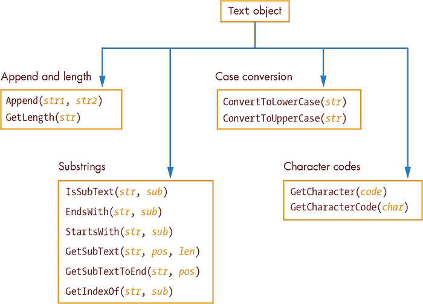
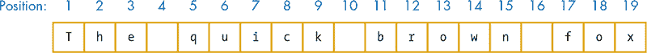
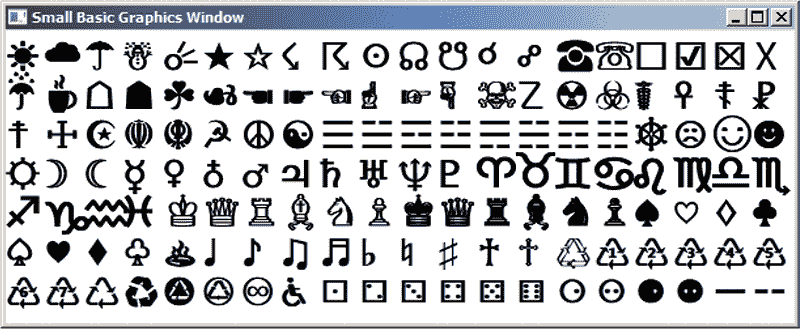
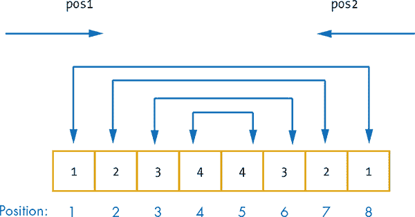
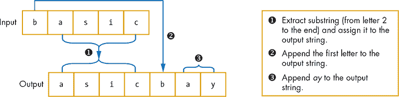
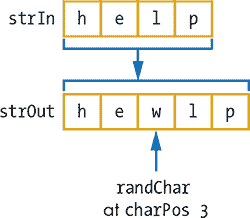
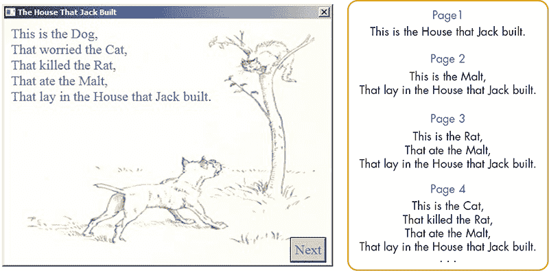
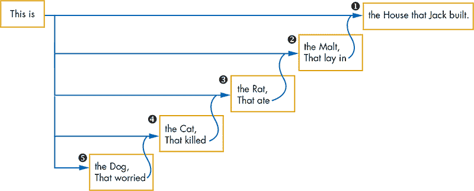
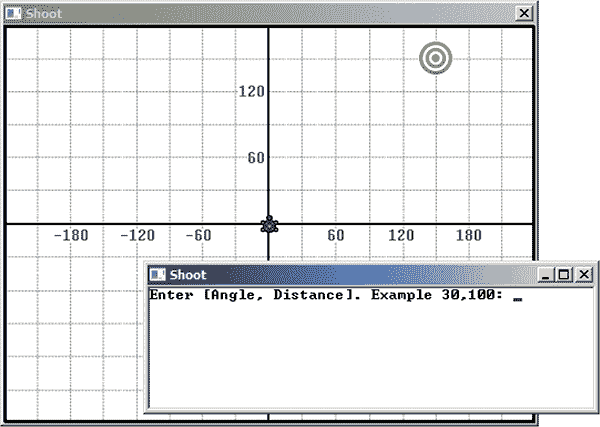

## 18

**高级文本魔法**


虽然蓝天和绿地的图片比一屏文字更让人赏心悦目，但许多实用的程序，如 Facebook、Twitter 和 Words with Friends，都是处理文本的。这就是为什么 Small Basic 提供了 `Text` 对象来处理文本的原因。在本章中，你将学习如何使用 `Text` 对象来查找字符串的长度、提取字符串的一小部分，并执行许多其他高级的字符串处理任务。你还将编写自己的字符串处理子程序，并将所学应用于创建一些有趣的应用程序，比如猪拉丁语翻译器和文字拼图游戏！

### 文本对象

你在本书中一直在处理字符串。为了回顾一下，*字符串* 是由字符组成的序列，这些字符被双引号包围，例如 `"stringY strinGy striNg strIng stRing"`。这些字符可以包括字母（大写和小写）、数字（0 到 9）和其他键盘上的符号（如 +、–、&、@ 等）。你可以在程序中使用字符串来存储姓名、地址、电话号码、书名、*星际迷航*剧集的名称等。`Text` 对象包含许多有用的方法来处理字符串。

图 18-1 显示了 `Text` 对象方法的完整列表。我们将这些方法分成四组，在接下来的章节中进行讨论。



*图 18-1：* `Text` *对象的方法*

#### *追加字符串并获取它们的长度*

结合字符串并查找它们的长度是编程中的常见任务。让我们来看一下 `Text` 对象如何帮助你完成这些任务。

##### 追加字符串

`Append()` 方法可以将两个字符串连接（或 *追加*）在一起，如以下示例所示：

```
str = Text.Append("He-", "Man")
TextWindow.WriteLine(str) ' Displays: He-Man
```

在本书的早些时候，你学习了如何使用 + 符号连接字符串。但当你处理的文本被 + 符号当作数字来处理时，`Append()` 方法就显得尤为有用，如以下示例所示：

```
res = Text.Append("1", "5")
TextWindow.WriteLine(res)       ' Output: 15 (1 followed by 5)
TextWindow.WriteLine("1" + "5") ' Output: 6
```

第一条语句将两个字符串（`"1"` 和 `"5"`）连接起来，并将结果赋值给变量 `res`（*result* 的缩写）。第二条语句的输出显示，字符串 `"5"` 被追加到了字符串 `"1"` 后面，得到一个新字符串 `"15"`。第三条语句显示，你不能使用 + 符号进行这种连接。+ 操作符将其两个操作数解释为数字（1 和 5），并将这两个数字相加，这就是为什么第三条语句显示 `6`。

在 Small Basic 中，使用 `Append()` 是连接数字的唯一方法。

##### 获取字符串的长度

字符串中的字符数量就是它的长度。要查找字符串的长度，你可以使用 `GetLength()` 方法，如以下示例所示：

```
1 res = Text.GetLength("")               ' res = 0 (empty string)
2 res = Text.GetLength("Careless Bears") ' res = 14 (the space counts!)
3 res = Text.GetLength(1023)             ' res = 4
4 res = Text.GetLength(-101.5)           ' res = 6
```

`GetLength()`将它的参数视为字符串，并返回该字符串中的字符数。第 1 行显示空字符串的长度为 0。第 2 行显示字符串`"Careless Bears"`的长度为 14，因为这个字符串包含 14 个字符（空格也算作字符）。第 3 行使用数字 1023 作为参数调用`GetLength()`。`GetLength()`将这个数字视为字符串（`"1023"`），并返回`4`，表示该字符串的长度。第 4 行的类似过程适用于数字–101.5，`GetLength()`返回`6`（包括四个数字、负号和小数点）。

**尝试一下 18-1**

编写一个程序，提示用户输入一个形容词。让程序通过在输入后面附加*ly*来显示相应的副词。例如，如果用户输入*mad*，程序将显示*madly*。这个程序能适用于所有形容词吗？（提示：考虑以*y*结尾的形容词，如*happy*，或以*ic*结尾的形容词，如*heroic*。）

#### *拆分字符串：子字符串*

就像你可以将字符串连接起来创建更长的字符串一样，你也可以将字符串分割成更小的字符串，这些被称为*子字符串*。子字符串只是一个较大字符串的一部分。`Text`对象有六个方法可以让你处理子字符串。让我们来看一下这些方法。

##### IsSubText() 方法

你可以使用`IsSubText()`来判断一个字符串是否是另一个字符串的一部分。这个方法有两个参数：你想要搜索的字符串和你想要查找的子字符串。它会返回`"True"`或`"False"`，取决于子字符串是否在源字符串中。以下是一些示例：

```
1 myString = "The quick brown fox"
2 res = Text.IsSubText(myString, "brown") ' res = "True"
3 res = Text.IsSubText(myString, "BROWN") ' res = "False"
4 res = Text.IsSubText(myString, "dog")   ' res = "False"
```

正如这些示例所示，`IsSubText()`在搜索子字符串时是区分大小写的。这就是为什么在第 3 行搜索`"BROWN"`返回`"False"`。

##### EndsWith() 方法

使用`EndsWith()`来判断一个字符串是否以给定的子字符串结束。以下是一些示例：

```
1 myString = "The quick brown fox"
2 res = Text.EndsWith(myString, "fox") ' res = "True"
3 res = Text.EndsWith(myString, "x")   ' res = "True"
4 res = Text.EndsWith(myString, "FOX") ' res = "False"
5 res = Text.EndsWith(myString, "dog") ' res = "False"
```

再次提醒，字符串的大小写很重要：在第 4 行搜索`"FOX"`返回`"False"`。

##### StartsWith() 方法

使用`StartsWith()`来判断一个字符串是否以给定的子字符串开始。以下是一些示例：

```
1 myString = "The quick brown fox"
2 res = Text.StartsWith(myString, "The") ' res = "True"
3 res = Text.StartsWith(myString, "T")   ' res = "True"
4 res = Text.StartsWith(myString, "the") ' res = "False"
```

同样，在第 4 行中搜索`"the"`返回的是`"False"`。

##### GetSubText() 方法

要从字符串中的任何位置提取文本，你可以使用`GetSubText()`。这个方法有三个参数：你要从中获取子字符串的源字符串、子字符串的起始位置以及你想要的子字符串的长度。要理解这个方法如何工作，请参见图 18-2。



*图 18-2：字符串中字符位置的示意图*

第一个字符的位置是 1，第二个字符的位置是 2，以此类推。现在考虑以下示例：

```
1 myString = "The quick brown fox"
2 res = Text.GetSubText(myString, 1, 3)  ' res = "The"
3 res = Text.GetSubText(myString, 0, 3)  ' res = ""
4 res = Text.GetSubText(myString, 17, 3) ' res = "fox"
5 res = Text.GetSubText(myString, 17, 4) ' res = "fox"
```

第 2 行获取从位置 1 开始，长度为 3 的子字符串，返回字符串`"The"`。第 3 行未能获取从位置 0 开始的子字符串，因为第一个有效位置是 1，而它返回一个空字符串。第 4 行获取从位置 17 开始的三字母子字符串，返回`"fox"`。第 5 行请求从位置 17 开始的长度为 4 的子字符串。因为该子字符串超出了字符串的末尾，长度被截短，方法返回`"fox"`，其长度为 3。

你可以在`For`循环中使用`GetSubText()`来访问字符串的每个字符。例如，以下代码将`strIn`的每个字符写在新的一行上。输入并运行这段代码，确保你理解它是如何工作的：

```
strIn = "Pirate squids hate hot dogs."
For N = 1 To Text.GetLength(strIn)  ' For each character
  ch = Text.GetSubText(strIn, N, 1) ' Gets the character at position N
  TextWindow.WriteLine(ch)          ' Displays it on a new line
EndFor
```

循环计数器`N`从 1 运行到字符串的末尾。每次迭代请求一个长度为 1（即一个字符）的子字符串，起始位置为`N`，并显示该字符。

##### GetSubTextToEnd() 方法

`GetSubTextToEnd()`方法与`GetSubText()`类似，不同之处在于它返回从某个位置到字符串结尾的子字符串。它接受两个参数：你希望从中提取子字符串的源字符串和子字符串的起始位置。这里有一些示例（请参考图 18-2 以获取上下文）：

```
1 myString = "The quick brown fox"
2 res = Text.GetSubTextToEnd(myString, 13) ' res = "own fox"
3 res = Text.GetSubTextToEnd(myString, 19) ' res = "x"
4 res = Text.GetSubTextToEnd(myString, 20) ' res = ""
```

第 2 行获取从位置 17 开始的子字符串，返回`"own fox"`。第 3 行获取从位置 19 开始的子字符串，返回`"x"`。第 4 行请求从位置 20 开始的子字符串。由于源字符串只有 19 个字符，该方法返回空字符串。

##### GetIndexOf() 方法

你将要传递给`GetIndexOf()`方法的是你希望搜索的子字符串，它会返回该子字符串在源文本中的索引位置。以下是一些示例：

```
1 myString = "The quick brown fox"
2 res = Text.GetIndexOf(myString, "The")   ' res = 1
3 res = Text.GetIndexOf(myString, "quick") ' res = 5
4 res = Text.GetIndexOf(myString, "QUICK") ' res = 0
5 res = Text.GetIndexOf(myString, "o")     ' res = 13
6 res = Text.GetIndexOf(myString, "dog")   ' res = 0
```

搜索是区分大小写的，因此第 4 行返回`0`，因为在源字符串中没有找到`"QUICK"`。第 5 行请求字母*o*的索引，但由于有两个`o`，它返回第一个找到的`o`的索引。最后一行返回`0`，因为它没有在源字符串中找到`"dog"`。

**动手试试 18-2**

一个名叫富兰克林·罗斯福的小男孩曾经把写给母亲的信签名倒着写：*Tlevesoor Nilknarf*。写一个程序，反向显示输入字符串的字符。（提示：从字符串的长度开始，循环计数直到 1，并使用`GetSubText()`提取每个字符。）

#### *改变大小写*

有时你可能想要将字符串显示为大写或小写字母。`ConvertToLowerCase()`和`ConvertToUpperCase()`方法可以帮助你做到这一点。运行清单 18-1 中的示例。

```
1 ' ChangeCase.sb
2 var1 = "Ewok"
3 lwrCase = Text.ConvertToLowerCase(var1)   ' lwrCase = "ewok"
4 TextWindow.WriteLine(lwrCase)             ' Displays: ewok
5 TextWindow.WriteLine(var1)                ' Displays: Ewok
6 uprCase = Text.ConvertToUpperCase(var1)   ' uprCase = "EWOK"
7 TextWindow.WriteLine(uprCase)             ' Displays: EWOK
8 TextWindow.WriteLine(var1)                ' Displays: Ewok
```

*清单 18-1：改变字符串的大小写*

第 3 行调用`ConvertToLowerCase()`方法返回小写字符串`"ewok"`，并在第 4 行显示。第 5 行的语句显示原始字符串没有受到小写转换的影响；调用`ConvertToLowerCase()`返回一个全新的小写字符字符串。第 6 行的`ConvertToUpperCase()`方法返回大写版本的`"EWOK"`，并在第 7 行显示。第 8 行也显示原始字符串未受转换的影响。

你可以使用这些方法来进行不区分大小写的字符串比较。例如，假设你的程序询问用户他们最喜欢的*史瑞克*角色。如果用户喜欢驴子，他们赢得 200 分；否则，他们赢得 100 分。用户可以输入`donkey`、`DONKEY`、`Donkey`、`DOnkey`，或任何其他大小写组合来回答问题。与其检查所有可能的组合，不如将用户的回答转换为大写（或小写），然后将结果与新的字符串`DONKEY`（或`donkey`，如果你使用小写的话）进行比较。在清单 18-2 中运行程序。

```
 1 ' StringMatch.sb
 2 While ("True")
 3   TextWindow.Write("Who's your favorite Shrek character? ")
 4   name = Text.ConvertToUpperCase(TextWindow.Read())
 5   If (name = "DONKEY") Then
 6     TextWindow.WriteLine("You won 200 ogre points!")
 7   Else
 8     TextWindow.WriteLine("You won 100 ogre points!")
 9   EndIf
10 EndWhile
```

*清单 18-2：不区分大小写的字符串匹配*

第 4 行的`Read()`方法读取用户输入的文本。然后，用户的文本被转换为大写，并将结果存储在`name`变量中。请注意，我们直接将`Read()`方法作为`ConvertToUpperCase()`的参数；这相当于以下两行代码：

```
name = TextWindow.Read()
name = Text.ConvertToUpperCase(name)
```

第 5 行的`If`语句将用户输入的内容转换为大写，并与字面字符串`"DONKEY"`进行比较，并相应地奖励用户。

这是一个输出示例：

```
Who's your favorite Shrek character? dOnkey
You won 200 ogre points!
```

**尝试一下 18-3**

编写一个程序，向用户提出一个是/否问题，例如“你能用风的所有颜色来画画吗？”创建一个程序，接受 *y*、*yes*、*n* 或 *no*，无论大小写，作为有效答案。如果答案无效，要求用户重新输入。

#### *Unicode 字符编码*

所有计算机数据（包括文本）都以*二进制*序列的 0 和 1 存储。例如，字母*A*的二进制表示是 01000001。字符与其二进制表示之间的映射关系称为*编码*。

*Unicode* 是一种通用编码方案，允许你对来自多种语言的超过一百万个字符进行编码。每个字符都会分配一个唯一的数字（称为*码点*）。例如，字符`A`的码点是 65，美元符号（`$`）的码点是 36。`GetCharacterCode()`方法返回字符的码点。但`GetCharacter()`方法正好相反；当你给它一个字符的码点时，它会返回相应的字符。

在清单 18-3 中运行该程序。

```
1 ' CharCode.sb
2 str = "ABab12"
3 For N = 1 To Text.GetLength(str)
4   ch = Text.GetSubText(str, N, 1)         ' Gets the Nth character
5   code = Text.GetCharacterCode(ch)        ' Gets its code point
6   TextWindow.WriteLine(ch + ": " + code)  ' Displays ch and its code point
7 EndFor
```

*清单 18-3：演示`GetCharacterCode()`方法*

第 2 行定义了一个包含六个字符的字符串。第 3 行启动了一个 `For` 循环，访问这些字符中的每一个；`GetLength()` 设置了循环的上限。每次循环都会从字符串中读取一个字符并将其保存在名为 `ch` 的变量中（第 4 行）。接着，循环获取该字符的 Unicode 代码点并将其保存在 `code` 变量中（第 5 行）。第 6 行显示该字符及其代码点。当你运行此程序时，你将看到以下输出：

```
A: 65
B: 66
a: 97
b: 98
1: 49
2: 50
```

##### 花式字符

让我们探索一些在英语中未使用的字符。清单 18-4 显示了一个简单的程序，它显示了 140 个 Unicode 字符的符号，从代码点为 9728 的字符开始。你可以更改这个数字以探索其他 Unicode 符号。

```
 1 ' UnicodeDemo.sb
 2 GraphicsWindow.BrushColor = "Black"
 3 GraphicsWindow.FontSize = 30  ' Makes the font larger
 4
 5 code = 9728           ' Code point for the first symbol
 6 xPos = 0              ' Horizontal position for drawing a symbol
 7 yPos = 0              ' Vertical position for drawing a symbol
 8 For row = 1 To 7      ' Draws 7 rows
 9   xPos = 0            ' For each new row, start at the left edge
10   For col = 1 To 20   ' 20 columns for each row
11     ch = Text.GetCharacter(code)              ' Gets a character
12     GraphicsWindow.DrawText(xPos, yPos, ch)   ' Draws it
13     code = code + 1                           ' Sets to next code point
14     xPos = xPos + 30                          ' Leaves a horizontal space
15   EndFor
16   yPos = yPos + 30                            ' Moves to the next row
17 EndFor
```

*清单 18-4：演示 Unicode 字符*

外部的 `For` 循环执行七次（第 8 行）。每次外部循环执行时，内部循环显示 20 个符号，这些符号之间相隔 30 像素（第 10–15 行）。绘制完整一行符号后，我们将垂直绘制位置下移 30 像素，以绘制下一行（第 16 行）。图 18-3 显示了该程序的输出。



*图 18-3：* UnicodeDemo.sb 的输出

##### 更多关于代码点的内容

小写字母的 Unicode 代码点是从 97（*a*）到 122（*z*）的连续整数。同样，大写字母的代码点范围从 65（*A*）到 90（*Z*）。小写字母 *a* 的代码点大于大写字母 *A* 的代码点，且 *a* 和 *A* 之间的代码点差（97 - 65 = 32）与 *b* 和 *B* 之间的差（98 - 66 = 32）相同，依此类推。当给定一个小写字母的代码点，我们用 `ch` 来表示，它对应的大写字母的代码点为 65 + (`ch` – 97)。这是公式：

```
code for uppercase ch = code(A) + (code for lowercase ch – code(a))
```

现在你知道字符串中的每个字符都有一个代码点，你可以对字符串执行许多有用的操作。以下示例展示了你可以做的操作。

##### 显示引号

假设你想在输出中显示字符串 `"Bazinga"`，并包含双引号。如果你写 `TextWindow.WriteLine("Bazinga")`，Small Basic 会显示 `Bazinga`，但不包括引号，因为引号用来标识字符串的开始和结束。然而，如果你写 `TextWindow.WriteLine(""Bazinga"")`，Small Basic 会返回语法错误。那么如何显示引号呢？通过使用引号的代码点，你可以将引号字符附加到字符串中，如下所示的代码片段所示：

```
QUO = Text.GetCharacter(34)                 ' Gets the double quotation mark
TextWindow.WriteLine(QUO + "Bazinga" + QUO) ' Output: "Bazinga"
```

第一个语句从其 Unicode 代码点（34）获取引号字符，并将其赋值给变量 `QUO`。第二个语句将字符串 `"Bazinga"` 插入到两个 `QUO` 字符之间，从而输出所需的结果。

##### 创建多行字符串

你可以通过将 *换行符* 字符（代码点 10）嵌入字符串中来创建多行字符串。输入以下代码片段作为示例：

```
LF = Text.GetCharacter(10)                     ' Code for line feed
TextWindow.WriteLine("Line1" + LF + "Line2")   ' Displays two lines
```

当你运行这段代码时，两个字符串 `"Line1"` 和 `"Line2"` 会显示在两行中。结果与使用以下两条语句时的输出完全相同：

```
TextWindow.WriteLine("Line1")
TextWindow.WriteLine("Line2")
```

通过你迄今为止获得的知识，你已经可以编写使用字符串进行各种复杂操作的完整程序了！

**实践操作 18-4**

以下程序显示英文字母。请解释该程序的工作原理。

```
For code = 65 To 90
  ch = Text.GetCharacter(code)
  TextWindow.WriteLine(ch)
EndFor
```

### 字符串的实际示例

早些时候，你学习了如何使用 `GetLength()` 获取字符串的长度，以及如何使用 `GetSubText()` 访问字符串中的单个字符。当你将这两个方法与 `For` 循环结合使用时，你可以计算特殊字符、检查多个字符，并进行其他几项有用的字符串操作。让我们来看一些示例！

#### *计算特殊字符*

清单 18-5 展示了一个计算字符串中元音字母数量的程序。它要求用户输入一个字符串，然后计算并显示该字符串中的元音字母数量。

```
 1 ' VowelCount.sb
 2 TextWindow.Write("Enter a sentence: ")  ' Prompts the user for text
 3 str = TextWindow.Read() ' Reads text entered by the user
 4
 5 count = 0               ' Sets vowel count to 0 (so far)
 6 For N = 1 To Text.GetLength(str)        ' Checks all characters
 7   ch = Text.GetSubText(str, N, 1)       ' Gets Nth character
 8   ch = Text.ConvertToUpperCase(ch)      ' Makes it uppercase
 9   If ((ch = "A") Or (ch = "E") Or (ch = "I") Or (ch = "O") Or (ch = "U")) Then
10     count = count + 1  ' If it finds a vowel, increments count
11   EndIf
12 EndFor
13 TextWindow.Write("Your sentence contains [") ' Shows result
14 TextWindow.WriteLine(count + "] vowels.")
```

*清单 18-5：计算字符串中元音字母的数量*

在获取用户输入（第 2–3 行）后，程序将 `count` 变量初始化为 0，因为到目前为止还没有找到任何元音字母（第 5 行）。然后，程序启动一个循环，逐一检查输入字符串中的字符（第 6 行）。循环计数器 `N` 指向字符串中的第 *N* 个字符。

第 7 行使用 `GetSubText()` 获取输入字符串的第 *N* 个字符，并将其赋值给变量 `ch`（字符的简称）。接着，代码将字符转换为大写字母（第 8 行），并将这个大写字母与元音字母进行比较（第 9 行）。如果字符是元音字母，`count` 的值就增加 1（第 10 行）。当循环结束时，程序会显示计算出的元音字母数量（第 13–14 行）。以下是该程序的示例输出：

```
Enter a sentence: Small Basic is fun
Your sentence contains [5] vowels.

Enter a sentence: Giants leave nasty diapers.
Your sentence contains [9] vowels.
```

**实践操作 18-5**

将清单 18-5 中的代码转换成一个两人游戏。第一个玩家输入一个单词，第二个玩家需要猜出单词中元音字母的数量。然后，玩家轮流进行。每次猜对，玩家得一分。游戏进行 10 轮后结束，并显示获胜者。

#### *回文数字检查器*

在这一节中，我们将编写一个程序，检查用户输入的整数是否为*回文*。回文是指正着读和反着读都一样的数字、单词或短语。例如，*1234321* 和 *1122332211* 都是回文。同样，*racecar*、*Hannah* 和 *Bob* 也是回文。

让我们看看在图 18-4 中显示的输入数字 `12344321`。



*图 18-4：使用两个变量检查一个数字是否是回文*

要检查这个数字是否是回文数，你需要比较第一个和第八个数字，第二个和第七个数字，第三个和第六个数字，依此类推。如果在比较中有任何两个数字不相等，则该数字不是回文数。如图所示，你可以通过使用两个变量（`pos1`和`pos2`）来访问你想要比较的数字，这两个变量分别朝相反的方向移动。第一个变量（`pos1`）从第一个数字开始并向前移动，第二个变量（`pos2`）从最后一个数字开始并向后移动。所需比较的次数最多为输入数字中数字个数的一半。在这个例子中，你最多需要进行四次比较，因为输入的数字有八个数字。如果输入的整数数字位数为奇数，则中间的数字无需比较，因为它不影响回文数的判断。

清单 18-6 展示了完整的程序。注释应该能帮助你理解程序是如何工作的。

```
 1 ' Palindrome.sb
 2 Again:
 3 TextWindow.WriteLine("")
 4 TextWindow.Write("Enter a number: ")
 5 ans = TextWindow.ReadNumber()          ' Saves user's input in ans
 6
 7 length = Text.GetLength(ans)           ' Number of digits of input number
 8 pos1 = 1                               ' Sets pos1 to read first digit
 9 pos2 = length                          ' Sets pos2 to read last digit
10 For N = 1 To (length / 2)              ' Performs (length/2) comparisons
11   ch1 = Text.GetSubText(ans, pos1, 1)  ' Reads digit at position pos1
12   ch2 = Text.GetSubText(ans, pos2, 1)  ' Reads digit at position pos2
13   If (ch1 <> ch2) Then                 ' If not equal, no need to continue
14     TextWindow.WriteLine(ans + " isn't a palindrome.")  ' Shows result
15     Goto Again
16   EndIf
17 EndFor
18
19 TextWindow.WriteLine(ans + " is a palindrome.")
20 Goto Again
```

*清单 18-6：测试用户输入的数字是否为回文数*

这是程序的一次示例运行：

```
Enter a number: 1234321
1234321 is a palindrome.

Enter a number: 12345678
12345678 isn't a palindrome.
```

**试试这个 18-6**

另一种创建清单 18-6 中程序的方法是反转输入字符串，然后将反转后的字符串与原始字符串进行比较。使用这种方法创建一个新的回文检查程序。

#### *猪拉丁语*

让我们教计算机一种语言游戏，叫做 *猪拉丁语*。创建猪拉丁语单词的规则很简单。要将一个单词转换成猪拉丁语，将第一个字母移到单词的末尾，并在后面加上字母 *ay*。所以，单词 *talk* 变成 *alktay*，*fun* 变成 *unfay*，以此类推。你能解密这一节的原始标题吗？

图 18-5 展示了将一个单词转换为猪拉丁语时使用的策略，使用的是单词 *basic*。



*图 18-5：将英文单词翻译成猪拉丁语*

你首先从第二个字符到末尾提取子字符串，并将其赋值给输出字符串。然后，你将输入字符串的第一个字母加到输出字符串中，后跟 *ay*。在清单 18-7 中输入代码以实现这些步骤。

```
 1 ' PigLatin.sb
 2 TextWindow.Title = "Pig Latin"
 3
 4 While ("True")
 5   TextWindow.Write("Enter a word: ")
 6   word = TextWindow.Read()
 7
 8   pigLatin = Text.GetSubTextToEnd(word, 2)          ' Gets characters 2 to end
 9   pigLatin = pigLatin + Text.GetSubText(word, 1, 1) ' Appends first character
10   pigLatin = pigLatin + "ay"                        ' Appends "ay"
11   TextWindow.WriteLine(pigLatin)                    ' Displays the output
12   TextWindow.WriteLine("")
13 EndWhile
```

*清单 18-7：将用户输入的单词转换为猪拉丁语*

该程序运行一个无限循环，允许用户尝试不同的单词（第 4 行）。在读取用户输入的单词后（第 6 行），我们提取从位置 2 开始的子字符串（即从第二个字符到输入单词的末尾），并将其赋值给`pigLatin`。然后我们从`word`中提取第一个字母并将其附加到`pigLatin`（第 9 行），接着加上`ay`（第 10 行）。我们显示猪拉丁语单词（第 11 行），然后是一个空行（第 12 行），并进入下一轮。*Ongratulationscay! Ouyay inishedfay ouryay rogrampay!*

**试试这个 18-7**

编写一个程序，接受一个猪拉丁语单词作为输入并显示其原始的英文单词。

#### *修正我的拼写*

现在，我们将开发一个游戏，展示拼错的单词并要求玩家输入正确的拼写。该游戏通过在一个英文单词中的随机位置插入一个随机字母来生成拼错的单词。拼错的简单单词可能有多个正确拼写。例如，如果游戏显示*mwall*，那么*mall*或*wall*都可以是正确的。为了简化游戏，我们将忽略这种可能性，并坚持使用某种特定拼写作为正确答案。

首先，我们从一个预定义的单词数组中选择一个要拼错的单词，并将选中的单词保存在名为`strIn`的变量中。然后，我们随机挑选一个字符`randChar`插入到`strIn`中。插入的位置`charPos`是`strIn`长度之间的一个随机数，范围从 1 到`strIn`的长度。图 18-6 展示了生成拼错单词`hewlp`的过程。



*图 18-6：展示生成拼错单词的过程*

我们首先提取从第 1 个字母到`charPos – 1`位置的子字符串并将其赋值给`strOut`（因为`charPos`是`3`，所以`strOut = "he"`）。然后我们将`randChar`追加到`strOut`（这使得`strOut = "hew"`）。接着，我们提取从`charPos`到末尾的子字符串（在这个例子中是`"lp"`），并将其追加到`strOut`（这使得`strOut = "hewlp"`）。清单 18-8 展示了完整的程序。确保从本章的文件夹中下载并打开*FixMySpelling.sb*，以查看我们为此程序编写的单词列表。

```
 1 ' FixMySpelling.sb
 2 words = "1=mountain;2=valley;...;22=animation;" ' See file for full list
 3
 4 While ("True")      ' Runs forever
 5   strIn = words[Math.GetRandomNumber(Array.GetItemCount(words))]
 6   randChar = Text.GetCharacter(96 + Math.GetRandomNumber(26))
 7   charPos = Math.GetRandomNumber(Text.GetLength(strIn))
 8
 9   strOut = Text.GetSubText(strIn, 1, charPos - 1)
10   strOut = strOut + randChar
11   strOut = strOut + Text.GetSubTextToEnd(strIn, charPos)
12
13   TextWindow.Write("Enter correct spelling for [" + strOut + "]: ")
14   ans = TextWindow.Read()
15   ans = Text.ConvertToLowerCase(ans)
16   If (ans = strIn) Then
17     TextWindow.WriteLine("Good Job!")
18   Else
19     TextWindow.WriteLine("Incorrect. It is " + strIn + ".")
20   EndIf
21   TextWindow.WriteLine("")
22 EndWhile
```

*清单 18-8：创建拼错单词并要求玩家修正它们*

`words`数组包含了这个游戏的单词（第 2 行）。程序从`words`数组中随机选取一个单词并将该单词保存为`strIn`（第 5 行）。注意我们如何使用数组项的数量来设置随机数的上限。接着，程序从字母表中随机选择一个字母`randChar`（第 6 行）。它通过获取 1 到 26 之间的随机数并加上 96 来实现；这样你会得到一个在 97（字母 *a* 的代码点）和 122（字母 *z* 的代码点）之间的随机数。然后，程序在`strIn`中选择一个随机位置`charPos`（第 7 行）：这是插入随机字符的位置。接着，程序创建拼错的单词并将其存储在`strOut`中（第 9 到 11 行）。

在第 13 行，程序要求玩家输入正确的拼写。它读取用户的回答（第 14 行）并将其转换为小写（第 15 行）。然后，它将答案与正确的单词进行比较（第 16 行）。如果玩家的答案与原始单词匹配，游戏会显示`Good Job!`（第 17 行）。否则，游戏会显示错误信息并显示正确的拼写（第 19 行）。无论哪种情况，程序最终会通过显示空行（第 21 行）结束，并且循环会重复，以便给用户一个新的拼写错误的单词。

下面是该程序的一个示例运行：

```
Enter correct spelling for [mairror]: miror
Incorrect. It is mirror.

Enter correct spelling for [inteorface]: interface
Good Job!
```

**动手试试 18-8**

更新程序 清单 18-8，使拼写错误的单词包含两个额外的随机字母，而不仅仅是一个随机字母。同时，向列表中添加更多的单词，以增加多样性。

#### *重新排列*

现在我们将创建一个字母打乱游戏。程序从一个英文单词开始，打乱字母，展示打乱后的单词给玩家，并要求他们猜测原始单词。

清单 18-9 显示了程序的主要部分。打开本章文件夹中的 *Unscramble.sb* 查看完整的单词列表。

```
 1 ' Unscramble.sb
 2 words = "1=mountain;2=valley;...;22=animation;" ' See file for full list
 3
 4 While ("True")
 5   strIn = words[Math.GetRandomNumber(Array.GetItemCount(words))]
 6   Scramble()  ' Returns strOut (a scrambled version of strIn)
 7
 8   TextWindow.Write("Unscramble [" + strOut + "]: ")
 9   ans = TextWindow.Read()
10   ans = Text.ConvertToLowerCase(ans)
11
12   If (ans = strIn) Then
13     TextWindow.WriteLine("Good Job!")
14   Else
15     TextWindow.WriteLine("No. It is " + strIn + ".")
16   EndIf
17   TextWindow.WriteLine("")
18 EndWhile
```

*清单 18-9：打乱单词并要求玩家重新排列*

`words` 数组包含了这个游戏的单词（第 2 行）。程序随机从这个数组中选择一个单词，并将其保存为 `strIn`（第 5 行）。然后，它调用 `Scramble()` 来生成 `strOut`，这是 `strIn` 的一个打乱版本（第 6 行）：稍后我们将添加 `Scramble()` 子程序。接下来，程序要求玩家将 `strOut` 重新排列（第 8 行）。它读取玩家的答案（第 9 行），并将其转换为小写（第 10 行）。然后，它将玩家的答案与正确的单词进行比较（第 12 行）。如果玩家的答案与原始单词匹配，游戏会显示 `Good Job!`（第 13 行）。否则，游戏会显示正确的单词（第 15 行）。无论哪种情况，程序最后通过显示一个空行来分隔回合（第 17 行），然后循环重复。

现在我们来看一下 `Scramble()` 子程序，它将字符串的字符打乱成一个随机顺序。调用者设置输入字符串（`strIn`），然后子程序返回一个新的字符串（`strOut`），它包含了被打乱的 `strIn` 字符。清单 18-10 显示了这个子程序。

```
 1 Sub Scramble                                ' Scramble subroutine
 2   len = Text.GetLength(strIn)
 3   For N = 1 To len                          ' Loops up to length of word
 4     char[N] = Text.GetSubText(strIn, N, 1)  ' Saves each letter into an array
 5   EndFor
 6
 7   strout = ""                               ' Empties the output string
 8   While (Text.GetLength(strout)< len)
 9     pos = Math.GetRandomNumber(len)         ' Picks where to place the letter
10     If (char[pos] <> "") Then
11       strout = strout + char[pos]           ' Adds in the extra letter
12       char[pos] = ""                        ' Empties the element
13     EndIf
14   EndWhile
15 EndSub
```

*清单 18-10：字母打乱子程序*

该子程序将输入字符串的长度保存到 `len`（第 2 行）。然后，它使用 `For` 循环将 `strIn` 的每个字母保存到一个名为 `char` 的数组中（第 3 至 5 行）。它清空输出字符串 `strOut`，并开始一个 `While` 循环按字母逐个构建 `strOut`（第 7 至 14 行）。`While` 循环一直运行，直到 `strOut` 的长度与 `strIn` 相同（这意味着我们已经添加了所有 `strIn` 的字母）。循环的每次迭代从 `char` 数组中随机选择一个元素（第 9 行）。如果该元素为空，我们会再次循环选择另一个。如果不是，我们将选择的字母附加到 `strOut`（第 11 行），并清空该元素以表示我们已经使用过它（防止再次使用），见第 12 行。*Ouy fishendi eth egma!*

这是该程序的一个示例运行：

```
Unscramble [lalvey]: lovely
No. It is valley.
```

**尝试一下 18-9**

尝试使用你在之前章节中学到的技能更新这个字母打乱游戏。让游戏持续进行 10 回合，然后显示用户的得分：在 10 个回合中，有多少个单词被正确地重新排列？接下来，添加 28 个新的单词进行打乱，这样你就有 50 个单词了。然后将游戏展示给你的朋友，看看谁能获得最高分！

### 押韵时间：杰克建造的房子

让我们以一个展示英国经典儿歌和累积故事的程序来结束这一章。在*累积故事*中，某个动作会随着故事的进展重复并逐步增加。图 18-7 展示了这个程序的进展；每当用户点击“下一页”按钮时，会出现更多的押韵行。



*图 18-7：杰克建造的房子押韵故事*

仔细检查这个押韵故事，你会注意到故事页面中有一些共同的字符串。研究图 18-8，了解如何通过在每个阶段附加短字符串来创建这个押韵故事。



*图 18-8：构成押韵故事的字符串*

例如，我们来跟踪这个图中的第三行。跟随第三个箭头，你将得到以下内容：

```
This is the Rat,
That ate
```

当你继续跟随第二个箭头时，你会得到以下内容：

```
This is the Rat,
That ate the Malt,
That lay in
```

而当你跟随第一个箭头时，你将看到完整的押韵故事，这将在第三页显示：

```
This is the Rat,
That ate the Malt,
That lay in the House that Jack built.
```

打开本章文件夹中的*JackHouse_Incomplete.sb*文件。该文件包含清单 18-11 中的主程序和一个`OnButtonClicked()`子程序的占位符，我们稍后会添加这个子程序。文件夹中还包含了 11 个背景图片（*Page1.png*、*Page2.png*、...、*Page11.png*），这些图片将展示在每一页的押韵故事中。

```
 1 ' JackHouse.sb
 2 GraphicsWindow.Title = "The House That Jack Built"
 3 GraphicsWindow.CanResize = "False"
 4 GraphicsWindow.Width = 480
 5 GraphicsWindow.Height = 360
 6 GraphicsWindow.FontBold = "False"
 7 GraphicsWindow.FontSize = 20
 8 GraphicsWindow.FontName = "Times New Roman"
 9
10 LF = Text.GetCharacter(10)  ' Code for line feed
11
12 rhyme[1] = "the Farmer who sowed the corn," + LF + "That fed "
13 rhyme[2] = "the Cock that crowed in the morn," + LF + "That waked "
14 rhyme[3] = "the Priest all shaven and shorn," + LF + "That married "
15 rhyme[4] = "the Man all tattered and torn," + LF + "That kissed "
16 rhyme[5] = "the Maiden all forlorn," + LF + "That milked "
17 rhyme[6] = "the Cow with the crumpled horn," + LF + "That tossed "
18 rhyme[7] = "the Dog," + LF + "That worried "
19 rhyme[8] = "the Cat," + LF + "That killed "
20 rhyme[9] = "the Rat," + LF + "That ate "
21 rhyme[10] = "the Malt," + LF + "That lay in "
22 rhyme[11] = "the House that Jack built."
23
24 Controls.AddButton("Next", 420, 320)
25 Controls.ButtonClicked = OnButtonClicked
26 nextLine = 11
27 OnButtonClicked()
```

*清单 18-11：杰克建造的房子程序的主要部分*

第 2 到第 8 行设置了`GraphicsWindow`对象。第 10 行定义了换行符（用于在字符串中附加新行）。第 12 到第 22 行定义了`rhyme`数组，该数组包含了这个押韵故事的字符串。注意这个数组的元素是如何与图 18-8 中的框框对应的。第 24 行创建了“下一页”按钮，第 25 行注册了`ButtonClicked`事件的处理程序。接着，`nextLine`变量被设置为 11，指向`rhyme`数组的第 11 个元素，这个元素是故事的第一页（第 26 行），然后调用`OnButtonClicked()`来展示押韵故事的第一页（第 27 行）。

现在我们将在清单 18-12 中添加`OnButtonClicked()`子程序。这个子程序会在用户点击“下一页”按钮时被调用。

```
 1 Sub OnButtonClicked
 2   img = Program.Directory + "\Page" + (12 - nextLine) + ".png"
 3   GraphicsWindow.DrawImage(img, 0, 0)
 4
 5   strOut = "This is "
 6   For N = nextLine To 11
 7     strOut = Text.Append(strOut, rhyme[N])
 8   EndFor
 9   GraphicsWindow.DrawText(10, 10, strOut)
10
11   nextLine = nextLine - 1
12   If (nextLine = 0) Then
13     nextLine = 11
14   EndIf
15 EndSub
```

*清单 18-12：`OnButtonClicked()`子程序*

第 2 行将`img`填充为当前韵文页面的图像名称。当`nextLine`为 11 时，我们显示*Page1.png*（即 12 减去 11）。当`nextLine`为 10 时，我们显示*Page2.png*（12 减去 10），当`nextLine`为 9 时，我们显示*Page3.png*（12 减去 9），依此类推。第 3 行在图形窗口中绘制图像。然后我们构建输出字符串（第 5 到第 8 行）。我们将`strOut`设置为`"This is "`（第 5 行），然后开始一个从`nextLine`到 11 的循环（第 6 到第 8 行）。当`nextLine`为 11 时，循环运行一次，并将`rhyme[11]`附加到`strOut`。当`nextLine`为 10 时，循环从 10 到 11 运行，并将`rhyme[10]`和`rhyme[11]`附加到`strOut`。类似地，当`nextLine`为 9 时，循环从 9 到 11 运行，并将`rhyme[9]`、`rhyme[10]`和`rhyme[11]`附加到`strOut`。

当循环结束时，`strOut`包含此时故事韵文的整个字符串。我们在第 9 行使用`DrawText()`来显示这个字符串。

然后我们将`nextLine`减 1，指向`rhyme`数组中的前一个元素（第 11 行）。如果`nextLine`变为 0（第 12 行），说明故事结束，我们将其重置为 11，以便重新开始（第 13 行）。因此，当用户在故事的最后一页点击“下一页”按钮时，程序会返回显示第一页。我们在故事还不无聊之前就完成了它！

**尝试一下 18-10**

使用你在《Jack 所建的房子》示例中学到的技巧，编写一个程序讲述你最喜欢的故事。如果没有最喜欢的故事？那就编一个关于外星老鼠被困在一座塔中，身边只有明胶、弹弓和高级化学实验套件的故事。解释一下这只老鼠是如何被困的，以及它是如何逃脱的！

### 编程挑战

如果你卡住了，可以查看* [`nostarch.com/smallbasic/`](http://nostarch.com/smallbasic/)*，那里有解决方案以及更多的资源和针对教师和学生的复习题。

1.  打开本章文件夹中的*Shoot_Incomplete.sb*文件。运行程序以查看以下界面。

    

    这个游戏的目标是估算乌龟与目标之间的转角和移动距离。当玩家输入他们的输入时，它会保存在一个名为`strIn`的变量中。你的任务是将`strIn`分成两部分：将逗号前的子字符串赋值给`angle`，将逗号后的子字符串赋值给`dist`。文件中的注释告诉你在哪里添加代码。如果你卡住了，可以查看*Shoot.sb*文件，其中包含完成的程序。

1.  打开本章文件夹中的*BinaryToDecimal_Incomplete.sb*文件。此程序将二进制数字转换为十进制数字，然后要求用户输入一个 8 位的二进制数。接着，它会在图形窗口中显示输入的数字，计算其十进制数，并显示转换结果，如下图所示。

    

    完成`GetInput()`子程序，提示用户输入一个 8 位二进制数。你需要验证用户输入的内容不能为空，并且最多只能包含八个二进制数字（即只能包含 1 和 0）。当用户输入有效时，将其保存在`strIn`中，并从子程序返回。文件中的注释会告诉你该怎么做。如果遇到困难，可以参考文件*BinaryToDecimal.sb*，其中包含已完成的代码。
