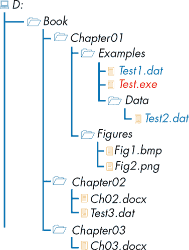
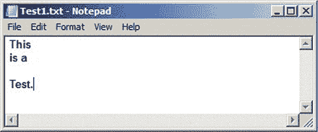
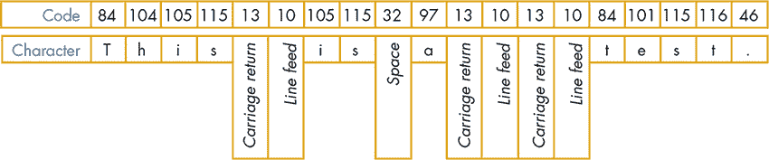
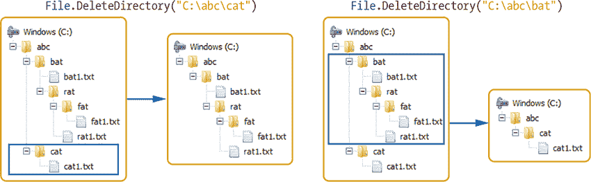
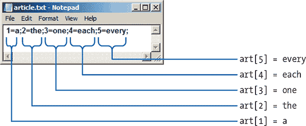
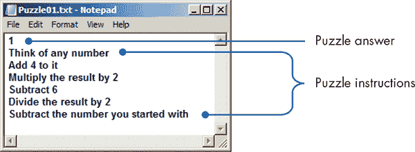
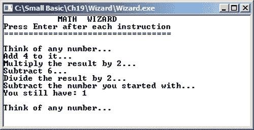

## 19

**接收文件输入与输出**


你在本书中写的程序到目前为止都是从键盘获取输入，并将输出显示在屏幕上。但是，如果你想创建一个虚拟电话簿并在程序中使用成千上万行数据呢？处理这么多数据可能会使你很难编写和维护程序。每次运行程序时，你都得输入每个名字和电话号码！

幸运的是，程序不仅可以从文件接收输入，还可以将输出发送到文件，这些文件都可以保存在你的计算机上。所以，所有的电话簿信息都可以整齐地保存在一个文件中，你只需输入一次数据。如今，许多程序都处理保存在文件中的数据。

在大多数编程语言中，处理文件是一个高级话题，但 Small Basic 使得文件处理变得非常简单。在本章中，你将学习 `File` 对象以及它是如何让文件处理变得轻松的！

### 文件的重要性

在你的程序中，你已经使用了变量和数组来存储数据。但是，存储在变量和数组中的数据是临时的：当程序结束或你关闭计算机时，所有数据都会丢失。当你再次运行程序时，它不会记得你上次输入的数据。如果你想永久存储程序中创建的数据，你需要将这些数据保存在文件中。存储在文件中的数据被称为*持久数据*，因为即使在你关闭计算机后它仍然保留。这就像松鼠储存橡果一样持久。

文件提供了一种方便的方式来处理大量数据。如果你的程序需要大量数据（比如你朋友的名字），你不可能每次都要求用户手动输入这些数据。很可能，他们会因此感到烦躁并停止使用程序。如果程序可以从文件中读取输入数据，用户就不需要手动输入数据，并且可能会多次运行程序。当程序使用文件时，用户甚至可以通过更改数据文件来定制应用程序。例如，如果你写了一个拼写游戏，它从文件中读取输入，用户可以通过更改输入文件来设置游戏的难度。例如，他们可以使用短单词来进行简单的游戏，用长单词来进行更困难的游戏。

从文件中获取数据叫做*读取文件*，程序读取的文件通常称为*输入文件*。类似地，将数据写入文件叫做*写入文件*，程序写入（或创建）的文件称为*输出文件*。将数据存储到文件（并从文件中读取数据）叫做*文件访问*。处理文件被称为*文件 I/O*，即输入/输出的缩写。

在我们开始在程序中处理文件之前，先来看看文件名以及文件是如何保存在计算机上的。

#### *文件命名*

当你创建一个新文件时，你为它起一个名字。你可以随便命名，比如*Fred*或*DontOpenMe*，但通常最好更具体一些，比如*myFriends*或*myLoveStory*。

Windows 操作系统对文件名大小写不敏感，因此在文件名中大写字母和小写字母没有区别，所以*myFile*、*Myfile*和*MYFILE*都会指向同一个文件。Windows 还支持由句点分隔的两部分文件名，例如*myFile.dat*。句点后面的部分（在这个例子中是*dat*）叫做*文件扩展名*。文件扩展名通常指示文件类型（例如照片或文本文件）。表 19-1 列出了常见的文件扩展名及其含义。文件扩展名通常由你使用的程序自动添加。例如，Small Basic IDE 会为源代码文件添加*.sb*扩展名。

**表 19-1：** 常见文件扩展名

| **扩展名** | **文件类型** | **用途** |
| --- | --- | --- |
| *.dat* | 一般数据文件 | 存储特定应用程序的信息 |
| *.exe* | 可执行文件 | 应用程序 |
| *.gif* | 图形交换格式 | 网站图片 |
| *.html* | 超文本标记语言网站文件 | 网页 |
| *.jpg* | 使用 JPEG 标准编码的图像 | 数码相机拍摄的照片 |
| *.mp3* | 采用 MPEG 层 3 音频格式编码的音乐 | 音频文件 |
| *.pdf* | 可携带文档格式文件用于阅读 | 电子书 |
| *.txt* | 一般文本文件 | 你可能在记事本中写的笔记 |

本章将使用文本（*.txt*）文件。

#### *文件组织*

想象一下，数十本书被组织在一个有多个架子的柜子里。每个架子都有不同的标签（例如科学、数学、小说、苏斯博士等），并且架子上放满了该类别的书籍。每个架子就像一个容器，将相关的书籍组合在一起。类似地，计算机上的文件存储在称为*目录*（或*文件夹*）的容器中。一个目录可以包含文件以及其他目录。一个目录中的目录被称为*子目录*。

*文件系统*是操作系统的一部分，负责组织计算机上的文件和目录，并提供管理它们的方法。当你从 Small Basic 程序调用与文件相关的方法（如创建、删除、读取或写入文件）时，操作系统的文件系统会处理所有底层细节，因此你不需要担心文件是存储在硬盘、闪存、CD、DVD 等介质上的。Small Basic 库与操作系统交互，以访问存储在各种介质上的文件，正如图 19-1 所示。


*图 19-1：文件系统如何让你访问不同介质上的文件*

文件系统具有树形结构，如图 19-2 所示。树的顶部称为*根目录*（在此图中是驱动器字母*D:*）。根目录下有许多文件和其他目录。这些目录中可能包含其他文件和子目录。

你可以通过从根目录沿着树形结构查找路径，直到到达目标文件，从而找到任何文件。你遵循的目录序列构成了该文件的*路径名*。例如，要查找图 19-2 中的最后一个文件，你需要首先在根目录*D:*中查找，然后进入*Book*目录，再进入*Chapter03*目录以定位该文件。如果你使用反斜杠（\）将每个目录分隔开来，那么路径名就是*D:\Book\Chapter03\Ch03.docx*。你可以通过路径名定位系统上的每一个文件。



*图 19-2：文件系统的树形结构*

要从一个 Small Basic 程序访问文件，你需要指定文件的路径名。要了解如何做，查看图 19-2 中的可执行文件*Test.exe*。当你运行这个文件时，运行中的程序知道它的*当前目录*（在这个例子中是*D:\Book\Chapter01\Examples*）。如果你希望*Test.exe*访问一个数据文件（比如*Test1.dat*或*Test2.dat*），你需要指定路径名——从根目录开始，程序需要导航的文件夹序列，直到到达目标文件。这也叫做*绝对路径*。图 19-2 中，*Test1.dat*的绝对路径是*D:\Book\Chapter01\Examples\Test1.dat*，而*Test2.dat*的绝对路径是*D:\Book\Chapter01\Examples\Data\Test2.dat*。

如果你编写的程序只有你自己使用，你可以将该程序需要的所有数据文件保存在任何你喜欢的地方，并使用在程序中硬编码的绝对路径访问这些文件。例如，你可以这样写：

```
str = File.ReadContents("D:\Book\Chapter01\Examples\Test1.dat")
```

但是，如果你将这个程序交给朋友试用，除非你的朋友拥有与您相同的文件树，否则程序会失败。一个更好的解决方案是在程序运行时动态构建所需的路径，如下所示：

```
path = Program.Directory
str = File.ReadContents(path + "\Test1.dat")
```

现在程序将会将*Test1.dat*添加到当前目录的末尾，这意味着它会在程序所在的同一文件夹中查找*Test1.dat*。然后，你的朋友只需要将*Test.exe*和*Test1.dat*放在同一个文件夹中；绝对路径就不再重要。你可以将程序的文件夹压缩成 ZIP 文件（右键点击文件夹，选择“发送到”，然后点击“压缩（zipped）文件夹”），然后将 ZIP 文件发送给你的朋友。你的朋友可以将 ZIP 文件中的文件保存到*C:\*、*D:\*、*C:\Temp*或任何他们选择的文件夹中，你的程序依然能按设计正常运行。

通过理解文件和路径名，你已经准备好学习`File`对象及其方法，如何从文件中读取数据、向文件写入数据，并执行其他文件管理操作。让我们开始学习单文件操作吧！

### 文件对象

Small Basic 的`File`对象包括所有处理文件数据读取和写入、删除和复制文件以及列出目录内容的方法。由于此对象支持许多方法，因此本节分为两部分。首先，我们将探索与读取和写入文件相关的方法。其次，我们将看看与文件管理相关的方法。

#### *文件输入输出方法*

`File`对象中最常用的方法是那些用于将数据写入文件和从文件中读取数据的方法。让我们详细了解这些方法。

首先，打开记事本并在编辑器中输入一些单词，使其看起来像图 19-3。确保在最后一行之后不要按 ENTER 键。



*图 19-3：一个示例文本文件*

将文件保存为*Test1.txt*，并放在*C:\Temp*目录下，这样它的绝对路径就是*C:\Temp\Test1.txt*。如果不想创建文件，你可以在本章的文件夹中找到它，直接将其复制到*C:\Temp*。

##### 从文件中读取

现在让我们尝试读取*Test1.txt*的内容。你可以使用`File`对象的`ReadContents()`方法一次性读取文件的全部内容。此方法打开文件，读取文件，并将其全部内容作为字符串返回。输入并运行 Listing 19-1 中的程序，查看该方法是如何工作的。

```
1 ' ReadContentsDemo.sb
2 path = "C:\Temp\Test1.txt"
3 str = File.ReadContents(path)
4 len = Text.GetLength(str)
5 TextWindow.WriteLine(str)
6 TextWindow.WriteLine("This file has " + len + " characters.")
```

*Listing 19-1：演示* `ReadContents()` *方法*

这是该程序的输出：

```
This
is a

Test.
This file has 19 characters.
```

第 2 行设置了文件的绝对路径。第 3 行读取文件的全部内容，并使用`ReadContents()`方法将返回的字符串保存到名为`str`的变量中。`ReadContents()`方法接受一个参数：要读取的文件的路径名。第 4 行获取字符串的长度，并将其保存到名为`len`的变量中。第 5 行和第 6 行显示了`str`和`len`变量的值。

但是，为什么`GetLength()`方法会输出字符串长度为 19，尽管字符串 `"This is a Test."` 只有 15 个字符呢？要理解发生了什么，你需要检查构成`str`变量的实际字符。记住，第十八章提到字符是以某种格式（如 ASCII 或 Unicode）编码的。将以下代码添加到 Listing 19-1 的末尾，再次运行程序：

```
For N = 1 To len
  ch = Text.GetSubText(str, N, 1)   ' Gets one character
  code = Text.GetCharacterCode(ch)  ' Gets the code for this character
  TextWindow.WriteLine(code)        ' Displays it
EndFor
```

这段代码显示了`str`变量包含 19 个字符。图 19-4 详细解释了程序的工作原理。



*图 19-4：在 Listing 19-1 中的 `str` 变量的 19 个字符*

记事本插入了两个特殊字符（称为*回车符*和*换行符*，它们的 ASCII 码分别是 13 和 10）来标记每行的结束。可以将*换行符*（或行尾标记）看作是按下键盘上的 ENTER 键时产生的字符对。没有这些字符，文件中的所有行会连在一起，成为一长行。换行符是*控制字符*；它们只控制光标在屏幕或打印机上的位置。

`ReadContents()` 方法将文件的所有内容作为一个字符串返回，包括文件中各行之间的换行符。

##### 写入文件

`WriteContents()` 方法让你将程序中字符串的内容保存到你选择的文件中。如果你想创建多行文本，你需要手动插入换行符。例如，让我们编写一个程序，从键盘读取文本输入并将其写回到文件。该程序在 清单 19-2 中显示。

```
 1 ' WriteContentsDemo.sb
 2 CR = Text.GetCharacter(13)                 ' Code for carriage return
 3 LF = Text.GetCharacter(10)                 ' Code for line feed
 4 outFile = "C:\Temp\Out.txt"                ' Absolute path of output file
 5
 6 strOut = ""                                ' Text to be written to file
 7 strIn = ""                                 ' One line (read from the user)
 8 While(strIn <> "exit")                     ' Until user enters exit
 9   TextWindow.Write("Data (exit to end): ") ' Prompts for text
10   strIn = TextWindow.Read()                ' Reads line
11   If (strIn <> "exit") Then                ' If user didn't enter exit
12     strOut = strOut + strIn + CR + LF      ' Appends text to strOut
13   EndIf
14 EndWhile
15
16 File.WriteContents(outFile, strOut)        ' Writes strOut to file
```

*清单 19-2：演示* `WriteContents()` *方法*

这是该程序的一个示例运行，显示了用户输入：

```
Data (exit to end): If Peter Piper picked a peck of pickled peppers,
Data (exit to end): Where's the peck of pickled peppers? I'm hungry.
Data (exit to end): exit
```

现在，在记事本中打开输出文件 *C:\Temp\Out.txt* 并检查其内容。该文件包含了用户在文本窗口中输入的内容。很酷吧？你在没有使用记事本的情况下就写下了这些文字！

程序的工作方式如下。我们在第 2 到第 3 行定义回车符和换行符，并在第 4 行定义输出文件的路径。接下来我们开始一个循环来获取用户的文本（第 8 到第 14 行）。在每次循环迭代中，我们提示用户输入他们想要的任何文本（第 9 行），并将输入的文本读取到名为 `strIn` 的变量中（第 10 行）。如果用户输入的文本不是 `exit`（第 11 行），我们将该文本以及回车符和换行符附加到 `strOut` 字符串中（第 12 行）。当用户输入 `exit` 时，循环结束，我们调用 `WriteContents()` 将 `strOut` 写入输出文件（第 16 行）。如果文件不存在，`WriteContents()` 会自动创建它。如果文件已存在，`WriteContents()` 会用 `strOut` 中的内容覆盖文件的原有内容。

**尝试一下 19-1**

编写一个程序，读取输入文本文件，将文本转换为小写字母，然后将结果保存到新的输出文件中。

##### 检查错误

与处理用户输入时一样，你无法控制用户在你的程序读取的文件中保存的内容。由于人为错误，文件中的数据有时可能是错误的。许多事情可能出错（如你稍后将看到的），因此你的程序需要准备好处理这些错误。

幸运的是，Small Basic 总是做好了准备！调用 `WriteContents()` 会自动返回 `"SUCCESS"` 或 `"FAILED"`，取决于操作是否成功。一个写得好的程序会检查返回的字符串，并在失败时采取相应的措施。让我们更新 清单 19-2，检查 `WriteContents()` 的返回值。将第 16 行的语句替换为 清单 19-3 中的代码。

```
1 result = File.WriteContents(outFile, strOut) ' Writes strOut to file
2 If (result = "SUCCESS") Then
3   TextWindow.WriteLine("Output saved to: " + outFile)
4 Else
5   TextWindow.WriteLine("Failed to write to: " + outFile)
6   TextWindow.WriteLine(File.LastError)
7 EndIf
```

*清单 19-3：检查* `WriteContents()` *的返回值*

首先，我们将 `WriteContents()` 的返回值保存在名为 `result` 的变量中（第 1 行），然后检查该方法的返回值。如果方法成功（第 2 行），我们会通知用户输出已成功保存（第 3 行）。如果操作失败（第 4 行），我们会告诉用户程序未能写入输出文件（第 5 行），并使用 `File` 对象的 `LastError` 属性显示失败的原因（第 6 行）。如果写入文件失败，`WriteContents()` 会自动更新该属性。

在编写代码处理失败情况后，我们需要通过故意使其失败来测试代码。以下是一些可能导致 `WriteContents()` 失败的情况：

1.  输出文件的路径不存在。

1.  输出文件已经在另一个程序中打开。

1.  没有足够的空间保存文件。

让我们尝试第一个可能性，看看会发生什么。

##### 路径不存在

运行 Listing 19-4 中的简短程序。

```
1 ' BadPath.sb
2 path = "C:\Temp\Folder1\Out.txt"
3 res = File.WriteContents(path, "Hello")
4 TextWindow.WriteLine(res + ": " + File.LastError)
```

*Listing 19-4：路径不存在时写入文件*

你应该看到以下输出：

```
FAILED: Could not find a part of the path 'C:\Temp\Folder1\Out.txt'.
```

程序尝试将字符串 `"Hello"` 写入输出文件（第 2–3 行）。目录 *Temp* 存在，但子目录 *Folder1* 不存在，因此 `WriteContents()` 失败。

##### 向文件追加内容

`AppendContents()` 方法打开指定的文件，并将数据添加到文件末尾，而不覆盖原有内容。`AppendContents()` 接受两个参数：输出文件的路径名和你希望添加到文件末尾的字符串。如果操作成功，方法返回 `"SUCCESS"`；否则，返回 `"FAILED"`。如果你传递给 `AppendContents()` 的文件不存在，它会为你创建该文件，并将字符串写入其中。如果文件已存在，字符串将被追加到文件末尾。

为了展示 `AppendContents()` 方法的使用，假设你需要维护一个记录程序中动作、错误和其他事件的日志文件。为了简化程序，我们仅记录程序执行的时间。每次程序运行时，你都会向日志文件中添加一条记录，包括日期和时间。完整的程序在 Listing 19-5 中展示。

```
 1 ' AppendContentsDemo.sb
 2 outFile = Program.Directory + "\Log.txt"
 3
 4 strLog = Clock.WeekDay + ", " + Clock.Date + ", " + Clock.Time
 5 result = File.AppendContents(outFile, strLog)
 6 If (result = "FAILED") Then
 7   TextWindow.WriteLine("Failed to write to: " + outFile)
 8   TextWindow.WriteLine(File.LastError)
 9 EndIf
10
11 TextWindow.WriteLine("Thank you for using this program. And for using
   deodorant.")
```

*Listing 19-5：演示* `AppendContents()` *方法*

当你运行这个程序时，它会创建一个包含当前星期几、日期和时间的日志字符串（第 4 行），并将这个字符串追加到名为 *Log.txt* 的日志文件末尾，该文件位于程序的目录中（第 5 行）。如果写入文件失败，程序会显示一条错误信息，解释失败的原因（第 7–8 行）。然后，程序会显示一条消息（第 11 行）并结束。

每次运行此程序时，都会向 *Log.txt* 文件末尾添加一行。以下是运行程序三次后的 *Log.txt* 输出：

```
Sunday, 7/19/2015, 12:40:39 PM
Sunday, 7/19/2015, 12:43:21 PM
Sunday, 7/19/2015, 12:47:25 PM
```

##### ReadLine(), WriteLine(), 和 InsertLine()

`ReadContents()` 和 `WriteContents()` 方法允许你一次性读取和写入文件的全部内容。有时这正是你需要的，但在其他情况下，一次读取或写入一行可能更合适。

`File` 对象提供了 `ReadLine()` 方法，用于从文件中读取一行文本。一行文本由一串字符组成，末尾带有回车符和换行符。`ReadLine()` 会读取该行所有文本，直到（但不包括）回车符。该方法接受两个参数：文件路径和要读取的行号。文件的第一行是第 1 行，第二行是第 2 行，以此类推。如果文件包含指定的行号，方法将返回该行的文本；否则，返回空字符串。

`File` 对象还提供了 `WriteLine()` 方法，用于将一行文本输出到文件。该方法接受三个参数：文件路径、要写入文本的行号以及要写入的文本。使用该方法时，需注意以下几点：

1.  如果文件不存在，`WriteLine()` 会创建该文件。

1.  如果文件包含指定的行号，`WriteLine()` 会覆盖该行。

1.  如果指定的行号大于文件中的行数，指定的文本将被附加到文件末尾。例如，如果文件包含三行，而你要求 `WriteLine()` 在第 100 行写入新文本，指定的文本将写入第 4 行。

1.  `WriteLine()` 会自动在传入的文本末尾写入回车符和换行符。这意味着你不需要手动在字符串中追加这些字符。

1.  如果操作成功，`WriteLine()` 返回 `"SUCCESS"`；否则，返回 `"FAILED"`。

除了 `ReadLine()` 和 `WriteLine()`，`File` 对象还提供了 `InsertLine()` 方法，允许你在指定的行号插入一行文本。与 `WriteLine()` 方法类似，`InsertLine()` 方法接受三个参数：文件路径、要插入新文本的行号以及要插入的文本。`InsertLine()` 不会覆盖指定行的现有内容。如果操作成功，`InsertLine()` 返回 `"SUCCESS"`；否则，返回 `"FAILED"`。

举个例子，我们可以写一个简单的程序，用用户的名字和姓氏生成登录名。该程序会读取一个输入文件，文件中包含用户的名字和姓氏，并创建一个包含这些用户登录名的输出文件。用户的登录名由名字的首字母和姓氏中的最多五个字符组成。例如，如果用户的名字是 Jack Skellington，他的登录名是 *jskell*。如果用户的名字是 Stan Lee（姓氏为三个字母），他的登录名将是 *slee*。完整的程序请参考 Listing 19-6。

```
 1 ' LoginName.sb
 2 inFile = Program.Directory + "\Users.txt"
 3 outFile = Program.Directory + "\LoginNames.txt"
 4
 5 N = 1             ' Tracks the line number
 6 While (N > 0)     ' We'll set N = 0 when we detect end of file
 7   strLine = File.ReadLine(inFile, N)      ' Reads the Nth line
 8   If (strLine = "") Then                  ' If the string's empty
 9     N = 0                                 ' Exits the While loop
10   Else                                    ' We have an entry
11     idx = Text.GetIndexOf(strLine, " ")   ' Finds space in strLine
12     firstChar = Text.GetSubText(strLine, 1, 1)
13     lastName = Text.GetSubText(strLine, idx + 1, 5)
14     loginName = firstChar + lastName
15     loginName = Text.ConvertToLowerCase(loginName)
16     File.WriteLine(outFile, N, loginName) ' Saves to a file
17     N = N + 1                             ' Gets ready for the next line
18   EndIf
19 EndWhile
```

*清单 19-6：从名字和姓氏创建登录名*

我们首先给出输入文件和输出文件的路径（第 2-3 行）。然后开始一个循环，每次读取输入文件的一行（第 6-19 行）。读取一行后（第 7 行），我们检查该行是否为空，如果是（第 8 行），则将`N`设为 0 以结束循环（第 9 行）。否则，我们处理从输入文件读取的用户姓名，以创建小写的登录名（第 11-15 行）。首先，我们找到名字和姓氏之间的空格（第 11 行）。接着，我们获取名字的第一个字母（第 12 行）和姓氏的前五个字母（第 13 行），将它们结合起来创建登录名（第 14 行），并将登录名转换为小写（第 15 行）。然后我们将登录名写入输出文件（第 16 行），并将`N`加 1 以读取输入文件中的下一行（第 17 行）。

为了保持代码简洁，我们没有添加错误检查代码。我们还假设输入文件的格式正确：每行包含用户的名字和姓氏，二者之间由一个空格分隔。表 19-2 展示了该程序的一个输入文件示例及其输出文件。

**表 19-2：** 创建登录名

| **用户姓名** | **登录名** |
| --- | --- |
| Tina Fey | *tfey* |
| Jimmy Fallon | *jfallo* |
| David Letterman | *dlette* |
| Jay Leno | *jleno* |
| Amy Poehler | *apoehl* |

**动手试一试 19-2**

编写一个程序，读取一个输入文件并统计其中的行数、字符数和空格数。

#### *文件管理*

除了让你执行文件 I/O 的方法外，`File`对象还提供了几个与文件和目录管理相关的方法。使用这些方法，你可以复制和删除文件，创建和删除目录，并从程序中列出文件和目录。

##### 复制和删除文件

你可以使用 `CopyFile()` 方法创建一个现有文件的副本。此方法将源文件和目标文件的路径作为参数传递。源文件不会受到此操作的影响。如果操作成功，方法将返回 `"SUCCESS"`。否则，它将返回 `"FAILED"`。

如果目标路径指向一个不存在的位置，该方法会尝试自动创建该位置。例如，查看以下代码：

```
srcPath = "C:\Temp\Test1.txt"              ' Path of the source file
dstPath = "C:\Temp\Temp1\Temp2\Test1.txt"  ' Path of the destination file
File.CopyFile(srcPath, dstPath)
```

如果子文件夹*Temp*、*Temp1* 和 *Temp2* 不存在，`CopyFile()`会尝试从根目录开始创建目标路径中的所有目录。当你运行这段代码时，你将有两个 *Test1.txt* 文件的副本：一个是原始源文件，另一个是位于 *C:\Temp\Temp1\Temp2* 下的副本。

**警告**

*如果目标路径指向一个已存在的文件，该文件将被覆盖。所以使用* `CopyFile()` *方法时要小心，因为你可能会覆盖某些文件！*

如果你想删除文件，请使用 `DeleteFile()` 方法。该方法接收一个参数：你想删除的文件路径。如果操作成功，方法返回 `"SUCCESS"`。否则，返回 `"FAILED"`。

**警告**

*被删除的文件不会进入回收站；相反，它会被完全从系统中删除。所以在使用* `DeleteFile()` *方法时一定要格外小心！*

使用 `CopyFile()` 和 `DeleteFile()` 方法，你可以创建自己的子程序来移动和重命名文件。要将文件移动到新位置，先将文件复制到新位置，然后删除原始文件。要重命名文件，先复制文件，给副本起个新名字，然后删除原始文件。

##### 创建和删除目录

你可以轻松地创建或删除目录。`CreateDirectory()` 方法接收一个参数：你想创建的目录路径。如果目录不存在，方法会尝试创建路径中的所有目录，从根目录开始。如果操作成功，方法返回 `"SUCCESS"`。否则，返回 `"FAILED"`。以下是一个示例：

```
File.CreateDirectory("C:\Temp\Temp1\Temp2")
```

如果目录 *C:\Temp*、*C:\Temp\Temp1* 和 *C:\Temp\Temp1\Temp2* 不存在，`CreateDirectory()` 会创建它们。如果目录路径已经存在，函数不会做任何事情，直接返回 `"SUCCESS"`。

`DeleteDirectory()` 方法也接收一个参数：你想删除的目录路径。路径下的所有文件和文件夹都会被删除。如果操作成功，方法返回 `"SUCCESS"`。否则，返回 `"FAILED"`。图 19-5 显示了 `DeleteDirectory()` 的示例。



*图 19-5：演示* `DeleteDirectory()` *方法*

**警告**

*当你调用* `DeleteDirectory()`，*路径下的所有文件和文件夹都会被删除。所以请确保你没有不想删除的文件！*

##### 列出文件和目录

`File` 对象包括 `GetFiles()` 方法，允许你列出目录中的所有文件。该方法以目标目录的路径作为参数。示例代码在示例 19-7 中展示了如何使用此方法。

```
1 ' GetFilesDemo.sb
2 path = "D:\Temp"
3 fileArray = File.GetFiles(path)
4 count = Array.GetItemCount(fileArray)
5 TextWindow.WriteLine(path + " contains " + count + " files:")
6 For N = 1 To count
7   TextWindow.WriteLine(" " + fileArray[N])
8 EndFor
```

*示例 19-7：演示* `GetFiles()` *方法*

运行该程序后的输出如下（将第 2 行中的 `path` 变量更改为你计算机上的一个目录）：

```
D:\Temp contains 3 files:
  D:\Temp\Fig01.bmp
  D:\Temp\keys.txt
  D:\Temp\Test.sb
```

我们首先指定要列出的目录路径（第 2 行）。接下来，我们调用 `GetFiles()` 方法，并传入所需的路径（第 3 行）。该方法会创建一个包含目录中所有文件路径的数组；我们将返回数组的标识符保存在 `fileArray` 中。然后，我们调用 `GetItemCount()` 来查找返回数组中的元素数量（第 4 行），并使用 `For` 循环来显示它的元素（第 6–8 行）。

**注意**

*如果* `GetFiles()` *失败，则* `fileArray` *存储字符串* `"FAILED"`*。在这种情况下，调用* `Array.GetItemCount(fileArray)` *将返回* `0`*。因此，你可能不需要对* `GetFiles()` *的返回值执行额外的检查。

`GetDirectories()` 方法允许你列出给定目录中的所有子目录。列表 19-8 展示了该方法的一个示例。

```
1 ' GetDirectoriesDemo.sb
2 path = "D:\Temp"
3 dirArray = File.GetDirectories(path)
4 count = Array.GetItemCount(dirArray)
5 TextWindow.WriteLine(path + " contains " + count + " directories:")
6 For N = 1 To count                        ' Displays the array's elements
7   TextWindow.WriteLine(" " + dirArray[N])
8 EndFor
```

*列表 19-8：演示* `GetDirectories()` *方法*

这是运行该程序后的输出：

```
D:\Temp contains 3 directories:
  D:\Temp\Chapter01
  D:\Temp\Chapter02
  D:\Temp\Chapter03
```

但是你的输出可能看起来不同，这取决于你的*Temp*目录的内容。这个程序类似于列表 19-7。我们首先存储我们感兴趣的路径（第 2 行）。接下来，我们用该路径调用`GetDirectories()`（第 3 行）。这个方法创建一个包含指定路径下所有目录路径名的数组；我们将返回数组的标识符保存在`dirArray`中。然后，我们调用`GetItemCount()`来找出返回数组中的元素数量（第 4 行），并使用`For`循环来显示其元素（第 6 到第 8 行）。试着修改第 2 行，访问不同的目录。

到目前为止，我们已经涵盖了关于`File`对象的所有内容。让我们将这些新获得的知识付诸实践，创建一些有趣的应用程序！

### 实用程序

我们将展示两个程序，旨在突出文件 I/O 的不同方面，并为你提供一些可以应用于自己创作的想法和新技术。

#### *诗人*

在这个示例中，我们将修改我们在第十六章创建的诗人程序，使其从文件中读取输入，而不是将单词列表硬编码到程序中。通过这样做，你的程序将变得更加简洁和强大，而且添加单词也会变得更加容易！

该程序使用五个输入文件：*article.txt*、*adjective.txt*、*noun.txt*、*verb.txt* 和 *preposition.txt*。*article.txt* 文件包含冠词和限定词的列表；*adjective.txt* 文件包含形容词的列表，依此类推。为了利用 Small Basic 处理数组的方式，每个文件都经过格式化，便于在程序中读取到数组中。

看看这个语句：

```
art = File.ReadContents("article.txt")
```

我们将*article.txt*文件的内容自动加载到名为`art`的数组中，该数组包含图 19-6 中显示的五个元素。



*图 19-6：将* article.txt *文件的内容读取到名为* `art` *的数组中*

打开本章文件夹中的 *Poet_Incomplete.sb* 文件，该文件还包含背景图像和我们需要的五个输入文件。该文件中有一个空的占位符，用于存放`CreateLists()`子例程，现在你需要添加它。这个子例程显示在列表 19-9 中。

```
1 Sub CreateLists
2   article = File.ReadContents(path + "\article.txt")
3   adjective = File.ReadContents(path + "\adjective.txt")
4   noun = File.ReadContents(path + "\noun.txt")
5   verb = File.ReadContents(path + "\verb.txt")
6   prepos = File.ReadContents(path + "\preposition.txt")
7 EndSub
```

*列表 19-9：* `CreateLists()` *子例程*

运行此程序，它应该与之前的程序相同，但有一个优势：用户现在可以更改输入文件，创建自己的自定义诗歌。

#### *数学奇才*

在这个例子中，我们将创建一个程序，主角是一个似乎对数学了解很多的巫师。这个巫师不是梅林、甘道夫或哈利·波特：欢迎来到数学巫师的世界！巫师首先要求用户想一个*秘密*数字。接着，他请求用户对这个数字进行一些数学操作（例如将数字翻倍、减去 2、将结果除以 10 等等）。最后，巫师利用他的魔法力量告诉用户经过这些操作后得到的数字（尽管他并不知道用户的秘密数字！）

程序的思路非常简单。我们将每个数学谜题保存为一个文本文件，文件格式如 图 19-7 所示。第一行包含谜题的答案，剩下的行包含巫师要求用户执行的指令。该程序包含 11 个谜题，分别保存在 *Puzzle01.txt*、*Puzzle02.txt*、*...* 和 *Puzzle11.txt* 中。你可以通过创建更多的谜题文件来添加新的谜题（遵循 图 19-7 所示的格式）。



*图 19-7：谜题文件的格式*

开发此程序的策略概述如下：

1.  当程序启动时，我们将列出程序目录中的文件，以获取谜题文件的路径名。

1.  对于每一轮程序，我们将选择一个可用的谜题。

1.  我们读取选定谜题文件的第一行，并将其解释为谜题的答案。其余的行代表巫师展示的指令。

1.  巫师一一展示谜题的说明，直到程序遇到空行。每个指令后，巫师要求用户按 ENTER 键。

1.  巫师展示谜题的答案。

打开本章文件夹中的 *Wizard_Incomplete.sb* 文件。此文件包含程序的主要代码，如 清单 19-10 所示，并且为你将要添加的 `DoPuzzle()` 子程序预留了空白占位符。该文件夹还包含 11 个预制谜题的文本文件。

```
 1 ' Wizard_Incomplete.sb
 2 TextWindow.Title = "MATH WIZARD"
 3 TextWindow.WriteLine("========== MATH WIZARD ==========")
 4 TextWindow.WriteLine("Press Enter after each instruction")
 5 TextWindow.WriteLine("==================================")
 6 TextWindow.WriteLine("")
 7
 8 puzzle = File.GetFiles(Program.Directory) ' Stores filenames into an array
 9
10 For P = 1 To Array.GetItemCount(puzzle)
11   path = puzzle[P]                        ' File in the app's directory
12   If (Text.EndsWith(path, ".txt")= "True") Then
13     DoPuzzle()
14   EndIf
15 EndFor
16 TextWindow.WriteLine("The game was won, the math was fun, and the magic is
   done!")
17 TextWindow.WriteLine("There is one Math Wizard to rule them all! Bye!")
```

*清单 19-10：数学巫师程序的主要代码*

在显示程序的标题和说明（第 2–6 行）后，我们调用 `GetFiles()` 获取程序目录中所有文件的列表，并将返回的数组标识符保存在 `puzzle` 变量中（第 8 行）。接着，我们开始一个循环来处理找到的文件（第 10–15 行）。在每次迭代中，我们从 `puzzle` 数组中获取一个路径名（第 11 行），并检查它是否具有 *.txt* 扩展名（第 12 行）。如果文件具有 *.txt* 扩展名（即它包含一个谜题），我们调用 `DoPuzzle()` 将该谜题展示给用户（第 13 行）。程序以数学巫师的一条消息结束（第 16–17 行）。

将 清单 19-11 中所示的 `DoPuzzle()` 子程序添加到 *Wizard_Incomplete.sb* 程序的底部。

```
 1 Sub DoPuzzle
 2   puzzleAns = File.ReadLine(path, 1)   ' Reads answer from first line
 3   N = 2                                ' Starts from second line
 4   line = "?"                           ' To enter the loop
 5   While (line <> "")                   ' Loops as long as we have instructions
 6     line = File.ReadLine(path, N)      ' Reads the Nth line
 7     If (line <> "") Then               ' If we have an instruction
 8       TextWindow.Write(line + "... ")  ' Writes instruction
 9       TextWindow.PauseWithoutMessage() ' Waits for user to press a key
10       TextWindow.WriteLine("")
11       N = N + 1                        ' Prepares to read next line
12     EndIf
13   EndWhile
14   TextWindow.WriteLine("You still have: " + puzzleAns)
15   TextWindow.WriteLine("")
16 EndSub
```

*清单 19-11：* `DoPuzzle()` *子程序*

我们从文件中读取第一行并将其保存在`puzzleAns`中（第 2 行）。接下来，我们将`N`设置为 2，以读取文件的第二行，并将`line`字符串设置为`"?"`以进入`While`循环（第 3–4 行）。在循环的每次迭代中，我们从谜题的文件中读取一行（第 6 行），并检查程序是否已到达最后一条指令。如果`line`不为空（第 7 行），我们显示程序刚刚读取的指令（第 8 行），并等待用户按下任意键（第 9 行）。当玩家按下任意键时，我们将`N`递增，以读取文件中的下一条指令（第 11 行）。当程序读取到空行时，`While`循环结束，程序跳转到第 14 行，在那里我们显示谜题的答案，后跟一个空行（第 14–15 行）。

图 19-8 显示了程序的示例运行。



*图 19-8：Math Wizard 程序的示例输出*

**尝试一下 19-3**

想想如何改进 Math Wizard 程序，并尝试实现它们。例如，添加一些颜色，使输出看起来更花哨，或者在每个谜题后画一些东西。

### 编程挑战

如果你卡住了，可以查看 *[`nostarch.com/smallbasic/`](http://nostarch.com/smallbasic/)* 获取解决方案以及更多资源和教师和学生的复习题。

1.  让我们使用同音词编写一个拼写测验游戏。同音词是发音相同但意思不同的单词。使用记事本创建以下文本文件：

    ```
    In your math class;ad/add;add
    Halloween queen;which/witch;witch
    Eyes do this;sea/see;see
    In the church;altar/alter;altar
    A rabbit;hair/hare;hare
    A good story;tail/tale;tale
    Animals have them;clause/claws;claws
    Pencils do this;right/write;write
    ```

    该文件中的每一行包含三个由分号分隔的字段。第一个字段是你将展示给玩家的提示，例如`In your math class`。第二个字段是玩家将从中选择的两个可能答案，例如`ad/add`。第三个字段是正确答案，例如`add`。

    在每一轮中，让程序显示提示和两个可能的答案给玩家，然后等待他们输入答案。让程序将用户的答案与正确答案进行比较，然后告知他们答案是否正确。

1.  编写一个测试学生动物王国知识的科学测验。首先，使用记事本创建以下文本文件：

    ```
    1=Invertebrates;2=Fish;3=Amphibians;4=Reptiles;5=Birds;6=Mammals
    Bat;6
    Clam;1
    Dog;6
    Frog;3
    Lizard;4
    Peacock;5
    Salamander;3
    Salmon;2
    Spider;1
    Turkey;5
    Turtle;4
    ```

    第一行包含可能的分类。其余的每一行包含一个动物的名称及其正确的分类。将动物名称显示给玩家，然后要求他们通过输入正确分类的编号来分类该动物。然后处理玩家的答案，并告知他们答案是否正确；如果他们的答案不正确，显示正确的分类。
