## 第一章：启动和运行

本书将教你如何构建你自己的机器人。这次激动人心的冒险将涉及各种电子学、制作和编程。

在接下来的章节中，我将带你完成所有需要了解的内容，从连接 LED、按钮、电池和电机，到让你的机器人跟踪线路、为其安装传感器以观察世界等等！你将在所有接下来的项目中使用 Raspberry Pi，所以现在你已经知道它是什么了，接下来我们开始配置你的 Pi 吧。

### 获取一块 Raspberry Pi

在你开始之前，当然需要一块 Raspberry Pi！Raspberry Pi 在全球范围内都有售，所以无论你住在哪里，都应该很容易买到一块。

在本文撰写时，有几种不同型号的 Raspberry Pi 可供选择。最新的两款是 *Raspberry Pi 3 Model B+* 和 *Raspberry Pi Zero*。前者是经典的更新版 35 美元 Raspberry Pi，如 图 1-1 所示。这是我在本书中将使用的板子，因为它是开发的最佳选择：它具有更多的全尺寸连接器。这样你就不必为 Pi Zero 需要的转接器和 USB 集线器而烦恼。


**图 1-1** Raspberry Pi 3 Model B+

Raspberry Pi Zero 是一块简化版、较小的板子，售价仅为 5 美元。Pi Zero W 与之相同，只不过是 *无线* 版，意味着它配备了 Wi-Fi 和蓝牙功能，售价为 10 美元。Zero 和 Zero W 如 图 1-2 所示。

你可能会想，为什么我们不使用更小巧的 Pi Zero。毕竟，更小的板子占用空间更少，这样你就可以做更小的机器人，或者有更多空间放置硬件。但是，如果你使用 Pi Zero，你将需要 USB 和 HDMI 转接器来连接 USB 设备或显示器，这会更具挑战性。而且这些转接器还需要单独购买。当你在机器人领域积累了更多经验后，或许会决定在以后的项目中使用 Pi Zero；到时候，就去试试吧！

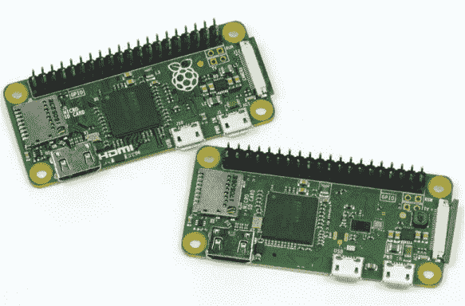

**图 1-2** 左边是 Raspberry Pi Zero，右边是 Raspberry Pi Zero W

如果你已经拥有旧型号的 Pi，不必担心。你拥有的 Raspberry Pi 版本其实并不重要，因为所有版本都能互相兼容，你可以使用任何一款来构建本书中的机器人。唯一的区别是，你需要为像无线互联网连接这样的设备准备适配器。表 1-1 提供了每种型号的不同规格。

**表 1-1** 主要 Raspberry Pi 型号规格对比

| **型号** | Raspberry Pi 3 Model B+ | Raspberry Pi Zero | Raspberry Pi Zero W |
| --- | --- | --- | --- |
| **内存** | 1GB | 512MB | 512MB |
| **处理器** | 64 位四核 1.4GHz | 32 位单核 1GHz | 32 位单核 1GHz |
| **端口** | HDMI, 4x USB 2.0, Micro-USB 电源 | Mini-HDMI, Micro-USB（数据）, Micro-USB 电源 | Mini-HDMI, Micro-USB（数据）, Micro-USB 电源 |
| **连接性** | Wi-Fi, 蓝牙, 以太网 | 无 | Wi-Fi, 蓝牙 |
| **价格** | $35 | $5 | $10 |

如果你还没有树莓派，我推荐购买树莓派 3 Model B+。树莓派有时会推出新版本，但在确保*向后兼容*（意味着它们能与早期版本兼容）方面会格外小心，因此即使发布了更高版本，你依然可以跟随本书的内容进行操作。

**注意**

*树莓派不是你能用来制作机器人的唯一平台或计算机，但它是最简单且最易接触到的方式之一！*

你可以在树莓派基金会网站上找到你所在国家的经销商 (*[`www.raspberrypi.org/products`](https://www.raspberrypi.org/products)*)。

#### 你对树莓派的第一次接触

当你第一次看到你的树莓派时，你可能会感到迷惑。你可能会将普通的“计算机”与屏幕、键盘、鼠标和存储器联系在一起——但树莓派有些不同。

拆开包装，你会看到一块外观看起来简陋的电路板，板上有各种组件。如果你拥有的是树莓派 3 B+，它应该与图 1-3 完全相同。后续版本可能看起来稍有不同，但它们都有相同的基本特性。

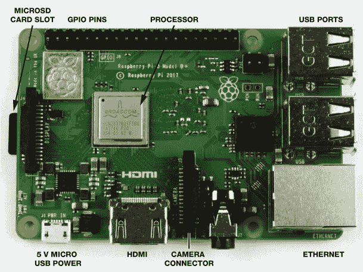

**图 1-3** 树莓派 3 Model B+ 的顶部视图

让我们来看看这些组件的作用：

USB 端口 这里有四个 USB 端口，你可以用它们插入 USB 键盘、鼠标、U 盘和其他设备。

以太网网络端口 这是用于有线互联网连接的端口。

HDMI 端口 *HDMI* 代表 *高清多媒体接口*，这个端口是你将树莓派连接到电视或计算机显示器等屏幕时使用的接口。

Micro USB 电源接口 这是你插入每个树莓派所需的 5V 电源的地方；这个接口与许多手机的电源输入相同。还值得注意的是，它没有电源按钮！只要你保持电源线连接，树莓派就会一直开机。

MicroSD 卡槽 大多数计算机都有某种形式的内置存储——例如，你的笔记本通常有硬盘——而树莓派没有“板载”存储。相反，你的计算机运行的软件（也就是 *操作系统*，简称 *OS*）以及所有文件都存储在 microSD 卡中，就像你在数码相机中找到的那种存储卡一样。在设置过程中，我将向你展示如何配置 microSD 卡，并安装树莓派所需的操作系统。

四核 1.4GHz 处理器 在你的 Pi 中，你会看到计算机的大脑。你可能会好奇你新购买的设备有多强大：它是否像笔记本电脑或台式机一样快？该处理器配合 Pi 的 1GB 内存，赋予了 Raspberry Pi 大致相当于某些智能手机的计算能力。正如你稍后将发现的那样，借助这个处理器，你可以进行*大量*的计算。

摄像头连接器 在 HDMI 端口旁边是一个夹状的连接器，标有*camera*（摄像头）。这是官方 Raspberry Pi 摄像头模块的输入端——你将在本书中使用它来赋予你的机器人“看”世界的能力！

GPIO 引脚 Raspberry Pi 最独特的特点之一是板子顶部边缘的 40 个闪亮的金属引脚，如图 1-4 所示。这些被称为*GPIO 引脚*，代表通用输入/输出引脚。你可以编程控制这些引脚，以操作各种电子设备、元件和其他部件，包括 LED、传感器和电机（参见图 1-5）。

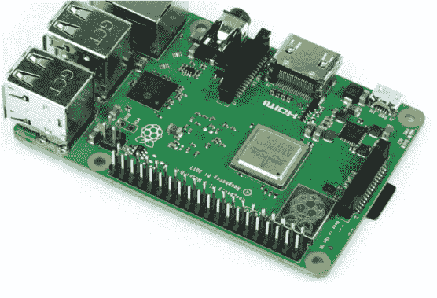

**图 1-4** GPIO 引脚


**图 1-5** 可以通过 GPIO 引脚连接到 Raspberry Pi 的硬件选择

**注意**

*原版 Raspberry Pi 1 只有 26 个 GPIO 引脚。它们的功能完全相同，但在后来的 Raspberry Pi 型号中，基金会成功地在板上增加了 14 个引脚！如果你使用的是原版模型，你仍然可以按照本书中的说明进行操作，因为较新的 40 引脚 Raspberry Pi 的前 26 个引脚与原版完全相同，并且向后兼容。*

这些 GPIO 引脚是进入*物理计算*世界的门户。你将使用它们来连接你机器人中的电子元件（电机、循迹传感器等）。接下来，我将引导你通过编程这些新硬件，使它们按你的指令工作！

#### 所需物品

正如你已经注意到的，你的新计算机缺少一些基本功能，比如屏幕和键盘。你将需要一些额外的硬件来将其设置并启动。幸运的是，你可能已经拥有大部分这些硬件。

5V Micro-USB 电源适配器 用于为 Raspberry Pi 提供电力。任何旧的 Android 智能手机充电器都可以。大多数电源适配器都会列出它们的输出电压和电流，因此你只需要确保充电器的输出电压为 5V，并且输出电流至少为 2.5A。很多电源适配器*不*符合这个规格。使用这些电源适配器时，常常会遇到一些神秘的故障。如果你没有备用电源适配器，可以在这里购买一个官方的：[*https://www.raspberrypi.org/products/raspberry-pi-universal-power-supply/*](https://www.raspberrypi.org/products/raspberry-pi-universal-power-supply/)。

USB 键盘和鼠标 默认情况下，树莓派没有输入设备，所以你需要一只 USB 键盘和鼠标来与树莓派进行初步交互。如果你家里有台台式电脑，直接拔掉现有的 USB 键盘和鼠标就可以用了。如果没有，你可以在网上或者任何电脑商店购买。

8GB 以上的 microSD 卡 如前所述，树莓派没有内置存储，所以你需要一张 microSD 卡（如果你使用的是第一代树莓派，还可以用普通 SD 卡）来存储操作系统。这些卡也可以在网上或者电脑商店购买。你至少需要一张 8GB 的卡，空间越大越好！

HDMI 线缆 这将用于将你的树莓派连接到 HDMI 电视或显示器。这是一种标准线缆，你可以在网上或本地商店购买。

显示器或电视 你需要一些显示输出设备来连接你的树莓派。任何带有 HDMI 端口的设备都可以使用，无论是电脑显示器、电视，还是其他类型的屏幕。许多电脑显示器有 DVI 输入端口，你可以购买一个 HDMI 转 DVI 适配器或者直接使用 HDMI 转 DVI 的线缆。

如果你能使用台式电脑或笔记本电脑，那将非常有帮助。虽然这不是*必需的*，但在很多方面都会有优势。首先，你需要准备一张 SD 卡来安装树莓派的操作系统，而这需要在另一台机器上完成。其次，你将通过局域网无线连接树莓派并进行控制。这样你就不需要反复插拔树莓派与显示器连接，而且你还需要一台独立的电脑。通过局域网控制树莓派，你只需要在本章的初始设置过程中使用显示器或电视。这不应该超过半小时！

如果你无法访问另一台电脑，不用担心。你依然可以绕过这个问题，顺利完成后续步骤。

在本书的后续章节中，我们将使用更多的硬件、组件和电子设备，但你现在不用担心这些。我会在每个项目开始前告诉你所有需要了解的内容。

### 设置树莓派

现在你已经准备好了所有的硬件，是时候设置你的树莓派了。对于初学者来说，这看起来可能是一项艰巨的任务，但我会一步步带你完成。你只需要设置好 microSD 卡，连接硬件，然后启动树莓派并配置几个设置即可。

如果你无法使用其他电脑来跟随接下来的步骤，你可以购买已经预装操作系统的 microSD 卡。这些可以通过搜索“预装 NOOBS 树莓派 microSD 卡”在线找到。

如果你有另一台电脑可用，建议你自己安装操作系统，因为这是一项非常实用的技能。这样，如果出现问题需要重新安装操作系统，你也知道该怎么做。而且，预装的 microSD 卡也比较贵！

#### 在 Windows/macOS 上安装树莓派操作系统

操作系统是每台现代计算机上运行的软件，尽管不同的操作系统可能看起来非常相似，但它们并不完全相同。你可能最熟悉 Windows 或 macOS，但你的 Raspberry Pi 运行的是 Linux 操作系统。

*Linux* 是一系列免费的开源操作系统，拥有不同的*发行版*，意味着针对不同的目的有不同版本的 Linux。对于 Raspberry Pi，大多数人使用 *Raspbian* 发行版，这是 Raspberry Pi 基金会官方支持的操作系统（见图 1-6）。Raspbian 经开发和优化，能够在你的 Pi 上流畅运行，你会发现它与你常用的操作系统有许多共同点。

开源是什么意思？

当我们说软件是*开源的*，我们指的是源代码——构建软件所需的代码——是公开的，任何人都可以查看、修改和分发。这意味着全球的程序员可以为开源项目做出贡献，致力于最终用户的共同利益。这也意味着 Raspbian 可以免费下载和使用。一些操作系统，如 Windows，是*专有的*，需要购买许可证密钥才能在电脑上使用。

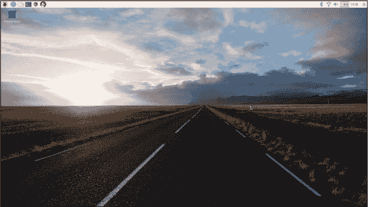

**图 1-6** Raspbian 桌面环境

警告

*在格式化过程中，你所选择的存储设备将被完全且不可逆地清除。确保你再次确认选择了正确的驱动器名称，以免不小心删除了其他设备上的所有内容并丢失数据。*

##### 准备你的 SD 卡

在你能在 microSD 卡上安装 Raspbian 之前，你需要先清除卡上可能已经存储的任何内容。即使你的卡是全新的，我也建议你这样做，因为有时它可能已经包含一些内容。这个过程叫做*格式化*你的 microSD 卡。在格式化之前，请务必阅读边栏中的警告！

1.  将你的 microSD 卡插入到普通电脑中。一些电脑有 SD 卡或 microSD 卡插槽，但许多电脑没有。如果你的电脑没有可以插入 SD 卡的插口，你需要使用*USB SD 卡适配器*，就像图 1-7 中展示的那样。这个小设备让你可以将卡插入到电脑的 USB 插槽中。你可以在网上轻松便宜地找到它（只需搜索“SD 卡 USB 适配器”）或在当地的电脑商店购买。

1.  一旦你将 SD 卡插入，你应该能够在文件资源管理器中找到它。如果你使用 Windows，查看“设备和驱动器”；如果你使用 Mac，使用 Finder 查找它。记下你的 microSD 卡的驱动器名称。这是你的电脑在插入时为其分配的字母（例如 *D:* 或 *H:*）。

1.  确保你的 SD 卡完全擦除并正确格式化的最佳方式是使用官方格式化软件*SD 卡格式化工具*。要安装这个软件，请访问[*https://www.sdcard.org/downloads/*](https://www.sdcard.org/downloads/)，点击菜单中的**SD 内存卡格式化工具**，并找到适合你操作系统的格式化工具。它会要求你接受条款，滚动到页面底部并点击**接受**以继续，最新版本的软件将开始下载。下载完成后，运行安装程序，如图 1-8 所示。确保按照指示操作并接受条款和条件。

1.  安装过程完成后，找到并运行 SD 卡格式化程序。一个像图 1-9 中所示的窗口将会打开。接下来的过程非常简单：从下拉菜单中选择你的卡（记住之前记下的驱动器名称），保持选择**快速格式化**选项，然后点击**格式化**。观察进度条，直到卡片成功格式化！

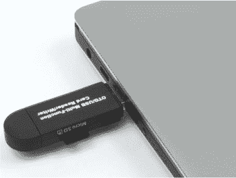

**图 1-7** 我的 USB 适配器已连接到我的笔记本电脑，准备进行格式化

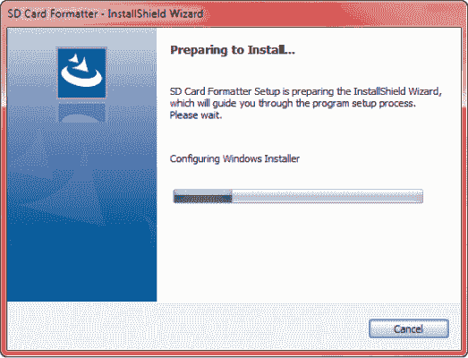

**图 1-8** SD 卡格式化程序的安装过程


**图 1-9** SD 卡格式化程序正在运行并格式化我的 8GB microSD 卡（驱动器*D:*）

##### 安装 NOOBS

现在你有了一张空白且已经格式化的 microSD 卡，是时候将 Raspbian 操作系统安装到卡上了。借助*NOOBS*（来自树莓派基金会的全新开箱软件），这个过程变得异常简单。只需要按照以下步骤操作：

1.  将 microSD 卡插入计算机，访问树莓派官方网站[*https://www.raspberrypi.org/*](https://www.raspberrypi.org/)。点击页面顶部的**下载**，然后点击**NOOBS**链接。确保下载最新的*完整版*NOOBS——不要安装 Lite 版本，因为它无法让你设置树莓派，除非连接到互联网。找到标有**下载 ZIP**的按钮并点击。等待操作系统下载。根据互联网速度，这可能需要几分钟到几个小时不等。

1.  下载完成后，找到位于你的*下载*文件夹中的 NOOBS，并解压压缩文件。在 Windows 系统中，右键点击文件，选择**全部解压**，选择一个位置保存解压后的操作系统文件，然后点击**解压**。在 Mac 系统中，通过 Safari 下载的 NOOBS 文件会自动为你解压。

1.  最后，找到你新下载的 NOOBS 文件，将它们复制并粘贴到你的 microSD 卡中。你可以通过鼠标选中所有文件，复制它们，然后粘贴到已经格式化的卡上，如图 1-10 所示。

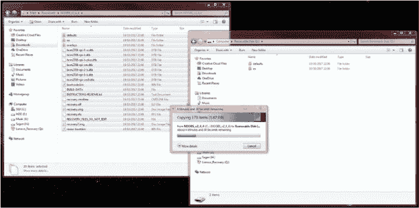

**图 1-10** 将所有提取的文件转移到 microSD 卡

太棒了！你已经成功设置了 SD 卡，并可以安全地将其从计算机中取出。在移除之前，确保右键点击设备并弹出卡片。

#### 插入电源和连接线缆到你的树莓派

下一阶段是物理上设置你的树莓派。你需要在一个有足够空间、可以连接 Wi-Fi 网络并且能够接入显示器（无论是电视还是计算机屏幕）的地方进行操作。

1.  拆开你的树莓派并将 microSD 卡插入主板底部的卡槽（参见图 1-3 以回忆插槽的位置）。确保卡插到底。一些型号的树莓派（如 1 B+和 2 B）在卡插入正确时会发出“咔哒”声，但后来的 3 B/B+型号则*不会*。

1.  将 USB 键盘和鼠标连接到树莓派的 USB 端口。

1.  将 HDMI 线缆插入树莓派的 HDMI 端口。将另一端插入电视或显示器。

1.  现在，要启动树莓派，将 5V Micro-USB 电源线连接到 HDMI 端口旁的电源输入端口（参见图 1-11）。你应该会看到 LED 灯闪烁，并且屏幕上会有一些活动。恭喜！你已经让树莓派“复活”！

如果屏幕上什么都没有显示，试着用遥控器切换不同的 HDMI 输入源来找到正确的输入——大多数屏幕都有多个输入源。作为一个常规的操作建议，你应该在插入树莓派电源之前先打开显示器；如果顺序颠倒，某些显示器可能无法接收到 HDMI 信号！所以，试着先关掉显示器，插入 HDMI 线，再打开显示器，*然后*将 5V 微型 USB 电源线插入树莓派。

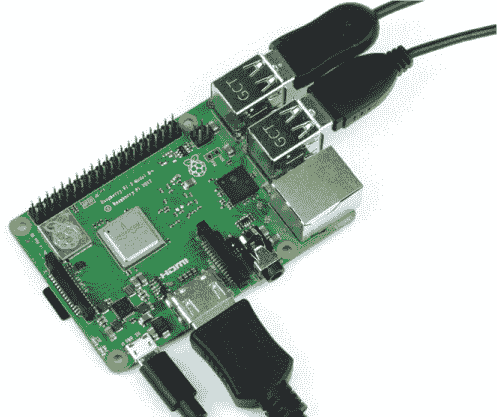

**图 1-11** 一台正常工作的树莓派

如果你想使用有线互联网连接，并且离路由器很近，你可以通过将以太网线从路由器插入树莓派旁边的以太网端口来连接互联网。然而，整本书中我会使用无线互联网连接，我建议你也这样做，以便自由活动。

如果你在屏幕右上角看到一个闪电符号，这表示树莓派警告你电源供应不足，系统可能会不稳定。在这种情况下，你应该使用更好的电源供应器，理想情况下是官方的电源。

#### 安装 Raspbian

在连接到树莓派的屏幕上，你应该看到一个 NOOBS 界面，类似于图 1-12 中显示的界面。现在，你只需要安装并配置 Raspbian 操作系统。这非常简单，你很快就能开始使用！

要安装操作系统，只需点击 Raspbian 选项旁边的框，然后点击 NOOBS 框顶部的**安装**。Raspbian 应该会自动提取并为你设置 SD 卡。坐下来放松，观看进度吧！

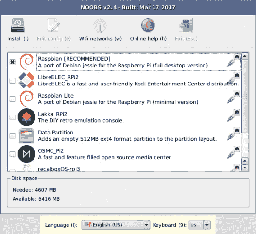

**图 1-12** NOOBS 安装界面

一旦安装过程完成，你的 Pi 应该会重新启动并进入 Raspbian 桌面环境，如之前在 图 1-6 中所示。

其他 Pi 操作系统

如果你将 NOOBS 界面连接到互联网，你将能够下载并访问许多其他的 Raspberry Pi 操作系统。你可以安装许多不同版本的 Linux，每个版本都有其优缺点。例如，OSMC（开源媒体中心）是一个视频播放发行版，用于将 Raspberry Pi 连接到电视作为媒体中心。我们将在本书中始终使用官方的 Raspbian 操作系统。如果你想尝试其他系统，可以通过重启 Raspberry Pi 并按住 SHIFT 键返回 NOOBS 设置界面。

你会发现，一个“欢迎使用 Raspberry Pi”的设置向导会自动启动。由于我们稍后会手动更详细地配置 Raspberry Pi 的偏好设置，可以通过点击 **Cancel** 选项关闭该向导。

你会注意到，Raspbian 环境与你可能使用过的其他操作系统非常相似。你会看到屏幕顶部有菜单栏，如 图 1-13 所示，应用程序位于左侧，实用工具（例如音量和 Wi-Fi）位于右侧。花点时间探索一下吧！

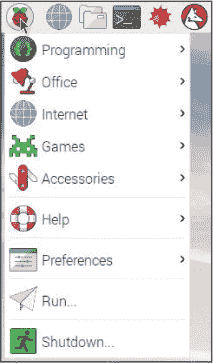

**图 1-13** Raspberry Pi 菜单

#### 配置 Raspbian

在继续之前，有两件事你应该立即做，以配置 Raspbian，从而节省以后的时间：更改一些偏好设置和设置 Wi-Fi。

##### 更改 Raspbian 偏好设置

当 Raspbian 安装时，默认情况下会关闭一些重要功能。这是出于安全性和效率的考虑，并且因为很多人并不需要这些功能。然而，你 *将* 需要其中一些功能，所以我们现在就启用它们，这样你以后就不用再去设置了。

在屏幕的左上角，点击 Pi 图标，然后从菜单中选择 **Preferences** ▸ **Raspberry Pi Configuration**。你应该会看到一个像 图 1-14 中的对话框。

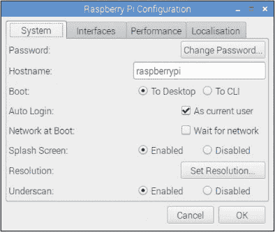

**图 1-14** Raspberry Pi 配置对话框，打开的是系统标签

当应用程序首次打开时，你会看到系统标签。在这里，你可以更改账户密码、屏幕分辨率和其他设置。

默认情况下，你的 Raspberry Pi 会自动登录。标准用户配置文件的用户名是 *pi*，密码是 *raspberry*。我建议你将密码更改为自己选择的内容，以提高 Raspberry Pi 的安全性。请记住这个密码，因为将来你需要它来登录。

在你能够设置 Wi-Fi 之前，你需要告诉 Raspberry Pi 你所在的国家。为此，请点击 **Localization** 标签，然后点击 **Set WiFi Country**。从下拉菜单中选择你当前所在的国家。

修改完密码后，导航到下一个标签页，接口（Interfaces）。在这里，将以下选项从禁用（Disabled）更改为**启用（Enabled）**：

+   相机

+   SSH

+   VNC

+   SPI

+   I²C

启用相机将允许你连接官方的 Raspberry Pi 相机模块，我们将在本书的最后一章进行连接。启用 SSH 和 VNC 将允许你通过本地网络远程访问你的 Pi，稍后我会向你展示如何操作。其他两个选项——SPI 和 I²C——都与 GPIO 引脚上的功能相关，我们将在后面的章节中遇到这些。

启用这些设置后，点击**确定**，然后在提示时重启你的 Raspberry Pi。

##### 将你的 Raspberry Pi 连接到互联网

将 Raspberry Pi 连接到 Wi-Fi 网络应该只需要几分钟。如前所述，你可以通过物理以太网线将 Pi 连接到互联网——这不需要任何配置。然而，当你在构建机器人时，你希望一切尽可能无线，所以我建议使用 Wi-Fi。

还需要注意的是，为了下载我们在本书中将使用的软件和代码，你的 Pi 需要连接到互联网。

Raspberry Pi 3 B+和 Pi Zero W 都内建了 Wi-Fi 和蓝牙。如果你使用的是旧型号，你需要购买一个 USB Wi-Fi 适配器，并将其插入 Pi 的 USB 端口来连接互联网。某些 Wi-Fi 适配器可能与 Pi 连接时出现问题，因此我推荐使用官方型号，你可以在[*https://www.raspberrypi.org/products/raspberry-pi-usb-wifi-dongle/*](https://www.raspberrypi.org/products/raspberry-pi-usb-wifi-dongle/)购买。

若要从桌面连接到 Wi-Fi 网络，只需点击屏幕右上角的 Wi-Fi 图标，屏幕下拉列表中将显示本地网络，如图 1-15 所示。选择你的网络，输入密码，然后点击**确定**。

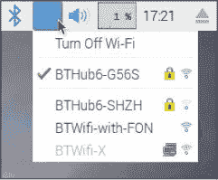

**图 1-15** Wi-Fi 下拉菜单

菜单栏图标应会改变，显示你的 Wi-Fi 信号强度，表示你的 Pi 现在已经连接到互联网。

### 终端的奇妙世界

*终端*（或称为*shell*）是你直接给电脑指令的一种方式。具体来说，它是一个你可以输入并执行基于文本的命令的界面。这与现代操作系统使用的*图形用户界面*（简称*GUI*，发音为“gooey”）相对，后者通常被称为桌面。GUI 允许你通过简单而直观的方式使用计算机完成许多高级任务。如果你以前没有使用过 Raspberry Pi 或 Linux 机器，你很可能只用过计算机的 GUI。

在计算机没有足够的处理能力使用复杂图形之前，用户完全通过终端和*命令行界面*操作计算机。这是一种纯粹基于文本的与计算机交互方式：你输入文本命令告诉计算机做什么，计算机则通过输出文本来回应。

这可能听起来像是一种过时且不太有用的与计算机交互的方式，但它依然非常强大。使用终端可以让你通过仅仅几个字符高效地执行精确的命令。树莓派终端是我们与机器人互动的主要方式。

#### 终端巡游

随着你在本书中的学习，你会变得更加熟悉并且自信地使用终端。现在，为了帮助你熟悉终端，我将带你快速了解它，并介绍它是如何工作的。

要从桌面打开终端窗口，点击左上角的树莓派菜单，然后点击**附件** ▸ **终端**。一个黑色的框应该会出现，如图 1-16 所示。现在，你正在使用终端！

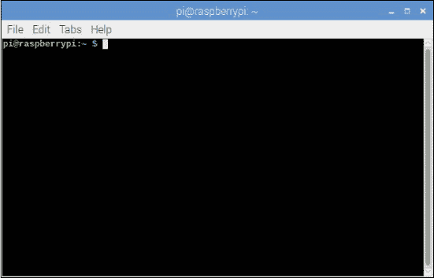

**图 1-16** 树莓派终端

终端会显示一个类似这样的*提示符*：

pi@raspberrypi:~ $

**注意**

*在你的树莓派和 Linux 冒险中，如果你不确定某个命令的功能，或者想知道如何在终端中执行某个操作，最好的学习方法是在线查找相关信息。有大量的帮助和命令行手册可以指导你完成这个过程——无论你想用终端做什么！*

在这种情况下，提示符只是你的树莓派等待你输入文本命令；它在*提示*你做某事。不幸的是，终端无法理解普通英语（或其他任何语言）。相反，你需要使用特定的*命令*与它进行交流。这些是预定义的短语和字符序列，告诉终端如何执行。虽然有成千上万的命令，但不用担心。我现在会介绍一些简单的命令给你。

你可以像在普通操作系统中一样，通过终端访问不同文件夹（称为*目录*）中的文件。不同之处在于，终端界面就像一个基于文本的文件管理器。在任何时候，你都“处于”某个目录中，并且可以随时更改位置。为了探索这一点，让我们练习一些命令。

当你打开终端时，你会进入树莓派的主目录。你可以使用第一个命令`ls`来查看当前目录中的文件和文件夹。换句话说，`ls` *列出*了当前目录的内容。使用你的键盘，在终端中输入这个命令：

pi@raspberrypi:~ $ ls

按下 ENTER 键。你应该会看到当前目录中存储的目录和文件列表，如图 1-17 所示。现在，通过进入**附件** ▸ **文件管理器**，在桌面上打开同一个文件夹，应该与终端中看到的内容一致。

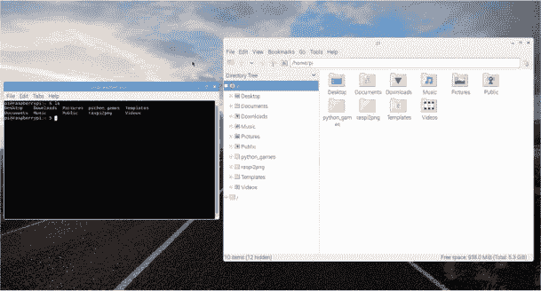

**图 1-17** 树莓派终端与图形文件管理器并排显示，以不同的方式展示相同的内容

你会注意到文本用不同的颜色编码。这有助于你快速识别项目。蓝色的项目是目录。那段明亮的绿色文本是你的用户名——在这个例子中是默认用户，*pi*。

你像在文件管理器中那样，使用命令`cd`（表示*更改目录*）在这些文件夹之间导航。选择刚刚由`ls`列出的一个目录，然后输入以下命令：

pi@raspberrypi:~ $ cd  that_directory

将`that_directory`替换为你的目录名。例如，我将通过以下命令进入*Documents*目录：

pi@raspberrypi:~ $ cd Documents

这会将我移入*Documents*文件夹。需要注意的是，终端是*区分大小写*的，这意味着终端会将大写字母和小写字母视为不同的字符；例如，*d*与*D*并不相同。如果我没有将`Documents`中的*D*大写，而是输入了`documents`，我的 Pi 就无法理解我要去哪里，并会返回错误。

当你移动文件夹时，你应该会注意到在`$`提示符前的蓝色文本也会发生变化，像这样：

pi@raspberrypi:~/Documents $

终端会通过在提示符前列出当前位置来告诉你当前在文件系统中的位置。这将非常有用。

在你的新文件夹中，再次输入`***ls***`，查看其中包含的文件和文件夹。当我在*Documents*文件夹中这样做时，得到的输出是列表 1-1。

```
pi@raspberrypi:~/Documents $ ls
BlueJ Projects Greenfoot Projects Scratch Projects
```

**列表 1-1** 从终端查看我的*Documents*文件夹

如你所见，列出了新目录的不同内容。命令`cd ..`将带你回到你刚才所在的文件夹。你可以把它当作是将你“向上”移动到上一级目录路径。所以，在*Documents*文件夹中运行`cd ..`，会将你带回到主目录。

**注意**

*输入长目录名既麻烦又容易出错。命令经常出现错误、拼写错误或返回错误信息。所以，这里有两个快速提示！首先，当你使用`cd`命令或任何其他文件命令时，在输入目录或文件名的前几个字母后，按下 TAB 键。这将自动完成目录名称。现在试试看。第二，如果命令出错，或者你想再次执行或编辑它，可以使用上下箭头键滚动浏览你的命令历史。*

你应该知道的最后一个（也是非常重要的）命令是`shutdown`。树莓派没有电源开关，你需要拔掉电源线来断开它的电源。在每次拔掉电源之前，你需要安全地关闭操作系统。每当你想关闭树莓派时，运行此命令：

pi@raspberrypi:~ $ sudo shutdown now

之后，稍等片刻，然后你可以放心地拔掉电源线。

通过这一点，我向你介绍了两个最有用的 Linux 终端命令：`ls`和`cd`。在你的树莓派冒险中，你将经常使用它们。我们在本书的过程中还会使用许多其他终端命令，我将在接下来的部分逐一向你介绍。

#### 从另一台计算机访问你的树莓派

设置树莓派很简单，但一直连接到显示器可能会带来不便。当你的机器人在地板上快速移动时，你不想让长电缆拖在后面，所以现在我将向你展示如何从另一台计算机访问你的树莓派，这样你就可以无线发送指令给你的机器人。

你可以使用*SSH*（一种代表*安全外壳*的互联网协议）从同一网络上的另一台计算机远程访问树莓派的终端。然后，你可以向该计算机的命令行输入命令并查看其响应，就像你在前一部分所做的那样，并将它们发送到你的机器人。

首先，你的树莓派*必须*连接到本地网络，可以通过 Wi-Fi 或以太网连接，另一个设备*也必须*连接到同一网络。

接下来，你需要你的树莓派的*IP 地址*以便稍后连接到它。它是一个*互联网协议地址*，是分配给每个连接到网络的设备的唯一数字标签。可以把它当作计算机的“住址”来理解。

要查找树莓派的 IP 地址，只需打开终端并输入以下命令：

pi@raspberrypi:~ $ ifconfig

这将生成大量的输出文本。它可能看起来很混乱，但你的 IP 地址就在其中。

如果你是通过 Wi-Fi 连接到网络的，请向下滚动到`wlan0`条目，在`inet`后的数字就是你的 IP 地址；参见图 1-18 我的 IP 地址。如果你是通过以太网连接的，你可以在`eth0`条目下找到你的 IP 地址。无论如何，只需在输出中找到以`inet 192.168.1.221`（或类似的内容）形式出现的魔法序列。

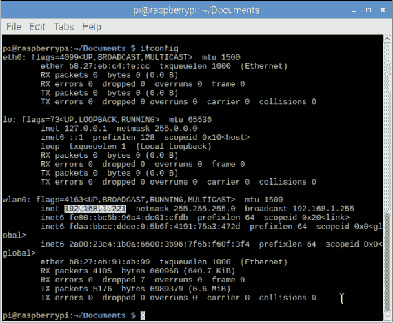

**图 1-18** `ifconfig`命令的输出。我已高亮显示了我的 IP 地址——如果你是通过 Wi-Fi 连接的，你应该在这里找到你的 IP 地址。

如你所见，我的 IP 地址是 192.168.1.221。记下你的 IP 地址（它可能非常相似），因为你将使用此信息从其他设备连接到你的树莓派。

接下来，你需要在另一台计算机上设置 SSH 连接。SSH 内置于 Linux 发行版和 macOS 中，但在 Windows 上，你需要一些第三方软件。我将接下来讲解如何从 Windows 和 Mac 连接到你的 Pi；你只需要阅读与自己计算机相关的部分。

##### 在 Windows 上使用 SSH

Windows 所需的免费软件叫做 PuTTY。安装过程非常简单，只需几分钟：

1.  在你的 Windows PC 上，打开一个网页浏览器并导航到 [*http://www.putty.org/*](http://www.putty.org/)，然后按照链接访问下载页面。根据你的计算机选择 32 位或 64 位选项。这将下载安装程序。

1.  打开安装程序并按照说明安装 PuTTY 软件。

1.  安装程序完成后，打开 PuTTY 应用程序。你可以在开始菜单中找到 PuTTY 的快捷方式。每次打开应用程序时，你将看到类似于 图 1-19 中的窗口。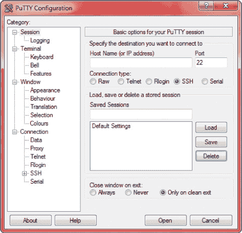

    **图 1-19** PuTTY 应用程序和配置对话框

1.  要连接到你的 Raspberry Pi，请在标记为“Host Name（或 IP 地址）”的框中输入你的 Pi 的 IP 地址。下面确保选中 SSH，除非你知道其他设置，否则将端口选项保持为 22。点击**打开**以开始连接。

1.  如果这是你第一次连接到新的 Pi，可能会看到安全警告；只需点击**是**并同意。之后，会出现密码提示。输入你 Pi 的密码并按 ENTER；如果你之前没有更改过，默认密码是 *raspberry*。

现在，你可以使用完整的 Raspberry Pi 终端，如 图 1-20 所示。为什么不尝试一下在上一节中学到的一些命令呢？

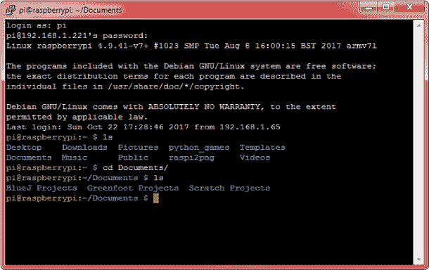

**图 1-20** PuTTY Shell

##### 在 macOS 上使用 SSH

在任何 Mac 计算机上使用 SSH 都不需要额外的软件。你可以直接使用 Mac 自带的终端程序！

1.  在你的 Mac 上的任何地方，按住 COMMAND 键和空格键打开 Spotlight 搜索。输入 `**terminal**` 并按 ENTER。一个命令行窗口应会打开。

1.  要连接到你的 Raspberry Pi，请在终端中输入以下命令，将`***your_ip_address***`替换为你之前找到的实际 IP 地址：

    $ ssh pi@your_ip_address

    如你在 图 1-21 中看到的，我输入的命令是：

    $ ssh pi@192.168.1.221

1.  如果这是你第一次连接到新的 Pi，可能会看到安全警告；只需输入 `***yes***` 来同意。然后，你将需要输入 Raspberry Pi 的密码并按 ENTER；如果你之前没有更改密码，那么默认密码是 *raspberry*。

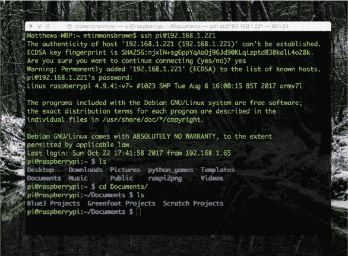

**图 1-21** Mac 终端 SSH 连接过程

现在你应该可以使用完整的 Raspberry Pi 终端了！尝试一下在上一部分中学到的一些命令！

### 什么是编程？

你已经差不多准备好开始构建机器人了！在本章的最后，我想向你介绍一些编程概念。

*编程*是编写一组指令的过程，指示计算机如何执行任务。你可以编写视频游戏、应用程序，甚至在我们的案例中，机器人。你能用计算机和编程做的唯一限制就是你的想象力！

在本书的过程中，我将向你展示如何连接电子元件，然后编程让它们做你想要的事情。如果你之前从未进行过编程，不用担心。我会在整个书中逐步解释所有内容。如果你遇到困难，你还可以从[*https://nostarch.com/raspirobots/*](https://nostarch.com/raspirobots/)下载你需要的所有代码。

#### 介绍 Python

有许多不同的编程语言，每种都有其优缺点。本书中我们将使用的语言叫做*Python*。Python 是一种*高级*编程语言，这意味着它比许多其他编程语言更接近人类语言，因此既易于理解又非常强大。

你将编写 Python 程序，并从终端执行它们。这意味着你可以使用 SSH 从另一台计算机编程你的 Raspberry Pi，而无需将其连接到显示器。

#### 编写你的第一个 Python 程序

对于你的第一个程序，按照极客传统，创建一个计算机程序，使其*输出*，或显示，“你好，世界！”给用户。这是一个简单的任务，能帮助你熟悉如何编写和运行 Python 程序。

1.  从终端中输入以下命令：

    pi@raspberrypi:~ $ mkdir robot

1.  此命令将为你创建一个名为*robot*的新目录，用来存储你自己的 Python 程序。从现在起，我们会将所有程序存储在这个目录中。使用以下命令进入你的新目录：

    pi@raspberrypi:~ $ cd robot

1.  接下来，在你新建的*robot*目录中，输入以下命令：

    pi@raspberrypi:~/robot $ nano hello_world.py

1.  Nano 是一个*文本编辑器*。文本编辑器是允许你创建、查看和更改文本文件的简单软件。Nano 让你可以直接在终端中创建和编辑程序，而不需要打开任何其他窗口。此命令使用 Nano 创建一个名为*hello_world.py*的新文件——文件扩展名*.py*告诉 Nano 这是一个 Python 程序。通过此命令，一个空的*hello_world.py*文件已被创建并保存在我们的*robot*目录中。这个文件现在已经在你的终端中打开。

1.  当 Nano 在你的终端中打开时，你可以输入指令保存到*hello_world.py*文件中。输入以下这一行 Python 代码：

    print("你好，世界！")

1.  命令 `print()` 是一个 Python 函数。在编程中，*函数* 是执行任务的指令。`print()` 只会将你提供给它的文本输出到终端！在我们的例子中，我们提供的文本是 `"` `Hello, world!``"`。在编程中，任何两个引号之间的一系列字符都被称为 *字符串*。

1.  你的单行程序现在已经完成，接下来需要退出并保存你的工作。在 Nano 中，按 CTRL-X。然后会提示你是否要保存所做的更改。按 Y 表示确认保存。接下来 Nano 会问你要将这些指令保存为哪个文件名，在我们的案例中是 *hello_world.py*。按 ENTER 确认。你现在应该回到命令行了。

1.  你已经创建了程序，现在需要运行它。从终端运行 Python 程序，只需输入 `***python3***` 后跟文件名即可。输入以下命令来执行你的程序：

    pi@raspberrypi:~/robot $ python3 hello_world.py

你将在终端窗口看到字符串 `"` `Hello, world!``"`，如 图 1-22 所示。

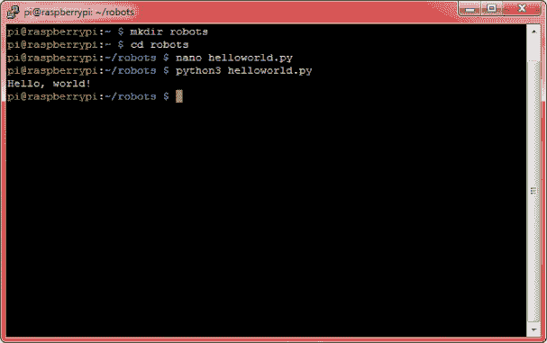

**图 1-22** 你的第一个 Python 程序的输出

你可能注意到命令 `python3 helloworld.py` 中的 `3`。这表示告诉你的 Pi 使用 Python 3 来执行文件，而不是 Python 2。Python 3 是 Python 的最新版本，虽然 Python 2 仍然被广泛使用，但推荐使用 Python 3。它们之间的差异不大，但在语法和功能上有一些不同。本书中的所有项目都将使用 Python 3。

### 总结

在这一章中我们已经涵盖了很多内容！你已经了解了你的新 Raspberry Pi，完成了设置，并且初步体验了终端和 Python 编程。现在你可以远程访问和使用你的 Pi，并且理解如何进行一些操作，比如更改偏好设置和设置 SD 卡。

在下一章中，我将介绍电子学和电力的基础知识，并且你将开始做一些简单的建设工作，例如闪烁 LED 等小项目。这将为你打下基础知识，帮助你在进入机器人制作之前做好准备！
