## 第二章：电子学基础

电子学是控制和操作电能以完成有用工作的科学。它是关于使电子元件，如灯光、传感器和马达，做出你想要它们做的事情。

许多创新都源自电子学的不同领域。对我们来说，最有趣的是*机器人学*这一分支。要制作自己的机器人，你需要了解电子学的基础知识，并将这些知识运用自如！在这一章中，我将通过两个项目让你初步接触电子学。你将编程控制一个 LED（发光二极管）按一定间隔闪烁，然后连接一个按钮，使其在按下时向终端打印信息。你很快就能让 LED 闪烁并控制物理世界了！

### 什么是电力？

电力无处不在，贯穿我们日常生活的方方面面：电流被用来为电器和家电提供动力，比如家中的灯光、电视屏幕、烤面包机，以及树莓派机器人的马达。那么，电力到底*是什么*呢？

电力从*原子*开始。世界上万物都是由数十亿个微小的原子组成的——包括你！正如你在科学课上学到的，原子本身由三种粒子组成：*质子*、*中子*和*电子*。质子和中子一起位于原子的中心，形成原子的*原子核*，而电子则围绕这个原子核运动，正如在图 2-1 中所示。

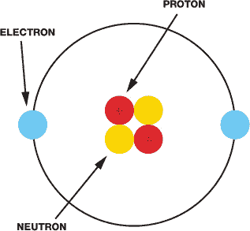

**图 2-1** 一个原子的示意图

质子和电子各自带有*电荷*，这是物质的基本属性。质子带正电，电子带负电。中子没有电荷；也就是说，它们是中性的。你可能听过“异性相吸”这句话，这在这里也适用。因为质子和电子的电荷相反，它们互相吸引并保持在一起，形成了构成你周围一切的原子。

原子有许多不同的排列方式，叫做*元素*。每种元素由原子中所含的质子、电子和中子数量来定义。例如，铜元素通常有 29 个质子和 35 个中子，而金元素则有 79 个质子和 118 个中子。所有金属，如铜、金和铁，都是由原子集合压在一起组成的。某些材料是*导电*的，这意味着当给予能量时，一个原子的电子可以移动到下一个原子。这会导致物质中产生*电荷流动*，也就是我们所说的电*流*。通过材料中某一点的电子流量的大小称为电流，单位为*安培（A）*。

要使电流流动，必须有一个完整的*电路*。电路是一个封闭的路径，就像一个环路，电流在其中流动。电路必须由导电材料构成，电流才能通过，如果电路中有任何间隙，电流就无法流动。

电路需要一个能“推动”电流流动的能量来源。这个来源可以是电池、太阳能电池板、电网或其他任何东西。关键是，这些来源提供了*势差*，也就是*电压*。电压简单地推动电子通过导体（如铜线），而电压的强度是以*伏特*（*V*）为单位的。

电源有正极和负极。在简单的电路中，就像图 2-2 所示，电池的正负极可以通过一根粗铜线连接。电子带负电，因此被电池的正极吸引，它们沿着电路从负端流向正端，电压推动着它们流动。

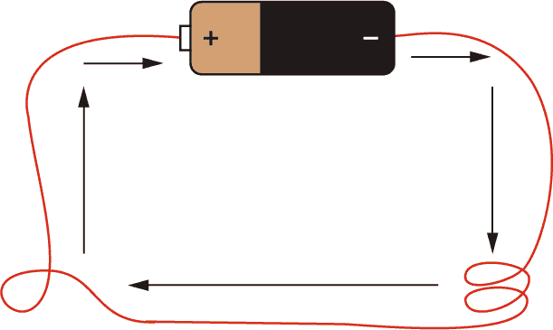

**图 2-2** 显示电荷流经连接电池正负极的粗铜线的电路。

尽管电子是从*负极到正极*流动的，但通常我们习惯认为电流是从*正极到负极*流动的。电路中的电池有一个固定的电压。如果这个电压增加，更多的电子会被推动穿过电路，电流也会变大。相反，如果电压减少，推动穿过电路的电子会更少，电流也会变小。

#### 电阻

现在你已经理解了电路的基本概念，我们需要加入另一个元素：*电阻*。电阻简单来说就是减少电流的流动。除了实验室外，所有材料都有一定的电阻，电阻的单位是*欧姆（Ω）*。我们可以通过想象一根水管来理解电阻。流经水管的水就像流经铜线的电流。假设水管的一端比另一端高，水管高端的水比低端的水有更多的能量（势能）。如果水管是水平的，水就不会流动；如果水管略微倾斜，就会有小的水流。实际流量取决于水管两端的高度差和水管的宽度。水管的高度差就像电压（势差）。

另一方面，电阻就像是压缩水管，影响水管的宽度：越是压缩，能流过的水就越少（参见图 2-3）。这就意味着电流通过电路的量会减少。

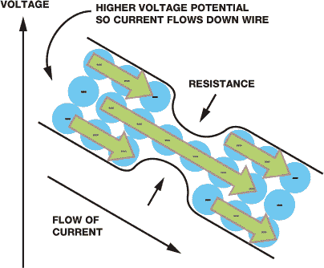

**图 2-3** 电阻减少了电流通过电路的量。

因此，电路由三个要素组成：电压、电流和电阻。它们似乎都紧密相连，对吧？你甚至可能认为它们之间一定有某种*数学*关系或*定律*，你是对的。

#### 欧姆定律

*欧姆定律*处理的是电压、电流和电阻之间的关系。它指出，*导体两端的电压与通过它的电流成正比*。

让我们分解一下，看看这意味着什么。在电路中，电压等于电流乘以电阻。我们用*V*表示电压，用*I*表示电流，用*R*表示电阻。所以，电压的方程式写作如下：


和任何数学方程式一样，你可以重新排列方程式来求解其他项的方程式。例如，根据欧姆定律，我们知道电路中的电流等于电压除以电阻。当你重新排列电流和电阻的方程时，你会得到以下方程：

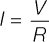

*R* = 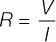

如果这些内容有些让你感到困惑，不用担心！当你制作自己的电路时，这些内容会变得更容易理解。现在我们已经讲解了一些电力和电子学的基础知识，接下来就让我们开始制作吧！

### 制作 LED 闪烁：树莓派 GPIO 输出

就像“Hello, world!”是传统的第一个程序一样，制作 LED 闪烁也是传统的第一个电子项目，因为它非常巧妙地展示了如何使用 GPIO 引脚作为输出。这个项目将是你使用树莓派 GPIO 引脚的入门介绍。在我们开始之前，你可能会有一些问题。

首先，什么是 LED？LED 是*发光二极管*（light-emitting diode）的缩写，LED 是当电流通过时会发光的元件。LED 是现代版的老式灯泡，但它们耗电更少、不发热且使用寿命更长。

#### 部件清单

在你初次涉足电子学时，除了你之前设置的树莓派外，还需要一些额外的东西。以下是这个项目所需的材料：

**注意**

*关于如何购买和获取这些部件的指导，请参阅介绍部分。*

+   一个面包板

+   一个 LED（你选择的颜色）

+   一个合适的电阻

+   跳线

在我们接线这些组件之前，我会再稍微解释一下它们是如何工作的，以及你为什么需要它们。

##### 面包板

电子 *面包板* 允许你连接电子元件，而无需将它们永久连接在一起（这叫做 *焊接*；参见第 204 页的《如何焊接》）。这意味着你可以通过将元件插入面包板的孔来快速原型电路。面包板孔之间的间距是标准化的（2.54 mm/0.1 英寸），因此所有适合面包板的元件都应该能轻松安装。面包板有几种不同大小，孔的数量也不同（也称为 *接点*）。我推荐使用一个 400 接点的面包板，像图 2-4 中展示的那样。

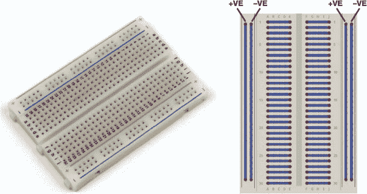

**图 2-4** 一个 400 接点的面包板及其行列连接示意图

在图 2-4 中，你可以看到面包板的行和列是如何通过金属条相互连接的。因此，如果你将一个元件放入一行，并将另一个元件放入同一行，例如，它们将在电路中相互连接。

##### LED

LED 有各种不同的形状、大小和颜色。幸运的是，它们也非常便宜。当大宗购买时，它们每个的价格简直就是 *几分钱*。确保你的 LED 有两个脚，可以安排以适应你的面包板，如图 2-5 所示。

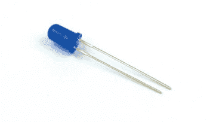

**图 2-5** 一款蓝色 LED

随便购买任何你喜欢颜色的 LED——我选择了蓝色。确保检查你购买的 LED 的电压规格。你需要确保点亮 LED 所需的电压小于 3.3 V。这通常被称为 *正向电压*。你通常可以在 LED 的在线清单中找到这些信息。我的 LED 的正向电压是 2.5 V。树莓派的 GPIO 引脚工作在 3.3 V，如果你的 LED 正向电压是 5 V，例如，你的树莓派将无法点亮它！

你还需要查明 LED 的正向电流。*正向电流*是推荐通过元件的电流。我这款 LED 的推荐正向电流是 30 mA（*毫安*是安培的千分之一），也就是 0.03 A。如果你提供的电流低于推荐值，LED 将不会很亮；如果电流过大，它可能会烧坏（当发生这种情况时，你会听到一声小爆炸）。这些信息通常也可以在 LED 的互联网清单或包装上找到。如果你不确定你的 LED 具体的参数，别担心——小巧便宜的 LED 通常都可以满足我们的需求。如果你没有任何关于 LED 的信息，可以假设其正向电压约为 2 V，正向电流约为 20 mA。

##### 电阻器

为了避免 LED 过载，我们将使用一个 *电阻器*。每种材料都有电阻，而电阻器组件则专门设计用来在电路中产生纯粹的电阻。

LEDs 和大多数组件对通过它们的电流非常敏感。如果你将 LED 直接连接到电池并创建一个没有电阻的电路，LED 通过的电流可能会大到导致它过热。电阻器会降低 LED 中的电流，防止这种情况发生。

电阻器有不同的值，用彩色带表示，你可以在图 2-6 中看到。请查看第 202 页的电阻器指南，了解这些带子的含义以及如何读取它们。


**图 2-6** 一个电阻器

要找出你需要的电阻器，你需要应用欧姆定律！根据你之前看到的公式，你知道电阻等于电压除以电流，或*R = V/I*。在我们的例子中，电压是 Pi 提供的电压 3.3 V 与 LED 的正向电压之间的差值：即总电压*减去*LED 电压。对于我来说，就是 3.3 V – 3 V = 0.3 V。你应该使用*你*自己的正向电压，或者如果你不知道，可以用 2 V。

电流是 LED 的正向电流。对于我来说，这是 0.03 A。确保这个值是以安培为单位，而不是毫安！

**注意**

*我建议购买一些电阻器，它们通常被组织成类似书本的形状。这样，你就会有适合各种情况的电阻器，而不必单独购买它们。*

我可以通过简单地计算以下公式，算出我需要的电阻值，以将电流降低到 0.03 A：0.3 / 0.03 = 10。这意味着我需要一个大约 10 Ω的电阻。通常你不会找到一个电阻值正好等于你计算出的数值。没关系：在大多数情况下，你可以直接使用你能找到的最接近的电阻值。对于我的 LED，我很幸运，正好有一个与我所需值匹配的电阻。我正在使用图 2-6 中显示的 10 Ω电阻。

如果你仍然不确定你的 LED 的正向电压和正向电流，可以采取保守的做法，在电路中安装一个至少 100 Ω的合理大小的电阻。如果 LED 太暗，可以逐渐减小电阻，直到达到合适的亮度（足够暗以不伤害眼睛是一个好的经验法则）。不要尝试反过来做：你无法让 LED 复原！

##### 跳线

最后，你需要一些电线来连接所有部件。具体来说，你需要*跳线*，这些是适合面包板使用的电线，允许你将元件连接到 Pi 的 GPIO 引脚。你可以在图 2-7 中看到一些跳线的示例。


**图 2-7** 一组跳线

跳线的两端可以是 *公头* 或 *母头*。公头端（通常缩写为 M）有一根突出的小线，可以插入面包板的孔中。母头端（缩写为 F）则有一个孔，可以将线插入其中。我建议购买各种类型的跳线，以便应对各种情况。我们在本书中将使用大量这些跳线！在 图 2-7 中，你可以看到我收集的 M-M、M-F 和 F-F 类型的跳线。为了让 LED 闪烁，我们需要两根 M-F 跳线。

#### 连接 LED 的电路

现在你已经收集好了所有零件，是时候将 LED 接入电路并创建你的第一个电路了！你将按照 图 2-8 中所示的方式连接电路，因此可以在完成步骤时参考这个示意图。

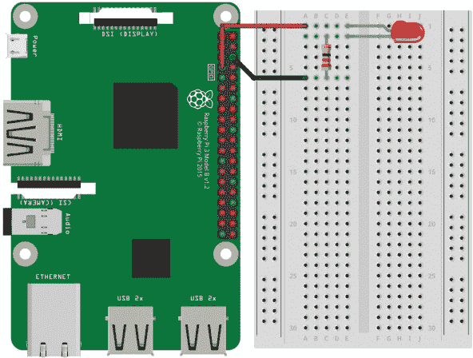

**图 2-8** 用于连接 LED 的面包板示意图

根据你使用的面包板，电路的外观可能会略有不同。为了确保连接正确，请按照以下步骤操作：

1.  将 LED 插入面包板，确保每根引脚位于不同的行中。如果将 LED 的引脚插入同一行，它们将相互连接，但不会连接到任何其他元件。LED 有正负极，必须按照电流的流向进行连接。LED 的长腿是正极——称为 *阳极*；短腿是负极——称为 *阴极*。LED 灯泡的阴极侧通常是平的，作为额外的标识。

1.  将电阻的一端插入与 LED 短腿相同的面包板行中。将电阻的引脚放入与 LED 短腿相同的行中，即可将两者连接在电路中。将电阻的另一端连接到面包板上的任意其他点。

1.  现在，确保树莓派关闭，将一根 M-F 跳线的公头端插入面包板，插入的位置应该与 LED 的长腿在同一行。找到树莓派上的物理引脚 7，也就是 *GPIO/BCM 4* 引脚（请参见 第 200 页 的“树莓派 GPIO 图”了解此引脚的图示），并将跳线的母头端连接到它。

    GPIO 引脚的各种名称

    树莓派的 GPIO 引脚有几种不同的名称。首先，你可以根据引脚的物理编号来参考它们——即它们的排列方式。然而，树莓派上的处理器并不理解这种编号方式，而是为 GPIO 引脚指定了自己的一套名称，这种编号方式通常称为 BCM 编号。以我们为例，你已经将 LED 连接到物理引脚 7：这实际上是 BCM 引脚 4！请参见 第 200 页 的“树莓派 GPIO 图”获取 GPIO 引脚的示意图及更多解释。

1.  最后，将另一根 M-F 跳线的公头插入面包板中，只包含一个电阻引脚且不包含 LED 引脚的那一行。然后将母头连接到树莓派的物理引脚 6。这是一个*接地*引脚。你可以将接地看作是电池的负极端。它只是电压的低电位一侧。

#### 编程你的树莓派来使你的 LED 闪烁

**注意**

*当你开启树莓派时，LED 可能是关闭的、开启的，或者甚至微弱亮起。别担心！你的 LED 在这些状态下都没问题。你还没有指示引脚为某个特定状态，所以引脚现在还不确定该做什么。*

现在你应该已经将电路连接好，启动树莓派并登录。是时候编写程序让 LED 闪烁了！

从终端，使用以下命令从主目录导航到你在第一章中创建的文件夹：

pi@raspberrypi:~ $ cd robot

现在你将创建一个新文件，并编写一个 Python 程序来控制你的 LED。你可以为文件选择任何你喜欢的名称，但确保文件名以*.py*结尾。我将它命名为*blink.py*。以下命令将创建一个新文件并打开 Nano 文本编辑器：

pi@raspberrypi:~/robot $ nano blink.py

你现在会看到一个与第一章中相同的 Nano 文本编辑器。

输入清单 2-1 中的代码，指示你的 LED 闪烁开关（圆圈中的数字在程序中并不会实际出现，但我们将用它们做参考）。

```
➊ import gpiozero
   import time

➋ led = gpiozero.LED(4)

➌ while True:
    ➍ led.on()
    ➎ time.sleep(1)
    ➏ led.off()
    ➐ time.sleep(1)
```

**清单 2-1** 用于使 LED 闪烁的程序

这段八行的 Python 程序当你一行一行看时很容易理解，因此让我们逐行分析。

Python 是一种*解释型*编程语言，意味着当这段代码运行时，你的树莓派（或任何其他计算机）将按行执行程序，从顶部开始，按逻辑顺序逐行进行。这意味着代码的顺序很重要。

Python 自带了各种内建功能。例如，在第一章中，你*打印*了文本到终端，这是 Python 默认具备的功能。Python 还可以做成百上千的其他事情，但有些功能需要从外部源导入。例如，Python 本身不能控制你树莓派的 GPIO 引脚，所以我们导入了一个叫做 GPIO Zero 的库 ➊。在编程中，*库*是一个程序可以使用的函数集合。通过导入库，我们将这些函数带入当前程序供我们使用。GPIO Zero 库是由树莓派基金会创建的，目的是为程序员提供一个简单的 GPIO 接口。导入这个库使你的程序能够控制树莓派的 GPIO 引脚！请注意，尽管在编程语言中它实际上叫做`gpiozero`，因为我们不能在库名中使用空格，而且惯例是使用小写字母。

在下一行，我们导入了 `time` 库，它允许你的 Python 程序控制时间。例如，你可以暂停代码，这在我们的案例中非常有用！

接下来，我们创建一个变量 ➋。在编程中，*变量*是用于存储信息的名称，这些信息可以在程序中被引用和操作。它们提供了一种为数据贴标签的方式，使代码更简单、更易理解、更高效。

在这种情况下，我们创建了一个名为 `led` 的变量，引用了来自 GPIO Zero 库的 LED 软件。我们在括号中给 `LED()` 函数传入值 `4`，表示我们指的是 GPIO/BCM 引脚 4 上的 LED。当我们在程序中稍后调用 `led` 时，树莓派就知道我们指的是这个引脚。

然后我们开始一个 `while` 循环 ➌，这是一个 *条件* *语句*，它会持续运行其中的代码，直到条件不再满足。用简单的语言来说，我们在告诉循环：只要条件为真，就继续运行代码。在这个例子中，条件就是 `True`。`True` 条件始终为真，永远不会为假，因此 `while` 循环将不断地循环下去。这对我们很有用，因为我们可以编写代码使 LED 闪烁一次，而循环会继续处理让 LED 不断闪烁的任务。

在 `while` 循环内部，你会遇到 Python 的一个关键结构特征：*缩进*。Python 知道，所有缩进相同数量空格的代码属于同一代码块，称为 *块*。`while` 循环后的四行代码每行缩进了四个空格；只要条件为真，循环就会运行整个代码块。

你可以通过不同的方式来创建缩进。有些人使用两个空格、四个空格或 TAB 键。你可以使用任何你喜欢的方法，只要在整个 Python 程序中保持一致。我个人喜欢使用 TAB 键。

在 ➍ 处，使用命令 `led.on()` 将 LED 打开。记住，`led` 是我们连接 LED 的引脚，现在我们在告诉那个引脚“开”。点号（`.`）将我们要操作的对象（此例中为 LED）与我们要求它执行的操作（此例中为打开）分开。打开 GPIO 引脚也叫做将引脚设置为 *高电平*，因为当这行代码运行时，树莓派会在电路中施加 3.3V 的电压。

接下来，我们使用 `sleep()` 语句 ➎ 来告诉程序暂停指定的秒数。在这个例子中，我们输入了 `1`，因此程序会暂停 1 秒。之后，使用命令 `led.off()` ➏ 将 LED 关闭。重复在 ➐ 处的 `sleep()` 语句，使程序在再次回到 `while` 循环的开始之前等待另一秒。这个开-等-关-等的过程将无限循环下去。

一旦你完成了程序代码的输入，可以退出 Nano 文本编辑器并保存你的工作。操作方法是按下 CTRL-X。然后会提示你是否保存你所做的更改。按下 Y 键表示保存。Nano 会提示你输入文件名，应该是*blink.py*，或者是你打开 Nano 编辑器时输入的文件名。按下 ENTER 键确认文件名。

#### 运行你的程序：让你的 LED 闪烁

现在你已经理解了程序的工作原理，是时候运行它了。你将按照与在第一章中创建*helloworld.py*程序时相同的过程来执行程序。在树莓派的提示符下输入以下代码：

pi@raspberrypi:~/robot $ python3 blink.py

你的 LED 现在应该会按规律闪烁（见图 2-9）。恭喜你，你已经成功地将树莓派与外部世界连接起来！

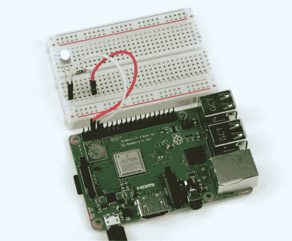

**图 2-9** 一只高兴的闪烁 LED 连接到树莓派上

要停止你的程序并让 LED 停止闪烁，按下 CTRL-C。

故障排除指南：为什么 LED 不闪烁？

如果你的 LED 没有闪烁，不要惊慌。你可能通过一些故障排除就能修复电路。首先，检查一下你的 LED 是否正确插入。因为 LED 是一种*二极管*，电流只能朝一个方向流动，所以如果 LED 插反了，它就不会亮！它会什么也不做。回去查看说明，确保你按照要求正确连接了。

如果这没有解决你的问题，检查一下电路的其余部分。所有连接都正确吗？所有的电线都牢固吗？检查一下你是否将电路接到了树莓派 GPIO 端口的正确引脚上——这是一个很容易犯的错误！

如果你确信电路没有问题，并且你的 LED 和电阻是合适的（如零件列表中所述），那么可能是软件问题。当你运行程序时，它崩溃了吗？出现错误信息了吗？你可能在从本书中复制代码时犯了个错误。回去检查一下，或者从[*https://nostarch.com/raspirobots/*](https://nostarch.com/raspirobots/)获取代码文件，然后运行那里的*blink.py*文件。

GPIO Zero 库在所有新的 Raspbian 版本中默认包含，但如果你使用的是旧版本的 Raspbian，你可能需要手动安装该库。为此，输入以下命令：

pi@raspberrypi:~/robot $ sudo apt-get update

然后输入以下命令：

pi@raspberrypi:~/robot $ sudo apt-get install python3-gpiozero python-gpiozero

#### 挑战自己：改变闪烁的时间

看一下你用来让 LED 闪烁的代码。如果你修改其中的一些代码，会发生什么呢？例如，你可以尝试改变`sleep()`语句的时间，看看能做出什么不同的模式！多试试，看看你的修改带来了哪些效果。

**注意**

*如果你想关闭你的树莓派，应该先通过软件安全关闭，然后再拔掉电源线。要开始关机序列，使用命令`**sudo shutdown now**`。等几秒钟再拔掉电源线。如果你使用的是直接连接的显示器，也可以在图形界面的主菜单中选择关机选项。*

### 按钮的输入：树莓派 GPIO 输入

让 LED 闪烁是进行树莓派电子学和物理计算的完美入门实验，但它只展示了树莓派 GPIO 引脚的*输出*功能。GPIO 引脚还可以接受*输入*，这意味着它们可以接收来自外部世界的数据并做出反应。在这一部分，你将为树莓派接上一个按钮，并编写一个程序，使其在按钮被按下时触发。

#### 配件清单说明

本书中的项目是循序渐进的，因此，除了树莓派和面包板外，本项目还需要一个按钮和两根 M-F 跳线。

按钮有成百上千种不同的形状、大小和种类。在这个项目中，你需要获取一个适合面包板使用的*瞬时按钮*，就像图 2-10 所示的那样。

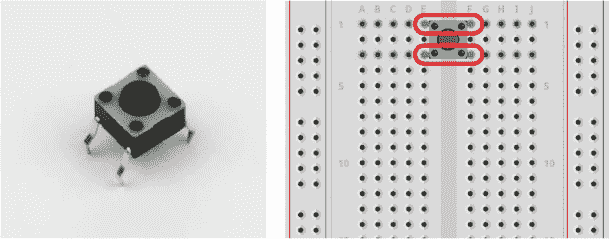

**图 2-10** 四脚瞬时按钮及其腿部对的示意图

按钮通常被称为*开关*，大多数按钮有两个或四个脚，连接到面包板的各个点。瞬时开关的功能很简单：当按钮被按下时，按钮内部的接触点会连接在一起，从而完成电路。当按钮松开时，内部的接触点会分开，电路就不再完整，电流也就无法流动。这意味着你的电路只有在按钮被按下时才会连接，这就是为什么它被称为“瞬时”的原因！

对于具有两个脚的按钮，当按钮被按下时，两个脚会连接在一起，这一点很明显。对于四脚按钮，情况就复杂一些。按钮的脚是成对排列的，因此你实际上只需要关心其中的两根。通常，像图 2-10 中所示的那样，按钮的对立两根脚是连接在一起的，这意味着每对中的一根脚只需要连接到电路上。如果你不确定哪些脚是成对的，请查看按钮的规格。

#### 接线你的按钮

准备好配件后，你现在可以接线按钮了。请参考图 2-11 中的面包板示意图进行连接。

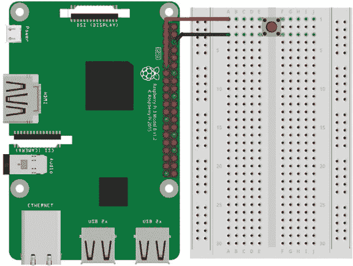

**图 2-11** 接线按钮的面包板示意图

如果你刚完成前一个项目并且仍然将 LED 连线到你的 Pi，可以随意拆开电路或将按钮接入面包板的不同部分——只要确保每个项目使用不同的面包板行。一旦准备好设置下一个电路，请按照以下说明操作：

1.  将你的按钮插入面包板，并确保每个引脚都位于它自己的行中。你需要将按钮插入，使得两个引脚分别位于面包板中间行分隔器的两侧。

1.  在 Raspberry Pi 关闭的情况下，使用跳线将分隔器一侧的一个引脚连接到 Raspberry Pi 上的地线引脚（物理引脚 6）。

1.  使用另一根跳线将分隔器同一侧的另一个引脚连接到 Raspberry Pi 上的引脚 11（BCM 引脚 17）。如果你不确定哪个引脚是哪个，可以查看第 201 页的引脚图。

在你的 Pi 设置与图 2-12 中的我的设置相同的情况下，现在你需要编写一个程序，当按钮被按下时，从按钮获取输入。

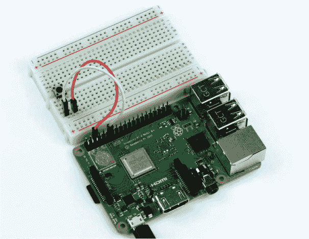

**图 2-12** 完整的按钮和面包板设置

警告

完成后，你应该会有一个像图 2-11 中所示的电路设置。请确保接线正确。开关的电阻非常小，它会非常紧密地连接两个电路。错误的连接可能会对你的 Pi 造成危险！

#### 编程你的 Raspberry Pi 以显示按钮的输入

从终端中，确保你处于第一章中创建的文件夹。 如果你刚完成之前的迷你项目，你很可能已经处于该文件夹中，但如果不是，可以使用以下命令从主目录进入*robot*目录：

pi@raspberrypi:~ $ cd robot

现在创建一个新的 Python 程序，以便从 Nano 中的按钮获取输入。我创建了一个名为*button.py*的程序，如下所示：

pi@raspberrypi:~ $ cd robot

你会看到一个熟悉的空白 Nano 界面。输入清单 2-2 中的代码，来使你的按钮正常工作。

```
➊ import gpiozero

➋ button = gpiozero.Button(17)

   while  True:
    ➌ if button.is_pressed:
        ➍ print("Button is pressed!")
    ➎ else:
           print("Button is not pressed!")
```

**清单 2-2** 获取按钮输入的程序

我们以与闪烁 LED 项目 ➊ 完全相同的方式导入 GPIO Zero 库。本书中的所有电子项目都会使用此库，所以你可以在本书中的所有程序中看到这一行！

然后我们创建一个名为`button`的变量 ➋，将来自 GPIO Zero 库的按钮软件分配给该变量，并确保在括号中指定按钮连接到 BCM 引脚 17。

然后，我们像在 LED 程序中那样开始一个`while`循环，但与之前的程序不同，这个代码块中的第一行是一个`if`/`else`语句。在编程中，`if`语句是条件语句，当满足某个条件时激活某段代码。我们的`if`语句几乎可以直接翻译为英文“如果按钮被按下，执行以下操作” ➌。当`if`语句为真时，缩进的行 ➍ 会被执行，并在终端打印一串文本，告诉我们按钮已被按下。

通常，虽然不是总是如此，当有条件的`if`语句时，通常会有一个`else`语句，因为如果按钮没有被按下，必须发生某些*其他*事情！`else`语句 ➎ 可以翻译为英文“如果发生其他情况，执行以下操作。”然后，`else`语句后的缩进代码块被执行，并在终端打印出按钮没有被按下。

因为`if`/`else`语句位于一个条件为`True`的`while`循环中，所以代码会无限运行，除非程序被停止。一旦完成输入程序，你可以像平常一样退出 Nano 文本编辑器：按 CTRL+X，在提示符下按 Y 键保存更改，然后按 ENTER 确认文件名为*button.py*。

#### 运行你的程序：获取来自按钮的输入

要运行你的程序，只需在终端输入以下内容：

pi@raspberrypi:~/robot $ python3 button.py

你现在应该会看到“按钮没有被按下！”这一语句在终端中反复出现。当你按下按钮时，“按钮已被按下！”的语句应当被打印到终端。

pi@raspberrypi:~/robot $ python3 button.py

按钮没有被按下！

按钮没有被按下！

按钮已被按下！

故障排除指南：为什么按钮没有工作？

就像在之前的迷你项目中一样，如果你的按钮没有工作，不要担心！首先检查电路。所有接线正确吗？电线牢固地插入了面包板吗？你把按钮接对了吗？如果你的开关与我的型号稍有不同，你是否查看了它与我模型的差异？如果你认为电路没有问题，可能是你在从本书复制代码时犯了错误。回去检查，或者从*[`nostarch.com/raspirobots/`](https://nostarch.com/raspirobots/)*下载代码文件。

要终止你的程序，请按 CTRL-C。

#### 挑战自己：将按钮和 LED 程序结合起来

看看你能否将本章中的两个迷你项目结合起来。尝试创建一个程序，当按住按钮时闪烁 LED，或者一个程序，直到按钮被按下，LED 保持开启。

### 总结

在这一章，你通过两个小项目初步接触了电子学。你学到了很多理论和基础知识，这些都将在接下来的章节中帮助你构建机器人。我还介绍了一些关键的编程技巧和概念——未来我们会大量使用`if`/`else`语句和循环。

在下一章，我将带你完成制作第一个机器人的过程。我们将涵盖你需要的材料和工具，以及具体的构建过程。
