## 第三章：构建你的机器人

机器人有各种形状、尺寸和设计，几乎能满足你能想象的所有需求——从国际空间站上的机械臂到为娱乐而设计的玩具机器人。

机器人可以根据特定任务进行定制，但要做到这一点，首先你需要了解并构建机器人的基本组件。在本章中，我将向你展示如何制作基本的机器人，你将基于它进行修改和改进，直到本书的最后。编程完成后，这个机器人将能够根据你的指令移动。在后续章节中，我们将为你的机器人添加传感器、灯光和摄像头，使其更加炫酷和智能！

### 你的第一个机器人

移动的机器人可以分为两大类：有轮子的和没有轮子的。没有轮子的通常是*类人型*，即具有两条腿并且类似人类，或者是基于动物的，比如狗（参见图 3-1 中的一些示例）。这些机器人通常*非常*难以制作和编程，因为构建者需要考虑平衡、运动以及许多其他因素。

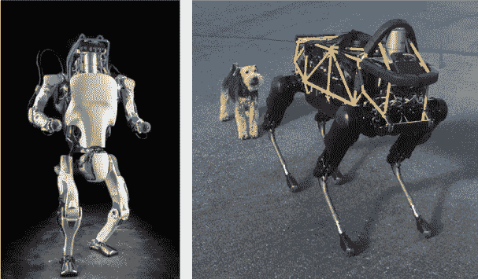

**图 3-1** 来自波士顿动力的机器人

相比之下，使用轮子（或履带）的机器人占据了现实世界中机器人应用的大部分，它们没有复杂的平衡问题，因此非常适合像我们这样的爱好者和创客。一个著名的轮式机器人是 NASA 的*好奇号*漫游车，它有六个轮子，自 2012 年以来一直在火星上移动，进行着惊人的科学发现！

对于你的第一个机器人，你将制作一个如图 3-2 所示的双轮机器人。双轮机器人是机器人世界中的一个很好的起点。你的机器人将能够前进、后退，并通过每个轮子上的一个电机来实现左右转动。

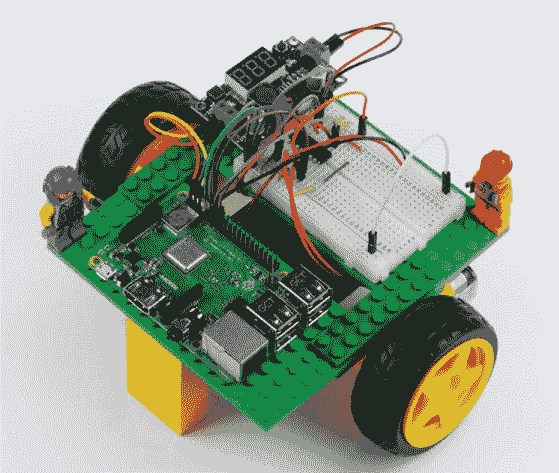

**图 3-2** 我的完整树莓派机器人。到本章结束时，你也将拥有一个！

你将在本章中制作的这款双轮机器人具有完美的功能组合——它既经济实惠，又易于操作，且具有良好的机动性！

### 你将需要的材料

除了你的树莓派，你还需要一些其他的基本元件来组装你的机器人。就像创客世界中的所有事物一样，你可以根据可用的材料和组件进行选择，*选择非常多*。

如果这是你第一次使用树莓派和电子元件，我建议你使用我列出的相同配件，这样你就可以逐字按照说明操作。如果你有一些经验并且有自己的想法，那么可以自由探索；你不必坚持我推荐的内容。

**面包板** 我推荐使用一个 400 点的面包板，并且具有电源轨，就像第二章中使用的那种。

**跳线** 我推荐使用一套不同颜色和长度的面包板跳线。

**底盘** 这是机器人的身体，应该至少为 6 英寸 x 5.5 英寸。我正在使用乐高（请参阅下一个部分了解其他选项）。

**两个有刷直流电机** 使用 5V 至 9V、100mA 至 500mA 的电机，配有轮胎和集成齿轮箱。

**电池盒** 找一个可以容纳六节 AA 电池的电池盒。

**六节 AA 电池** 一次性电池或可充电电池都可以；我推荐松下的 Eneloop 可充电电池。

**LM2596 降压转换器** 这是一个降压电压转换器。

**L293D 电机驱动器** 这是一个集成的电机控制芯片。

你还需要各种螺丝刀、热熔胶枪、多用电表和焊接铁。

接下来的几个部分将提供有关每个组件及其功能的更多细节。如果你想直接跳到构建机器人的部分，请前往第 60 页。

#### 底盘

*底盘*是机器人的基础框架，你可以把它看作机器人的“身体”。底盘构成了你将安装树莓派和其他部件的平台。

你可以使用多种不同的材料制作你的底盘，但无论你设计什么，底盘需要满足以下三个标准。底盘需要：

**一个强大而稳定的平台** 所有机器人的电子元件都将安装在底盘上，因此你需要确保它不脆弱。

**至少 6 英寸 x 5.5 英寸** 随着你在本书中的进展，你将向你的作品中添加越来越多的组件，因此你需要为扩展预留空间。不要担心让你的机器人底盘变得*庞大*，但也要确保它不至于太小！

**易于修改** 拥有一个易于修改、扩展和更改的底盘意味着你将来可以对你的机器人进行更多的定制！

乐高是我为初次构建机器人所偏好的材料。每个人都喜爱的积木能够制作出完美的机器人底盘。借助种类繁多且易于获取的积木和配件，你可以轻松地用乐高零件制作各种形状和大小的底盘设计。在本章中，我将展示如何使用图 3-3 中的零件来构建我的底盘。

硬纸板是另一个不错的选择，因为你可以随处获得它，且容易加工。一些简单的裁剪、折叠和粘合即可将硬纸板制作成各种底盘形状。卡纸越厚越好！你可以用任何回收的纸箱制作一个结实的纸板底盘——无论是鞋盒、亚马逊包装盒，还是麦片盒，都可以！

**图 3-3** 我用来制作机器人底盘的乐高零件，见图 3-2

如果你有一些简单的木工工具，比如木锯，那么用木材制作机器人底盘可能是个不错的主意。像松木和中密度纤维板（MDF）这样的廉价木材和木材复合材料，可以以低价制作出强固且稳定的底盘。

定制的塑料底盘可以成为一个外观不错的机器人基础。你可以以相对低廉的价格购买亚克力（Plexiglas、Lucite、Perspex）板，并用手锯或更好的带锯切割它们。更好的是，如果你能使用激光切割机，它能够根据计算机给定的精确尺寸和设计，制作出完美的机器人，就像你在图 3-4 中看到的那样。可以查看你所在地区是否有共享激光切割机的创客空间或黑客空间。

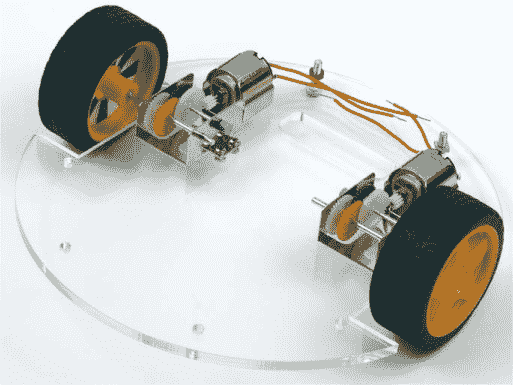

**图 3-4** 我在英国剑桥的创客空间设计并制作的定制激光切割机器人底盘

你还可以使用 3D 打印机处理塑料。3D 打印机通过加热并挤出塑料层，逐层构建物体。你可以在计算机辅助设计（CAD）软件中设计底盘，或者你也可以从互联网上下载并打印其他人的设计。随着 3D 打印机越来越普及，你可能会在本地图书馆、创客空间或黑客空间找到一个，或者你可能认识一个拥有 3D 打印机的人。

如果你不想自己制作底盘，你可以在网上购买各种基础套件。这些大多数是由一层或两层亚克力板组成，可以用螺丝和支柱将它们固定在一起（见图 3-5 中的示例）。你可以通过在互联网上搜索“机器人底盘”来找到预制底盘。eBay 通常有一些非常优惠的交易。

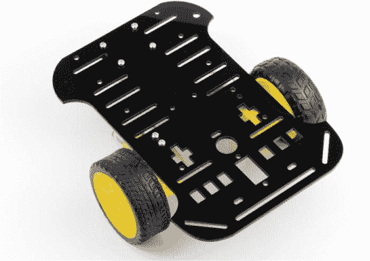

**图 3-5** 带电动机的预制底盘

#### 电动机

没有电动机，你的机器人就不能移动。一个不能移动的机器人，谈不上是个机器人！让我们了解一些电动机的基础知识，这样你就能知道什么时候使用哪种电动机。

##### 什么是电动机？

电动机将电能转换为机械能。电动机有各种不同的大小和设计，并且价格范围广泛。对于本书，你将需要购买两只（每只轮子一个）最便宜的电动机类型：*直流电动机*。这类电动机是最常见的，几乎所有设备里都有，从火车到台式风扇都可以找到它们。

*DC* 代表*直流电*，这意味着电流必须以一个方向通过电动机才能使其工作。直流电动机的替代品——例如交流电（AC）电动机和步进电动机——通常更贵、使用更复杂且电子学上更复杂，所以我们现在暂时使用直流电动机。

我们将使用的超简单电动机有两个端子。端子就是电流进出元件的点。当你在这些端子上施加电压时，电动机的轴会旋转。如果你改变电压的方向（有时称为*反转*电压），电动机会反向旋转。

你可以花越来越多的钱来购买更好的电动机。最好的做法是先从*非常便宜*的电动机开始，掌握基础，再投资更昂贵的设备。

##### 电动机选项

对于第一次搭建机器人，选择一对*有刷*（非无刷）直流电机。在有刷和无刷电机中，电流会产生电磁力，推动电机轴旋转；然而，无刷电机更为复杂，并且需要额外的昂贵电路才能正常工作。无刷电机通常用于更为严肃的任务，比如遥控模型飞机和无人机。

你可以在任何常见的在线零售商处以不到 10 美元的价格购买一对有刷直流电机（可以查看“你应该在哪里买零件？”在 xix 页上的零售商列表）。购买之前，确保查看电机的规格。你需要考虑以下几个因素。

我建议选择额定电压在 5V 到 9V 之间的电机。如果电机的电压要求过高，你将会很难为其提供足够的电力，并且可能需要更多的电池。如果电机的电压过低，电源提供的电压（参见下一节）可能会导致过热并损坏电机！

电机所需的电流也是非常重要的。需要更多电流时，电池消耗得会更快，电机的控制也会更加困难。另一方面，电流较少意味着电机功率较小，可能会在推动机器人时力不从心。尽量确保你的电机每个额定电流不超过 500 mA。电流过大会使我们稍后使用的电机控制器超载。

便宜的电机通常具有较高的*转速（RPM）*，每分钟转动大约 1000 到 3000 次，对于小型机器人来说，这个速度太快了。在这些转速下，每个电机的*扭矩*非常小。扭矩是驱动力，扭矩越小，机器人在表面上移动时就会越吃力。为了解决这个问题，你的电机需要一个齿轮箱来降低转速并增加扭矩。原始转速与降速后转速之间的比例叫做*减速比*，48:1 是本项目的一个不错的减速比。在寻找电机时，确保你查找的是已经预装小型齿轮箱的电机，可以使用“有齿轮的爱好电机”作为关键词。

没有轮子的电机是没用的。大多数电机会有一个*轴*，你可以将轮胎安装到上面，当电机运转时，轴会转动并推动轮胎。如果你购买的是没有轮胎的电机，你将需要找到适合电机轴的轮胎，这可能会有些困难。我建议购买带轮胎的电机。抓地力强的橡胶轮胎会让你更好地控制机器人。或者，你也可以尝试自己制作轮子，尤其是当你有 3D 打印机等精密设备时。

我使用的电机，见 图 3-6，符合所有这些标准。这些是常见的爱好者电机，配有齿轮箱和轮胎。它们的工作电压范围从 3 V 到 9 V，每个电机的电流大约为 100 mA。你可以以低至 $5 的价格购买一对。我是通过在 eBay 上搜索“机器人电机带轮胎”找到的，但在其他许多地方也能广泛购买到。

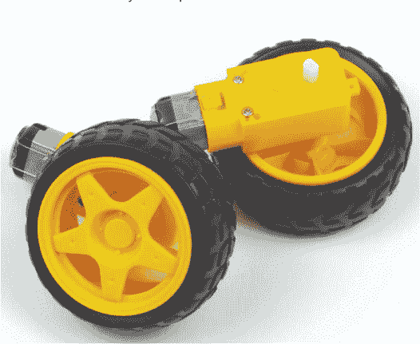

**图 3-6** 我的机器人电机和轮胎

大多数直流电机在出厂时不会附带连接到两个端子的电线。如果你的电机是这种情况，你需要*焊接*电线到电机上。焊接是通过将一种叫做*焊料*的填充金属熔化并将其放置在两个部件之间，来将两个部件电气连接在一起的过程。刚开始可能会觉得非常难，但别担心——它其实非常简单，而且是一个超级重要的技能！更多信息请查看 第 204 页的“如何焊接”。

如果你真的想避免焊接，你可能能在线找到已经焊接并连接到端子的电机。只要记住，这些电机可能很难找到，而且价格可能会更高！

#### 电池

为了确保我们的机器人能够自行移动，我们将使用电池供电，这样就不会有拖动的电源线。*电池*是一种储存能量的电化学装置。

在本书中，你将使用 AA 电池为机器人供电。它们不仅常见且便宜，而且安全易用。单颗 AA 电池通常提供 1.2 V 到 1.5 V 之间的电压，并且可以串联在一起提供更高的电压。你需要的 AA 电池数量取决于电机的电压。六颗 AA 电池串联在电池盒中将提供 7 V 到 9 V 之间的输出电压，这应该是适合你机器人的电压。

AA 电池有两种类型：*一次性*（不可充电）和可充电电池。一次性电池较便宜，但只能使用一次，使用后需要负责任地丢弃。这意味着，随着时间的推移，使用一次性电池的成本会逐渐增加。我建议投资一些高质量的可充电电池和一款不错的充电器。初期开销可能较高（$20–$30），但从长远来看，你会节省资金并且更环保！我使用的是松下的 Eneloop 可充电 AA 电池，见 图 3-7。请记住，可充电电池的电压通常比一次性电池稍低（AA 电池通常为 1.2 V，而非 1.5 V）。

为了存放并连接这些电池，你需要一个*电池座*。它不仅可以固定电池，还能将电池的端子连接起来，使得你只需要一根正极线和一根负极线即可从所有电池中获取电源。这些电池座在网上有很多售卖。我从 eBay 购买了一个带开关的六节 AA 电池座，价格为 1 美元，如图 3-7 所示。

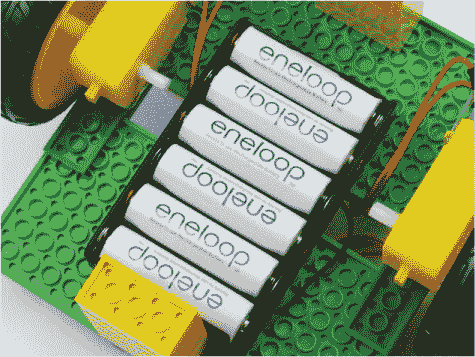

**图 3-7** 我带有六节 AA Eneloop 可充电电池的电池座

#### 电压调节器

警告

*一些降压转换器需要电压“头部裕量”才能正常工作。例如，我使用的 LM2596 模块要求输入电压比输出电压高至少 2V。这意味着，在最坏的情况下，我的 LM2596 模块的最大输出电压为 7.2V – 2V = 5.2V。当我使用六节 AA 电池（提供 7V 到 9V 电压）时这不是问题，但如果我使用四节 AA 电池（仅提供 6V），我可能无法获得 5V 输出，从而无法为 Raspberry Pi 提供足够的电力。如果你使用的是不同的降压转换器，务必检查其网上清单或数据手册以获取详细信息。*

尽管你的电动机可以愉快地使用电池提供的 7V 到 9V 电压运行，但你的 Raspberry Pi *肯定*无法启动。你的 Raspberry Pi 严格依赖 5V 电压（容忍范围为±0.1 伏）。如果电压过低，Pi 将无法启动。如果电压过高，你的 Pi 将被烧毁！提供过高的电压会导致过大的电流流过 Pi 的内部组件，最终使 Pi“爆炸”（实际上意味着处理器会冒出一缕蓝烟，并且不可逆转地损坏）。

为了避免让你的 Pi“爆炸”，你可以使用一种简单的电压调节组件，称为*降压转换器*，将 7V 到 9V 电压转换为 Pi 所需的 5V 电压。降压转换器将输入电压降低到所需的输出电压。我们将使用基于 LM2596 芯片的转换器，它已经被整合成一个易于使用的模块板，如图 3-8 所示。这个模块可以接受 4V 到 40V 之间的输入电压，并将其转换为 1V 到 35V 之间的任何电压。稍后我会在本章中向你展示如何将其设置为 5V，以便为 Raspberry Pi 提供电力。

你可以在网上购买一个 LM2596 模块，或者其他类似的降压转换器，价格仅为几美元。如果你决定使用其他型号，确保它能够持续输出*至少 2A 的电流*。这些信息应该可以在产品的清单或*数据手册*中找到，数据手册是详细描述组件技术特性的参考资料。同时注意，你应该购买一个带有螺丝接线端子的降压转换器——这样可以让事情更简单，也避免了更多的焊接工作。

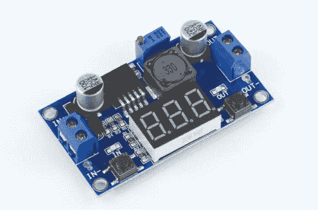

**图 3-8** 一款 LM2596 降压转换模块

#### 电机控制器

你的直流电机每个最大电流为 500 mA。相比之下，树莓派的 GPIO 引脚总共只能提供 20 到 50 mA 的电流。这意味着你的电机需要直接由单独的电池组供电。这并不是什么大问题，但这也意味着树莓派不会直接连接到电机，因此你需要一个*电机控制器*来作为电机、电源和树莓派之间的接口。电机控制器可以让你使用树莓派控制电机的开关，并调节电机的速度。

市面上有许多不同种类的电机控制器，且有各种各样的封装形式。你可以购买驱动芯片、模块板，甚至是*HAT*（官方树莓派*硬件附加在顶部*）。每种选择都有其优点和缺点。

在本书中，我将使用一种叫做*集成电路（IC）*的芯片，型号为 L293D。像我的 L293D 那样的适合面包板使用的 IC（见图 3-9）是一个小型黑色盒子，里面包含了一些微型化的电子元件，如电阻器、晶体管和电容器。你可以将 IC 的引脚插入面包板，并将它们连接起来，以提供额外的电路功能。L293D 可以完全控制最多两个独立的电机——非常适合你的第一个机器人！

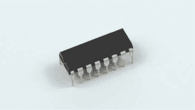

**图 3-9** 一款 L293D 电机控制器芯片

如果你想了解更多关于 L293D 电机驱动芯片的详细功能，可以在网上搜索它的数据手册。你可以在线以不到 4 美元的价格购买一颗 L293D。

#### 推荐工具

在机器人构建过程和本书的后续章节中，你将需要一些基本工具。这是你需要的所有工具的清单，以及一些可选的工具，虽然不是严格必要的，但可能会对你有所帮助：

+   多种螺丝刀

+   热熔胶枪

+   万用表

+   焊接铁

### 组装你的机器人

一旦你有了机器人所需的所有组件，就可以开始组装并接线了！如果你购买了我之前列出的相同组件，你可以完全按照我的说明操作。如果你购买或制作了稍有不同的组件，你可能需要发挥一些创造力，但以下的说明应该是一个非常好的指南，不管你拥有的零件是什么。

#### 制作底盘

如前所述，我是用 LEGO 积木制作我的机器人底盘，因此这些说明将采用这种方式。

你可以使用 LEGO 积木以无限种方式和组合制作底盘。我的底盘非常简单，使用了如下零件，见图 3-10：

+   两块 8×16 的板

+   四块 2×8 的板

如果你想购买这些准确的 LEGO 积木并严格按照这个过程操作，可以使用*“Pick A Brick”*服务，访问*[`shop.lego.com/en-US/Pick-a-Brick/`](https://shop.lego.com/en-US/Pick-a-Brick/)。在这里，你可以通过搜索元素 ID 来订购单个零件，构建你自己的定制创作。你需要以下零件：

+   两个 8×16 板，ID 4610353

+   四个 2×8 板，ID 303428

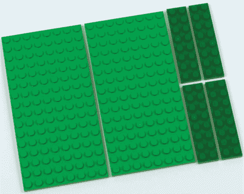

**图 3-10** 我用来构建底盘的乐高零件

将这些 ID 号码输入元素 ID 搜索框，你应该能找到它们。

值得注意的是，根据乐高官网的说明，你可能需要等待最多 10 个工作日才能收到你的零件！如果你选择使用乐高零件制作底盘，之后的构建过程中你还需要其他砖块，所以我建议你一次性订购所需的所有砖块。

8×16 板的尺寸非常适合分别安装树莓派和面包板。我在我的底盘上留了两个乐高板之间的空隙，这样方便将电线整齐地穿过。

按照我的设计，将两个 8×16 板放置在两个乐高钉子之间，然后在上面安装两个 2×8 板将较大的板固定在一起。将另外两个 2×8 板固定在底部，使其更加坚固，如图 3-11 所示。

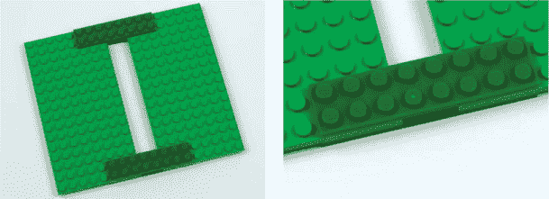

**图 3-11** 完成的乐高底盘：右侧是由 2×8 板组成的接头的特写

这将把板子夹在一起，创建一个坚固稳定的平台。

#### 安装电机

底盘构建完成后，你可以开始安装并接线各种组件，从电机开始。在将电机安装到机器人主体之前，确保电机的端子上已经焊接了电线！再次参考第 204 页上的《如何焊接》部分，了解如何操作。

你需要将电机安装到底盘的底部，确保车轮尽可能靠近车身的中心，这样可以让你的机器人拥有较小的转弯半径——意味着它能做更紧的转弯。我会给你一些固定电机的选择。无论你选择哪种方式，确保电机对齐并尽可能平行。不平行的电机会导致机器人行驶方向的冲突，可能会阻止机器人沿直线行驶。

##### 永久选项：胶水

使用热胶枪或超级胶水粘合可以将电机牢固且永久地粘附在底盘上。这是我固定电机到底盘的首选方法，但在粘合前请三思，因为它是永久性的！确保你完全满意电机的位置再进行粘合。

如图 3-12 所示，胶水涂抹均匀可以确保电机连接牢固，不会晃动。

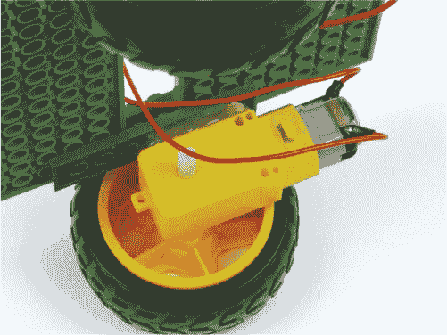

**图 3-12** 用热胶固定电机

##### 较不永久的选项：魔术贴或螺丝

传统的魔术贴材料（更常见的名字是 Velcro）是一种非常好的方式，可以将物品非永久性地固定在一起，无需工具也不会弄得一团糟。我最喜欢的品牌是 3M Dual Lock，这是一种非常强力的魔术贴垫，虽然价格比其他解决方案稍贵，大约每米$15。魔术贴通常有一个粘性背面，所以你可以根据需要剪裁，撕开保护膜，然后将其粘贴到底盘上。如果你发现这不够牢固，或者对于安装电机来说太灵活，我建议在 Velcro/Dual Lock 的边缘加一点胶水。

另外，一个不那么永久性的选择是使用螺丝。如果你做了一个木质、激光切割的塑料或 3D 打印的底座，可以将电机用螺丝固定到底盘上。有些电机甚至自带支架和螺丝，专为此目的设计。这是一种稳固的方式，而且你可以随时卸下电机，用于其他项目。

##### 更不永久的选项：胶带

双面胶带适用于轻松、无麻烦地固定零件，类似于魔术贴，尽管这是最弱的选择。

#### 稳定机器人

在将电机固定到底盘底部后，将每个电机的两根电线通过缝隙引导到平台顶部，如图 3-13 所示。

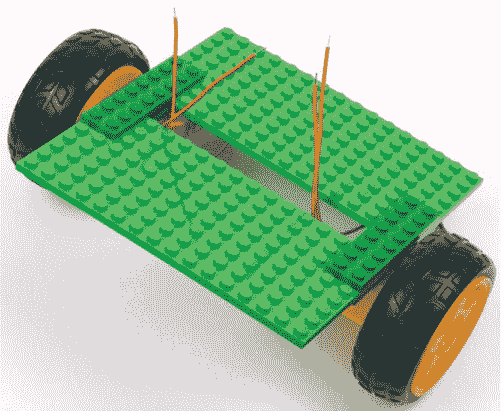

**图 3-13** 电机连接的底盘，电线通过缝隙引导

当你的两个电机固定在机器人底盘的中央时，你可能会发现平台不稳定，并且重心偏向较重的一侧。别担心：你可以轻松修复这个问题！

*稳定器*可以防止你的机器人摇晃，并确保平稳移动。每侧只需要一个稳定器，它可以由任何材料制作。由于我使用的是 LEGO 底盘，我的稳定器是用 LEGO 积木做的！我在机器人前后底部各放了两个五层深的 2×4 积木柱子；这些柱子会稳定重量，但不会接触地面，所以在平滑表面上运行时，它们不应阻碍运动。这些导轨已经完全消除了摇晃；见图 3-14。

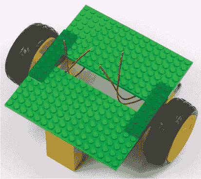

**图 3-14** 带有 LEGO 稳定器的底盘，位于前后底部

如果你还使用 LEGO 零件，可能需要更多或更少的积木——只需确保你的稳定器从底盘底部延伸到离地面略高的位置。小心不要让稳定器太长，因为它们可能会妨碍机器人运动，或者完全将电机悬空！

如果你不想用 LEGO 积木做稳定器，你可以使用任何其他材料（如塑料片、木材等），只要它能放置在底盘和地面之间，并且能够牢固地固定到你的底盘上。

一个常见的选择是使用一个或两个万向轮或球；这些是非电动的轮子或球，专门用于平衡机器人。你应该能在网上找到合适尺寸的产品——只需测量底盘到地面的距离（当底盘保持水平时），你通常还会发现这些万向轮带有螺丝安装孔，这使得它们特别适合用在木质或塑料底盘上。

你可以在线购买的许多机器人平台通常是完整套件，包含电机、轮子和万向轮。这是节省时间的好方法，特别是当所有的孔位都已经为你钻好时。

#### 安装电池

现在你已经将电机安装到机器人上，可以固定电池盒和电池了。确定电池的安装位置需要考虑两个关键因素：

**空间** 你的电池盒需要多少空间？电池盒的线缆能否连接到底盘顶部？电池盒会妨碍机器人运动吗？

**访问** 在某些时候，你需要拆卸电池并进行更换或充电，因此你需要确保电池盒的位置便于访问。不要犯将电池盒永久粘贴上去的错误，之后却无法取出电池！

警告

*确保在电池安装时，电池盒的正负极线不会意外接触。如果接触了，会导致短路，进而引起快速加热，甚至可能损坏电池。*

我将我的电池包安装在 LEGO 底盘的底部，并置于电机之间，如图 3-15 所示。这是一个不错的选择，因为它使得顶部可以留空，以便安装你需要更频繁访问的组件，比如树莓派，同时仍能方便地更换电池。我使用了可靠的 3M Dual Lock 将电池盒固定到位。尽量将电池盒安装在中心位置，以保持平衡。

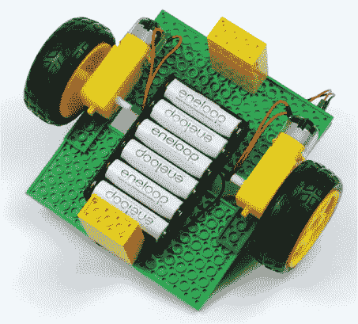

**图 3-15** 安装了电池盒的机器人底部

一旦将电池盒固定好，就可以将新电池或充满电的电池插入，并将电池盒的线缆穿过底盘顶部。

#### 安装树莓派、面包板和降压转换器

在安装好电机和电池后，将机器人翻转至正确的位置，安装关键电子组件：你的树莓派、面包板和降压转换器。

8×16 LEGO 板的尺寸完美适配一个树莓派和一个面包板。正如你在图 3-16 中看到的，我将树莓派安装在一个板上，面包板安装在另一个板上。在右下角，你还可以看到 LM2596 降压转换器。这是我推荐的部件布置方式。

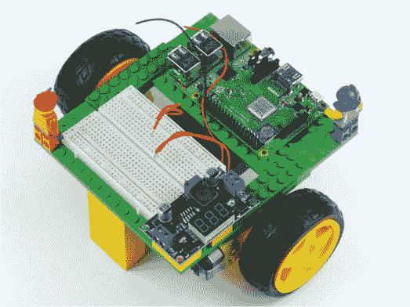

**图 3-16** 安装了树莓派、LM2596 和面包板的底盘

由于你可能还想再次使用你的 Pi，我建议使用一种非永久性的粘合剂。我使用了粘性粘土小心且非永久性地固定了我的 Pi。大多数面包板都配有粘性背面，所以我只是撕下了背面的保护膜，利用粘合剂将面包板牢固地固定在 LEGO 板上。如果你的面包板没有粘合背面，那么我也建议你使用粘性粘土来固定它。

根据你的外壳材质，你可以选择不同的方式来固定你的电子设备。最新的树莓派及其早期型号都有螺丝孔，因此你可以使用一组小螺丝将树莓派固定到木质或塑料外壳上。

我将 LM2596 降压转换器模块使用更多的粘性粘土固定在面包板旁边，并通过两个 2×2 的 LEGO 积木将其悬挂起来。当你这样做时，确保电压调节器的螺丝端子可以轻松访问，并且不被面包板或其他物品阻挡，因为稍后你需要连接电线到这些端子。

#### 为树莓派接入电源

在你为电动机接线之前，你需要为机器人大脑——树莓派——提供电源。

如前所述，确保你的 Pi 获得 5V（±0.1V）的电压至关重要，而不是你电池提供的 7V 或 9V（或其他电压）。这意味着你需要调整降压转换器，使其输出精确的 5V 电压。

最好的方法是借助一种叫做*万用表*的工具，如图 3-17 所示。你应该能在线以低至$10 的价格购买一台万用表。

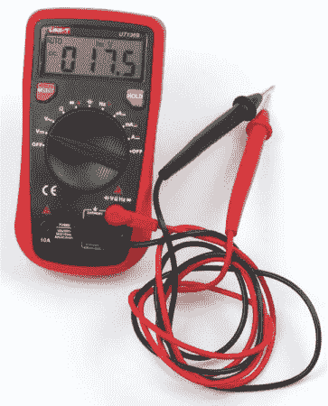

**图 3-17** 万用表，设置为读取电压

万用表是一种电子测量仪器。普通万用表可以测量电压、电流和电阻。我们需要测量的是电压。

一些电压转换器，比如我正在使用的 LM2596 模块，确实配有一个小 LED 屏幕，可以显示电压读数。理论上，这样就不需要使用万用表，但仍然建议使用万用表来再次检查输出电压。万用表将来也会派上用场，所以这是一项明智的投资。

我们将通过 Pi 的 GPIO 引脚连接电源。按照这些说明小心操作，慢慢来，你的 Pi 将会安全供电，不会烧坏！但不要太担心：这种为 Pi 供电的方法已经经过多次测试，正确操作的话完全是安全的！

##### 设置转换器

首先按照以下说明设置你的降压转换器——此时你还不需要将它连接到树莓派。翻到图 3-21 查看降压转换器设置的最终电路图。你还可以查看图 3-19 中的降压转换器特写图像。

1.  将电池组的两根电线分别连接到面包板的*不同*列和行上。大多数面包板的两边都有两排带红色和蓝色线的电源轨，或者末端标有+或-符号；这些电源轨被称为*电源轨*。为了帮助区分负电源和正电源线的位置，将电池组的黑色（负）电线连接到面包板蓝色负电源轨的一侧，将红色（正）电线连接到该侧的红色正电源轨。请查看图 2-4 在第 34 页上的电源轨示意图。

    | **电池组** | **面包板** |
    | --- | --- |
    | 红色，正电线 | 正电源轨 |
    | 黑色，负电线 | 负电源轨 |

    现在我们来连接 LM2596 模块。大多数 LM2596 降压转换器模块都配有*十字螺丝端子*。要连接电线，只需松开你需要连接的端子，将电线插入前面的孔中，然后拧紧螺丝以确保连接牢固。

1.  取一根红色和一根黑色的 M-M 跳线，将它们分别插入正负电源轨。确保电线的两端在此过程中不会接触到。现在，松开 LM2596 模块上标有 VIN（输入电压）的端子螺丝，将红色的正电线插入，并拧紧螺丝。然后，将黑色的负电线插入 LM2596 模块同一侧标有 GND（接地）的端子，如图 3-18 所示。确保正负电源线连接正确！！image

    **图 3-18** 7 V–9 V 和接地线路接入 LM2596 降压转换器

    | **LM2596** | **连接** |
    | --- | --- |
    | VIN | 红色电线，正电源轨 |
    | GND | 黑色电线，负电源轨 |

1.  接下来，打开万用表并将其设置为测量电压——大多数万用表可以通过旋转中间的旋钮到*V*来完成。然后将万用表的红色正表笔插入降压转换器的 VOUT（输出电压）端子，将万用表的黑色负表笔插入同一侧的 GND 端子（见图 3-19）。你应该能在万用表上看到降压转换器的输出电压读数。暂时不用担心读数的具体数值！！Image

    **图 3-19** 降压转换器的特写

1.  当万用表连接好并且你可以看到电压的变化时，使用螺丝刀旋转降压转换器顶部的*调节螺丝*（参见 图 3-19）。插入螺丝刀后，不论是向左还是向右旋转，电压读数应该会发生变化。找出正确的旋转方向，然后继续旋转螺丝，直到万用表显示 5 V（±0.1 V），如 图 3-20 所示。这需要一些反复试验！image

    **图 3-20** 万用表显示降压转换器输出 5 V

    **注意**

    *略微过载 Raspberry Pi，使用不超过 5.1 V 的电压是有益的。这样可以防止由于电池在电动机运行时出现小幅电压下降，导致 Pi 停机。*

1.  一旦你确认万用表显示 5 V（±0.1 V），拔掉万用表并关闭电源。

    ##### 连接转换器

    现在你已经调整了降压转换器的输出电压，可以将它连接到你的 Raspberry Pi 上。在接线之前，请确保电池关闭，或者甚至将电池从电池座中取出。

1.  拿两根 M-F 跳线——通常的规范是使用一根红色表示正极，一根黑色表示负极（接地）。你将跳线的公头连接到降压转换器的*输出*端子。像往常一样，将红线连接到正输出端（VOUT），黑线连接到负输出端（GND）上 LM2596 模块的输出端。然后，将红线连接到 Raspberry Pi 的物理引脚 2（+5 V）。最后，将地线连接到 Raspberry Pi 的物理引脚 6（接地）。参见 图 3-21 了解面包板电路图和显示 Pi 应该如何接线的图片。也可以参考 “Raspberry Pi GPIO 图解” 第 200 页。

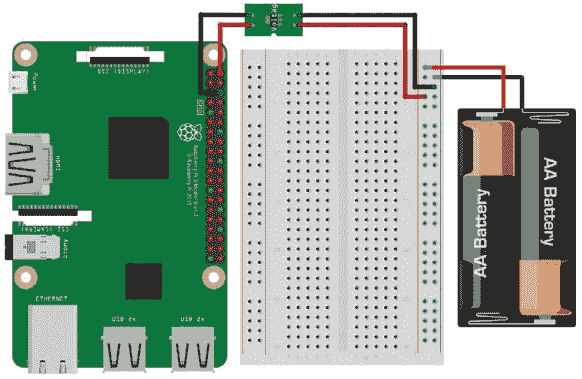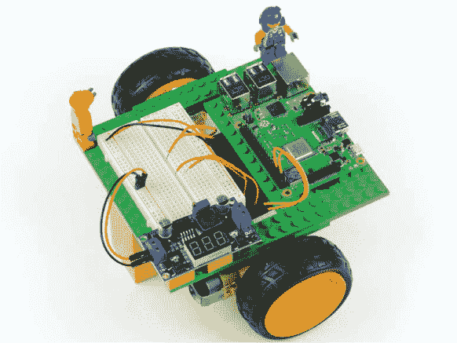

**图 3-21** 降压转换器电路的面包板示意图（上）；已接线的 LM2596 转换器（下）

警告

*在继续之前，请仔细检查你对接线和降压转换器提供的电压是否满意。如果你有任何疑问，拔掉 Pi 并使用万用表再次检查电压，然后再开机。多检查几次总是没错的！*

做得好——你已经成功将降压转换器接入 Pi 的 GPIO 引脚！现在打开电池座的电源开关（或者重新插入电池），你应该会看到你的 Raspberry Pi 像连接了微型 USB 端口一样启动。

#### 连接电动机

你构建基础机器人时的最后一步是将电动机连接到电动机控制器，然后再将电动机控制器接入 Pi。请注意，如果你使用的是与我不同的电动机控制器，过程可能会有所不同。

警告

*在开始之前，请确保你的树莓派没有通电，并且电池盒中的电池已取出或关闭。当你接线时确保树莓派关闭非常重要，这样可以避免发生短路，防止损坏元件或树莓派。*

##### 连接 L293D 电机控制器

以下说明适用于我使用的 L293D 电机控制器芯片：

1.  将 L293D 芯片牢固地插入面包板，确保所有引脚处于不同的行中，并且没有与其他元件连接。为此，将芯片放置在面包板中央的空隙上，如 图 3-22 所示。像 L293D 这样的集成电路的引脚通常不是完全笔直的，因此你可能会发现它不容易插入面包板。如果遇到这种情况，请拿起 L293D，并轻轻地将每一侧按压在平面上，将引脚弯曲成直角。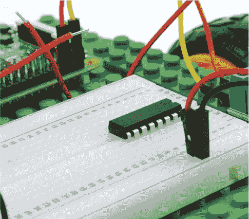

    **图 3-22** 插入面包板的 L293D

    **注意**

    *你可能已经注意到，你在面包板上使用了两组电源轨道。一个电源轨道提供来自电池的+7 V 至 9 V 电压，而另一个电源轨道则提供来自树莓派的+5 V 电压。由于这种电压差异，务必仔细检查，确保你不会将元件或其他部件连接到错误的电源轨道！*

1.  L293D 有 16 个引脚，其中没有标注，因此你需要参考 图 3-23 中的引脚图来连接电机控制器。你通常也可以在芯片的数据手册中找到这些信息。集成电路的引脚编号是从左上角引脚开始逆时针排列的。L293D 的第 1 引脚位于芯片顶部缺口的左侧。有时芯片上也会有一个点，标示在第 1 引脚旁边。

1.  L293D 需要独立的电源来工作，我们可以通过树莓派的 5 V 引脚提供电源。我们已经在使用第一个 5 V 引脚，因此使用一根 M-F 跳线将树莓派的第二个 5 V 引脚（物理引脚 4）连接到面包板边缘未使用的红色电源轨道。使用另一根 M-F 跳线将树莓派的一个地线引脚（物理引脚 9）连接到同一侧的蓝色电源轨道；参见 图 3-24。*确保你没有将任何东西连接到之前已接线的电源轨道！*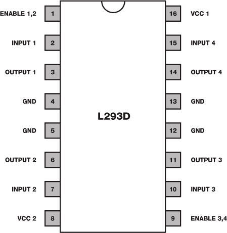

    **图 3-23** L293D 的引脚图

1.  现在我们将连接两个电源轨道的地线。用一根黑色的 M-M 电线将面包板上的两个蓝色电源轨道连接起来，这样就连接了树莓派的地线轨道和电池的地线轨道，如 图 3-24 所示。我们将连接的地线称为 *共地*。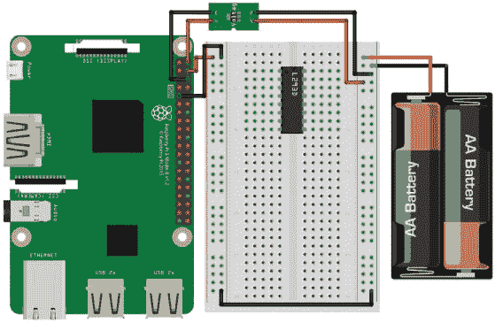

    **图 3-24** 插入面包板的 L293D 芯片，并且树莓派的电源轨道已连接

1.  接下来，使用一根线将 L293D 的引脚 16（VCC 1）连接到 5 V 正电源轨（连接到树莓派的 5 V 引脚）。这就是芯片的电源。完成后，将 L293D 上的地线引脚（GND），即引脚 4、5、12 和 13，连接到公共地线。有关连接的具体信息，请参考图 3-25 中的面包板示意图。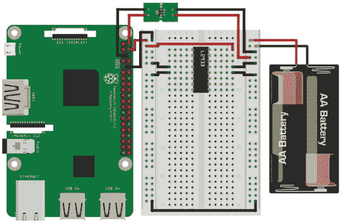

    **图 3-25** 5 V 电源连接到 L293D，并且所有四个地线已连接

    **注意**

    *跳线的长度有时会让它们变得笨重，导致接线看起来混乱。如果你购买了多种尺寸的面包板跳线，可以选择较短的跳线来让面包板看起来更加整洁。或者，购买一些单芯线，自行裁剪并剥线来调整合适的长度。*

1.  现在是时候连接电机的电源了，它将直接来自你的电池组。将 +7 V 到 9 V 的正电源轨（连接到你的电池组）连接到 L293D 的引脚 8（VCC 2）。与之前不同，这次这是电机的电源，而不是芯片的电源。图 3-26 显示了这个连接。

1.  L293D 有两个 *使能* 引脚。如果这些引脚没有 *打开*（也就是说，它们没有接收到高电压），那么连接到 L293D 的任何电机都不会响应命令。要永久打开使能引脚，将 L293D 的引脚 1（使能 1,2）和引脚 9（使能 3,4）连接到树莓派 5 V 正电源轨。我在图 3-26 中使用了白色的跳线来演示这一步骤。

    **图 3-26** 通过将 L293D 的使能引脚连接到树莓派的 5 V 电源轨来给其提供高电压

    ##### 连接电机

    现在你可以将电机接到 L293D 上了。

1.  取一个电机，将其一根电线连接到 L293D 芯片的引脚 3（输出 1），另一根电线连接到引脚 6（输出 2）。然后取第二个电机，将其两根电线中的第一根连接到引脚 11（输出 3），第二根连接到引脚 14（输出 4），如图 3-27 所示。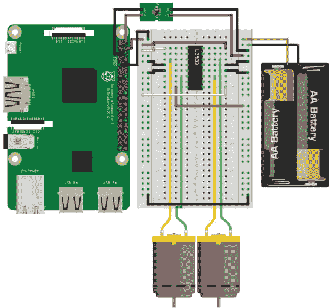

    **图 3-27** 两个电机连接到 L293D 的输出端

    ##### 完成接线

    接线过程的最后阶段是将树莓派的 GPIO 引脚连接到 L293D 的输入端。每个电机需要两个 GPIO 引脚才能工作（我将在下一章中讲解它是如何工作的）。这意味着，驱动两个电机，你总共需要四个 GPIO 引脚。

1.  使用 M-F 跳线将你的树莓派物理引脚 11（BCM 17）连接到 L293D 的引脚 2（输入 1）。然后使用另一根跳线将树莓派的物理引脚 12（BCM 18）连接到 L293D 的引脚 7（输入 2）。现在，你已经成功地接上了一个电机。此时，你的面包板应该像图 3-28 所示，最新添加的部分是粉色的线。

    

    **图 3-28** 第一个电机的输入控制引脚从树莓派连接到 L293D

1.  最后，你必须为第二个电机接上 GPIO 引脚。通过将 Pi 的物理引脚 13（BCM 27）连接到 L293D 的引脚 10（输入 3）来完成此操作。然后将 Pi 的物理引脚 15（BCM 22）连接到 L293D 的引脚 15（输入 4）。

恭喜！你已经完成了电机和电机控制器的接线。你的面包板应该像图 3-29 中的示意图一样，其中最后的接线以紫色显示。此外，图中还展示了我已经接好线的机器人照片。

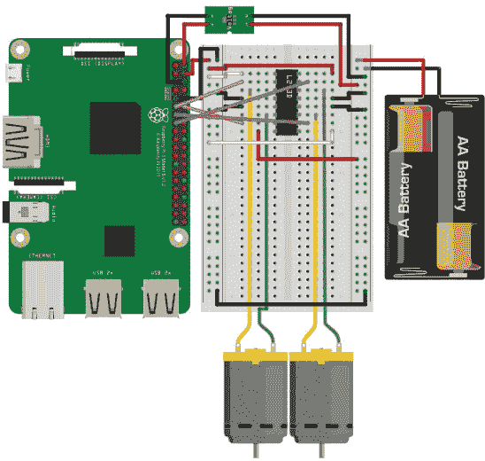

**图 3-29** 完整电路，两个电机的输入线从 Pi 连接到 L293D（上图）；完成的机器人！（下图）

你已经完成了第一个机器人的物理部分。下一步是编程，让它做一些酷炫的事情。目前，你可以将你的机器人编程成像遥控车一样移动。在下个章节中，我们将添加一些代码，让你能够实现这一功能！

自定义你的机器人

没有什么比*乏味*的机器人更糟糕了。现在你已经构建了底盘并接好了电子元件，为什么不为你的作品增添一些个性呢？添加一些颜色！装饰一下你的底盘！你可能会注意到，我的机器人上有各种各样的乐高小人正在骑行。

### 总结

你在这一章节中已经做了*很多*工作！我们讨论了为什么两轮机器人非常棒，它们的各种组成部分，以及你在构建它们时可以选择的选项。我已经向你展示了如何接好 Pi 的线路，连接电源，并将电机连接起来，从零开始构建属于你自己的机器人。

在所有这些基础工作完成后，在接下来的章节中，我将引导你进入下一个激动人心的步骤：编程你的机器人并让它动起来！

就像任何接线工作一样，稍微的坚持就能带来回报！在进入下一个章节之前，快速浏览一下说明，确保没有短路，并且所有连接都按预期连接。这样，你就能顺利地在下个章节中让机器人启动并运行。
