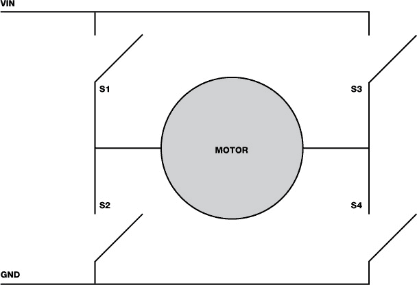
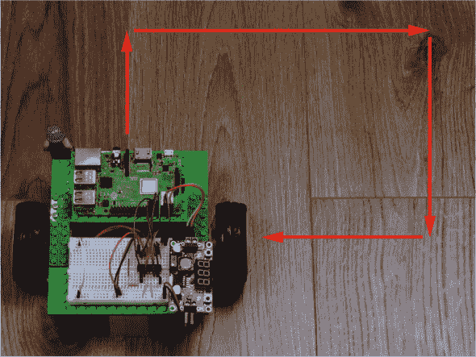
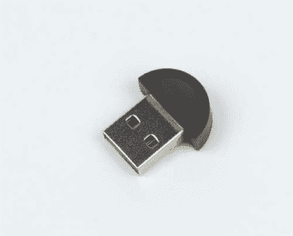
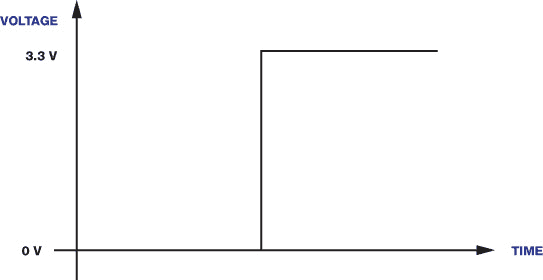
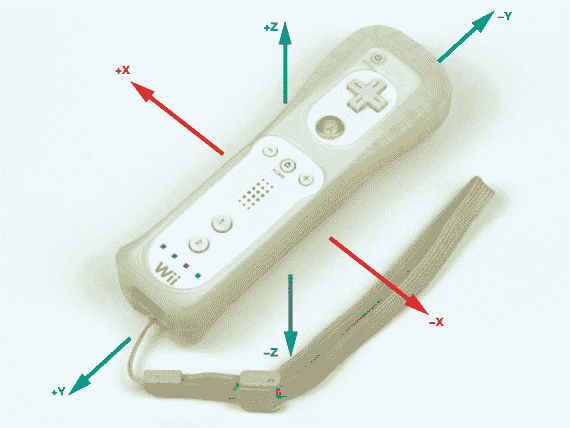
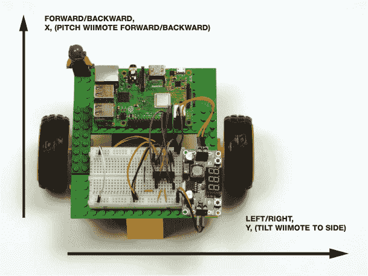
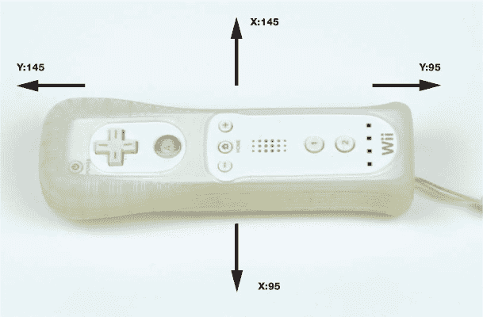

## 第四章：让你的机器人动起来

在这一阶段，你有一个外观很酷的树莓派机器人，但它现在什么都做不了…… 还！为了充分发挥你刚接好线的所有硬件功能，你将不得不深入一些编程工作。

在这一章中，我将向你展示如何使用 Python 编程语言让你的机器人动起来。我们将涵盖基本运动、让机器人实现遥控以及调整电机的速度。

### 部件清单

本章的大部分内容将涉及如何编写代码来控制机器人，但为了实现遥控，你稍后需要一些配件：

+   任天堂 Wii 遥控器

+   如果你使用的是比 Pi 3 或 Zero W 更早的版本，可能需要使用蓝牙加密狗

### 理解 H-桥

大多数单电机控制器都基于一种叫做 *H-桥* 的电子概念。我们使用的 L293D 电机驱动芯片包含两个 H-桥，允许通过一个芯片控制机器人上的两个电机。

H-桥是一个电子电路，允许在负载（通常是电机）上施加电压，且电压方向可以是任意的。对于机器人应用而言，这意味着 H-桥电路可以驱动电机 *正转* 和 *反转*。

单个 H-桥由四个电子开关组成，采用晶体管构建，像图 4-1 中的 S1、S2、S3 和 S4 那样排列。通过操作这些电子开关，H-桥控制单个电机的正反电压流动。



**图 4-1** 单个 H-桥电路

当所有开关都处于打开状态时，电机上不会施加电压，电机不会转动。当只有 S1 和 S4 闭合时，电流会在电机中一个方向流动，令电机旋转。当只有 S3 和 S2 闭合时，电流会在相反方向流动，使电机反向旋转。

L293D 的设计意味着我们不能同时关闭 S1 和 S2。幸运的是，若这样做会导致短路，从而损坏电路！S3 和 S4 也有相同的问题。

L293D 将这一概念进一步抽象化，只需两个输入控制一个电机（对于一对电机，则需要四个输入，像你在第三章中接线的那样）。电机的行为取决于哪些输入为高电平，哪些为低电平（分别为 1 和 0）。表 4-1 总结了控制一个电机的不同输入选项。

**表 4-1** 基于输入的电机行为

| **输入 1** | **输入 2** | **电机行为** |
| --- | --- | --- |
| 0 | 0 | 电机关闭 |
| 0 | 1 | 电机朝一个方向旋转 |
| 1 | 0 | 电机朝另一个方向旋转 |
| 1 | 1 | 电机关闭 |

我们将使用 GPIO Zero Python 库与 Pi 的 GPIO 引脚和电机控制器进行接口。该库中有几个函数用于控制基本运动，因此你不必担心自己手动开启或关闭特定的 GPIO 引脚。

### 第一次运动

现在，进入你的机器人旅程中最激动人心的一步：让机器人动起来！你最终会让机器人完全遥控，甚至能够根据你的指令行动，但在那之前，先掌握一些基本的电机功能。你将从编程让机器人沿预定路线移动开始。

#### 用预定路线编程你的机器人

启动你的 Raspberry Pi 并通过 SSH 登录到你的机器人。 当机器人保持静止并进行编程时，最好断开电池连接，通过连接到墙壁插座的 micro USB 电缆为 Pi 供电。这样可以节省电池，等到真正需要时再使用。

从终端中，导航到你的主目录下存储代码的文件夹。对我来说，我将导航到我的*robot*项目文件夹，命令如下：

pi@raspberrypi:~ $ cd robot

接下来，创建一个新的 Python 程序，并使用以下命令在 Nano 文本编辑器中编辑它；我将我的程序命名为 *first_move.py*：

pi@raspberrypi:~/robot $ nano first_move.py

现在你需要为编程制定一个预定的路线！对于我们使用的直流电机，你*无法*让它们转动特定的距离或步数，但你*可以*通过开关电源来控制它们运行一定时间。这意味着任何路径都将是你希望机器人走向的粗略近似，而不是精确的计划。

首先，让我们简化一点，让你的机器人在方形路线内行驶，路线如下所示 图 4-2。



**图 4-2** 机器人计划的路线

在你的 *first_move.py* 文件中，输入 列表 4-1 中的代码来编程一个方形路线。

```
   import gpiozero
   import time

➊ robot = gpiozero.Robot(left=(17,18), right=(27,22))

➋ for i in range(4):
   ➌ robot.forward()
   ➍ time.sleep(0.5)
   ➎ robot.right()
   ➏ time.sleep(0.25)
```

**列表 4-1** 编程让你的机器人沿方形路径移动

程序首先导入常用的 Python 库：`gpiozero` 和 `time`。然后你创建一个名为 `robot` 的变量 ➊，并为其分配来自 GPIO Zero 库的 `Robot` 对象。

在 Python 中，*对象* 是一种将变量（信息片段）和函数（执行任务的预定义指令集）保存在一个实体中的方式。这意味着，当我们将一个对象分配给一个变量时，该变量将拥有一系列预定义的功能和操作。对象通过它的*类*来获得这些功能。每个类都有自己的函数（称为*方法*）和变量（称为*属性*）。这些是 Python 的高级功能，你在这个阶段不需要太多担心它们。只需要知道，我们正在使用来自 Python 库的预定义类，比如 GPIO Zero，这样可以让我们的编程变得更容易。

GPIO Zero 库内置了一个`Robot`类，提供了多种用于让双轮机器人朝不同方向移动的功能。请注意括号中的两组值，它们分别分配给`left`和`right` ➊。这些值代表你连接到 L293D 的输入引脚。如果你按照第三章中的接线方式进行操作，那么这四个 GPIO 引脚应该是：17、18、27、22。

该程序还使用了一种新的循环类型，称为`for`循环➋。在第二章中，当你让 LED 灯闪烁并从按钮获取输入时，你使用了`while`循环。`while`循环会在满足某个条件时无限期地重复其内容，而`for`循环则是将一段代码块重复执行*固定*的次数。该循环的语法`for i in range(4):`意味着“做以下事情四次”。

`for`循环指示你的机器人开始向前行进➌，然后等待半秒钟 ➍，以便给机器人一些时间进行移动。结果是两个电机在一个方向（前进）上移动了半秒钟。

接着，你指示机器人向右转➎，并在此过程中等待四分之一秒 ➏。通过让机器人向右转，你将半秒前发出的前进命令替换为新的电机指令。

一旦执行完成，“向前走然后右转”的过程会重新开始，并持续*四*次。你尝试让机器人走一个方形路线，而方形有四条边，因此需要特定次数的重复。

一旦你完成编写程序，按 CTRL-X 退出 Nano 并保存你的工作。接下来，我们将运行程序让机器人开始移动！

GPIO Zero 的 Robot 类包含所有方向和基本功能的命令，详见表 4-2。

**表 4-2** `Robot`类命令

| **命令** | **功能** |
| --- | --- |
| `robot.forward()` | 让两个电机向前转动。 |
| `robot.backward()` | 让两个电机后退。 |
| `robot.left()` | 让右电机向前转动，左电机向后转动。 |
| `robot.right()` | 让左电机前进，右电机后退。 |
| `robot.reverse()` | 反转机器人的当前电机方向。例如：如果前进，则后退；如果向左，则向右。这*不是*后退！ |
| `robot.stop()` | 停止两个电机。 |

#### 运行程序：让你的机器人移动

在执行程序之前，确保你的机器人已经从墙壁电源插座断开，电池已连接并开启。你还应该将机器人放置在一个相对较大、平坦的表面上，确保没有障碍物和危险。粗糙的表面，如地毯，可能导致你的机器人卡住或难以移动。尽量避免这种情况，因为电机困难时会消耗更多电流，而且当电机完全被阻止（或*停滞*）时，可能会损坏电子元件！表面越平坦，机器人运行得越顺畅。

让你的机器人处于一个能够“接住”它的位置也是个好主意，以防它或某个物体/某个人处于危险之中。例如，它可能会试图下楼梯，或者猫可能会挡住路。

要运行你的程序，通过 SSH 无线访问你的 Pi 的终端并输入：

pi@raspberrypi:~/robot $ python3 first_move.py

你的机器人应该开始动起来。如果一切顺利，它将沿着一个方形路径移动，然后停下来，程序也会自动结束。如果你需要在任何时候停止机器人，可以按键盘上的 CTRL-C 立即停止电机。

故障排除指南：机器人工作不正常？

如果你的机器人没有正常工作，不用担心。通常故障可以归类为一些常见问题，应该很容易解决！以下的快速指南将帮助你解决大部分可能遇到的问题。

机器人移动不稳定

执行 *first_move.py* 程序后最常见的问题是，机器人移动了，但不是按照正确的模式。例如，它本应前进，但却后退；或者它本应右转，但却左转。你甚至可能发现它只是原地旋转！

这种情况可以很容易修复。正如我们讨论过的，直流电机有两个端子，没有特定的极性。这意味着，如果你改变电流流动的方向，电机就会反向旋转。因此，如果一个或两个电机的转动方向与命令相反，你可以交换连接到电机控制器输出引脚的电线来反转方向。例如，交换连接到 L293D 输出 1 和输出 2 的电线。有关指导和相关图示，请参阅第三章。

电机不转动

如果你的程序成功执行，但机器人的轮子没有转动，或者只有一个电机开始转动，那么可能是你的接线出了问题。请回到上一章，检查你是否按照说明连接了所有设备。确保电机的连接牢固，没有任何电线松动。如果你确信接线正确，检查一下电池是否充满电，并且它们能为你的电机提供足够的电力。

如果你的 Raspberry Pi 在电机开始转动时崩溃，可能是电源出现了问题。检查你是如何设置降压转换器的。如果你使用的是与我不同的转换器，可能会遇到问题。请回到上一章获取指导和建议。

机器人移动非常缓慢

机器人运动缓慢通常意味着电机没有得到足够的电力。检查你的电机的电压要求，确保你提供了它们所需的电压。通常电机可以接受一范围的电压，例如从 3V 到 9V。如果你的电机支持这一范围，试着使用一个更高的电压，但要确保它仍然在推荐范围内。请记住，如果你更换了电池并且更改了电压，记得检查并重置降压转换器，确保你不会给树莓派提供超过 5.1V 的电压。

另外，电机本身也可能只有较慢的齿轮转速。如果是这种情况，虽然你的机器人可能会慢，但它可能有很大的扭矩，这是一个不错的权衡。

机器人没有按照编程路径行驶

如果你的机器人成功执行程序并开始以适当的速度移动，但没有精确按照你预定的路径行驶，不用担心！每个电机都是不同的，你需要进行一些调整才能让程序按你的需求运行。例如，0.25 秒可能不足以让电机让你的机器人大约转动 90 度。修改程序，调整`for`循环中的`sleep()`和`robot()`语句。

### 使你的机器人实现远程控制

让机器人“复活”并开始移动是机器人技术的一个令人兴奋的第一步，接下来的自然步骤就是让你的机器人实现远程控制。这意味着它不再局限于预定的路径，你将能够实时控制它！

这个项目的目的是编程你的机器人，使你能够用无线控制器来引导它。你将能够在不重新进入代码的情况下，瞬间改变机器人运动的方式。

#### Wiimote 无线控制器

为了用无线控制器控制你的机器人，首先你需要一个！我们机器人的完美遥控器是任天堂的 Wii 遥控器，也就是*Wiimote*，如图 4-3 所示。


**图 4-3** 我心爱的任天堂 Wiimote

警告

*为了确保与你的树莓派兼容，请确保你的 Wiimote 是任天堂官方品牌的正品型号。近年来，许多第三方 Wiimote 已经上市。尽管通常比官方 Wiimote 便宜，但这些产品不能保证与`cwiid`库兼容。*

Wiimote 是一个非常巧妙的小型蓝牙控制器，带有一组按钮和一些能够检测运动的传感器。Wiimote 最初是为任天堂 Wii 游戏机设计的，但幸运的是，有一个开源 Python 库，叫做`cwiid`，它允许像树莓派这样的 Linux 电脑与 Wiimote 连接并进行通信。我们将使用`cwiid`来操控 Wiimote 的数据，从而控制你的机器人的电机。

如果你还没有 Wiimote，你需要去购买一个。这些在线上广泛销售，既有新的，也有二手的。我建议在像 eBay 这样的网站或二手商店购买一个便宜的二手 Wiimote——我买的只花了不到 15 美元。

你将使用蓝牙将 Wiimote 与 Raspberry Pi 连接到你的机器人上。*蓝牙*是一种无线射频技术，许多现代设备，如智能手机，使用它来进行短距离的通信和数据传输。最新的 Raspberry Pi 型号，如 Pi Zero W 和 Raspberry Pi 3 Model B+，内置蓝牙功能。所有在 Raspberry Pi 3 Model B 之前的型号，如原始的 Raspberry Pi 和 Pi 2，都没有蓝牙功能，因此你需要获取一个蓝牙 USB 适配器（或*适配器*），如图 4-4 所示，用于连接 Wiimote。



**图 4-4** 一款 3 美元的 Raspberry Pi 兼容蓝牙适配器

这些在网上售价不到 5 美元；只需搜索“Raspberry Pi 兼容的蓝牙适配器”。在继续之前，确保已将适配器插入 Pi 的一个 USB 端口。

#### 安装并启用蓝牙

在你开始编写下一个 Python 脚本之前，你需要确保蓝牙已安装在 Pi 上，并且`cwiid`库已设置好。从插座为你的 Raspberry Pi 供电，然后从终端运行以下命令：

pi@raspberrypi:~ $ sudo apt-get update

然后运行以下命令：

pi@raspberrypi:~ $ sudo apt-get install bluetooth

如果你已经安装了蓝牙，你应该会看到一个对话框，显示`bluetooth is already the newest version`。如果没有看到此消息，请按照蓝牙安装流程进行操作。

接下来，你需要为 Python 3 下载并安装`cwiid`库。我们将从*GitHub*获取这段代码，GitHub 是一个程序员和开发者分享软件的站点。

在 Pi 的主文件夹中运行以下命令：

pi@raspberrypi:~ $ git clone https://github.com/azzra/python3-wiimote

现在，你应该已经将`cwiid`库的源代码下载到你的 Raspberry Pi 中，并存储在一个名为*python3-wiimote*的新文件夹中。在我们开始下一个 Python 程序之前，源代码需要先进行*编译*，这是将软件制作并准备好在设备上使用的过程。

在继续操作之前，你还需要安装其他四个软件包。输入以下命令一次性安装所有四个软件包：

pi@raspberrypi:~ $ sudo apt-get install bison flex automake libbluetooth-dev

如果提示你同意继续，请按 Y（默认选项）。该命令执行完成后，切换到新下载的目录，其中包含你的 Wiimote 源代码：

pi@raspberrypi:~ $ cd python3-wiimote

接下来，你必须通过依次输入以下每个命令来准备编译库。这些都属于编译过程的一部分——你不必担心每个命令的具体内容！前两个命令不会输出任何内容，但其余的命令会输出。我将在这里展示每个输出的开始部分：

pi@raspberrypi:~/python3-wiimote $ aclocal

pi@raspberrypi:~/python3-wiimote $ autoconf

pi@raspberrypi:~/python3-wiimote $ ./configure

正在检查 gcc... gcc

正在检查 C 编译器是否工作... 是

正在检查 C 编译器默认输出文件名... a.out

正在检查可执行文件的后缀...

--snip--

然后，最终安装 `cwiid` 库，输入：

pi@raspberrypi:~/python3-wiimote $ make

make -C libcwiid

make[1]: 进入目录 '/home/pi/python3-wiimote/libcwiid'

--snip-

**注意**

*如果你在安装 Python 3 `cwiid` 时遇到问题，请查看本书网站，看看是否有更新的过程：* [`nostarch.com/raspirobots/`](https://nostarch.com/raspirobots/)。

之后，`cwiid` 应该能在 Python 3 中正常工作了！现在，你可以退出 *python3-wiimote* 目录，回到存放其他代码的地方。

#### 编写远程控制功能

现在创建并打开一个新的 Python 程序来存储 Wiimote 代码。我将其命名为 *remote_control.py*：

pi@raspberrypi:~/robot $ nano remote_control.py

一般来说，在开始编写代码之前，首先规划你到底想做什么是很重要的。在我们的例子中，我们需要考虑如何让 Wiimote 精确地控制机器人。让我们做个计划。

Wiimote 有 11 个数字按钮，这对于这个简单的项目来说已经足够了。有趣的是，其中 4 个按钮属于 D-pad——Wiimote 顶部的四向控制按钮，见 图 4-5。


**图 4-5** Wiimote 的四向 D-pad

这正好符合我们的需求：我们可以用上方向键让机器人向前进，用右方向键让机器人向右走，用下方向键让机器人向后退，用左方向键让机器人向左走。这和我们之前写的程序非常相似，只不过现在我们从 Wiimote 获取输入，而不是预先编写好。

我们还需要一些东西来让机器人停止。Wiimote 底部的“B”触发按钮非常适合这个功能。让我们在 Nano 中写一些代码来执行我们所做的计划；见 Listing 4-2。我将这个程序保存为 *remote_control.py*。

```
   import gpiozero
   import cwiid

➊ robot = gpiozero.Robot(left=(17,18), right=(27,22))

   print("Press and hold the 1+2 buttons on your Wiimote simultaneously")
➋ wii = cwiid.Wiimote()
   print("Connection established")
➌ wii.rpt_mode = cwiid.RPT_BTN

   while True:
    ➍ buttons = wii.state["buttons"]

    ➎ if (buttons & cwiid.BTN_LEFT):
          robot.left()
      if (buttons & cwiid.BTN_RIGHT):
          robot.right()
      if (buttons & cwiid.BTN_UP):
          robot.forward()
      if (buttons & cwiid.BTN_DOWN):
          robot.backward()
      if (buttons & cwiid.BTN_B):
          robot.stop()
```

**清单 4-2** 编程让你的机器人响应 Wiimote 的 D-pad

如前所述，你首先需要导入 `gpiozero` 和新的 `cwiid` 库。接着，创建一个 `Robot` 对象 ➊。

在接下来的代码部分 ➋，你会设置 Wiimote。与`Robot`对象类似，我们将`Wiimote`对象赋值给一个名为`wii`的变量。当这行代码执行时，Raspberry Pi 和 Wiimote 之间会进行配对握手。用户需要*同时按住*Wiimote 上的 1 和 2 按钮，将 Wiimote 设置为蓝牙可发现模式。我们在这里添加了一个`print()`语句，提醒用户何时按下按钮。

如果配对成功，代码会打印出一条正面的消息给用户。接着，我们开启 Wiimote 的报告模式 ➌，这样 Python 就可以读取不同按钮和功能的值。

之后，我们使用一个无限`while`循环来告诉机器人当每个按钮被按下时该做什么。首先，循环会读取 Wiimote 的当前状态 ➍，即检查哪些按钮被按下。这些信息会被存储在一个名为`buttons`的变量中。

最后，我们开始程序的最后一部分 ➎：一系列`if`语句和条件，用来为每个按钮分配一个动作。举个例子，第一个`if`语句确保当按下 D-pad 的左按钮时，机器人会向左转。接下来的代码行应用了类似的逻辑：如果按下 D-pad 的右按钮，机器人会向右转，依此类推。

像往常一样，一旦你完成编写程序，退出 Nano 并保存你的工作。

#### 运行你的程序：远程控制你的机器人

把你的机器人放在一个大的平面上，并准备好 Wiimote。如果你的 Pi 需要蓝牙适配器，不要忘记将其插入 USB 端口。要运行程序，可以使用 SSH 终端输入以下命令：

pi@raspberrypi:~/robot $ python3 remote_control.py

程序执行后不久，终端会弹出一个提示，要求你同时按住 Wiimote 上的 1 和 2 按钮。你需要一直按住这两个按钮，直到收到成功消息，最多可能需要 10 秒钟。蓝牙配对过程可能会有点儿挑剔，所以尽量在程序提示时尽早按下这两个按钮。

如果配对成功，另一个消息`Connection established`会出现。否则，如果配对失败，则会显示错误消息`No Wiimotes were found`，并且程序会崩溃。如果发生这种情况，且你使用的是官方任天堂品牌的 Wiimote，那么很可能是你按下 1 和 2 按钮的速度不够快！重新运行程序并尝试再次进行配对。

现在 Wiimote 已经成功连接，你应该能够通过按下按钮让你的机器人朝任何你想要的方向快速移动！记得你可以随时通过按下 Wiimote 底部的 B 按钮来停止两个电机。像往常一样，你可以通过按 CTRL-C 来终止程序。

### 改变电机速度

到目前为止，你的机器人只能以两种速度行驶：0 英里每小时或最快速度！你可能已经注意到，这并不是最方便的。以全速行驶使得精确操控几乎不可能，你可能已经撞到了一些东西。幸运的是，情况不必总是如此。让我们给你的机器人增加一些速度控制。

在这个项目中，我们将在之前的示例基础上，创建一个具有可变电机速度的遥控机器人。为此，我将介绍一种叫做*脉宽调制（PWM）*的技术，并解释如何在 Python 的 GPIO Zero 库中使用它。我们还将利用一种特殊的传感器，叫做*加速度计*，在 Wiimote 中进行充分利用，创造出一个大大改进的遥控程序版本！

#### 理解 PWM 是如何工作的

树莓派能够提供*数字*输出，而不能提供*模拟*输出。数字信号只能是开或关，介于两者之间没有状态。相比之下，模拟输出可以设置为零电压、满电压或任何介于两者之间的电压。在树莓派上，任何时刻 GPIO 引脚的状态要么是开，要么是关，即无电压或满电压。按照这个逻辑，连接到 Pi 的电机只能停止或全速运转。

这意味着，例如，无法将 Pi 的 GPIO 引脚设置为“半电压”来实现电机速度的一半。幸运的是，PWM 技术使我们能够近似地实现这一行为。

为了理解 PWM，首先请查看图 4-6 中的图表。它描绘了数字输出从低电平到高电平的变化。这就是当你打开树莓派的 GPIO 引脚时发生的情况：它从 0 V 变为 3.3 V。



**图 4-6** 从低电平（0 V）到高电平（3.3 V）的状态变化

PWM 通过快速地打开和关闭一个 GPIO 引脚，使得设备（在我们这个例子中是电机）仅“注意到”任何给定时刻的*平均*电压。这意味着电压的状态介于 0 V 和 3.3 V 之间。这个平均电压取决于*占空比*，即信号在给定周期内“开”与“关”的时间比例。它以百分比表示：25%意味着信号在 25%的时间内为高电平，75%的时间内为低电平；50%意味着信号在 50%的时间内为高电平，另 50%为低电平，依此类推。

占空比按比例影响输出电压，如图 4-7 所示。例如，对于树莓派，在 50%占空比下进行脉宽调制会给出 50%的电压：3.3 V / 2 = 1.65 V。


**图 4-7** 两种不同的 PWM 电压波形：25%占空比（上）和 50%占空比（下）

尽管 PWM 不是模拟信号的完美近似，但在大多数情况下，它表现良好，尤其是在这一层次上。通过数字编码模拟信号的电平，你将能够精确控制机器人运动的速度。

GPIO Zero Python 库的作者使得使用 PWM 调节电机速度变得非常简单，因此你无需了解其背后的具体机制。你需要做的就是在每个电机指令的括号中提供一个介于 0 和 1 之间的值，表示从 0% 到 100% 的值，如下所示：

```
robot.forward(0.25)
time.sleep(1)
robot.left(0.5)
time.sleep(1)
robot.backward()
time.sleep(1)
```

**注意**

*如果你的机器人在前面的例子中运行得太快，随时可以返回并使用这种方法调整前两个项目中的速度！*

该程序将命令你的机器人以其最大速度的 25% 向前移动 1 秒，然后以最大速度的 50% 向左转动 1 秒，再以全速倒退 1 秒。如果你没有提供数值，Python 将假定机器人应该以全速移动，就像你输入 1 一样。

#### 理解加速度计

在我们改进前一个项目中的遥控程序之前，让我们先了解一下 Wiimote 中的加速度计以及我们如何使用它。

之前，你使用了 Wiimote 的方向键来进行控制。这四个按钮是数字按钮，只能检测是否被按下或松开。这对于同时控制速度和方向并不理想。

然而，在每个 Wiimote 内部，都有一个叫做*加速度计*的传感器，它能够检测并测量 Wiimote 在任何时刻所经历的加速度。这意味着，移动 Wiimote 在空中时，提供了三个轴上的感应数据：*x*、*y* 和 *z*。通过这种方式，加速度计可以跟踪运动的方向和该方向的速度。参见 图 4-8 以查看示意图。



**图 4-8** Wiimote 加速度计可以检测的运动轴

这种模拟数据非常适合用于变速电机遥控程序。例如，你越是将 Wiimote 向 *x* 方向倾斜，机器人就越快地向前移动。

#### 查看数据

在我们重新编写机器人的程序之前，查看 Wiimote 的加速度计输出的原始数据将非常有帮助。一旦我们了解了这些输出数据的样子，就可以考虑如何操控这些数据，使其与机器人的运动相对应。

从墙壁插座为机器人上的 Pi 供电，在 Nano 中打开一个新文件并命名为 *accel_test.py*，然后输入 清单 4-3 中的代码——此脚本也使用了 `cwiid` 库，因此如果你还没有安装它，请参阅“安装并启用蓝牙”中的说明，见 第 88 页。

```
   import cwiid
   import time

➊ print("Press and hold the 1+2 buttons on your Wiimote simultaneously")
   wii = cwiid.Wiimote()
   print("Connection established")
➋ wii.rpt_mode = cwiid.RPT_BTN | cwiid.RPT_ACC

   while True:
    ➌ print(wii.state['acc'])
       time.sleep(0.01)
```

**清单 4-3** 打印原始加速度计数据的代码

这个简单的程序每 0.01 秒将 Wiimote 的加速度计数据打印到终端。

`print()`语句表示 Wiimote 设置的开始 ➊。接下来的三行与之前的项目相同，唯一的区别是代码块的最后一行 ➋，这行代码不仅开启了 Wiimote 的报告模式，还允许 Python 读取按钮*和*加速度计的值。如果你以前没见过，这行中的键盘字符被称为*竖线*或*管道符*。它通常与反斜杠在同一个键上。

一个无限`while`循环打印加速度计的状态 ➌。下一行代码会在每次`while`循环迭代之间等待 0.01 秒，使得输出数据更易管理。在编程中，每次循环执行一次就称为一次迭代。

你可以通过以下命令运行此程序：

pi@raspberrypi:~/robot $ python3 accel_test.py

配对 Wiimote 后，加速度计数据应该开始打印到终端。以下是我在终端中看到的一些输出数据：

```
(147, 123, 136)
(151, 116, 136)
(130, 113, 140)
(130, 113, 140)
(130, 113, 140)
```

每一行数据作为三个值以括号形式传递，分别代表 x、y 和 z 轴，这些值会随着你在不同轴上移动 Wiimote 而变化。试着进行不同的运动，观察这些数值的变化。按 CTRL-C 退出程序。

有了这些原始数据，我们可以开始思考下一部分编程过程，即回答这个问题：你如何将这三个数据转换为机器人指令？最好的方法是通过逻辑思考并分步骤解决问题。

#### 弄清楚远程运动控制

首先，考虑你双轮机器人的运动。因为它只在地面上移动，不会上下飞行，所以它的运动可以用两个维度来表示：*x* 和 *y*，如图 4-9 所示。我们可以忽略 z 轴数据，这样就大大简化了问题。



**图 4-9** 你的双轮机器人只需要两个控制轴。

其次，考虑你希望在控制机器人时如何握住 Wiimote。我决定将其水平握持，1 和 2 号按钮靠近我的右手，如图 4-10 所示。这是传统基于 Wii 的赛车游戏最常见的握持方式，也是控制机器人时的理想选择。


**图 4-10** 本项目中如何握持 Wiimote

当你以这种方式握住 Wiimote 时，向前和向后倾斜控制*x*值。左右倾斜控制*y*值。

当你打印加速度计数据时，你可能会注意到输出的数字通常在 95 到 145 之间。你可以再次运行测试程序来观察这一点。之所以如此，是因为最低的 *x* 值为 95，当 Wiimote 完全向后倾斜时；最高的值为 145，当它完全向前倾斜时。

对于 y 轴，从左到右，最低值是 95，最高值是 145。145 和 95 之间的差值是 50，这为我们提供了每个轴的可用数据范围。参见 Figure 4-11，该图说明了 Wiimote 的值是如何变化的。

到目前为止，在本章中，你通过指示机器人以全速向前、向后、向左或向右移动来控制其运动。我们希望改变这一点，根据加速度计的值来调整速度。幸运的是，GPIO Zero Python 库中的 `Robot` 类有另一种打开电机并设置其速度的方法，正好符合我们的需求。



**FIGURE 4-11** Wiimote 的极端加速度计值

`Robot` 类有一个 *属性*——一个类中的变量——叫做 `value`。在任何给定时刻，`value` 表示机器人电机的运动，是一对介于 -1 和 1 之间的数值。这对数值中的第一个值表示左电机的速度，第二个值表示右电机的速度。例如，(–1, –1) 表示全速向后，(0.5, 0.5) 表示半速向前。值为 (1, –1) 表示全速向右转。通过设置 `value` 属性，你可以将机器人操控至任何你希望的方向。这将在即将到来的程序中大有用处！

#### 编程使你的机器人实现变速

现在我们已经拆解了这个问题，并找到了一个简洁高效的最终方法来编写程序，我们可以开始编码了！使用 Nano 创建一个名为 *remote_control_accel.py* 的新程序，并输入 Listing 4-4 中显示的代码。

```
import gpiozero
import cwiid

robot = gpiozero.Robot(left=(17,18), right=(27,22))

print("Press and hold the 1+2 buttons on your Wiimote simultaneously")
wii = cwiid.Wiimote()
print("Connection established")
wii.rpt_mode = cwiid.RPT_BTN | cwiid.RPT_ACC
while True:
    ➊ x = (wii.state["acc"][cwiid.X] - 95) – 25
       y = (wii.state["acc"][cwiid.Y] - 95) – 25

    ➋ if x < -25:
               x = -25
       if y < -25:
               y = -25
       if x > 25:
               x = 25
       if y > 25:
               y = 25

    ➌ forward_value = (float(x)/50)*2
       turn_value = (float(y)/50)*2

    ➍ if (turn_value < 0.3) and (turn_value > -0.3):
               robot.value = (forward_value, forward_value)
       else:
               robot.value = (-turn_value, turn_value)
```

**LISTING 4-4** 编程让你的机器人响应 Wiimote 的运动

**注意**

*Python（以及许多其他编程语言）可以以不同的方式处理数字。Python 中的主要两种数字类型是* 整数 *和* 浮点数。* 整数是没有小数点的整数。浮点数（浮动点实数）有小数点，能够表示数字的整数部分和小数部分。例如，8 是一个整数，而 8.12383 或 8.0 是浮点数。在* remote_control_accel.py *程序中，我们需要使用浮点数，因为机器人运动将由两个介于 -1 和 1 之间的数字控制。*

该程序与加速度计测试程序共享相同的 Wiimote 设置过程。然后，我们设置了一个`while`循环以保持代码的运行。第一个语句 ➊ 从加速度计读取*x*值，并将其存储在一个名为`x`的变量中。在该变量中，值经过两次算术操作。首先，减去 95；这将数据限制在 0 到 50 之间，而不是在 95 到 145 之间，从而使其适应我们之前发现的可用范围。其次，再减去 25。这确保了数据的范围将在-25 到+25 之间。然后对*y*值进行完全相同的处理，结果存储在一个名为`y`的变量中。

我们需要这样做，因为`Robot`类的`value`属性接受负值表示后退运动，正值表示前进运动。这个操作平衡了加速度计数据的正负值，使得哪一边是后退，哪一边是前进变得清晰。

四个`if`语句 ➋ 消除了程序后续错误的可能性。在不太可能的情况下，如果 Wiimote 的加速度计输出的数据不在-25 到+25 的范围内，`if`语句会捕捉到这个情况，并将其四舍五入到相关的极限值。

接下来，确定机器人的最终 x 轴值并将其存储在一个名为`forward_value`的变量中 ➌。这个计算将`x`变量的值除以 50，得到一个介于-0.5 和 0.5 之间的新比例值。然后将这个结果乘以 2，以获得一个介于-1 和 1 之间的值。相同的过程会重复进行，以得到最终的 y 轴值，并将其存储在一个类似的变量`turn_value`中。

第➍行开始了一个`if`/`else`条件语句。如果`turn_value`小于 0.3 或大于-0.3，则`robot.value`被设置为`forward_value`。因此，如果 Wiimote 倾斜不到 30 度，程序会假设你希望机器人前进或后退。这意味着 Wiimote 稍微倾斜时，机器人不会误转向。然后，机器人的前进/后退速度将根据 Wiimote 的俯仰角度来设置。例如，如果 Wiimote 完全向前倾斜，它将把`robot.value`设置为(1, 1)，你的机器人将加速向前移动。

另外，如果 Wiimote 倾斜超过 30 度，程序会假设你希望机器人在原地向左或向右转动。程序随后根据 Wiimote 的倾斜角度来旋转机器人。例如，如果 Wiimote 完全倾斜到右边，机器人会非常快速地向右旋转；但如果 Wiimote 只是稍微倾斜到右边，机器人则会较慢且更加平稳地转动。

和往常一样，完成程序后，退出 Nano 并保存工作。

#### 运行你的程序：通过 PWM 远程控制你的机器人

断开你的机器人与墙壁插座的连接，确保它由电池供电。然后将它放置在一个大表面上，手持你的 Wiimote 并保持水平方向。要运行你的程序，请输入：

pi@raspberrypi:~/robot $ python3 remote_control_accel.py

在完成熟悉的蓝牙握手过程后，你的机器人应该开始运行，并随着你改变 Wiimote 的方向而移动。试着用不同的速度驾驶它，并练习操作！

#### 挑战自己：完善你的遥控机器人

当你对遥控机器人的行为有了一定的了解后，重新查看代码并根据需要进行改进。例如，你可以尝试使转向更灵敏、限制机器人的速度，甚至让机器人在按下按钮时按照预定义的模式移动。可能性是无穷无尽的！

### 概述

本章带领你将一个机器人形状的纸重物变成一个完全功能的 Wiimote 遥控小机器！我们涵盖了从 H 桥到 PWM 再到加速度计的广泛概念。在这个过程中，你写了三个程序，每个比上一个更高级。

在下一章，我将指导你如何使你的机器人变得更智能，使它能够自动避开障碍物！
