## 第五章：避免障碍物

现在你可以控制你的机器人如何移动，这已经很酷了！但如果让你的机器人自行控制自己，不是更酷吗？

你可能已经注意到，你的小两轮在地板上跑时容易受到各种危害的影响。撞到墙壁和其他物体不仅令人烦恼，甚至可能对硬件造成危险。在本章中，我将向你展示如何让你的机器人能够自主地检测并避开障碍物。我们将讲解障碍物检测的原理以及如何使用你所需要的传感器。

### 障碍物检测

为了让你的机器人能够避开障碍物，它首先需要能够感知这些障碍物。在电子学中，我们使用专门的传感器来完成这个任务。使用传感器实现障碍物检测有多种方法。在业余爱好者层面，有两种主要方法：数字检测和模拟检测。数字检测非常擅长在特定范围内感知障碍物，但无法确定与障碍物之间的距离。而模拟检测则能同时做到这两点，这也是我们在这里使用的方法，以使我们的机器人更加智能。

#### 使用超声波传感器进行模拟物体检测

HC-SR04 超声波传感器（如图 5-1 所示）利用超声波来测量传感器与物体之间的距离。该传感器的工作原理与自然界中的蝙蝠和海豚声纳以及非自然界中的潜艇声纳相似。

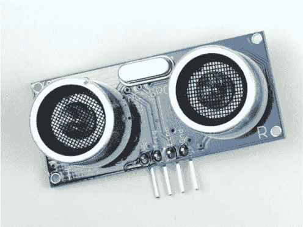

**图 5-1** HC-SR04 超声波距离传感器

声音可以被建模为波动，具有不同的波长。人耳只能听到声音频谱中的一小部分范围。任何频率高于此范围（20 kHz+）的声音波都是*超声波*。超声波距离传感器的设计目的是通过超声波反射来感知物体的接近。这种声纳系统发出波，波遇到障碍物后反弹。接收器随后探测回来的声波。超声波在短距离内（大约几米）非常准确，并且人类无法听到。

#### 理解 HC-SR04 的工作原理

像 HC-SR04 这样的基本超声波距离传感器由发射器、接收器和一些电路组成。发射器和接收器是像眼睛一样的扬声器状突起，见图 5-1。

为了确定距离，发射器发出高频超声波声音。这种声音会反弹并反射到任何附近的固体物体上。反弹的信号会被 HC-SR04 上的接收器探测并接收。

声音在空气中以恒定的速度传播。在室温下（20º C/68 ºF），声音波的传播速度大约为 343 米/秒（m/s）。虽然这个速度很快，但并非瞬时的，这意味着声音发出和反弹接收到之间存在一个小的时间差。因此，我们可以通过计时信号从传感器发出到返回所需的时间来测量距离。

速度、距离和时间之间的关系可以总结如下：

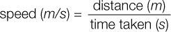

一个物体的速度（以米/秒为单位）等于该物体在米中行进的距离除以它所花费的时间（以秒为单位）。我们将使用这个公式来计算距离。我们知道声音的传播速度是恒定的，为 343 m/s，而且我们可以测量声音波反射回来的时间，也就是所用时间。如果你调整公式来解距离，你就会得到：


然而，这并不是全部。超声波脉冲被发出，碰到物体后反射回来，并被 HC-SR04 接收，如图 5-2 所示，这意味着声音波实际上是从传感器到物体的距离*双倍*传播。

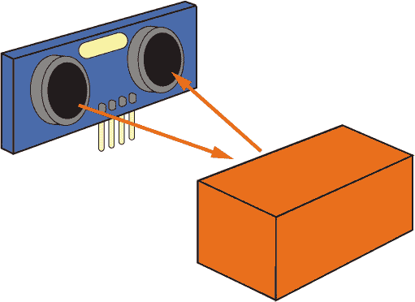

**图 5-2** HC-SR04 距离测量过程

这意味着我们需要将超声波距离传感器记录的时间除以二，从而得到以下公式：

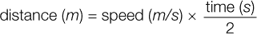

我们已经有了方法，现在让我们来试试。

### 测量短距离

现在你已经理解了超声波距离测量背后的数学和原理，是时候将一切付诸实践，测量一些距离了！

#### 配件清单

除了你在树莓派机器人上已经拥有的面包板，你还需要以下组件：

+   一个 HC-SR04 超声波传感器

+   一个 1 kΩ 电阻

+   一个 2 kΩ 电阻

+   跳线

价格便宜的 HC-SR04 传感器在常见的在线零售商处广泛销售。只需搜索“HC-SR04”，你应该不用花超过几美元就能买到一个。

任何数字系统都有两种逻辑状态：低电压（0）和高电压（1）。这在第四章解释 PWM 时首次引入。通常，低电压就是地线，0 V；然而，高电压可能会因系统而异。这意味着一些系统需要 5 V 信号才能触发高电压，而其他系统可能只需要 3.3 V。例如，这正是我们所面临的情况！HC-SR04 需要 5 V，而你的树莓派使用 3.3 V 逻辑。请注意，在图 5-3 中，超声波传感器上有四个引脚：*Vcc* 为电源，*Trig* 为触发脉冲，*Echo* 为回声脉冲，最后是 *Gnd* 为地。

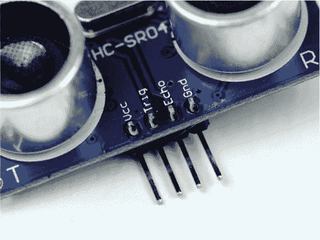

**图 5-3** HC-SR04 模块引脚的特写

你需要使用 5V 电源为模块供电，接到 Vcc 引脚。当 HC-SR04 接收到反射回来的脉冲时，Echo 引脚会设为 5V 高电平。但如果我们将这个直接连接到树莓派上，高电压会造成严重损坏。为避免这种情况，你需要将传感器的输出电压降低到树莓派能够承受的范围——这就是 1 kΩ和 2 kΩ电阻派上用场的地方。我们将用它们来搭建一个*电压分压器*。

#### 使用电压分压器降低电压

*电压分压器* 是一种简单的电路，它将较大的电压转换为较小的电压。电压分压器接受输入电压，使用两个串联的电阻来降低并输出电压。你可以选择不同值的电阻，使输出电压成为输入电压的某一比例。

电压分压电路如图 5-4 所示。注意，输出电压是从两个电阻之间取出的。


**图 5-4** 电压分压电路

和大多数电子设备一样，我们使用一个方程来将两个电阻（*R*[1] 和 *R*[2]）与输入和输出电压（*V*[in] 和 *V*[out]）数学关联起来。物理学家言简意赅，所以这个方程被直接称为 *电压分压方程*：

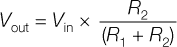

使用这个公式，你可以计算出所需的 *R*[1] 和 *R*[2] 电阻值，以产生所需的输出电压。*R*[1] 和 *R*[2] 的具体数值其实并不重要，重要的是它们之间的*比例*。例如，如果 *R*[1] 和 *R*[2] 相等，那么输出电压将是输入电压的一半。

警告

*无论你最后得到什么电阻值，最好使输出电压低于目标电压，而不是高于目标电压。这是因为较低的电压不会损坏你的树莓派或其他电子设备，而稍微高一点的电压就可能会造成损坏。*

让我们用这个公式来计算我们机器人距离传感器所需的电阻值。已知输入电压为 5V，所需的输出电压为 3.3V，因此方程中有两个未知数：*R*[1] 和 *R*[2]。你可以选择一个常见的电阻值来确定其中一个，剩下的就只有一个未知数，这样就更容易计算了。我们选择 1 kΩ作为 *R*[1]。通过重新排列方程并解出 *R*[2]，你会得到：

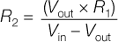

如果你代入已知的数值，*R*[2] 会按如下方式计算：

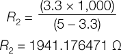

找到一个精确值为 1941.176471 Ω 的电阻器将非常困难！所以我们将选择最接近的常见电阻值。在我们的情况下，2 kΩ 或 2.2 kΩ 电阻就足够了。如果有疑问，尝试找到一个接近但稍微*低于*所需值的电阻器。如果需要，你可以将这两个电阻值重新代入方程式，计算出该电阻组合的输出电压，以便进行二次检查。

#### 接线你的 HC-SR04

现在你已经拥有了所有必要的组件，可以开始接线你的距离传感器了。和往常一样，在开始操作接线和连接新组件之前，确保你的 Pi 和机器人电源已经断开。

我们不会直接将 HC-SR04 模块插入面包板，而是通过长跳线连接，这样你可以将距离传感器放置在机器人上的任何位置。使用上一章中已经接好电机的构建，按照这些说明进行操作，但暂时不要将传感器安装到机器人底盘上：

1.  使用一根长跳线将 HC-SR04 的 Vcc 引脚连接到你的面包板上的 Pi +5 V 电源轨。

1.  使用另一根长跳线将 HC-SR04 的 Gnd 引脚连接到面包板上的接地轨。此时你的接线应该像 图 5-5 所示。

    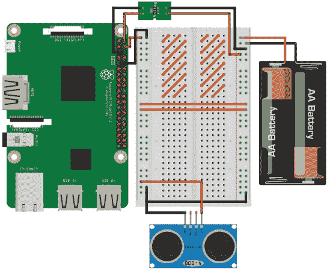

    **图 5-5** HC-SR04 模块连接到 +5 V 和接地。电机控制芯片和电机在图中省略，但你应该将它们保持连接到电路中。橙色条纹表示 L293D 芯片及其接线所占的区域。

1.  接下来，使用一根线将 HC-SR04 的 Trig 引脚直接连接到 Raspberry Pi 的物理引脚 16。Pi 的引脚 16 也被称为 BCM 23。

1.  然后，将跳线从传感器的 Echo 引脚连接到面包板上的新行。在同一行中插入一个 1 kΩ 电阻器，一端插入 Echo 引脚所在的行，另一端插入面包板上另一个未使用的行。此时你的接线应该像 图 5-6 所示。

    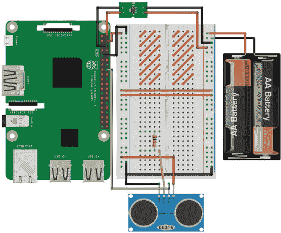

    **图 5-6** HC-SR04 的 Trig 引脚连接到 BCM 23，Echo 引脚连接到 1 kΩ 电阻器

1.  将 Raspberry Pi 的物理引脚 18（BCM 24）接到你刚刚连接的 1 kΩ 电阻器另一端的行。

1.  最后，将 2 kΩ/2.2 kΩ 电阻的一端插入与 1 kΩ 电阻和跳线相连的行，另一端连接到 Pi 的 BCM 24 引脚，并将此电阻的另一端接到接地轨。面包板上的完整电路应该像 图 5-7 所示。

图 5-8 显示了最终结果的电路图。

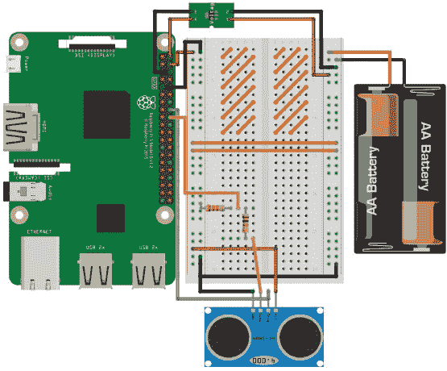

**图 5-7** 完整的面包板电路图，其中包含了 HC-SR04 和电压分压器

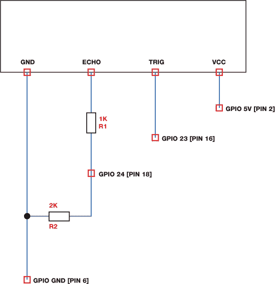

**图 5-8** HC-SR04 连接到 Raspberry Pi 的电路图

#### 编程你的树莓派读取距离

现在你的超声波距离传感器已经接好电路，是时候深入一些 Python 代码来使用这个传感器了。从墙壁插座启动你的树莓派，登录后，找到保存程序的*robot*文件夹。使用以下命令创建一个名为*distance_test.py*的新程序：

pi@raspberrypi:~/robot $ nano distance_test.py

在这个项目中，我们仍然使用 GPIO Zero Python 库，但我们将远离内置函数和对象。相反，我将向你展示如何从头开始编程和操作 HC-SR04！

Listing 5-1 中的代码将发送出一个信号，也就是所谓的*ping*，然后读取并打印出信号遇到的第一个物体的距离。将这段代码保存到你已打开的*distance_test.py*文件中。尝试用你的编程技能阅读并解读它，然后再继续我的解释！

```

   import gpiozero
   import time

➊ TRIG = 23
   ECHO = 24

➋ trigger = gpiozero.OutputDevice(TRIG)
   echo = gpiozero.DigitalInputDevice(ECHO)

➌ trigger.on()
   time.sleep(0.00001)
   trigger.off()

➍ while echo.is_active == False:
       pulse_start = time.time()

➎ while echo.is_active == True:
       pulse_end = time.time()

➏ pulse_duration = pulse_end - pulse_start

➐ distance = 34300 * (pulse_duration/2)

  round_distance = round(distance,1)

  print("Distance: ", round_distance)
```

**LISTING 5-1** 用于测量单一距离的程序

通常，我们首先导入`gpiozero`和`time`库，以便在代码中使用。

在➊和接下来的行中，我们创建了两个变量，`TRIG`和`ECHO`，它们分别存储连接到 Trig 和 Echo 引脚的引脚编号。我们将这些变量大写，以表示它们是*常量*——我们希望在程序运行期间保持不变的变量。

大写常量是编程约定，告诉你和任何阅读代码的人，这些值在程序执行过程中不会改变。值得强调的是，虽然这是一种约定，但它仅仅是大多数程序员的做法，而不是 Python 强制要求的。即使这些常量使用小写字母，或者大小写混合，代码仍然能正常工作。

以下两行 ➋ 设置了连接到 HC-SR04 的 Trig 和 Echo 引脚的 GPIO 引脚。我们将`trigger`变量设置为输出，因为它发送 ping 信号，而将`echo`设置为输入，因为它接收 ping 信号。

为了触发 ping 信号，HC-SR04 传感器需要一个快速的 10 µs 脉冲（1 µs 是百万分之一秒：0.000001 秒），这个脉冲将在接下来的代码段 ➌ 中执行。

当发射器发送出 ping 信号时，程序必须等待 ping 信号清除接收器，然后才开始监听回声。这是因为 HC-SR04 的发射器和接收器非常接近，因此在发射后的一段微秒时间内，传感器可能会听到发出的脉冲。我们不希望不小心记录下发射脉冲，因此我们告诉程序，直到它听到回声，而不是原始的 ping 信号时，才开始接收。这就像是你和朋友站在一个大房间里，你们想听回声。如果你大声喊“你好！”，你的朋友会在你听到回声之前就听到你的声音。这种效应是我们在使用 HC-SR04 时必须避免的。

代码的下一部分负责确保我们能够接收到回声。`while` 循环➍，其条件是 `echo.is_active == False`，会一直重复，直到传出的脉冲不再被传感器接收到。程序随后将脉冲清除接收器的准确时间存储在一个名为 `pulse_start` 的新变量中。

由于传出的脉冲已经被移除，`while` 循环，条件是 `echo.is_active == True` ➎，会在回声返回到传感器时捕获它。此时创建了第二个变量 `pulse_end`，用于记录回声脉冲的准确时间。

然后，我们只需从接收到信号的时间中减去发送信号的时间，就能计算出回声返回所花费的时间。我们将结果存储在名为 `pulse_duration` ➏ 的变量中。

可以说，这个程序最重要的部分是 ➐，我们根据回声返回所花费的时间来计算距离。我们将之前的公式应用到程序中收集到的数值：

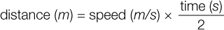

我们没有使用 343 m/s 这个声速值，而是将其乘以 100，以便得到一个以厘米为单位的距离值，这对于你的机器人处理的距离更为相关。

最后，在程序的最后几行，我们将距离值四舍五入到小数点后一位，然后将其输出到终端。

#### 运行你的程序：测量短距离

现在你已经完成了代码，是时候测试超声波距离传感器及其准确性了。

将你的 HC-SR04 平行放置在一个表面上，比如桌子。然后在传感器前面放置一个相对较小的固体物体，并用直尺测量距离。在 图 5-9 中，我使用的是一个竖直的盒子。我的盒子大约距离 HC-SR04 20 厘米。

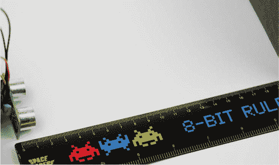

**图 5-9** 我的 HC-SR04 测试设置

如常，要运行你的程序，请输入：

pi@raspberrypi:~/robot $ python3 distance_test.py

一段时间后，应该会在终端显示单个距离读数，程序将结束。对我来说，输出结果如下所示：

pi@raspberrypi:~/robot $ python3 button.py

距离：20.1

你的 HC-SR04 应该已经成功测量了它与物体之间的距离！我的测量结果相当准确，但你不应该期望这些读数的准确性达到百分之百。

如果你的读数偏差较大，尝试重新运行程序，看看该输出是否只是一个异常值。如果你仍然得到错误的读数，检查程序中的数字和公式：数值是否正确，数学是否应用正确？如果程序停滞不前（无反应）且永远不会完成执行，检查你的电线是否连接正确，并参考章节前面的说明。如果程序没有接收到回声，它也可能会停滞不前。这可能是因为你试图测量的距离超出了范围。然而，室内使用时应该不会出现问题。

最后，如果你仍然遇到问题，可以查阅代码，确保它与你在清单 5-1 中的程序完全相同。像往常一样，你可以从[*https://nostarch.com/raspirobots/*](https://nostarch.com/raspirobots/)获取确切的代码示例。

### 让你的机器人避开障碍物

现在你已经掌握了使用超声波传感器测量单个距离的技巧，你可以将传感器安装到你的机器人上，并编写一个新程序，使用 HC-SR04 来避开障碍物。

到这个项目结束时，你将拥有一个完全自主的避障机器人！目标是确保你的树莓派机器人在采取回避动作之前，离任何物体的距离不小于 15 厘米。

#### 安装你的 HC-SR04 超声波传感器

安装距离传感器的最佳位置是机器人前方，尽量选择一个尽可能居中的位置。我推荐使用粘性胶粘物或双面胶带固定传感器。该模块只能在直接的直线范围内感知距离，因此不要将其安装得离地面太高，否则你的机器人很可能会撞到低矮的障碍物。

我将我的 HC-SR04 安装在前方稳定器上，如图 5-10 所示。传感器离地面大约一厘米。请注意，传感器的方向也无关紧要：我的安装方式是倒过来的！

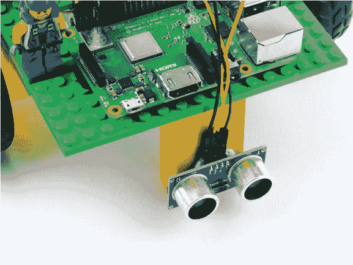

**图 5-10** 我将 HC-SR04 安装在我的机器人前方

#### 编写程序使你的机器人避开障碍物

为了创建避障程序，我们将大量借用前一节的代码，但将距离传感器设置为持续扫描即将到来的障碍物。

在清单 5-1 中，我们编写了 10 行代码来测量单个距离。在接下来的程序中，我们需要持续重复这段代码，以便不断刷新机器人与任何即将到来的障碍物之间的距离。我们可以每次需要时都写出这段代码，但那样既费时又单调，而且我们也不知道需要写多少次。相反，有一种方法可以将代码打包，这样你就可以在任何需要时随时使用它。像这样打包代码创造了所谓的*函数*。

Python 函数是一个组织好的、可重用的代码块，它执行某个操作。让我们来试试：输入清单 5-2 中的避障程序代码，并将其保存为*obstacle_avoider.py*文件在你的树莓派上。

```
   import gpiozero
   import time

➊ TRIG = 23
   ECHO = 24

   trigger = gpiozero.OutputDevice(TRIG)
   echo = gpiozero.DigitalInputDevice(ECHO)

➋ robot = gpiozero.Robot(left=(17,18), right=(27,22))

➌ def get_distance(trigger, echo):
➍     trigger.on()
       time.sleep(0.00001)
       trigger.off()

       while echo.is_active == False:
           pulse_start = time.time()

       while echo.is_active == True:
           pulse_end = time.time()

       pulse_duration = pulse_end - pulse_start

       distance = 34300 * (pulse_duration/2)

       round_distance = round(distance,1)

➎     return(round_distance)

   while  True:
➏     dist = get_distance(trigger,echo)
➐     if dist <= 15:
          robot.right(0.3)
          time.sleep(0.25)
➑     else:
          robot.forward(0.3)
          time.sleep(0.1)
```

**清单 5-2** 避障程序

该程序首先导入必要的库。然后，你像在清单 5-1 中那样设置 HC-SR04 的 Trig 和 Echo 引脚，标记➊并设置➋。这也初始化了机器人以供使用。

在第➌步，你将遇到第一个 Python 函数，它以代码块的形式组织。要开始一个函数块，你使用关键词`def`。这是*define*的缩写，因为你在定义代码块应该执行的功能。

在`def`之后，输入函数的名称，像变量一样，它可以是任何名字（前提是不能以数字开头）。最好保持函数名称简短、直观。这个函数的目的是触发传感器并返回距离测量，因此我将这个函数命名为`get_distance()`。

函数名称后面跟着括号，括号中的内容被称为函数的*参数*或*实参*。这些参数允许我们将信息传递给函数以供后续使用。在我们的例子中，我们传递了之前设置的触发器和回声引脚信息，这样函数就能够激活并使用 HC-SR04 距离传感器。

与`while`和`for`循环一样，你需要对函数内部的代码进行缩进，这样 Python 就知道哪些代码属于该函数。缩进代码从➍开始，到➎结束，并且它与清单 5-1 中用于获取距离读取的代码*完全*相同。

在➎部分，代码*返回*函数的最终输出：距离读取。返回信息意味着每次调用该函数时，函数的输出都会传递回程序。然后这些输出可以打印到终端，赋值给变量，或以你作为编程者希望的任何方式进行处理！

然后我们启动一个无限`while`循环。首先我们调用`get_distance()`函数，并将结果存储在变量`dist`中➏。

接下来，我们通过一个条件`if`语句➐引入了关键的避障逻辑。这行代码的意思是：“如果传感器与障碍物之间的距离小于 15 厘米，执行以下操作。”如果条件成立，语句中的两行代码会执行，使机器人慢慢向右转动，持续四分之一秒。

最后，代码中的➑部分处理任何其他情况。如果障碍物距离传感器超过 15 厘米，机器人会继续慢慢前进，持续十分之一秒。避障程序通常在机器人以较慢速度行驶时效果更好，因此我们在此通过`(0.3)`参数将机器人的速度设为其最大速度的 30%。如果你发现这个速度对你构建的机器人来说太慢或太快，可以随意增加或减少电机命令中的括号内的值。

#### 运行你的程序：让你的机器人避开障碍物

现在最后一段代码已经完成，建议你清理出一个足够大的区域，然后根据你的超声波距离传感器的正确高度有策略地放置障碍物。可以参考我为我的机器人快速创建的图 5-11。

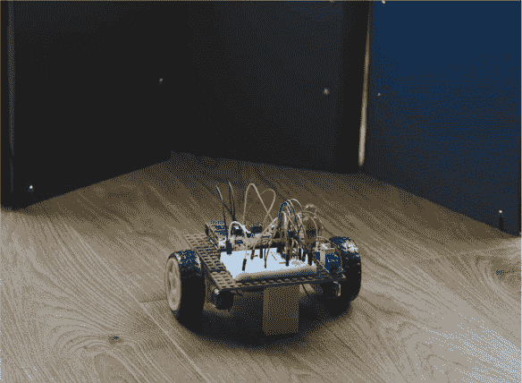

**图 5-11** 我的机器人正面对一些竖立的文件夹

使用以下命令运行你的程序：

pi@raspberrypi:~/robot $ python3 obstacle_avoider.py

你的机器人应该会活跃起来，向前行驶，直到遇到第一个障碍物，这时它应该转动，直到障碍物被清除，然后继续前进。

另一个有趣的实验是站在机器人前面，看看它如何每次都能逃离你，不论你怎么移动双脚站在它前方！

一如既往，使用 CTRL-C 命令停止机器人。

#### 挑战自我：改进避障程序

我们的避障方法仍有很大的改进空间！

如前所述，HC-SR04 只能沿单一直线检测距离，因此你的机器人可能会错过直接在它前方、但由于过低或过高而无法感知的障碍物。

只有一个距离传感器也是一个局限。你的机器人只能检测到正前方的障碍物，因此它可能会轻易地向右或向左转，撞上另一个障碍物！你使用的距离传感器越多，机器人获得的信息就越多，因此运行的代码也能变得更智能。

尝试调整清单 5-2 中的程序，以使你的机器人尽可能高效地使用一个传感器避开障碍物。你可以编辑在采取回避动作之前的最小距离（默认是 15 cm）。或者，你可以编辑每次回避时电机开启的时间，或者调整转向的方向。尝试不同的变量值，并找出最适合的配置。

当你觉得自己已经尽可能地改进了程序后，你可以再拿一个超声波 HC-SR04 模块，像之前一样将它接到树莓派的更多 GPIO 引脚上，并自定义代码，利用这个新的数据源与第一个 HC-SR04 配合使用。如果你使用两个传感器，一个不错的安装位置是把它们安装在机器人的前角，而不仅仅是正对前方。

如果你依然充满冒险精神，你可以尝试使用第三个距离传感器，以便更全面地感知你的机器人所处的环境！

### 摘要

在本章中，我们涵盖了从超声波距离测量的原理到使用函数编程的所有内容。你已经将这些知识整合在一起，成功地将你的机器人变成了一个完全自主的避障机器。

在下一章，我将向你展示如何通过添加可编程 RGB LED 和音效使你的机器人更具特色！
