## 第六章：使用灯光和声音进行自定义

让你的机器人在人群中脱颖而出是一件非常有趣的事情。在这一章中，我将展示如何为你的机器人添加灯光和扬声器，让它更加闪亮、响亮和激动人心。像往常一样，我们将涵盖理论、所需的零件以及如何使用它们。

### 将 NeoPixels 添加到你的树莓派机器人

吸引注意力的最好方式之一是让你的机器人展示一场灯光秀。通过正确的代码和接线，并借助一些明亮多彩的 LED，你可以让你的机器人在地板上跑来跑去时，呈现出令人眼花缭乱的精彩演出！

在这个项目中，你将为你的机器人安装一串超亮的多色 LED 灯。我将指导你获取组件、接线并编程不同的图案。我们将把这些新加入的功能与第四章中的 Wiimote 程序结合，这样你就可以通过按下 Wiimote 的按钮来触发不同的 LED 组合。

#### 介绍 NeoPixels 和 RGB 颜色系统

在本书的开始部分，我介绍了 LED 并展示了如何将单色 LED 接到树莓派上，并通过一个简单的 Python 脚本使其闪烁。

那是一个很好的入门项目，但单一的 LED 几乎无法为你的机器人创造预期的震撼效果。因此，在这个项目中，我们将使用像图 6-1 所示的*NeoPixels*。

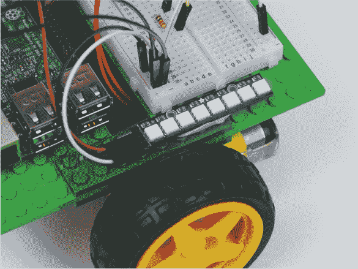

**图 6-1** 我的机器人上的 NeoPixels

NeoPixel 是开源硬件公司 Adafruit 推出的一款经济实惠、超亮的 RGB LED 灯。*RGB*代表*红绿蓝*，这是一种计算机用来表示大量颜色的混色系统。红色、绿色和蓝色的光可以以不同的比例组合，从而产生可见光谱中的任何颜色，从橙色到靛蓝再到绿色！通过设置 R、G 和 B 的强度，每种颜色的强度范围是 0 到 100%，你可以创建新的颜色。例如，纯红色表示 100% R、0% G 和 0% B，而紫色表示 50% R、0% G 和 50% B。

计算机通常不使用百分比来表示每种颜色的强度，而是使用从 0 到 255（256 个级别）的十进制数值。因此，对于红色，其组合为 255 R、0 G 和 0 B。请参见图 6-2，以了解完整的 RGB 范围，表示为色轮。


**图 6-2** 完整的 RGB 范围，表示为色轮

这意味着，与单色 LED 不同，每个 RGB NeoPixel 可以显示巨大的颜色范围。你可以通过将每个级别的可能性数相乘来计算准确的范围：256 × 256 × 256 = 16,777,216。那几乎是 1700 多万种不同的颜色！

那么，单个 LED 如何能代表如此多的颜色呢？如果你仔细看 图 6-3 中的 NeoPixel，你会发现它分为三个不同的区域。这是因为每个 NeoPixel 实际上由 *三* 个 LED 组成：分别是红色、绿色和蓝色。通过将这些颜色按不同的比例组合在一起，就可以产生 RGB 颜色，如前面所述。

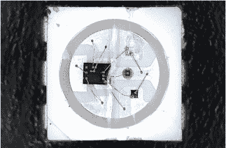

**图 6-3** NeoPixel 的宏观拍摄

#### 部件清单

NeoPixel 可以单独使用或串联在一起，Adafruit 提供了大量的 NeoPixel 产品，种类和尺寸多种多样——从单个像素到由数百个 NeoPixel 组成的大型矩阵。

在这个项目中，我建议购买一个 NeoPixel *Stick* ——这是一种大约 2 英寸长、包含八个 NeoPixel 的 LED 排列，如 图 6-4 所示。它的小尺寸和明亮的输出使其非常适合用于你的机器人。

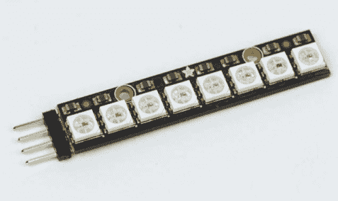

**图 6-4** 焊接好引脚的 NeoPixel Stick

如果你在美国，可以从 Adafruit 的网站上购买一个，价格不到 6 美元。如果你在其他国家或地区，只需在网上搜索 “NeoPixel Stick”，应该能找到类似价格的其他零售商。

值得注意的是，NeoPixel Stick 确实需要一定的组装工作：你需要将一组男性 *引脚* 焊接到电源和数据输入接点，如 图 6-5 所示。背面有两组看起来几乎相同的接点，唯一的区别是，一边是用于 Stick 的 *输入*，另一边是用于 Stick 的 *输出*。这样你就可以将一个 Stick 的输出连接到另一个 Stick 的输入，将多个 Stick 串联在一起。我们在这个项目中只会使用一个 NeoPixel Stick，但你可能会在以后尝试使用更多的 NeoPixel。

你需要单独购买一些男性引脚（价格不到 1 美元），并将它们焊接到包含 *DIN*（数据输入）引脚的接点上。

如果你从未焊接过，可以参考 第 204 页上的 “如何焊接” 进行指导。

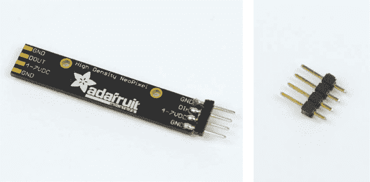

**图 6-5** 我焊接好引脚的 NeoPixel Stick 背面（L）；一个四引脚引脚排（R）

除了 NeoPixel Stick 和引脚外，你只需要一些跳线来连接 NeoPixel，并且需要一些粘性胶粘剂将它们固定在 Raspberry Pi 机器人上。

#### 连接你的 NeoPixel Stick

一旦你完成了 NeoPixel Stick 的焊接，就可以将其连接到你的 Pi 上。总共只需要三个连接就能让它正常工作。记住，图示中我不会显示之前的连接，但你无需断开之前项目的任何连接就能继续进行这个项目。

像上一章中的 HC-SR04 一样，NeoPixel Stick 可以直接插入面包板，但和那个项目一样，我不推荐这样做。相反，最好使用跳线连接 NeoPixel Stick，这样你可以将它安装在机器人的其他地方。

1.  使用跳线将 NeoPixel Stick 的 4-7VDC 引脚连接到面包板的+5V 轨道。请注意，由于这些 LED 灯非常亮，它们消耗的电流较大。因此，当我们稍后运行软件时，你需要连接并打开机器人的电池。

1.  接下来，使用另一根跳线将你的 NeoPixel Stick 的一个 GND 引脚连接到面包板的公共接地轨道。这将使你的 NeoPixel 与电源（电池）和树莓派共地。查看图 6-6 了解你当前设置的示意图。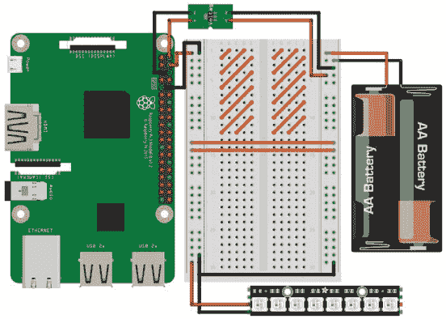

    **图 6-6** Adafruit NeoPixel Stick 连接到+5V 和接地

1.  使用一根跳线将你的 NeoPixel Stick 的 DIN（数据输入）引脚连接到树莓派的物理引脚 19（BCM 10）（关于引脚编号的指南请参见第 200 页的“树莓派 GPIO 图”）。完整的电路应该如下所示：图 6-7。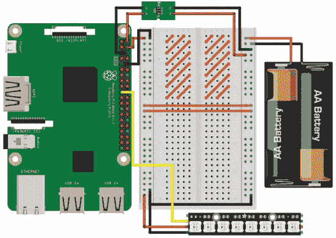

    **图 6-7** 完整的面包板示意图，显示 NeoPixel Stick 连接到电源和树莓派

    使用粘性材料将你的 NeoPixel Stick 安装在机器人的某个位置。我将它安装在面包板的右侧。

#### 安装软件

在你编程 NeoPixel Stick 之前，必须先安装和配置必要的软件。我们将使用的 Python 库叫做`rpi_ws281x`，你可以通过命令行工具`pip`从网上下载它，`pip`是一个快速且简便的 Python 软件安装和管理工具，适用于 Python 3。

在继续之前，你需要确保已经为 Python 3 安装了`pip`。为此，启动树莓派并通过 SSH 登录。然后，在终端输入以下命令：

pi@raspberrypi:~ $ sudo apt-get update

这个命令实际上并不会安装新软件，而是更新树莓派可以下载的软件列表。完成此过程后，你可以使用以下命令为 Python 3 安装`pip`：

pi@raspberrypi:~ $ sudo apt-get install python3-pip

很可能系统会提示你`pip`已为 Python 3 安装好，这样你就可以开始使用它了。如果没有安装，按照安装过程继续操作。

完成后，你可以通过一个简单的命令安装`rpi_ws281x`库：

pi@raspberrypi:~ $ sudo pip3 install rpi_ws281x

我们将使用 *SPI 总线* 来控制 NeoPixels。这只是每个 Raspberry Pi 上某些 GPIO 引脚的电子接口（确切来说是 *串行外设接口*）。默认情况下，SPI 是禁用的，但在开始本书时您应该已经通过图形界面启用了它。您可以通过以下命令打开 Raspberry Pi 软件配置工具，检查是否已启用 SPI：

pi@raspberrypi:~ $ sudo raspi-config

一旦工具打开，向下滚动到 **Interfacing Options**，选择它，然后按 ENTER。您将看到 图 6-8 中的菜单。

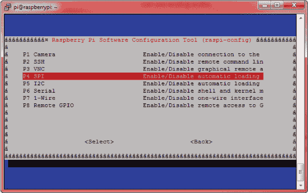

**图 6-8** `raspi-config` 工具的接口选项菜单

向下滚动并选择 **SPI**。接下来，系统会询问您是否希望启用 SPI 接口。使用左右箭头键高亮选择 **Yes**。选择后，您将返回主 `raspi-config` 菜单。您可以通过按右箭头键两次（高亮显示 **Finish**）然后按 ENTER 来退出配置工具。现在使用以下命令重启您的 Raspberry Pi：

pi@raspberrypi:~ $ sudo reboot

现在 SPI 已启用！

在 PI 3 上使 SPI 正常工作

如果您使用的是 Raspberry Pi 3 Model B/B+，在继续之前，您还需要执行一个额外的步骤。如果您使用的是较旧版本的 Pi，则不需要担心此步骤。

要使 SPI 在 Pi 3 上正常工作，您需要将 GPU 核心频率更改为 250 MHz。这意味着您正在将 Raspberry Pi 3 上的图形单元设置为以稍微不同的速度运行。如果不进行此更改，您的 NeoPixels 可能会表现异常，并且无法显示正确的图案。

要进行此更改，请在终端中输入以下命令：

pi@raspberrypi:~ $ sudo nano /boot/config.txt

这将打开一个包含各种文本和选项的配置文件。向下滚动到文件底部，在新的一行添加以下文本：

core_freq=250

例如，我的配置文件的结尾是这样的：

```
--snip--
# Additional overlays and parameters are documented /boot/
overlays/README

# Enable audio (loads snd_bcm2835)
dtparam=audio=on
start_x=1
gpu_mem=128

core_freq=250
```

添加此行后，请按 CTRL-X 保存文件，然后按 Y 和 ENTER。然后重启您的 Raspberry Pi。

**注意**

*如果您认为此过程可能已经发生变化，或者担心自己可能做错了这一步，请访问本书网站* [`nostarch.com/raspirobots/`](https://nostarch.com/raspirobots/)。

#### 配置库的示例代码

在继续之前，让我们测试一下您刚刚安装的库，以确保一切正常工作。如果您已经将本书附带的软件包下载到您的 Raspberry Pi 上，那么您已经拥有了测试文件 *strandtest.py*。该程序是由 Adafruit 编写的，用于测试 NeoPixels。如果没有这个文件，可以通过输入以下命令从互联网上下载示例代码：

pi@raspberrypi:~/robot $ wget https://raw.githubusercontent.com/

the-raspberry-pi-guy/raspirobots/master/strandtest.py

完成这些后，你将拥有与软件包中提供的完全相同的测试代码。

在运行示例代码之前，我们需要更改一些设置。要查看代码和当前设置，请使用 Nano 打开示例代码文件，如下所示：

pi@raspberrypi:~/robot $ nano strandtest.py

该程序的目的是运行多个示例灯光模式。代码相当长，充满了定义不同序列的函数，但你不需要编辑这些代码。

然而，你需要编辑程序中的一些常量。在代码的开头附近，你会找到需要编辑的代码块，示例代码见列表 6-1。

```
   # LED strip configuration:
➊ LED_COUNT      = 16      # Number of LED pixels.
➋ LED_PIN        = 18      # GPIO pin connected to the pixels 
                            (18 uses PWM!).
➌ #LED_PIN       = 10      # GPIO pin connected to the pixels 
                            (10 uses SPI /dev/spidev0.0).
   LED_FREQ_HZ    = 800000  # LED signal frequency in hertz (usually 
                            800khz)
   LED_DMA        = 10      # DMA channel to use for generating 
                            signal (try 10)
   LED_BRIGHTNESS = 255     # Set to 0 for darkest and 255 for 
                            brightest
   LED_INVERT     = False   # True to invert the signal (when using 
                            NPN transistor level shift)
   LED_CHANNEL    = 0       # set to '1' for GPIOs 13, 19, 41, 45 
                            or 53
   LED_STRIP      = ws.WS2811_STRIP_GRB   # Strip type and color
                                          ordering
```

**列表 6-1** *strandtest.py* 的 LED 条配置

每个井号字符（#）后的文字是*注释*。程序员经常在代码中添加注释作为注解。注释帮助人类读者和其他程序员理解程序的各个部分做了什么。

在 Python 中，注释以井号字符（`#`）开始。当 Python 解释这段代码时，它会忽略井号后的所有内容。良好的编码实践是为你的程序添加注释，特别是当你在团队中工作或开放源代码时。注释也方便作为提醒，特别是当你未来重新访问程序时，如果忘记了它是如何工作的！

你需要更改的第一件事出现在 ➊：`LED_COUNT`。这是一个常量，表示你连接到树莓派的 NeoPixel 数量。默认情况下，它被设置为 16，所以你需要将其更改为 8。

其次，你将更改正在使用的引脚号。常量 `LED_PIN` 在 ➋ 处默认设置为 BCM 18，但你的 NeoPixel Stick 连接到 BCM 10。这个示例代码的作者注意到使用 BCM 10 是一个流行的选择，所以他们在 ➌ 处提供了一个替代的常量定义，但已将其注释掉。

要交换这些行的位置，请在 ➋ 处的行首添加井号。这样会将该行*注释掉*，使 Python 忽略它。然后，在 ➌ 处移除井号以*取消注释*该行，这将使 Python 执行将 `LED_PIN` 赋值为 10 的代码。

你的最终常量块现在应该类似于列表 6-2 中的代码。

```
# LED strip configuration:
LED_COUNT      = 8       # Number of LED pixels.
#LED_PIN       = 18      # GPIO pin connected to the pixels (18 
                         uses PWM!).
LED_PIN        = 10      # GPIO pin connected to the pixels (10 
                         uses SPI /dev/spidev0.0).
LED_FREQ_HZ    = 800000  # LED signal frequency in hertz (usually 
                         800khz)
LED_DMA        = 10      # DMA channel to use for generating 
                         signal (try 10)
LED_BRIGHTNESS = 255     # Set to 0 for darkest and 255 for 
                         brightest
LED_INVERT     = False   # True to invert the signal (when using 
                         NPN transistor level shift)
LED_CHANNEL    = 0       # set to '1' for GPIOs 13, 19, 41, 45 or 53
LED_STRIP      = ws.WS2811_STRIP_GRB   # Strip type and color 
                                       ordering
```

**列表 6-2** *strandtest.py* 的新 LED 条配置

一旦你设置好代码，就可以运行它了。

#### 运行示例代码

保存你对示例程序所做的更改，并使用以下命令运行它：

pi@raspberrypi:~/robot $ python3 strandtest.py -c

你可能还需要戴上太阳镜！现在你的 NeoPixel 应该会通过一系列的模式，这些模式的名称会在终端中显示出来（如图 6-9 所示）。

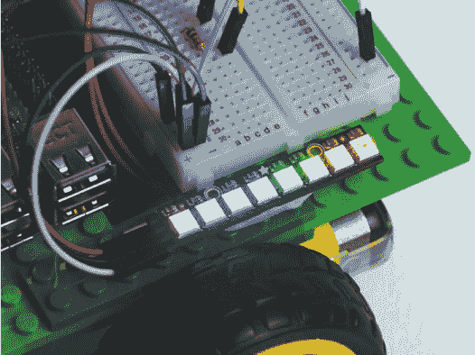

**图 6-9** NeoPixels 在 *strandtest.py* 示例程序中的运行效果

当你的视网膜受够了时，按 CTRL-C 来终止示例代码。你应该在原始运行命令的末尾添加的`–c`参数会关闭你的 LED。如果你没有在命令中添加`–c`，终止程序将只是冻结你的 LED，它们会保持亮着。

如果你担心 LED 的亮度会让你眼睛刺痛，不用担心！在我们将 NeoPixel 控制添加到 Wiimote 程序时，我会向你展示如何调低它们的亮度。

#### 使用 Wiimote 程序控制 NeoPixels

现在你已经测试了 NeoPixel 并看到了它们的能力，是时候将 LED 控制功能添加到你之前制作的基于加速度计的 Wiimote 程序中了。

我们将为 Wiimote 程序添加 NeoPixel，但最好保留原始的 Wiimote 代码副本，以防万一出现问题，或者我们以后想要恢复到原来的状态。为此，我们将创建并编辑该程序的副本。首先，确保你所在的目录是存储代码的目录；对我而言，就是我的*robot*目录。然后，在终端中使用 `cp` 命令复制原始的 Wiimote 程序：

pi@raspberrypi:~/robot $ cp remote_control_accel.py neo_remote_

control.py

这个命令简单地将第一个参数（*remote_control_accel.py*）的内容复制到第二个参数指定的新文件中。正如你所看到的，我决定将我的 Wiimote 程序的 NeoPixel 版本命名为*neo_remote_control.py*。接下来，用 Nano 打开新复制的文件，操作如下：

pi@raspberrypi:~/robot $ nano neo_remote_control.py

现在输入 Listing 6-3 中的代码修改，或者你也可以在 *[`nostarch.com/raspirobots/`](https://nostarch.com/raspirobots/)* 下载完整程序。我已经省略并压缩了那些没有变化的程序部分。

```
   import gpiozero
   import cwiid
   import time
➊ from rpi_ws281x import *

   robot = gpiozero.Robot(left=(17,18), right=(27,22))
   --snip--
   wii.rpt_mode = cwiid.RPT_BTN | cwiid.RPT_ACC

   LED_COUNT      = 8
   LED_PIN        = 10
   LED_FREQ_HZ    = 800000
   LED_DMA        = 10
➋ LED_BRIGHTNESS = 150
   LED_INVERT     = False
   LED_CHANNEL    = 0
   LED_STRIP      = ws.WS2811_STRIP_GRB

➌ strip = Adafruit_NeoPixel(LED_COUNT, LED_PIN, LED_FREQ_HZ,
   LED_DMA, LED_INVERT, LED_BRIGHTNESS, LED_CHANNEL, LED_STRIP)
   strip.begin()

➍ def colorWipe(strip, color, wait_ms=50):
       """Wipe color across display a pixel at a time."""
➎     for i in range(strip.numPixels()):
           strip.setPixelColor(i, color)
           strip.show()
           time.sleep(wait_ms/1000.0)
   while True:
➏     buttons = wii.state["buttons"]
       if (buttons & cwiid.BTN_PLUS):
           colorWipe(strip, Color(255, 0, 0))  # Red wipe
       if (buttons & cwiid.BTN_HOME):
           colorWipe(strip, Color(0, 255, 0))  # Blue wipe
       if (buttons & cwiid.BTN_MINUS):
           colorWipe(strip, Color(0, 0, 255))  # Green wipe
       if (buttons & cwiid.BTN_B):
           colorWipe(strip, Color(0, 0, 0))    # Blank

       x = (wii.state["acc"][cwiid.X] - 95) - 25
       --snip--
       if (turn_value < 0.3) and (turn_value > -0.3):
           robot.value = (forward_value, forward_value)
       else:
           robot.value = (-turn_value, turn_value)
```

**LISTING 6-3** 更新后的 Wiimote 代码，具有 NeoPixel 功能

这个程序依赖于两个额外的库，而原始的 Wiimote 代码没有使用，所以我们需要导入 `time` 和 `rpi_ws281x` 这两个库 ➊。

然后，像原始程序一样，我们设置机器人和 Wiimote 进行使用。之后，我们定义了与示例 NeoPixel 程序中看到的相同的一组常量。这些常量定义了 NeoPixel Stick 的各种参数。最显著的是，你会发现`LED_BRIGHTNESS` ➋，它是一个常量，可以设置在 0 到 255 之间。我将其设置为 150，使其更暗、更柔和，减少对眼睛的刺激。

在 ➌ 处，我们创建了 NeoPixel Stick 对象，并设置了之前定义的常量。库在接下来的行初始化。

然后我们定义一个名为`colorWipe()`的函数 ➍ 以便稍后使用。这个函数直接来自 *strandtest.py* 示例。函数内的注释描述了它的功能：它会一次擦除一个像素，并将颜色逐步应用到 NeoPixel 条上。为此，它接收一个 RGB `color` 参数，并使用 `for` 循环 ➎ 一次设置每个像素的颜色，中间有短暂的延迟。

然后，我们开始在无限的 `while` 循环中编写代码。每次循环开始时，读取 Wiimote 按钮的状态 ➏。然后，根据用户按下加号、减号或主页按钮的不同，NeoPixel 条上会逐渐显示不同的颜色，并保持该颜色，直到按下另一个按钮。如果用户按下 B 按钮，NeoPixel 将会重置。

程序的其余部分与原始程序完全相同：它处理来自控制器的加速度计输出，并使机器人相应移动。

#### 运行你的程序：NeoPixel 和 Wiimote 控制

保存你的工作并使用以下命令运行你的代码：

pi@raspberrypi:~/robot $ python3 neo_remote_control.py

现在你的机器人应该能响应来自 Wiimote 的加速度计数据。尝试按下加号、减号、主页和 B 按钮来触发不同的灯光，如 图 6-10 所示。

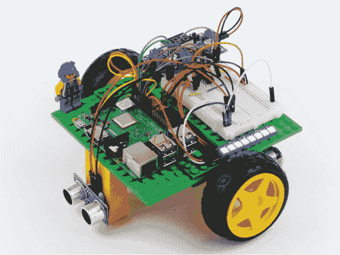

**图 6-10** 我的机器人，NeoPixel 设置为蓝色

在通过 CTRL-C 终止程序之前，确保你按下 Wiimote 上的 B 按钮关闭 NeoPixel！

#### 挑战自己：尝试不同的颜色和图案

一旦你玩过机器人和 NeoPixel，回到程序中，查看之前展示的示例代码，看看你能否通过更改 RGB 颜色组合来设置自己的自定义颜色。或者，看看你是否能够创造更具冒险精神的灯光图案来显示。

如果你有多个 NeoPixel 条，可以通过将一个条的输出连接到另一个条的输入来将它们连接在一起，打造一个更炫目的双轮车！

### 向你的树莓派机器人添加扬声器

虽然你的机器人已经取得了很大进展，但一个显著缺失的功能是能够发出声音和进行通信。在接下来的两个项目中，我们将改变这一点！我将指导你向机器人添加一个小型 3.5 毫米扬声器，并用它为之前的两个项目增加声音：为 Wiimote 程序添加车喇叭声，为障碍物避让程序添加停车传感器风格的蜂鸣声。

**警告**

*你只有拥有像 Pi 3、Pi 2、Pi 1 Model B/B+ 或甚至 A+ 这样的全尺寸树莓派时，才能跟随这些项目。像 Pi Zero 和 Pi Zero W 这样的模型没有 3.5 毫米音频插孔，因此无法轻松连接到扬声器。*

#### 理解 3.5 毫米扬声器的工作原理

一个*扬声器*（或简单的*音响*）将电气音频信号转换成可以被人类听到的声音。你会在各种环境中见到许多扬声器——从音乐会上的巨大扬声器到手机内部的微型扬声器。

为了将电气信号转换为可听见的声音，扬声器使用电磁铁使音锥振动。这个音锥会放大振动，并将声波传递到周围的空气中，最终传到你的耳朵里。

在接下来的两个项目中，你将需要一个小型 3.5 毫米扬声器，像图 6-11 中展示的那样。3.5 毫米指的是音频插孔的直径。这个尺寸是行业标准，也与大多数手机耳机插孔相同。

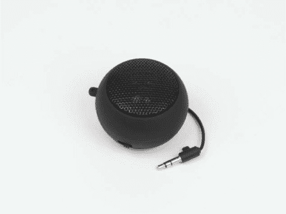

**图 6-11** 我的 3.5 毫米小型扬声器

**注意**

*如果你的扬声器不可充电，供电方式将取决于具体型号。如果需要 USB 电源，你可以将其插入 Pi 的 USB 端口之一。拥有可充电扬声器可以避免这个问题，因此在这种情况下，它是最理想的选择。*

你可以通过在 eBay、Amazon 或任何常规电子零售商处搜索来购买一个 3.5 毫米扬声器。它的价格应该不会超过 10 美元。品牌和型号并不是特别重要；只要它足够小，能够放到你的机器人上，并且声音足够大，且有 3.5 毫米插孔，你就可以使用它！

#### 连接你的扬声器

大多数小型扬声器都是可充电的，所以在将扬声器连接到树莓派之前，请确保它已完全充电并且可以正常工作。

你的 Pi 的 3.5 毫米音频插孔位于 HDMI 和以太网端口之间。将扬声器的 3.5 毫米电缆插入 Pi 上的插孔，如图 6-12 所示。

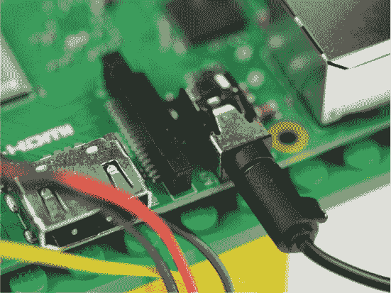

**图 6-12** 扬声器通过 3.5 毫米音频插孔连接到我的树莓派

现在将扬声器安装在你的机器人底盘的某个位置。你安装的位置取决于扬声器的大小以及你可用的空余空间。由于我没有足够的空间将扬声器直接安装到主底盘上，我决定用几块 LEGO 积木做一个小支杆，然后用粘性胶将扬声器固定在上面，正如图 6-13 所示。

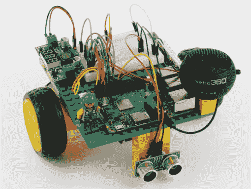

**图 6-13** 我的 3.5 毫米扬声器连接到我的 Pi，并安装在小 LEGO 支杆上方

### 向 Wiimote 程序添加汽车喇叭音效

现在让我们扩展之前的程序，让你的机器人根据命令发出汽车喇叭的声音。我们将编辑 NeoPixel Wiimote 程序，使当 Wiimote 上的 A 按钮被按下时，激活喇叭音效。

#### 安装软件

通常，你会通过在图形界面中点击音频文件并在音乐播放器应用程序中打开它来播放音频文件。但与图形界面不同，终端没有这样的功能，所以你必须使用特殊的命令来播放音频文件。与 NeoPixels 一样，你首先需要安装所需的软件并配置音频输出。

首先，确保你的树莓派上已安装 `alsa-utils` 软件包。这是一个与音频和设备驱动程序相关的软件集合。你可以使用以下命令检查它是否已安装，或者安装该软件包：

pi@raspberrypi:~/robot $ sudo apt-get install alsa-utils

如果你的树莓派提示你已经安装了最新版本的 `alsa-utils`，那就太好了！如果没有，你需要通过快速安装过程，按照提示进行操作。

完成此步骤后，剩下的唯一步骤是告诉树莓派通过 3.5 毫米音频插孔而不是 HDMI 端口播放音频。我们通过使用树莓派配置工具 `raspi-config` 来做到这一点，就像之前那样。要打开此工具，请使用以下命令：

pi@raspberrypi:~/robot $ sudo raspi-config

你应该看到一个蓝色的屏幕，中央有一个灰色框内的选项，如图 6-14 所示。

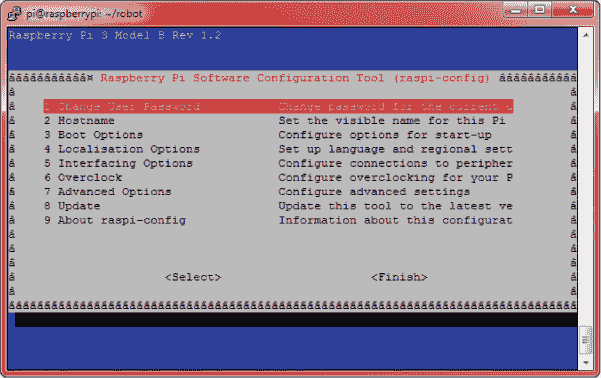

**图 6-14** 树莓派软件配置工具

现在，使用箭头键向下滚动并选择 **Advanced Options**，然后按 ENTER。这将打开一个新菜单；向下滚动至 **Audio**，选择它，并再次按 ENTER。

进入该选项后，你将看到三个选项。选择 **Force 3.5mm jack** 选项，如图 6-15 所示。

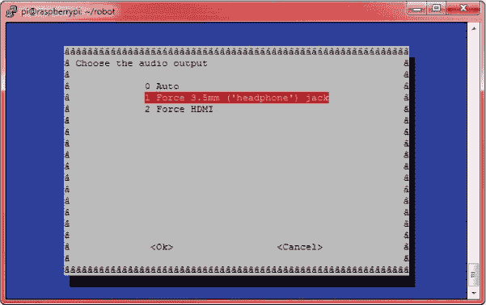

**图 6-15** 使用 `raspi-config` 选择音频输出

接下来，你将返回到 图 6-14 中显示的原始菜单。从那里，按右箭头键两次（以高亮 **Finish**），然后按 ENTER 退出配置工具。

#### 从终端播放声音

要从终端播放声音，首先你需要一些声音文件！本项目及下一个项目的音频文件可以在线找到，网址是 *[`nostarch.com/raspirobots/`](https://nostarch.com/raspirobots/)*。如果你已经批量下载了所有软件，那么你应该已经拥有这些文件。或者，你也可以通过一些简单的命令从网上获取这两个音频文件。不管哪种方式，首先在你存储所有机器人程序的文件夹内创建一个名为 *sounds* 的新目录。对我来说，这个命令如下所示：

pi@raspberrypi:~/robot $ mkdir sounds

如果你批量下载了文件，请将 *beep.wav* 和 *horn.wav* 文件转移到这个新文件夹中。如果你想直接下载这些文件，可以按如下方式切换到该目录：

pi@raspberrypi:~/robot $ cd sounds

最后，要下载每个音频文件，请使用以下命令：

pi@raspberrypi:~/robot/sounds $ wget https://raw.githubusercontent

.com/the-raspberry-pi-guy/raspirobots/master/sounds/beep.wav

接着，输入以下命令：

pi@raspberrypi:~/robot/sounds $ wget https://raw.githubusercontent

.com/the-raspberry-pi-guy/raspirobots/master/sounds/horn.wav

现在，如果你在终端中输入`ls`，你将看到两个新的音频文件——*horn.wav*和*beep.wav*：

```
pi@raspberrypi:~/robot/sounds $ ls
horn.wav  beep.wav
```

前者是我们将在本项目中使用的文件。在你测试*horn.wav*之前，使用以下命令将扬声器的软件音量调至最大：

pi@raspberrypi:~/robot/sounds $ amixer set PCM 100%

同时，确保你的 3.5 毫米扬声器上的任何物理音量控制也已调至最大。然后，为了通过 3.5 毫米扬声器播放*horn.wav*，你将使用`aplay`，一个基于终端的声音播放器，如下所示：

pi@raspberrypi:~/robot/sounds $ aplay horn.wav

正在播放 WAVE 'horn.wav'：签名 24 位小端格式，3 字节，

频率 44100 Hz，立体声

你应该能听到机器人发出单一的汽车喇叭声！

#### 使用 Wiimote 程序播放声音

现在你了解了如何通过终端播放音频文件，你可以将此功能添加到本章早些时候的 Wiimote 程序中。这意味着你的机器人不仅可以触发灯光秀，还可以在你想要的时候鸣响汽车喇叭！

为了实现这一点，我们将在 Python 中调用`aplay`命令。返回到*robots*目录，然后使用以下命令重新打开 NeoPixel/Wiimote 代码：

pi@raspberrypi:~/robot $ nano neo_remote_control.py

然后，将清单 6-4 中的新增内容添加到你的代码中。如之前一样，所有未更改的代码已被省略。或者，你可以从本书网站下载修改后的文件。

```
   import gpiozero
   import cwiid
   import time
   from rpi_ws281x import *
➊ import os

   robot = gpiozero.Robot(left=(17,18), right=(27,22))
   --snip--

   while True:
       buttons = wii.state["buttons"]
       if (buttons & cwiid.BTN_PLUS):
           colorWipe(strip, Color(255, 0, 0))  # Red wipe
       --snip--
       if (buttons & cwiid.BTN_B):
           colorWipe(strip, Color(0, 0, 0))    # Blank

➋     if (buttons & cwiid.BTN_A):
           os.system("aplay sounds/horn.wav")

        x = (wii.state["acc"][cwiid.X] - 95) - 25
       --snip--
       if (turn_value < 0.3) and (turn_value > -0.3):
           robot.value = (forward_value, forward_value)
       else:
           robot.value = (-turn_value, turn_value)
```

**清单 6-4** 修改后的 NeoPixel/Wiimote 代码，加入汽车喇叭声音效果

所需的新增内容很简单，仅涉及三行。首先需要注意的是在➊处，`os`库被导入。`os`库使我们能够在 Python 程序中使用树莓派操作系统的功能。

这在➋处非常有用。在这里，程序检测用户是否按下了 Wiimote 上的 A 按钮。如果是，它会使用`os.system`调用之前使用的相同的`aplay`终端命令。请注意，这里还包括了一个简短的文件路径指向*horn.wav*音频文件，因为这个文件存储在与程序不同的目录中。

#### 运行你的程序：NeoPixels、声音效果和 Wiimote 控制

保存你的工作，并使用与上一个项目相同的命令运行它：

pi@raspberrypi:~/robot $ python3 neo_remote_control.py

你的机器人现在将像以前一样通过加速度计控制进行响应。你还可以像以前一样触发相同的灯光。现在尝试按下 A 按钮：你应该听到机器人鸣响喇叭！

### 向避障程序中添加蜂鸣声

在本项目中，我们将重新访问你在第五章中编写的避障程序，并在机器人检测到 15 厘米范围内的障碍物时添加一个蜂鸣声来提醒你。

#### 将蜂鸣声集成到避障程序中

你已经设置好了扬声器并配置了必要的软件，所以我们可以直接开始将蜂鸣声集成到避障程序中了。

我们将像之前为喇叭所做的那样，通过在 Python 程序中调用 `aplay` 来实现。我建议使用 `cp` 来创建一个避障程序的新副本。我将我的副本命名为 *beep_obstacle_avoider.py*。请输入我所做的修改，如清单 6-5 所示。

```
   import gpiozero
   import time
➊ import os

   TRIG = 23
   ECHO = 24

   trigger = gpiozero.OutputDevice(TRIG)
   --snip--

   while True:
      dist = get_distance(trigger,echo)
      if dist <= 15:
➋         os.system("aplay sounds/beep.wav")
           robot.right(0.3)
           time.sleep(0.25)
      else:
           robot.forward(0.3)
           time.sleep(0.1)
```

**清单 6-5** *beep_obstacle_avoider.py* 程序

就像之前一样，我们导入 `os` 模块 ➊。然后，如果传感器检测到距离小于或等于 15 厘米的物体，程序会播放蜂鸣声 ➋，并且机器人改变方向。

#### 运行你的程序：避障时发出蜂鸣声

保存你的工作并使用以下命令运行：

pi@raspberrypi:~/robot $ python3 beep_obstacle_avoider.py

现在你的机器人会避开障碍物，并在此过程中发出蜂鸣声！

#### 挑战自己：为你的其他项目添加音效

现在你已经了解了将音效添加到程序中的相对简单过程，为什么不回顾一下你在本书中编写的其他程序，并为它们添加声音呢？你可以用手机录制自己的声音，或者使用提供免费音频文件的在线音效库。例如，可以查看 Freesound: *[`freesound.org/`](https://freesound.org/)*。

### 总结

在本章中，你为你的机器人装上了超亮的 NeoPixels，并赋予了它声音的能力！在三个不同的项目中，我们从 RGB LED 的理论到如何在终端播放音频，都做了详细讲解。

在下一章中，我们将使你的机器人更加智能！我将指导你完成让你的两轮车能够自主跟随路线的过程。
