## 第七章：跟踪线

本章中，你将赋予机器人检测并自动跟随一条线的能力。它将能够识别自己的路径，然后决定如何精确地坚持走下去。

这是一次对数字识别和巧妙编程的测试。它也是一个经典的机器人任务，对于每个人来说，从初学者到专业人士都很重要。完成这个项目后，你将拥有一个完全自主的机器人，它将能够像胶水一样坚持沿着线行驶！

### 创建轨道

像往常一样，在开始任何项目之前，重要且有用的是退后一步，分析当前的任务。这里的目标是让你的机器人沿着一条线行驶。更具体地说，你希望让机器人沿着一个白色背景上的黑色线条行驶，像图 7-1 中所示的那样。

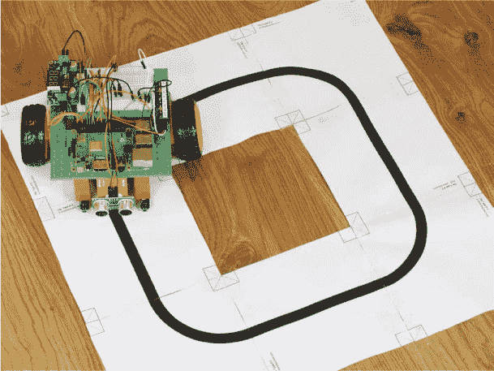

**图 7-1** 我的机器人沿着黑线行驶

白色和黑色的组合提供了最大的对比度，帮助你的机器人使用简单的跟踪传感器。

第一步是为你的机器人创建一条它可以跟随的线。你可以随意设计轨道的形状，最简单的选项是一个基本的环形，但只要背景是白色的，线条是黑色的，尽管发挥创意。我还建议将线条的宽度设定为大约 1/4 英寸。

创建轨道有很多不同的方法。你可以简单地拿一大张纸（至少是账单大小，大约 11 × 17 英寸），用黑色马克笔画上一条粗线。你也可以用一些黑色电工胶带贴在白色海报板上。你甚至可以在线购买现成的跟踪轨道。如果你有打印机，我建议在信纸大小的纸上打印出轨道，然后用胶带把它们拼接起来。

我还在本书的资源中提供了一个模板，供你制作成任意形状的轨道，你可以在 Windows、Mac 或 Linux 电脑上访问：

1.  如果你还没有这样做，下载软件包到你的个人电脑，网址是 [*https://nostarch.com/raspirobots/*](https://nostarch.com/raspirobots/)。

1.  转到存储软件的文件夹，然后打开名为*track_generator.pdf*的 PDF 文件。这是一个 34 页的文档，包含了许多 20 × 20 厘米的瓷砖，上面有不同的线条（见图 7-2）。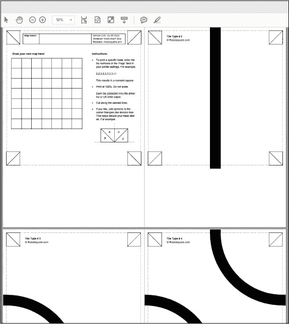

    **图 7-2** *track_generator.pdf* 文档

1.  打印出你想要拼接成轨道的线条，剪下来，然后把它们粘在一起，组成你自己的自定义轨道。PDF 文档的前几页展示了简单的路径，如直线和拐角，但往下滚动，你会看到越来越复杂的路径！

    对于你的第一个轨道，我建议保持相对简单。记住，你可以随时打印出更多瓷砖，并在未来为你的机器人设计一个更难的课程。

1.  为了创建一个简单的环形轨道，像图 7-3 所示那样，打印出四份瓷砖类型#2（直线）和四份瓷砖类型#3（基本转角）。你应该能够通过 PDF 阅读器软件的打印对话框专门打印这些页面。确保每块瓷砖占用一张信纸大小的纸张。

1.  使用剪刀沿着每块瓷砖的虚线剪开。然后按照图 7-3 所示将它们排列成环形，并沿着*底面*的长度使用胶带将瓷砖的边缘连接在一起。你的轨道现在已经完成！

警告

*确保在连接瓷砖时不要把胶带贴在黑线上的位置，因为这可能会影响传感器的性能。同时尽量消除瓷砖之间的任何缝隙或褶皱——这些都会妨碍机器人运动！*

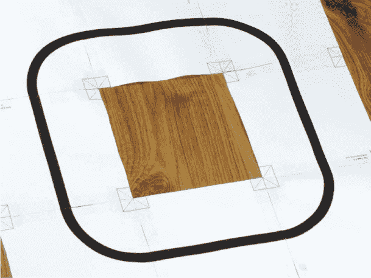

**图 7-3** 我组装的基本跟踪轨道

### 跟踪线路背后的理论

我们将使用*红外*（IR）传感器让你的 Raspberry Pi 机器人跟踪黑色线条。在第五章中，我们使用类似的技术来避障，当时我们使用超声波来检测物体。但在这一章，我们将使用不可见的光线，而不是声音。幸运的是，你之前学到的很多理论也可以在这里应用。

每个 IR 传感器，如图 7-4 中的传感器，都有两个小的灯泡状装置——一个红外发射器和一个接收器，通常安排并紧密地放置在一起。发射器是一个 IR LED，当被触发时，会发射一个红外光脉冲。接收器是一个 IR 光电二极管，等待接收到发射的光。*光电二极管*只是一个利用光线改变电流的装置。

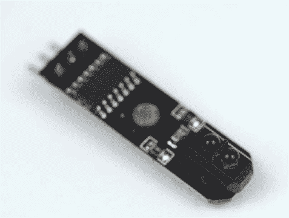

**图 7-4** 一个 IR 传感器

光与不同类型的表面之间的相互作用是不同的。最明显的是，光在白色表面上*反射*更多，而在黑色表面上几乎完全被*吸收*，这使得 IR 传感器能够检测到白色背景上的黑色线条。

如图 7-5 所示，如果 IR 传感器模块位于白色表面上，接收器将检测到发射器发出的红外光束的反射。如果传感器位于黑色表面上，比如你的轨道上的线，接收器将无法检测到反射。反射率的差异使得传感器模块能够检测到前方是否有线条。

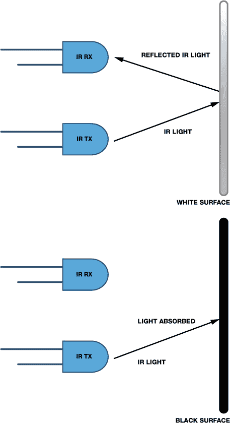

**图 7-5** 红外光遇到白色与黑色表面的不同表现

将一个红外传感器安装在机器人底部，可以让它检测到黑色线条的存在，但如果机器人移动使得传感器不再直接位于线条上，它很容易偏离轨道。只有一个传感器，机器人无法轻松地检测自己是否已经偏离了线条的左侧或右侧。因此，我们将使用两个红外传感器，分别安装在机器人底部的前方，约一英寸的间距。两个传感器将提供一个反馈机制，帮助机器人判断方向。这些传感器的输出有四种可能，每种情况都会指导机器人。

+   如果两个传感器都接收到反射信号并且检测到白色，机器人可以认为线条位于两个传感器之间。因此，机器人应沿直线向前移动（见图 7-6）。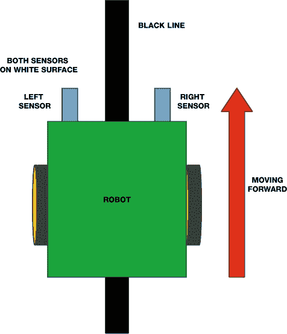

    **图 7-6** 当两个传感器都检测到白色时，机器人向前移动。

+   如果左侧传感器没有接收到反射信号，而右侧传感器接收到了，这就意味着左侧传感器检测到了线条。这表明机器人可能偏离了轨道向右，因此应该向左转以纠正自己，如图 7-7 所示。

+   如果右侧传感器检测到线条而左侧传感器没有，机器人应该通过向右转来纠正自己，如图 7-7 底部所示。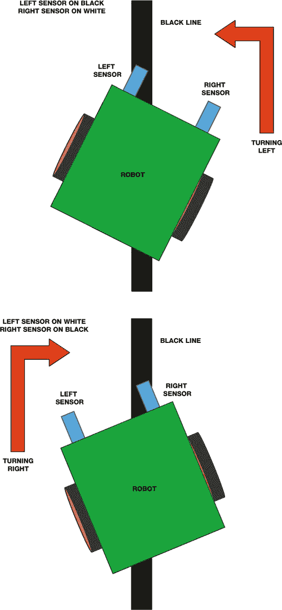

    **图 7-7** 如果其中一个传感器检测到黑色线条，机器人会向左或向右转动。

+   最后，如果两个传感器都没有收到反射信号，那么它们*都*应该检测到黑色，如图 7-8 所示（如果你使用的是基础的环形轨道，这种情况不会发生）。接下来该做什么由你决定，但一个选择是让机器人停止。如果你尝试其他轨道布局——例如，数字 8 形状——你可能会遇到两个传感器都检测到黑色的情况。在这种情况下，你可能希望机器人前进、转弯，甚至倒退——试试看，找到最合适的方案！

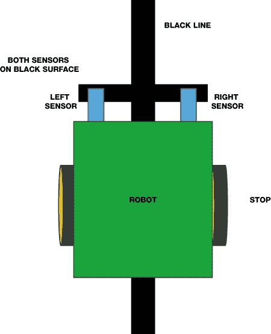

**图 7-8** 如果两个传感器都检测到黑色，机器人会停止。

### 使用红外传感器检测线条

在你开始将两个红外传感器安装到树莓派并配置完整的跟线机器人代码之前，让我们先连接一个红外传感器并测试它的线条检测反应。

#### 部件清单

在这个项目部分，你只需要使用一个传感器，但请确保购买两个，因为下一个项目中你会需要两个！

+   2 个基于 TCRT5000 的红外线跟踪传感器模块

+   跳线

基于 TCRT5000 的线路跟踪传感器模块，如图 7-9 中所示，非常常见，可以在网上以不到几美元的价格购买。我是通过在 eBay 上搜索“TCRT5000 线路跟随模块”购买的。传感器名称中的*TCRT5000*部分指的是红外光学传感器，即电路板底部的小黑色组件。

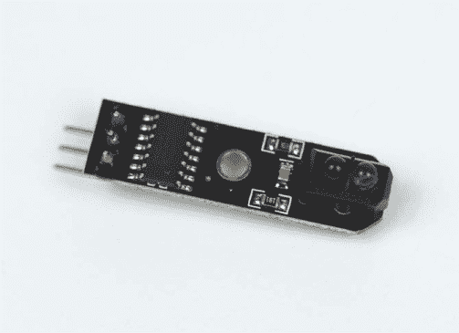

**图 7-9** 我的 TCRT5000 红外线跟踪传感器模块

请确保获取像图 7-9 中所示的线路跟踪*模块*，因为这意味着光学传感器的功能已经被整齐地封装成一个易于使用的组件。这些板有一组简单的引脚，只需要三个连接（参见图 7-10）。

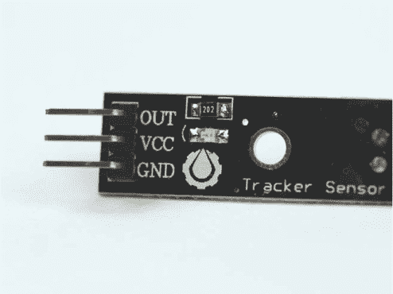

**图 7-10** TCRT5000 红外传感器模块的引脚图

红外二极管被封装在小黑色组件内部，并在模块连接电源时持续发射红外光。如果光线没有反射回传感器，说明必须存在一条黑线，并且模块的输出引脚（OUT）会变低（即电压下降）。这种简单的数字逻辑非常理想，更棒的是，模块可以通过 Pi 的 3.3 V 电源供电。这样我们就不必像在第五章中为超声波距离传感器所做的那样使用电压分压电路了。

**注意**

*记住，您无需断开之前的任何电路，但我不会在这里显示这些连接。*

#### 接线您的 TCRT5000 线路跟踪传感器模块

断开树莓派的电源，并按照以下说明连接您的传感器：

1.  使用一根 F-F 跳线将 TCRT5000 模块的 VCC 引脚连接到树莓派的物理引脚 1。这是 +3.3 V 连接，提供传感器的电源。

1.  使用另一根跳线将模块的 GND 引脚连接到面包板上的公共接地轨道。到目前为止，您的接线应该像图 7-11 所示。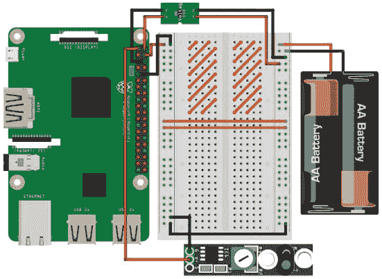

    **图 7-11** 线路跟踪传感器连接到 +3.3 V 和 GND

1.  使用另一根跳线将传感器的数据输出引脚（OUT）连接到树莓派的物理引脚 21。这是 BCM 9。您的完整电路应该像图 7-12 所示。

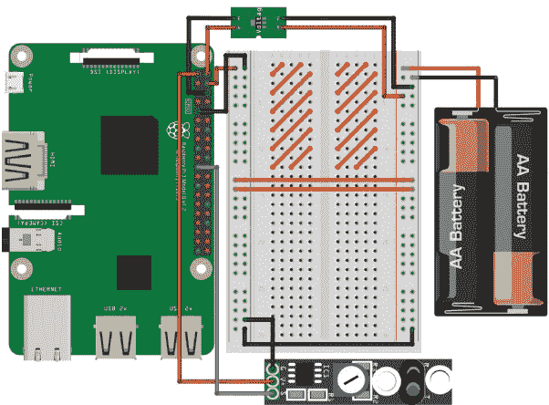

**图 7-12** 完整的面包板电路图，展示了您的 TCRT5000 线路跟踪传感器模块已经接线并就位

#### 编程您的树莓派以检测线路

现在您已经将线路传感器连接到树莓派，让我们编写一些代码来测试其线路检测响应。通过墙壁插座为树莓派供电，启动它并进入代码文件夹，然后输入以下命令创建并打开一个名为*line_test.py*的测试程序：

pi@raspberrypi:~/robot $ nano line_test.py

添加清单 7-1 中的代码，这将测试你的 TCRT5000 模块。该程序的目的是仅仅输出到终端，告知用户模块是否检测到了一条线。

```
   import gpiozero
   import time

➊ line_sensor = gpiozero.DigitalInputDevice(9)

   while True:
      ➋ if line_sensor.is_active == False:
                  print("Line detected")
      ➌ else:
                  print("No line detected")

          time.sleep(0.2)      
```

**清单 7-1** 检测一条线

在导入常用库之后，我们将线传感器设置为 BCM 9 上的数字输入 ➊。

**注意**

*TCRT5000 的检测距离在 1 毫米到 8 毫米之间。如果线条距离传感器太远，它可能会出现误报或漏报。*

然后我们开始一个无限的`while True`循环，包含程序的逻辑。在 ➋ 处，我们使用`if`语句来检测线传感器是否处于活动状态。如果它*没有*处于活动状态，必须意味着红外反射没有返回，因此发射的光线已经被黑线吸收。所以，线条已经被检测到，并且我们通过`if`语句内的`print()`语句告知用户。

任何其他情况都意味着线传感器是活动的，因此*没有*检测到一条线。`else`语句 ➌ 捕获了这种替代情况，并输出到用户，告知没有检测到线。程序随后等待五分之一秒并重新开始循环。

#### 运行你的程序：检测一条线！

保存程序后，拿一段轨道来测试你的传感器。要运行程序，输入：

pi@raspberrypi:~/robot $ python3 line_test.py

当传感器周围没有任何物体时，可能会产生不稳定的结果，这些结果会显示在终端中。将你的轨道带到模块上并移动线条到传感器上。你应该会注意到，随着你移动轨道，终端输出会变化为`Line detected`：

```
pi@raspberrypi:~/robot $ python3 line_test.py
No line detected
No line detected
Line detected
Line detected
```

我的传感器上也有一个 LED 灯，当线条出现在视野中时，它会改变状态。

如果你遇到模块问题，且它没有很好地检测到线条，可以尝试几种方法。首先，尝试通过关闭灯光来限制来自其他光源的干扰。或者，一些 TCRT5000 模块上有一个内置的电位器，用于调整灵敏度。这个电位器通常看起来像一块蓝白色的塑料，上面有一个可以插入螺丝刀的地方。使用合适的螺丝刀或其他工具来旋转这个电位器，看看是否能改善你的读数。

### 让你的机器人自主跟踪一条线

当你的传感器成功检测到线条时，就该给你的机器人增加跟踪轨迹的能力了。

在本项目结束时，你将连接上第二个传感器，并编写完整的自主程序逻辑，打造一台能够跟踪线路的机器人。

#### 连接第二个 TCRT5000 线跟踪传感器模块

你已经连接了第一个 TCRT5000 模块，现在只需连接第二个模块。如果第一个模块没有连接，请翻回几页，按照之前项目中的接线指南进行操作。

连接第二个传感器的过程如下：

1.  拿一根 F-F 跳线，将第二个 TCRT5000 模块的 VCC 引脚连接到 Raspberry Pi 上的物理引脚 17。这是另一个 +3.3 V 引脚，将为传感器提供电源。

1.  现在，使用一根跳线将新模块的 GND 引脚连接到面包板上的公共地轨。

1.  使用一根电线将第二个传感器的数据输出引脚（OUT）连接到 Raspberry Pi 的物理引脚 23。这是 BCM 11。第二个传感器的接线（省略第一个传感器）应类似于图 7-13 所示。

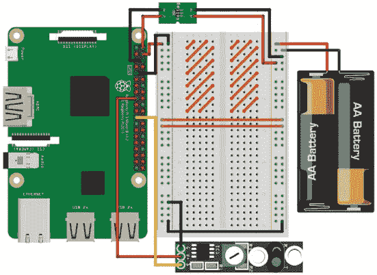

**图 7-13** 第二个线路跟踪传感器连接到电源、地和数据

将两个线路跟踪传感器连接后，你的面包板应该像图 7-14 一样。

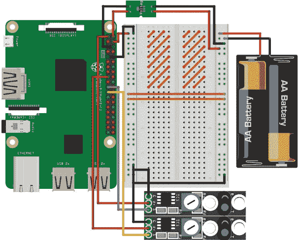

**图 7-14** 两个线路跟踪传感器连接到 Raspberry Pi

#### 安装你的传感器

现在你需要将 TCRT5000 模块安装到机器人前部的底面。

为了避免以后修改代码示例，确保你首先连接的 TCRT5000 模块（连接到 BCM 9 的那个）位于机器人*左侧*，第二个 TCRT5000 模块（连接到 BCM 11 的那个）位于机器人*右侧*。

你可以根据自己的需求将这些传感器安装到底盘上。如果你使用的是像我一样的 LEGO 机器人，建议将两个由 2×2 LEGO 块组成的小支架固定到底盘底部；我的支架大约有四个块高。你还可以使用粘性胶将模块固定在支架底部，就像我做的那样（见图 7-15）。我已经将传感器的电线穿过 LEGO 底盘中间的空隙。

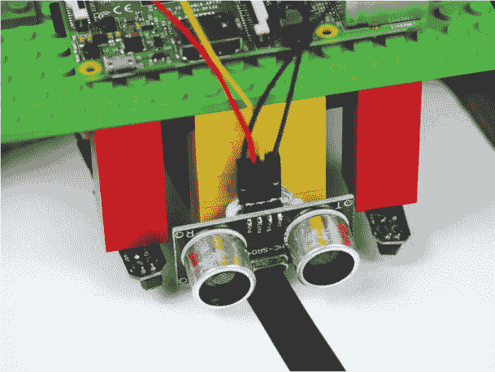

**图 7-15** 我安装在 LEGO 支架上的红外传感器，位于机器人底部

安装模块时，请记住，从光学传感器到地面的最佳距离范围为 1 毫米至 8 毫米。同时还要记住，它们之间的间隙越大，你的机器人偏离线路的幅度就越大，直到它纠正自己。作为参考，我的传感器彼此之间仅相隔一到两英寸，并且分别放置在前部稳定器的两侧。

#### 编程让你的机器人沿线行驶

当你的传感器都已连接并安装到位时，接下来是编写代码，让你的机器人能够沿着线路行驶。

使用 Nano 打开一个新的程序，并命名为 *line_follower.py*，如下所示：

pi@raspberrypi:~/robot $ nano line_follower.py

清单 7-2 中的代码将我们之前讨论的线路跟踪的理论和过程付诸实践。在继续讲解之前，花点时间查看一下代码。

```
   import gpiozero

➊ SPEED = 0.25

   robot = gpiozero.Robot(left=(17,18), right=(27,22))

➋ left = gpiozero.DigitalInputDevice(9)
   right = gpiozero.DigitalInputDevice(11)

   while True:
    ➌ if (left.is_active == True) and (right.is_active == True):
             robot.forward(SPEED)
    ➍ elif (left.is_active == False) and (right.is_active == True):
             robot.right(SPEED)
    ➎ elif (left.is_active == True) and (right.is_active == False):
             robot.left(SPEED)
    ➏ else:
             robot.stop()
```

**清单 7-2** 沿线路行驶

这里的代码遵循与本书中之前项目相同的逻辑布局。我们导入`gpiozero`，然后初始化一个常量`SPEED`，并将其设置为 0.25 ➊。这个值表示机器人在整个程序中的速度，可以设置为 0 到 1 之间的任何值。

当你第一次运行这段代码时，你会发现机器人行驶速度对其循迹能力有巨大影响。通过在程序开始时定义一个常量，你可以轻松地调整这个设置，而无需在后续的代码中翻找。

在➋处，我们将第一个 TCRT5000 传感器设置为数字输入，并将其赋值给变量`left`。然后我们对第二个循迹传感器执行相同操作，将其赋值给变量`right`。

然后，我们开始一个无限的`while True`循环，包含程序的主要逻辑：一系列的`if`语句。这里就是实现循迹理论的地方。

在➌处的代码处理了两传感器都活跃并且都读取到白色的情况。在没有检测到黑线的情况下，程序假设黑线就在传感器下方，并且机器人按照给定速度向前行驶。

接下来，一个`elif`语句 ➍ 捕捉到左传感器关闭并检测到黑色，而右传感器活跃并检测到白色的情况。在这种情况下，我们需要执行纠正操作，使机器人右转。

然后，几乎相同的`elif`语句 ➎ 处理右传感器检测到黑线的情况。这时，纠正操作使机器人左转。

最后，在➏处我们使用`else`语句处理剩下的唯一选项：两个传感器都不活跃，因此都读取为黑色。机器人在此之后的具体行为由你来定义。在我的代码中，我决定停止它的运动。

#### 运行你的程序：让你的机器人沿线行驶！

现在，随着你的循迹程序完成，将机器人连接到电池电源，并将其放置在你先前创建的测试轨道上。为了获得最佳效果，确保黑线正好位于机器人下方，并且在两个 TCRT5000 传感器之间（参见图 7-16）。

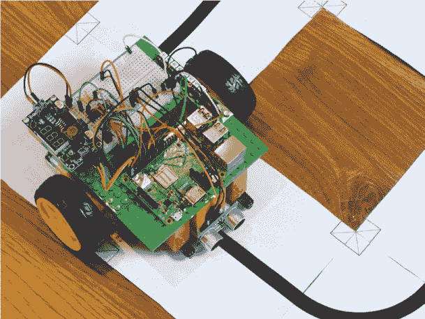

**图 7-16** 我的机器人就位，准备沿线行驶

使用以下命令运行程序：

pi@raspberrypi:~/robot $ python3 line_follower.py

你的机器人现在应该能够完全自主地沿着轨道行驶，并且毫无问题地跟随黑线。看着机器人在无尽的循环中快速穿行，欣赏你的成果吧！

**注意**

*你可能会发现需要将轨道粘贴到地板上，以防止机器人轮子将其移位。如果是这种情况，只需用胶带将轨道固定好，确保稳固且不永久性固定。*

循迹实验

线路跟踪是机器人学中的经典课程，但正如你可能已经察觉到的，它可能需要大量的调整和修改才能提高效果和结果。你可能已经注意到，你可以通过改变许多不同的因素来改变线路跟踪器的性能。以下是我的一些建议。

改变赛道

虽然简单的回路是一个很好的初次测试平台，但它很快就会变得无聊。为了挑战你的机器人，试着创造一个更具冒险性的赛道。使用更紧的转弯、更长的直线和更复杂的几何形状！你甚至可以从真实的赛道中获得灵感——例如，见图 7-17 中的摩纳哥大奖赛赛道（Figure 7-17）。

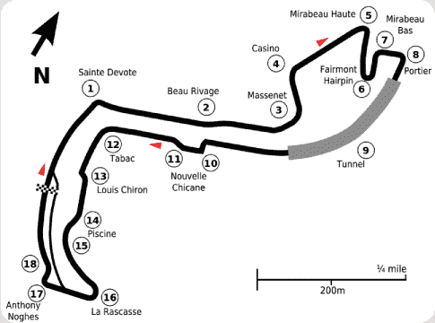

**图 7-17** 摩纳哥大奖赛赛道表示为一条黑线，你的机器人可以沿着这条线行驶

改变速度

你的机器人在赛道上行驶得越快，它对 TCRT5000 传感器提供的信息反应的时间就越少。在更快的速度下，你可能会发现机器人会偏离线路。你可以通过进入程序，编辑代码顶部定义的`SPEED`常量来改变机器人的速度。

你也可能会发现，你想要为不同的动作调整线路跟踪器的速度。例如，当机器人绕过转弯时，可能需要慢一点。你可以通过在程序中创建另一个常量`CORNER_SPEED`并将其应用到左右转弯的函数中来实现这一功能。

当你微调你的线路跟踪机器人速度时，计时它绕赛道行驶的时间。看看你能让它多快地精确跟踪线路。你甚至可以和朋友们比赛，举办一场线路跟踪竞赛，看看谁的代码最好。

改变传感器的位置

红外传感器之间的距离越远，你的机器人偏离线路的距离就越大，直到执行修正动作。这可能会导致你的机器人沿着线路呈之字形打滑。试着将模块放得更近，看看这会如何影响你的线路跟踪器的表现。

你应该会发现，当模块放得更近时，机器人会更多地左右转动以重新回到轨道。这意味着你的机器人会更精确地跟踪线路，但这会有什么代价呢？它是否会影响机器人完成赛道的速度？动动脑筋，试试看吧！

添加更多传感器

如果你想进一步提升，可以添加更多的线路跟踪传感器。就像避障一样，机器人对于自身位置的信息越多，背后的程序就越智能。如果你能够添加第三、第四甚至第五个 TCRT5000 模块，那么你就可以判断机器人偏离线路的程度。然后，你可以利用这些信息来调整修正动作的幅度。例如，如果机器人偏离线路较远，它可以执行更快速的修正操作。

### 总结

在这一章中，你已经赋予了你的机器人自主跟踪一条线路的能力。我们涵盖了从线路跟踪的理论到所需传感器以及它们背后的代码的所有内容。

在下一章中，我将向你展示如何使用官方的树莓派相机模块来识别和跟踪一个彩色球！
