## 第八章：计算机视觉：跟踪一个彩色球

作为人类，我们通过眼睛和大脑来看待和理解周围的世界。虽然这一过程对我们来说是自动发生的，但视觉实际上是一个极为复杂的过程。

*计算机视觉*是计算机科学和工程的一个高级领域，旨在使计算机和机器能够像人类一样，甚至更好地“看”和理解周围环境。在本章中，你将学习一些计算机视觉的原理，然后我会展示如何使用摄像头让你的机器人识别并跟踪一个彩色球。

### 计算机视觉过程

想象一下观察、识别和反应于一个彩色物体的过程。首先，物体的图像通过你的眼睛传到视网膜。视网膜进行一些基础分析，然后将接收到的光转化为神经信号，这些信号被发送到大脑，并由视觉皮层进行彻底分析。然后，大脑识别出物体并发出指令给你的肌肉。

令人惊讶的是，这一切发生在极短的时间内，并且不需要任何意识上的努力。

即使是这样简化的解释，你也能感受到视觉的复杂性。让计算机完成类似的任务，正是计算机视觉领域的专家们不懈努力的目标，*几十年来*他们都在为此奋斗。

任何计算机视觉系统必须能够完成三项任务：

**看** 生物体通常通过眼睛来看。计算机必须使用它们的数字等价物：摄像头。摄像头通过镜头将光线聚焦到数字传感器上。该传感器随后将光线转化为数字信息：图像或视频帧。

**处理** 输入捕获后，必须对其进行处理以提取信息、识别模式和操作数据。在自然界中，这是大脑的功能。对于计算机视觉来说，这由代码和算法来完成。

**理解** 然后，信息必须被理解。计算机可能已经检测并处理了一个模式，但这个模式是什么，它意味着什么？同样，这个重要步骤依赖于代码和算法。

当这三个元素协同工作时，计算机就能处理各种基于视觉的问题，包括我们在本章中要解决的问题：我们将赋予你的机器人检测、识别并朝着一个可能出现在其周围环境中的彩色球移动的能力。

### 部件清单

你需要为下一个项目准备两样新物品：

+   一个彩色球

+   标准 Pi 摄像头模块

最初，你还需要访问另一台计算机来远程查看在本项目配置阶段通过 Pi 摄像头模块拍摄的图像。这可以是你用来通过 SSH 连接到 Pi 的计算机。如果你在本书的过程中没有使用过 SSH，那么你可以在配置时直接将 Pi 连接到 HDMI 显示器上。

让我们更仔细地看看新的部件。

#### 目标：彩色球

首先，你需要一个彩色球作为你的机器人要寻找并跟随的目标。你的球应该是一个明亮的颜色，在房间里不常见，以帮助你的机器人将其与其他物体区分开来。我建议使用一些独特且不太大的球，比如图 8-1 中显示的球。我使用的是一个大约 2 英寸直径的亮黄色减压球。你可能已经有类似的物品放在家里，如果没有，你应该能在网上以几美元的价格买到一个类似的。

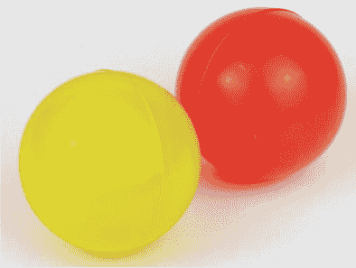

**图 8-1** 作为目标的彩色球示例；我使用的是左边的黄色球。

#### 官方树莓派相机模块

为了让你的机器人具备视觉能力，你需要一台相机。在这个项目中，我们将使用官方的树莓派相机模块，如图 8-2 所示。

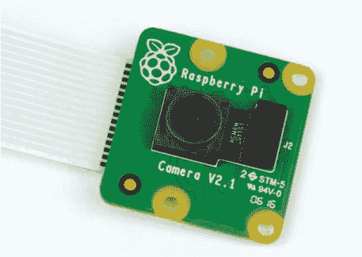

**图 8-2** 官方树莓派相机模块

相机模块是一个由树莓派基金会设计和生产的树莓派扩展板。最新型号配备了一个 800 万像素的传感器，尺寸不到 1 英寸见方！它不仅能够拍摄出色的静态照片，还可以以每秒 30 帧的速度录制全高清视频。如果你使用的是旧款 500 万像素的型号，不用担心：它完全兼容这个项目，并且用法完全相同。

相机模块上的 6 英寸带状电缆连接到树莓派上的 CSI（相机串行接口）端口，如图 8-3 所示。它与所有模型兼容，包括最新版本的 Pi Zero。

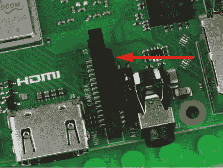

**图 8-3** 树莓派上的 CSI 接口端口

**注意**

*Pi Zero 采用的是迷你 CSI 接口，而不是其他所有树莓派型号上常见的标准尺寸接口。为了将相机模块连接到 Pi Zero，你还需要购买一个迷你 CSI 到 CSI 的连接线。这些通常在网上被标记为“Pi Zero 相机电缆”，价格大约是 5 美元。请记住，这个项目需要强大的图像处理能力和代码，运行速度较快的标准尺寸树莓派模型比 Zero 或原始树莓派模型表现得更好。*

你可以通过常规的零售商在线购买官方树莓派相机模块，价格大约为 30 美元。

在网上查看时，你可能会注意到实际上有两种不同的官方相机模块：普通相机和*NoIR*版本，后者可以用于夜视。你需要的是*标准*相机模块。通过颜色差异，你可以轻松区分这两个板子：普通相机模块的电路板是绿色的，而 NoIR 模块是黑色的。

### 连接和设置你的相机模块

在安装相机模块之前，请确保你的树莓派已经关闭。然后按照以下步骤进行操作：

1.  定位树莓派上的 CSI 接口。对于所有全尺寸的树莓派模型，它位于 HDMI 接口和 3.5 毫米音频插孔之间，并且清晰标注为 CAMERA。

1.  接下来，通过轻轻但坚定地从两侧抓住接口并向上拉，打开端口（请参见 图 8-4）。这是一个细致的操作，通常最好将指甲插到两侧下方。image

    **图 8-4** 打开的 CSI 接口，用于插入电缆

1.  将相机模块的排线完全插入 CSI 接口，银色接触点朝 *远离* 3.5 毫米音频插孔和以太网端口的一侧（请参见 图 8-5）。这个方向非常关键：如果您反方向插入模块的电缆，它将无法正确连接，您将无法使用它！！image

    **图 8-5** CSI 接口，正确方向插入相机模块的排线

1.  然后，在保持排线固定的同时，用手指按住 CSI 接口的两侧，同时将其压回到原位。如果两侧没有同时关闭，则一侧可能无法正确关闭，电缆也可能会松动。图 8-6 显示了一个正确连接的排线。请注意，银色接触点的一部分刚好可见，并且它们与板子平行。image

    **图 8-6** 我的正确连接的相机模块排线

1.  最后，为了确保相机模块正确连接，轻轻拉一下接近 CSI 接口的排线。它应该保持固定不动。如果电缆松脱或滑动，不要担心——只需将其取下并重复这些步骤。

如果您想将相机模块连接到树莓派 Zero，过程类似。找到板子右侧的 mini-CSI 接口，并用手指从两侧将其打开。然后，确保在插入 Pi Zero 相机电缆时，银色接触点朝下，朝向板子。请参见 图 8-7。

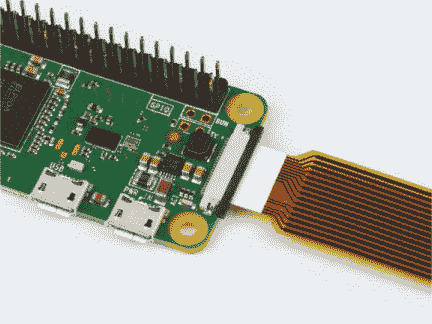

**图 8-7** 树莓派 Zero 型号上 mini-CSI 接口的相机电缆正确插入方向

#### 安装您的相机

现在，相机已经连接到机器人上的树莓派，您需要将其安装在合适的位置。我建议使用一些粘土将其固定在机器人前方，放置较低的位置以确保有清晰的视野。为此，我使用了一个 2 × 2 的 LEGO 积木来创建安装空间（请参见 图 8-8）。同时，确保相机的方向与我的照片中一样正确。

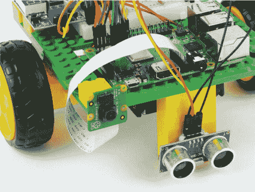

**图 8-8** 我的相机模块安装在我的树莓派机器人上

相机模块非常脆弱，请小心处理。尽量避免扭曲电缆，并确保不要使电缆出现弯折。如果在任何时候，排线从树莓派松脱，您可以按照原来的方式重新连接。如果它从相机模块上的连接器松脱，您也可以重新连接，方法与之前相同：使用手指轻轻打开模块的 CSI 端口，然后将电缆插入，确保银色接触点朝下并朝向 PCB。

#### 启用相机和 VNC，并设置屏幕分辨率

要在 Raspbian 中使用相机，首先需要启用它。如果您按照第一章中的所有步骤操作，您已经完成了部分工作。此外，我们还需要启用 VNC 并手动设置正确的屏幕分辨率。以下是完整的操作流程。

要进行此设置，我们将使用配置工具`raspi-config`。打开命令行并输入以下命令：

pi@raspberrypi:~/robot $ sudo raspi-config

您应该会看到您之前配置树莓派音频输出时看到的相同的蓝色配置屏幕。使用箭头键向下滚动至**接口选项**，然后按 ENTER 键。这将打开一个新的菜单，如图 8-9 所示。

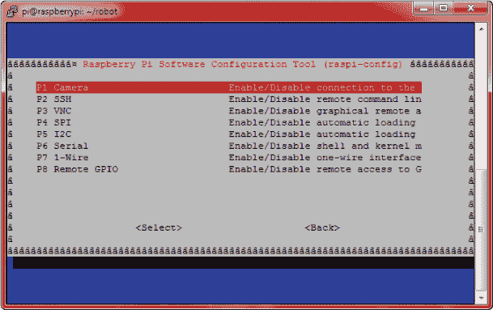

**图 8-9** `raspi-config`工具的接口选项菜单

再次按 ENTER 键选择**相机**。然后，系统会询问是否启用相机接口，使用左右箭头键选择**是**（见图 8-10）。

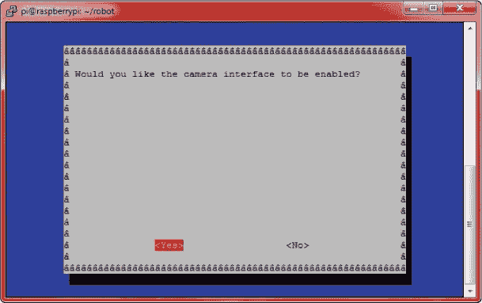

**图 8-10** 使用`raspi-config`启用相机

您将看到一条确认消息，表示相机接口已启用，然后您将返回原始菜单。

在`raspi-config`工具中时，确保 VNC 已经启用也非常重要。VNC 将在下一节中进行详细说明，但现在只需再次向下滚动至**接口选项**，然后选择**VNC**（见图 8-11）。按 ENTER 键启用它。

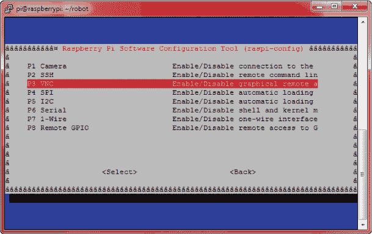

**图 8-11** 从接口选项中选择 VNC

系统会将您带回原始菜单。在您退出配置工具之前，必须做最后一件事：手动设置您的树莓派的屏幕分辨率。这将确保在稍后使用 VNC 时，屏幕能够以正确的方式显示。要设置分辨率，从原始菜单中，向下滚动至**高级选项**，然后继续向下滚动并选择**分辨率**（见图 8-12）。

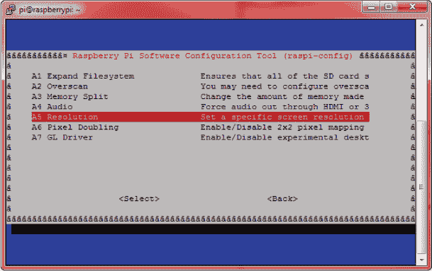

**图 8-12** 高级选项中的屏幕分辨率设置

**注意**

*如果你知道你电脑屏幕的分辨率* 低于 *全高清，请将 Pi 的屏幕分辨率设置为菜单中最接近的较低选项。你可以随时再次运行* raspi-config *来更改分辨率。*

然后，系统会提示你选择一个屏幕分辨率。使用箭头键向下滚动，选择全高清选项。它看起来像是“DMT 模式 82 1920x1080 60Hz 16:9”。按下 ENTER 键选择这个选项，屏幕分辨率应该已经设置好了！你将返回到原始菜单。

按右箭头键两次（高亮显示 **完成**），然后按 ENTER 键退出配置工具。如果提示，请重新启动你的 Raspberry Pi。

### 拍摄测试照片

连接并启用相机模块后，我们来测试一下拍照。这可以通过远程终端用一个简单的命令轻松完成，但通过这种方式你无法在基于文本的环境中查看拍摄的图片！这时，VNC——你之前启用的选项——派上了用场。

#### 使用 VNC 远程控制 Pi 的桌面

*VNC* 代表 *虚拟网络计算*。它允许你远程查看和控制 Raspberry Pi 的桌面，就像你之前使用 SSH 连接时一样，但它是针对完整的图形用户界面（GUI），而不仅仅是终端。由于我们可以通过 VNC 查看 Pi 的图形界面，你将能够轻松查看你用 Raspberry Pi 相机模块拍摄的任何照片，使用 Raspbian 内置的图像查看器。

**注意**

*如果你按照本书的步骤操作，并且没有通过 SSH 无线连接 Raspberry Pi，不用担心！你仍然可以继续按照本节后的步骤操作，并在 Pi 连接到 HDMI 显示器后查看结果。*

#### 安装并使用 VNC Viewer 进行连接

你已经在 Raspberry Pi 端完成了所有设置，现在你需要在要查看图像的电脑上下载 VNC Viewer。我们将使用 RealVNC 提供的免费软件 *VNC Viewer*，它兼容 Windows、Mac、Linux 等平台。要安装该软件，请在你的机器上按照以下步骤操作：

1.  在你的电脑上，打开一个网页浏览器并访问 *[`www.realvnc.com/en/connect/download/viewer/`](https://www.realvnc.com/en/connect/download/viewer/)*。你应该会看到 VNC Viewer 软件的下载页面，如 图 8-13 所示。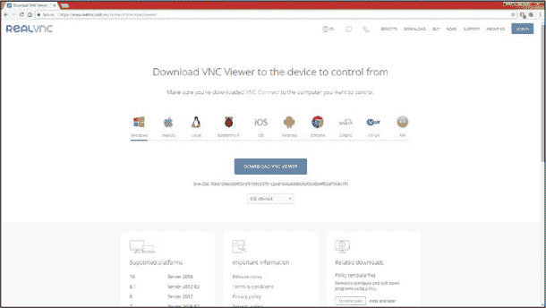

    **图 8-13** VNC Viewer 软件下载页面

1.  在这里，选择你的操作系统并点击 **下载** 按钮。软件下载完成后，按照安装向导进行操作，并同意服务条款。几分钟后，一切应该安装完毕并准备就绪！

现在已经安装了 VNC Viewer，运行它。你应该会看到一个窗口，顶部有一个框（图 8-14）；在这里，你需要输入 Raspberry Pi 的 IP 地址，你应该已经知道这个地址，因为你一直在通过 SSH 连接到你的 Pi。

会弹出一个认证框，要求你输入用户名和密码。输入你的树莓派登录信息，然后点击**确定**。如果你没有更改默认用户，那么用户名是`pi`，密码是你在第一章中设置的密码。

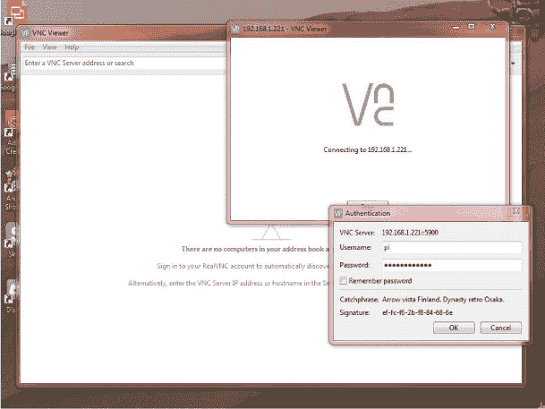

**图 8-14** 设置 VNC 查看器以连接我的树莓派

一个新窗口将显示你的树莓派桌面（见图 8-15）。在这里，你可以像树莓派接入 HDMI 显示器一样访问和使用所有功能。

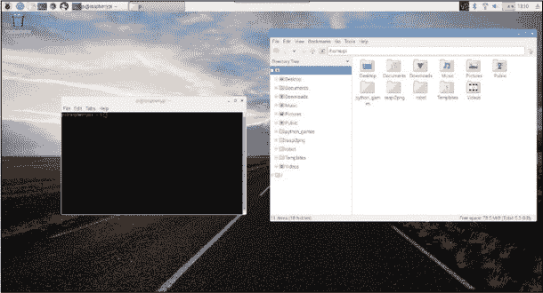

**图 8-15** 在树莓派桌面环境中，通过 VNC 查看的终端和文件管理器

#### 使用树莓派摄像头模块拍照和查看照片

现在你已经设置好了一切，接下来可以拍摄测试照片了！我们将使用一个内置的命令行工具，叫做`raspistill`。通过 SSH 连接或者使用 VNC 连接中的终端窗口打开一个终端，输入以下命令拍照：

pi@raspberrypi:~ $ raspistill –o test.jpg

在 5 秒钟的延迟后（确保你可以站到相机前面或者调整好镜头），命令会执行完毕。如果你没有看到任何输出，说明一切正常！这个命令没有成功消息。这个指令会拍照并将照片保存为*test.jpg*，保存在命令运行的目录中——在本例中，是默认的主目录。

要在 VNC 桌面中查看图像，点击 VNC 桌面环境中的**文件管理器**图标（它看起来像一个文件夹集合，如图 8-16 所示）。

相机故障排除

如果运行`raspistill`命令时出现类似以下的可怕错误，不用担心！

```
pi@raspberrypi:~ $ raspistill -o test.jpg
mmal: mmal_vc_component_enable: failed to enable component:
ENOSPC
mmal: camera component couldn’t be enabled
mmal: main: Failed to create camera component
mmal: Failed to run camera app. Please check for firmware
updates
```

你很可能只是没有正确连接相机。如果你收到这个错误消息，或者其他任何错误，检查一下相机模块和树莓派之间的排线连接。同时，确保你已经正确启用了相机接口——返回第 172 页查阅指导。

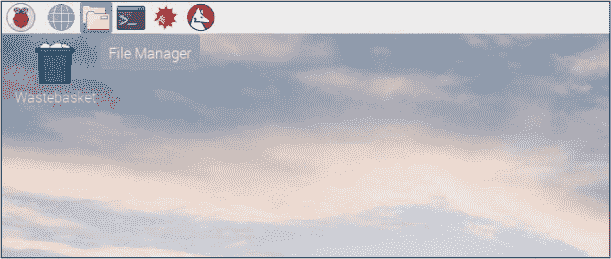

**图 8-16** 文件管理器图标

导航到运行`raspistill`命令的目录（我是在默认的主目录中运行的），找到*test.jpg*文件并双击它。你应该能够在图像查看器中看到你刚拍的照片（见图 8-17）。

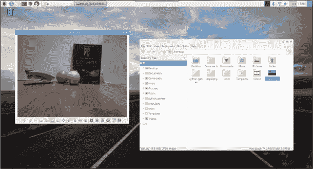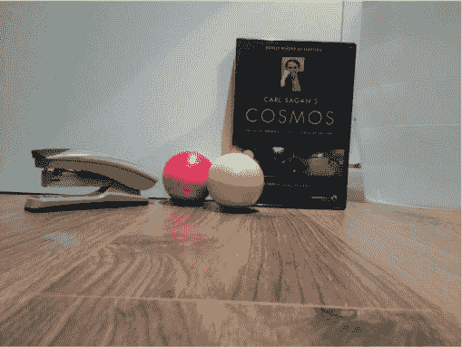

**图 8-17** Raspbian 图像查看器中的*test.jpg*图像（上图）；展示了一个订书机、卡尔·萨根的*宇宙*以及两个稍后使用的彩色球（下图）

### 让你的机器人寻找并追踪一个球

现在你已经连接好相机并成功完成了图像测试，是时候进入本章的高级项目：让你的机器人识别并跟踪一个彩色球了。但在此之前：我们先来快速了解一些重要的理论。

#### 理解彩色物体识别的原理

我们如何让一个无法独立思考的机器人识别并识别出特定的物体呢？

当你的机器人移动时，球相对于机器人的位置会不断变化，因此我们首先需要的是一个不断刷新的视图，显示机器人前方的情况。相机模块通过一系列图像提供这个视图，这些图像通常被称为*视频帧*或简称*帧*。

每一张图像，如 图 8-18 中的图像，都需要进行分析，以确定它是否包含你的彩色球。为此，我们将应用各种图像处理技术。

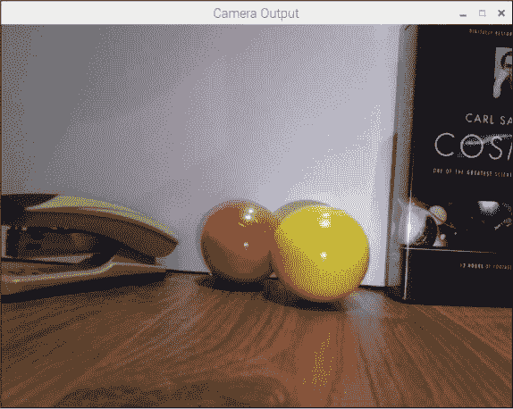

**图 8-18** 来自相机模块的未处理图像，准备进行分析

第一步是将图像从 RGB 格式转换为*HSV* 格式。我们在 第六章中讨论了 RGB，但我在这里简要总结一下。*RGB* 代表红色、绿色和蓝色。来自 图 8-18 中相机模块的每个像素都是这三种颜色的组合，表示为三个介于 0 到 255 之间的数字——例如，[100,200,150]。

计算机使用 RGB 来*显示*颜色，但在处理图像及其包含的颜色数据时，HSV 颜色格式更为合适。*HSV* 代表色相、饱和度和值，它是以三种参数数字化表示颜色的另一种方式。HSV 比 RGB 更难理解和表示，但当把它看作一个圆柱体时（见 图 8-19），通常最容易理解。

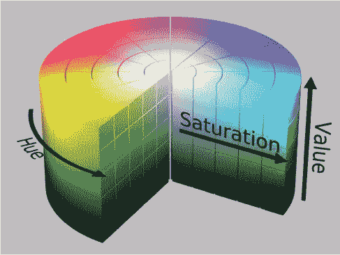

**图 8-19** HSV 圆柱体

*色相* 是 HSV 模型中的颜色部分，它表示为 0 到 360 度之间的数字。这个范围的不同部分代表不同的颜色（见 表 8-1）。

**表 8-1** HSV 的色相范围

| **颜色** | **角度** |
| --- | --- |
| 红色 | 0–60 |
| 黄色 | 60–120 |
| 绿色 | 120–180 |
| 青色 | 180–240 |
| 蓝色 | 240–300 |
| 品红色 | 300–360 |

*饱和度* 是颜色中的白色程度，范围从 0 到 100%。*值* 与饱和度一起工作，可以看作是亮度；它描述了颜色的强度，范围从 0 到 100%。

通过将每张图像转换为 HSV 格式，你的 Pi 可以将颜色成分（色相）分离出来进行进一步分析。这意味着，无论环境和光照效果如何，计算机仍然能够识别彩色物体。这在 RGB 颜色空间中是非常难以实现的。图 8-20 显示了 HSV 数据的 RGB 实现。


**图 8-20** 图像的 HSV 数据

如图 8-20 所示，我的机器人将跟随的黄色球现在清晰可见，且非常独特。它不可能与背后的红球或画面中的其他物体混淆。不过，请记住，这是 HSV 颜色模型的 RGB *实现*。颜色的色调值是我们无法像用眼睛看到的那样直接识别的。

接下来的步骤是查找并识别任何与我们搜索的颜色匹配的区域。在我的案例中，我想匹配图像中与我的黄色球颜色相同的所有部分。这形成了一个*遮罩*（参见图 8-21），它仅保留我们需要的图像部分，去除我们不需要的部分。你可以看到，它只保留了包含我想要的黄色颜色的区域。

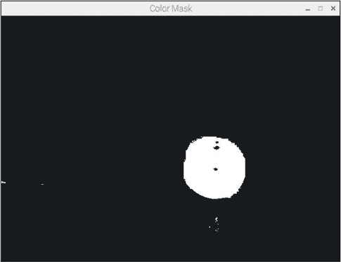

**图 8-21** 遮罩掉图像中与球的黄色色调不同的颜色和区域。注意，球上有一些区域（亮反射/阴影区域）没有被拾取！

现在，相关的彩色物体已经被分离出来，接下来的步骤是识别出最大的颜色块。注意在图 8-21 中还有其他（虽然较小的）黄色区域吗？如果你没有正确编程，机器人可能会被这些区域混淆，朝它们而不是目标球移动。这可能会造成灾难——毕竟，你不希望它被远处的香蕉分散注意力！

假设遮罩中最大的部分是彩色球，下一步是实际找到这个最大区域。我们通过在遮罩中的每个检测到的物体周围绘制一个轮廓（类似轮廓线；参见图 8-22）来实现。我们可以通过一些基本的数学计算出每个轮廓的面积。然后，识别出最大区域，并假定它就是我们要找的目标球！

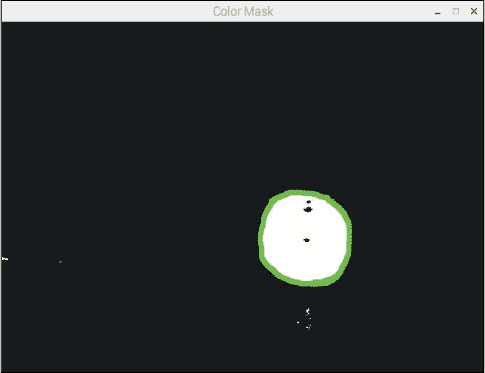

**图 8-22** 在遮罩中绘制的围绕最大单个物体的轮廓

完成此步骤后，我们只需编程让机器人朝向物体移动。如果目标在机器人的右侧，则向右移动。如果它在机器人的左侧，则向左移动。如果它在机器人的前方，则向前移动。

这就是用你的树莓派制作一个跟踪球的计算机视觉系统！现在是时候付诸实践了。

#### 安装软件

你将需要几个 Python 库来启用计算机视觉。最重要的是，我们将使用 OpenCV，这是一个免费的开源实时计算机视觉编程函数库。你还需要 PiCamera Python 库来操作和处理树莓派相机模块，尽管在最新版本的 Raspbian 中默认已包含此库。

要安装 OpenCV Python 3 库的依赖项，请在终端中输入以下命令：

pi@raspberrypi:~ $ sudo apt-get install libblas-dev

libatlas-base-dev libjasper-dev libqtgui4 libqt4-test

**注意**

*如果你在安装过程中遇到任何错误，或者安装似乎没有正确进行，请访问本书的网站[`nostarch.com/raspirobots`](https://nostarch.com/raspirobots)查看任何更改并获得进一步指导。*

当系统提示是否继续时，按 Y 然后按 ENTER。这条命令执行需要几分钟。

现在，你可以使用`pip`（我们之前使用过的 Python 软件管理工具）来为 Python 3 安装 OpenCV。输入以下命令：

pi@raspberrypi:~ $ sudo pip3 install opencv-python

OpenCV 安装完成后，使用以下命令检查是否已安装 PiCamera 库。它很可能会告知你已经安装了最新版本，但如果没有，请继续安装：

pi@raspberrypi:~ $ sudo apt-get install python3-picamera

这就是你所需要的全部！

#### 识别你彩色球的 HSV 颜色

要识别特定颜色的球，你的树莓派机器人需要该颜色的 HSV 值。树莓派将使用这个值来比较每张图片的各个部分，以查看它是否是你希望机器人跟随的球的颜色。

你的球可能和我的颜色不同，因此你需要找出你球的确切 HSV 值。即使你和我一样有一个黄色的球，它的色调也可能与你的有所不同！

有多种方法可以识别你需要的色调值，但我发现最好的方法是尝试不同的值，看看效果如何。目的是找到一个与你特定颜色球匹配的值。为了帮助你完成这一点，我创建了一个测试程序*hsv_tester.py*，你可以在本书随附的软件包中找到它（[*https://nostarch.com/raspirobots/*](https://nostarch.com/raspirobots/)）。下一部分将带你通过运行该程序。

#### 运行 HSV 测试程序

将你的机器人放置在一个光线良好的环境中，彩色球大约在它前方一米的位置。然后启动机器人上的树莓派，通过 VNC 远程查看其桌面。接着，在桌面上打开一个终端应用，找到*hsv_tester.py*程序，并使用以下命令运行它：

**注意**

*我不会详细介绍这个测试程序是如何工作的，因为它与接下来几页中你将使用的实际球跟踪代码非常相似。我会在代码之后进行通常的详细解释。*

pi@raspberrypi:~/robot $ python3 hsv_tester.py

你会看到一个提示，要求你输入 10 到 245 之间的色调值。试着估算你球的色调值；表 8-1 中的范围应该能大致告诉你从哪个光谱端开始。我的球是黄色的，所以我会猜测 40。输入这个值后，你将看到四个新窗口显示之前讨论的图像处理的不同阶段（参见图 8-23）。

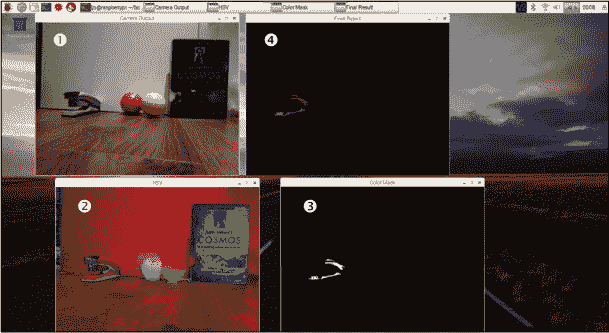

**图 8-23** HSV 测试程序的四个不同窗口

第一个窗口，标题为*摄像头输出*，是直接从摄像头模块➊获取的原始 RGB 视频输出。第二个窗口，标题为*HSV*，是将同一视频转换为 HSV 格式➋。接着，标题为*颜色遮罩*的窗口显示了与您提供的色调值匹配的图像部分➌。最后，标题为*最终结果*的窗口将颜色遮罩与原始视频流叠加，显示出隔离的区域➍。

如果最终结果窗口中的遮罩大致呈球形，你就找到了你的色调值！

你不太可能第一次就能准确得到色调值，就像我一样——色调没有匹配到我的球，而是匹配到画面中的订书机！若要重试，选择任何一个输出窗口（但不要选择终端窗口），然后按键盘上的 Q 键。这将冻结视频输出，你可以返回终端并输入另一个值进行尝试。

多尝试并调整色调值，直到你找到与你的彩色球完全匹配的色调。经过一段时间，我发现我的魔法数字是 28。找到你的值后，你应该能看到大部分球体而其他部分几乎不在画面中，就像我在图 8-24 中的样子。

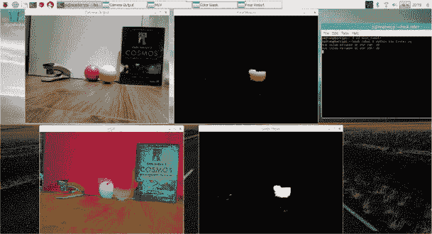

**图 8-24** 我正确识别出我的色调值约为 28 时的输出窗口

记下这个值，因为你很快就需要它。在找到正确的数字后，通过在终端窗口按 CTRL-C 来关闭 HSV 测试程序。

#### 编程让你的树莓派跟随一个球

在所有基础工作完成后，你现在可以编程让你的树莓派机器人跟随一个球！我们将使用的程序相对较长，并且比你目前遇到的任何程序都要复杂，所以我建议从软件包中下载它，而不是从这本书中复制，以减少输入错误。该程序名为*ball_follower.py*，你可以通过以下命令查看它：

pi@raspberrypi:~/robot $ nano ball_follower.py

这个程序有 75 行，因此在解释时我将它分成几个部分，并说明每个部分的工作原理。如果你更希望先运行代码并稍后理解它的工作方式，可以跳到第 193 页的下一节。

##### 导入包并设置摄像头模块

首先，我们将导入所需的包并进行一些设置，如清单 8-1 所示。

```
➊ from picamera.array import PiRGBArray
   from picamera import PiCamera
   import cv2
   import numpy as np
   import gpiozero

➋ camera = PiCamera()
➌ image_width = 640
   image_height = 480
➍ camera.resolution = (image_width, image_height)
   camera.framerate = 32
   rawCapture = PiRGBArray(camera, size=(image_width, image_height))
➎ center_image_x = image_width / 2
   center_image_y = image_height / 2
➏ minimum_area = 250
   maximum_area = 100000
```

**清单 8-1** 导入库并设置摄像头模块

程序的前几行➊导入了必要的库，包括 PiCamera 库的各个部分，这些部分使我们能够在 Python 中使用摄像头模块。我们还导入了 OpenCV 库`cv2`，像往常一样导入`gpiozero`，以及 NumPy 库`np`。NumPy 是一个用于科学计算的 Python 包，稍后在处理图像数据时会非常有用。

在 ➋ 处，我们初始化一个 PiCamera 对象，并将其分配给 `camera` 变量，在整个程序中使用。接下来，我们定义相机捕获的图像的大小 ➌ 和分辨率 ➍。我们不需要全高清视频帧，因为它们会降低速度和性能，所以我们将分辨率降到标准清晰度：640×480 像素。在接下来的几行中，我们指定了相机的帧率和原始捕获设置。

➎ 处的两行代码计算出图像的中心位置。稍后将使用这些信息来确定并比较球体在图像中的位置。

然后，在 ➏ 处，我们为彩色球设置了最小和最大面积。这可以防止你的机器人检测到小于 250 平方像素或大于 100,000 平方像素的任何彩色物体。这些是我发现效果相当不错的任意数字，但如果你想稍后更改它们，随时可以！

##### 设置机器人和颜色值

本节内容涉及设置过程的最后部分，如 Listing 8-2 所示。

```
   robot = gpiozero.Robot(left=(17,18), right=(27,22))
➊ forward_speed = 0.3
   turn_speed = 0.2

➋ HUE_VAL = 28

➌ lower_color = np.array([HUE_VAL-10,100,100])
   upper_color = np.array([HUE_VAL+10,255,255])
```

**LISTING 8-2** 设置机器人和颜色值

我们像之前一样设置机器人及其电机引脚，然后定义两个变量，分别用于前进速度和转向速度 ➊，值分别为 0.3 和 0.2。这将限制机器人朝向彩色球体时的移动速度。同样，这些是任意的数字，如果你发现更高或更低的值对你和你的机器人更有效，随时可以更改它们。

在 ➋ 处，我们设置了色调的数值。这是一个你*必须更改*的值，需要使用之前通过 HSV 测试程序找到的值。我将我的设置为 28。

接下来，我们设置了一个值的范围供机器人检查，而不是一个精确的数值 ➌。这样，环境的变化，比如房间的照明和亮度变化，仍会保持在这个小范围内，因此球体会继续被检测到。我们通过使用数组来创建 HSV 格式下颜色的上下限来实现这一点。

在编程中，*数组*是一个信息集合，其中每个数据项都有一个*索引*或位置与之相关联。数组可以根据需要长得无限大，可以存储你想要的任何东西，从人名到动物种类，再到数字列表。在 Python 中，数组中的第一个数据项的索引是 0，第二个数据项的索引是 1，第三个数据项的索引是 2，以此类推——换句话说，Python 从 0 开始计算数组中的项目。这意味着，在 Python 程序中，你可以请求数组中索引为 3 的数据项，它将返回在第四个位置的那项数据。

在这种情况下，我们使用数组表示 HSV 格式，因为每种 HSV 颜色都可以用三个数字来描述（色调、饱和度和亮度）。注意，我们实际上搜索的是色调±10 的范围，并且饱和度和亮度的范围是从 100 到 255。这确保机器人在每帧图像中会寻找更广泛的颜色范围，提高了它检测目标彩色球的概率。

这些数组可以通过我们导入的 NumPy 库使用。我们在这里使用 NumPy，因为它是一个经过高度优化的库，专门用于快速数组计算。这为我们提供了必要的速度，以便访问和分析每一帧中的每一个像素。

##### 分析相机帧

程序的第三部分显示在 Listing 8-3 中。这是代码和计算机视觉过程的主要部分。

```
➊ for frame in camera.capture_continuous(rawCapture, format="bgr", 
   use_video_port=True):

    ➋ image = frame.array

    ➌ hsv = cv2.cvtColor(image, cv2.COLOR_BGR2HSV)

    ➍ color_mask = cv2.inRange(hsv, lower_color, upper_color)

    ➎ image2, countours, hierarchy = cv2.findContours(color_mask, 
       cv2.RETR_LIST, cv2.CHAIN_APPROX_SIMPLE)
```

**LISTING 8-3** 开始捕获`for`循环，图像转换，和寻找轮廓

在➊处，我们启动了一个`for`循环，翻译成通俗的英语就是：“对于相机模块的每一帧，执行以下操作。”

接下来，当前帧的信息被保存到变量`image`中，作为一个数组 ➋。然后，图像的 RGB 数据通过 OpenCV 的`cvtColor()`函数转换为 HSV 格式 ➌。

一旦获取到 HSV 数据，就会创建色彩遮罩，该遮罩*仅保留*你希望的颜色，步骤为 ➍。我们使用 OpenCV 的`inRange()`函数，以便遮罩保留所有位于你选择的颜色上下限之间的颜色。

过程的下一阶段是为每个独立的物体在遮罩上绘制边框，这样就可以在后续对每个检测到的物体的区域进行比较。我们在➎步骤中使用 OpenCV 的`findContours()`函数来完成这一操作。

##### 比较轮廓以找到你的球

接下来是 Listing 8-4，它比较每个轮廓并识别出最大的一个。

```
➊ object_area = 0
   object_x = 0
   object_y = 0

➋ for contour in contours:
    ➌ x, y, width, height = cv2.boundingRect(contour)
    ➍ found_area = width * height
    ➎ center_x = x + (width / 2)
       center_y = y + (height / 2)
    ➏ if object_area < found_area:
          object_area = found_area
          object_x = center_x
          object_y = center_y
➐ if object_area > 0:
       ball_location = [object_area, object_x, object_y]
➑ else:
    ball_location = None
```

**LISTING 8-4** 比较并找到最大轮廓

我们创建了三个变量➊，这些变量稍后将用来存储最大物体的面积和中心坐标。最初，我们将它们设置为零。

在➋处，我们开始了一个`for`循环，它会遍历每个检测到的轮廓。代码在➌处会为一个轮廓绘制一个矩形框来近似它的形状。这被称为*边界框*，它让物体处理起来更简单。我们将这个边界框的细节赋值给四个新变量：`x`、`y`、`width`和`height`。如你所料，`width`和`height`代表矩形的宽度和高度；`x`和`y`代表矩形左上角的 x 和 y 坐标。

接下来，我们使用矩形面积公式（宽度 × 高度 ➍）计算并存储当前轮廓的面积。然后我们计算并确定当前轮廓的中心坐标 ➎，让程序知道这个物体在帧中的位置。知道物体中心的坐标比知道它的左上角要有用得多。

在 ➏ 处，我们将当前轮廓的面积与之前找到的最大面积进行比较。如果当前轮廓的面积比之前的大，我们假设较大的面积很可能就是你的彩色球。因此，之前的轮廓信息会被丢弃，新的轮廓的详细信息会覆盖用于存储最大物体面积和中心坐标的三个变量。

一旦`for`循环 ➋ 完成，所有轮廓都被比较过，程序会验证是否找到了合适的轮廓，并通过`if`语句 ➐ 检查该轮廓的面积是否大于 0。如果是，说明找到了最大的轮廓，因此可能就是球，并将其详细信息保存在一个名为`ball_location`的列表（即一种基本数组）中。如果没有找到轮廓，`ball_location`变量将在`else`子句 ➑ 中被设置为`None`。

##### 让你的机器人对球做出反应

程序的最后一部分，在 Listing 8-5 中，处理了让机器人根据在帧中检测到的彩色球的位置来移动。

```
➊ if ball_location:
    ➋ if (ball_location[0] > minimum_area) and (ball_location[0] 
       < maximum_area):
        ➌ if ball_location[1] > (center_image_x + 
           (image_width/3)):
               robot.right(turn_speed)
               print("Turning right")
        ➍ elif ball_location[1] < (center_image_x - 
           (image_width/3)):
               robot.left(turn_speed)
               print("Turning left")
        ➎ else:
               robot.forward(forward_speed)
               print("Forward")
    ➏ elif (ball_location[0] < minimum_area):
            robot.left(turn_speed)
            print("Target isn't large enough, searching")
    ➐ else:
           robot.stop()
           print("Target large enough, stopping")
➑ else:
       robot.left(turn_speed)
       print("Target not found, searching")

    rawCapture.truncate(0)
```

**LISTING 8-5** 根据球的位置让机器人移动

这部分代码包含了许多`if`、`elif`和`else`语句，并且跳转较多，因此需要仔细阅读，特别注意缩进，以理解每个语句是如何构建的。

我们声明了一个简单的`if`语句 ➊，意思是“如果找到了球，就做这个”。如果没有找到球，程序会直接跳到`else`语句 ➑。程序随后会告诉用户没有找到合适的目标，并指示机器人左转，以便在周围环境中搜索球。

如果在当前帧中发现了一个球，`if`语句 ➋ 会检测球的大小（存储在`ball_location`列表的索引 0 处）是否在程序开始时定义的区域值范围内。如果检测到的物体太小，机器人会开始转动，看看是否能找到更大的目标 ➏。若检测到的物体太大（被`else`语句 ➐ 捕获），机器人不会再接近球并停止。

如果球*在*帧中，并且机器人*确实*需要移动，代码通过 ➏ 处理这一情况。在 ➌ 处，我们使用`if`语句来检测帧中球的 x 坐标是否大于中心点*加上图像宽度的三分之一*。如果是这种情况，球一定在帧的右侧，机器人因此向右移动。

位置 ➍ 的代码做的是相同的事情，但它会查看球在帧中的 x 坐标是否小于中心点*加上图像宽度的三分之一*。在这种情况下，机器人会向左转。

最后，如果球不在图像的左侧或右侧，它一定在你机器人前面，因此机器人会被指示向前移动➎。

如图 8-25 所示，这段代码基本上将摄像头帧分成了三个不同的区域：左侧、右侧和前方。我们使用整个帧宽度的三分之一作为中心点两侧的中间部分。也就是说，中间部分代表了每帧的三分之二。如果球出现在这里，机器人就会向前移动。如果球出现在任一侧，机器人就会向左或向右移动。左侧和右侧区域分别是每帧的六分之一。

这就是跟随球体程序的全部内容！刚开始看起来代码可能有些复杂，但和计算机科学中的大多数事情一样，如果你分解开并仔细观察，你会发现它由之前用过的简单概念构成。

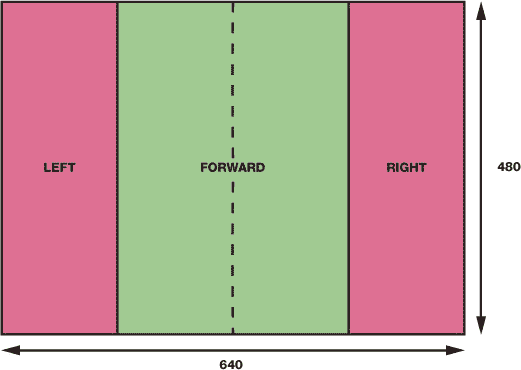

**图 8-25** 一张显示如何将帧分割为三个区域以便进行移动的示意图

#### 运行程序：让你的机器人跟随一个彩色球！

现在你可以进入这个项目的激动人心的部分了：让你的机器人真正开始跟随你的彩色球。给机器人安装电池，并将其放置在地面或其他大型平坦的表面上。同时将彩色球放置在这个环境中的某个地方，如图 8-26 所示。

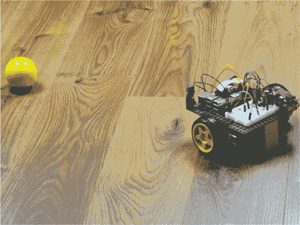

**图 8-26** 我的机器人，准备去追寻我的黄色球！

当一切设置好后，使用以下命令运行程序：

pi@raspberrypi:~/robot $ python3 ball_follower.py

你的机器人应该会活跃起来，开始追踪你的彩色球。和你新智能的宠物玩一场取球游戏吧！

和往常一样，按 CTRL-C 停止程序。

实验图像处理

就像上一章中的跟随线项目一样，计算机视觉和图像处理是计算机科学和机器人领域的两个方向，这些领域往往需要精细调节，以改善结果和能力。这里有一些建议，供你进行实验。

颜色与物体

虽然你的彩色球是机器人一个很好的起始目标，但你可以轻松地将其扩展。例如，为什么不通过扫描每一帧来引入第二种颜色，寻找一组次要的 HSV 值呢？让你的机器人跟随黄色和红色物体，比如说。记得你可以回到 HSV 测试程序，找出其他颜色的色调和颜色代码！

你不仅仅局限于球体。你可以让你的机器人跟随或寻找任何主要是单一颜色的物体。尝试用你周围的其他物品做实验吧！

速度

机器人移动的速度对图像处理的质量有很大的影响：通常来说，速度越快，错过目标颜色物体的可能性越大。话虽如此，欢迎你尝试调整在追踪球程序开始时定义的速度值——你可能会调试并改善机器人的表现！

目标物体的最小/最大面积

试验目标物体的最小和最大面积。记住，默认情况下，你的机器人不会朝小于 250 平方像素的物体移动，而且会停在大于 100,000 平方像素的物体前。

通过更改这些数值，你可以让机器人朝着可能较小的目标移动，甚至在离目标更近时停下。一个有趣的想法是增加最大面积，直到机器人在接近你的彩色球时不会停下。结果就是，机器人通常会撞上球并“踢”它……然后再跟着它滚动，重复这个过程！

记住，你的摄像头模块每一帧视频的分辨率是 640×480 像素，因此 307,200 是可能的最大平方像素数。

避免行为

目前，机器人喜欢你的彩色球，但如果你改变它的行为，让它害怕彩色球会怎么样呢？尝试编辑程序，让机器人跑开，而不是朝球移动。

这一部分的扩展可以让你的机器人朝某些颜色的球移动，而避免其他颜色的球。例如，它可以喜欢红色的球，但对黄色的球感到害怕！

### 总结

在本章中，你赋予了机器人寻找到、识别并追踪彩色球的高级能力。你已经学习了图像处理的基础，并使用官方的树莓派摄像头模块在 Python 中实现了整个计算机视觉过程。

至此，你已经完成了本书的项目部分！你的小机器人现在已经长大，而你就是它骄傲的父母。不过，这并不是终点；请查看第 195 页的“下一步”部分，获取继续进行机器人、编程和树莓派冒险的指导和建议。
