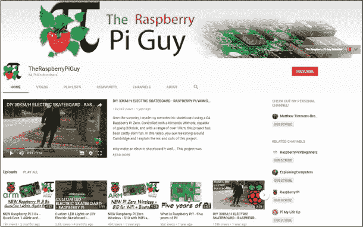

## 第九章：下一步

现在你已经读完了本书，是时候走向这个世界，制作属于你自己的机器人和其他树莓派项目了！我希望你已经学会并掌握了帮助你在未来计算机科学冒险中所需要的技能。

但是要知道，你并不孤单！无论在线还是离线，都有无数资源可以帮助你在下一步中走得更远。以下是一些建议。

### 树莓派大叔

我运营着受欢迎的树莓派 YouTube 频道 *The Raspberry Pi Guy*，在这里我提供免费的教程和教育视频。我有许多关于树莓派的各类视频，从基础机器人技术到 DIY 电动滑板，所有内容都以简明易懂且易于跟随的方式呈现（见图 A-1）。

**图 A-1** The Raspberry Pi Guy YouTube 频道

你可以通过以下链接查看内容，如果喜欢看到的内容，别忘了订阅。

**The Raspberry Pi Guy YouTube 频道** (*[`www.youtube.com/TheRaspberryPiGuy/`](https://www.youtube.com/TheRaspberryPiGuy/)*)

**Raspberry Pi Guy 网站** (*[`www.theraspberrypiguy.com`](https://www.theraspberrypiguy.com)*/)

### 联系我们！

如果你喜欢这本书并希望联系我或分享你的进展，我非常乐意通过 Twitter 听到你的声音。你可以关注并给我发推 *@RaspberryPiGuy1*。我一定会看到你的推文并回复，尤其是如果你使用了标签 #raspirobots。

### 其他网站

树莓派和机器人领域都拥有庞大、开放且极具包容性的在线社区，你可以在这些社区中阅读和贡献。以下是一些你可以从中学习并获得灵感的网站：

**官方树莓派基金会网站** **([`www.raspberrypi.org/`](https://www.raspberrypi.org/))** 这是你在书籍开始时用来下载树莓派操作系统的站点。基金会的网站提供了丰富的教育资源和适用于各个层次和能力的项目。你还会找到树莓派论坛，在这里你可以注册一个账户，与其他有相似兴趣、问题和疑问的人互动；如果你在未来的项目中遇到困难，这里是寻求帮助的完美地方。甚至有一个专门的“自动化、传感与机器人”版块！该网站还包括一个定期更新的博客，内容涵盖社区的最新新闻。

**Adafruit 学习系统 ([`learn.adafruit.com/`](https://learn.adafruit.com/))** 这是一个来自 Adafruit 电子社区的资源和在线课程集合。在这里，你会找到涵盖各种硬件和软件的详细教程，所有内容都有开源代码和帮助。如果你需要灵感来启动下一个项目，这是一个不错的地方！

**官方 Python 网站 ([`www.python.org/`](https://www.python.org/))** 本书已经为你提供了一个关于编程和 Python 编程语言的精彩介绍，如果你想继续提升你的编程技能，可以看看官方 Python 网站。你将在那里找到所有你可能希望拥有的文档和指南！在未来，你可能还会希望探索其他编程语言，如 C++ 或 Java，这时只需要在 Google 上搜索教程——几乎可以找到成千上万的资源！

**新阿特拉斯机器人新闻 ([`newatlas.com/robotics/`](https://newatlas.com/robotics/))** 如果你对最新的机器人技术新闻和该领域的进展感兴趣，可以查看新阿特拉斯网站的机器人栏目。新阿特拉斯是一个报道技术新闻的在线出版物，你将会发现一些令人惊叹的内容，这些内容可能会激励你做出一些了不起的事情，并进一步推动机器人领域的发展！

### 俱乐部和活动

在网上你可以做很多事情来学习机器人技术和 Raspberry Pi，但没有什么能替代面对面的俱乐部、活动和聚会。幸运的是，在计算机科学领域你会找到很多这样的机会。以下是一些建议，不过你的所在位置会影响你能参加的活动，所以一定要了解你所在地区是否有相关的俱乐部和活动！

**Raspberry Jam ([`www.raspberrypi.org/jam/`](https://www.raspberrypi.org/jam/))** Raspberry Jam 是由社区自主组织的活动，旨在让所有年龄段的人们围绕 Raspberry Pi 进行交流、学习和分享项目。Raspberry Jam 在全球各地举办，由各种各样的人组织。活动通常包括面向初学者的工作坊、展示与讲座，并由社区成员主讲。无论你是初学者还是专业人士，来自各个背景和技能层次的人都欢迎参加这些活动。你可以使用网站上的 *Find a Jam Near You* 工具找到你所在地区的活动。如果你来参加位于英国剑桥的某个 Jam 活动，或者参加位于英国爱丁堡的活动，很可能会碰到我——记得打个招呼！

**Pi Wars ([`piwars.org/`](https://piwars.org/))** Pi Wars 是一项基于挑战的机器人竞赛，参赛机器人由 Raspberry Pi 控制。无论是专业团队还是业余团队，都可以打造机器人并参加比赛，任务包括障碍赛、速度测试和迷宫解谜等非破坏性挑战。比赛通常在一个周末举办，并且在英国剑桥举行。你可以作为参赛者或观众参加活动；详情请参阅网站获取更多信息。

**编程俱乐部 ([`www.codeclubworld.org/`](https://www.codeclubworld.org/))** 和 **Coder Dojo ([`coderdojo.com/`](https://coderdojo.com/))** 编程俱乐部和 Coder Dojo 是全球范围内由志愿者领导的、为年轻人提供的免费编程俱乐部网络。程序员和其他人聚集在一起，帮助年轻一代学习如何编程并发展他们的计算机科学技能。你可以通过访问各自网站上的工具，查看是否有适合你的俱乐部。

### 书籍和出版物

如果你从本书中享受到了学习计算机科学和 Raspberry Pi 的乐趣，你可能希望通过另一本书或出版物继续这段旅程。以下是一些建议：

*Python 速成课程*，作者：Eric Matthes（No Starch Press，2015 年）

*20 个简单的 Raspberry Pi 项目*，作者：Rui Santos 和 Sara Santos（No Starch Press，2018 年）

*Raspberry Pi 用户指南*，作者：Eben Upton 和 Gareth Halfacree（Wiley，2016 年）

*The MagPi* ([*https://www.raspberrypi.org/magpi*](https://www.raspberrypi.org/magpi)*/*)，由基金会出版的免费阅读、每月一期的 Raspberry Pi 杂志，包含项目、编程和其他文章
