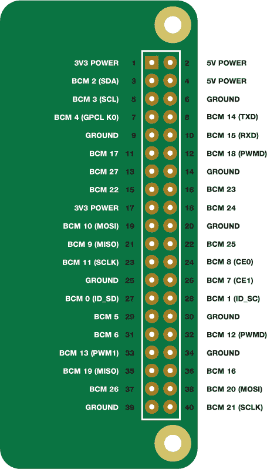

## 第十章：树莓派 GPIO 引脚图

这里你可以找到一张完整标注的树莓派 GPIO 引脚图。每个引脚都标注了其物理编号和 BCM 编号。

物理编号仅仅对应于引脚的实际物理位置，从 1 开始，一直到 40。每个引脚上的 BCM 编号（例如 BCM 25）被称为 *Broadcom* 引脚编号或 *GPIO* 编号。这些编号由树莓派的处理器内部使用，你通常需要在 GPIO Zero 和其他编程库中使用它们。

一些引脚有附加的功能，功能名称在括号中标出；如果你想了解更多关于这些功能的信息，请参阅树莓派官网的官方文档（[*https://www.raspberrypi.org/documentation/usage/gpio**/*](https://www.raspberrypi.org/documentation/usage/gpio/)）。

**图 B-1** 树莓派 GPIO 引脚
