## 第十二章：如何进行焊接

焊接是将电子元件永久性地焊接在一起的过程。它涉及将一种称为 *焊锡* 的填充金属合金在两个或多个组件之间熔化（见 图 D-1）。

这一过程不仅将部件物理地连接在一起，还在电气上将它们连接。与使用面包板不同，焊接是永久性的。在你从事机器人技术、电子学和树莓派的过程中，你会遇到需要焊接的组件（例如，将电线焊接到电机端子上），所以这是你必须学习和练习的关键技能。

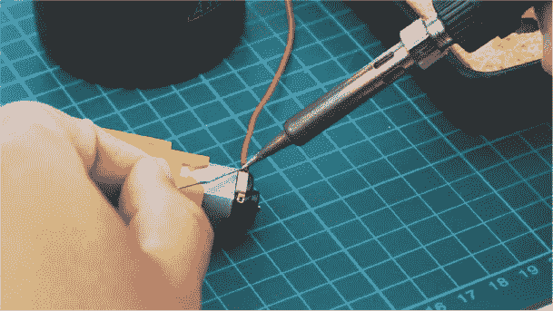

**图 D-1** 将电线焊接到电机端子——机器人技术中的常见任务

### 你需要的工具

为了将元件焊接在一起，你需要一些工具和材料：

+   焊接铁

+   焊锡

+   焊接铁架和焊接头清洁器

这些工具通常可以从常见的在线零售商和本地五金店购买。让我们仔细看看每个部分。

#### 焊锡

首先，你需要熔化的填充金属来制作焊接接头。如图 D-2 所示，焊锡是一种低熔点金属合金，通常熔点在 180 到 200 摄氏度（356–392 华氏度）之间。

过去，由于铅具有较低的熔点和出色的电气性能，铅曾被用作焊锡材料。然而，现在我们知道铅是一种重金属，对人类有毒。因此，无铅焊锡（主要由锡和铜组成）成为现代行业标准，我建议你购买这种焊锡。如果你在线购买，只需搜索“无铅焊锡”。它通常以直径在 0.5 到 0.8 毫米之间的线材形式提供。

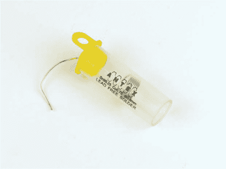

**图 D-2** 无铅焊锡

#### 焊接铁

焊接铁，如图 D-3 所示，是加热焊锡到其熔点的工具。

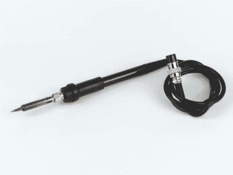

**图 D-3** 我可靠的 Tenma 焊接铁

焊接铁有各种价位，通常最低从 $10 起，最高超过 $100！作为初学者，你可能不需要购买带有专业功能的昂贵焊接铁。你所需要的是一把性能可靠、不会给你带来压力的普通焊接铁。

一款常见的入门焊接铁是 Antex XS25，售价大约为 $30。它是一款快速加热、固定温度的高质量工具，能为你使用多年。请注意，对于你大概率会进行的精细电子焊接，焊接铁的焊接头应该选择细尖型。大多数焊接铁都配有这种预安装的焊接头，而像 XS25 这样的焊接铁具有便于更换的焊接头。

我个人使用的是 Tenma 60W 可调温度焊接站，售价大约为 $60。

#### 焊接铁架和焊接头清洁器

焊接铁的温度会升高到超过 200 摄氏度，因此非常重要的是只触摸焊接铁的把手。我建议使用一个焊接铁架，它可以在焊接接头之间安全地存放和固定你的焊接铁，避免烫伤你、电子设备或桌面表面（见图 D-4）！

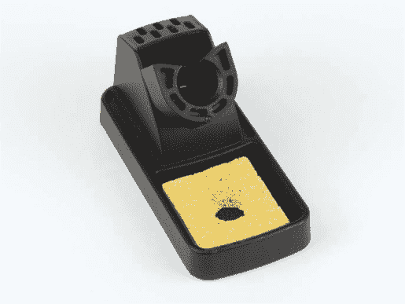

**图 D-4** 焊接架和海绵

通常焊接架会配有内建的焊接头清洁器。这个清洁器用于在连接之间清洁焊接铁，使其保持最佳工作状态。最常见的两种清洁器是湿海绵或一种含有黄铜屑的磨蚀性容器，见图 D-4 和图 D-5。我推荐使用黄铜屑，它能更彻底地清洁焊接头。

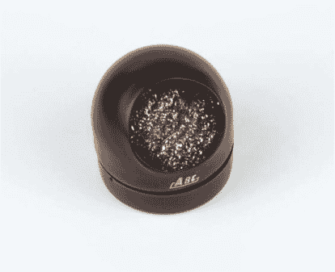

**图 D-5** 焊接头清洁器

可选配件

目前为止提到的工具和材料是焊接的基本必需品，但还有一些额外的小物件可以让你的工作更轻松！

例如，你可能需要去除焊点上的焊锡。你可以使用一些*去焊带*（也叫*吸锡带*）或者*吸锡器*来实现，如图所示。我在本指南中不会讲解去焊技巧，如果你想提高焊接技巧，可以在线搜索相关信息和视频。

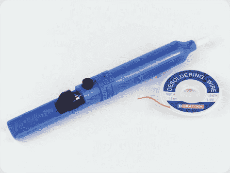

如果你在焊接时发现焊锡流动不顺畅，*液体助焊剂笔*会有所帮助。通过涂抹一种叫做*液体助焊剂*的特殊溶液，助焊剂笔帮助焊锡更好地附着在焊点上。

你可能会发现，在焊接时定位和固定电子组件变得困难。此时，像这里展示的*帮手之手*工具套件可能会很有用。

许多你需要焊接的组件非常小，这对于视力不太完美的人来说可能是一个问题。如果你有这种情况，你可能会发现放大镜（通常与辅助工具“帮手之手”结合使用）是必不可少的工具。

### 焊接组件

现在我们来演示如何将两个组件焊接在一起。我将通过焊接电线到电动机端子来演示，这也是你在第三章中可能需要做的操作。

#### 准备焊接

在打开焊接铁之前，首先要准备好工作区域。焊接区域需要：

**通风良好的区域** 选择一个通风良好的地方，因为焊接会产生烟雾，尽量避免吸入这些烟雾。

**合适的工作台面** 由于焊接铁非常热，请确保工作台面是耐热的，或者在焊接区域放置一些废料材料。比如一块纸板、一块切割垫或一块旧木板都可以。

**眼部保护** 在焊接过程中，焊锡和助焊剂可能会飞溅出来。我建议佩戴安全眼镜或护目镜来保护眼睛。

一切准备好后，将焊接铁放在支架上，然后插入电源插座。等待焊接铁加热；如果你的焊接铁是高端型号，可能几秒钟就热了；如果是像 Antex XS25 这种入门型号，可能需要几分钟。最重要的是，记住在插电时*不要*触摸焊接铁的铁尖。即使你拔掉了电源，也不要触摸铁尖！它会需要一段时间才能冷却下来。

一旦插上焊接铁，切勿让设备无人看管。如果你需要离开房间，拔掉焊接铁的插头，并在离开前等它完全冷却。没有任何风险是值得冒的。

#### 焊接铁尖的镀锡

在开始焊接接头之前，务必*镀锡*你的焊接铁尖。镀锡是将焊接铁尖涂上一层焊锡的过程。这会使实际焊接变得更容易，并帮助焊锡的流动更加顺畅。

首先，当焊接铁加热后，通过用湿海绵擦拭铁尖或将其插入黄铜屑中来清洁焊接铁。

之后，放一些焊锡到焊接铁尖上，焊锡应该会在接触时融化。现在，将焊接铁尖的下四分之一涂上一层焊锡。使用焊接铁尖清洁器清理掉多余的焊锡，并重复这个过程，直到你的焊接铁尖光亮并且涂满焊锡，就像我在图 D-6 中的样子。

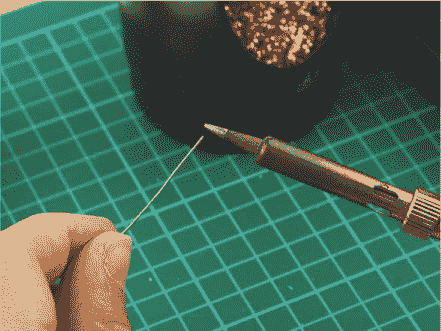

**图 D-6** 给我的焊接铁尖镀锡

如果你正在焊接许多组件，应当在合适的时候重新给焊接铁尖镀锡，尤其是当它不再光亮时。

#### 组件的准备

始终要确保你先准备好待焊接的组件。将零件放在工作台上，并按照你打算焊接的方式将它们定位。为了将电线焊接到电机端子上，你需要将电线穿过端子，就像图 D-7 中所示的那样。在这之前，确保你*剥皮*了电线的一端，即去掉大约四分之一英寸的塑料外层，露出导电金属芯。你应该使用*剥线钳*来完成这项工作。

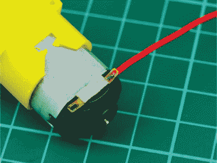

**图 D-7** 一根准备焊接到我的电机端子的电线

对于其他组件，你可能希望使用前面提到的“助焊手”夹具将它们固定住。

#### 焊接完美的接头

现在一切准备就绪，开始焊接吧！从焊锡线卷上拉出大约 6 英寸的焊锡，并用手握住焊接铁的把手。它应该握在你的主手里，就像握着一支笔或铅笔一样。确保你握住焊锡线时，至少离焊锡的末端有几英寸，以免烫伤自己。

焊接点好坏的关键是*不要*将焊接铁直接接触到焊锡并让它*融化到*组件上。相反，应将加热后的焊接铁接触到你打算焊接的组件上，保持 2 到 3 秒钟，使组件本身被加热。然后，直接将焊锡加到加热过的组件上。

焊锡会流向组件的最热部分，因此，如果你没有预热你要焊接的部件，可能会发现焊锡流到焊接铁上，形成一个凌乱的球状物。如果发生这种情况，别担心：只需要清洁焊接铁，再重新开始操作。

因此，要焊接一个完美的焊点，就像图 D-8 中的那样，按照以下步骤操作：

警告

*不要立刻触碰刚刚焊接的组件，因为它们会非常烫！*

1.  将已经镀锡的焊接铁尖端接触到你要焊接的组件上，并保持 2 到 3 秒钟。

1.  在焊接铁仍然接触组件时，将焊锡线的末端送入焊点；它应在接触时融化并流入焊点。

1.  当你融化了足够的焊锡并填满整个焊点时，移开焊锡，但保持焊接铁继续接触焊点再保持一秒钟。这可以让焊锡流动并稳定下来。

1.  将焊接铁从焊点移开，清洁焊接铁尖端上的多余焊锡，然后将其放回支架中。

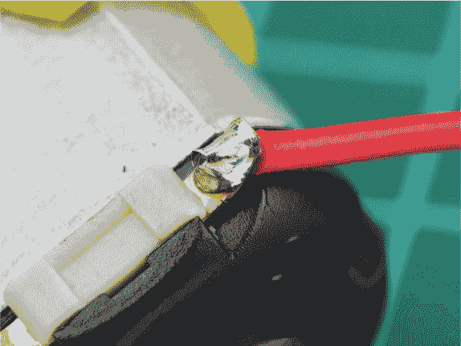

**图 D-8** 我焊接好的电机端子——注意焊点的光亮和平滑的锥形外观

一个好的焊接点应该是平滑且光亮的，形状像一个小锥体，有点像一个小火山。例如，将电线焊接到电机端子上，与将针脚焊接到印刷电路板上的方式略有不同，因此可以参考图 D-9 来了解一个良好的 PCB 焊接连接的样子。

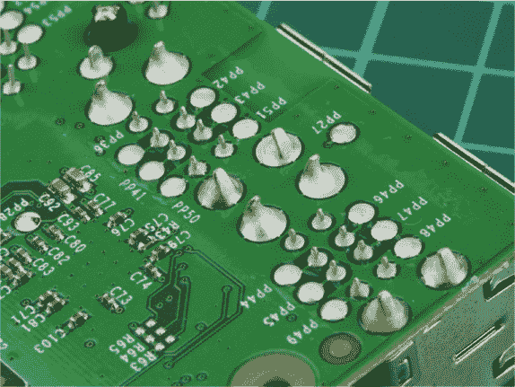

**图 D-9** 树莓派底部的 PCB 焊接点（虽然这些是由自动化机器完成的，但它们仍然是一个很好的学习范例）

如果你的焊接点不正确，别慌！拿起焊接铁，把尖端重新放回焊点加热它。看看焊锡是否流动并更好地稳定，如果没有，就加一些焊锡以确保焊接点正确。

图 D-10 展示了一些常见的焊接错误及其解决方法。

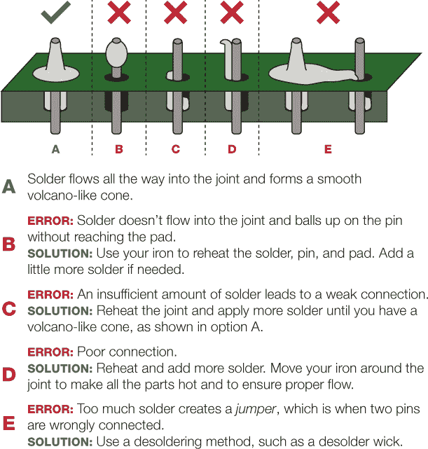

**图 D-10** 常见的焊接错误及其解决方法

### 总结

焊接技巧是一个重要的制作技能，只要多加练习，它会带给你很大的帮助！按照这里的指导，或者上网观看一些示范视频来完善你的技巧。
