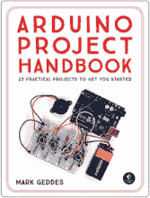
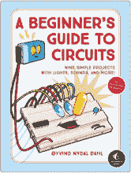
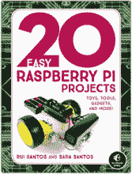
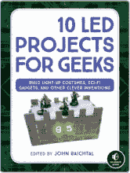
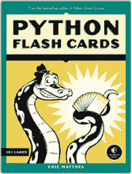

## 第十三章：启动时运行程序

在本书中，我已经向你展示了如何使用简单的终端命令运行你的机器人程序。虽然这种方法非常适合原型开发，但未来你可能希望在每次打开机器人时都自动运行一个程序，而无需远程访问。你可以通过编辑 *rc.local* 配置文件轻松实现这一点。

当你启动树莓派时，它会经过一个引导过程。引导过程结束后，树莓派会查找*rc.local*文件中是否有需要执行的最后命令或代码。通过添加自定义的 Python 命令，你可以让本书中的任何程序在启动时自动运行。方法如下！

### 编辑 *rc.local* 文件

首先，确保你希望在启动时运行的程序是完整的，并且按你想要的方式运行。在终端中完成编程、编辑和调试过程要比等待程序在启动时运行要好得多。这种方法可以避免你一直开关树莓派。

然后，在终端中的任何位置，使用 Nano 文本编辑器打开*rc.local*文件，如下所示：

pi@raspberrypi:~ $ sudo nano /etc/rc.local

确保在开始时加上`sudo`。这个命令允许你以 root 用户权限进行编辑，这样你对文件所做的更改才能保存，否则它们会消失！

输入上述命令后，你将看到一个类似于 Listing E-1 的文件。

```
   #!/bin/sh -e
   #
   # rc.local
   #
   # This script is executed at the end of each multiuser runlevel.
   # Make sure that the script will "exit 0" on success or any other
   # value on error.
   #
   # In order to enable or disable this script just change the
   # execution bits.
   #
   # By default this script does nothing.

   # Print the IP address
   _IP=$(hostname -I) || true
   if [ "$_IP" ]; then
     printf "My IP address is %s\n" "$_IP"
   fi
➊
   exit 0
```

**LISTING E-1** *rc.local* 文件的内容

现在，使用箭头键滚动到`fi`和`exit 0`之间的空间 ➊。在这里你可以添加任何希望树莓派在启动时执行的命令。不管你添加什么，你必须保持`exit 0`在文件底部不被修改。

如果你想在启动时运行一个 Python 3 程序，在➊处插入如下命令：

python3 /your/file/path/here/filename.py &

用指向正确目录和程序的有效文件路径替换该路径。同时，确保在命令的末尾加上`(&)`符号，以确保你的程序不会阻止树莓派继续引导。

添加你希望在启动时执行的程序后，保存你的工作并通过按下 CTRL-X 并按照提示退出 Nano 文本编辑器。

### 实践示例

假设你希望在每次打开机器人时都运行*ball_follower.py*程序。为此，在树莓派上打开*rc.local*文件，并在`exit 0`语句之前插入以下行：

python3 /home/pi/robot/ball_follower.py &

现在，文件的最后部分应该如下所示：

```
--snip--
# Print the IP address
_IP=$(hostname -I) || true
if [ "$_IP" ]; then
  printf "My IP address is %s\n" "$_IP"
fi

python3 /home/pi/raspirobots/ball_follower.py &

exit 0
```

让我们测试一下，看看是否有效。保存文件，然后按照如下步骤重新启动树莓派：

pi@raspberrypi:~ $ sudo reboot

如果成功，您的机器人将执行*ball_follower.py*代码。如果没有成功，可以通过 SSH 远程访问树莓派，再次编辑*rc.local*文件。确保你有正确的*完整*文件路径，并且没有任何拼写错误。

这就是让程序在启动时运行的全部内容！

## 更新

访问 [`nostarch.com/raspirobots/`](https://nostarch.com/raspirobots/) 获取更新、勘误和其他信息。

来自 **NO STARCH PRESS**的更多无废话书籍



ARDUINO 项目手册，第 1 卷

25 个实用项目帮助你入门

你开始了

*作者* MARK GEDDES

2016 年 6 月，272 页，$24.95

ISBN 978-1-59327-690-4

*全彩*



初学者电路指南

九个简单项目与

灯光、声音以及更多！

*作者* ØYVIND NYDAL DAHL

2018 年 10 月，80 页，$17.95

ISBN 978-1-59327-904-2

*全彩*



20 个简单的树莓派项目

玩具、工具、小工具及更多！

*作者* RUI SANTOS 和 SARA SANTOS

2018 年 4 月，288 页，$24.95

ISBN 978-1-59327-843-4

*全彩*


树莓派家庭破解

12 个间谍项目，监视你的

家庭，修改 Minecraft，破解

无线信号等更多！

*作者* DAN ALDRED

2019 年春季，134 页，$24.95

ISBN 978-1-59327-946-2

*全彩*



10 个为极客设计的 LED 项目

构建光效服装，科幻

小工具和其他巧妙的发明

*编辑* JOHN BAICHTAL

2018 年 7 月，240 页，$24.95

ISBN 978-1-59327-825-0

*全彩*



PYTHON FLASH CARDS

语法、概念和示例

*作者* ERIC MATTHES

2019 年冬季，101 张卡片，$27.95

ISBN 978-1-59327-896-0

*全彩*

**电话：**

1.800.420.7240 或

1.415.863.9900

**电子邮件：**

SALES@NOSTARCH.COM

**网页：**

[WWW.NOSTARCH.COM](http://WWW.NOSTARCH.COM)

**适合 10 岁以上**

## “机器人学的轻松入门”

EBEN UPTON，树莓派公司首席执行官（贸易）有限公司

**无需经验！**

*学习机器人技术与树莓派* 将带你从一个新手制造者快速成长为机器人构建者。你将首先构建一个由树莓派微型计算机驱动的双轮机器人，然后使用世界上最流行的编程语言 Python 对其进行编程。逐步地，你将通过添加越来越复杂的功能来改善你的机器人，直到它能够跟随线路、避开障碍，甚至识别一定大小和颜色的物体。

### 学习如何：

 使用 Wii 遥控器远程控制你的机器人

 教你的机器人使用传感器避开障碍物

 编程让你的机器人自主跟随线路

 自定义你的机器人，添加 LED 和扬声器，让它发光并播放声音

 用 Pi 摄像头查看你的机器人所见

在阅读本书的过程中，你将学习基本的电子技能，例如如何连接各个部件，使用电阻器和调节器，并确定你的机器人需要多少电力。你还将学习 Python 编程的基础，并通过与伺服电机、马达和传感器等硬件的实际操作，获得足够的经验，从而将你的创作扩展到简单机器人之外。

**Matt Timmons-Brown** 运营着世界上最受欢迎的 Raspberry Pi YouTube 频道“The Raspberry Pi Guy” ([www.youtube.com/theraspberrypiguy](http://www.youtube.com/theraspberrypiguy))，该频道的观看次数已经超过 500 万。他是爱丁堡大学的计算机科学学生，来自英国剑桥。

需要 Raspberry Pi 和 Python 3


***极客娱乐的至高之作™***

[www.nostarch.com](http://www.nostarch.com)
