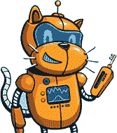

## 引言

本书通过 Scratch 引导你探索数学。它展示了如数字表示、可整除性、质数和密码学等概念，这些在日常生活中有用且相关，同时也是有趣的编程项目。它的重点是如何提出有趣的数学问题，以及如何编程让计算机回答这些问题。

这本书还讲述了如何找到解决问题的最佳方法。你将看到，一点点的规划，加上合适的数学或编程技巧，能够让复杂的计算变得可行。这些就是书名中的“黑客”技巧；你将学习如何通过编程策略引导 Scratch 给出你想要的答案，并掌握提供巧妙解决方案的数学技巧，帮助你解决看似不可能的问题。

### 为什么选择 Scratch？

探索计算机语言意味着了解它能做什么，并弄明白它如何回答你想提出的问题。Scratch 是一种鼓励玩的语言。虽然它通常用于制作图形、声音和游戏，但它的玩乐精神同样适用于探索数学。

Scratch 简单易用：它可以直接在网页浏览器中通过 Scratch 网站运行，* [`scratch.mit.edu`](https://scratch.mit.edu) *，无需安装（不过，如果你更喜欢离线工作，也可以从* [`scratch.mit.edu/download`](https://scratch.mit.edu/download) *下载 Scratch 应用程序）。你通过像拼接 LEGO^®积木一样，将命令组合在一起，所有选项都可以通过拖放立即使用。基于块的界面让你能够专注于将循环、条件语句和变量组合起来，构建你想要的任何东西，而无需在文本编程语言的语法细节中陷入困扰。如果你曾使用 Scratch 制作游戏或编写故事，那么你会发现，使用它来解决与数学相关的问题也变得轻而易举。

### 这本书适合谁

如果你符合以下条件，这本书适合你：

 你喜欢 Scratch 编程，并希望深入了解它

 你喜欢数学，准备好迎接一些新想法

 你喜欢谜题和模式

 当你找到解决问题的最佳方法时，你知道那种感觉有多好

如果你已经有一些基本的 Scratch 编程经验，你将从这本书中受益匪浅。例如，你应该能够舒适地创建自己的变量、列表和自定义模块。如果你对代数和几何有一些了解，比如知道如何处理代数变量和解释坐标平面上的点，那也会有所帮助。仅凭这几样基本元素，你将惊讶于在 Scratch 中可以做的事情，从找出一个集合中的所有质数，到创建无法破解的秘密代码。

### 本书内容

以下是你将在本书每一章中找到的内容概览：

**第一章：计算机如何处理数字** 我们将从探索计算机如何内部处理数字开始。了解这一点可以帮助你避免一些难以察觉的错误，并克服编程语言的一些限制。

**第二章：探索可除性与质数** 接下来，我们将研究质数，它们是所有整数的基本构件。你将看到 Scratch 如何帮助你找到质数并将它们用于计算。

**第三章：利用质因数分解分解数字** 本章介绍了不同的策略，用于找出如何将一个数字表示为质数的乘积。通过尝试不同的技巧，你将能找到最有效的策略。

**第四章：在序列中寻找模式** 在本章中，你将学习如何使用 Scratch 理解数字列表中的模式。有时这些模式来自代数，有时来自几何，或者两者兼而有之。

**第五章：从序列到数组** 掌握了一维列表后，我们将进入二维数字表格，如乘法表和帕斯卡三角形。你将学习如何在 Scratch 中追踪二维数据结构。

**第六章：制作代码并破解它们** 本章将向你展示如何使用数学规则将消息加密成乱码。你还将发现如何解密这些消息，无论是否拥有秘密密钥。

**第七章：计数实验** 接下来，我们将解决来自组合学领域的两个有趣问题，组合学也叫做计数艺术。你将看到 Scratch 如何通过简单的规则构建模式，并计算这些模式可以出现的方式有多少种。

**第八章：三次圆周率计算** 在本章中，你将尝试不同的方法来计算*π*的值，包括通过面积法、收敛法以及使用数论法。

**第九章：接下来做什么？** 最后一章提供了一些建议，帮助你寻找更多数学和编程问题，以及更多的工具来解决这些问题。

每一章都包含一系列动手实践的 Scratch 编程项目，帮助你将章节中的概念付诸实践。全书共有 33 个项目。此外，书中的挑战将帮助你在每章讨论的思想和程序基础上进一步构建。书的附录包含了一些示例代码以及如何解决这些挑战的提示。

### 如何阅读本书

阅读这本书最简单的方式是像读小说一样，从头到尾直接读完。尽管如此，书中涵盖的主题大部分是独立的，因此你也可以按照自己的兴趣跳跃阅读各章。如果你特别对某个章节感兴趣，或许你想跳到那一章；或者也许某一章和你正在学校学习的内容相关，你想从那一章开始阅读。以这种方式进行探索是完全可以的，但我有几点建议。

第一章，关于计算机算术，将帮助你理解后续章节中程序可能出现的算术问题。最好先阅读这一章。第二章介绍了质数，所以你应该先读这一章，再阅读第三章，它建立了质因数分解。你可能还想在阅读第五章（关于数组）之前，先读一下第四章（关于数列），因为数组可以被看作是二维的数列与一维数列之间的等效关系。接下来的章节都可以独立阅读，但尤其是第七章，其中包含了一些相当复杂的概念和程序；在开始阅读这一章之前，最好先阅读一些其他章节，以便获得更多的 Scratch 编程和数学思维的练习。

### 在线资源

你可以在本书的 Scratch 工作室找到所有 33 个项目的 Scratch 代码和大部分挑战问题，网址是 *[`scratch.mit.edu/studios/29153814`](https://scratch.mit.edu/studios/29153814)*。这些程序也可以从本书的网页下载，网址是 *[`nostarch.com/math-hacks-scratch`](https://nostarch.com/math-hacks-scratch)*。

### 我的灵感

我写这本书是考虑到我的孙辈。当他们向我介绍 Scratch 时，我立刻被这个语言的吉祥物——那只微笑的橙色小猫吸引了。我当时不知道这个吉祥物的名字，但它完全可以叫做 Gummitch，那个在我最喜欢的短篇小说《春季跳跃者的时空》中表现出色的主角。Gummitch 是一只超天才的小猫，他有着宏大的计划，打算写书来向其他超天才小猫们解释这个世界，书名包括《气味百科全书》、*《人类与猫的心理学》*，以及最引人注目的 *《春季跳跃者的时空》*。

看到 Scratch Cat 与 Gummitch 的相似性，我想要写一本 Gummitch 会写的数学书，一本类似 *《春季跳跃者的数字学》* 的书。我尽力将这本书的数学水平调整到适合各地超天才小猫的程度。书中的项目既有趣又能在 Scratch 中进行创作，将一点数学与 Scratch 代码结合，开辟了全新的思维方式，去思考数字、字母、几何和模式。我希望你们读得开心，就像我写得那么开心！
