**1**

## **计算机如何看待数字**

为了进行数学运算，计算机需要一种表示数字的方式。事实证明，计算机处理数字的方式与人类有很大不同。

例如，我们喜欢认为我们可以一直数下去，数到越来越大的数字，但计算机有有限的存储空间。如果它们开始计数，最终会用完空间。没有最大的数字，但在 Scratch 中，*确实*有一个计算机能够表示的最大数字。

类似地，我们将分数和小数看作与数轴上的点相对应，任意两个整数之间都有无限多个点。然而，随着我们将这些点在计算机有限的世界中越来越紧密地压缩，最终会没有足够的空间来记录它们。没有最小的正数，但*确实*有一个计算机能够在 Scratch 中使用的最小正数。

在这一章中，我们将探讨计算机屏幕后发生的事情，以及计算机如何看待数字。我们将深入了解 Scratch 能够表示的数字的限制。理解这些限制非常重要，这样我们才能确保程序的结果是准确的。你还将学习一些绕过 Scratch 限制的小技巧，并欺骗计算机以表示比正常情况下更多的数字。

### 数字究竟是什么？

每个人都*认为*他们知道什么是数字，但实际上有许多不同的数字系统可供选择，取决于我们希望数字做什么。我们通常从 1 开始学习计数，这些数字被称为*计数数字*。有时我们希望从 0 开始计数，这时这些数字就叫做*整数*。当我们可以前进或后退，允许负数时，就生成了*整数集*：{ . . . , –3, –2, –1, 0, 1, 2, 3, . . . }。

我们可以将数字与几何学建立联系，把数字看作对应于数轴上的点，从而构建出*实数集*。我们还可以通过将整数除以其他（非零）整数来得到*有理数*。这里的*有理*不是指逻辑性和合理性，而是因为这些数字是由*比率*构成的。有时候有理数被称为*分数*，但这可能会造成误解。在日常语言中，*分数*通常指的是某物的一部分，意味着小于 1 的部分，而像 3/2 和 4/3 这样的有理数可以大于 1。此外，分数通常是指分母大于或等于 2 的情况（如二分之一、三分之一等等），但有理数有时也有分母为 1 的情况，如 2/1、3/1 等。这样，整数实际上是一种特殊的有理数。

在所有这些数字的使用方式中，我们依靠直觉，当我们命名一个特定数字时，实际上是在识别一个无限集合中的一个元素。也就是说，我们期望数字会永无止境地延续下去：“通向无限，超越一切”，正如巴斯光年所说。然而，数字还有另一种使用方式，它们会循环回绕，反复使用它们的值，就像时钟上的数字一样。这种数字的使用方式非常适合追踪定期或重复发生的事件，并且具有一些有趣的特性，我们将在下一章讨论模运算时进一步探讨。

在本书的前几章，我们将最关注计数数字，也就是*正整数*。当我们谈论数字而不加具体说明时，这就是默认的解释。但到目前为止，我们仅仅考虑了数字在数字系统中是否被包含。还有一个需要考虑的因素：这些数字是如何*表示*的。

### 十进制？二进制？你来选择！

一个*基数表示系统*决定了数字如何分组以便于计数，以及需要多少符号来表示这些数字。也许是因为我们有 10 根手指，人类通常使用*十进制*来思考数字，这是一种使用 10 为一组的基数系统。我们从一一数起，并为每个新数字使用不同的符号，从 1 到 9。当我们数完手指后，我们会将手指分成两组十根手指，并按十进制数数。当分组后的十位数没有剩余时，我们使用符号 0，表示握紧的拳头，来表示这一点。因此，我们理解 34 为 3 个十和 4 个一，60 为 6 个十和 0 个一。

我们可以扩展按 10 分组的模式，用相对较少的数字来表示越来越大的数字，引入第三位数字表示 10 个十（100），第四位表示 10 个百（1,000），依此类推。使用指数可以帮助我们表示重复的乘法。例如：

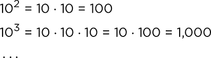

我们总是可以选择使用展开记法来整理分组。这里有一个例子：

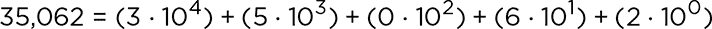

由于十进制系统基于 10 的幂，它也被称为*十进制*。但尽管人类偏爱十进制，其他分组方式也是可能的。例如，如果你只想用一只手的手指来计数，你可以按五个一组，这样就是*五进制*系统。五进制计数只需要符号 0、1、2、3 和 4。数字五写作 10，六写作 11，依此类推。

鸡蛋和甜甜圈是按打出售的，每打为 12 个，我们甚至有一个词来表示一打打：*gross*（一打打为 144 个）。*12 进制*计数法使用符号 0, 1, 2, 3, 4, 5, 6, 7, 8, 和 9，和通常一样，但它需要两个额外的单字符符号来表示数字 10 和 11。通常我们使用 T 和 E。如果我们需要指定进制，可以用下标来表示，比如 15[10]表示 15 是十进制。这使得比较不同进制系统中的数字更容易。例如，15[10] = 13[12] = 30[5]，也就是说（1 ⋅ 10）+ 5 = （1 ⋅ 12）+ 3 = （3 ⋅ 5）+ 0。

大多数计算机使用*二进制*（base 2）系统来内部表示数字。这个系统的优点是它只需要两个符号，0 和 1。这很重要，因为 0 和 1 很容易通过开关的位置来跟踪：开关要么是关闭（0），要么是开启（1）。只有两个符号在表示逻辑时也很有用，其中两个可能性可以表示*假*和*真*。一个缺点是，2 的幂（1, 2, 4, 8, 16，……）的增长速度比 10 的幂（1, 10, 100, 1,000，……）慢，因此，通常需要更多的数字来表示一个数字的二进制形式，而表示同一个数字的十进制则需要较少的数字。我们稍后会进一步讨论这个问题。

#### 项目 1：77 的二进制是多少？

对于给定的正整数，它有一种独特的方式表示为十进制（base 10），它也有唯一的二进制表示。在这个项目中，我们将编写一个 Scratch 程序，将十进制转换为二进制，这样我们就能看到计算机在表示一个数字时所看到的样子。

我们可以用两种方式来解决这个问题：我们可以称之为*从大到小*和*从小到大*的策略。根据从大到小策略，我们首先找到十进制数中包含的最大 2 的幂，以确定二进制表示的最左边数字。然后我们减去该 2 的幂，并找到差值中的最大 2 的幂。我们不断重复这个过程，从左到右生成二进制表示。举个例子：

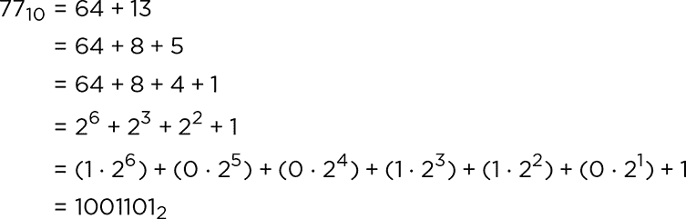

从大到小策略与大多数人在头脑中进行十进制到二进制转换时的方式相匹配，但从小到大的策略在计算机中编程要容易得多。我们不需要去寻找数字中包含的最大 2 的幂，只需编写一系列的除以 2 的操作，并记录下余数。这将从右到左构建二进制表示。图 1-1 展示了一个使用从小到大的方法的 Scratch 程序。

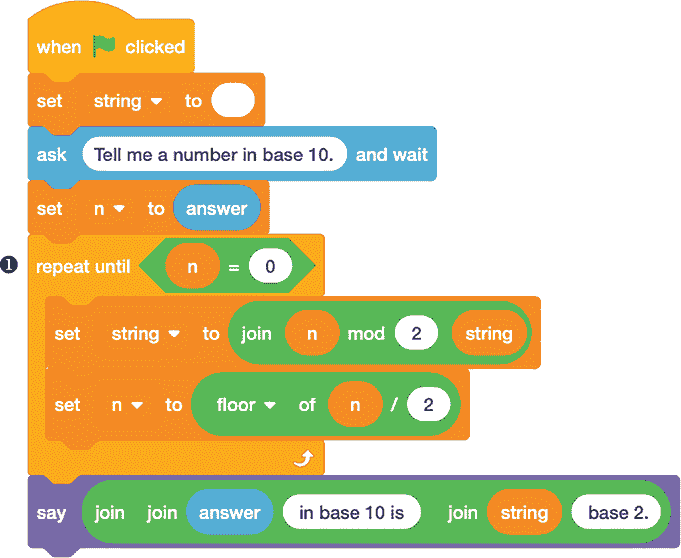

*图 1-1：将十进制（base 10）数转换为二进制（base 2）的程序*

我们在 `string` 变量中构建数字的二进制版本，程序开始时该变量为空。（*string* 是字符的序列；有关详细信息，请参见“破解代码”部分中的 第 5 页。）首先，我们使用 `ask and wait` 块让 Scratch Cat 提示用户输入一个十进制数字，并将用户的 `answer` 存储在 `n` 变量中。然后，我们进入一个 `repeat until` 循环 ❶，在这里实现真正的逻辑。

`n mod 2` 返回将 `n` 除以 `2` 的余数，如果 `n` 是奇数则为 `1`，如果是偶数则为 `0`。每次通过循环时，这个 `mod` 操作会给我们数字的一个二进制位，从最不重要的（最右边的）位开始。我们使用 `join` 块将该数字与 `string` 变量中已有的内容合并，然后将结果放回 `string`。接着我们将 `n` 除以 `2`，并使用 `floor` 函数将结果向下取整到最接近的整数。这将移除我们刚刚处理过的二进制位的值。然后，循环可以重新开始，找到下一个二进制位。

一旦 `n` 减少到 `0`，我们就从右到左构建了该数字的完整二进制表示。然后，我们使用更多的 `join` 块将其组合成一个有意义的句子，报告结果，Scratch Cat 会通过 `say` 块宣布这个结果。

##### 结果

运行程序并尝试在 Scratch Cat 提示输入一个数字时输入 **77**。你应该会得到 1001101 作为结果，正如 图 1-2 中所示。

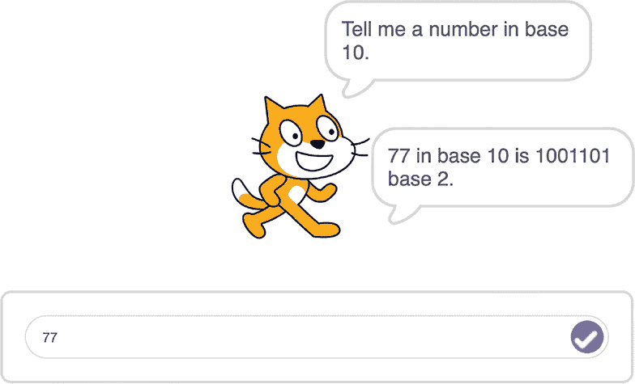

*图 1-2：将 77[10] 转换为二进制*

由于 Scratch 的工作方式，你会在本书中看到很多将程序执行过程中的不同点合并成一张图像的示例，就像这个图一样。在这个例子中，你可以看到 Scratch Cat 的对话框来自 `ask and wait` 和 `say` 块，以及输入十进制数字的框。当你自己做这些实验时，执行流程会很清楚，但在查看书中的图示时，你可能需要稍微解释一下每个步骤发生的时机。

##### 破解代码

该程序将十进制到二进制的转换视为一系列的除以 2 操作。你也可以从反向思考，将其看作一系列的乘以 2 操作，每遇到二进制表示中的 1 就加 1，每遇到 0 就加 0。例如，我们可以通过以下方式数学表示转换 77：

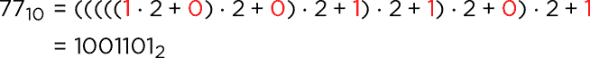

你可以看到二进制表示中的数字是红色的。以这种方式堆叠乘法，使得每个二进制数字都与其相应的 2 的幂匹配。

另一个需要了解的关于这个程序的重要点是，虽然 Scratch 报告的答案看起来像一个数字，但实际上它是一个字符串。正如我之前提到的，字符串只是一个字符列表。通常这些字符是字母组成的，用来形成像`Hello`或`Tell me a number`这样的消息，但在这种情况下，这些字符恰好是 0 和 1。所以，即使结果看起来像是由二进制数字构成的一个数字，Scratch 并不知道`1001101`是一个具有十进制值 77 的二进制数字。

我们必须使用字符串，因为 Scratch 没有内建的方法直接处理二进制数字。如果我们想让 Scratch 对基数 2 的数字进行二进制运算，我们就需要编写一个自定义程序来教它怎么做。这是本书中很多需要将数字当作字符串处理的情况之一，目的是“欺骗”Scratch 执行我们想要的操作。

 编程挑战

**1.1** 编写一个程序，提示输入一个基数*b*，然后提示输入一个十进制数字*n*，最后返回该数字*n*在基数*b*下的表示。你可以将基数*b*限制为 2 到 10 之间，或者继续使用数字 E 和 T 来允许基数为 11 或 12。

**1.2** 一个常见的与计算机相关的进制是 16 进制，*十六进制*，它通常使用额外的符号 A、B、C、D、E 和 F 来表示 10、11、12、13、14 和 15。扩展你的进制转换器，给出十六进制表示。看看你能否找到二进制和十六进制之间转换的技巧。

#### 项目 2：1001101 的十进制是多少？

现在让我们尝试从二进制表示转换回十进制。图 1-3 展示了一个实现这一功能的 Scratch 程序。

我们首先通过`ask and wait`模块请求用户输入一个表示二进制值的字符串。然后，我们使用`repeat`循环和`index`变量一次查看字符串中的一个字符，从左到右，通过`letter index of answer`访问当前字符。变量`n`从`0`开始。对于二进制表示中的每个数字，`n`会翻倍，然后将当前数字（`0`或`1`）的值加到`n`中。当没有更多的二进制数字时，`n`就保存了该数字的十进制表示。

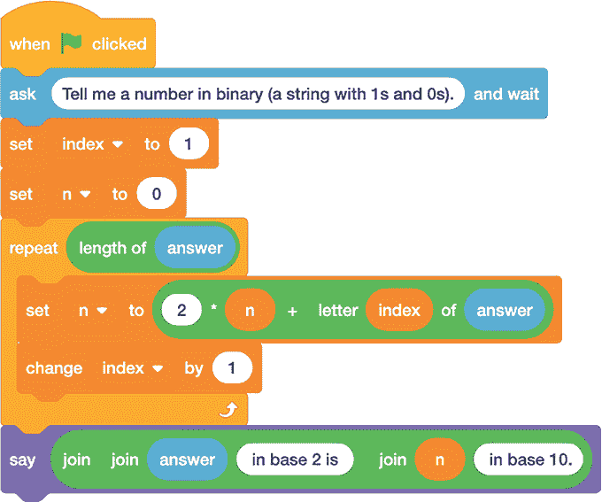

*图 1-3：将二进制（基数 2）数字转换为十进制（基数 10）的程序*

##### 结果

我们知道 77 的二进制表示是 1001101。尝试运行程序并输入 1001101，看看它是否返回 77。图 1-4 显示了结果。

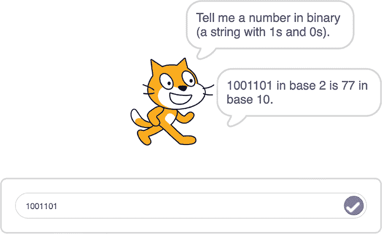

*图 1-4：将 1001101[2]转换为十进制*

我们已经在图 1-2 中将 77 转换为二进制，并在图 1-4 中再转换回十进制。但是，77*到底*是什么？无论我们是用二进制还是十进制表示，77 代表的数量是相同的。我们选择如何表示一个数字可能会揭示出它的一些有趣的特性（例如，如果一个十进制数以 0 结尾，那么这个数字一定能被 10 整除；如果一个二进制数以 0 结尾，那么这个数字必须能被 2 整除），但它并不会改变数字的实际值。

##### 破解代码

我们的二进制转十进制程序的一个问题是，它没有检查输入是否为二进制数字串。如果你输入的不是二进制表示的数字，Scratch Cat 很高兴地告诉你一些无意义的内容，正如图 1-5 中的例子所示。

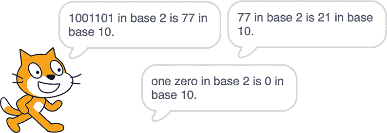

*图 1-5：二进制转十进制转换器的三个输出。没有任何东西能阻止你输入非二进制数字！*

我们可以通过包含一个自定义的`Screen string`块来检查输入，从而修复这个问题。这个块在图 1-6 中显示，它确保输入格式正确：一个仅包含 0 和 1 的字符串。

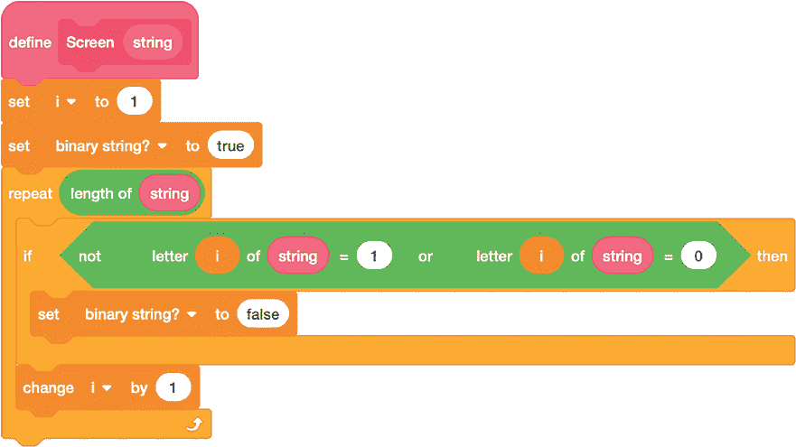

*图 1-6：确保只允许二进制数字*

该块将逻辑（*布尔*，即真/假）变量`binary string?`设置为`true`，只要用户没有输入其他字符（例如空格、字母或大于 1 的数字）。否则，它将`binary string?`设置为`false`。现在，我们可以使用这个块与`if...else`语句结合，以确保不会得到任何荒谬、不正确的答案，正如图 1-7 所示。Scratch 用于布尔测试的运算符块都是绿色六边形，可以插入到控制块中的测试条件里。

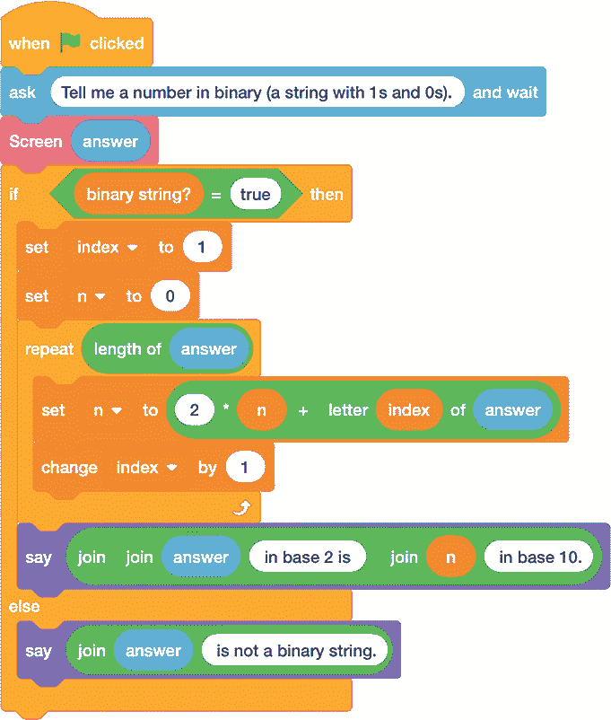

*图 1-7：更加小心的二进制转十进制转换器*

在这里，我们已经将原始的二进制转十进制代码移到`if...else`块的`if`分支中，这样只有在`binary string?`变量为`true`时，它才会运行。否则，Scratch Cat 会告知用户输入的不是二进制数字。

你可能会失望地发现，现在程序的长度比最初稍长。Scratch 让编写非常紧凑的程序变得容易，甚至通过告诉你编程窗口中有多少个积木来鼓励这种方式。但有时，即使这会让你的程序变得稍长一些，还是小心为好。如果某些内容可能会被误解或在输入时出错，总会有人在某些时候犯这样的错误，因此还是谨慎为好！一些编程语言有专门的命令来拦截错误并将其引导到某个无害的地方（语法通常涉及 `try` 和 `catch` 关键字），但 Scratch 让你自己预见问题并加以防范，就像我们用 `Screen string` 积木所做的那样。

 编程挑战

**1.3** 有时新闻报道中提到的 *指数增长* 是一个通用术语，用来表示快速增长。指数增长在数学中有特定的含义，指的是在数字序列中，从一个值到下一个值的进展是通过乘法并使用一个固定的因子来完成的。例如，每个数字可能是前一个数字的两倍。另一种选择是 *线性增长*，其中变化是通过 *加* 上一个固定增量来完成的，比如每个数字比前一个大两个。

编写一些 Scratch 代码，提示用户输入一个乘数或增量，并返回一个按指数或线性增长的数字序列。比较增长：如果用户输入一个小于 1 的数字用于指数增长会发生什么？如果用户输入一个小于 0 的数字用于线性增长会发生什么？也许这是一个需要输入筛选的情况。

### 计算机如何表示数字

计算机可以以不同的方式内部表示数字，但它们都涉及某种妥协。之前我提到过，人类将整数和实数等数字系统视为无限的。然而，计算机并不是为了处理无限的集合而构建的。它们必须在硬件架构或所运行编程语言的逻辑结构的限制内工作。

在硬件方面，中央处理单元（CPU）通常有 *寄存器*，这是 CPU 中可以一次性存储和操作一定数量的二进制数字或 *位* 的区域。编程语言被设计为为每个数字分配固定数量的位，因此语言设计者需要做出决定，确定这些位究竟代表什么（例如，某些位是否代表基数，其他位代表指数）。他们还需要做出有关如何表示正数或负数以及如果一个数字超出了可用空间应该怎么做的决定。计算是否应该在出现警告或错误时停止，还是应该在没有提示的情况下重新循环，可能会导致意外和不正确的结果？

最终，我们无法在计算机有限的可能空间中容纳无限多个数字，因此必须舍弃“多数”数字。这意味着计算机语言的开发者需要决定哪些数字以及哪种类型的数字足够有趣或重要，值得被包括在内。有些人需要表示微小的数字，比如亚原子粒子的大小，而另一些人则需要表示巨大的数字，比如宇宙的大小，还有一些则需要表示介于两者之间的数字。不同的语言可能会设计来满足其中的一些需求，但不是所有需求。

除了数字的大小或小的问题外，语言设计者还可能想要考虑数字的使用方式。例如，有时数字用于计数，回答“多少？”的问题。在这种情况下，答案通常是一个整数。（这类问题出现得相当频繁，以至于许多编程语言为整数提供了独立的表示系统，区别于其他类型的数字。）另一些时候，数字用于测量，回答“多少？”的问题。对此类问题的回答不太可能是整数。语言设计者需要一种表示这些“介于两者之间”的数字的方法，并且他们必须决定到底要表示多大的“介于两者之间”。

#### 浮点数的要点

*浮点表示法*通过包括小于 1 的基数幂来表示“介于两者之间”的数字。在十进制中，有一个*小数点*，小数点右侧的数字表示一个介于 0 和 1 之间的数字，结合了 1/10、1/100 等的幂。例如，*π*的近似值 3.14 表示的是一个稍微大于 3 的数字：

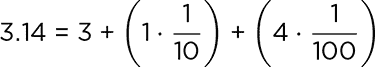

如果你需要更精确的近似值，可以再加上几个数字：

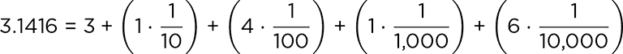

同样的原理适用于二进制浮点表示法，其中位于*二进制点*（即小数点的二进制等价物）右侧的数字表示 1/2 的幂。你可能已经熟悉使用二进制小数表示数字——即使你没有意识到——如果你曾经用尺子或卷尺测量过长度（见图 1-8）。

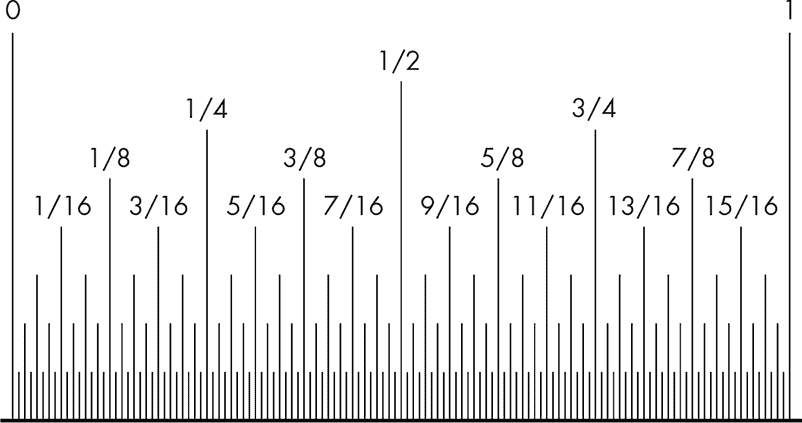

*图 1-8：卷尺上的二进制小数*

英寸被细分为二分之一（1/2）、四分之一（1/4）、八分之一（1/8）、十六分之一（1/16）等。这些是二进制小数，因为每个分母都是 2 的幂。例如，你可以通过先走过 1，再走过 1/2，接着是 1/4，再是 1/16，最后写作 1 13/16，并用二进制表示为 1.1101 来表示 1 13/16 英寸。

二进制小数为我们提供了一种表示非整数的方式，但应该使用多少比特来表示一个数字，以及如何解释这些比特呢？任何发明计算机语言的人都可以制定自己的规则，但最好有一个大家都同意使用的标准，这样在从一种语言切换到另一种语言时就不会产生混淆。其中一个标准就是 IEEE 浮点数运算标准，或称 IEEE 754。Scratch 的开发者选择使用这个标准来表示所有数字，甚至是整数，而一些语言则将 IEEE 754 用于浮点数，采用不同的标准表示整数。

#### 精度翻倍，乐趣翻倍

IEEE 754 使用*双精度*，意味着二进制中的浮点数将占用 64 个比特（与*单精度*不同，后者每个数字只允许 32 个比特）。图 1-9 显示了 64 个比特是如何分配的。

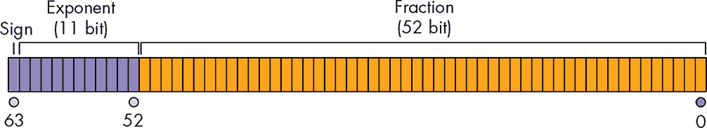

*图 1-9：IEEE 754 标准中比特是如何分配的*

第一个比特，如图中所示的青色部分，用于表示符号：0 或 1 代表正负。剩下的 64 – 1 – 11 = 52 个比特，如图中橙色部分所示，表示一个数字，通常是一个介于 1 和 2 之间的值，称为*尾数*。由于介于 1 和 2 之间的二进制数总是以 1 开始，然后是二进制点和其他数字，因此我们可以通过不显式写出初始的 1 来节省一个二进制位。所以，实际上我们有 53 位精度，而不是 52 位。符号位之后的 11 个比特，图中的紫色部分，表示指数，指定用于乘以尾数的 2 的幂。有时，指数也称为*特征*。拥有 11 个位数的特征给出了 2¹¹个可能的指数范围，这些指数从 2^(-1,023)到 2^(1,024)不等，但最顶端和最底端的数字被保留供特殊用途。

**注意**

*要实际了解 IEEE 754 是如何工作的，可以使用一些在线交互工具，逐位（字面意义上）修改浮点数，看看发生了什么。一些示例包括* [`float.exposed`](https://float.exposed) *和* [`evanw.github.io/float-toy/`](http://evanw.github.io/float-toy/)。

请记住，二进制中 53 位的精度并不等同于十进制中 53 位的精度。例如，2¹⁰ = 1,024，大约等同于 10³ = 1,000。这表明，10 个二进制数字传达的信息量大约相当于 3 个十进制数字，因此 53 个二进制数字可以承载大约 16 或 17 个十进制数字的信息量。这仍然是非常大的——远远超过你在计算器屏幕上看到的数字——但它远非无限。

在本书中，我们主要关注整数，因此 16 位十进制数字的精度意味着一个 16 位数字，处于低四千万亿范围内，是 Scratch 能够保证精确表示的最大数字。当我们在未来的章节中测试数字的属性，如可除性时，我们需要确保所有数字的每一位都能可靠地表示，以便获得正确的结果。我们将在下一个项目中探索这一限制。

#### 项目 3：2⁵³ + 1 = ?

一些语言为可以精确表示的最大整数在浮点表示法中起了一个特殊的名字，*flintmax*，是 *floating-point integer maximum* 的缩写。在 Scratch 中，flintmax 的值是：

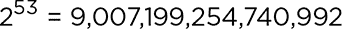

图 1-10 展示了一个小程序，说明了当你尝试处理大于 flintmax 的数字时，算术运算是如何出错的。在运行程序时，注意观察变量，看看问题是在哪里出现的。

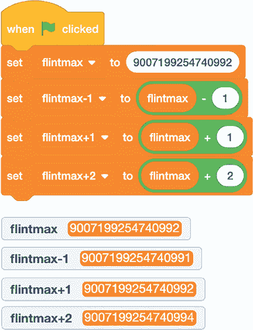

*图 1-10：大于 flintmax 时，整数运算不可靠。*

从 flintmax 中减去 1 是有效的，但将 1 加到 flintmax 上并没有得到预期的结果。变量 `flintmax+1` 的值仍然是 flintmax 本身。你必须加 2 才能改变 flintmax 并得到正确的答案。

##### 破解代码

测试极限并看看计算机语言或其他系统在哪里出问题总是很有趣。例如，对视频游戏感兴趣的人会花大量时间寻找漏洞和破坏游戏基础模型的位置，或者让游戏中的物体表现得很怪异。看到事情出错并进行实验，尝试弄明白计算机是如何处理这些问题的，成为其中的一部分乐趣。

在这种情况下，我们的程序显示，当 Scratch 中的计算超出 flintmax 时，结果是可疑的，可能不对应于精确的整数算术。我们在设计程序以探索 Scratch 中的整数运算时需要记住这一点。不过，只要数字，包括中间结果，保持在 flintmax 之下，结果将是精确的。例如，你可以编写一个 Scratch 程序，从 1 开始计数，直到 flintmax，你将得到所有整数值，直到没有缺失的整数值。

我们的程序还显示，IEEE 754 可以正确表示*某些*大于 flintmax 的整数，例如 flintmax + 2。事实上，它可以精确表示大于 flintmax 的偶数（2 的倍数），但在一段时间后，它会失去一位二进制精度，从那时起，它只会精确表示 4 的倍数。你可以尝试扩展 图 1-10 中的程序来说明这一点。Scratch 能正确区分 *n* 和 *n* + 2 的最大整数 *n* 是多少？这个值与 flintmax 相比如何？同样，*n* 和 *n* + 4 之间有差异的最大整数 *n* 是多少？

在 Scratch 中，算术运算可能会出错的另一种方式是，当计算结果不匹配任何数值时。例如，当你尝试除以 0 时，Scratch 会报告 `Infinity`，如 图 1-11 所示。

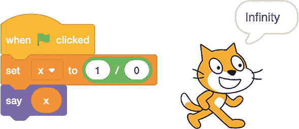

*图 1-11：有时答案是* 无限大。

但如果你尝试从 `Infinity` 中减去 `Infinity`，会发生什么呢？在 图 1-12 中报告的答案是 `NaN`，这意味着 *不是一个数字*。

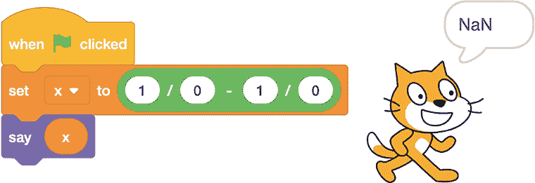

*图 1-12：有时答案不是一个数字。*

在我们的某些程序输出中，我们会遇到这些特殊值：`Infinity` 和 `NaN`。

 编程挑战

**1.4** Scratch 能表示的最大数字是多少，无论是整数还是非整数？当超过这个数字时会发生什么？

**1.5** 尝试使用 Scratch 创建一个浮点模拟器，就像在 第 12 页 中提到的那些。你应该能够查看一个由 0 和 1 组成的 64 位字符串，并看到与之相关的浮点数，然后改变这些位，看看数字如何变化。

#### 项目 4：百万位数字？

在这个项目中，我们将通过编程技巧让 Scratch 进行精确的整数运算，计算出比 flintmax 提供的精度更多的位数。为了绕过 IEEE 754 标准对数字表示的限制，我们必须编写自己的大数字表示系统。我们这里有几种不同的选择。例如，我们可以将十进制数字一个一个地存储在列表中，这样唯一的限制就是 Scratch 最大的列表长度 200,000。如果我们每次存储五个数字作为列表项，我们就能达到一百万个数字！

另一种选择是将数字存储为字符串。字符串可以非常长，甚至有数百万个字符。然而，Scratch 并没有提供对字符串进行算术运算的内置操作，因此如果我们想处理以字符串表示的数字，就必须自己编写算术运算操作。

图 1-13 显示了一个程序的示例，它可以可靠地对超出 flintmax 范围的数字进行计算。该程序提示输入指数 *n*，然后显示 2^(*n*) 的所有数字，既以数字列表的形式，也以将数字连接起来构建的字符串形式。

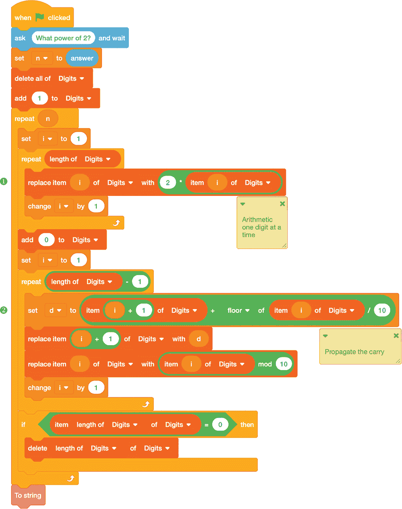

*图 1-13：使用扩展精度计算 2 的幂*

该程序从右到左构建 2^(*n*) 的数字列表。该列表（称为 `Digits`）以数字 1 开始，即 2⁰。然后，我们重复此过程，进行 `n` 次倍增，通过逐步遍历列表中的每个数字（使用 `i` 变量）并将其加倍 ❶ 来计算下一个更高的 2 的幂。

要解决这个问题，可以考虑加法是如何进行的。特别是，考虑到你被教导如何从右到左加多位数，并跟踪*进位*。例如，如果你要计算 24 + 18，你会从个位数开始，因此你会计算 4 + 8 = 12，写下 2，并进位 1。然后，你会查看十位数；你会计算 2 + 1 = 3，加上进位得到 4，然后报告答案为 42。第一步中进位的 1 实际上是 10，因此当我们跟踪最左侧的 10 的组时，它作为 1 ⋅ 10 来计算。

图 1-13 中的第二个嵌套重复循环➋实现了这个进位逻辑，确保列表中的每个数字只有一个数字。计算`floor of item i of Digits / 10`如果当前数字有两位数则给出`1`。我们将该`1`添加到列表中的下一个项目（项目`i + 1`）以执行进位，然后使用`item i of Digits mod 10`将当前数字限制为个位数。在所有这些之前，我们在列表的末尾添加一个`0`，以防最后一个项目需要进位操作。程序接近结束时的`if...then`语句会在不需要时去除该`0`。

##### 破解代码

如果能看到报告的答案呈现为一个数字，而不是逐个列出每个数字，那就太好了。我们可以通过在图 1-14 中展示的自定义`To string`模块来实现这一点。

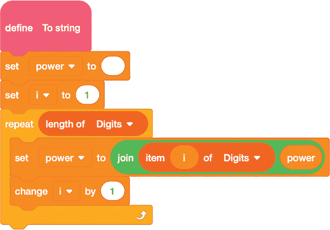

*图 1-14：将数字列表合并成字符串*

这个模块将列表中的项目连接成一个字符串，从右到左构建它，因此答案以更易读的方式展示出来。

##### 结果

尝试在比 Scratch 通常能够表示的更大的数字上测试程序。例如，图 1-15 展示了计算 2¹⁰⁶的程序运行结果，这就是 flintmax 的平方。

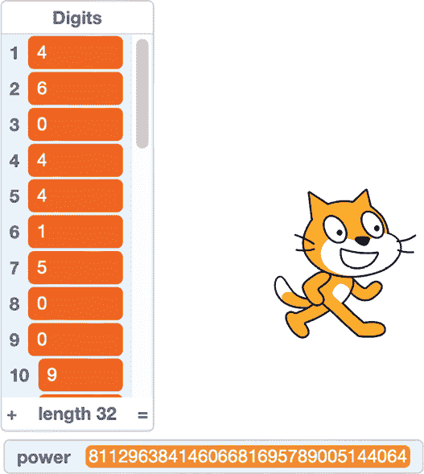

*图 1-15：精确计算 flintmax 的平方*

所有 32 位数字都正确报告（Scratch 完成后，你可以滚动查看所有数字）。请注意，`Digits`列出了从个位开始的数字。

 编程挑战

**1.6** 修改图 1-13 中的 2 的幂代码来计算 3⁵³。

**1.7** 修改图 1-13 中的 2 的幂代码，使其能够处理介于 0 和 99,999 之间的“数字”。这样，每个列表项将提供计算出的幂的五个数字，使得 Scratch 可以保存最多一百万个数字。

**1.8** 编写一个扩展精度的加法程序，在其中，Scratch Cat 提示输入两个作为字符串输入的大数字，将这些数字解析为数字列表，然后使用与图 1-13 中程序相同的技巧进行加法。尝试将代码扩展以处理乘法。

### 结论

如果我们理解了 Scratch 是如何跟踪数字的，就能确保避免通过请求超过 Scratch 能提供的数字来生成错误。这在整数运算中特别重要，因为我们需要数字的所有位数来正确处理关于可除性和计数的问题。

Scratch 的内部数字表示与许多现代编程语言一致，因此本章中的信息具有广泛的适用性。一旦我们了解了这些限制，就可以想出绕过它们的方法，从程序中获取更多的信息，而这些信息通常是语言无法提供的。这才是最棒的技巧！
