## **2**

## **探索可除性与质数**

你可以对任意两个整数进行加法、减法或乘法运算，结果仍然是一个整数。但当你将一个整数除以另一个整数时，结果不一定是整数。值得注意的是，当除法的结果*是*一个整数时，这是一个特殊的情况。同样值得注意的是那些无法被除以除了 1 和它本身以外任何数的稀有情况。我们称这些为*质数*。

在本章中，我们将研究这两种有趣的现象。这些概念是*数论*的基础，数论是研究整数的性质和数学的学科。数论被广泛应用于从计算机游戏和模拟中的随机数生成，到数据传输和存储中的错误纠正码设计等各个领域。这些现实世界的应用都始于可除性和质数。

### 可除性因子

我们说整数*d*是整数*n*的*约数*，如果*n* / *d*的结果是一个整数。我们也可以用乘法来表达：如果我们能找到一个整数*k*，使得*n* = *d* ⋅ *k*，则数字*n*能被数字*d*整除。另一种说法是，*d*是*n*的*因子*。

以下是关于可除性的几个事实、观察和词汇：

 每个数字都能被 1 整除，因为我们可以写成*n* = *n* ⋅ 1。

 每个数字*n*都是它自己的约数（或因子）。如果我们不想将*n*包括在约数列表中，我们可以指定其他约数为*真约数*。

 整数是*偶数*还是*奇数*，取决于它是否能被 2 整除。

 每个能被 5 整除的整数，最后一位数字一定是 0 或 5。

 每个能被 10 整除的整数，最后一位数字是 0。

 6 的正约数集合是{1, 2, 3, 6}。数字 6 被认为是*完美数*，因为它的所有真约数 1 + 2 + 3 的和等于 6 本身。

 编程挑战

**2.1** Fizz-Buzz 是一个可以由任何数量的玩家围成一圈玩的小游戏。玩家轮流从 1 开始计数，但如果他们要说的数字能被 5 整除，玩家就说“Fizz”而不是数字。如果数字能被 7 整除，玩家就说“Buzz”。如果数字能同时被 5 和 7 整除，玩家就说“Fizz Buzz”。如果玩家说错了，便被淘汰，最后剩下的玩家获胜。写一个程序，让 Scratch Cat 和你一起玩 Fizz-Buzz。

### 模拟算术

尽管将一个整数除以另一个整数不一定会得到另一个整数，*模运算*却为我们提供了一种用整数表示任何除法运算的方法。模除法问题的答案通常以两个整数的形式呈现：*商*本身，去掉任何小数部分，和一个额外的部分叫做*余数*。从符号上讲，我们说整数*b*除以正整数*a*得到一个商*q*和一个余数*r*，其中 0 ≤ *r* < *a*。这一关系由公式*b* = (*q* ⋅ *a*) + *r* 给出。

除法是给定*b*和*a*后，确定商和余数的过程。*除法算法*用来识别商和余数。Scratch 有一个内建的操作来捕获余数*r*，叫做`mod`。为了找到商*q*，我们使用`/`运算符进行除法，并通过使用`floor`操作来指示我们只保留结果的整数部分。图 2-1 给出了一个示例。

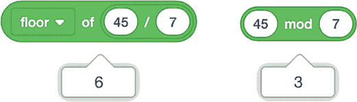

*图 2-1：计算 45/7 的商和余数*

在这里，`floor of 45 / 7`给我们一个商`6`，而`45 mod 7`给我们一个余数`3`。为了验证这是正确的，我们可以将结果代入我们的公式中：

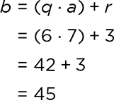

我们说两个数字*x*和*y*对模*n*是*同余*的，如果*x* mod *n* = *y* mod *n*。在这种情况下，当*x*和*y*分别除以*n*时，它们有相同的余数*r*。例如，7 和 19 对模 6 同余，因为 7 和 19 除以 6 都得到余数 1。*同余*的概念没有*等于*那么严格，等于的数字必须是同余的，但同余的数字不一定相等。我们使用三条横线符号（≡）表示同余，而不是等号（=），所以我们写作 7 ≡ 19 mod 6。

这里有一些将模运算与整除性联系起来的事实：

 我们可以通过在 Scratch 中查看*b* mod *a*是否为 0 来测试*b*是否能被*a*整除。

 奇数对模 2 同余 1，偶数对模 2 同余 0。

 以 0 结尾的数字对模 10 同余。它们也能被 10 整除。

 以 0 或 5 结尾的数字对模 5 同余。它们也能被 5 整除。

 当我们用除法算法表示*b* = (*q* ⋅ *a*) + *r*时，所有可能的余数的集合是{0, 1, 2, . . . , *a* – 1}，这是一个包含*a*个元素的集合。有时，使用另一个包含*a*个元素的集合更有用，其中每个整数都与该集合中的一个元素同余。由于 Scratch 中的列表元素从 1 开始编号，集合{1, 2, 3, . . . , *a*}通常是一个不错的选择。

在下一个项目中，我们将探索一个简单的技巧，使用模运算帮助检查计算结果。

#### 项目 5：检查数学结果的小技巧

*除九求余*是一种验证大数加法或乘法答案的技巧。为了理解它是如何工作的，首先要注意到每一个 10 的幂数在除以 9 时的余数都是 1。例如：

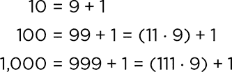

这指出了一个更广泛的规则：当你将一个数字*n*除以 9 时，你得到的余数和将*n*的各位数字之和除以 9 得到的余数是相同的。例如，347 除以 9。为了确定余数，首先我们将各位数字相加：3 + 4 + 7 = 14。此时，我们可以注意到 14 = (1 ⋅ 9) + 5，从而得到余数为 5。或者，我们可以再一次使用除九求余技巧，以更简单的方式得到结果：1 + 4 = 5。（事实上，347 除以 9 的结果是 38 余 5。）

除九求余是检查大加法或乘法计算是否正确的好方法，因为做模 9 的算术（通过数字之和）比追踪多位数的加法和乘法更容易。例如，假设你计算了 347 + 264 并得到了 601 的答案。我们已经看到 347 模 9 的结果是 5。对于 264，2 + 6 + 4 = 12，1 + 2 = 3，所以 264 模 9 的结果是 3。这意味着(347 + 264)模 9 应该是 5 + 3 = 8。但是，601 模 9 的结果是 6 + 0 + 1 = 7，显然哪里出了问题。看起来是原始加法时有人忘记进位了！当我们将和修正为 611 时，除九求余结果符合预期。

尽管将一个数字的各个数字相加是相对简单的心算，我们还是让 Scratch Cat 来为我们完成这项工作。图 2-2 中的程序使用除九求余技巧来计算任何数字的模 9。

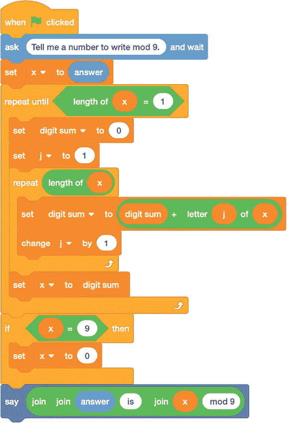

*图 2-2：一个通过计算数字之和来找出`x mod 9`的程序*

这个技巧是让 Scratch 把数字`x`视为一串数字。`length of`操作符报告数字的位数，`letter of`操作符允许我们逐个取出数字进行相加。代码嵌套在一个`repeat until`循环中，直到`x`的长度为`1`时才停止，这意味着数字只有一位。如果这个单一的数字在 0 到 8 的范围内，我们就得到了答案。不过，这个单一数字也可能是 9，这在模 9 运算中等同于 0。在这种情况下，最后的`if`语句选择 0 作为报告的答案，而不是 9。

##### 结果

图 2-3 显示了程序的一个示例运行，输入为 601。

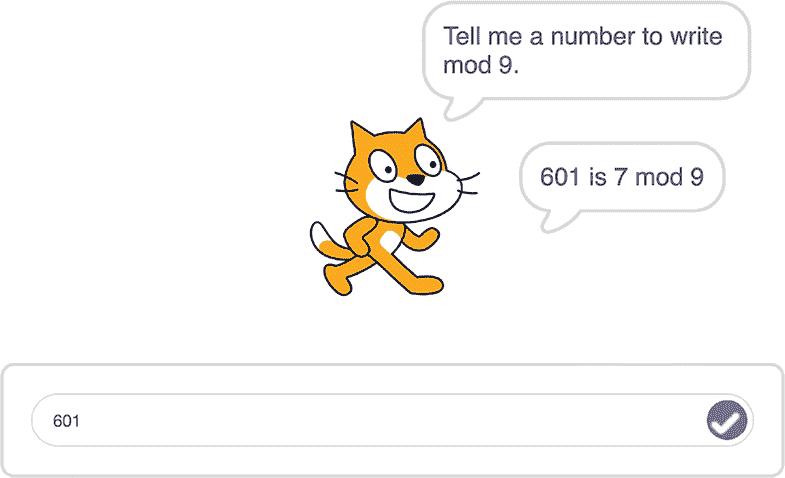

*图 2-3：计算 601 模 9*

程序的最后一行使用`join`操作使输出更加美观，提醒我们输入的数字以及除九求余过程的结果。

##### 破解代码

我们在这里遇到的问题与第一章中遇到的问题相同：Scratch 很乐意在非数字输入上运行代码。按照程序的写法，它甚至会对本应完全允许的输入（如负整数）出现问题。例如，数字 -3 被当作字符串解释时，长度为 2，而根据 Scratch 的规定，第一个字符即负号的数值为 0。因此，Scratch 报告说 -3 的各位数字之和是 0 + 3 = 3。但问题是，-3 除以 9 的余数是 6，而不是 3。

由于我们将遇到负整数和非整数输入的问题，因此在将代码发布供一般使用之前，我们应该通过筛选输入确保安全，只允许我们想要的输入：正整数。我们可以创建一个自定义块来筛选输入，如图 2-4 所示。

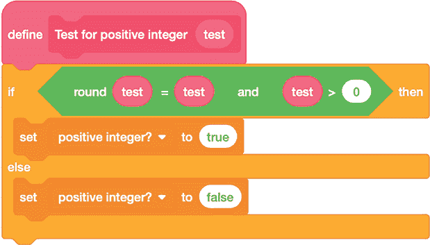

*图 2-4：确保输入是正整数*

布尔语句 `round test = test` 是一种技巧，它让我们一举多得。它筛选掉非数字输入（例如单词 *banana*），因为在 Scratch 中尝试对非数字进行四舍五入会得到 0 作为结果。它还会筛选掉带有非零小数部分的数字，这些数字四舍五入后将不再等于它们自己。结合 `text > 0`，我们的 `if` 语句会在输入 `test` 是正整数时为真，否则为假。因此，如果满足这两个条件，我们可以将变量 `positive integer?` 的值设置为 `true`。

**注意**

*某些编程语言有特殊的布尔变量，只能取值为* true *或* false，*但 Scratch 并没有。在这里，我们简单地使用* true *和* false *这两个词。某些程序员更喜欢使用数字值 1 和 0 来表示真假值。*

一旦我们有了筛选块，就可以修改图 2-2 中的代码，使其仅对适当的值执行，如图 2-5 所示。将 `repeat until` 块后面的原始程序粘贴到 `if` 之后的空白位置。

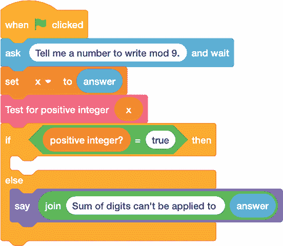

*图 2-5：别让 Scratch Cat 犯错误！*

当然，你实际上不必经过去除九的过程来进行此计算。你可以直接使用 Scratch 的 `mod` 块！不过，编写程序对你来说是解决问题的好练习，能够帮助你逐位分析数字。该程序同样可以推广到其他情况，比如挑战 2.2 中的情况。

 编程挑战

**2.2** 去九法可以测试一个数字是否能被 9 整除，因为如果数字的各位数字之和为 0 或 9，那么该数字就能被 9 整除。测试一个数字是否能被 11 整除的方式类似，不同之处在于，计算时不是将所有数字相加，而是交替地加和减。例如，1,342 可以被 11 整除，因为 1 – 3 + 4 – 2 = 0。编写 Scratch 程序计算给定数字的加减位数之和，看看它是否能被 11 整除。

**2.3** Scratch 有一个运算符，允许你从指定范围内随机选择一个数字。编写一个程序，选择 1 到 100 之间的 10 个随机数字。预测其中有多少个能被 9 整除，然后使用 Scratch 检查你的预测是否正确。

**2.4** 有时，当你需要在计算机表单中输入一个数字（例如信用卡号码或书籍的 ISBN 代码）时，数字中会包含一个 *校验位* 来确保你没有输入错误。一种实现方式是，在数字的末尾加上一个额外的数字，这个数字是从原始数字派生出来的。例如，额外的数字可以是原始数字 mod 9，通过像 图 2-2 中的程序那样使用去九法计算得出。扩展此程序，给出包含校验位的原始数字。

**2.5** 在复制数字时，我们有时会犯 *位数交换* 错误，即交换两个数字的位置。例如，我们可能将 1,467 错写为 1,647。你能否使用“去九法”来帮助发现这种错误？

### 质数

一些整数有很多除数，而一些只有少数几个。整数 1 是一个特殊的情况，它只能被自身整除。对于任何其他数字，最少的除数数量是两个：1 和该数字本身。正如本章开始所提到的，只有两个除数的数字被称为质数。除数超过两个的数字被称为 *合成数*。

前几个质数是 2、3、5、7、11、13 和 17。为了找到更多的质数，我们将使用 Scratch。

#### 项目 6：它是质数吗？

确定一个数字是否为质数的一种方法是逐一尝试可能的因子，这个过程叫做 *试除法*。如果 1 和该数字之间没有其他除数，那么该数字就是质数。例如，对于数字 5，我们会先尝试将 5 除以 2，再除以 3，再除以 4。没有任何一个数字能整除 5，所以 5 是质数。

手动进行试除法很快就会变得乏味，因此我们将编写一个程序，让 Scratch 为我们完成这项工作。图 2-6 显示了一个简单版本的代码，它并未考虑可能导致错误答案的不当输入（例如，字符串或不是正整数的数字）。

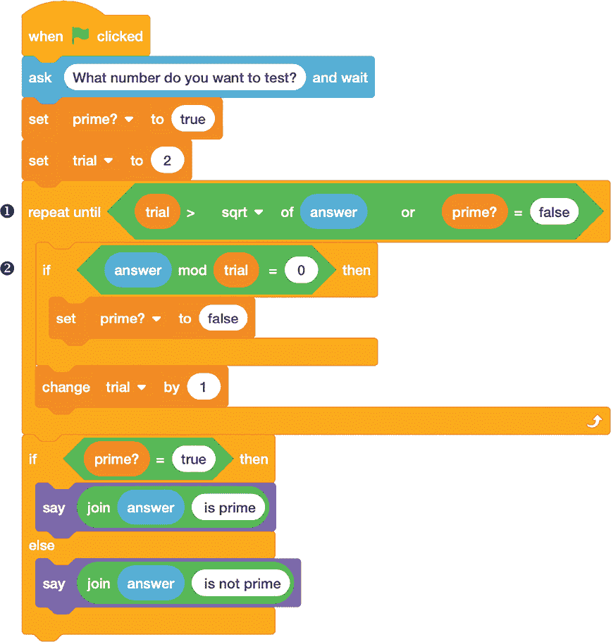

*图 2-6：通过试除法检查质数*

代码提示输入一个待测试的数字，并通过与布尔变量 `prime?` 配合使用来决定该数字是否为素数。我们在 `repeat until` 循环 ❶ 中执行试除法，通过计算 `answer mod trial` ➋，其中变量 `trial` 是试除数。如果结果为 `0`，我们知道已经找到一个除数，且 `answer` 不是素数，因此退出循环。否则，我们将 `1` 加到 `trial` 中并重新尝试。最后，我们根据 `prime?` 的值是 `true` 还是 `false` 来报告结果。

##### 结果

图 2-7 显示了试除法程序的示例运行。

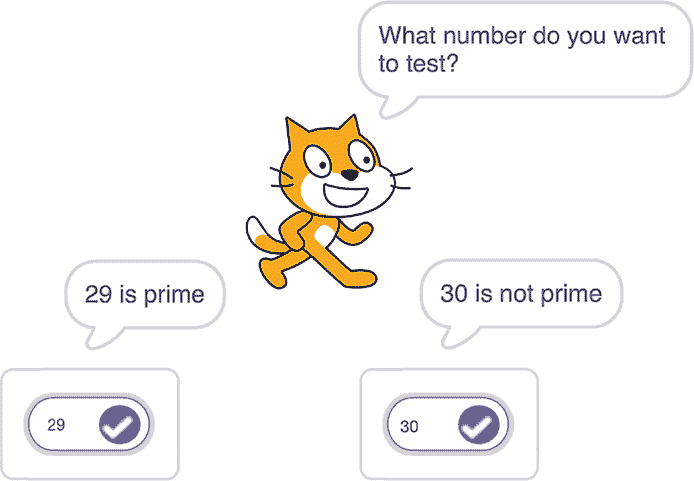

*图 2-7：试除法程序的示例运行*

该程序正确识别了 29 是素数，30 不是素数。

##### 破解代码

我们应该筛选输入，以便 Scratch 仅考虑正整数。像我们为“去九程序”创建的自定义块（见图 2-4）可以使用，并将其放入一个`if`语句中（如图 2-5 所示）。不过，筛选代码中还有一些额外的条件。首先，整数 1 既不是素数也不是合成数，但 1 会在我们的试除法程序中的`repeat until`循环中存活并被标记为素数。图 2-8 中的自定义块包括一个初步的`if`测试，禁止输入 1。

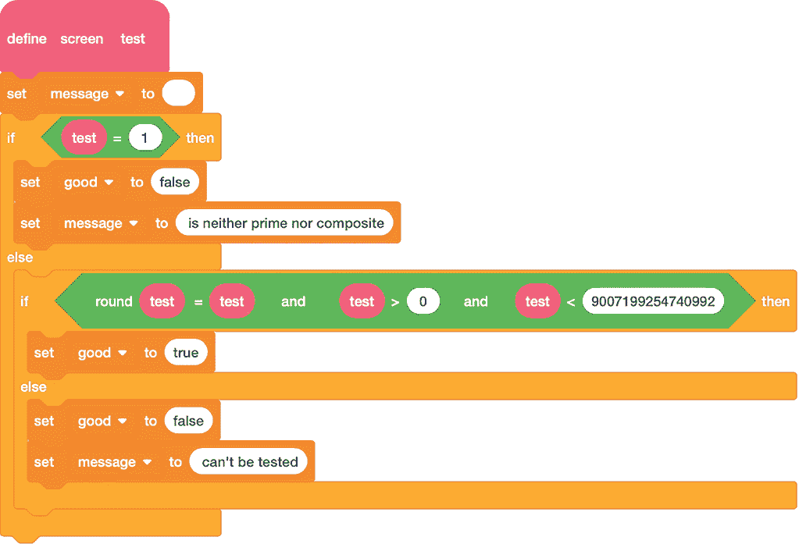

*图 2-8：限制试除法程序的输入*

一个更微妙的问题是，正如我们在第一章中看到的，整数运算仅在 flintmax 以内是精确的。这意味着可除性测试仅对最大为 9,007,199,254,740,992 的数字有效。之后，Scratch Cat 会认为所有数字都是合成数！图 2-8 中的检查代码也考虑到了这一点，通过验证`test`是否小于 flintmax。该代码块还返回一个`message`变量，当输入无法可靠测试时，程序会报告更多信息。

这个程序的另一个考虑因素是，处理大数字的试除法可能需要很多步骤——如此之多，以至于即使在快速计算机上，你也可能需要等待很长时间才能得到答案。图 2-6 中`repeat until`循环的测试 ➊ 是一种加速过程的技巧：我们实际上只需要考虑试除数，直到输入数字的平方根。这是因为如果一个数字 *n* 不是素数，它必须具有一个因式分解 *n* = *a* ⋅ *b*，而不是简单的因式分解 1 ⋅ *n*。由于 *n* = 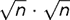，所以 *a* 或 *b* 中的一个必须至少与  一样大，另一个则必须小于或等于 。我们只需要进行试除法，直到  来找到较小的那个，若它存在的话。

这个技巧带来了巨大的节省！我们可以测试高达 1,000,000 的数字，最多只需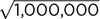 = 1,000 次试除。为了进一步加速代码，一旦检查完 2 的可整除性，我们就只需要测试奇数的可整除性。这是因为如果一个数字*n*能被任何偶数整除，它也一定能被 2 整除。

所有这些改进都能缩短运行时间，但也使程序变得更长、更复杂。是否值得做这些权衡取决于谁会使用你的作品，以及用途如何。使程序更易用的改进通常是值得的。而加速运行时间的改进需要显著才能被注意到，但如果用户需要快速的结果，这些改进可能是值得的。

#### 项目 7：埃拉托斯特尼筛法

试除法不是唯一的质数查找方法。在这个项目中，我们将探索另一种技术：查看所有数字列表，直到某个限制，并丢弃那些合数。这种方法筛选出质数，称为*埃拉托斯特尼筛法*，以首次使用该方法的古希腊数学家命名。Scratch Cat 在图 2-9 中使用了筛法，其中 1 到 120 的数字已被排列成网格。

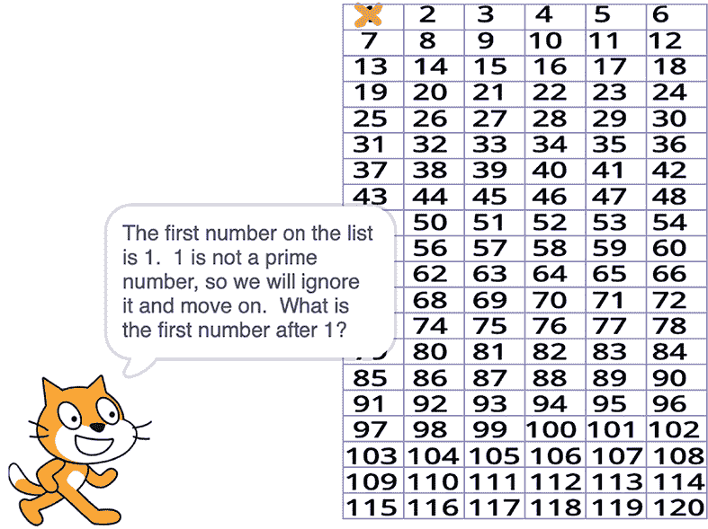

*图 2-9：通过丢弃非质数来筛选质数*

首先，我们用红色划掉 1，因为它既不是质数也不是合数。接着，我们用绿色划掉所有 2 的倍数，如图 2-10 左侧所示，看看剩下的是什么。然后，我们继续识别 2 之后的下几个质数（3、5、7），并划掉它们的倍数，如图 2-10 右侧所示。

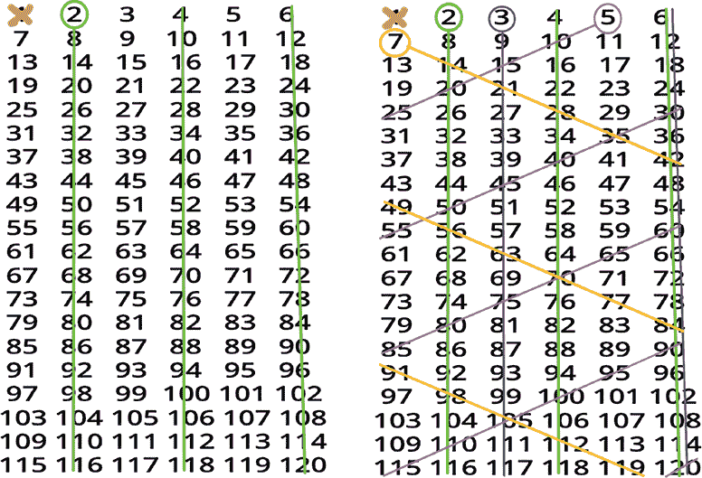

*图 2-10：去除 2 之后的所有偶数（左）和所有 3、5、7 的倍数（右）*

注意，2 和 3 的倍数在网格的列中被竖线划掉。这是因为网格被设置为宽度为 6，而 6 能被 2 和 3 同时整除。5 的倍数被粉色划掉，沿对角线向后移动。这是因为要从一个 5 的倍数跳到下一个，我们需要加 5，也就是 6 – 1。因此，要找到下一个 5 的倍数，我们沿着 6 的行向下移动一行，再沿着-1 的列回退一列。同样，要找到 7 的倍数（黄色划掉），我们沿着行向下移动一行，再向右移动一列（因为 7 = 6 + 1），这样我们就得到了沿着另一条对角线的线条。

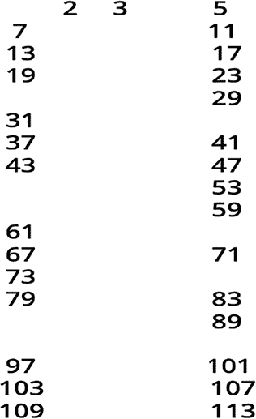

*图 2-11：筛选后到 120 为止的所有质数*

这是筛法的回报：如果一个数字*n*是合数，并且有因式分解 *n* = *a* ⋅ *b*，其中 1 < *a* ≤ *b* < *n*，那么 *a* ≤ 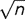。在我们的例子中，*n* = 120，因此网格中的任何合数必须有一个小于 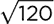 的素因数，大约是 10.95。一旦我们筛到 7，接下来没有被筛去的数字是 11，它大于 ，因此筛法就不需要继续了。剩下的每个数字，即未被筛去为 2、3、5 或 7 的倍数的数字，必须是素数（见图 2-11）。

这是平方根技巧第二次发挥作用。首先，它使得图 2-6 中的试除法程序运行更快。现在，它告诉我们何时停止筛法，使我们（在此例中）通过筛到 7 就能找到所有小于 120 的素数。

我们可以使用相同的技术将筛法扩展到更高的范围。我们只需在发现每个素数时，去除它的所有倍数，直到平方根为止。这就是我们在图 2-12 的 Scratch 程序中所做的。

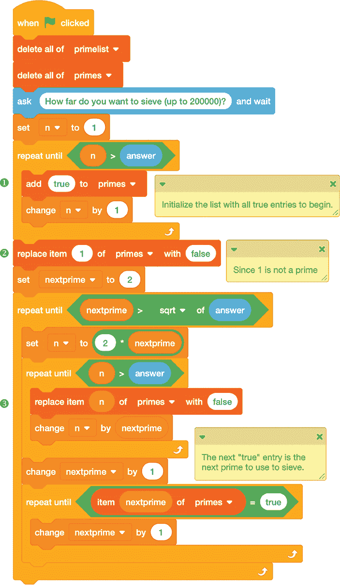

*图 2-12：筛法程序*

我们首先询问筛到多远，然后将`primes`列表初始化为相应的大小❶。（由于我们使用的是列表，我们的上限受 Scratch 支持的最大列表大小限制，最大为 200,000。）Scratch 的列表索引从 1 开始，因此列表中索引为*n*的条目将用于跟踪*n*是否是素数。初始时，我们将每个条目设置为`true`，但我们会在筛法过程中将非素数条目改为`false`。

首先，我们处理特殊情况 1，1 既不是素数也不是合数➋。然后，我们寻找下一个未被筛去的数字。我们将该数字保持为`true`，但将它的所有倍数设置为`false` ➌。我们重复这个过程，直到下一个未被筛去的数字大于限制的平方根。

一旦我们有了完整的列表，就可以访问它并回答关于我们找到的素数的问题。图 2-13 中有一段小代码，用来计算筛法限制以内有多少个素数。

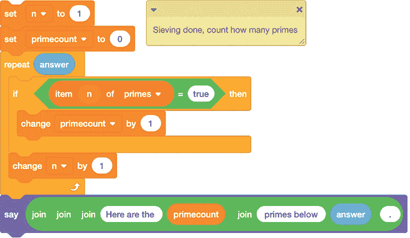

*图 2-13：使用筛法计数素数*

在这里，我们逐步检查我们构建的列表，并计算其中有多少个`true`条目，每次增加变量`primecount`的值。图 2-14 展示了另一段额外的代码，用于列出我们找到的素数。

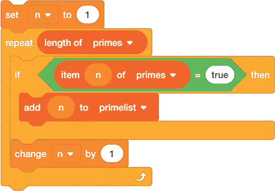

*图 2-14：使用筛法列出素数*

这个代码块会找到列表中的`true`项，并将它们对应的索引号存储到一个单独的列表中。

##### 破解代码

有时，将 Scratch 生成的数据保存为单独的文件是很有用的，这样你就可以将其导入到文本编辑器或电子表格中。幸运的是，Scratch 允许我们通过右键点击图形窗口中的列表来导入和导出列表（见 图 2-15）。通过这种方式，你可以将筛选出的素数列表从 Scratch 中取出，进一步处理。

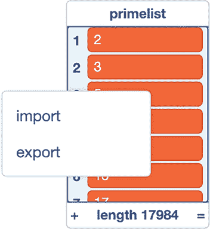

*图 2-15：保存列表以便稍后使用*

文本编辑器、文字处理软件和电子表格程序都能很方便地处理 Scratch 输出的文本数据。试着将数据导入 Excel、Numbers 或 Open Office 等电子表格程序。如果你希望每行包含多个条目，确保 Scratch 在文本文件中插入逗号分隔条目（使用 `join` 块），然后使用 *CSV* 格式（即 *逗号分隔值* 格式）导入数据。Scratch 生成的文件中的默认换行符将把条目列在电子表格的不同行中。

 编程挑战

**2.6** 使用筛选程序找出 1 到 10、100、1,000、10,000 和 100,000 之间有多少个素数。记录素数数量与列表大小之间的比例，并以表格形式展示结果。当上限增大时，素数的相对数量是如何变化的？

**2.7** 编写一个块来扫描筛选程序生成的整数列表，寻找长的连续合数序列。你能找到最长的序列吗？

**2.8** *双生素数*是相差恰好为 2 的一对素数；例如，3 和 5 或 11 和 13。编写一个块来扫描筛选程序的输出，并计算在筛选限制范围内有多少对双生素数。

**2.9** 重写 图 2-12 中的筛选程序，使其将结果以六列的表格显示，像 图 2-9 中的表格一样。使用同余语言解释为什么表格第一行之后出现的唯一素数仅位于第 1 列和第 5 列。

### 公约数与最大公约数的关系

给定两个整数 *a* 和 *b*，*公约数集合*指的是所有能整除 *a* 和 *b* 的整数。总是至少有一个公约数，那就是数字 1，因为 1 是所有整数的因子。但也可能存在更大的公约数。特别关注的是 *最大公约数（GCD）*，它是能够整除 *a* 和 *b* 的最大数。如果这个最大公约数是 *d*，我们写作 GCD(*a*, *b*) = *d*。

与识别素数一样，求两个数的最大公约数（GCD）有多种方法，它们的效率各不相同。在接下来的两个项目中，我们将探讨两种这种方法。

#### 项目 8：慢速求最大公约数

这是找到两个整数 *a* 和 *b* 最大公约数的一种方法。从 1 开始，尝试用每个数字分别除以 *a* 和 *b*。如果它能同时整除这两个数，你就找到了一个公约数。一旦你到达 *a* 或 *b*，取先到的为止。你找到的最大的公约数就是最大公约数。图 Figure 2-16 中的程序使用了这种方法。

我们使用一个自定义块来识别两个输入值 `a` 和 `b` 中的最小值。然后我们从 `1` 开始向上计数，检查 `a` 和 `b` 的 `mod` 是否为 0。如果是，我们将当前的除数存储在变量 `gcd` 中，程序运行结束时，这个变量保存了答案。

这种测试每个数字作为可能的公约数的方法被称为 *暴力破解* 方法。就像通过测试每一种可能的字母和数字组合来猜测某人的计算机密码一样。对于我们的 GCD 程序，暴力破解对于较小的 `a` 和 `b` 值（例如最大到 100 万）足够快，但对于更大的数字来说，它明显变得更慢。当筛选的数字接近最大值时，等待时间特别烦人。幸运的是，有更好的方法。

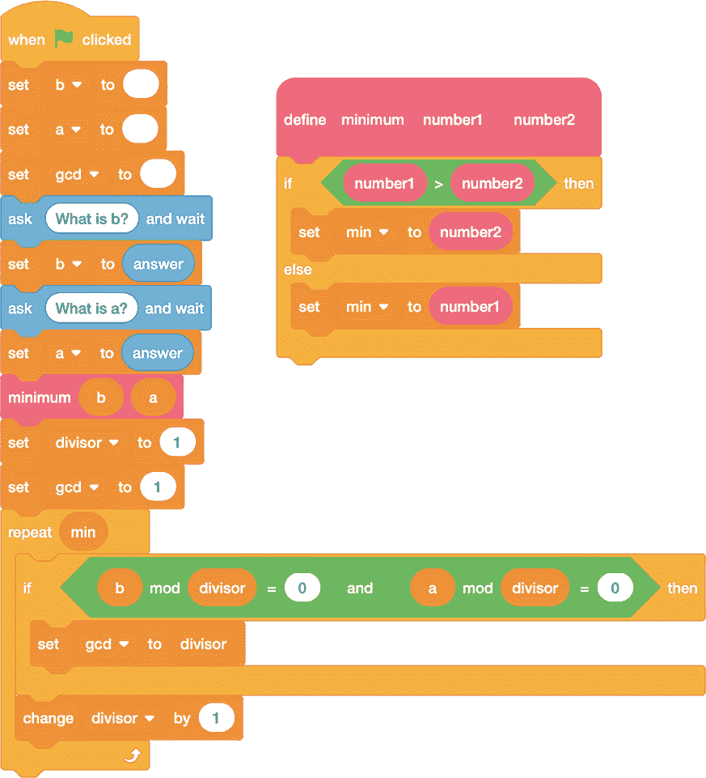

*图 2-16：使用慢方法查找 GCD*

#### 项目 9：快速求最大公约数

古希腊数学家欧几里得在其公元前 300 年左右写成的教材《几何原本》中描述了一种更高效的计算两个数最大公约数的方法。《几何原本》涵盖了多个数学领域的主题，重点是几何学和数论。该书影响深远，欧几里得的材料组织方式在几个世纪内用于教学，直到今天仍然被沿用。

欧几里得计算最大公约数的方法基于这样一个观察：对于两个正整数 *a* 和 *b*，其中 *a* < *b*，任何 *a* 和 *b* 的公约数也是 *b* - *a* 的约数。例如，假设 *a* = 330 且 *b* = 876。330 和 876 的公约数是 6，6 同时也是 876 - 330 = 546 的约数。

通过扩展，如果我们用较大的数 *b* 除以较小的数 *a*，并通过商和余数跟踪除法，即 *b* = *q* ⋅ *a* + *r*，那么 *b* 和 *a* 的任何公约数也是 *a* 和 *r* 的公约数。然后我们可以用 *a* 和 *r* 重复这个过程，直到最后的余数为 0。在这个时候，倒数第二个余数就是 *a* 和 *b* 的最大公约数。除法序列如下所示：

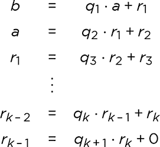

余数逐渐减少，因此 *a* > *r*[1] > *r*[2] > . . . > *r*[*k*]，其中 *r*[*k*] = GCD(*b*, *a*) 且 *r*[*k* + 1] = 0。

下面是计算 6 是 *b* = 876 和 *a* = 330 的最大公约数的步骤，分别使用除法算法和模算术进行解释。注意，随着我们从一行到下一行，数值的顺序是如何从右到左变化的：

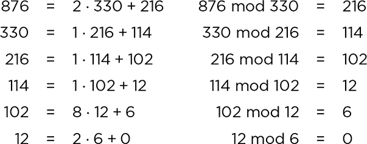

图 2-17 中的 Scratch 程序实现了欧几里得算法。

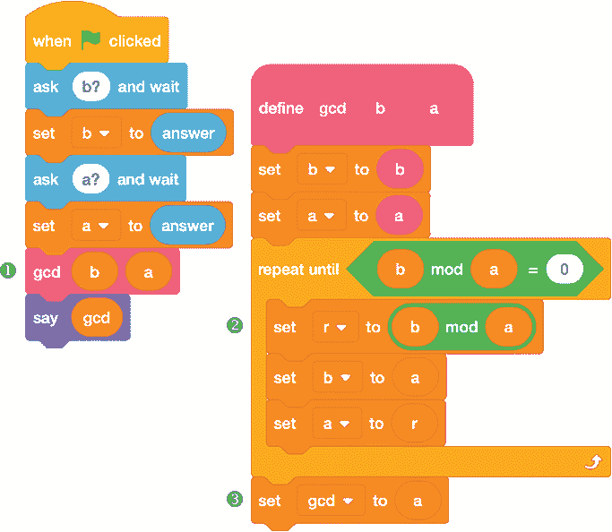

*图 2-17：使用欧几里得算法求最大公约数*

程序的组织方式是将所有重复除法的工作放在自定义的 `gcd` 块 ❶ 中。与我们的蛮力 GCD 程序（图 2-16）相比，这个块的定义异常简短。在一个 `repeat until` 循环中，我们不断进行 `b mod a` ➋ 运算，并将 `a` 和 `r` 的值交换回 `b` 和 `a`，直到最终得到余数为 0\。这时，循环停止，最后的 `a` 值可以作为 GCD 报告 ➌。

##### 结果

图 2-18 展示了一个示例，运行 GCD 程序，输入为两个非常大的数字。

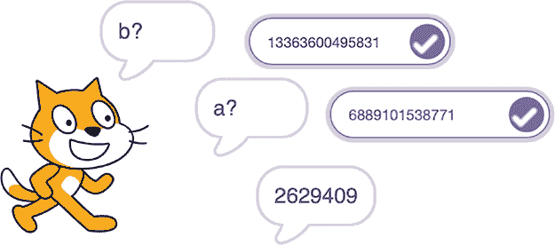

*图 2-18：使用欧几里得算法的计算*

与我们的蛮力方法不同，代码运行非常迅速，即使对于接近 flintmax 的数字也是如此。

##### 破解代码

到目前为止，我们谈论算法效率的语言还比较笼统。我们说一个程序运行得快或慢，但最好知道在你的计算机上实际的速度有多快或多慢。看到程序性能随着数字从十位或百位到千位或百万位的变化也会很有用。

Scratch 内置了一个计时器，可以从程序开始执行的那一刻起，按秒计量经过的时间。通过块菜单中的 `timer` 块可以访问该计时器。我们可以将任何程序包装在几行代码中，来计算算法运行的时间，如 图 2-19 所示。

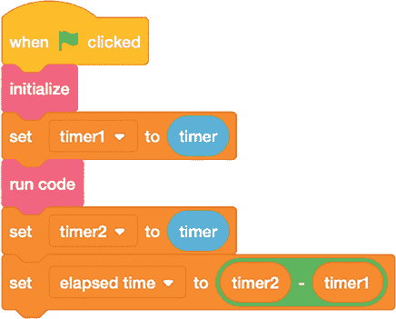

*图 2-19：计时程序运行速度*

在这里，`initialize` 块包含任何你不希望计时的设置代码，比如提示用户输入，而 `run code` 块则包含你想要计时的算法代码。我们在执行 `run code` 之前和之后记录 `timer` 的值，然后取两者之间的差值来查看执行花费了多少时间。

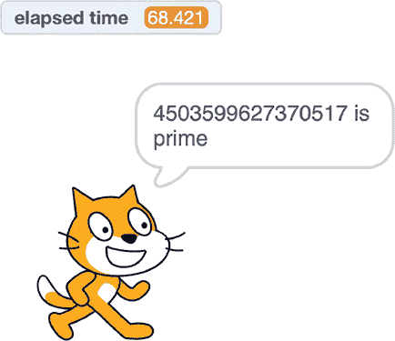

*图 2-20：测试一个大素数*

图 2-20 展示了将 图 2-6 中的试除法素数测试程序包装在计时器代码中的结果，包括程序结束时 `elapsed time` 的值。对于一个接近 flintmax 的素数，程序运行结果大约需要一分钟。

对于许多具有小测试值的程序，经过的时间将显示为 `0`，因为算法运行只需要一小部分时间。报告的时间也可能在不同的运行之间有所不同，因为计算机在后台执行其他任务，这限制了 Scratch 可用的资源。为了获得准确的时间，连续多次运行程序并记录累积的运行时间，然后将其除以运行次数，得到每次运行的平均时间。

 编程挑战

**2.10** 使用计时循环来比较两个最大公约数计算程序的运行时间（图 2-16 中的暴力版本和图 2-17 中的欧几里得版本）。

**2.11** 编写一个计数器来计算欧几里得算法需要多少步。进行实验，看看哪些数字会使算法需要最多的步骤来运行。

### 结论

涉及可除性的计算在计算机帮助下要容易和快速得多。如果我必须通过手工试除来判断一个数字是否为素数，我可能在几次计算后就会放弃。即使我在计算器上输入可能的除数，我也会很快感到厌烦，并可能开始犯错（“试错法”大多是错误！）。但 Scratch 猫愿意在我需要时提供帮助。Scratch 是一个望远镜，它让我们能够比自己做得到的更深入地观察数字的世界。我们所需要做的就是提出请求。
