## **3**

## **通过素因数分解拆分数字**

素数就像正整数世界中的化学元素。它们是基本的构建块，可以用来生成其他正整数。

化学科学教会我们，少数物质——元素，构成了世界上的一切。元素的原子结合形成其他物质，叫做化合物，但元素的原子无法分开，否则会失去其物理属性。类似地，我们可以通过乘法将素数结合起来，生成任何我们想要的合成数，而素数无法再被进一步分解，因为素数的唯一因子就是它本身和 1。

在本章中，我们将探讨*素因数分解*，即识别可以相乘得到给定合成数的素数的过程。我们将考虑如何将一个数字写成素数的乘积，并研究从数字的素因子中可以学到的一些有趣的事情。

### 算术基本定理

素数的一个重要事实——重要到被称为*算术基本定理*——是每个合成数都有自己独特的素因子集合。从这个意义上讲，乘法和加法是完全不同的。如果你想通过加法得到 16，方法有很多：2 + 14、5 + 11、3 + 13、5 + 4 + 6 + 1，等等。但如果你想将 16 写成素数的乘积，唯一的方法是 2 ⋅ 2 ⋅ 2 ⋅ 2。同样，唯一通过素数相乘得到 20 的方法是 2 ⋅ 2 ⋅ 5，唯一得到 54,252 的方法是 2 ⋅ 2 ⋅ 3 ⋅ 3 ⋅ 11 ⋅ 137。

这些都是素因数分解的例子：我们已识别出一组独特的素数，可以将它们相乘得到某个合成数。一旦你知道了一个数字的素因子，你就可以了解该数字的因子，以及它如何通过共同的因子或倍数与其他数字相关联。但我们首先如何计算一个数字的素因子呢？

#### 项目 10：它是素因子吗？

在第六章项目中，我们通过从 2 开始逐个整除的方式来判断一个数字是否为素数。我们也可以使用类似的试除法来找出一个数的素因子。我们需要做的就是在除法过程中跟踪已揭示的素因子。图 3-1 展示了这一过程。

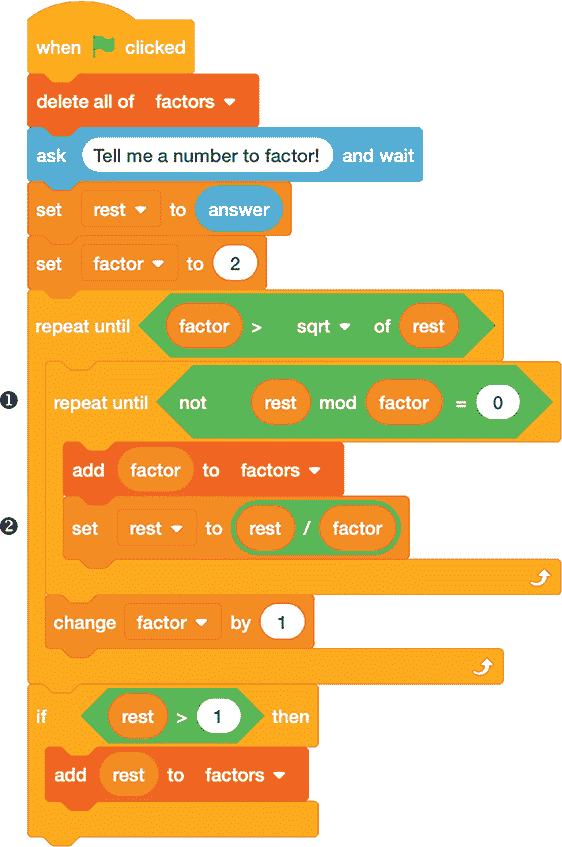

*图 3-1：将一个数分解为素数因子*

该程序通过首先找到较小的质因子来工作。我们使用两个变量：`rest`，它初始值为待因式分解的数字，以及 `factor`，它初始值为 `2`。如果 `rest mod factor` 等于 `0`，则说明我们找到一个质因子，于是我们将其存储在名为 `factors` 的列表中。然后，我们通过将 `rest` 除以 `factor` 并将结果重新存储到 `rest` 中来去除该因子 ➋。接着，循环使用新的 `rest` 值重新开始。当 `rest mod factor` 不等于 `0` 时，我们将 `factor` 增加 `1`。就像我们在项目 6 中测试质数时一样，当 `rest` 达到其平方根时，我们可以停止寻找因子 ➊，因为此时 `rest` 要么是质数，要么是 `1`。

##### 结果

`factors` 列表会显示在屏幕上，因此当程序完成时，所有的质因子都会被显示出来（如果列表过长，可能会有滚动）。图 3-2 展示了该程序的一个示例运行。

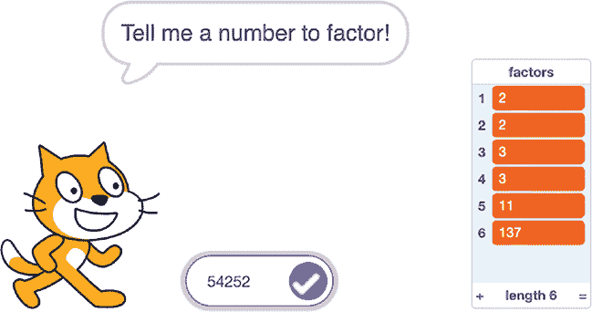

*图 3-2：找到 54,252 的质因子*

我们成功地识别了 54,252 的质因式分解为 2 ⋅ 2 ⋅ 3 ⋅ 3 ⋅ 11 ⋅ 137。Scratch 会自动为列表中的元素编号，因此我们可以一眼看出 54,252 有六个质因子。知道一个数有多少个质因子在以后会派上用场。

##### 破解代码

请注意，质数在一个数的质因式分解中可以重复出现。我们可以修改图 3-1 中的代码，通过指数来表示这些重复的因子，因为指数表示重复的乘法。例如，我们可以使用指数将 54,252 的质因式分解表示为以下形式，而不是列出 {2, 2, 3, 3, 11, 137}：

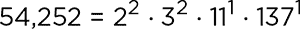

图 3-3 展示了一种做法。

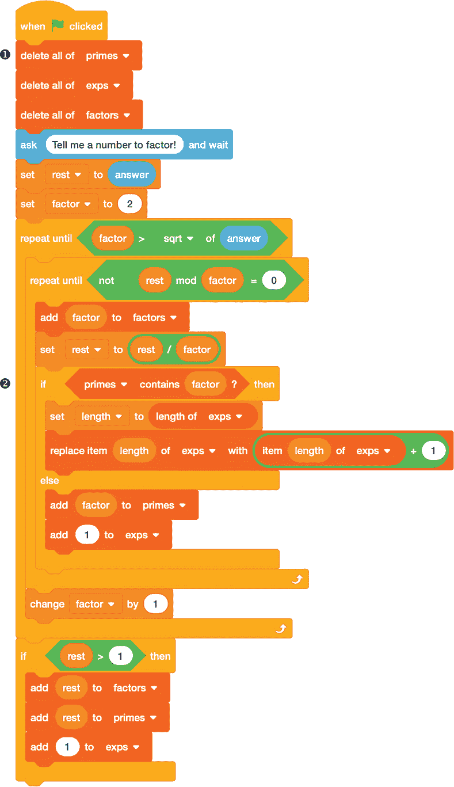

*图 3-3：带有指数的因式分解*

这个版本的程序增加了两个列表：`primes` 用于跟踪质因式分解中的每个*唯一*质数，`exps` 用于跟踪每个唯一质因子的出现次数（即指数）。程序开始时会清除列表中的所有旧值 ❶。然后，每当找到一个质因子时，我们会检查该因子是否已经出现过 ➋。如果出现过，我们就不把它添加到 `primes` 列表，而是将 `exps` 列表中最后一个指数加 `1`。如果该因子之前没有出现过，我们就将其添加到 `primes` 中，并在 `exps` 的末尾添加 `1` 来表示该因子的指数。

唯一质因子和指数的列表会与所有质因子的原始列表一起显示在屏幕上，后者包括重复因子。图 3-4 展示了一个包含多个不同质因子的示例。

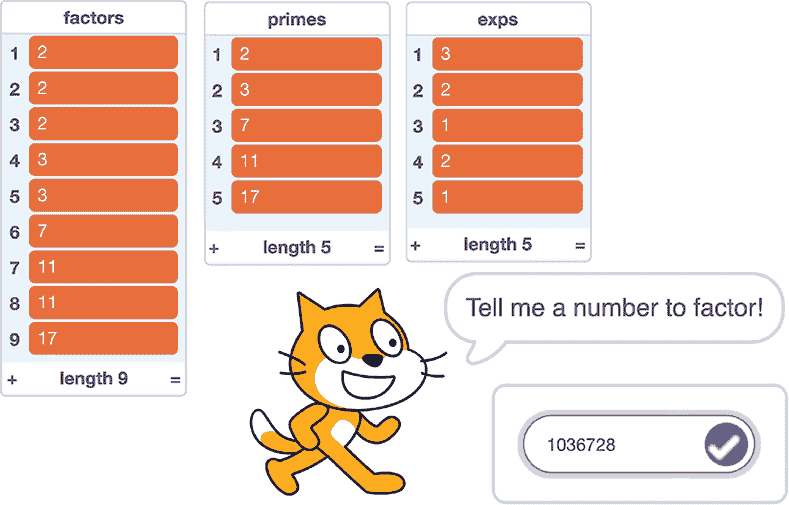

*图 3-4：带有指数的因式分解输出*

观察`primes`和`exps`列表的内容，我们可以将 1,036,728 的素因数分解解释为 2³ ⋅ 3² ⋅ 7¹ ⋅ 11² ⋅ 17¹。我们将在本章后面的其他项目中使用这个修改后的程序，届时我们将利用独特的素因数和它们的指数进行各种计算。对于其他程序，当我们不想看到这些列表时，我们可以简单地将它们从 Scratch 舞台上隐藏。

### 除数的乐趣

到目前为止，我们讨论的是素因数，但我们也可以将它们看作素数*除数*——即能整除一个数的素数。当我们将一个数的素因数分解格式化为独特的素数及其相关指数的列表时，如在图 3-3 中所示，这个独特素数的列表实际上就是该数的素数除数列表。一旦我们知道一个数的*素数*除数，我们就可以构建该数的*所有*除数列表，而不仅仅是素数除数。

这个技巧是通过根据素数的指数以不同组合的方式将素数除数相乘来构建每一个除数。例如，54 的素因数分解是 2¹ ⋅ 3³。这告诉我们，54 的任何除数必须由零或一个因子的 2（2⁰或 2¹）和零到三个因子的 3（3⁰、3¹、3²或 3³）构成。两个选择的 2 的因子与四个选择的 3 的因子结合，总共有八种方式构造 54 的除数：

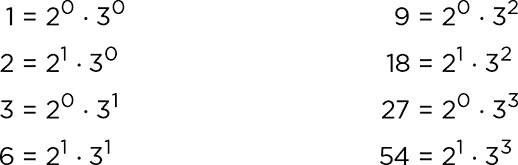

从这个例子来看，我们可以开始提出一些规则来计算一个数字有多少个除数。希腊字母τ（*τ*）通常用来表示除数的总数，因此*τ*(*n*)表示正整数*n*的除数个数。首先，以下是一些特殊情况：

 素数有恰好两个除数，因此如果*p*是素数，则*τ*(*p*) = 2。

 1 的唯一除数是 1，因此*τ*(1) = 1。

 如果*p*是素数，那么*p*的正整数次幂*p*^(*n*)的除数是 1、*p*、*p*²、……、*p*^(*n*)。这意味着*τ*(*p*^(*n*)) = *n* + 1。注意，这对于前面两个特殊情况也适用。对于素数本身，*p* = *p*¹，因此*τ*(*p*¹) = 1 + 1，给我们两个除数。我们也可以认为*τ*(1) = 1 等同于*τ*(*p*⁰) = 0 + 1 = 1。

 如果*n*是两个不同素数*p*和*q*的积，那么*n*的除数是 1、*p*、*q*和*p* ⋅ *q*，所以*τ*(*n*) = 4。一个由两个素数相乘得到的数叫做*biprime*（双素数）。

更广泛地说，我们如何确定任何合成数*n*的 *τ*(*n*) 呢？首先，我们可以通过运行图 3-3 中的因式分解程序来找到 *n* 的质因数分解。这将给我们两个列表：一个是能整除 *n* 的质数列表，另一个是对应的指数列表。对于每个质数，指数告诉我们能整除 *n* 的该质数的最大可能次方，因此我们可以使用该质数的任意重复次数（从 0 到指数）来构造 *n* 的因子。由于我们是从 0 开始计数的，所有可能的组合总数是指数加 1。因此，为了得到 *τ*(*n*)，我们所要做的就是将每个质数的指数加 1，然后将结果相乘。这等同于从每个质因子的所有可能组合和每个指数的所有可能组合中构造因子。

回到我们 54 的例子，已知其质因数分解为 2¹ ⋅ 3³，因此 *τ*(54) = (1 + 1) ⋅ (3 + 1) = 共有 8 个因子。Scratch Cat 在图 3-5 中同意这一结论。

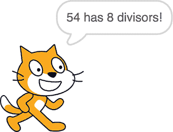

*图 3-5：计算 τ(54)*

但 Scratch Cat 是如何得出这个结论的呢？让我们来看看。

#### 项目 11：Tau 多个因子？

我们可以通过在质因数分解程序的末尾添加一些代码来计算 *τ*(*n*)，即 *n* 的总因子数量，这些代码使用了图 3-3 中的指数。图 3-6 展示了这段额外的代码。

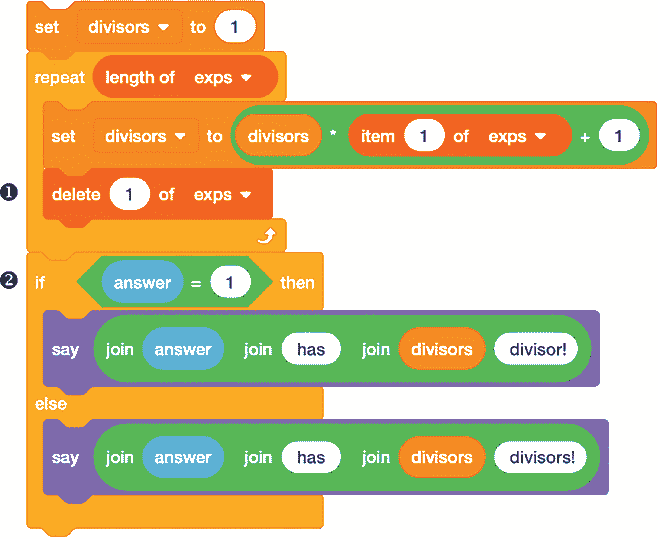

*图 3-6：使用 *n* 的质因数的指数来计算 *n* 的所有因子总数*

在我们使用图 3-3 中的代码创建指数列表之后，这段额外的代码会从 `exps` 列表的开头开始，逐步处理这个列表，并将所有因子的总数累计到 `divisors` 变量中。对于每个指数，我们加 1，然后将结果乘以当前 `divisors` 的值。每处理一个指数，我们就从列表中删除它 ➊，这样我们始终可以取出列表中的第一个元素。`if...else` 语句 ➋ 只是为了让 Scratch Cat 的语法正确，因此，如果用户询问数字 1 的因子数量（1 是唯一只有一个因子的正整数），答案是单数。

#### 项目 12：总和到 Sigma

如果我们想要找到一个数字的所有因子之和呢？数字*n*的因子之和用希腊字母 sigma 表示，记作 *σ*(*n*)。我们可以使用与计算因子数量相同的策略，在这个过程中我们一次只跟踪一个质因子及其相关的指数。这是*组合数学*的一个例子，组合数学是数学的一个分支，有时被称为*计数的艺术*，它通过分析更简单的情况来计算某事发生的次数。我们将在第七章中更详细地探讨组合推理，但目前来看，它是理解因子算术的一个有用工具。

要计算*σ*(*n*)，首先考虑对于给定的质数*p*，该质数的*k*次方的唯一因子是从*p*⁰ = 1 到*p*^(*k*)本身的*p*的各次方。例如，3³ = 27 的因子有 1 (3⁰)、3 (3¹)、9 (3²)和 27 (3³)。因此，27 的因子之和为：

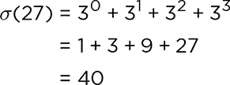

这是一个*几何数列*的例子，几何数列是指每个数字（除第一个外）通过将前一个数字乘以一个常数值（在此情况下为 3）来确定的序列。对于这种序列中数字的总和（或*几何级数*）有一个计算公式，*σ*(*p*^(*k*)）。在求 3⁰到 3³的所有幂的和时，公式为：

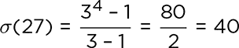

请注意，公式中涉及了 3⁴，这是比我们要求的指数高一级的更一般的情况。如果*p*是一个质因子，*k*是它的指数，那么从 0 到*k*的所有*p*的幂次之和的公式是：

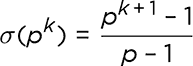

要找到*n*的所有因子之和，我们需要对每个质因子及其对应的指数应用这个公式，然后将所有结果相乘。这基本上与计算因子个数的方法相同：我们逐个质因子构建因子，考虑质因子和指数的所有组合。

由于我们在图 3-3 中的程序已经计算了一个数字的质因子和指数，我们可以再次向该程序添加代码来求出该数字的因子之和。但首先，因为公式涉及到计算幂，我们需要一种方法来轻松地进行指数运算。Scratch 没有内置的运算符来处理这个问题，所以我们必须通过定义一个自定义模块来实现，如图 3-7 所示。

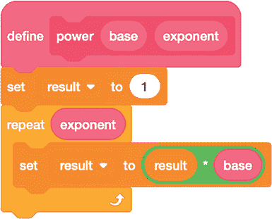

*图 3-7：计算正整数幂的模块*

这个模块接收两个值，`base`和`exponent`，并将`base`与自身相乘`exponent`次，将结果存储在`result`变量中。借助这个模块，我们现在可以将图 3-8 中显示的代码添加到我们之前创建的程序中，即图 3-3。

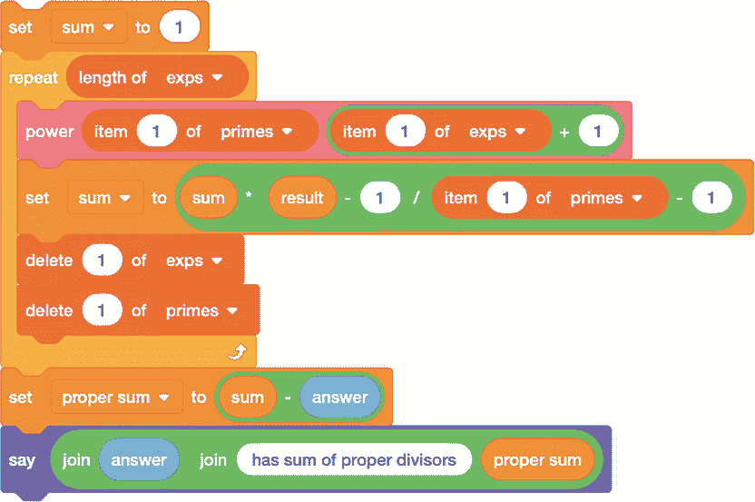

*图 3-8：使用*n*的质因子的指数来计算*n*的因子之和*

我们从`primes`和`exps`列表中提取每个质数*p*及其指数*k*，并使用我们自定义的`power`模块计算*p*^(*k* + 1)。然后，我们将结果代入前面给出的公式，通过`sum`变量跟踪总和。当我们遍历完两个列表后，在报告最终答案之前，我们会从`sum`中减去原始数字。这样，我们就得到了该数字的*真*因子之和，即排除数字本身的总和。

注意，在计算过程中，`primes` 和 `exps` 列表都会被清空。与我们计算因数数量的程序一样，总是从每个列表中获取第一个项并删除该项，然后使下一个列表元素成为新的第一个元素，而不是一直追踪每个列表中的项编号，这样做更为简单。

##### 破解代码

在编写代码时，始终测试代码是一个好主意，以确保它按预期工作。例如，我们可以通过勾选 `result` 变量旁边的框来测试我们自定义的 `power` 块，这样它的值就会出现在舞台上。然后，我们可以将该块拖入编程区域，输入参数值，点击块并查看 `result` 是否显示正确的值。图 3-9 通过计算 flintmax 来测试该块。正如我们在第一章中讨论的那样，这是 Scratch Cat 在按 1 计数时能得到的最大整数。

*图 3-9：使用* 幂 *块计算 2⁵³*

当我在 Scratch 中编程时，我通过在舞台上显示大量变量并将代码的各个部分隔离开来调试我的代码，以验证它是否按我预期的方式运行。一旦代码正常工作，我就通过隐藏不需要显示的变量来清理舞台。

 编程挑战

**3.1** 记住，6 是第一个完美数，之所以这样称呼是因为它等于其真因数之和：1 + 2 + 3 = 6。使用图 3-8 中的因数和代码，找到其他三个小于 10,000 的完美数。

**3.2** 一个数 *n* 可能有两种方式不是完美数：要么 *n* 的所有真因数之和小于 *n*，这种情况下 *n* 被称为 *不足*；要么 *n* 的所有真因数之和大于 *n*，这种情况下 *n* 被称为 *富余*。编写一些 Scratch 代码来报告给定的数字是不足数、完美数还是富余数。每种类型的数字有多少个（最多到 10、100、1,000）？

**3.3** 将一个非零数的 0 次方运算结果为 1。检查图 3-7 中的指数块，看看它是否对 0 次方有效。如果无效，请重写该块，使其给出正确的结果。

**3.4** 负指数的计算使用倒数：*n^(–k)* = 1/*n*^(*k*)。使指数块在处理负指数时给出正确的答案。

**3.5** 修改 *τ* 和 *σ* 的代码，这样在访问列表元素后，不再删除它们，而是使用一个新的计数器变量，比如 `i`，按顺序访问每个列表元素。

### 质因数分解如何帮助找到 GCD

在第二章中，我们探讨了计算两个整数 *b* 和 *a* 的最大公约数（GCD）的方法。如果我们知道每个整数的质因数分解，我们还有另一种选择。假设我们有以下两个质因数分解：

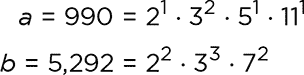

要找到*b*和*a*的最大公约数（GCD），第一步是重写它们的质因数分解，确保包括任何一个数字的每个质因数，必要时使用指数 0：

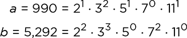

在这里，我们已经将 7⁰添加到*a*的质因数分解中，并将 5⁰和 11⁰添加到*b*的质因数分解中。接下来，对于每个质因数，我们比较*a*和*b*，并取最小指数。例如，3²和 3³的最小值是 3²。*b*和*a*的 GCD 是使用最小指数的质因数分解的乘积：

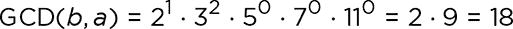

如果我们已经投入时间和精力去分解*b*和*a*的因式，那么这可能是一个有用的方法。但如果我们事先不知道因式分解结果，使用欧几里得算法来求最大公约数（GCD）会更高效，就像我们在项目 9 中所做的那样。

与最大公约数（GCD）相关的概念是*最小公倍数（LCM）*。*b*和*a*的 LCM 是一个既是*b*的倍数又是*a*的倍数的最小数字。例如，2 和 3 的 LCM 是 6。LCM 对于加法分数很有用，因为两个分母的 LCM 是你在进行加法之前应该转换的公分母。在这种情况下，最小公倍数通常被称为*最小公分母（LCD）*。如果你忘记了 LCD 中的 D 代表分母，而 GCD 中的 D 代表除数，这可能会让人有点困惑！

如果我们知道*b*和*a*的质因数分解，那么计算它们的 LCM 与计算 GCD 非常相似。唯一的区别是，我们取每个质因数的*最大*指数，而不是最小指数。继续以*b* = 5,292 和*a* = 990 为例，我们得到：

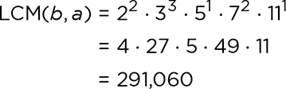

由于我们使用最小指数来求最大公约数（GCD），而使用最大指数来求最小公倍数（LCM），一个巧妙的技巧是，将两个数字*b*和*a*的 GCD 与 LCM 相乘，等于将这两个数字相乘：

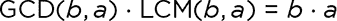

推广一下，如果我们已经计算出了 GCD(*b*, *a*)，我们可以通过以下公式计算 LCM(*b*, *a*)：

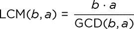

 编程挑战

**3.6** 编写一个自定义模块，使你能够通过试除法确定一个给定的数字是否为素数。

**3.7** 使用挑战 3.6 中的模块编写另一个自定义模块，告诉你给定数字之后的下一个素数。如果你想基于项目 10 中的程序（图 3-3）编写一个基于因式分解方法的 GCD 计算器，你需要确保两个数字的质因数列表都包含相同的素数，因此像这样的模块会很有用。

**3.8** 螺旋画板是一种经典的玩具，通过在带齿环内旋转带齿齿轮，可以画出复杂的曲线。下图展示了不同齿轮大小如何导致不同的形状。很多人已经使用 Scratch 制作了螺旋画板模拟器，你可能还可以找到其他在网页上运行的版本。写一个程序，让 Scratch 猫使用最大公约数（GCD）或最小公倍数（LCM）模块，预测当一个带有*b*个齿的齿轮在一个带有 96 个齿的环内旋转时，曲线会有多少个“点”。

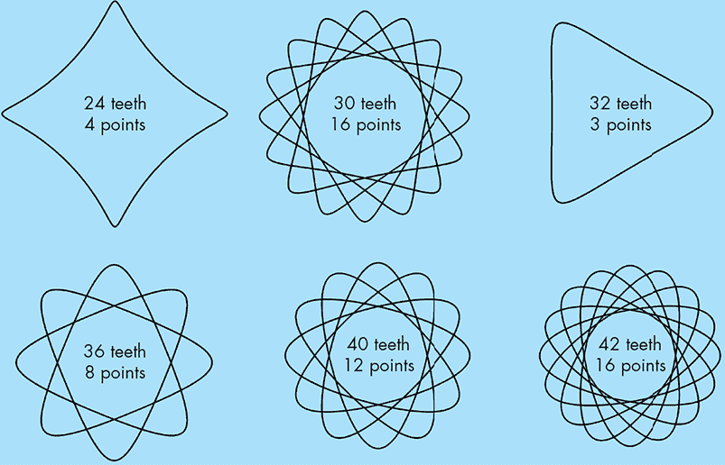

### 使用双素数联系外星人

双素数，有时也称为*半素数*，是一类很有趣的数字。作为两个素数的乘积，双素数的定义就是只有两个素因数。这个性质引出了一个有趣的可能性：你可以利用双素数来结合每个素因数的信息。

这里有一个双素数派上用场的实际例子。1974 年，科学家们通过位于波多黎各的 Arecibo 射电望远镜向太空广播了 Arecibo 消息。他们希望消息能包含有关地球上人类生活的信息，以便任何接收到消息的外星人都知道我们存在并了解我们的一些情况。但他们不想用英语或其他人类语言编写消息，因为接收者可能无法理解。相反，消息的作者决定将其设计为一系列位（0 和 1），这些位应该排成一个矩形，0 位用白色表示，1 位用黑色表示，从而形成一个像素化的图像。但是，消息的长度应该是多少呢，接收者又如何知道如何将这些位排列成正确尺寸的矩形呢？

假设你正在设计这样的消息。该消息有*n*位。如果矩形的尺寸是*a* ⋅ *b*，你需要确保*a*和*b*是*n*的因数，使得*a* ⋅ *b* = *n*。如果*n*是素数，只有一个因式分解，1 ⋅ *n*（或*n* ⋅ 1），那么这些位就只能排成一行或一列——这几乎没什么用。但如果*n*有很多因数，那么矩形的尺寸就有很多种可能性——这也不是很有帮助。

解决方案是让*n*成为双素数。这样，它只有两个重要的因数（不包括 1 和*n*本身），即两个素数，这两个素数相乘得到*n*，因此矩形的维度就很清晰。这正是 Arecibo 团队所做的，他们发送了 1,679 位的信息。由于 1,679 = 73 ⋅ 23，所以只有两种可能的方式来组织这些位：23 行和 73 列，或者 73 行和 23 列。对于他们发送的位串，第一个可能性解码出来是一个随机排列的点，而第二个则给出了图 3-10 所示的图像。

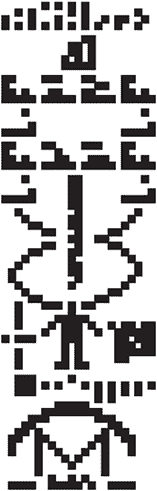

*图 3-10：Arecibo 消息*

该消息包含了关于二进制计数、生命的化学基础、太阳系、典型人类的大小以及发射该消息的望远镜的信息——这些信息在仅仅 1679 个 1 和 0 中压缩得相当紧凑。不幸的是，Arecibo 望远镜在 2020 年倒塌，但即使望远镜已经消失，消息仍在前往球状星团梅西耶 13 的途中，预计将在大约 25,000 年后抵达。

为了从 Arecibo 消息中提取信息，我们需要做的就是因式分解其长度*n*。我们已经有了一种通过试除法来做到这一点的方法，如在项目 10 中所示，但这种方法对于大数——尤其是大合数——可能会比较慢，因为我们必须先通过所有小数进行试除。正如我们将在下一个项目中看到的，知道我们正在尝试因式分解一个合数，可以给我们提供一个捷径。我们可能会期望合数的两个质因数接近相同的大小，围绕*n*的平方根。因此，我们可以从那里开始查找，而不是从 2 开始。

#### 项目 13：费马因式分解法

数学家皮埃尔·德·费马意识到，存在一种更高效的方法来因式分解接近相同大小的两个因数的数字，比如我们这里关注的合数。这个技巧基于平方差公式。假设我们有一个数字*n*，可以写成平方差的形式，即*n* = *a*² – *b*²。我们可以将其改写为*n* = (*a* – *b*) (*a* + *b*)。以这种方式查看公式可以告诉我们，(*a* – *b*)和(*a* + *b*)一定是*n*的因数。

诀窍是从*n*中找到*a*和*b*。为此，我们将方程重写为*a*² – *n* = *b*²，尝试不同的*a*值，并寻找一种使差值*a*² – *n*成为完全平方数的选择，从而找到*b*。首先，我们需要识别完全平方数，这可以通过图 3-11 中的自定义块来实现。

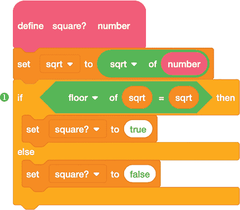

*图 3-11：我们有完全平方数吗？*

这是一个布尔块，根据传入的数字是否是完全平方数返回一个逻辑值`true`或`false`。我们计算`number`的平方根，使用内置的`floor`函数将结果向下取整到最接近的整数❶，然后进行比较。如果`number`是完全平方数，那么它的平方根已经是一个整数，所以比较结果相等。

一旦我们能够识别完全平方数，就可以开始搜索它们以识别*a*和*b*，从而找到*n*的因数。图 3-12 中的程序演示了这一过程。

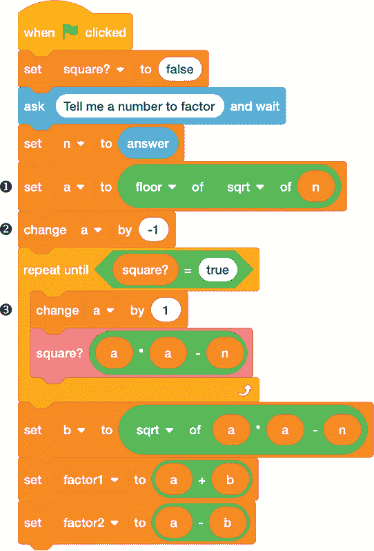

*图 3-12：费马因式分解*

我们首先选择一个比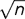 ❶稍小的 *a* 值。然后，在一个循环中，我们将 *a* 增加 `1` ➌ 并检查 *a*² – *n* 是否是一个完全平方数。（在循环前将 *a* 减少 `1` ➋ 让我们可以捕捉到 *n* 恰好是一个完全平方数的情况。）一旦我们找到一个有效的 *b* 值，就计算并显示因数 `factor1` (*a* + *b*) 和 `factor2` (*a* – *b*)。

##### 结果

图 3-13 显示了程序运行的样本结果。

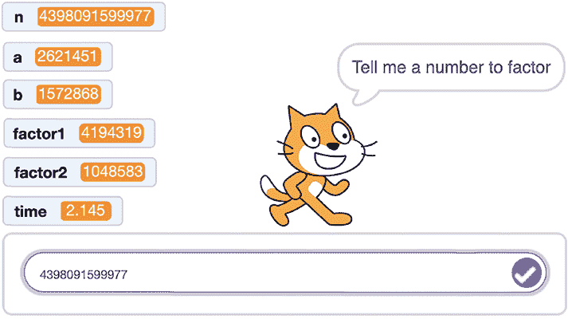

*图 3-13：因数分解 4,398,091,599,977*

请注意，我们没有让 Scratch Cat 说出结果，而是直接将相关变量显示在屏幕上。

##### 破解代码

将费马分解方法的时间与项目 10 中的试除法方法进行比较会很有趣。你可能会在图 3-13 中注意到，屏幕上显示了一个额外的变量，叫做`time`，它的目的是用于这个对比。我们之前在项目 9 中嵌入了一个程序，放在一个定时器循环中，用来检查使用试除法测试质数所需的时间（请参见图 2-19，位于第 39 页）。这一次，我们将创建两个简单的自定义模块，用来打开和关闭 Scratch 的内部定时器，如图 3-14 所示。

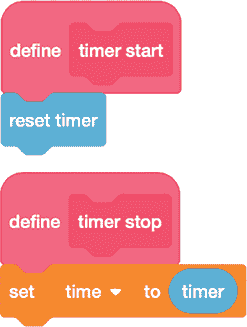

*图 3-14：定时器模块*

为了计时费马分解程序，将 `timer start` 块添加到图 3-12 中第三个 `set` 块之前 ➊，并将 `timer stop` 块添加到程序的末尾。正如我们在第二章中讨论的那样，Scratch 的默认时间单位是秒，因此对于小数字来说，时间可能会报告为 `0`，因为实际的时间间隔太短，经过四舍五入后无法显示。重复运行程序并将总时间除以运行次数应该能给出更准确的结果。这个技巧还帮助消除了计算机上其他进程对 Scratch 程序运行速度的影响。

 编程挑战

**3.9** 在图 3-12 中的费马分解代码中添加一个测试，检查它产生的因数是否为质数。这将告诉你输入的数字是否真的是一个双质数。

**3.10** 将图 3-12 中的费马分解代码与图 2-6 中的试除法代码结合在一起，位于第 28 页，这样你就可以比较每种方法找到因数的时间。

**3.11** Scratch 的舞台大小为 480 像素乘 360 像素。编写一个程序，接收一个由*n = a* ⋅ *b* 位（其中*a*最多为 480，*b*最多为 360）组成的字符串，并在屏幕上以*a*乘*b*像素的矩形显示它，将 1 位显示为黑色，0 位显示为白色。尝试使用该程序重现 Arecibo 信息。

### 结论

本章我们提出了不同的问题，并在第二章中提出了类似的问题（“一个数字如何分解因子？”和“一个数字是否为质数？”），但我们在两种情况下都使用了相同的初步方法来解答它们：试除法。正如我们所见，这种方法的局限性在于执行工作的时间。在最坏的情况下，找到答案所需的步骤与被测试数字的平方根成正比。对于不超过 flintmax 的数字，这样的时间并不算长，但对于拥有数百位数字的数字来说，宇宙中的时间也不够试除法来奏效。其他方法，如费马分解法，可以帮助我们更快地找到所需的结果，尤其是当我们对数字的形态有所了解时，例如它是否为双质数。如果你能想到加速计算的方法，Scratch Cat 将会更快给出答案！
