## ## **在序列中寻找模式**

人类天生就能寻找模式并预测接下来会发生什么。现实世界中的模式可能很复杂，涉及到很多变量和结果，可能是时间上的（比如下次月圆是什么时候？）或空间上的（比如那个洞里有熊吗？）。在本章中，我们将探索数字序列中的模式。你将学会如何揭示序列形成的规则，以及如何预测序列中的后续数字。

### 什么是序列？

一个 *序列* 就是一系列数字。这些数字按照特定的顺序排列——有第一个数字、第二个数字、第三个数字，等等——所以我们可以说序列是由正整数 *索引* 或 *排列* 的。当我们写关于序列的数学时，我们通常会将索引数字写作下标。例如，我们可能会将一个序列写作 *a*[1]，*a*[2]，*a*[3]，. . . ，其中每个 *a* 是序列中的一个值，称为 *项* 或 *元素*。

通常，序列中的数字讲述了它们是如何生成的。也许有一个规则描述了一个公式，用来获取索引数字并对其进行操作，以生成对应的序列元素。例如，如果我们想研究奇数的序列（1, 3, 5, 7, . . .），我们可能会将第 *n* 个奇数描述为 2*n* – 1。我们可以通过将偶数看作是 2 的倍数，奇数则是比偶数少 1，来推导出这个公式。我们可以快速检查这个公式是否有效：当索引 *n* = 1 时，第一个奇数是 2 ⋅ 1 – 1 = 1。接着，当 *n* = 2 时，我们得到 2*n* – 1 = 2 ⋅ 2 – 1 = 3，以此类推。我们可以通过以下方式明确模式：*a*[*n*] = 2*n* – 1，或者用语言来说就是：*将索引翻倍并减去 1*。

也许每个索引 *n* 代表一个数学对象，比如几何形状，而对应的序列中的数字可以通过检查或计数该对象的一些特征来找到。例如，如果我们让每个 *n* 代表一个边长为 *n* 的正方形，我们可能对正方形面积的序列感兴趣（1, 4, 9, 16, . . .）。或者也许我们更想要正方形周长的序列（4, 8, 12, 16, . . .）。

#### 在序列中寻找下一个值

可能有可能找到一个基于几何或逻辑模式的公式，来描述像刚才提到的那样的数列。然后，这个公式可以帮助我们深入理解数列的规律。例如，我们可能会注意到，面积数列中的所有数字都是完全平方数，并且意识到这与一个正方形的面积是其长和宽的乘积有关。同样，我们可能会注意到，周长数列中的数字都是 4 的倍数，并且能够找到一个理由，这与正方形四条相等的边长有关。如果我们将面积数列写成 *s*[1]、*s*[2]、*s*[3]、. . . ，将周长数列写成 *p*[1]、*p*[2]、*p*[3]、. . . ，我们可能会发现公式 *s*[*n*] = *n*² 和 *p*[*n*] = 4*n*。这些公式在代数上是正确的，但我们是基于数列的几何描述得出的这些公式。

有时，描述数列的模式最好是通过提供一个生成后续项的规则，基于前面的项。*递归*就是通过给出一个公式来描述 *a*[*n*]，这个公式不仅仅依赖于索引 *n*，而是基于前面元素的值。例如，周长数列可以通过注意到 *p*[1] = 4，并且每个周长都比前一个多 4 来生成。位于索引 *n* 前的元素具有索引 *n* – 1，因此公式可以是 *p*[*n*] = *p*[*n* – 1] + 4。只要我们有了起始值（即 *p*[1]），我们就能生成剩下的数列。

正方形的面积数列也遵循它自己更微妙的递归规律。给定初始元素 *s*[1] = 1，任何后续元素 *s*[*n*] 都可以通过公式 *s*[*n* – 1] + 2*n* – 1 计算得出。这为我们提供了另一种描述该数列的方式。一般来说，要通过递归来指定一个数列，你必须提供一个初始值（例如 *p*[1] = 4）和一个形成规则（例如 *p*[*n*] = *p*[*n* – 1] + 4）。有时，递归可能依赖于两个或更多前导项，而不仅仅是一个，在这种情况下，必须提供两个或更多初始值。一个著名的例子是斐波那契数列，我们稍后会进行探讨。

#### 在 Scratch 中创建数列

在 Scratch 中，我们可以将数列表示为列表。Scratch 列表可以包含数字或字符串，并且可以最多容纳 200,000 个项目，这对于探索模式来说是足够的。与许多其他编程语言（这些语言通常从 0 开始索引列表项）不同，Scratch 从 1 开始索引其列表。这一特性使得 Scratch 列表特别适用于表示数列，因为数列通常也是从 1 开始索引的。如 第三章 中所提到的，当 Scratch 在舞台上显示一个列表时，它会在左侧显示索引数字，因此你可以轻松看到一个项在数列中的位置。如果列表太长，无法完全显示在舞台上，你可以滚动查看后面的条目。

用于处理列表的 Scratch 模块如图 4-1 所示。这些模块可以在模块面板的变量部分找到。

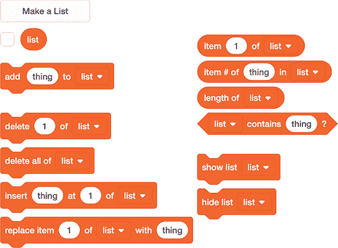

*图 4-1：Scratch 的列表操作模块*

注意，除了在列表末尾添加项，我们还可以在列表的任何位置插入项，这会导致后续项的索引增加（加 1）。我们可以删除列表项，这也会使后续项的索引减小（减少 1），同时我们还可以用其他项替换列表项，这样后续项的索引则不会改变。我们可以查找某个项的索引，查看它在列表中的位置，也可以检查某个项是否出现在列表中。我们还可以查看列表的长度。

#### 项目 14：斐波那契的兔子

在这个项目中，我们将探索*斐波那契数列*，这是一个由*二项递推*描述的著名数列。这意味着数列中的每个数字都是基于前两个数字计算出来的。这个数列最早在 1202 年由意大利数学家斐波那契在《Liber Abaci》一书中提到。斐波那契使用这个数列来描述兔子种群的增长。

在给定斐波那契数列的前两个数字，*f*[1] = 1 和 *f*[2] = 1 之后，其他的数字都是通过这个生成规则来找到的：

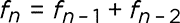

换句话说，我们将序列中的前两个数相加，得到下一个数字。第三个数字是 1 + 1 = 2，第四个是 1 + 2 = 3，第五个是 2 + 3 = 5，依此类推。更多内容我们可以让 Scratch 来处理，如图 4-2 所示。

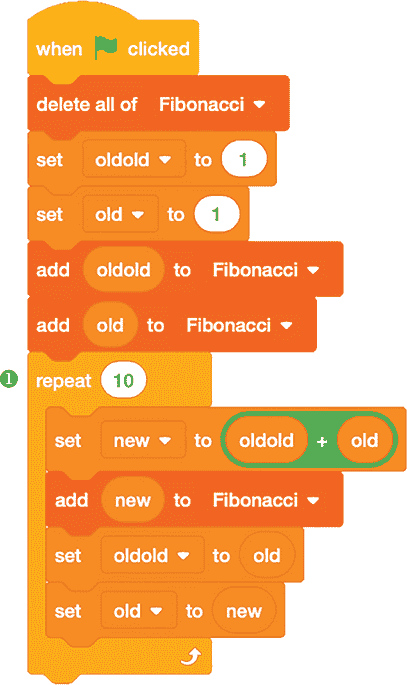

*图 4-2：使用二项递推生成斐波那契数列*

注意，在这段代码中，为了生成二项递推的数字，我们只需要追踪前两个值来计算下一个值。我们首先将名为 `oldold` 和 `old` 的变量设置为初始值（`1` 和 `1`）。然后，在一个循环 ❶ 中，我们将 `new` 变量赋值为它们的和，将 `oldold` 替换为 `old`，并将 `old` 替换为 `new`。通过这些替换，我们就准备好在下一次循环时计算 `new` 的下一个值。

#### 项目 15：黄金比例

斐波那契数列的一个有趣的事实是，连续两个数的比值趋近于一个极限值，这意味着随着数列的展开，*f*[*n*] 除以 *f*[*n* – 1] 会越来越接近某个特定数字（即*极限*），但永远不会完全到达它。这被称为*收敛比率*。对于斐波那契数列来说，这个极限是一个著名的数学常数，叫做*黄金比例*。它的准确值是：

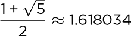

为了证明斐波那契数列具有收敛比值，我们可以修改前一个项目中的代码，添加另一个列表来跟踪每个数字与序列中前一个数字的比值。图 4-3 展示了如何做。

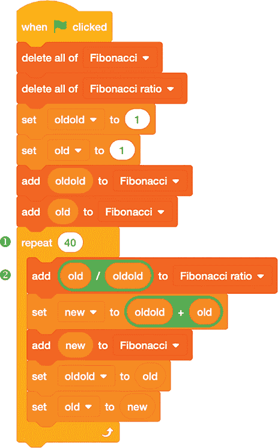

*图 4-3：追踪连续斐波那契项的比值*

这段代码与图 4-2 类似，只不过多了一个额外的列表来追踪`Fibonacci ratio`。我们在计算序列中的下一个项之前，用`old / oldold`的值更新这个列表 ➋。我们让列表经过 40 次迭代 ➊，因为这是比值稳定下来的地方。

##### 结果

图 4-4 显示了运行图 4-3 中代码后的两个列表中的初始结果。你需要向下滚动才能查看列表中的后续值。

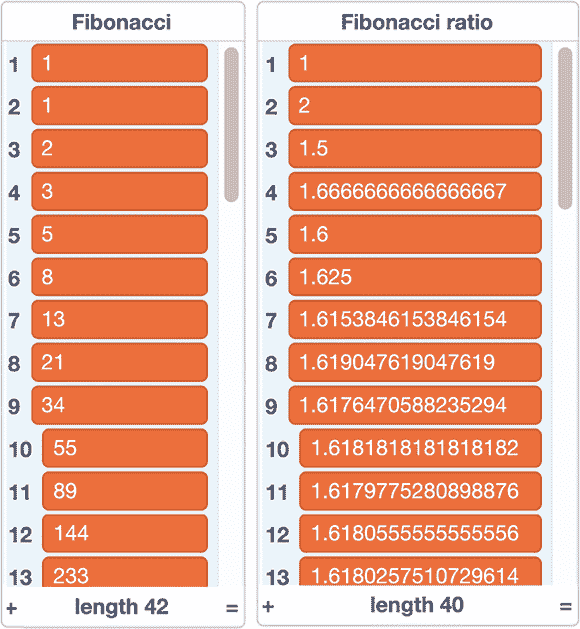

*图 4-4：前几个斐波那契数及其比值*

`Fibonacci`列表显示了斐波那契数列本身，而`Fibonacci ratio`列表显示了每一项与其后续项之间的比值。正如你所看到的，比值在它们的极限值上下波动。如果你想提前停止程序，取`Fibonacci ratio`中两个连续列表元素的平均值，将比单独的元素提供更好的极限值近似。

##### 破解代码

我们使用了`repeat`循环来为程序提供看起来合理的计算项数，但最好是让程序自己决定需要多少项。例如，我们可以让程序在比值足够收敛到极限值时停止计算斐波那契数。我们可以将此定义为比值不再变化的时刻，或者当它们的变化小于指定的量时。图 4-5 展示了使用这种方法的修改版斐波那契程序。

这个程序不再将斐波那契数存储在列表中，因为我们只关心比值收敛所需的时间。我们使用`repeat until`循环 ➊ 来监控比值随着更多项的计算而变化，直到当前比值与前一个比值的差异小于`0.0000001`为止。这个精度水平是可配置的，但如果我们使用过多的数字（过小的数字），我们将遇到 IEEE 754 浮点表示法的限制。

请注意，`repeat until`条件使用了绝对值函数（`abs`）。这是必要的，因为比值在极限值周围来回摆动，交替地过大或过小。这意味着我们计算的差异交替为正值和负值，因此`abs`将负值转换为正值。

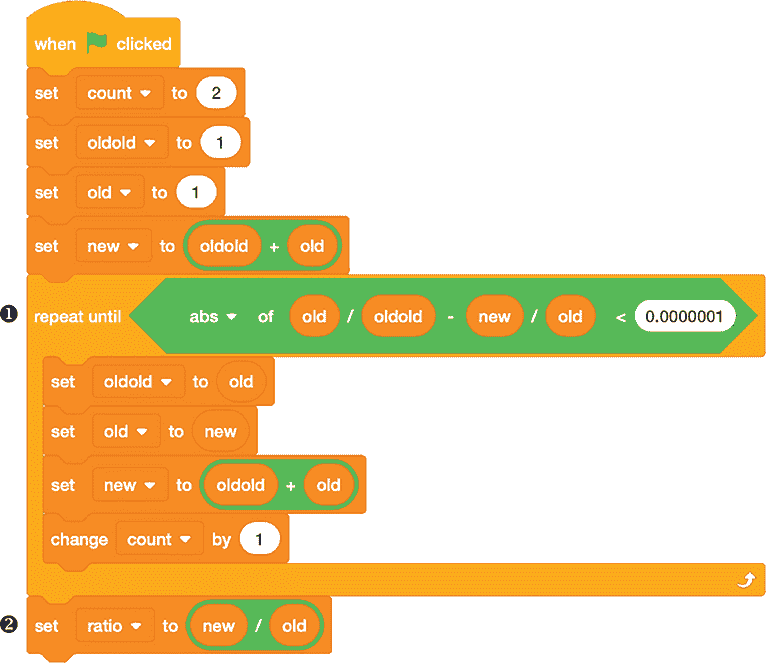

*图 4-5：当比值收敛时停止程序*

这个程序包含一个名为 `count` 的变量，用来跟踪需要多少项才能达到指定的准确度水平。在循环结束后，程序将最终的比率存储在 `ratio` 变量中 ➋。在舞台上，只显示比率的前几位数字，但你可以点击编码区域中的比率，查看计算出的所有数字，如图 4-6 所示。

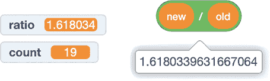

*图 4-6：计算斐波那契比率*

作为一个实验，你可以尝试将准确度设置为不同的值（`0.01`，`0.001`，……），看看需要多少项才能达到那个准确度水平。

 编程挑战

**4.1** 尝试通过在原始斐波那契程序中使用不同的初始值来更改斐波那契递归的起始条件（图 4-2）。将 `old` 设置为 `2`，`oldold` 设置为 `1` 并不会很有趣，因为这只是将斐波那契数列向右平移了一位。然而，如果将 `old` 设置为 `1`，`oldold` 设置为 `2`，则会得到一个不同的数列，称为 *卢卡斯数列*。看看你是否能找到卢卡斯数与斐波那契数之间的关系。

**4.2** 你如何理解斐波那契数列的反向计算？为了保持递归关系，*f*[0] 应该是什么？*f*[–1] 和 *f*[–2] 又应该是什么？编写一个针对负整数的递归程序。

**4.3** 在图 4-2 中的代码上进行修改，探索它的极限。斐波那契数列能走多远，才会超出 flintmax？在数字超过 Scratch 浮点数表示的绝对限制并被报告为 `Infinity` 之前，能走多远？增长速度是指数级的，因此不需要很多步骤，flintmax 就会被超越！

### 几何数

*几何数* 来自那些计算构建嵌套几何图形所需点数的数列。例如，在图 4-7 中，我们有一个内嵌的正方形序列。蓝色的点是我们要计数的点，这些点位于网格上。通过连接这些点，从左下角开始，我们可以绘制出越来越大的正方形，包含越来越多的点。

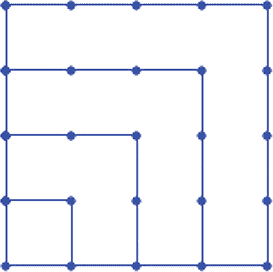

*图 4-7：作为几何数的嵌套正方形*

*平方*一词可以是名词或动词。作为名词时，它指的是一种几何图形，一个具有四个相等边和四个相等角的多边形。作为动词时，它通常用于算术中，用来描述将一个数字乘以自身的过程。当然，算术和几何是相关的。公式*A* = *s*²，用于通过将边长*s*自乘来计算（几何）正方形的面积，从几何角度解释了算术。若某个数字是通过将一个正整数自乘得到的，那么这个数字就是平方数（1² = 1, 2² = 4, 3² = 9, 16, 25，...）。

图 4-7 展示了我们如何排列平方数个点，形成不断增长的几何正方形。我们有一个包含 4 个点（2 行 2 列）的正方形，内嵌着一个包含 9 个点（3 行 3 列）的正方形，再内嵌着一个包含 16 个点（4 行 4 列）的正方形，最后是一个包含 25 个点（5 行 5 列）的正方形。你也可以把最左下角的点当作包含 1 个点的正方形。每个较大的正方形都会在前一个正方形的边缘添加一组新的连接点。

实际上，任何类型的多边形都可以嵌套，从而生成类似平方数序列的几何数列，正如我们接下来要探讨的那样。

#### 项目 16：平方数、三角形数和五边形数？

接下来的三个图中的 Scratch 程序绘制了嵌套的*s*边形，并计算新添加的点以生成一个序列。到目前为止，我们还没有使用很多 Scratch 的图形功能，但在这个程序中，我们使用了 Pen 扩展来为绘制各种图形添加动画。（点击左下角的**添加扩展**图标来添加这些 Pen 块。）我们的程序从图 4-8 中的初始设置开始。

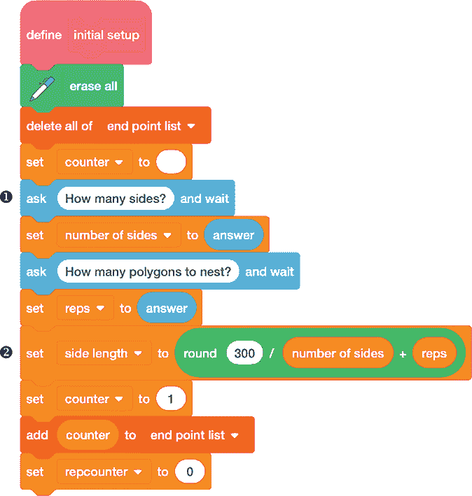

*图 4-8：绘制嵌套多边形的设置代码*

这个`initial setup`块清除屏幕上的前面绘图，并要求用户输入边数（保存在变量`number of sides`中）和嵌套的多边形数量（保存在变量`reps`中）❶。计算`side length` ➋，即舞台上两个相邻点之间的距离，确保多边形能够适应舞台。

图 4-9 展示了程序的主要逻辑。

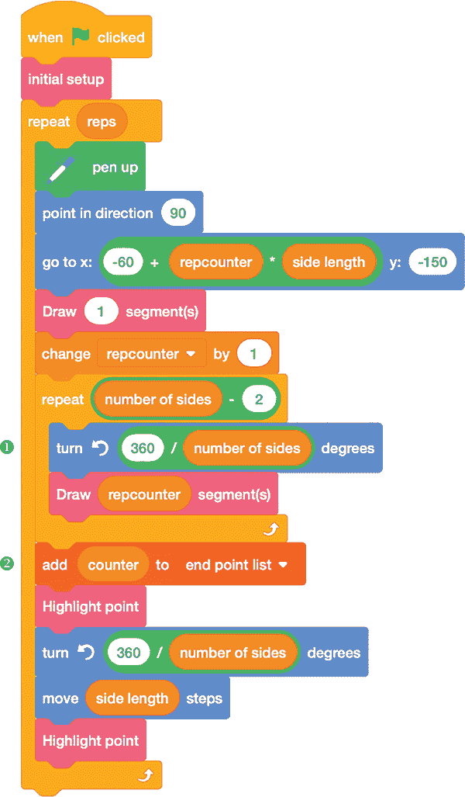

*图 4-9：绘制多边形*

我们在一个循环中绘制嵌套的多边形，该循环重复`reps`次。我们从左下角开始绘制每个多边形，使用`go to`块跳过已经绘制的点（因为所有多边形都有相同的底边）。在用自定义的`Draw n segment(s)`块绘制完第一条边后，我们根据多边形的边数旋转笔刷❶。`counter`变量跟踪已绘制的点的总数。一旦当前的多边形完成，我们将`counter`添加到`end point list` ➋。该列表跟踪每完成一个多边形时绘制的点数，构建我们的图形数列。我们使用自定义的`Highlight point`块来指定如何绘制这些点。图 4-10 显示了这两个自定义块。

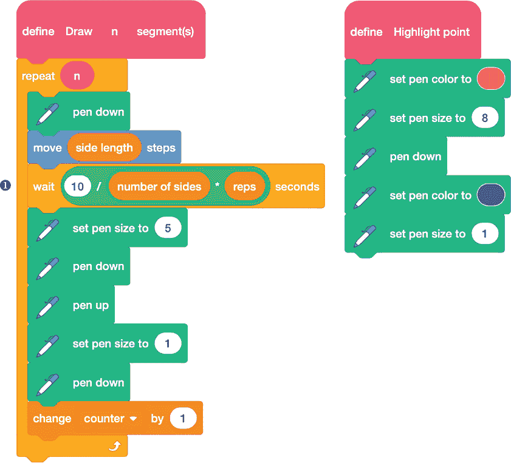

*图 4-10：绘制点和线*

`Draw n segment(s)`块沿多边形的一条边执行`n`步，首先画一个大点（`笔刷大小 5`），然后画一条细线（`笔刷大小 1`）连接到下一个点。`wait`块计算每一步之间的暂停时间❶，但如果你厌倦了观看绘图过程，可以通过降低分子中的值来加快速度。

自定义的`Highlight point`块只是将笔刷颜色改为红色，并增加其大小，以标记每个多边形中的最后一个点。然后，它将笔刷颜色恢复为蓝色，并再次减小大小。

##### 结果

我们使用绘图程序生成一些数列。当边数*s* = 4 时，我们得到方形，无论是几何上还是算术上，如图 4-11 所示。从几何角度看，每添加一层点到现有点周围就形成一个新的、更大的方形。从算术角度看，`end point list`序列中累积的数字都是完全平方数。我们通过从左下角开始计数点，逆时针移动，并随着每一层嵌套扩展，得到了这些数字。如前所述，当我们完成一个方形时，到目前为止计数的点数会被添加到列表中，并且该点会用红色高亮显示。

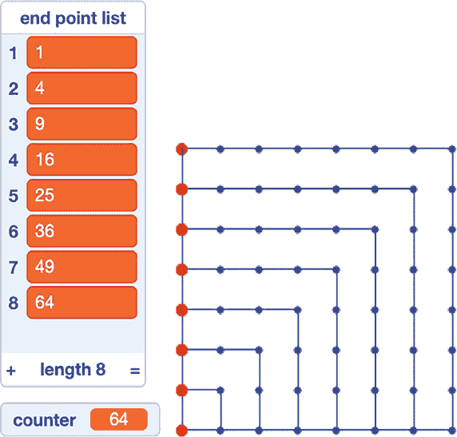

*图 4-11：方形数*

我们不必局限于方形。*三角形数*是通过将点按嵌套等边三角形排列生成的序列，如图 4-12 所示。

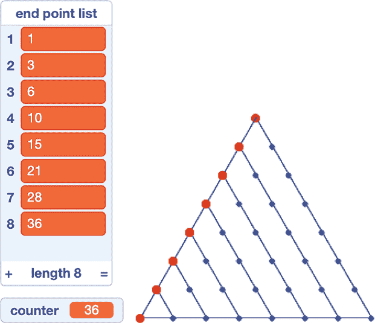

*图 4-12：三角形数*

请注意，每个三角形数都是通过将下一个整数加到前一个三角形数中构建的：1, 1 + 2 = 3, 1 + 2 + 3 = 6, 1 + 2 + 3 + 4 = 10，依此类推。换句话说，第*n*个三角形数是从 1 到*n*所有整数的和。

我们如何用公式描述三角形数列的模式呢？可以考虑将第*n*个三角形复制一份并旋转，使其形成平行四边形，如图 4-13 所示。

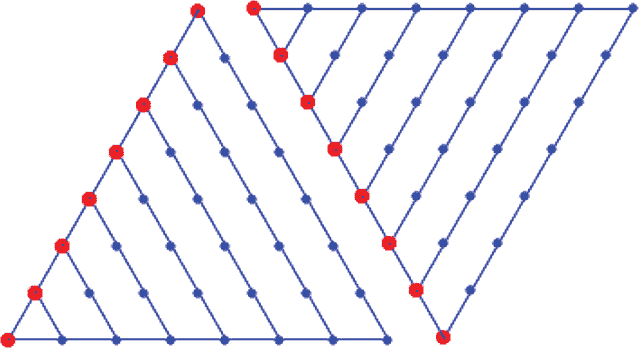

*图 4-13：我们可以通过思考两个三角形排列成平行四边形的方式来推导三角形数字的公式。*

这个平行四边形的底部有*n* + 1 个点，且有*n*行点，因此一共有*n*(*n* + 1)个点。由于这个平行四边形是由两个三角形复制而成，每个三角形中包含*n*(*n* + 1) / 2 个点。这就是*n*阶三角形数的公式。

我们可以通过在嵌套的五边形中数点，来生成另一个图形数列，这将在第七章中派上用场。图 4-14 展示了*五边形数字*的序列。

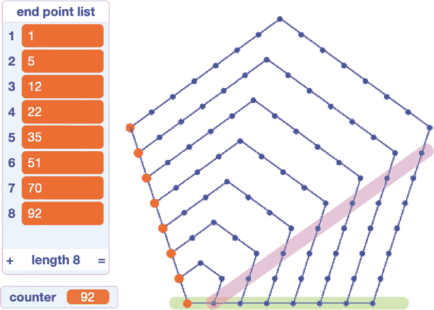

*图 4-14：五边形图形数字*

在嵌套的五边形中还有其他有趣的数字序列。例如，如果你数一下这些点，并记录下沿着图 4-14 中绿色路径的点的数字，你会得到 1, 2, 6, 13, 23, 36，……这样的序列。另一个在第七章中会用到的路径从 2 开始，沿着图 4-14 中的紫色路径向上和向右走。围绕嵌套的五边形数点得到的序列是 2, 7, 15, 26, 40, 57，……。

##### 破解代码

即使你将`绘制 n 段`积木中的等待时间（图 4-10 ❶）设置为`0`，在绘制多边形和报告图形数列的值时，仍然会有延迟。如果你想立即得到结果，可以通过使用 Turbo 模式来加速程序（参见图 4-15）。

*图 4-15：开启 Turbo 模式*

Turbo 模式是一个功能，能够消除 Scratch 在运行更新屏幕的积木后通常会插入的短暂停顿。要开启 Turbo 模式，请在 Scratch 编辑器中选择**编辑 ▸ 开启 Turbo 模式**，或在点击绿色旗帜按钮时按住 SHIFT 键。当 Turbo 模式激活时，菜单栏会有相应的指示。

### 预测序列中的值

每当你看到一个序列的前几个项时，大家都会自然地问：“接下来是什么？”一个可能的回答是：“随便你想要什么！”如果你只知道有一些数字一个接一个地列出，那么任何数字都可以是接下来的项。但如果你假设这些数字有某种意义——也就是说，它们是通过某种规则生成的——那么要弄清楚接下来是什么，就需要发现这个规则，并将其应用到后面的项上。可能存在多个符合条件的规则，在这种情况下，你可以选择最自然或最有用的那个规则。

例如，考虑图 4-11 中的平方数列。我们可以通过找到规则来预测数列中的下一个数字，即数列中的第*n*项是*n*²。9² = 81 之后的元素应该是 10² = 100。或者，我们可以注意到，对于每一个新的（几何）平方，我们都是在前面的平方基础上，沿着上边和右边添加了一层新的点。第*n*层会添加第*n*个奇数（2*n* - 1）个点到总数中（因此数列可以描述为 1, 1 + 3, 1 + 3 + 5, 1 + 3 + 5 + 7, ……）。这是一个*加法规则*的例子，它揭示了规律的另一个方面。从这个角度考虑，我们可以通过在第九个数（81）上加上（2 ⋅ 10）– 1 = 19，得到 81 + 19 = 100。无论哪种方式，我们都会做出相同的预测，但我们对其描述方式不同。

#### 项目 17：差分表带来的巨大变化

了解一个数列的规律，尤其是使用某种加法规则构建的数列，可以通过减法来逆转加法操作。一个数列的*差分表*是通过将原始数列的每个项与下一个项进行相减而得到的另一个数列。在这个项目中，我们将探讨如何使用 Scratch 来创建差分表。

如果一个差分表无法揭示数列的规律，我们可以通过在第一个差分表中找到相邻数字的差值来创建第二个差分表。这些差值被称为原始数列的*第二差分*。如果有需要，我们可以基于第二差分表再创建第三差分表，以此类推。有时，通过这个过程会出现有趣的规律。

图 4-16 展示了部分 Scratch 代码，用于输入一个数列并生成其差分表。

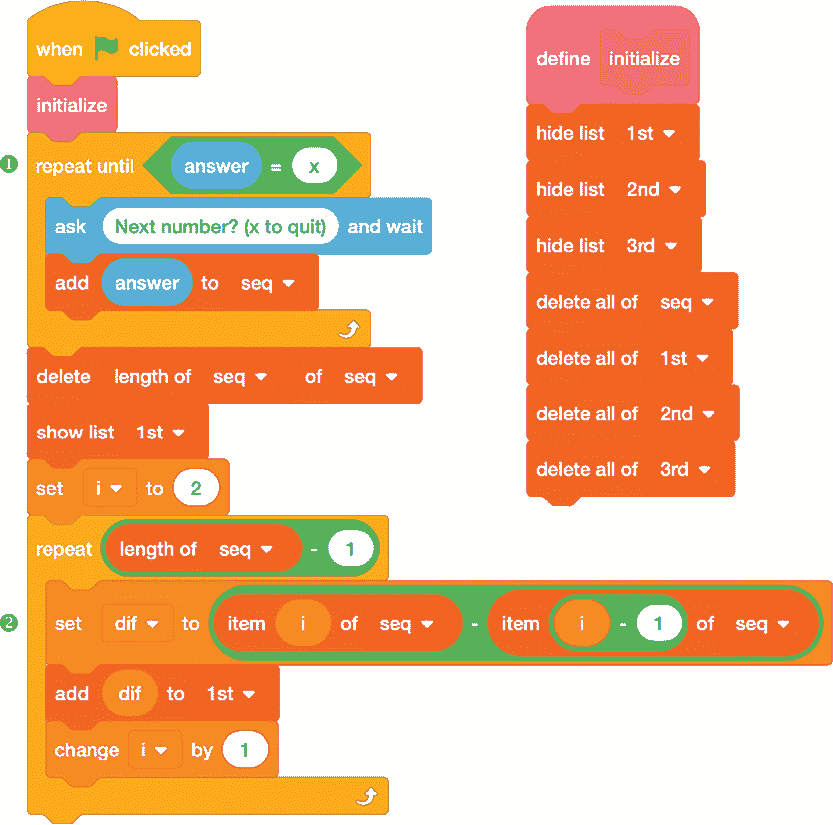

*图 4-16：构建差分表以分析一个数列*

首先，`initialize` 块清空了上次运行程序时的数据。然后，`repeat until` 循环 ➊ 提示我们一次输入一个数，直到我们通过输入 `x` 告诉 Scratch 我们已经完成了。数列被存储在 `seq` 列表中。接着，我们通过计算数列中相邻值之间的差值来构建第一个差分表，并将其存储在 `1st` 列表中 ➋。

图 4-17 中的附加代码计算了第二和第三差分，并将它们存储在 `2nd` 和 `3rd` 列表中。

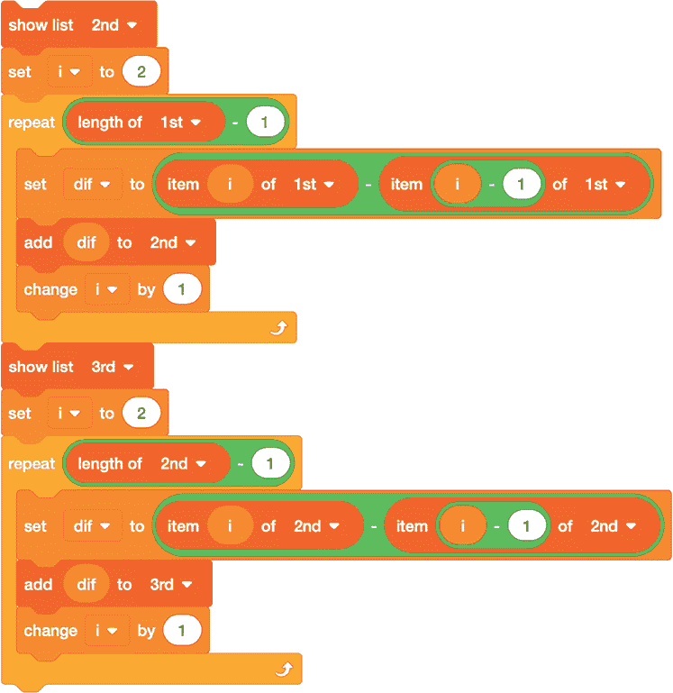

*图 4-17：计算第二和第三差分*

这个代码片段遵循了我们计算第一个差分表时使用的相同模式，只不过我们这次使用 `1st` 和 `2nd` 列表作为输入，而不是使用 `seq`。

##### 结果

图 4-18 展示了运行差分表程序后，来自平方数列的前几个值的结果：1，4，9，16，25，36，49，64 和 81。

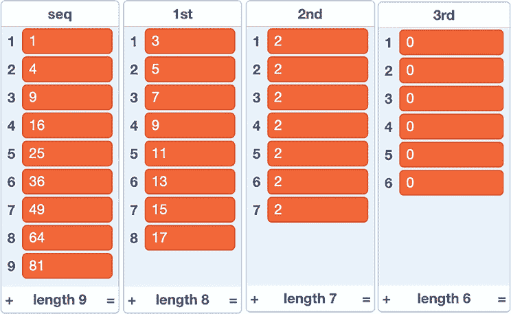

*图 4-18：平方数序列的差异表*

第一次差异表确认了我们之前讨论的内容：差异是连续的奇数，意味着序列中的第 *n* 个数字是前 *n* 个奇数的总和。第二次差异是恒定的：它们都等于 2，因为连续的奇数之间总是相差 2。第三差异都为 0。

第三差异为 0 是一个明显的标志，表明序列的基础形成规则可以用 *二次多项式* 给出，形式为 *ax*² + *bx* + *c*。因此，写出形成规则就变成了确定 *a*、*b* 和 *c* 的值，这些值被称为 *系数*。对于平方数序列，写出二次多项式尤其容易：我们可以使用 *a* = 1, *b* = 0, 和 *c* = 0。这样我们得到：

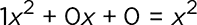

对于来自图 4-13 的三角形数，我们可以使用 *a* = 1/2, *b* = 1/2, 和 *c* = 0。然后我们得到：

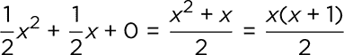

这与我们之前通过将两个三角形复制并视为平行四边形得出的规则相同。

##### 破解代码

这里有一个 Scratch 技巧，可以让程序中使用列表变得更容易。假设你有另一个程序中的数字列表——例如，使用项目 16 中的代码生成的五边形数(图 4-14)——并且你想将它们带入差异表程序进行分析。你可以通过右键点击该列表并选择 **导出** 来导出该列表，而不是逐一手动复制数字（见图 4-19）。这样会将列表保存为名为 *end point list.txt*（或者任何列表的名称）的文本文件，保存在你的默认目录中。

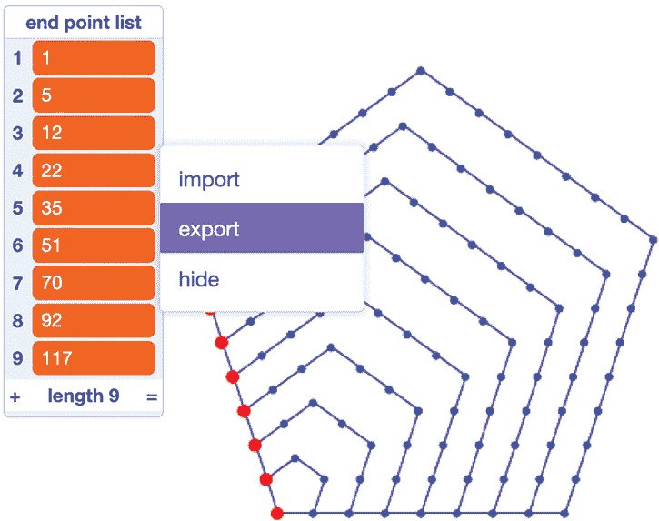

*图 4-19：保存列表以备后用*

要在差异表程序中使用该列表，请忽略输入数字的提示，右键点击舞台上的 `seq` 列表。点击 **导入**，如图 4-20 所示，然后选择你刚刚保存的文件进行上传。

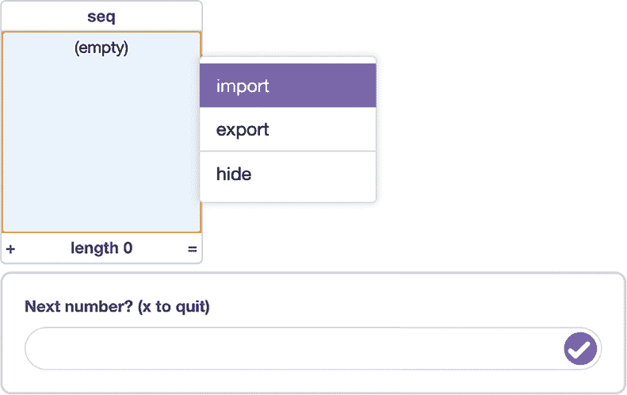

*图 4-20：恢复列表以进行进一步工作*

`seq` 列表现在将填充五边形数，因此你只需要在提示符中输入一个 `x`，就能计算差异。图 4-21 展示了结果。

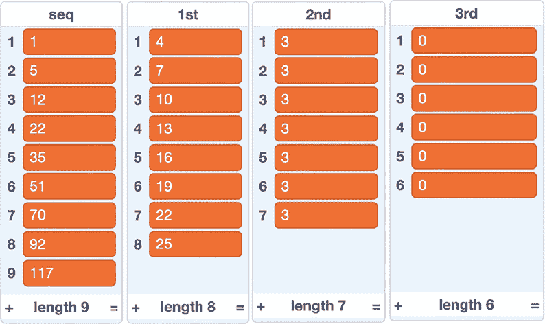

*图 4-21：五边形数序列的差异表*

你知道什么吗？再次地，第三差异都为 0，因此五边形数序列也可以通过二次多项式生成！

 编程挑战

**4.4** 编写一个 Scratch 程序，它可以处理任何第三差分为 0 的序列，并恢复该序列的二次多项式系数 *a*、*b* 和 *c*，即 *ax*² + *bx* + *c*。使用该程序查找五边形数的系数。如果你只想要五边形数的公式，试着像小孩子画房子一样画第 *n* 个五边形，将它看作是第 *n* 个正方形上方加上第 (*n* – 1) 个三角形。

**4.5** 如果你将 项目 7 中通过筛法生成的素数列表导出，并将其导入差分表程序中，看看会发生什么。这里显示了前几个结果。如你所见，差分并没有形成如此整齐的模式。编写一些代码来查找第一差分表中最大的差值。

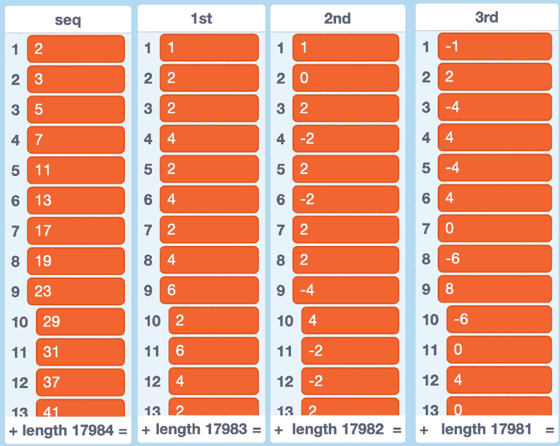

**4.6** 根据这个规则生成一个序列：序列的第 *n* 项是 *n* 的二进制表示中数字 1 出现的次数。这个序列从 1 开始，1, 1, 2, 1, 2, 2, 3, . . . ，（通过计算二进制序列 1, 10, 11, 100, 101, 110, 111, . . . 中的 1 的个数）。编写一个 Scratch 程序来计算这个序列的几百项，并看看你能否找到一个公式或递推关系来预测未来的项。

**4.7** 当你对斐波那契数列制作差分表时，会发生什么？

**4.8** 当你对 2 的幂次序列制作差分表时，会发生什么？

**4.9** 尝试对立方数列（1, 8, 27, 64, 125, . . .）创建差分表。你可以扩展图 4-17 中的代码，得到更高次差分，从而探索高次多项式的差分表。

### 结论

在 Scratch 中，列表非常适合追踪数字序列，而列表运算帮助我们理解其中出现的模式。Scratch 图形使用几何学来动画化具象数列，而差分表使这些数列中的模式更加易于识别。Scratch Cat 拥有所有答案——你的任务是提出问题！
