## ## **从序列到数组**

当你问“下一个值是什么？”时，你假设这些值是沿着一条线排列的一维序列。一个值跟随另一个值按顺序排列，因此从一个项跳到下一个项只有一种方式。但我们生活在一个多维的世界，有时使用多维来组织信息会更有帮助。

例如，*数组*是一个二维对象，是按行和列组织的值表格。我们仍然可以在一个数字数组中寻找模式，但现在这些模式可能在我们从一行移动到另一行、从一列移动到另一列，或沿对角线移动时显现出来。在本章中，我们将使用 Scratch 来研究一些有趣的数组。虽然 Scratch 通过其 `list` 数据类型使得探索一维序列变得容易，但它没有类似的结构来处理二维数组。我们将不得不开发一些创造性的方法来在 Scratch 中表示数组。

### Pascal 三角形

*Pascal 三角形* 是一个二维数字数组，而不是线性序列。就像序列中的条目是由正整数索引的，Pascal 三角形中的条目是通过给出两个索引数字来指定的，这两个索引分别对应于某个条目的行号和列号。在这种情况下，最好将索引数字从 0 开始，而不是从 1 开始。

Pascal 三角形的行数用字母 *n* 来表示。第一行时，*n* = 0；第二行时，*n* = 1，依此类推。在每一行中，列用字母 *k* 表示，从 *k* = 0 开始，一直到 *k* = *n*。因此，第 *n* 行总是有 *n* + 1 个条目：第 0 行有一个条目，第 1 行有两个条目，依此类推。当我们写出这些行时，居中排列会使我们容易看出数组从一行到下一行的扩展，从而形成 Pascal 三角形独特的形状：

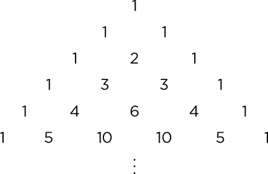

每个条目的值可以通过将其正上方的两个条目相加来确定。例如，第 *n* = 2（从顶部算起的第三行）中的 2 是上方两个 1 相加的结果，第 *n* = 5（这里显示的底部行）中的每个 10 是其上方 4 和 6 相加的结果。位于行边缘的条目，由于它们正上方没有两个条目，所有的值都为 1。

#### 使用二项式

现在你知道了 Pascal 三角形中数值的来源，但它们意味着什么呢？它们与 *二项式定理* 有关。这个代数规则使我们更容易计算出 *二项式* 的正整数次方，二项式是由两项和组成的表达式。以 1 + *x* 为例，二项式定理帮助我们计算 (1 + *x*)⁰, (1 + *x*)¹, (1 + *x*)², (1 + *x*)³ 等的值。展开每一个次方，我们得到如下结果：

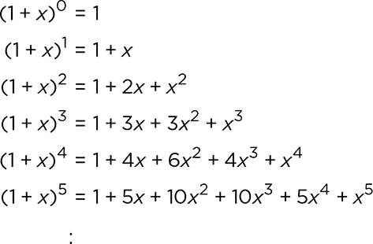

看起来熟悉吗？这些展开式中的系数（即 *x* 的幂的常数乘数）与帕斯卡三角形中的值是相同的。三角形第一行的 1（行 *n* = 0）对应于 (1 + *x*)⁰ = 1。第二行中的两个 1（*n* = 1）对应于 (1 + *x*)¹ = 1 + *x*。（想象 *x* 前面有一个隐形的 1。）第三行中的 1、2 和 1（*n* = 2）对应于 (1 + *x*)² = 1 + 2*x* + *x*²，依此类推。

通常，帕斯卡三角形的第 *n* 行显示的是二项式 *n* 次方的系数——也就是 (1 + *x*)^(*n*)。更重要的是，该行中的第 *k* 项包含了 *x*^(*k*) 在二项式展开中的系数。为了看清楚这一点，可以通过将表达式如 1 + 2*x* + *x*² 转换为 1*x*⁰ + 2*x*¹ + 1*x*²，并注意 *x* 的指数是如何从 0 到 *n* 依次递增的。

由于帕斯卡三角形中的值代表二项式展开式中的系数，所以它们被称为 *二项式系数*。任何给定的二项式系数都可以写作 *C*(*n*, *k*)，其中 *n* 和 *k* 分别是帕斯卡三角形中的行号和列号。因此，我们可以将帕斯卡三角形符号化地表示为：

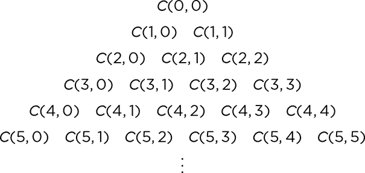

我们将帕斯卡三角形表示为一个三角形数组。但如果你观察索引号的模式，将其看作一个方形数组同样是有意义的，只不过方形的右上部分要么被省略，要么填充为 0，如下所示：

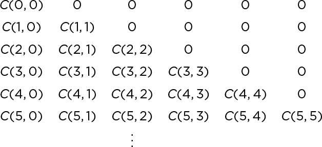

我们可以通过代数运算来求得 *C*(*n*, *k*) 的值，方法是展开多项式 (1 + *x*)^(*n*)，看看系数会变成什么样。（我已经为你做了一些工作，展示了 *n* = 5 时的值。）但这样做会很繁琐。为了得到 *C*(*n*, *k*) 的更一般的公式，可以通过思考一个相关的计数问题来帮助理解代数。

#### 从集合中创建子集

假设你有五个朋友（Albert、Barb、Charley、Deb 和 Eve），你只能邀请其中三个人来吃披萨。那么，你能邀请多少组不同的三人组合呢？假设 ABC 是 *Albert, Barb, Charley*，这是第一种可能。BAC 是同一组人，只是顺序不同，因此不应该算作不同的组合；你仍然会在披萨派对上迎接相同的客人。不过，ABD 是一个不同的组合，ABE 也是如此。你可以继续下去，一次列出一个子集，最终列出 10 种不同的披萨派对组合，可能最后是 CDE。

你如何确认这个数字是正确的呢？让我们看看能否提出一个通用的规则。假设你有一个包含*n*个元素的集合（所有你的朋友），你想从中选择*k*个元素组成一个子集（派对嘉宾），其中*k*是一个整数，满足 0 ≤ *k* ≤ *n*。在我们的示例中，*n* = 5，*k* = 3。首先，考虑选择子集时顺序重要的情况。在这种情况下，第一个元素可以是集合中的任意*n*个元素之一。第二个元素可以是选择第一个元素后剩下的*n* – 1 个元素之一，第三个元素可以是剩下的*n* – 2 个元素之一，以此类推，直到我们选择第*k*个元素，它只能有*n* – (*k* – 1) = *n* – *k* + 1 种选择方式。在我们的示例中，我们从五个朋友（A 到 E）中选择第一个元素，然后从剩下的四个中选择第二个，再从剩下的三个中选择第三个。

将每个位置的选择数量相乘，得到可能组合的总数。对于*k* = 3 和*n* = 5 的情况，可能性有 5 ⋅ 4 ⋅ 3 = 60 种。一般来说，可能组合数的公式是：

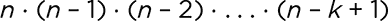

在我们的示例中，尽管选择子集中的元素顺序并不重要，但我们必须考虑到不同的顺序会导致相同的子集（就像之前提到的 ABC 和 BAC 顺序）。我们如何计算有多少种不同的方式来排列一个包含*k*个元素的子集呢？我们可以使用我们刚才用来处理*n*的相同逻辑来找出答案：第一个元素有*k*种可能性，第二个元素有*k* – 1 种可能性，依此类推。所以，总的排列数是：

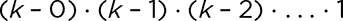

例如，对于*k* = 3，排列三个特定元素的方式有 3 ⋅ 2 ⋅ 1 = 6 种。这意味着，如果我们只想计算唯一的子集，忽略排列顺序，我们应该每六个组合中只计数一个。也就是说，如果从五个元素中选择三个元素的方式有 5 ⋅ 4 ⋅ 3 种，而这三个元素的排列方式有 3 ⋅ 2 ⋅ 1 种，那么总共有(5 ⋅ 4 ⋅ 3) / (3 ⋅ 2 ⋅ 1) = 60 / 6 = 10 个唯一子集，不考虑顺序。一般公式是：

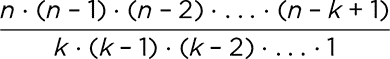

请注意，我们在这里使用的变量与我们用来表示帕斯卡三角形中行和列的变量相同：*n*和*k*。这是因为这两个问题是相关的。计算帕斯卡三角形中特定项*C*(*n*, *k*)的公式——也就是说，计算二项式系数的公式——与我们刚刚算出来的公式是一样的：

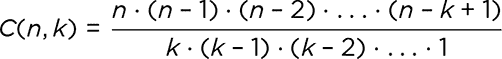

有一个特殊的数列，叫做*阶乘数*，它让我们以更简洁的方式写出*C*(*n*, *k*)的公式。如果 *n* 是一个正整数，*n* 的阶乘（写作 *n*!）是从 1 到 *n* 的每个整数的乘积。例如，3! 是 1 ⋅ 2 ⋅ 3 = 6，5! 是 1 ⋅ 2 ⋅ 3 ⋅ 4 ⋅ 5 = 120。更正式地说：

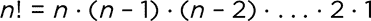

通过查看 *C*(*n*, *k*) 公式中的项序列，可以明显看出其中涉及了一些阶乘的逻辑。通过一些代数运算，我们可以简化公式，使阶乘符号得以应用：

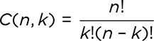

随着 *n* 和 *k* 越大，手动计算阶乘变得非常繁琐。然而，有了 Scratch Cat 的帮助，一切变得轻松自如。

#### 项目 18：从帕斯卡三角形中选一个数字

在本项目中，我们将使用刚刚得到的阶乘定义来计算 *C*(*n*, *k*)，从而让 Scratch 计算给定 *n* 和 *k* 的二项式系数。换句话说，我们将编写一个程序，计算帕斯卡三角形中 *n* 行 *k* 列的数字。图 5-1 展示了如何实现。

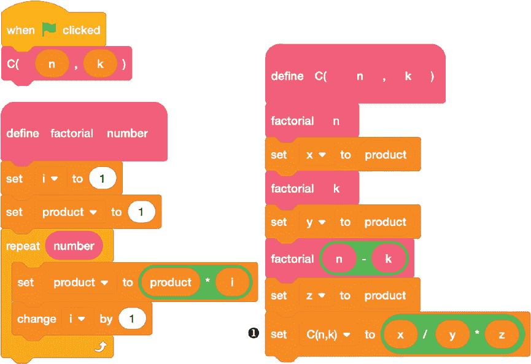

*图 5-1：使用阶乘计算二项式系数*

主程序是本书中最简短的一个：它仅包含一行代码，用于调用计算给定 `n` 和 `k` 的二项式系数的自定义块。该块又调用 `factorial` 计算块，后者接收一个值并计算它的阶乘，使用循环将 1 到该值之间的所有数字相乘。结果存储在 `product` 变量中，我们在块的开始将其设置为 `1`。

我们使用 `factorial` 块三次来计算 `n` 的阶乘、`k` 的阶乘和 `n - k` 的阶乘，将计算得到的 `product` 的值分别存储在变量 `x`、`y` 和 `z` 中。然后，我们计算 `x / y * z` 得到二项式系数 ❶。这就是我们公式的等价表达：

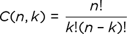

这个程序使用滑块来设置 `n` 和 `k` 的输入。滑块比之前项目中的 `ask and wait` 块更高效地接收输入，并且它们能自动将输入值限制在一定范围内的整数，从而避免了我们必须筛选不适当的输入（如负整数、字符串或带小数的数字）。要为变量创建一个滑块，可以右击舞台上的变量，然后从下拉菜单中选择**滑块**，如图 5-2 所示。

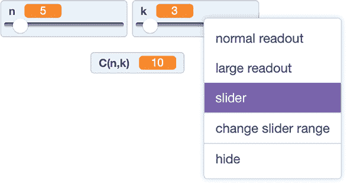

*图 5-2：使用滑块计算* C*(5, 3) = 10*

拖动滑块的圆圈左右移动，会改变相关变量的值，范围可以通过下拉菜单中的更改滑块范围选项来指定。我将滑块范围设置为 *n* 从 1 到 50，*k* 从 0 到 50，但正如我们将要讨论的那样，这些范围可能会对我们计算的某些二项式系数造成问题。

要使用程序，设置滑块为你选择的 *n* 和 *k* 值，然后点击绿色旗帜查看结果的二项式系数。

##### 破解代码

这个程序有一个问题。我在设置披萨派对计数场景时，假设 *k*（允许的客人数量）小于或等于 *n*（总共可选择的人数）。但是，虽然滑块限制了 *n* 和 *k* 为整数，但并没有任何限制阻止我们将 *k* 设置为大于 *n*。

如果我们将滑块设置为这样，当计算(*n* – *k*)!时，我们会传递给`factorial`块一个负数。`repeat`循环不能重复负次数，因此循环会在第一次执行之前退出，而`product`会保持初始值`1`。这会破坏公式，并报告一个奇怪的结果，如图 5-3 所示。

*图 5-3:* C*(5, 6) = ???

修复方法很简单：只需要在主程序中加入一个测试，检查 *k* 是否大于 *n*，如果满足该条件，通知用户输入无效，如图 5-4 所示。

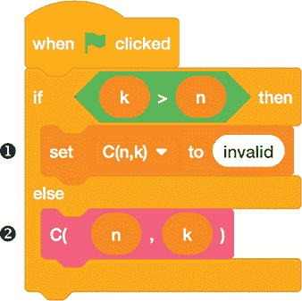

*图 5-4：为* k *>* n 添加检查

请注意，我们使用了一个名为`C(n, k)`的变量❶，同时使用了一个自定义块`C`，该块有`n`和`k`两个输入➋，用来计算一个值并赋给该变量。Scratch 的颜色编码和块的形状帮助我们跟踪哪个是`C(n, k)`。

该程序的另一个问题是，阶乘增长得非常快：18! 是 Scratch 能够可靠计算的最大阶乘值，超过 flintmax 就无法计算了。实际上，由于 *n*! 总是可以被 2 的不同幂次整除，所以在超过 flintmax 后，报告的值仍然是正确的，但当我们计算到 171!时，已经超过了 IEEE 754 浮点标准的总体最大值。此时，Scratch 会放弃计算，报告涉及 171!或更大阶乘的值为`Infinity`（见图 5-5）。

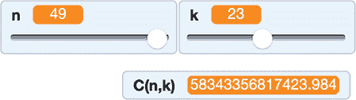

*图 5-5:* C*(171, 18) = ???

即使对于较小的值，IEEE 754 对大于 flintmax 的整数进行四舍五入也会破坏结果并产生非整数值，如图 5-6 所示。

*图 5-6:* C*(49, 23) = ???

公平地说，*C*(49, 23) 的真实值是 58,343,356,817,424，所以 Scratch 的结果已经非常接近，但“非常接近”还不够好。为了让 Scratch 能够继续为更大值的 *n* 和 *k* 找到准确的二项式系数，我们需要采取一种不同的方法，这种方法不涉及阶乘运算。为此，我们可以利用这样的事实：尽管 *C*(*n*, *k*) 公式中的阶乘很快变得很大，但二项式系数本身并不会这么迅速增长。所以，如果我们能够在不先计算任何阶乘的情况下计算二项式系数，我们就能在达到 flintmax 之前走得更远。

### Pascal 的递归

Pascal 三角形中第 *n* 行和第 *k* 列的值是二项式系数 *C*(*n*, *k*)。如果我们能够找到 Pascal 三角形的递归公式——一种基于前一个值生成数组中下一个值的规则——我们就可以在不需要阶乘的情况下计算二项式系数。

对于数组，我们在决定应该使用哪些前一个元素来指定递归时有很大的灵活性。这里的“前一个元素”可以是早期行中的值，也可以是同一行中的早期值。我在最初的描述中提到了 Pascal 三角形的递归：每个值是直接上方两个相邻值的和。以下是如何将其写为递归的方式：

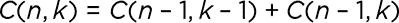

为了理解为什么这个方法有效，我们可以将 Pascal 三角形中的每个值 *C*(*n*, *k*) 解释为一个子集计数问题的答案。我们不再考虑披萨派对上的客人，而是思考在 (1 + *x*)^(*n*) 中如何从 *n* 个因子中选择 *k* 个 (1 + *x*) 因子的组合方式。每种选择 *k* 个因子的方式都会将一个 *x*^(*k*) 加到总和中。

例如，假设我们想展开 (1 + *x*)⁴ 并查看 *x*³ 的系数应该是多少。这就是二项式系数 *C*(4, 3)。当我们展开 (1 + *x*)(1 + *x*)(1 + *x*)(1 + *x*) 时，在每个 (1 + *x*) 因子中，我们可以选择 1 或 *x* 来进行相乘。为了得到 *x*³ 项，我们需要选择一次 1 和三次 *x*。我们可以选择第一个因子的 1，或者第二个因子的 1，或者第三个因子的 1，或者最后一个因子的 1，因此有四种方法可以得到 *x*³。这使得 *C*(4, 3) = 4。

现在只考虑 *n* – 1 次重复的 (1 + *x*) 因子。对于 (1 + *x*)^(*n* – 1)，二项式系数列在帕斯卡三角形的 *n* – 1 行。如果我们想从 *n* – 1 行到 *n* 行，我们需要再乘一个 (1 + *x*) 的额外因子。同样，我们需要选择 (1 + *x*) 中的 1 或 *x* 进行乘法运算。有两种可能性：要么我们在选择 (1 – *x*)^(*k* – 1) 的因子时，已经有了 *k* 次 *x*，此时我们乘上额外因子的 1，要么我们有 *k* – 1 次 *x*，此时我们乘上额外因子的 *x* 来得到 *k* 次 *x*。这种计算给出了我刚才提到的递归关系，我们可以用它逐行构建三角形：

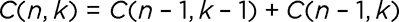

再次强调，这一切意味着，为了得到帕斯卡三角形中的一个条目，我们只需要将它上面两个数字相加。

这个递归关系帮助我们理解我们为 *C*(4, 3) 计算出的值 4。首先，我们回退到三角形中的一行，从第 4 行回到第 3 行，对应 (1 + *x*)³ 的展开系数。然后，我们可以选择该行中由 *C*(3, 2) 计算的 *x*² 项，并将其乘以 *x*，或者选择该行中由 *C*(3, 3) 计算的 *x*³ 项，并将其乘以 1。只有这两种方式可以在第 4 行生成 *x*³ 项。这意味着 *C*(3, 2) + *C*(3, 3) = *C*(4, 3)。

#### 项目 19：帕斯卡三角形，逐行计算

图 5-7 显示了一个 Scratch 程序，用来计算帕斯卡三角形的第 *n* 行，使用我们刚刚讨论的递归关系。

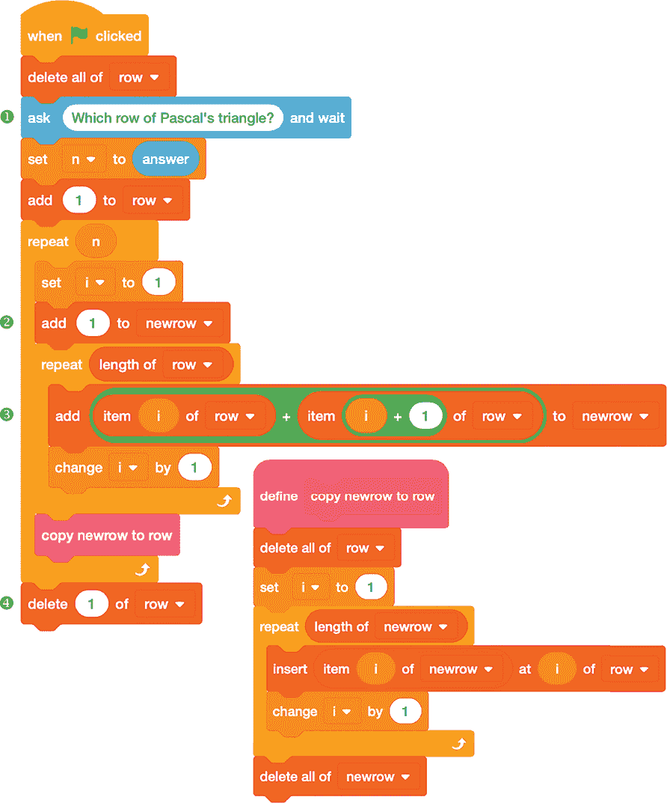

*图 5-7：逐行计算帕斯卡三角形*

首先，我们询问要计算的行号 ❶。然后，我们进行相应次数的循环，逐行处理到该行。我们使用两个列表来跟踪值：`row` 是数组中的前一行，`newrow` 是当前正在计算的行。我们从每一行开始时都会放入一个 `1` ➋，然后将 `row` 中每一对相邻的值相加，得到 `newrow` 中的下一个值 ➌，正如我们递归关系所规定的那样。在每次循环结束时，自定义的 `copy newrow to row` 块会将 `newrow` 复制回 `row`，为下一次迭代做准备。

##### 结果

图 5-8 显示了该程序的一个示例运行，*n* = 8 时的结果。

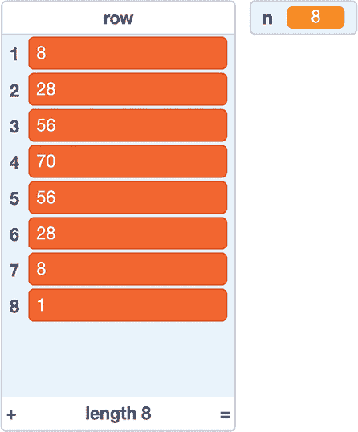

*图 5-8：帕斯卡三角形的第 8 行*

请注意，由于 Scratch 列表的索引从 1 开始，而不是从 0 开始，因此输出中没有列出第一个元素 *C*(8, 0) = 1。它*确实*被计算了，但我们在程序结束时删除了它 ➍。这样，Scratch 的索引号与给定行的 *k* 值相匹配。只需要想象在列表的开头有一个额外的 1，位于索引 0 处。

通过这种方法，我们可以在计算精确的二项式系数时走得更远。事实上，直到到达帕斯卡三角形的第*n* = 56 行时，我们才会超过 flintmax。在那里，*k* = 25 的值是错误的（但*k* = 26、27 和 28 的值是正确的）。我们直到超过第 1000 行时，才会看到任何二项式系数报告为`Infinity`。

#### 项目 20：绘制帕斯卡三角形

理解帕斯卡三角形的一种方式是思考每一行的二项式系数如何分布。例如，我们可以观察到，值是围绕行的中心对称分布的：1-2-1，1-3-3-1，1-4-6-4-1，依此类推。

从数学角度看，我们可以通过注意到帕斯卡三角形第*n*行第*k*列的值与同一行第*n* – *k*列的值相同来表达每一行的对称性。换句话说，*C*(*n*, *k*) = *C*(*n*, *n* – *k*)。我们可以通过回顾本章早些时候讨论的帕斯卡三角形的子集计数解释来验证这一观察。要从*n*个元素中创建一个包含*k*个元素的子集，我们可以指定哪些*k*个元素应包含，或者哪些*n* – *k*个元素应*不*包含。

另一个有趣的观察是，帕斯卡三角形第*n*行的二项式系数之和为 2^(*n*)。例如，在第*n* = 3 行时，1 + 3 + 3 + 1 = 8，或者 2³，而在第*n* = 4 行时，1 + 4 + 6 + 4 + 1 = 16，或者 2⁴。这也与子集计数的解释相关：一个包含*n*个元素的集合共有 2^(*n*)个子集，因为对于每个*n*个元素，存在两个选择：包括该元素或不包括该元素。

另一个值得注意的特征是，每一行的值都是*单峰的*，这意味着它们先是较小，朝着中间的最大值增加，然后再变小。我们可以通过观察数字本身来发现这些特征，但像值的对称性和单峰结构这样的特征，通过将帕斯卡三角形的行可视化为条形图会更容易观察到。条形图，也称为*直方图*，是一种图表，其中每个条目的值由条形的高度表示。例如，图 5-9 显示了一个条形图，表示帕斯卡三角形第*n* = 10 行的值。请注意条形高度的对称性。

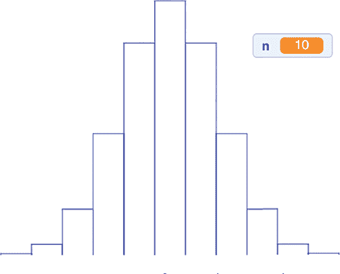

*图 5-9：帕斯卡三角形第 10 行*

要绘制像这样的条形图，从项目 19（图 5-7）开始，该项目用于计算帕斯卡三角形的一行。然后，添加图 5-10 中所示的自定义`draw histogram`模块。它使用来自 Pen 扩展的模块为每个行中的值绘制一个条形。务必在删除行开头的`1`之前插入此自定义模块（图 5-7 ➍），否则对称性将被破坏。

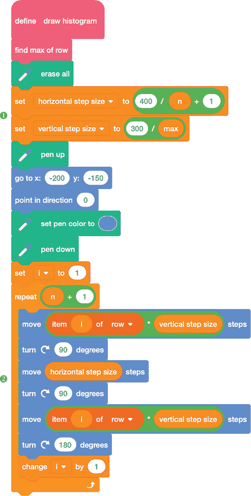

*图 5-10：从一行绘制条形图*

`draw histogram` 块首先从帕斯卡三角形程序中获取 `row` 列表，并使用自定义的 `find max of row` 块（见图 5-11）找到其中的最大值。根据这个最大值，我们计算 `horizontal step size` 和 `vertical step size`，确保图形能够适应舞台 ❶。然后，我们使用循环 ➋ 一次画一个条形图，根据 `row` 中对应的值向上移动，按条形的数量水平移动，然后再回到起始位置开始下一个条形。

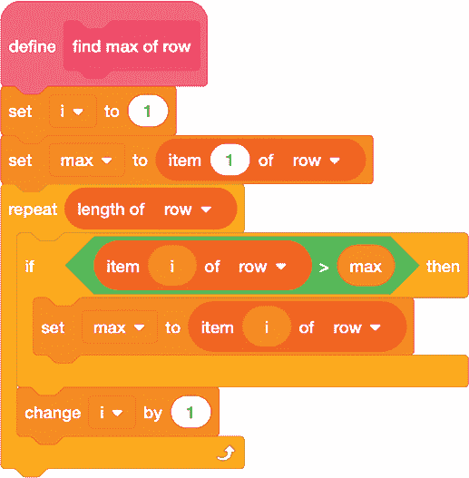

*图 5-11：寻找最大行元素*

`find max of row` 块简单地遍历 `row` 中的所有值，每当找到更高的值时，就更新 `max` 变量。

##### 结果

图 5-12 显示了三角形的另外两行条形图。

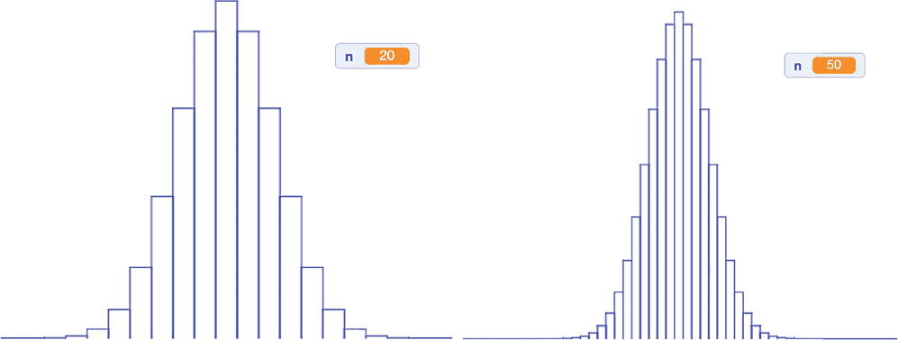

*图 5-12：帕斯卡三角形的第 20 行（左）和第 50 行（右）*

不论是哪一行，条形图的形状看起来都很相似。事实上，随着 *n* 的增加，图形越来越接近著名的正态分布的钟形曲线。

##### 破解代码

新的 `draw histogram` 块足够通用，能够为除帕斯卡三角形行之外的其他数据集绘制条形图。例如，图 5-13 中的代码提示用户输入一系列数字——类似于我们在项目 17 中做的那样（图 4-16），当时我们正在使用差分表——然后调用 `draw histogram` 块来可视化这些数据。

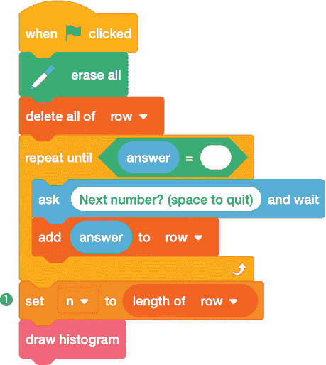

*图 5-13：从数据集中创建条形图*

`draw histogram` 块期望数据以一个名为 `row` 的列表的形式存在，且长度为 `n`。只要你的程序具备这些特性，条形图代码就能正常工作。如果你只有 `row`，那么在绘制条形图之前，你需要提供 `n` ❶。

 编程挑战

**5.1** 你可能会注意到，在 *n*! 的值表中，对于较大的 *n* 值，*n*! 的值将以多个零结尾。编写一个程序来预测给定 *n* 时会有多少个零。特别是，你能预测 25! 的值将以多少个零结尾吗？

**5.2** 编写一个程序，通过沿对角线向下遍历，从帕斯卡三角形中提取数列。利用它来考虑帕斯卡三角形中的对角线，该对角线包含 *C*(*n*, 2) 的值。根据我们在第四章中讨论的数形数字，识别这一数列。

**5.3** 作为一个整数，二项式系数的值可以是偶数或奇数。修改帕斯卡三角形的行递推程序（项目 19），使其仅显示 0 或 1，取决于二项式系数是偶数还是奇数。看看你能找到什么样的模式。

### 操作表有所有答案

*操作表*是一个值表，显示在不同输入组合下数学运算的结果。例如，你可能通过乘法表（乘法口诀表）学习了基本的乘法。此类操作表通常有九行九列，它提供任何乘法问题的答案，其中被乘数和乘数通过行和列来表示。例如，如果你想计算 6 乘 7，你会在顶部的行（索引行）中找到 6，然后在左侧的列（索引列）中找到 7。列 6 和行 7 交叉处的值是 42。

我们不可能为所有正整数创建一个完整的乘法表，因为它们是无限的。然而，通常用于单个数字的九乘九乘法表包含了我们计算更长数字乘积所需的所有信息。将这种情况与我们在第二章中讨论的模运算做比较。一旦你选择了一个模数，比如*n*，那么重要的只是一个数字除以*n*后的余数。余数的可能值只有*n*个，从 0 到*n* - 1。这意味着基于模运算的任何操作表都会有一个有限的条目数，一个*n*乘*n*的表格会包含所有可能的条目。

有限操作表，包含行和列，符合数组的定义。在下一个项目中，我们将使用 Scratch 生成给定模数的操作表，然后看看我们能发现哪些模式。

#### 项目 21：使用模运算生成无限操作表

我们的程序会提示用户输入一个模数*n*，然后询问他们选择哪种操作：加法还是乘法。接着，它会构建一个*n*乘*n*的表格，展示所选操作下的所有可能结果，模*n*。例如，假设模数是 7。加法表应该显示从 0 到 6 的每一对数字的和，取模 7。例如，列 6 和行 2 交汇处的条目应该显示(6 + 2) mod 7，结果是 1。乘法表则对乘法执行相同操作：列 6 和行 2 交汇处的条目应该显示(6 ⋅ 2) mod 7，结果是 5。

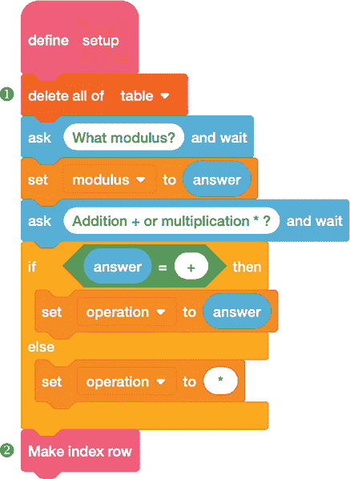

*图 5-14：询问模数和操作类型*

我们将把表格的每一行构建为 Scratch 列表中的一个条目，列表名为`table`。首先，我们需要一些自定义积木来帮助我们整理。图 5-14 展示了`setup`积木，它在程序开始时被调用。

在`setup`积木中，我们首先删除任何先前版本的`table` ❶。然后，我们提示用户输入`modulus`（一个整数）和`operation`（`+` 或 `*`）。一旦得到这些信息，我们调用`Make index row`积木 ➋，如图 5-15 所示。

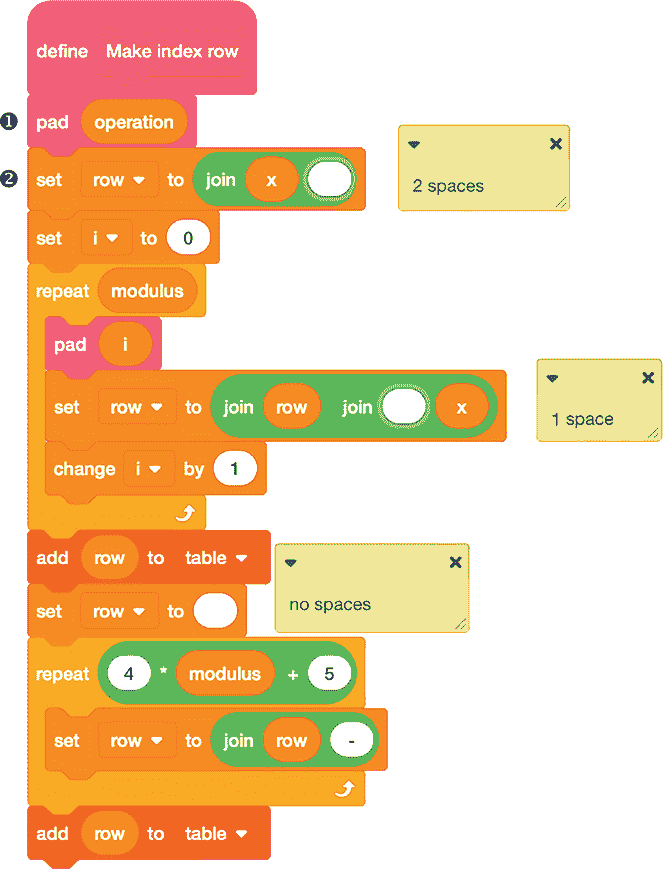

*图 5-15：构建操作表的索引行*

`Make index row`块在表格的顶部添加了一个索引行，包含列的标签，从 0 到不包括模数，同时附有一个`+`或`*`符号，表示是加法还是乘法。我们通过一系列`join`块将行内容构建为一个字符串，保存在`row`变量中。我们还添加了一行额外的破折号，以帮助区分列索引标签和表格本身的内容。

这块中的大部分工作都集中在使表格看起来整齐，无论列中包含的是一位数还是两位数，都能均匀地间隔。为了帮助排版，我们使用了自定义的`pad`块❶（在图 5-16 中定义），它根据字符串的长度在给定的字符串前添加一个或两个空格，确保每列中的所有数字能够整齐排列。如果我们知道需要多少空格来使数字对齐，可以直接将它们放进去，就像我们在索引行➋中做的那样；但如果不知道，最好让程序来决定。

**注意**

*这两个* set x *命令位于* pad *块中，看起来相同，但实际上是不同的。第一个命令执行时* x *的长度为 1，其中有两个空格，而底部的命令执行时* x *的长度为 2，其中只有一个空格。*

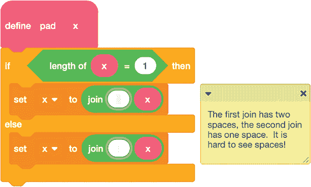

*图 5-16：为字符串填充一个或两个空格*

现在我们有了所有这些辅助块，我们可以构建一个格式良好的操作表，主程序代码在图 5-17 中。

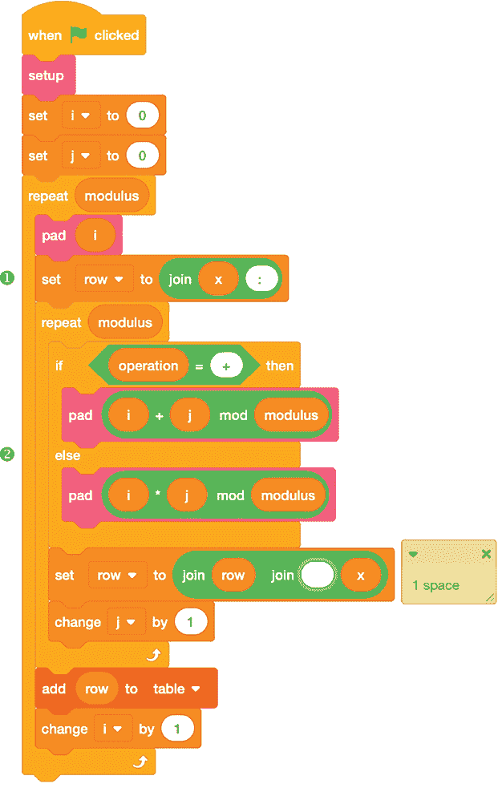

*图 5-17：一次构建一行的操作表*

在调用`setup`块后，我们使用两个嵌套循环按行构建操作表。外循环递增变量`i`，表示当前行的索引号，而内循环递增变量`j`，表示行内列的索引号。每行以该行的索引号开始，后跟一个冒号 ❶。这是必要的，因为 Scratch 中的列表索引从 1 开始，而为了我们的目的，从 0 开始编号行和列会更自然。

真实的工作是在内循环的`if...else`块内完成的➋。根据所需的操作，我们计算`i + j`或`i * j`，并对结果取`mod`，从而得到操作表中的当前条目。再次使用`pad`块，在将条目加入正在构建的行之前，添加适当数量的空格。在外循环的每个周期结束时，我们将拥有一行完整的数据，并将其添加到`table`列表中。

##### 结果

图 5-18 显示了小模数*n* = 7 的加法和乘法表。

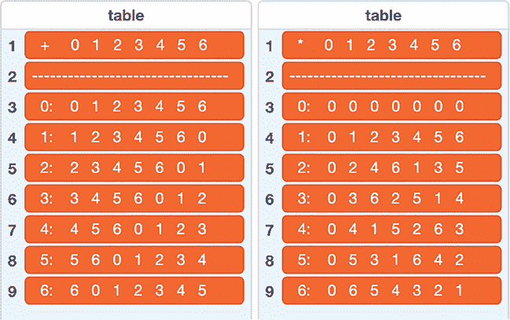

*图 5-18：模 7 的运算表*

注意，每个表格从一个索引行开始，显示列的标签，从 0 到 6\. 表格左侧还有一个索引列，显示行的标签（同样是从 0 到 6）。

使用这些表格，我们可以找到任意两个整数的和或积，模 7。例如，假设我们要计算(152 + 263) mod 7\. 首先，我们需要对每个输入数进行模 7 运算：152 mod 7 是 5，263 mod 7 是 4\. 接下来，我们在加法表中查找列 5 与行 4 的交点。交点处的值是 2，所以答案就是 2。通过这种方式，尽管表格只有七行七列，但它们可以给出任何正整数的答案。我们只需先对整数进行模 7 运算。

在这些模 7 运算表中，有几个模式可以观察到：

 对于加法表（见图 5-18 左侧），值是逐行循环的，每行的值向左移动一列，从一行到下一行。每一行最左边一列的值会回绕，成为下一行最右边一列的值。

 加法表中第 0 行的值与表格的索引行的值相匹配。这表明 0 是*加法单位元*：将 0 加到一个数上不会改变这个数。就 0 而言，模加法与普通加法完全相同。

 一个数*n*的*加法逆元*是需要加到*n*上得到 0 的数。在普通加法中，一个数的加法逆元是该数的相反数。例如，3 的加法逆元是-3。 然而，在模运算中，我们不需要使用负数来表示加法逆元。注意，在加法表的每一行都有一个 0。这意味着无论从哪个数开始，我们都能找到一个正数加到它上面得到 0。也就是说，每个数都有一个加法逆元，针对一个特定的模数。例如，第 3 行在第 4 列有一个 0，所以 3 + 4 = 0 mod 7。

 对于乘法表（见图 5-18 右侧），第 1 行的值与索引行的值相匹配。这意味着 1 是*乘法单位元*：将一个数乘以 1 不会改变这个数。从这个意义上说，模乘法就像常规乘法一样。

 在乘法表中，每一行和每一列都有一个 1，除了第 0 行和第 0 列。也就是说，每个非零数都可以与另一个数相乘，这个数叫做*乘法逆元*，它的乘积是 1 mod 7。

这些观察不仅仅适用于模 7；它们对任何模数都适用。试着用其他模数运行程序，你会看到相同的模式。

##### 破解代码

当你开始为更大的模数制作运算表时，你会发现每一行的内容将不再适合显示在 Scratch 舞台上。不过，完整的表格仍然存在于后台。如果你想一次性查看完整表格，你可以将`table`列表导出到文本文件中，并在文本编辑器或其他程序中打开，正如第二章中讨论的那样。表格如果使用*等宽*字体（如 Courier）查看会更清晰，其中每个字符的宽度相同，因此所有列都会对齐。例如，图 5-19 显示了模 12 下的乘法运算表的导出版本。

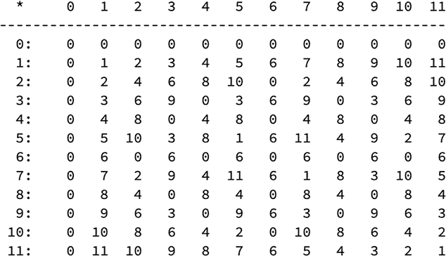

*图 5-19：模 12 的乘法表*

请注意，这个表格在某些行和列中包含多个 0。第 0 行和第 0 列中的 0 是可以预期的：乘以 0 总是得到 0。其他的 0 则更有趣。它们的出现是因为 12 不是一个质数。12 的每一种因式分解（事实上，任何 12 的倍数的因式分解）都会给出两个数，它们的乘积能被 12 整除，因此它们的乘积对 12 取模结果为 0。例如，在第 4 行，我们在第 0 列、第 3 列、第 6 列和第 9 列都有 0。实际上，4 ⋅ 3、4 ⋅ 6 和 4 ⋅ 9 都是两个数相乘得到 0 mod 12 的例子，尽管最初这两个数都不是 0 mod 12。这些值被称为*零因子*，它们在实数的算术中并不存在。它们仅存在于模运算中，并且只有当模数不是质数时才会出现。

如果我们划掉所有有额外 0 的行和列，如图 5-20 所示，剩下的未被划掉的值就形成了一个更小、更简化的乘法表。

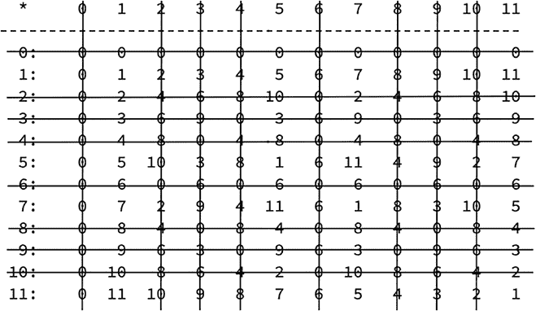

*图 5-20：模 12 的简化乘法表*

我们剩下一个 4×4 的值表，行和列的索引分别是 1、5、7 和 11。这个较小的表格中每一行和每一列都有一个 1，这意味着剩下的数都有乘法逆元。

 编程挑战

**5.4** 如果两个数除了 1 以外没有共同因子，则称它们为*互质*。例如，6 和 35 是互质的，但 35 和 49 不是（它们都能被 7 整除）。请重写运算表的代码，使其能够为给定的模数*n*生成一个简化的乘法表，该表仅包括与*n*互质的数对应的行和列。例如，对于模 12 的乘法运算，它应生成一个只包括图 5-20 中未被划掉的四行四列的表格。如果给定的模数是一个质数*p*，它应生成一个(*p* – 1)*×*(*p* – 1)的表格，省略第 0 行和第 0 列。

**5.5** 一个质数*p*的*原根*是一个数，它的各次幂对*p*取模时能够生成从 1 到*p* – 1 的所有整数。例如，2 是 11 的原根，因为：

 2¹⁰ = 1,024，且 1,024 mod 11 = 1

 2¹ = 2

 2⁸ = 256，且 256 mod 11 = 3

 2² = 4

 2⁴ = 16，且 16 mod 11 = 5

 2⁹ = 512，且 512 mod 11 = 6

 2⁷ = 128，且 128 mod 11 = 7

 2³ = 8

 2⁶ = 64，且 64 mod 11 = 9

 2⁵ = 32，且 32 mod 11 = 10

另一方面，2 不是 7 的原根，因为 2 的模 7 次幂只有 1、2 和 4。编写一个程序，要求输入一个素数 *p*，并返回找到的第一个原根。

**5.6** 电子表格程序如 Excel 可以轻松导入文本文件，只要文件是 CSV 格式。该格式要求每行输入数据中的每个条目之间用逗号分隔。修改 Scratch 中运算表的代码，使导出的文件格式符合这种要求。

### 结论

数组是二维的数字表格，通过行和列来索引。表格中一个条目的位置提供了两项信息——行号和列号——这些信息有时可以用来在公式中确定该表格条目的值。Scratch 没有内置的 `array` 类型，但你可以使用列表来表示数组，每个值包含某一行的所有数组元素，正如我们在构建运算表时所做的那样。另一种表示数组的方法是为数组的每一行构建一个列表，就像我们为帕斯卡三角形所做的那样（一个列表的列表）。如何表示数组取决于你想如何使用它。Scratch 非常灵活，能够满足你想做的任何操作！
