## **6**

## **制作密码，并破解它们**

假设你有一个秘密，想要与朋友分享。你可以把它写下来并传递给他们，但别人可能会看到。或者你可以悄悄地告诉他们，但也许有人会偷听。想象一下，如果任何拦截你信息的人都无法理解它，那该多好。一个秘密的密码！

在本章中，我们将使用 Scratch 来练习*密码学*，即秘密编码的艺术。我们将编写程序，使用几种不同的密码技术，考虑它们的优缺点，并用它们来编码信息。然而，写下加密信息只是工作的一半。必须有一种方法可以撤销这个编码，否则*没有人*能读取它，甚至包括你希望阅读的人。我们也将探讨故事的另一面，看看如何解码秘密信息。

### 凯撒的移位密码

秘密编码在军事应用中非常重要，因为指挥官需要一种方法来让前线的士兵了解他们的作战计划，最好是在计划落入敌人手中时不会被揭示。罗马将军尤利乌斯·凯撒被认为发明了最早的已知信息加密方法，正是出于这个目的。故事是这样的：凯撒在与士兵通信时使用了一种简单的替换系统，在这个系统中，消息中的所有字母（我想是用拉丁语写的）都被移位了三位。因此，如果消息中有一个 A，它会被替换为 D，每个 B 会被替换为 E，以此类推。这种通过字母表移位创建加密消息的方法如今被称为*凯撒密码*。移位不一定是三位；任何位移都能将可读的消息变成完全没有意义的内容。

*密码*是一个古老的词，用来表示一种程序或谜题。以前，算术运算被称为*密码运算*，因为大乘法或长除法中的数字操作看起来像一个复杂的谜题。将信息转换成一种伪装形式（*加密*）并从加密形式恢复原始信息（*解密*）的过程也像是在解谜，因此今天*密码*更多地指代一种编码。

凯撒密码的谜题可以通过一个双行表格来解决。一行显示从 A 到 Z 的字母表，另一行显示字母表经过适当位移后的结果：

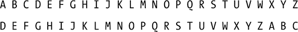

将表格的行围绕成一个圆圈有助于表示，当我们到达字母表的末尾时，应该重新回到字母表的开头。想象两个圆圈，一个是内圈字母表，一个是外圈字母表，如图 6-1 所示。

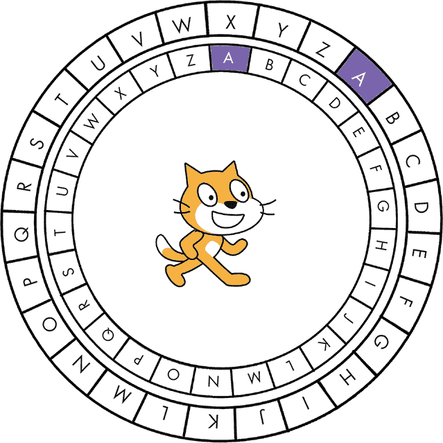

*图 6-1：围绕圆圈进行移位*

如果这些圆圈能够独立旋转，那么它们可以用来展示带有不同移位的凯撒密码。你可以制作这样的工具，手动加密和解密消息，每次一个字母。但为什么要做这么多工作呢，Scratch 可以为你完成这些任务。

#### 项目 22：通过凯撒移位加密

在这个项目中，我们将使用 Scratch 来自动化凯撒密码加密消息的过程。首先，我们将字母表放入一个列表中，使用图 6-2 中显示的自定义块。这样，我们就可以通过使用索引这些字母的数字来操作字母。

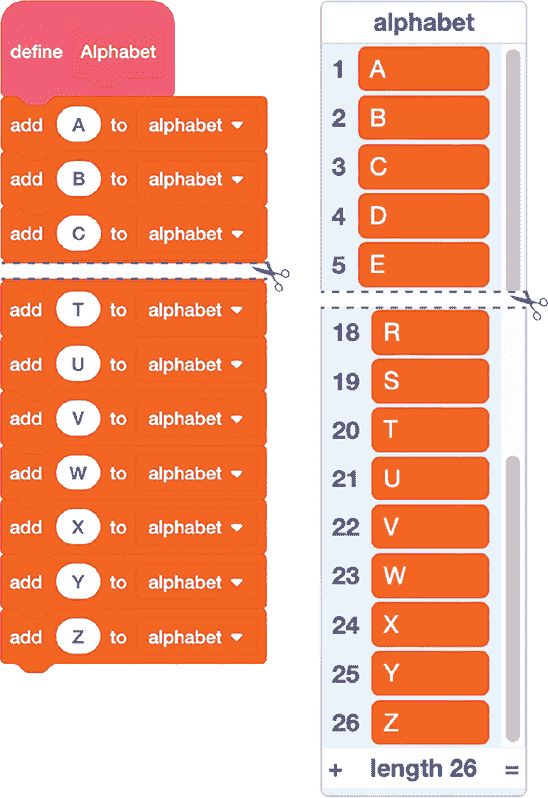

*图 6-2：将字母表放入列表中*

自定义的 `Alphabet` 块通过一次添加一个字母，构建名为 `alphabet` 的列表。如果需要，你可以将字母表扩展到包括其他符号，比如空格、数字和标点符号，但现在我们先保持字母表只有 A 到 Z 的 26 个字母。

接下来，我们将创建一个名为 `Initialize` 的自定义块来设置程序（见图 6-3）。

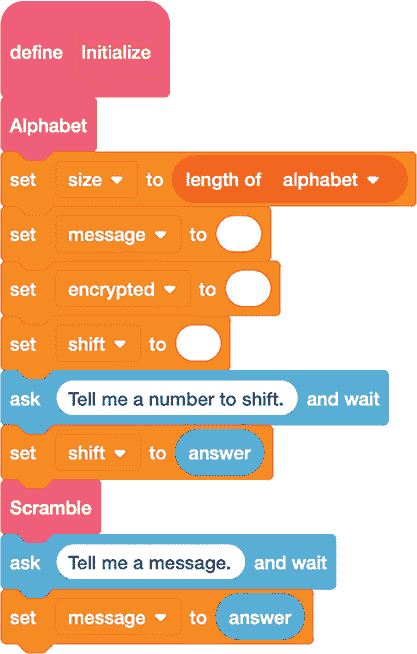

*图 6-3：凯撒密码的设置代码*

在这个块中，在调用 `Alphabet` 后，我们根据所选字母表中的字符数定义 `size`。接着，我们提示用户输入移位大小和要加密的消息。然后，使用自定义的 `Scramble` 块（如图 6-4 所示）根据所选的移位大小构建一个打乱的字母表。

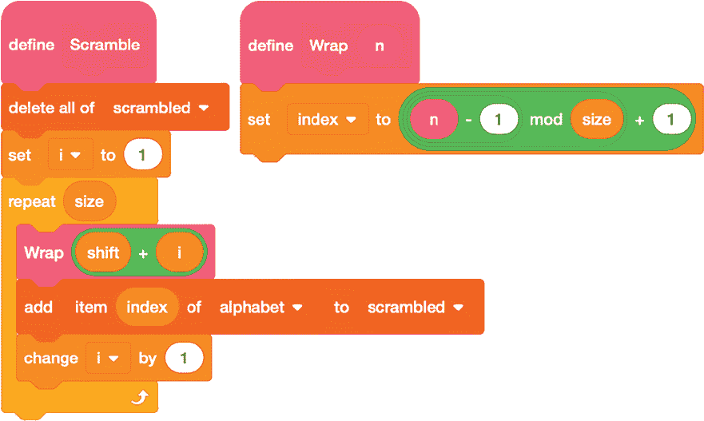

*图 6-4：构建一个打乱的字母表*

`Scramble` 块通过对原始 `alphabet` 列表中的每个字母应用移位，构建一个名为 `scrambled` 的列表。从理论上讲，`scrambled` 列表中索引为 `i` 的字母应该与 `alphabet` 列表中索引为 `shift + i` 的字母相同。但事情并没有那么简单，因为有时我们需要回绕到字母表的起始位置。自定义的 `Wrap` 块（也如图 6-4 所示）使用 `mod` 来在必要时重新计算索引。由于模运算期望从最小值 0 开始，而 Scratch 列表的索引从 1 开始，因此我们需要在取 `mod` 之前减去 1，然后再将结果索引加回 1。

**注意**

*加密代码被拆分为一个独立的块，这样我们可以方便地在后续程序中修改加密方法。我们需要做的只是改变如何构建打乱的加密字母表。*

图 6-5 显示了主要的程序栈。

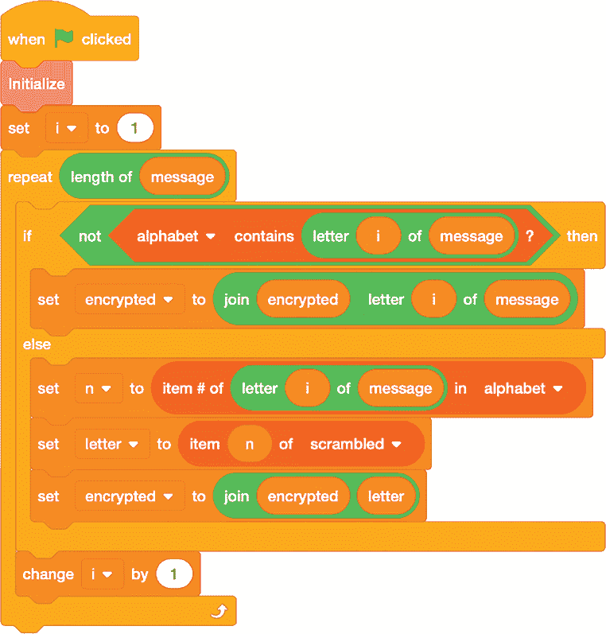

*图 6-5：凯撒密码的主要代码*

在调用`Initialize`后，我们逐个字符地遍历提供的消息。`if...else`语句块检查当前消息字符是否包含在`alphabet`中。如果包含，程序会查找对应的移位字符，并将其添加到`encrypted`变量中的加密消息。如果字符不在字母表中——例如，如果是空格或标点符号——程序则将该字符原封不动地传递到加密消息中。

##### 结果

图 6-6 展示了该程序运行的两个示例结果。

*图 6-6：加密和解密一条消息*

在左侧，我们指定了移位数为 3，以加密消息“hello!” Scratch 将字符视为大写字母，因此当每个字母移位 3 个位置时，我们得到加密后的消息“KHOOR!”。按照我们编写的程序，标点符号不会发生变化。

这个程序（以及凯撒密码本身）的一大便利功能是，它不仅可以用来加密，还可以用来解密。右侧的输出展示了我们如何将加密后的消息“KHOOR!”再移位 23 位，从而恢复原始消息“HELLO!”（现在全部为大写字母）。由于字母表大小为 26，初始移位 3 后，再移位 23 就回到了 26，即没有移位。输入第二次移位为-3 而不是 23 也是有效的，因为在模 26 的情况下，往回移动 3 步或向前移动 23 步，结果是一样的。

##### 破解代码

由于非字母字符不会被加密，我们的代码保留了单词间的空格，即使单词本身被打乱。这有时会成为破译的线索，提供原始消息内容的提示：例如，一个单字可能是*a*或*I*，而*the*和*and*是最常见的三字词之一。如果将空格字符也包括在字母表中，它将有助于隐藏这些线索，使加密消息中的原始单词分隔不那么显眼。（此外，如果字母表的大小是素数，某些加密技术会更有效；这也是将空格和其他几个标点符号加入字母表的另一个原因！）

幸运的是，我们编写的代码使得它无论字母表的长度如何都能正常工作，因此添加额外字符非常简单。将字母表重新计算回起始位置所需的模运算依赖于`size`变量，这个变量根据程序开始时`Alphabet`列表的长度进行设置。这样，如果字母表发生变化，模运算会自动调整。

这里有一个可能的改进：经过几次加密和解密后，你可能会发现你想要有一个记录 Scratch 所做工作的历史。很容易添加一个*日志*，将程序的所有输入和输出集中记录在一个地方。你只需定义一个名为`log`的列表，然后添加一些代码块（如图 6-7 所示）将数据写入该列表。由于列表的内容可以保存到文件中，保持这个日志使得将加密的消息复制到另一个程序（如文本编辑器或电子邮件客户端），或重新输入到 Scratch 程序中的输入框进行进一步处理变得非常简单。

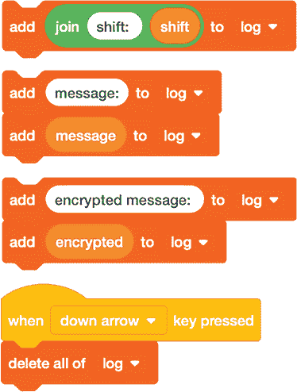

*图 6-7：添加日志文件*

要创建日志文件，添加图 6-7 中所示的前两个代码块栈，将`shift`和`message`的值记录到`Initialize`块（图 6-3）的末尾。然后，将第三个代码块栈，记录加密消息，添加到主程序栈（图 6-5）的末尾。图 6-7 中的最后一个栈在按下向下箭头键时会清除日志。你可以利用这个功能来掩盖你的痕迹，或者在日志变得太长时重置它。

图 6-8 展示了当我们通过-3 而不是 23 的移位解密“KHOOR!”时，日志的样子。

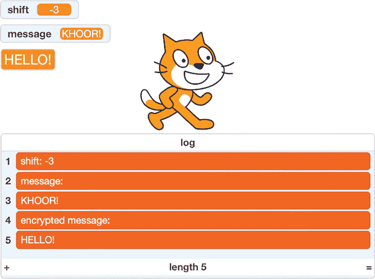

*图 6-8：对“HELLO!”的另一种解密方式*

因为`log`列表只有在按下向下箭头键时才会重置，它会在程序的多次运行中继续存储值，即使`shift`、`message`和`encrypted`的值被覆盖。

#### 项目 23：破解凯撒密码

凯撒密码在当时是有效的，也许因为大多数人都不太懂阅读。但实际上，这并不是一种非常安全的加密方法。如果你有一条消息，并且知道它是通过移位加密的，你只需要通过所有可能的移位因子来传递消息，其中一个将给你解密后的文本。可能的移位数目仅为字母表的大小——在这种情况下，是 26。正如我们在这个项目中将看到的，Scratch 几乎可以瞬间完成所有可能性的计算。

要创建一个自动解密使用凯撒移位加密的消息的程序，保留前一个项目中的支持代码块，但修改主程序的`when clicked`程序栈，如图 6-9 所示。这个更新的代码将生成一个列表，应用所有可能的移位到加密消息。当你滚动查看列表时，合适的移位和解码结果应该会立即显现。

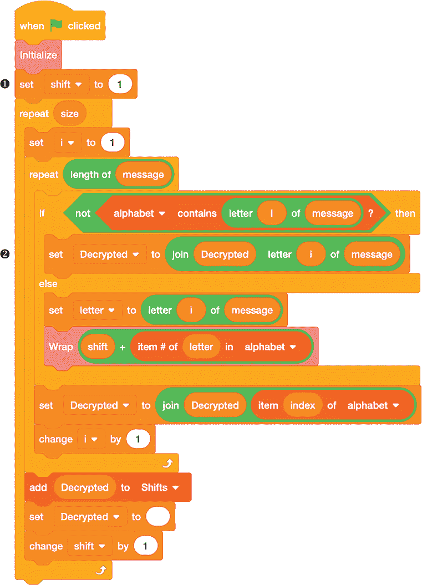

*图 6-9：进行所有可能的移位*

我们从初始的`shift`值为`1` ❶开始，使用一个循环逐步位移整个字母表。然后，使用内部循环遍历消息中的字母，并使用当前的位移因子对其进行解码。在内部循环结束时，我们得到了一个可能的解密消息，并将其添加到`Shifts`列表中。与之前的项目一样，我们使用`if ... else`模块，如果字母不在字母表中，就让其原封不动地通过 ➋。

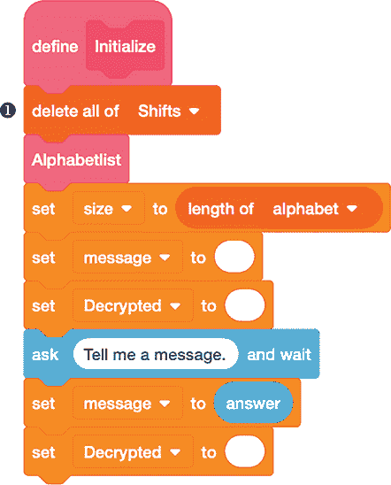

*图 6-10：初始化破解程序*

我们还需要修改前一个项目中的`Initialize`模块，如图 6-10 所示。

这个更新后的`Initialize`模块通过删除之前的内容来管理`Shifts`列表 ❶。我们仍然提示输入消息，但不再需要提示输入位移，因为代码会自动生成所有可能的位移。

##### 结果

假设你截获了消息“UVA CLYF DLSS OPKKLU, DHZ PA？”将其输入解密程序（你可以复制粘贴或手动输入）以发现图 6-11 中的消息。

解密后的消息位于`Shifts`列表的第 19 行，这告诉我们需要使用 19 的位移来恢复消息。所以原始消息必须是使用 26 – 19 = 7 的位移进行加密的。使用 7 的位移，N 变成 U，O 变成 V，T 变成 A（绕回），依此类推。

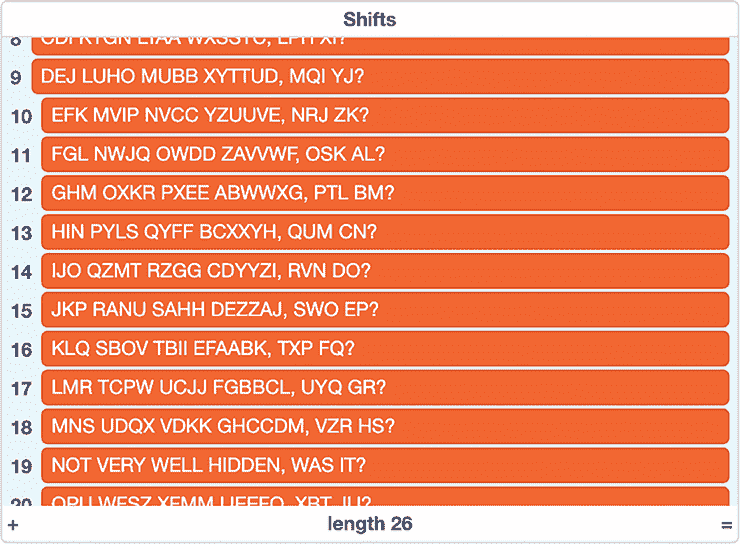

*图 6-11：揭示一个位移后的信息*

 编程挑战

**6.1** 使用 Scratch 中的图形设计一个凯撒密码魔法解码戒指。该程序应像图 6-1 中的戒指一样进行动画演示，使得位移后的字母与未位移的字母对齐。

**6.2** 在电影*2001 太空漫游*中，感知计算机 HAL 控制着一艘载有两名宇航员前往木星执行任务的宇宙飞船，并试图谋杀船员。对“HAL”应用 1 的凯撒位移，看看是否能发现隐藏的关于谁制造了它的秘密信息。

**6.3** 如果幸运的话，凯撒位移可以在不同语言之间进行转换！对“yes”应用 16 的位移，将其翻译成法语。

**6.4** 找到凯撒位移解密消息“DROBO GSVV LO K RYD DSWO SX DRO YVN DYGX DYXSQRD！”

### 更多的替换密码

凯撒密码是一种*替换密码*的示例，在这种密码中，字母表中的每个字母都被替换为另一个字母。实际上，替换密码通过混淆字母表，使得曾经可读的单词看起来陌生。使用凯撒密码时，我们通过将所有字母按设定的位数进行位移来进行混淆，但任何其他混淆技巧同样适用于加密文本。实际上，我们最初的凯撒密码程序的一个优点是，它的主要栈（图 6-5 中的代码）可以与任何混淆字母表一起使用，而不仅仅是通过位移生成的字母表。我们可以修改`Scramble`块（图 6-4）以某种方式构建`scrambled`列表，程序将相应地对消息进行编码。

如果我们不局限于位移，那么有多少种混淆的可能性呢？嗯，我们有 26 种选择来决定字母 A 变成什么，然后是 25 种选择来决定 B 变成什么，C 有 24 种选择，依此类推。总的来说，这给我们提供了 26!（26 的阶乘）种排列方式，或者超过 400 千亿亿（4 ⋅ 10²⁶）种混淆字母表的方式。凯撒密码仅考虑其中的 25 种排列方式（假设你不想使用 0 的位移）。

凯撒密码的优势在于，只需要一个数字——位移因子——就能确定混淆字母表。换句话说，如果你想给朋友提供解码你位移信息的密钥，你所需要做的就是将这个数字悄悄告诉他们。加密本质上是通过位移因子进行加法，而解密则是撤销加法。你可以通过减去*s*或加上 26 – *s*来撤销*s*的位移。相比之下，如果你想让你的朋友了解其他混淆方案（可能是从 26!个可能的排列中随机选择），你需要提供 25 个独立的信息，才能让他们知道如何解码你的信息。你得说清楚从 A 到 Y 每个字母变成什么，之后 Z 必须放在剩下的唯一位置。这需要大量额外的信息来跟踪！

#### 通过模乘法加密

这是另一个想法。凯撒密码通过位移来混淆字母表，这可以被认为是模 26 加法。假设我们通过*乘法*模 26 而不是加法来混淆字母表会怎样？也就是说，我们可以将每个字母在字母表中的位置与某个数字进行模 26 相乘，得到应该替换的字母的位置。为了让我们入门，图 6-12 展示了一个模 26 乘法的操作表。（你可以使用第五章中项目 21 的代码自己生成此表。）

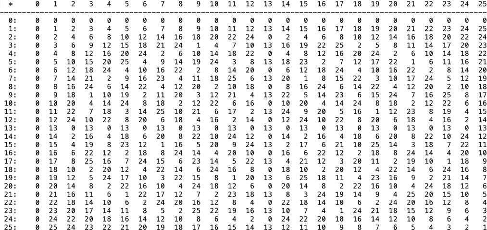

*图 6-12：模 26 乘法*

这个表格列出了两个数字模 26 的所有可能乘积。例如，要将 9 乘以 5，可以查看第 9 行和第 5 列。它们交汇处的值是 19，所以 9 ⋅ 5 是 19 mod 26。这个结果是合理的，因为我们知道 9 ⋅ 5 实际上是 45，而 45 除以 26 的余数是 19。

为了使这张表的一行（或一列）能够成功地扰乱字母表，它需要包括从 0 到 25 的每个数字——也就是说，它必须是表格索引的一个排列（或重新排序）。并不是每一行都有效。例如，第 4 行的数字是（0, 4, 8, . . .），并且在第 13 列开始重复。而第 13 行的值则在 0 和 13 之间交替，这样会将信息中的所有字母都转换成 A 或 N。这并不太有用！

可用的行（和列）是那些与 26 互质的行和列，也就是说，它们除了 1 以外与 26 没有其他公因数。共有 12 行：第 1、3、5、7、9、11、15、17、19、21、23 和 25 行。这些行包含 0 到 25 之间数字的排列。例如，字母表中的字母乘以 3 mod 26 会得到以下密码：

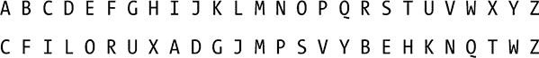

你可以通过每次向前数三个字母来构建扰乱的行（A B **C**, D E **F**, G H **I**, . . .），在 Z 处循环重新开始，直到整个字母表都被分配完。

要使用我们在项目 22 中的代码实现基于乘法的密码，只需对我们之前的`Scramble`模块进行一个小小的修改，如图 6-13 所示。

*图 6-13：乘法，别加法！*

通过将`+`改为`*`，我们告诉程序使用模乘法而不是模加法来加密消息。

#### 通过模乘法解密

现在让我们考虑解密。我们通过撤销加法来解密凯撒移位。例如，要撤销向右移动 3 个字母的移位，我们向左移动 3 个字母（或者说 26 – 3 = 23，向右移动 23 个字母，因为算术是模 26 的）。要撤销乘法 3 的操作，我们需要除以 3，但在模运算中无法处理分数或小数。如果原始的模乘法结果是 14，我们不能反过来除以 3，去说我们想要字母表中的字母 4.66。

幸运的是，仍然有方法可以撤销乘法操作。我们需要找到乘数的模反元素，并将其作为解密密钥。*模反元素*是乘法逆元，其中乘法使用模运算来解释。给定模数*m*——在本例中为 26——将一个数字与其模反元素相乘会得到 1 mod *m*。例如，在图 6-12 中的乘法表中，注意到在第 3 行第 9 列有一个 1。这告诉我们 9 是 3 在模 26 下的模反元素。为了验证，检查数学：3 ⋅ 9 = 27，而 27 mod 26 = 1。

如果你习惯于算术给出一个乘法逆元作为分数，那么看到一个乘法逆元是整数，甚至是一个大于原始数字的整数，可能会觉得很奇怪。乘法逆元不应该是小的东西吗？毕竟，在普通算术中，3 的乘法逆元是 1/3，因为 3 ⋅ 1/3 = 1。然而，对于逆元来说，唯一重要的是乘积为 1。在普通算术中，你通过将*n*乘以 1/*n*得到 1。而在模算术中，你通过将*n*乘以另一个整数得到 1。

由于 9 是 3 在模 26 下的乘法逆元，我们可以使用 9 作为乘数来解密一个使用 3 作为乘数加密的消息。图 6-14 中的日志证实了这一点。

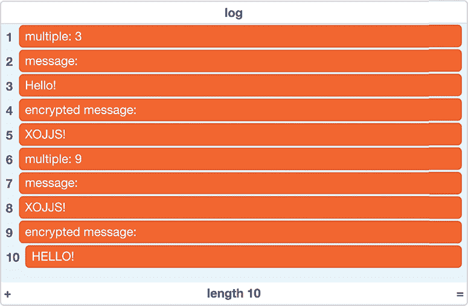

*图 6-14：揭示被乘加密的消息*

首先，我们使用 3 作为乘数对消息“Hello!”进行加密。然后，我们使用 9，它是 3 在模 26 下的模反元素，来“加密”结果，从而恢复原始消息。

#### 项目 24：模反元素是关键

我们已经确定，要恢复通过模乘法加密的消息，我们需要模反元素。在这个项目中，我们将研究如何找到模反元素来帮助解密过程。

寻找模反元素的一种方法是直接寻找它：研究乘法模`字母表大小`的运算表，查看哪个*m*的倍数能得到答案 1。这个倍数就是模反元素。这就是我们在上一节采取的方法，检查图 6-12 中的模 26 乘法表，确定 3 的模反元素是 9。现在，让我们使用 Scratch 自动化这个过程，这样我们就能轻松找到任何数字和任何模数的模反元素。图 6-15 展示了如何操作。

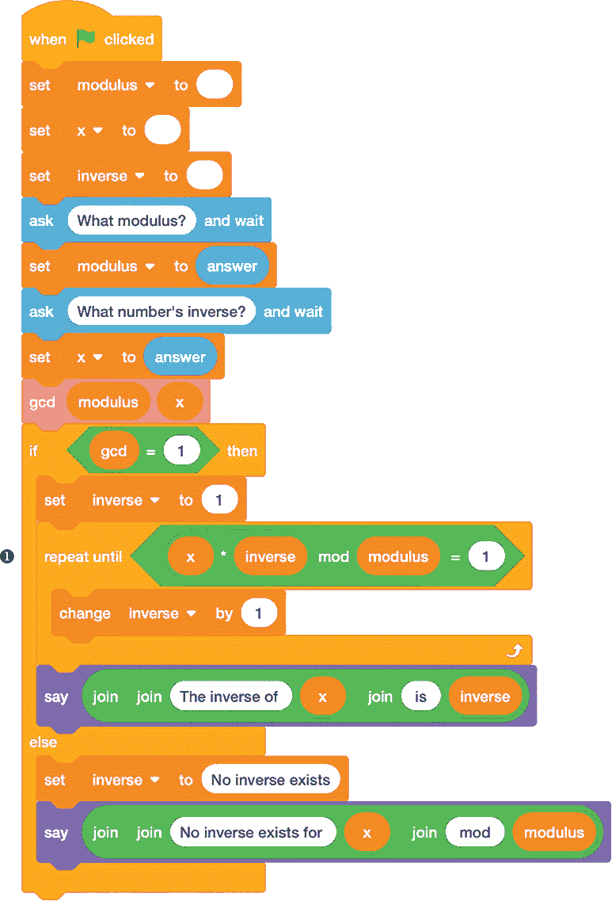

*图 6-15：寻找模反元素*

程序首先提示输入模数和待求逆的数字。这两个值必须是互质的，才能使数字具有模块逆。我们通过使用在第二章中的项目 9 中构建的自定义`gcd`模块来进行测试（见图 2-17 第 38 页）。如果最大公约数是`1`，则这两个值是互质的，因此我们使用一个循环来测试每一个可能的逆，从`1`开始，直到找到使`x * inverse mod modulus = 1` ❶成立的那个逆。这相当于在操作表的一行中扫描，直到找到包含 1 的那一列。

##### 结果

图 6-16 展示了一些输出，演示了代码的工作原理。

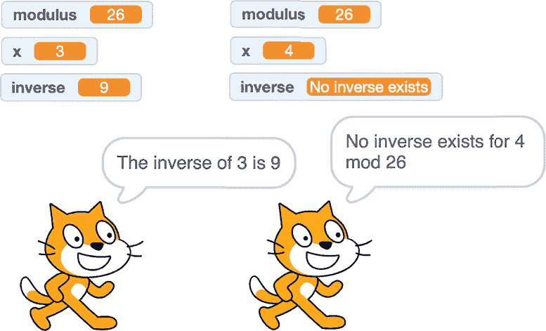

*图 6-16：模块逆计算*

程序确认 9 是 3 模 26 的逆运算结果。它还正确地得出结论，4 模 26 没有模块逆，因为 4 和 26 不是互质的。

##### 破解代码

我们在模块逆运算程序中使用的试错法，对于小字母表（也就是说小模数）来说效果不错，但如果能有一个更专注的算法来快速计算任何数在任意模数下的模块逆，就更好了。与`gcd`模块一样，我们可以重用之前编写的部分程序来实现这一目标：通过欧几里得算法计算最大公约数，该算法来源于第二章中的项目 9。

请记住，欧几里得算法通过一系列除法来计算两个给定数字*b*和*a*的最大公约数*d*，直到最后得到最大公约数作为最后一个非零余数。要使用这个算法来查找模块逆，请将*b*设置为模数，将*a*设置为你想要找到其逆的数字。按常规方法执行算法，跟踪除法运算。然后，向后推算，寻找一个方程，使得 1 在一边，*a*和*b*在另一边。

例如，如果我们想找到 3 模 26 的模块逆，我们可以首先将这两个数字传入欧几里得算法：

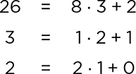

最后的非零余数 1 就是最大公约数。接下来，我们需要回溯这些步骤，找到 26 和 3 的组合，使其等于 1。将算法中的中间方程改写为 1 = 3 – 2，再将算法中的顶部方程改写为 2 = 26 – 8 ⋅ 3。然后，将 26 – 8 ⋅ 3 代入中间方程中的 2，得到 1 = 3 – (26 – 8 ⋅ 3)。总体来看，这个方程右边有一个 3 和括号中 8 个 3，所以 1 + 8 = 9 个 3，再加上–1 ⋅ 26。我们可以将这些部分合并，得到 1 = 9 ⋅ 3 – 26。这告诉我们 1 = 9 ⋅ 3 mod 26，因此 9 是 3 的模块逆。接下来会有一个编程挑战，旨在让这种方法能够普遍适用。

### 使用线性变换的更多加密选项

你可能认为，从模加法转为模乘法我们并没有获得太多。毕竟，对于一个 26 个字母的字母表，有 26 种可能的移位字母表，而只有 12 种可能的乘法字母表。然而，通过结合这两种方法：乘法*和*移位，我们可以得到更多的扰乱字母表。也就是说，我们可以将每个通过乘法获得的 12 个扰乱字母表应用 26 种可能的移位，从而得到 26 ⋅ 12 = 312 种潜在的字母表。这样可以隐藏更多的信息。

这个组合方法的一般规则是，我们通过用字母索引为*i*的字母替换字母索引为*m* ⋅ *i* + *s*的字母来扰乱字母表。换句话说，我们先将索引乘以*m*，然后加上常数*s*。如果我们为*m*和*s*选择了值，并为每个*i*值绘制这个公式的结果，我们会发现图形显示的是一条具有*m*斜率的直线。例如，假设我们将*m*设置为 2，*s*设置为 3。如果我们绘制函数 2*i* + 3 的图形，线条将通过(0, 3)、(1, 5)、(2, 7)、(3, 9)、(4, 11)、(5, 13)和(6, 15)这些点，如图 6-17 所示。

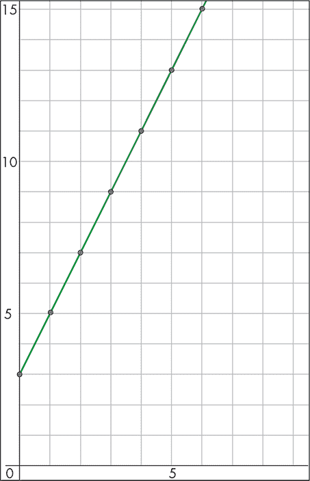

*图 6-17：2*i* + 3 的图形*

因为它们产生直线，“乘法加常数”公式像*m* ⋅ *i* + *s*被称为*线性函数*。因此，“乘法和移位”加密过程被称为*线性变换*。只要乘数*m*被选为与字母表大小互质，这种加密方法就能奏效。

#### 项目 25：通过线性变换进行加密

让我们将项目 22 中的凯撒密码代码改编为处理线性变换。首先，我们将更新`Initialize`模块，如图 6-18 所示。

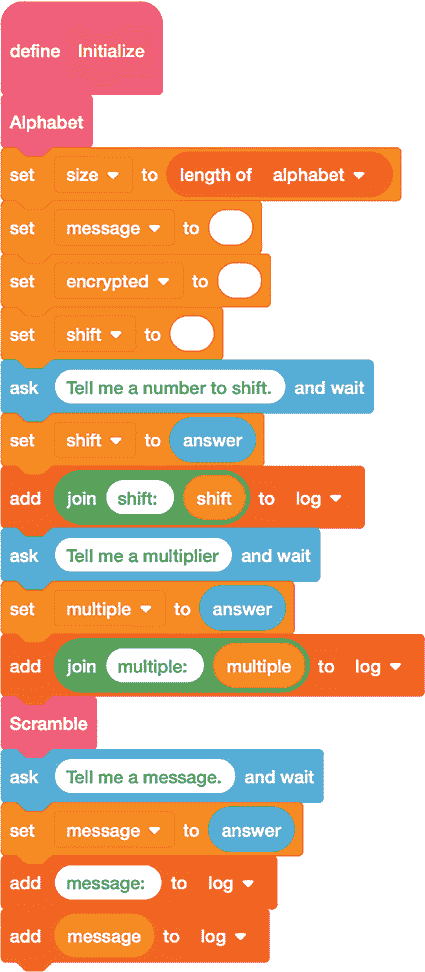

*图 6-18：线性变换加密*

现在我们同时提示输入移位值和乘数，而不再仅仅是之前的移位值。还要注意新增的代码，用来维护`log`列表。接下来，我们将修改`Scramble`模块，以匹配图 6-19。

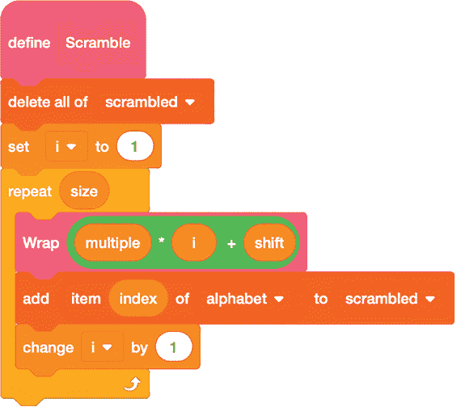

*图 6-19：使用线性变换进行封装*

这个更新后的`Scramble`模块仍然使用图 6-4 中的原始`Wrap`模块。`Wrap`的输入实现了*m* ⋅ *i* + *s*的线性函数来扰乱字母表。

##### 结果

图 6-20 展示了线性变换程序在实际应用中的例子。它使用乘数 3 和移位 5 加密了消息“TOP SECRET！”

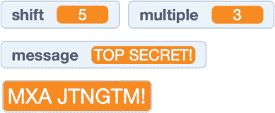

*图 6-20：使用线性变换加密*

为了解密得到的消息，我们需要撤销移位和乘法。撤销移位很简单：对于原始移位*s*，我们执行移位–*s*。正如我们所讨论的，要撤销乘法*m*，我们可以乘以*m*的模块逆。我们将通过运行加密消息两次，分别执行撤销移位和撤销乘法。

首先，我们通过移位–5 撤销移位 5，正如图 6-21 所示。我们使用乘数 1，这意味着我们实际上并未进行任何乘法。

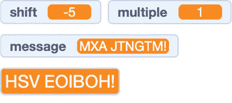

*图 6-21：撤销移位*

接下来，我们需要将结果反馈到线性变换程序中，撤销乘法。我们知道，3 mod 26 的模块逆是 9，所以在图 6-22 中我们使用的乘数就是 9。这一次，我们使用移位 0，仅关注撤销乘法。结果就是原始消息。

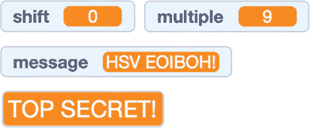

*图 6-22：撤销乘法*

总的来说，只有两个数字决定了线性变换加密：移位和乘数。同样，解密消息也只需要这两个数字。它是一个非常紧凑的密钥！

 编程挑战

**6.5** 你已经看到如何通过两个步骤解密线性变换密码，首先撤销移位，然后撤销乘法。是否可以将这两个步骤合并成一个步骤呢？例如，能否通过运行一次线性变换程序来解密消息“MXA JTNGTM！”？假设移位为–5，乘数为 9。从图 6-20 来看，实际情况是这样做行不通，但有一个不同的移位因子可以奏效。想一想它可能是什么，以及为什么。

**6.6** 利用你从挑战 6.5 中学到的知识，编写一个 Scratch 程序，输入线性变换加密的乘数和移位，并计算出模块逆和适当的移位，以便一步完成解密。

**6.7** 如果乘数与字母表大小不是互质的，线性变换加密会出什么问题？

**6.8** 修改项目 23 的代码，用于破解凯撒移位密码（图 6-9），使得程序列出所有 312 种可能的线性变换密码的所有解密结果。

**6.9** 任何字母表的排列或打乱都可以作为替换密码的密钥。编写一个 Scratch 程序，生成字母表的随机打乱。`pick random`操作块可能会在这方面派上用场。

**6.10** 编写一个程序，使用欧几里得算法计算模逆，如《破解代码》一书中第 115 页所讨论的。你可能需要将商和余数记录为列表，并通过反向追溯列表中的步骤来解开过程。

### 不可破解的一次性密钥密码

*一次性密钥密码* 是一种技术，使用一种文本（密钥）来加密或解密另一种文本（信息）。加密过程将信息的第一个字符按密钥第一个字符的位置进行位移。然后将第二个字符按密钥第二个字符的位置进行位移，依此类推。信息中的每个字符都有自己的加密方案，字母表基本上为每个字母进行重新排列。

举个例子，假设我们想要使用“Scratch”这个词作为密钥来加密消息“Hello”。（密钥的长度应该至少与消息长度相同，最好更长。）密钥的第一个字母 S 是字母表中的第 19 个字母，因此我们需要将消息中的第一个字母 H 按 19 个位置进行位移，得到字母 A（在 Z 处换行）。密钥的第二个字母 C 是字母表中的第 3 个字母，因此我们需要将消息中的第二个字母 E 按 3 个位置进行位移，得到字母 H。如果我们继续这样做，最终加密得到的消息是“AHDMI”。使用密钥逆向进行位移即可解密消息。

通常，一次性密钥用于共享较长的编码信息，使用相应更长的密钥。密钥可能是一个字面意义上的记事本，里面有一长串随机字母手写序列，用来确定需要使用的位移。或者它也可以是发送方和接收方商定共享的任何其他文本，比如歌曲的歌词、书中的一段话，或是互联网上发布的文章。关键是要保持密钥的保密性。

一次性密钥比我们在本章早些时候讨论的简单密码更强大。事实上，如果你使用一个真正随机的字符序列作为密钥，并且永远不重复使用相同的密钥（因此是*一次性*密钥），你的编码消息将是无法破解的。对于任何基于字母表固定排列的秘密代码，这一点无法成立，无论是凯撒密码、线性变换，还是其他任何混排算法。这是因为，正如前面所提到的，英语语言中存在一些模式和规律，提供了破解消息的线索。

即使我们移除单词之间的空格，以掩盖像单字词（几乎确定是*I*或*a*）和常见的三字词（很可能是*the*或*and*）等明显的线索，仍然会有其他模式在混淆的字母表中显现出来。例如，只有某些字母在英语中常常连续出现两次：有很多双重 E、S 和 T 的单词，但双重 A 或双重 Z 的单词就少得多，几乎没有双重 Q 或双重 J 的单词。像 TH 和 CK 这样的双字母组合也很常见。

更广泛地说，像 E 和 A 这样的字母在给定的英文文本中出现的频率远高于 Q 和 Z，因此统计加密消息中每个字母的*频率*——即每个字母出现的次数——尤其是在长消息中，能够提供有关加密方案的有力线索。为了验证这一点，我们将编写一个程序来计算字母的频率，并用一个使用凯撒移位加密的文本进行测试。然后，我们将编写一个程序来实现一次性密码本加密，并测试其结果。我们应该会看到一次性密码本加密消除了任何规律性的模式。

#### 项目 26：破解密码的频率分析

本项目的目标是创建一个程序，用于统计加密消息中每个字母的出现次数，这可能会根据不同字母在典型的未加密英文文本中的使用频率，提供关于加密方案的线索。我们将需要利用 Scratch 的文本处理能力来实现这一目标。特别是，我们将结合使用绿色的`length of`和`letter of`积木，在循环中逐个字符地检查文本。图 6-23 展示了该程序。

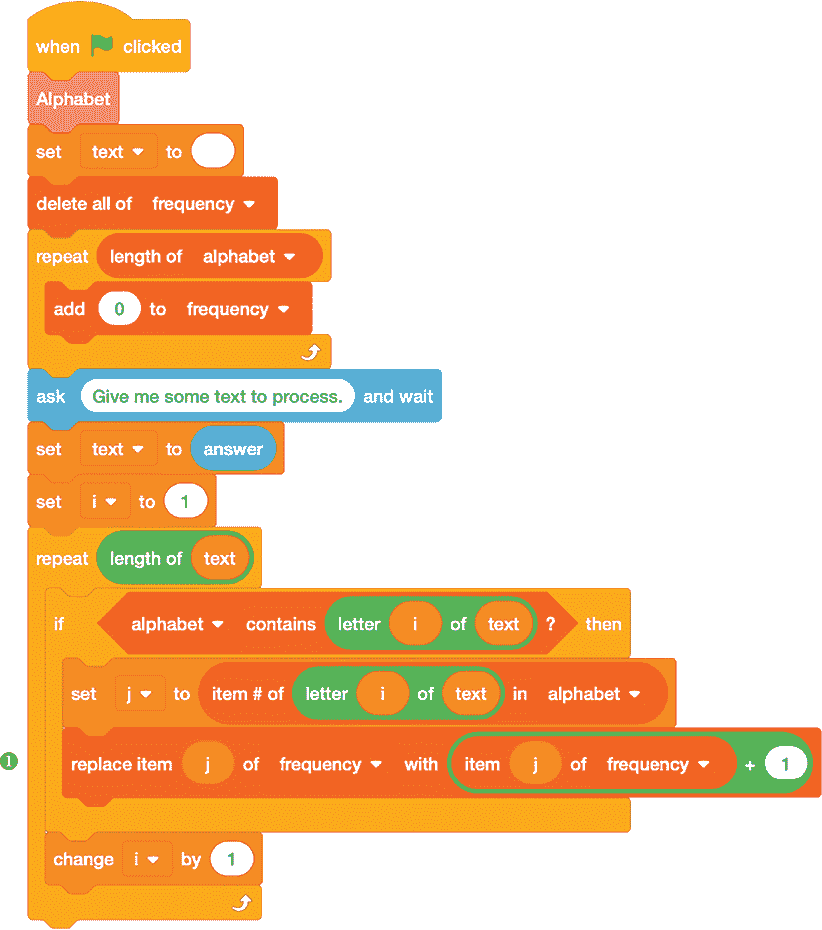

*图 6-23：统计每个字母的使用次数*

我们使用两个独立的列表：`alphabet`，它在程序开始时由图 6-2 中首次定义的`Alphabet`积木构建；以及`frequency`，我们将每个字母在字母表中出现的次数存储在此列表中。首先，我们将`frequency`填充为 26 个 0。然后，我们从用户处获取要处理的文本，并逐个字符地循环遍历它。`item # of letter i of text in alphabet`会反向查找文本中第*i*个字符在`alphabet`中的位置。例如，如果字符是 C，它会返回`3`，即 C 在`alphabet`列表中的位置。我们将在`frequency`列表中相应位置上加 1，以统计该字符的出现次数❶。

##### 破解代码

图 6-24 中的代码是对程序的一个小改进，添加了标签到`frequency`列表中。将其放在`repeat`循环之后。

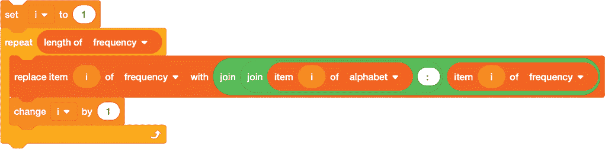

*图 6-24：为频率列表中的每一项添加标签*

在完成所有计数后，这段额外的代码会为`frequency`列表中的每一项标注它所代表的字母。这样，你就不需要时刻提醒自己字母 A 是 1，字母 B 是 2，依此类推。

##### 结果

让我们启动频率分析程序。我们将从一段合理大小的未加密文本开始，选取*《爱丽丝梦游仙境》*的第一章，来感受普通英文文本中字母的正常频率。你不需要自己输入完整的文本，只需在线查找并在 Scratch Cat 要求输入时复制粘贴即可。图 6-25 显示了结果。

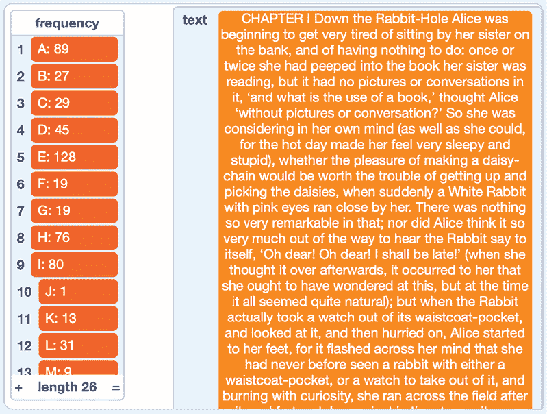

*图 6-25：分析未加密文本中的字符频率（掉进兔子洞……）*

正如你所看到的，文本中包含了大量的 E 和 A 字母，但只有一个 J。如果你向下滚动到列表的底部，你会发现有一个 Q，但没有 Xs 或 Zs。这是英文文本中字母分布的典型特征。

现在尝试使用我们原始的凯撒密码程序，来自项目 22，对同一章节的*《爱丽丝梦游仙境》*进行加密，字母表偏移三个位置。将加密后的文本输入到频率分析程序中。图 6-26 显示了结果。

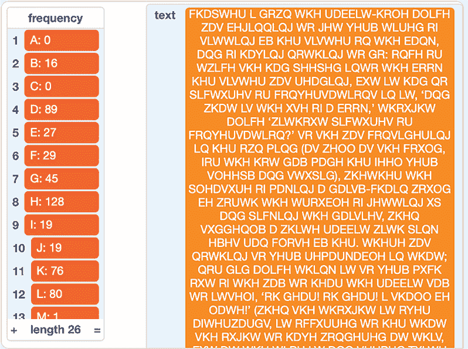

*图 6-26：分析偏移后文本中的字符频率*

我无法读取加密后的消息，但我注意到单词*DQG*出现了很多次，这是一个线索。更重要的是，字母的频率仍然有很强的模式，这表明最常见的字母是如何被编码的。当然，这个模式与原始消息完全匹配，只是偏移了三个位置：你可以看到字母 A 的原始频率出现在 D 的位置，字母 E 的原始频率出现在 H 的位置，依此类推。A 和 C 处的零来自于 X 和 Z 的回绕。从这个输出中，即使我不知道原文是什么，我也能大致猜出哪个字母是 E。

理论上，一次性密钥密码应该消除这些模式，使得加密文本中每个字母的出现频率大致相同。我们将在下一个项目中验证这一点。

#### 项目 27：一次性密钥加密

我们可以通过对我们至今写的加密程序做一些小修改，在 Scratch 中编写一次性密钥加密。图 6-27 显示了`Initialize`模块。

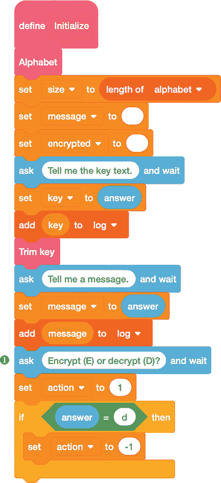

*图 6-27：一次性密钥的设置代码*

这个模块要求输入编码密钥和消息。它还询问用户是否要进行加密或解密 ❶，这样我们就可以使用相同的程序进行这两种操作。根据回答，变量`action`会被赋值为`1`或`-1`。这个值被用在移位的运算中，导致加密时添加移位，而解密时则是减去移位。

注意，`Initialize`块设置了一个日志，以便我们可以滚动查看程序使用的历史记录。它还调用了一个自定义的`Trim key`块，该块在图 6-28 中定义。

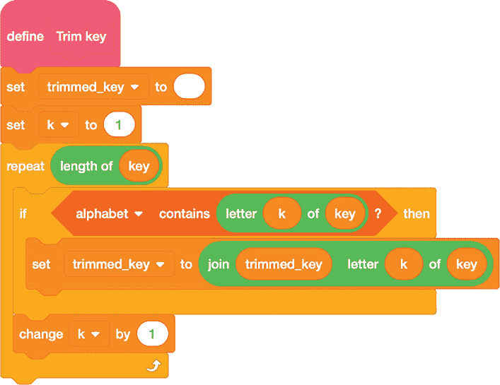

*图 6-28：修剪密钥*

在`Trim key`块中，我们将用于加密消息的文本，并去除任何不在字母表中的字符（如空格或标点符号）。变量`trimmed_key`最初为空。然后，`repeat`循环逐个字符地遍历密钥；它忽略不在`alphabet`列表中的字符，并将其余字符放入`trimmed_key`中。

图 6-29 显示了主程序代码。

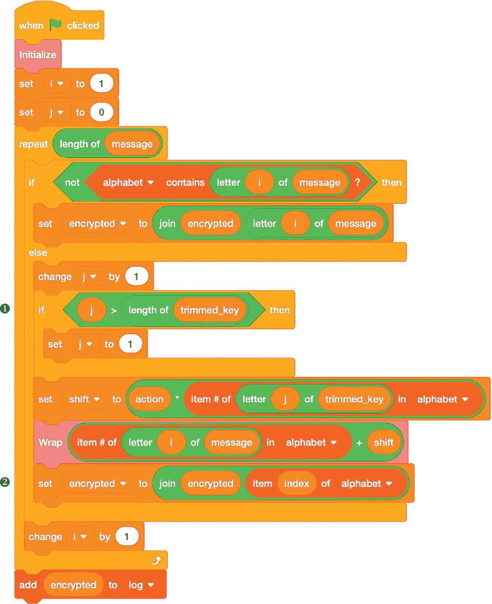

*图 6-29：一次性密码本加密（和解密）的主要代码*

在这个堆栈中，我们通过消息中的每个字符（使用索引`i`）和修剪后的密钥（使用索引`j`）逐个字符地移动，根据密钥中的当前字符确定消息中当前字符的位移。我们使用`if`语句❶，当消息中的字符比密钥中的字符多时，会将指针回绕到修剪后的密钥的开头。如我在本章早些时候提到的，最好使用一个至少和消息一样长的密钥。较短的密钥是一个漏洞：如果密钥开始重复，频率分析就能揭示关于密钥长度和编码短语的信息。例如，一个单字符的密钥，相当于凯撒移位！

实际的工作是在`set`块中完成的➋。它通过将原始字符按密钥中相应字符确定的偏移量逐个字符地加密消息。我们使用图 6-4 中的原始`Wrap`块来获取适当字母的索引。还要注意，在设置`shift`值时，我们乘以`action`（即`1`或`-1`）。如前所述，这允许程序通过向前或向后移动来进行加密和解密。

##### 结果

为了看到一次性密码本加密相对于简单字母表乱序（如凯撒密码）的安全性，我们将使用我们的程序加密与之前相同的*《爱丽丝梦游仙境》*章节。为此，我们需要选择一个密钥。我将使用“贾布沃基”这首无意义的诗歌，如图 6-30 所示，以保持刘易斯·卡罗尔的风格。

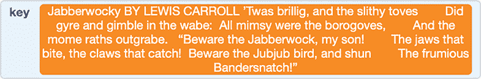

*图 6-30：一次性密码本密钥*

使用一次性密码本程序在加密模式下编码*《爱丽丝》*章节，在日志中找到加密后的文本，并将其复制粘贴到上一个项目中的频率分析程序中。结果应该类似于图 6-31。

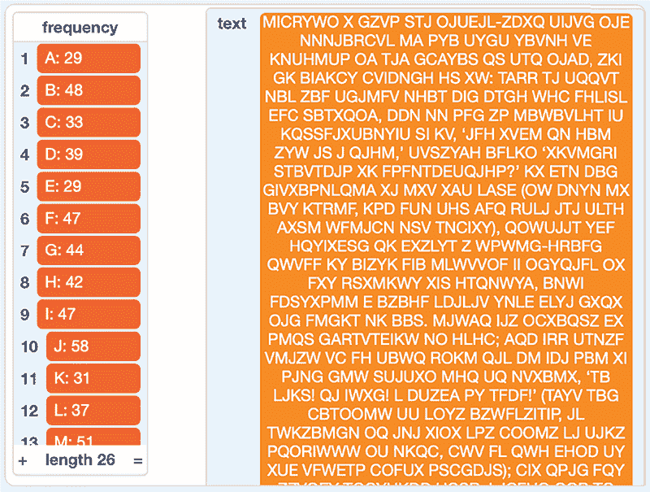

*图 6-31：分析用一次性密码本加密的文本中的字符频率*

如你所见，字母分布现在更平坦了：没有任何字母在使用频率上显著高（或低）于其他字母，因此频率分析无法提供破解密码的线索。而且，一次性密码本还消除了加密文本中的常规模式。与凯撒加密版本（图 6-26）中每次出现的 *DQG*（表示 *and*）不同，现在每个 *and* 的编码方式都不一样：首先是 *ZKI*，然后是 *JFH*，依此类推。没有密钥，解密这段文本似乎是不可能的任务；没有任何线索可以帮助你。而且，想象一下，如果空格和标点符号也被包括在字母表中并与字母一起打乱——加密后的消息看起来就像字母汤一样！

 编程挑战

**6.11** *密码谜题*是基于字母表乱序的文字谜题，不一定是凯撒加密或线性变换。编写一个 Scratch 程序，通过跟踪已猜字母并显示部分解密进度，帮助解决密码谜题。这里有一个密码谜题供你解答。作为提示，帮助你入手，这个密码谜题使用 M 代表 S。你可以通过观察模式和字母频率来猜测其他字母。

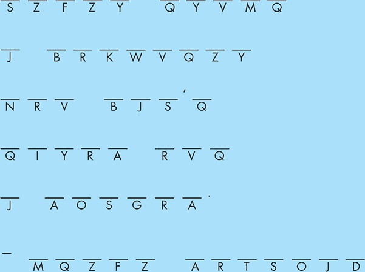

**6.12** 编写一个 Scratch 程序，去除文本字符串中的空格和标点符号，只留下字母和数字的字符串。这对去除加密信息中的词语分隔线索可能很有用。

### 结论

Scratch 不仅仅用于处理数字；它同样擅长处理文本。任何可逆的变换规则都可以成为加密算法的基础，用来共享秘密，但某些规则（比如使用一次性密码本）比其他规则（如简单的位移）更适合保护秘密的安全。你始终可以使用频率分析等技术来寻找解密消息的线索。
