## ## **计数实验**

*组合学*是数学的一个分支，通常被称为*计数的艺术*。这种“艺术”在于想出一种方法来组织计数问题，使得被计数的对象能够优雅地生成。

组合学有许多重要的应用。例如，在计算机科学中，组合算法适用于排序和数据查找等任务。在电信领域，组合学提供了用于高效数据传输的错误更正代码和网络协议。在遗传学中，它被用来分析和建模基因，以理解遗传和基因变异。

本章探讨了组合学领域的两个经典例子：卡塔兰数和分割数。对于每个例子，我们将制定一个策略，列出符合某一规则的所有模式实例。然后，我们将寻找一个递推公式来计算所有实例，而无需实际列出它们。

### 什么是计数问题？

在某些计数问题中，有一个参数表示某种大小或数量的度量：比如计数数值*n*。我们想知道有多少种方法可以使用*n*来生成不同的对象。一个经典的例子是计算有多少种方法可以排列*n*个物品。每一个独特的排列方式都被视为一个不同的对象。（答案是*n*的阶乘，正如我们在第五章中看到的。）

在其他计数问题中，有一个由参数*n*确定的单一对象，我们想要测量该对象的某个方面。例如，在讨论第四章中的序列时，我们考虑了平方数。在那里，与*n*相关的对象是边长为*n*的正方形，它可以由*n*²个 1×1 的小方格构成。平方数的序列是通过考虑*n* = 1, 2, 3，依此类推时，所包含的点数来确定的。

我喜欢把计数问题中的参数想象成一个旋钮，你可以通过旋转它来获得不同的结果。例如，第四章中的斐波那契数列，最初是作为一个计数问题的答案，问题是：在某些关于兔子繁殖的限制下，*n*代之后兔子会有多少只。把旋钮转到*n* = 6 代，你会得到 8，这是第六代的答案。把旋钮转到*n* = 7 代，你会得到 13。

许多计数问题可以通过一个序列来解决，一旦我们得到了一个序列，就可以寻找其中的规律。我们可能对序列的增长速度、可除性性质或与其他序列的联系感兴趣。有一个著名的项目收集了整数序列的信息并将它们按顺序排列，就像字典一样：在线整数序列百科全书^®（OEIS^®）。它最初在 1960 年代作为一个存储在打孔卡片上的数据库，由 AT&T 贝尔实验室的 Neil Sloane 维护。经过多年的发展，它已经大大扩大，现在可以在* [`oeis.org`](https://oeis.org) *上找到。OEIS 欢迎公众贡献新的序列，如果你想出了一个以前没人想到过的有趣序列，你可以提交它！

### 使用卡塔兰数爬山

*卡塔兰数*是一组出现在各种计数问题中的数列，包括我们这里要讨论的那个问题。假设你想要建造一条上下起伏的阶梯路径，就像在山脉中标记一条路径一样。你从地面开始，每次迈一步，要么向上走，要么向下走。最后，你回到地面水平。唯一的限制是，山脉路径在任何时刻都不能低于地面。你能创建多少种不同的上下步模式，也就是多少种独特的山脉形态呢？

随着步数的增加，可能的山脉形态越来越多，但仍然有一些重要的限制，源于中央约束。因为你必须保持在地面之上，你迈出的第一步必须是向上而不是向下。更重要的是，到目前为止，向上的步数必须始终至少与向下的步数相等。否则，如果你向下走得多于向上，你将会低于地面。例如，如果我们将向上一步表示为↗，向下一步表示为↘，那么像↗↘↘↗↗↘这样的步序就不行。将它展开为二维来看为什么不行：

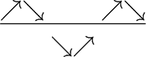

山脉在第一次上下之后会下降到起始位置以下，因此不允许这样做。另一方面，步序列↗↗↘↘↗↘是允许的。它展现如下：

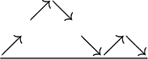

本质上，为了回到地面，步伐必须成对出现：每一次向上，总会有相应的向下。因此，我们可以用*n*来表示向上的步数，并且我们可以说卡塔兰数*C*(*n*)是由*n*个向上步构成的可接受路径的总数。这个*n*同样代表向下步的数量，每条路径总共有 2*n*步。

总的来说，使用*n* = 3 个上箭头和*n* = 3 个下箭头，可以构建五条可接受的路径。换句话说，*C*(3) = 5。其中一条路径就是我刚刚展示的↗↗↘↘↗↘模式。你能找到其他的路径吗？对于像 3 这样的低*n*值，想出所有可能的组合并不难，但随着*n*的增大，拥有一种系统化的方法来追踪所有路径就变得尤为重要。找到正确的方法是组合学成为*计数的艺术*的美妙之处。

在第四章中，斐波那契数列的一个有效方法是寻找*递推式*，一种公式，允许我们从已有的数生成新数。在那个情况下，我们只需要将前两个数字相加，得到下一个数字。对于卡塔兰数，我们可能会尝试将已经生成的旧路径拼接起来形成新的、更长的路径，但我们需要回溯到序列中的更早的项，以便找到所有的路径。事实上，我们必须查看每一条已经生成的较短路径。

我们可以通过首先选择任意两个数字，它们的和为*n* - 1，来构建一个由*n*个上箭头组成的新路径。我们称这两个数字为*a*和*b*。例如，如果*n*是 3，我们可以选择*a* = 1 和*b* = 1，或者*a* = 0 和*b* = 2，或者*a* = 2 和*b* = 0，因为它们的和是 3 - 1 = 2。对于旧路径，我们知道，当*a*或*b* = 0 时，只有一条路径。这是一条没有上箭头和下箭头的空路径，我们不会走任何地方。同样，当*a*或*b* = 1 时，也只有一条路径：↗↘。当*a*或*b* = 2 时，有两条路径：↗↗↘↘和↗↘↗↘。

构建新路径的方法是从一个上箭头（↗）开始，接着是任何一个之前创建的具有*a*个上箭头的路径。然后，我们加一个下箭头（↘），再接一个任何之前创建的具有*b*个上箭头的路径。这样我们就得到了总共*n*个上箭头：第一个上箭头加上两个路径中的*a*和*b*个上箭头。第一个上箭头和对先前生成路径的约束保证了下箭头的数量永远不会超过上箭头的数量，否则我们就会跌入地下。

让我们用这个方法来创建所有可能的路径，当*n* = 3 时。对于*a* = 1 和*b* = 1，我们只生成一条路径：↗ ↗↘ ↘ ↗ ↘。对于*a* = 0 和*b* = 2，生成两种情况：↗↘↗↗↘↘和↗↘↗↘↗↘。对于*a* = 2 和*b* = 0，同样生成两种情况：↗↗↗↘↘↘和↗↗↘↗↘↘。就这样，这就是*n* = 3 上箭头的五条可能路径。

请注意，当*a* = 0 时，每条新生成的路径仅仅是↗↘后接一个具有*b*个上箭头的旧路径。与此同时，当*b* = 0 时，新路径仅仅是一个旧路径，它有*a*个上箭头，并且通过在开始时添加一个额外的↗，在结束时添加一个额外的↘，使得路径变得更加"上升"。

每个接受的路径，具有*n*个上升步长，都可以使用这个简单的公式生成，只要我们考虑每一对可能的*a*和*b*值。例如，对于*n* = 4，我们需要所有相加为 3 的*a*和*b*值：0 + 3，1 + 2，2 + 1，和 3 + 0。

#### 项目 28：导航卡塔兰路径

在这个项目中，我们将编写一个 Scratch 程序，使用我们刚才讨论的方法来构建新的卡塔兰路径。首先，我们需要根据路径的上升步数来分类路径，因此我们定义了一个模块（如图 7-1 所示），它会计算序列中的所有上升步数。

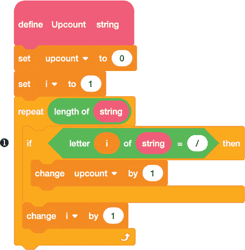

*图 7-1：多少个上升步长？*

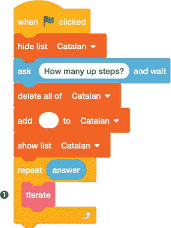

*图 7-2：列出所有路径*

该模块假设每条路径都以字符串的形式表示，其中斜杠字符(`/`)表示上升一步，反斜杠字符(`\`)表示下降一步。该模块逐个字符扫描字符串。每当它找到一个斜杠 ❶ 时，它就将`upcount`变量增加`1`。

现在，我们可以构建一个名为`Catalan`的列表，包含所有接受的路径，直到达到期望的上升步数。我们从长度为 0 的路径开始，然后反复应用递归，生成越来越长的新路径。图 7-2 中的主程序只需询问用户要走多远，然后调用自定义的`Iterate`模块 ❶ 合适的次数。

实际的工作在`Iterate`模块中完成，如图 7-3 所示，它执行递归操作。

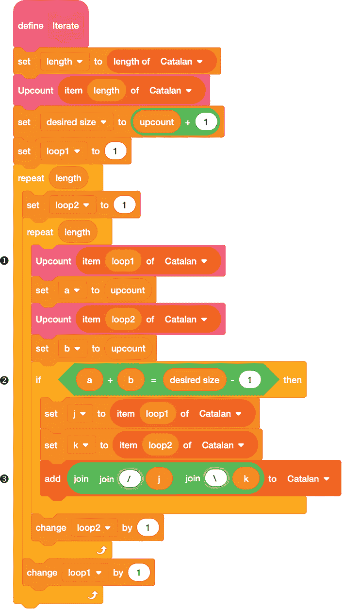

*图 7-3：从旧路径生成新路径*

我们使用两个嵌套循环来查看到目前为止生成的所有路径对。路径对中的每一条路径根据其上升步数进行分类。例如，`Upcount item loop1 of Catalan`为我们提供了路径对中第一条路径的`upcount` ❶。每当我们找到两条路径，它们的上升步数总和等于正确的值 ➋时，我们就用一个额外的上升和下降步长 ➌（注意 `/` 和 `\` 字符后面的额外空格，使输出的间距更美观）将它们结合在一起，并将生成的新路径添加到`Catalan`中。代码的编写方式是，构建新的卡塔兰路径的条件是`a + b = desired size - 1`。这样，当我们添加额外的上升和下降步长时，就能得到一个上升步数为`desired size`的路径。

##### 结果

与往常一样，输出受限于 Scratch 舞台，但你可以滚动以查看更多输出，或将`Catalan`列表导出为文本文件以查看完整内容。图 7-4 展示了列表的顶部。

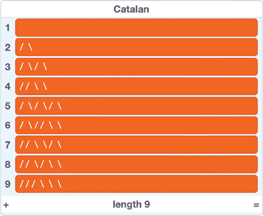

*图 7-4：卡塔兰路径，适用于* n *= 0, 1, 2 和 3*

第一个项目显示了最初的空路径，在第一次应用递归时它变成了 ↗↘ 的路径。图中展示了 *n* = 3 的输出，显示了五条具有三个上升步骤的可接受路径（列表项 5 到 9）。图 7-5 显示了接下来几条路径的导出文本格式，适用于 *n* = 4。

*图 7-5：* n *= 4* 的卡塔兰路径

Scratch 的列表长度限制为 200,000，意味着这个程序最多只能工作到 *n* = 11，在此时会生成并添加 58,786 条新路径到包含从 *n* = 0 到 10 的 23,714 条较短路径的列表中。对于 *n* = 12 来说，路径数量过多，无法继续完成列表。更糟糕的是，`Iterate` 块中的双重循环需要很长时间才能完成。由于每一对路径都要检查是否能够结合以满足卡塔兰条件，测试路径对的数量是当前列表长度的平方。因此，当我们到达 *n* = 10 或 11 时，程序明显变慢。

然而，通过计算列表中具有给定步数的项，我们可以开始通过这个程序看到卡塔兰数列。以 *C*(0) = *C*(1) = 1 为起点，接下来的几个数值是 2、5、14、42、132、429、1,430、4,862、16,796 和 58,786。

##### 破解代码

如果我们只想知道卡塔兰数本身——即每个 *n* 值的唯一路径数量——我们不必实际构建所有路径。相反，我们可以通过一个递归公式直接计算这些数字，基于相同的组合学见解，这帮助我们生成新路径。要找到 *C*(*n*)，我们首先需要找到所有满足 *a* + *b* = *n* – 1 的数对 *a* 和 *b*。然后，对于每一对，我们可以查找相应的卡塔兰数并将它们相乘：*C*(*a*) ⋅ *C*(*b*)。最后，我们将所有这些乘积加起来得到 *C*(*n*)。

例如，假设我们想要找到 *C*(5)。由于 5 – 1 = 4，我们首先需要找到所有相加为 4 的数字对。它们是 0 + 4、1 + 3、2 + 2、3 + 1 和 4 + 0。注意，每对中的第一个值是从 0 到 *n* – 1 递增的，而第二个值则在递减。接下来，我们需要找到这些对中对应的卡塔兰数。假设我们已经使用这个递归公式计算出了所有从 *C*(0) 开始的卡塔兰数，我们应该已经知道它们：*C*(0) = 1，*C*(1) = 1，*C*(2) = 2，*C*(3) = 5 和 *C*(4) = 14。然后，我们可以将每一对卡塔兰数相乘，并将结果相加来得到 *C*(5)：

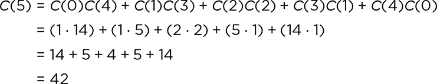

写这个递归公式的简短方法是使用求和符号，其中 *Σ* 符号（大写希腊字母 Sigma）表示对于每个索引 *i* 从最小值 *i* = 0（位于 *Σ* 下方）到最大值 *i* = *n* – 1（位于 *Σ* 上方）每增加一个值进行求和：

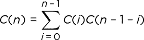

这里，*i* 相当于 *a*，而 *n* – 1 – *i* 相当于 *b*。这是有道理的；如果 *a* + *b* = *n* – 1，那么 *b* = *n* – 1 – *a*。

图 7-6 显示了一些代码，帮助 Scratch 计算并列出我们想要的卡塔兰数。

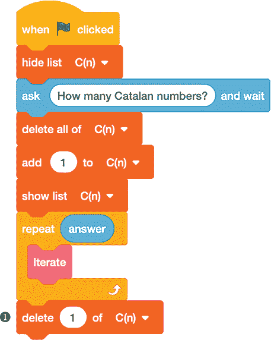

*图 7-6：列出卡塔兰数*

我们将列表命名为 `C(n)`，并从为 *C*(0) = 1 添加 `1` 开始。不过，如果列表的索引与序列条目的索引匹配会更好，索引 `1` 存放 *C*(1)，索引 `2` 存放 *C*(2)，以此类推。为了实现这一点，我们在程序结束时删除列表中的第一个项目 ❶。

和原始卡塔兰程序一样，实际的工作是在 `Iterate` 块中完成的，我们可以根据需要调用多次。图 7-7 显示了块的定义。

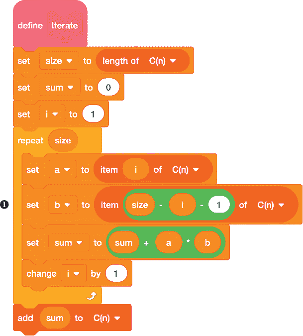

*图 7-7：应用递推公式*

在 `repeat` 循环内，我们查找一对对的卡塔兰数，变量 `a` 的值从 `i(1)` 开始，逐渐增加至 `size`，而变量 `b` 的值从 `size` 开始递减，以涵盖递推公式中的所有对。注意 `b` 的定义如何使其倒计数 ❶。我们将每对数值相乘，并将结果加到保存在 `sum` 变量中的运行总数中，最后将其添加到列表的末尾。

使用递推公式，Scratch 能够相当快速地计算 *C*(*n*) 的值，并且程序的限制值由 flintmax 决定，而不是最大列表长度。直到 flintmax 被超越，结果都是准确的，这通常发生在 *n* = 30 后。Scratch 计算出的 *C*(31) 的值会偏差 1，但直到 *n* = 520 时，我们才会遇到 `Infinity` 的问题，这时才会超出 Scratch 的浮动点最大值。

 编程挑战

**7.1**这是另一个卡塔兰数的递推公式：

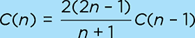

从 *C*(0) = 1 开始，这个公式适用于所有大于 0 的 *n* 值。在 Scratch 中编写这个替代的卡塔兰数递推公式。

**7.2**编写一个程序，当你提供一条来自 `Catalan` 列表的路径时，让 Scratch 绘制上下山脉。

**7.3**卡塔兰数与帕斯卡三角形中的中心二项式系数存在关系，后者的条目形式为 *C*(2*n*, *n*)。使用 项目 19（图 5-7）中的程序计算一些中心二项式系数，看看你能否找到另一种计算卡塔兰数的公式。

**7.4**另一个涉及卡塔兰数的计数问题是通过嵌套括号来指定乘法的顺序。考虑如何通过改变括号的分组方式，而不是改变因子的顺序，来相乘四个数*a, b, c*和*d*。例如，((*ab*)*c*)*d*首先会先将*a*和*b*相乘，然后将该计算结果（*部分积*）与*c*相乘，最后将结果与*d*相乘。另一方面，(*ab*)(*cd*)会先将*a*和*b*相乘，再将*c*和*d*相乘，最后将两个部分积相乘。还有三种不同的方式来分组四个数。找到它们。然后，修改生成卡塔兰路径的程序，使其显示所有可能的括号分组方式。

### 使用加法分解数字

我们在前几章探讨的许多关于数字的问题都涉及到乘法。例如，质数是正整数的乘法基本单元，算术基本定理说一个数字只能以一种方式写成质数的乘积（忽略因子的顺序）。但是加法呢？我们可以以什么方式将一个数字写成其他数字的和？

首先，我们可以专注于数字 1，并注意到每个正整数都可以唯一地写成 1 的和：2 = 1 + 1，3 = 1 + 1 + 1，依此类推。我们还可以施加不同的限制，要求每个*加数*（被加的数字）最多只使用一次。然后，如果我们考虑以 2 为基数，那么每个正整数都有唯一的表示。也就是说，每个正整数可以唯一地表示为不同 2 的幂的和。（我们在第一章中探讨了二进制表示法。）例如，得到 5 的唯一方法是不重复使用相同的 2 的幂，就是 2² + 2⁰，或者 4 + 1。然而，一旦我们允许比 2 的幂更大的加数集合，我们就失去了唯一性。如果我们允许 3 作为加数与 2 的幂一起使用，例如，我们就可以通过 1 + 4 或 2 + 3 得到 5。

#### 组合：顺序很重要

另一个需要做出的决定是顺序是否重要。我们是否将 1 + 2 和 2 + 1 视为表示 3 的不同方式？如果我们决定它们应该被视为不同，那么就有一种简单的方法来找出给定数字*n*作为和的所有可能表示（也叫做*n*的*组合*）。首先，将*n*写成 1 + 1 + . . . + 1。然后，查看每个加号并做出选择：要么保留它，要么省略它并将它两边的数字合并。例如，假设*n* = 3。我们可以将 3 = 1 + 1 + 1，并决定去掉第一个加号，使得 3 = 1 1 + 1 → 2 + 1，或者去掉第二个加号，使得 3 = 1 + 1 1 → 1 + 2。我们也可以保留两个加号得到 1 + 1 + 1，或者去掉两个加号，得到单一的加数 3。

我们已经找到了 3 的四个组成方式，而且就是这四个。为了理解为什么是这样，并且推导出*n*的组成方式数量的一般公式，可以想一想从 1 + 1 + 1 + ... + 1 到*n*的组成方式的过程。由*n*个 1 组成的字符串中，*n* – 1 个加号分隔它们。对于每一个加号，我们有两个选择：保留它或去掉它。这意味着有*n* – 1 个独立的二进制决策，这就导致有 2^(*n* – 1)种方式来组合这些决策，形成一个*n*的组成方式。我们识别出的 3 的四个组成方式是“去掉，保留”，“保留，去掉”，“保留，保留”和“去掉，去掉”。

#### 分区：顺序无关

一个更有趣的情况，并且没有那么简单的公式答案的是，如果我们决定加法项的顺序*不*重要——例如，1 + 2 和 2 + 1 应被视为相同的 3 的表示方式。这样的表示方式，忽略顺序，被称为*n*的*分区*，而不是组成。

如果加法项的顺序无关，那么我们不如将加法项按升序（或更确切地说，按非降序）排列，这样我们可以更系统地跟踪所有的分区。然后，我们可以将一个分区看作是一个特殊的组成方式，其项是非降序的。例如，3 的三个分区是 1 + 1 + 1，1 + 2 和 3。

**注意**

*我说*非降序*而不是*升序*，*因为将 1 + 1 + 1 中的 1 看作是升序的并不完全公平。重要的是每个加法项的值不会小于前一个项的值。*

让我们称*P*(*n*)为计算*n*的分区数量的函数。确保你同意*P*(1) = 1（1 只有一个分区：1 = 1），以及*P*(2) = 2（2 = 1 + 1，2 = 2）。我们已经确定 3 有三个分区，因此*P*(3) = 3。你可能觉得看到了一个规律，但从这里开始，*n*的分区数量增长得更快：*P*(4) = 5，*P*(5) = 7，当我们到达 12 时，*P*(12) = 77。

#### 项目 29：一个分区探险

让我们开发一个 Scratch 程序来查找给定值*n*的所有分区。我们将把结果存储在一个`partitions`列表中，每个分区表示为由加号连接的数字字符串，中间不留空格，例如`1+1+2`。我们的策略是从*n* = 1 开始，一步步增加到所需的*n*值，每一步都用当前*n*的分区替换`partitions`的内容。这意味着我们需要一种方法，利用所有*n*的分区列表来找到所有*n* + 1 的分区。

通过在每个*n*的分区前加上一个加法项 1，就可以获得一些*n* + 1 的分区。这只不过是将`1+`连接到`partitions`列表中的每个项目上。图 7-8 显示了一个自定义块来实现这一点。

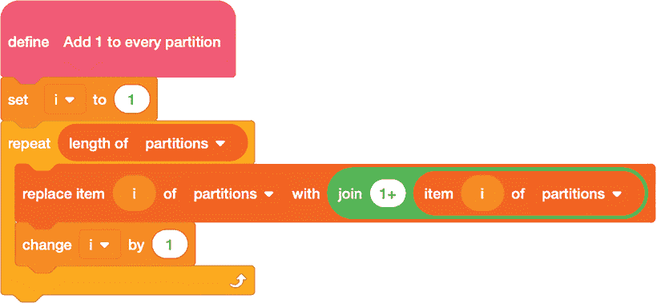

*图 7-8：从旧的分区构建新的分区*

该代码块简单地循环遍历`partitions`列表，一次取出一个项，将`1+`添加到它的开头，然后将结果存回列表中的相同位置。

*n* + 1 的其余分区可以通过回顾*n* – 1 的分区并添加新的首项 2，回顾*n* – 2 的分区并添加新的首项 3，依此类推。这一步稍微复杂一些，因为由于非递减顺序规则，并不是每个新创建的分区都能接受。例如，*n* – 1 的分区中只有那些最小项至少为 2 的分区才能加上 2。如果分区中有 1，放一个 2 在前面就破坏了顺序。同样，当向*n* – 2 的分区添加 3 时，原始分区不能以 1 或 2 开头。

另一个复杂点是，程序中的`partitions`列表只保存*n*的分区，这些分区被修改为*n* + 1 的分区。我们实际上没有记录早期的*n* – 1、*n* – 2 等分区来回顾。不过有一个解决方法：一旦我们将所有的*n*分区取出并在前面添加 1 来生成*n* + 1 的分区后，我们可以查看每个新分区并合并所有的 1。如果有两个 1，这将与向*n* – 1 的分区中添加 2 效果相同。同样，如果有三个 1，这就相当于向*n* – 2 的分区添加 3，依此类推。

为了理解为什么这样做有效，考虑从*n* = 5 到*n* + 1 = 6 的情况。5 的一个分区是 1 + 2 + 2，向它添加一个额外的 1 后，我们得到 1 + 1 + 2 + 2，这是 6 的一个分区。如果我们把这两个 1 合并成一个 2，我们得到 2 + 2 + 2，这是 6 的另一个分区。这相当于回顾*n* – 1 = 4 的分区，找到分区 2 + 2，并在它前面加一个 2。同样，5 的另一个分区是 1 + 1 + 3。添加一个额外的 1 后，我们得到 1 + 1 + 1 + 3 = 6。如果我们将这些 1 合并成一个 3，我们得到 3 + 3，这与回顾*n* – 2 = 3 的分区，找到分区 3（任何数字都是它自己的有效分区），并在它前面加一个 3 的效果相同。

实现这个过程的代码需要几个步骤。首先，我们需要将`partitions`（我们通过向* n *的旧分区添加一个初始项 1 得到的*n*+1 的分区）中的内容复制到一个新的列表中，以免覆盖它们。图 7-9 中的代码完成了这个任务，将复制的内容放入一个名为`dup`的列表中。

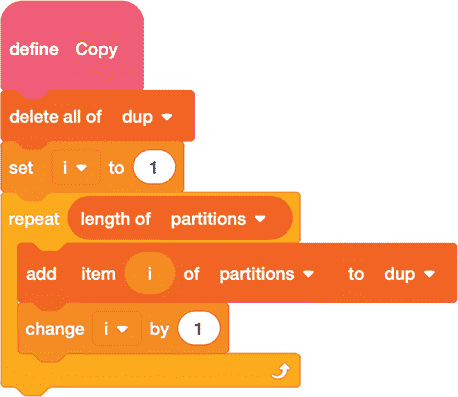

*图 7-9：将分区列表复制到一个副本列表中*

接下来，我们需要一种方法来计算给定分区开头有多少个 1。图 7-10 中的代码块处理了这个任务。

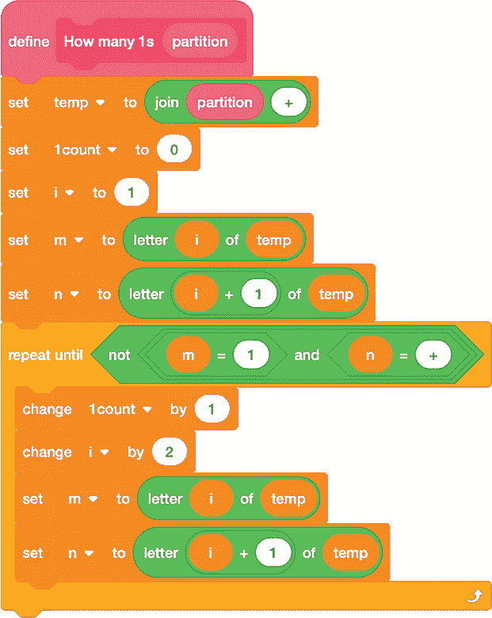

*图 7-10：计算分区中 1 的数量*

记住，我们假设每个分区都是由加号分隔的数字串，但我们不知道每个数字包含多少位。所以这个`How many 1s`代码块每次查看字符串中的两个字符，检查第一个字符（`m`）是否是 1，第二个字符（`n`）是否是加号。`repeat until` 循环会不断增加 `1count`，直到情况不再成立。检查加号和 1 可以防止像 `1+10` 这样的字符串被误算为两个 1。还要注意，在代码块开始时，我们会暂时在字符串的末尾添加一个额外的加号。如果没有这一点，像 `1+1+1` 这样的全 1 字符串中的最后一个 1 就不会被计算在内。

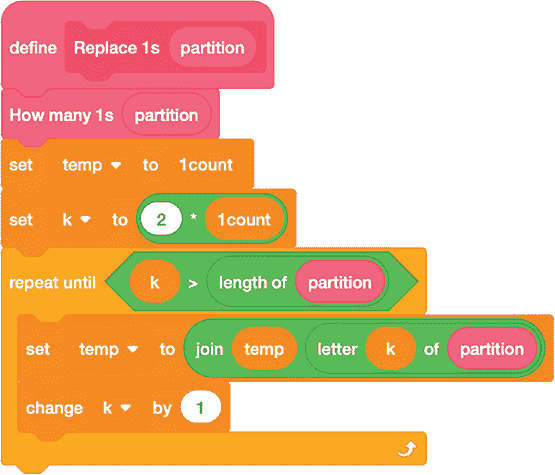

*图 7-11：将 1 合并为更大的数字*

一旦我们在`1count`变量中得到了 1 的数量，我们就可以用`1count`的值替换所有这些 1。图 7-11 中的代码块完成了这个替换操作。这个代码块还会初次调用`How many 1s`代码块。

在这个代码块中，我们将新的分区构建在 `temp` 变量中。我们从将 `temp` 设置为 `1count` 开始。然后，我们使用索引变量 `k` 将原始分区字符串的其余部分复制到 `temp` 中，从字符 `2 * 1count` 开始，也就是最后一个 1 后面的加号。如果原始分区完全由 1 组成，`repeat until` 循环中的 `k > partition 的长度` 检查会立即失败，因此新的分区将只是 `1count` 的值。

接下来是实际的工作：我们需要决定，通过将一些初始的 1 替换为一个更大的数字，我们创建的字符串是否符合有效分区的条件，应该被加入到 `partitions` 列表中。这里有两个重要的方面。首先，第一个项不能是 1。如果它是 1，那么它已经被计数过了。（如果原始分区只有一个 1，那么 `Replace 1s` 代码块就会保持它不变。）第二，数字串必须是非递减的。我们知道原始的分区是非递减的，而我们所做的只是将所有的 1 合并成一个更大的数字，所以唯一可能违反这个条件的情况是，如果新的第一个项大于第二个项。还有一种可能性是分区只包含一个项。这种情况也应该被认为是有效的。图 7-12 中的代码块检查了所有这些情况。

这个模块旨在根据字符串`p`是否表示一个有效的分区，将`proper`变量设置为布尔值`true`或`false`。我们从一个`repeat until`循环开始，将第一个数字提取到`first`变量中❶。该循环持续进行，直到索引变量`i`遇到加号或超出字符串的长度。我们需要这个循环，因为数字可能有多个数字位。此时，如果`i`超过了整个字符串的长度➋，我们就知道这个分区包含单一项，因此将`proper`设置为`true`。

如果我们还没有到达字符串的末尾，我们使用另一个`repeat until`循环将第二个数字提取到`second`变量中➌。（同样，它也可能有多个数字。）然后，我们再次进行两个主要检查：如果`first`大于`second`，或者`first`为`1` ➍，我们将`proper`设置为`false`。否则，我们有一个有效的分区，因此将`proper`设置为`true`。

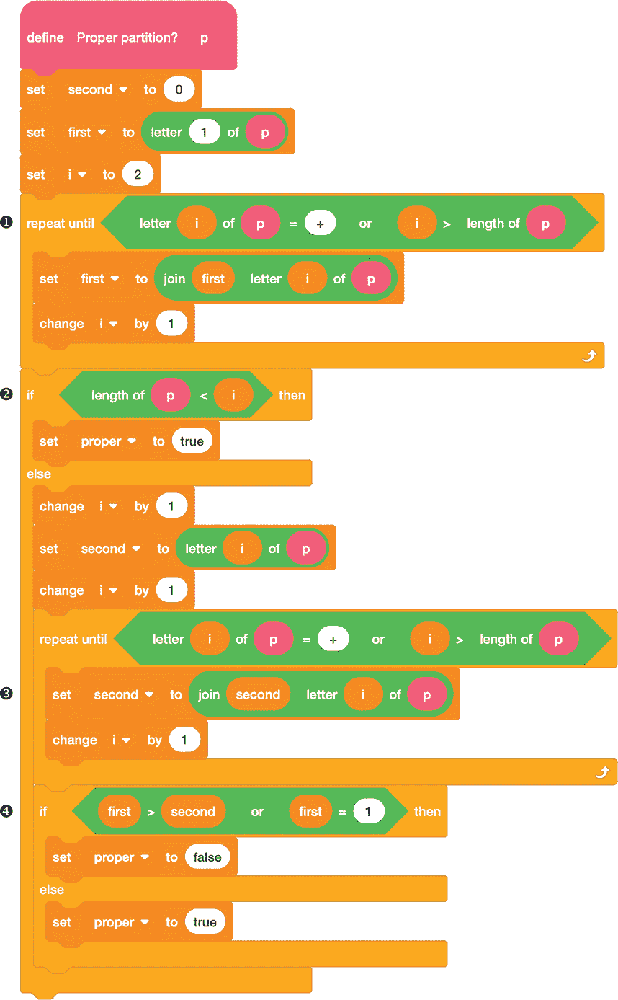

*图 7-12：验证新的字符串是否仍然符合分区条件*

利用我们目前定义的所有模块，现在可以定义一个主要的`Iterate`模块，它协调从上一批次构建下一批分区的过程。图 7-13 展示了如何操作。

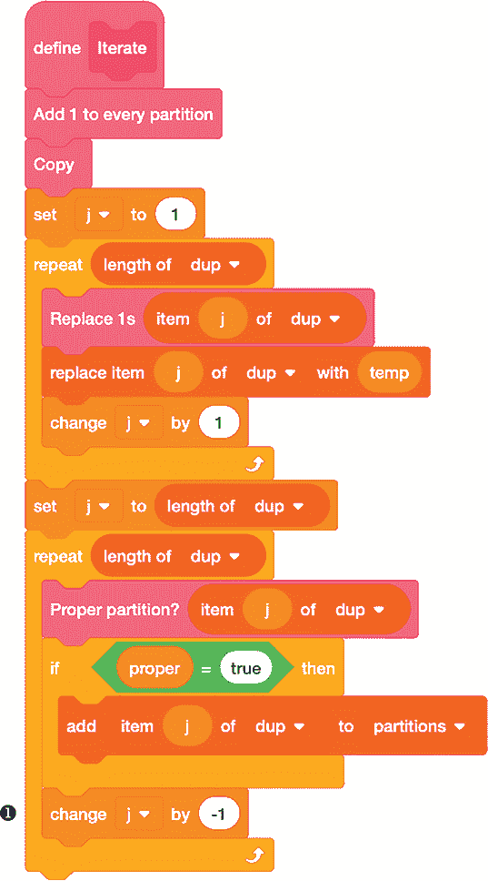

*图 7-13：将分区列表从* n *扩展到* n *+ 1*

这个模块几乎可以看作是算法的口头描述。首先，我们将 1 加到每个现有的分区，并复制`partitions`列表。接下来，我们将复制中的每个分区，合并其中所有的 1 为一个单独的加数。然后，我们评估结果，只将有效的分区添加到`partitions`列表中。

在评估阶段，请注意我们使用计数器`j`向后遍历`dup`列表❶。算法的一个特殊之处在于，由于分区是以特定的方式添加到该列表中的，结果会从最大数到最小数生成。例如，1 + 1 + 1 + 1 = 4 最初排在 1 + 1 + 2 = 4 之前，但在这些被转化为 4 和 2 + 2 后，4 会排在前面。逆向评估列表将结果重新排列为升序。

现在我们已经有了所有的模块，只需要在图 7-14 中使用绿色标志代码来启动程序。

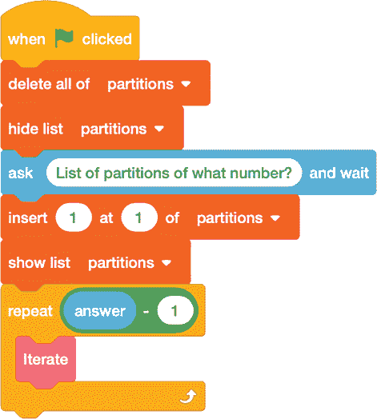

*图 7-14：生成分区列表*

这个栈会提示输入一个数字，并迭代足够的次数来获取该数字的分区。我们从仅包含`1`的`partitions`列表开始，1 是 1 本身唯一有效的分区。

##### 结果

图 7-15 展示了程序示例运行的输出：数字 6 的所有 11 个分区的列表。

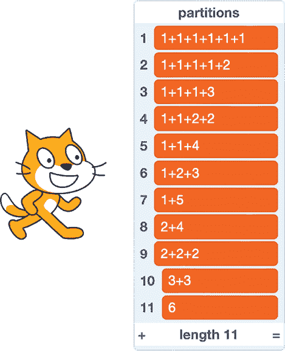

*图 7-15：6 的分区*

像往常一样，要查看更大值的*n*的完整列表，你需要滚动或将列表导出到文本文件中。

##### 破解代码

我们可以通过让 Scratch 列出所有的分区，然后查看列表的长度来计算*P*(*n*)，即*n*的分区数。只要列表能够容纳所有的分区，这种方法就有效。Scratch 对列表长度的限制意味着此程序适用于*n*的值最大为 49，这时有 173,525 个分区。（在我那台九年的旧电脑上，找到所有分区不到两分钟。）对于更大的*n*值，我们可以使用递归公式直接计算*P*(*n*)，而不必列出所有分区。事实证明，递归公式表示*P*(*n*)是早期项的组合，这些项以一种有趣的方式间隔开。关系式为：

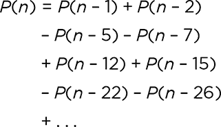

1, 5, 12, 22, . . .，沿左列排列的序列是第四章中五边形数的序列，定义如下：

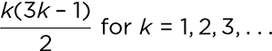

相关序列 2, 7, 15, 26, . . .，沿右列排列的序列是这样计算的：

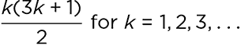

第二个序列也可以按如下方式编写，以查看不同类型的对称性：

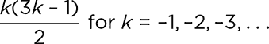

请回顾一下图 4-14 在项目 16 中的内容，位于第 71 页，查看这两个序列在五边形数可视化中的高亮显示。

我们可以在 Scratch 中编程实现这个递归，以进一步计算*P*(*n*)的值。首先，我们需要图 7-16 中的自定义块，以在给定某个*k*值时，计算刚刚描述的两个序列的值。

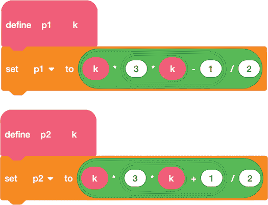

*图 7-16：计算五边形数的公式*

接下来，图 7-17 显示了一个`Initialize`块，它设置了`Partitions`，这是一个存储结果的列表。

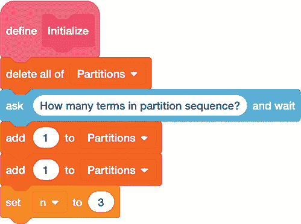

*图 7-17：初始化递归*

我们询问要计算多少个*P*(*n*)的值，并用前两个值*P*(0) = 1 和*P*(1) = 1 来初始化列表。然后我们将`n`设置为`3`，以开始计算序列的第三项，即*P*(2)的值。

主程序堆栈，如图 7-18 所示，调用`Initialize`，然后使用`repeat`循环计算所需的*P*(*n*)值的数量。

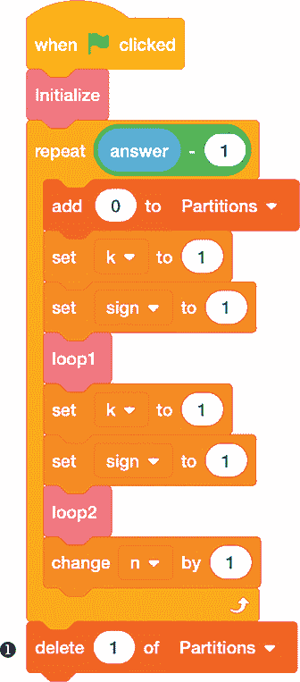

*图 7-18：实现分区函数的递归*

我们从每个新的*P*(*n*)值开始，初始值为`0`，并使用两个自定义块`loop1`和`loop2`，从*k* = 1 开始，使用递归公式计算实际值。一旦`repeat`循环结束，我们从`Partitions`列表中移除第一个项，表示*P*(0)，以使索引编号与*n*的值匹配❶。

图 7-19 显示了`loop1`和`loop2`的定义。

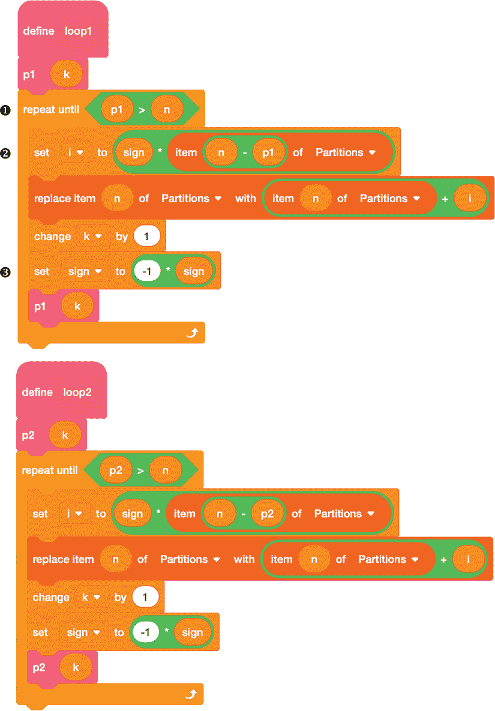

*图 7-19：计算五边形数的循环*

在 `loop1` 中，我们根据递归规则的左列查找 `Partitions` 列表中的早期值——即 *P*(*n* – 1)、*P*(*n* – 5)、*P*(*n* – 12) 等——使用 `p1` 块计算所需的五边形数。每个值被存储在变量 `i` 中，然后加到 `Partitions` 中的最新值。由于递归中的项交替进行加法和减法，我们使用 `sign` 变量 ➋ 来跟踪所需的操作。在调用 图 7-18 中的 `loop1` 之前，它的初始值是 `1`（加法），对于每个新项，我们将其乘以 `-1` 来切换加法与减法，或反之 ➌。我们继续查找项，直到下一个五边形数（`p1`）大于当前的 *n* ❶。

`loop2` 块遵循相同的逻辑，但它使用 `p2` 来计算递归规则右列的项：*P*(*n* – 2)、*P*(*n* – 7)、*P*(*n* – 15) 等。

图 7-20 显示了该程序的一些示例输出。

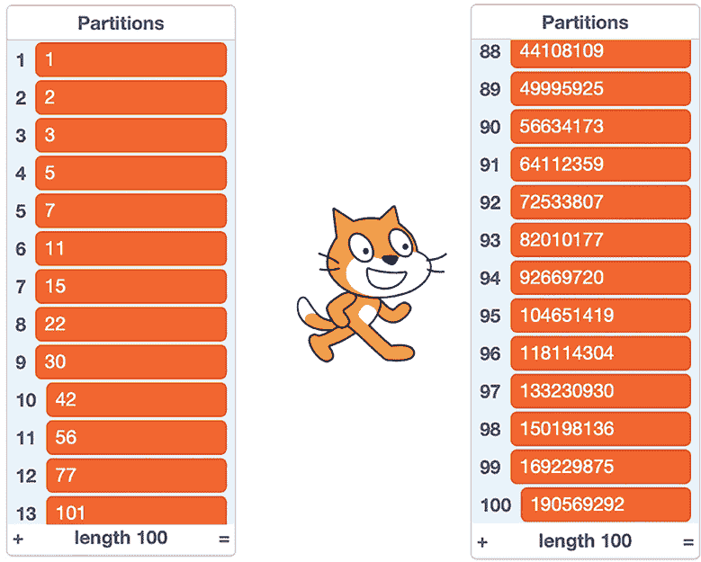

*图 7-20：* P*(*n*) 的前几个值，以及一些后续值*

该方法迅速生成正确的 *P*(*n*) 值，直到 *n* = 298，当递归中结合的数字超出了 flintmax。随着 *n* 的继续增大，浮点数算术的局限性使得计算出的 *P*(*n*) 值变得不可靠，值在错误的值和一些负数之间剧烈波动，直到达到浮点数限制并得到 `Infinity`。

 编程挑战

**7.5**我们可以通过对分割的加法项设置额外的条件，提出有趣的计数问题。编写一个布尔块，筛选分割并返回 `true`，如果每个加法项都是奇数。将该块应用于通过 图 7-14 中的代码为给定值 *n* 生成的分割列表，并查看有多少个符合此条件。例如，所有加法项为奇数的 5 的分割将是 1 + 1 + 1 + 1 + 1、1 + 1 + 3 和 5 本身。

**7.6**编写另一个布尔块，检查分割的所有部分是否都不同。例如，所有部分不同的 5 的分割将是 1 + 4、2 + 3 和 5 本身。分割 1 + 2 + 2 等将不算，因为它有重复的部分。将 *n* 的所有不同部分的分割数与 *n* 的所有奇数部分的分割数进行比较。

**7.7**印度数学家斯里尼瓦萨·拉马努金注意到，*P*(*n*) 在 *n* 以 4 或 9 结尾时能被 5 整除。通过查看 *P*(*n*) 值的列表来验证这一事实。记住，你可以将 Scratch 列表导出为文本文件，以便更轻松查看。看看你是否能找到其他能被 7 和 11 整除的 *P*(*n*) 值的模式。

### 结论

我们在之前的章节中已经看到，Scratch 适合用来计算数字和处理文本。现在我们知道，它同样适合用来制作模式。有时，计算一个模式出现的方式有多少种的第一步，就是列出所有可能的情况——这又是 Scratch Cat 的工作！然后，通过正确的公式或递推关系，我们就能在不需要列出所有情况的前提下，计算模式的出现次数。
