## 第八章：## **三份圆周率**

数字*π*（圆周率）表示圆的周长（圆的“边缘”全程的距离）与其直径（从圆的一侧通过圆心到另一侧的直线距离）之间的比率。值得注意的是，这个比率的值无论圆的大小如何都相同。圆的其他属性，如面积，依赖于它的大小，但*π*不受影响；随着圆的增大，增加的周长与增加的直径之比保持不变。

你可以将周长和直径的测量值看作是用一个常见的长度单位表示的，比如厘米或英寸。在这个比率中，这些测量值的单位会相互抵消，从而使*π*成为一个纯粹的数字，没有单位。*π*通常被近似为 3.14，但小数点后的数字实际上会一直延续下去，并且不会重复。多年来，数学家们提出了许多不同的方法来计算*π*，其准确度各不相同。在本章中，我们将探讨几种这样的技巧，涉及代数、几何，甚至数论。

### 阿基米德如何计算圆周率

让我们首先探讨一下古希腊数学家阿基米德用来计算*π*的方法。首先画一个圆，然后画一个*内切*多边形，这是一个完全位于圆内的形状，其顶点恰好接触圆的边缘。接下来，画一个*外切*多边形，这是一个完全包围圆的形状，其每条边的中点都接触圆的边缘。两个多边形应该具有相同的边数，并且应该是*规则*多边形，这意味着它们的所有边长相等。图 8-1 展示了这种绘图可能的样子。

请注意，内切（紫色）六边形的周长小于圆的周长，而外切（黑色）六边形的周长大于圆的周长。这意味着我们可以使用这两个六边形的周长来找到*π*的上下界。

图中没有指定长度单位，所以我们假设圆的半径为*r* = 1。半径为 1 的圆叫做*单位圆*。这个单位圆的周长为*C* = 2*πr* = 2*π*。内切六边形由六个边长为 1 的等边三角形组成，因此通过求和三角形外边的长度，我们可以得出内切六边形的周长为 6。这进一步告诉我们 2*π* > 6，因此*π* > 3。

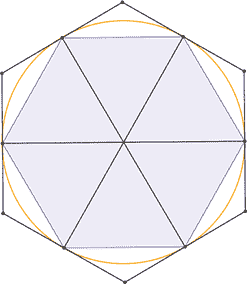

*图 8-1：内切和外切六边形*

利用一点三角学，我们可以计算出外接六边形的边长为 (2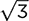) / 3，因此其周长为 (6 ⋅ 2) / 3。这等于 4，如果 2*π* < 4，那么 *π* < 2，即大约是 3.4642。

我们现在知道，*π* 介于 3 和 3.4642 之间。为了获得更精确的值，让我们尝试将内切和外接多边形的边数翻倍。随着边数的增加，内外多边形会越来越接近圆形。图 8-2 展示了从 6 边形增加到 12 边形时发生的情况。

随着多边形越来越接近圆形，它们的周长会 *收敛* 到 2*π* 的值。阿基米德从 6 边形开始，逐步增加到 12 边形、24 边形、48 边形、96 边形，最终得到了一个被称为最精确的 *π* 近似值，持续了几个世纪：223 / 71 < *π* < 22 / 7。

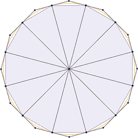

*图 8-2：内切和外接 12 边形*

阿基米德通过发展一种递推规则来跟踪当两种多边形的边数翻倍时周长的变化，从而得到了他的近似值。这个递推公式以 *a*[*n*] 和 *b*[*n*] 为输入，即*π*的旧上界和下界，计算出新的上界和下界，即 *a*[*n* + 1] 和 *b*[*n* + 1]，其公式如下：

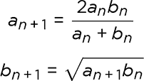

例如，从我们最初的六边形（*a*[1] = 2 和 *b*[1] = 3）开始，到 12 边形，我们的计算过程为：

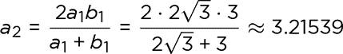

并且：

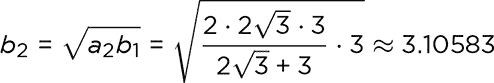

这告诉我们，*π* 必须介于 3.10583 和 3.21539 之间。

*a*[*n* + 1] 的计算被称为 *a*[*n*] 和 *b*[*n*] 的 *调和平均数*。*b*[*n* + 1] 的计算是 *a*[*n* + 1] 和 *b*[*n*] 的 *几何平均数*。你可以在 *[`mathworld.wolfram.com/ArchimedesRecurrenceFormula.html`](https://mathworld.wolfram.com/ArchimedesRecurrenceFormula.html)* 上找到更多关于这些术语的详细解释，以及阿基米德是如何使用三角学推导他的递推公式的。

#### 项目 30：阿基米德递推法

在这个项目中，我们将在 Scratch 中编程实现阿基米德的递推公式，以计算*π*的近似值。我们将从六边形开始，正如我们已经确定的，它们给出了上界 *a*[1] 为 2 和下界 *b*[1] 为 3。然后，我们将使边数从此开始翻倍。图 8-3 展示了代码。

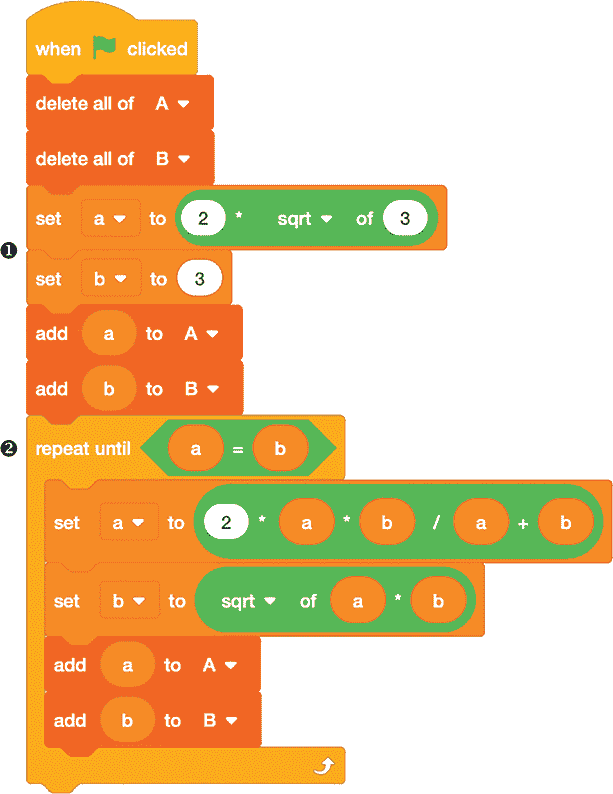

*图 8-3：从内切和外接六边形计算 *π**

在设置了上界和下界的起始值❶之后，我们使用一个循环计算新值，直到结果相等➋，这意味着我们已经达到了 Scratch 支持的最高精度。我们将上界存储在列表`A`中，将下界存储在列表`B`中。在循环中，注意我们先计算`a`的新值，这样我们就可以在计算`b`时使用它。

##### 结果

图 8-4 展示了运行程序后`A`和`B`列表的内容。

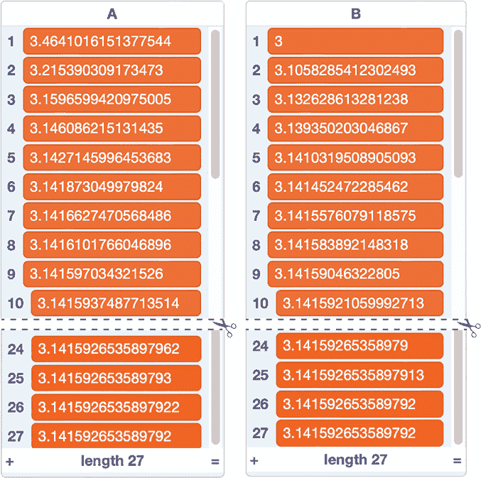

*图 8-4：从六边形开始并收敛到π*

只需 27 个循环，我们就能达到 Scratch 浮点数表示的精度限制。此时，边界的值收敛到 3.141592653589792\. 如果你记得记忆法“我需要一杯冰沙，当然是巧克力口味的，在那些涉及量子力学的沉重讲座后”，你可以检查前几个数字是否正确。通过数每个单词的字母数，你可以得到*π*的前 15 个数字：“How I need”对应 3, 1, 4，依此类推。

##### 破解代码

即使我们不从六边形开始，边长翻倍的递归依然有效。假设我们用内切和外接正方形来近似圆的周长，如图 8-5 所示。

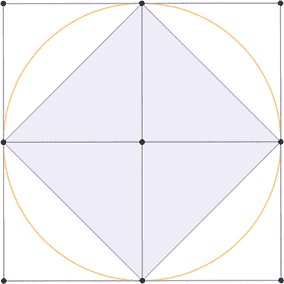

*图 8-5：使用正方形来近似周长*

如果圆的半径仍为 1，则外接正方形的周长为 8。根据勾股定理，内切正方形的边长为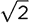。由于圆的周长为 2*π*，因此第一个估算值为 2 < *π* < 4\. 要从这里运行递归，只需将设置`a`和`b`初始值的两个模块（参见图 8-3 ❶，第 153 页）替换为图 8-6 中的模块。

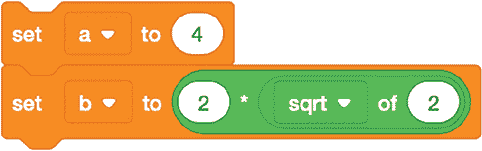

*图 8-6：递归的新的初始值*

图 8-7 展示了使用这些新起始值运行程序的结果。

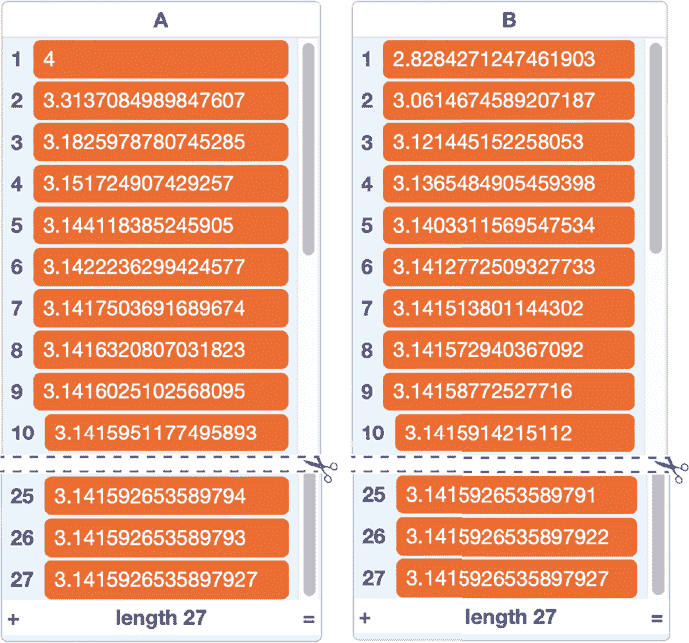

*图 8-7：从正方形开始并收敛到π*

尽管递归从更宽的范围开始，但它很快就会收敛，再次需要 27 个循环才能达到 Scratch 的精度限制。

 编程挑战

**8.1**如果从内切和外接三角形开始，计算递归的初始值。由于边长的第一次翻倍是从三角形到六边形，因此从第二行开始的输出应与图 8-4 中的结果相同。

### 从圆的面积估算π

计算*π*的另一种方法是使用公式*A* = *πr*²，表示圆的面积。假设你在一个网格上绘制了一个半径为*r*的圆，圆心位于点(0, 0)。圆内的任何点(*x*, *y*)都满足不等式*x*² + *y*² < *r*²。假设我们只关注坐标为整数的点，这些点被称为*格点*。我们可以将每个格点视为一个*单位正方形*的左下角，这个正方形的边长为*s* = 1，面积为*s*² = 1。通过计数圆内的格点（即满足*x*² + *y*² < *r*²不等式的点），我们可以得到圆面积的近似值。图 8-8 展示了如何使用这种方法，示例为半径为 4 的圆。

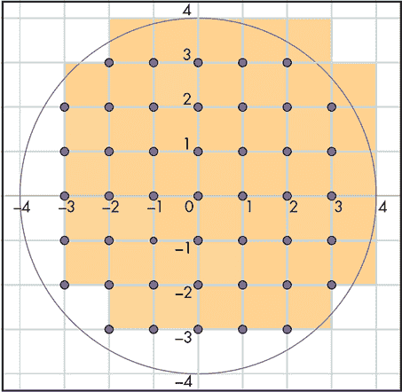

*图 8-8：半径为 4 的圆内的格点*

圆内的格点以紫色点显示，总共有 45 个。每个格点标记着一个黄色单位正方形的左下角。这些正方形中的一些超出了圆的范围，但这一点被圆中未被正方形覆盖的部分所抵消。综合来看，我们可以说圆的面积大约是 45，和黄色正方形覆盖的面积相同。我们知道圆的面积是*πr*²，因此将 45 除以*r*²得到一个估算值：45 / 16 = 2.8125。

如果我们还统计四个恰好位于圆周上的格点——点(4, 0)、(0, 4)、(–4, 0)和(–4, 0)——我们可以得到更精确的估算值：49 / 16 = 3.0625。通过使用更大的圆，我们可以进一步提高精度。这是因为圆的面积与半径的平方成比例增长，而误差仅来自圆周围的正方形，圆周上正方形的数量仅与半径的线性关系成比例增长。因此，圆越大，相对于总面积的误差越小。在我们的下一个项目中，我们将看到如何通过增加半径的大小来提高估算值，同时使用 Scratch 来处理计算。

#### 项目 31：使用格点计数

图 8-9 展示了一些 Scratch 代码，提示输入半径并在生成的圆内计数格点，以估算*π*。输出会记录满足条件*x*² + *y*² < *r*²的格点数量以及由此得到的*π*估算值。

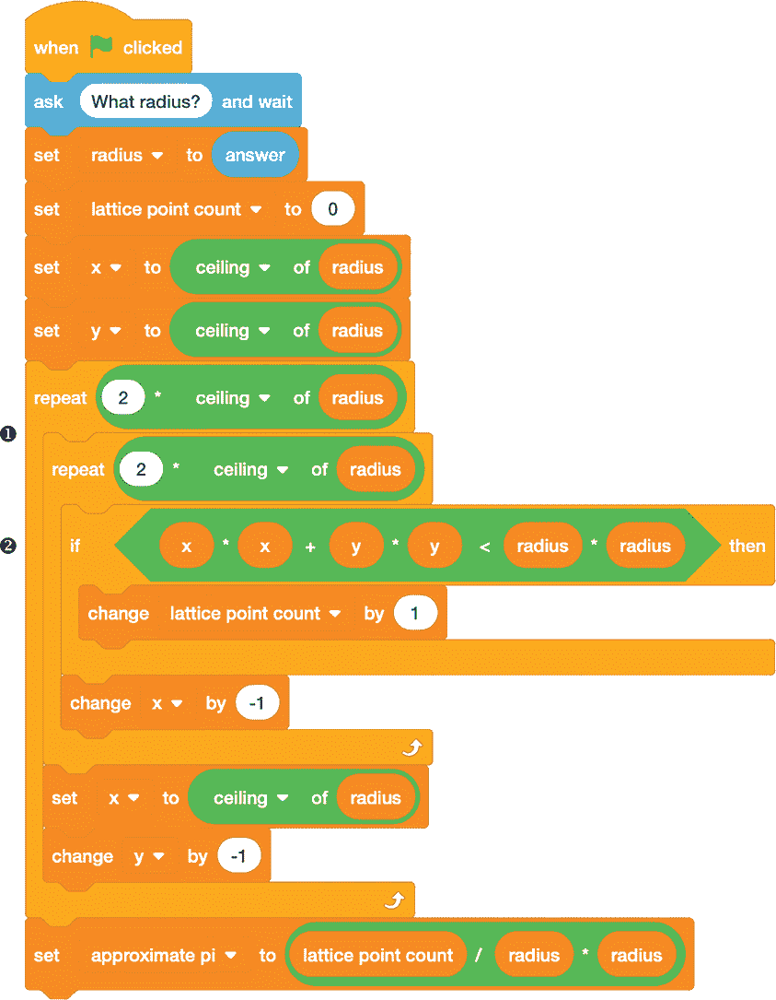

*图 8-9：通过计数格点来估算π*

我们首先要求圆的半径值。然后，使用两个嵌套循环 ❶ 遍历围绕圆形的方形网格中的行和列。我们从方形的右上角开始，在那里 `x` 和 `y` 都等于半径 *r*，然后向左下角移动，直到它们等于 –*r*。对于每一对坐标，我们检查该点是否在圆内 ➋，如果是，则增加格点计数。最后，我们将格点计数除以半径的平方，从而得到 *π* 的近似值。

##### 结果

图 8-10 显示了运行程序的结果，计算半径为 1,000 的圆形。

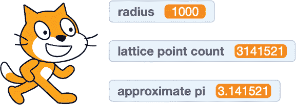

*图 8-10: 计算半径为* r * = 1,000 的圆内的格点数*

这个 *π* 的近似值精确到小数点后四位。效果好多了！

##### 破解代码

对于半径为 *r* 的圆，图 8-9 中的程序需要检查 (2*r*)² 个格点。当 *r* = 1,000 时，需要检查 400 万个点，这需要一些时间。随着圆形变大，延迟会更长。例如，当 *r* = 10,000 时，将需要检查 4 亿个点，你将需要等待很长时间才能得到结果。

但为什么要检查 *所有* 的点呢？我们可以随机选择较少的格点，并使用这些点来估计圆的总体面积。图 8-11 显示了这个方法。

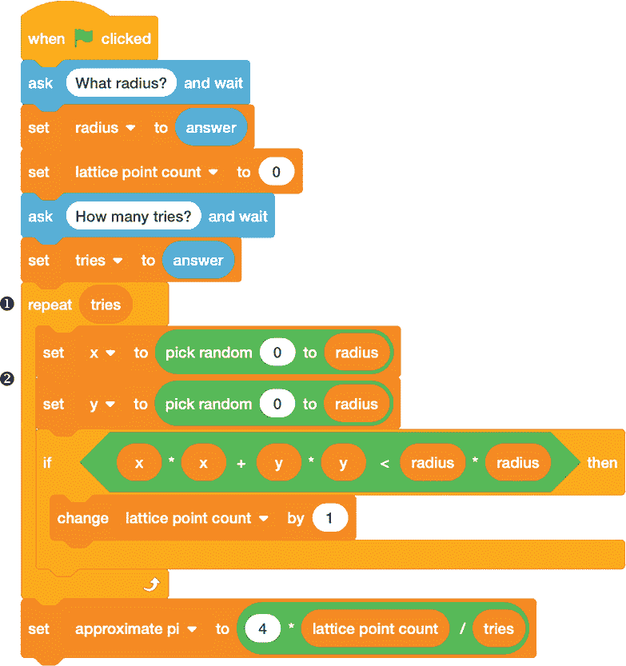

*图 8-11: 通过采样随机格点来确定 π*

变量 `tries` 控制 `repeat` 循环 ❶，并决定检查多少个随机点。我建议将其设置为圆半径的 10 倍左右。我们可以限制自己只查看网格的第一象限中的点，在该象限中坐标是正整数，通过选择 `0` 到 `radius` 之间的随机 `x` 和 `y` 值 ➋。若点位于圆内，则如前更新格点计数。通过足够多的尝试，我们应该能够看到以下等式：

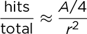

该等式的左侧是“命中”（圆内的格点）与总采样点数的比率。右侧是圆面积四分之一的比率（位于网格第一象限的圆部分）与半径平方的比率。这里的 *r*² 可看作包含所有我们可能采样的点的第一象限方形的面积。将 *A* 代入 *πr*² 并解出 *π*，得到：

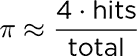

我们在程序的最后使用这个公式来估算 *π*。图 8-12 显示了一个示例结果，半径为 10,000，随机采样了 100,000 个点。

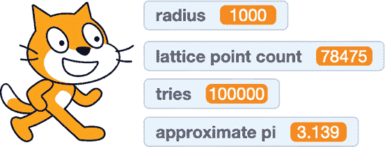

*图 8-12: 通过随机试验估算 π*

你从这个程序中得到的输出每次运行时可能都会不同，因为随机数生成器决定了测试点的选择。不过，我们这里得到的结果非常接近，而且比程序检查圆中每一个格点要快得多。

 编程挑战

**8.2**这两个版本的`pick random`模块之间有一个微妙的差别：

将每个模块嵌入一小段代码，以报告结果，看看它们的表现如何。带有`1`的版本返回整数值，因此请求 0 到 1 之间的值时，大约一半时间会得到 0，另一半时间会得到 1。带有`1.0`的版本返回的是 0 到 1 之间的值，这些值不一定是整数。如果我们没有整数的(*x, y*)坐标，那么我们就没有真正的格点，但这有关系吗？看看图 8-11 中的代码，如果随机选择的点没有整数坐标，代码是否还能正常工作。

### 用相对素数逼近π

数字*π*在许多看似与圆形和几何学无关的地方出现。一个有趣的涉及*π*的公式回溯到第二章和第三章中的公因数的概念。记住，两个整数的*公因数*是一个能整除这两个整数的数。如果这两个整数唯一的公因数是 1，那么这两个整数被称为*相对素数*。

这里有一种几何方法来解释相对素数。假设你站在坐标平面的原点(0, 0)，面朝格点。你可以看到大部分格点，但有些被挡住了，因为有另一个格点在前面。例如，图 8-13 标出了第一象限内的*可见格点*，这些格点用紫色圆点表示。黑色直线显示了点(1, 1)挡住了点(2, 2)、(3, 3)等等；点(2, 1)挡住了(4, 2)和(6, 3)；点(3, 2)挡住了(6, 4)。

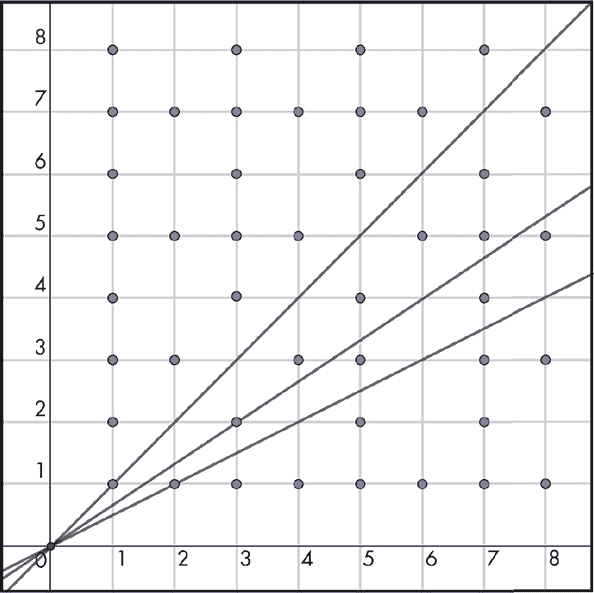

*图 8-13：可见和被遮挡的格点*

可见点的坐标，如(1, 1)、(7, 2)和(3, 8)，是相对素数。被遮挡的点坐标，如(6, 8)和(2, 4)，则不是。图 8-13 中显示的 8×8 方格里有 44 个可见格点，共 64 个格点，因此可见格点的比例是 44 / 64 ≈ 0.6875。这告诉我们 1 到 8 之间的数字对中有相对素数的比例。

现在假设我们扩大了正方形的大小。可见的格点数和相对素数对的数量会发生什么变化呢？这两个数字当然都会增长，但以非常特定的方式增长。随着正方形大小的增加，正方形中可见格点所占比例会趋近于大约 0.608 的极限值。令人惊讶的是，这个数字与*π*相关。它是 6/*π*²。之所以这样，是因为这个原因稍微有些复杂，不适合在本书中讨论（如果你有兴趣，它与黎曼 ζ 函数有关），但我们仍然可以探讨该比率的变化，并利用它来估算*π*的值。

#### 项目 32：仅使用可见的格点

让我们编写一个程序，计算给定大小的第一象限正方形内可见格点的数量，并使用该计数来计算*π*的近似值。（我们这里使用正方形而不是圆形，因为在正方形中使用嵌套循环生成格点更容易。）由于每个可见格点的坐标将是相对素数，我们可以使用我们为项目 9 在第二章中创建的自定义 `gcd`（最大公约数）块来帮助（查看图 2-17，它的定义在第 38 页）。如果一组坐标的最大公约数是 1，我们就找到了一个可见的格点。图 8-14 显示了代码。

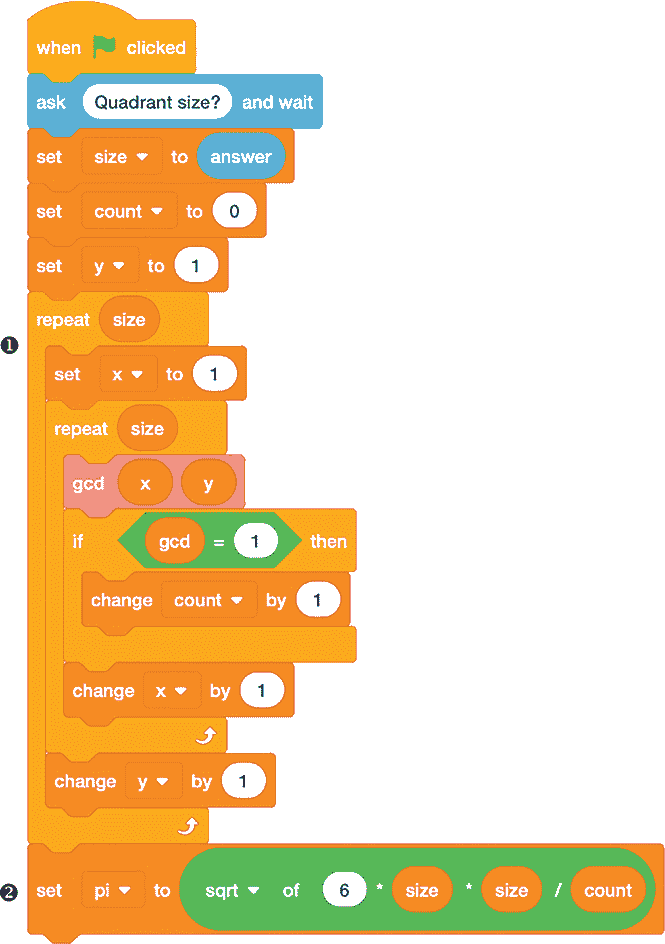

*图 8-14：通过计算可见格点来近似*π**

我们提示输入象限的大小，然后使用嵌套循环 ❶ 测试正方形内所有格点，正方形的左下角是（`1`，`1`），右上角是（`size`，`size`）。我们从（1,1）开始，这样我们总是在计算一对正整数的 GCD。对于每一个其坐标的 GCD 为 `1` 的可见格点，我们递增 `count` 变量。

循环完成后，我们使用 `count` 的值来近似*π*。我们已经知道以下内容：

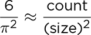

解出*π*，我们得到：

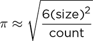

我们将在程序结束时进行这一计算 ➋。

##### 结果

运行这个程序并对一个相当大的正方形进行计算，比如 `size = 1000`，然后观看 Scratch Cat 在几秒钟内统计格点数量，十分有趣。*图 8-15* 显示了结果。如之前所说，样本越大，近似结果越精确。

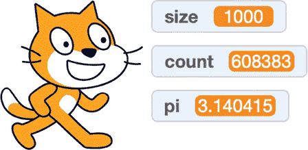

*图 8-15：大小为 1,000 的正方形中的可见格点*

再次强调，*π*的值至少在前几位小数上是准确的。

 编程挑战

**8.3** 可见格点枚举背后的序列是：

*π*²/6 = 1 + 1/4 + 1/9 + 1/16 + . . . + 1/*n*² + . . .

使用 Scratch 来验证这一点，尝试计算前几个部分和：

1, 1 + 1/4, 1 + 1/4 + 1/9, . . .

**8.4**涉及无穷级数的*π*公式为*π*/4 = 1 – 1/3 + 1/5 – 1/7 + ……。这有时被称为*格雷戈里级数*。编写 Scratch 程序，使用这个公式来计算*π*的前几个数字。

**8.5**挑战 8.3 中的级数由所有正项组成，而格雷戈里级数的项在正负之间交替。比较每个级数需要多少项才能得到精确到小数点后三位的*π*值。一般来说，交替级数的收敛速度比正项级数慢得多。

**8.6**在项目 31 中，我们使用了两种区域计算方法来近似*π*：一种是使用正方形中的每个点，另一种是随机抽样点。尝试将类似的随机方法应用于项目 32。检查随机抽样的格点，计算有多少点的坐标是互质的，并使用该计数来近似*π*。

### 结论

数字*π*在数学中出现的地方很多，这也导致了许多不同的计算方法来近似它的值。由于 IEEE 754 浮点表示的限制，Scratch 无法精确表示*π*。不过我们也做不到这一点，因为*π*的数字是无限延续的！不过，在 Scratch Cat 的帮助下，我们可以用多种方式轻松近似*π*的值，精度可以达到 15 或 16 位。
