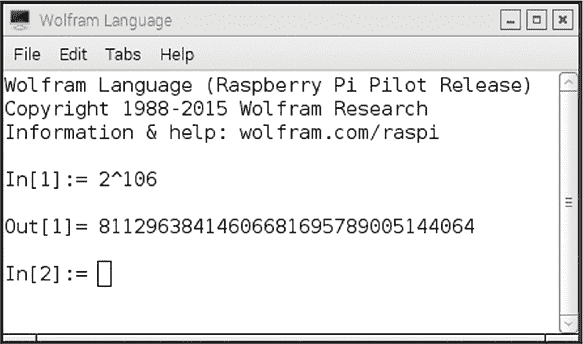
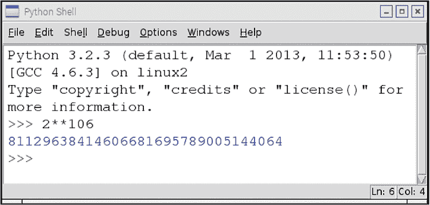
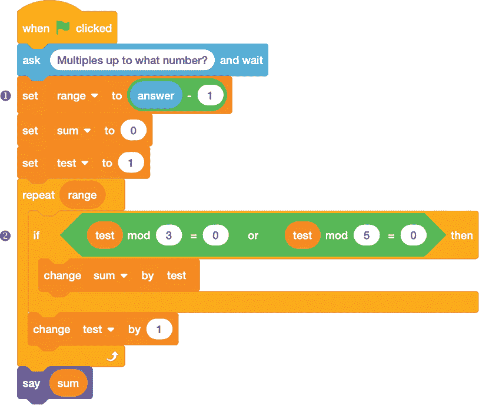
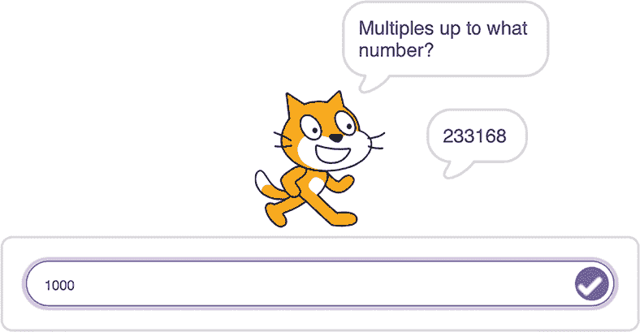
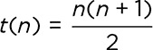
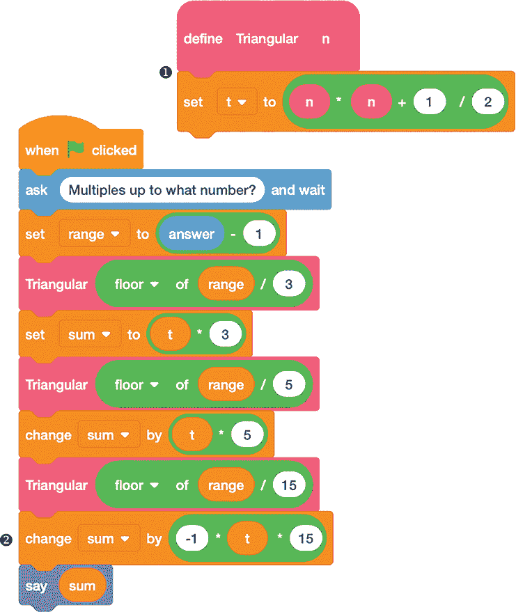

## 第九章：## **接下来做什么？**

祝贺你通过了以 Scratch 辅助数学和以数学辅助 Scratch 的八章！希望你在这里读到的内容能激励你继续尝试和学习更多。本章提供了一些关于下一步去哪里的想法，无论你是想尝试另一种编程语言，还是寻找新的数学问题和解决方法。

### 学习其他语言

我是在上世纪 70 年代初学习编程的，当时用穿孔卡编写 FORTRAN 和 COBOL 代码，站在神奇的作业控制卡和等待计算机中心打印输出之间。在 1972 年达特茅斯学院的数学协会（MAA）会议上，我有机会尝试约翰·克门尼的 BASIC，使用分时共享打印终端让我感到惊讶。我从未想过会有像 Scratch 这样的语言，它对每个人都是可接触的，具有拖放界面、集成声音和图形以及能够在眨眼间进行复杂计算的能力。

互联网提供的按需资源已经改变了世界。然而，1970 年我用 FORTRAN 写的第一个程序（当然是“Hello, world!”之后）是一个基于章节 1 中的基数转换实用程序，用于二进制和十进制之间的转换。计算工具箱多年来发生了巨大变化，资源的可用性、功能和易用性都有了显著提升，但探索的数学理念仍然具有相同的基础。

如今，我不建议学习 FORTRAN 或 COBOL，但你可能想要探索其他编程语言。在章节 1 中，我们讨论了 Scratch 中数字的浮点表示限制了可以研究的数字范围。其他语言设计时没有这些限制，或者它们有标准扩展可用以克服这些限制。其中两种语言，Python 和 Mathematica，与树莓派计算机捆绑在一起，以及 Scratch。Mathematica 是一款商业产品，可在 Linux、Windows 或 macOS 上运行，而 Python 可以在*[`www.python.org`](https://www.python.org)*免费下载，适用于多种操作系统。

这两种语言特别适合探索数字理论的应用，因为它们本地支持任意精度整数运算——没有溢出和四舍五入。例如，图 9-1 展示了 Mathematica 计算 2¹⁰⁶（flintmax 的平方），这与我们在章节 1 中编写的 Scratch 程序计算的大值相同。

*图 9-1：在 Mathematica 中计算 2¹⁰⁶*

图 9-2 展示了 Python 中相同的计算。

*图 9-2：在 Python 中计算 2¹⁰⁶*

不仅计算结果是用所有数字显示，并且答案是以数字形式给出的，而不是字符串形式，而且语言本身有原生的幂运算符（`**`或`^`），使得指数表达式的编写变得非常简单，无需编写循环代码。

### 查找更多问题

如果你想探索更多的数学问题，可以从你周围的世界开始。你可能会看到一串数字，心里想“如果……呢？”或者发现一个模式，觉得“这个有意思！”通过 Scratch，你可以探索看看接下来会发生什么。这个模式会继续吗？如果会，可能是时候寻找原因了。如果模式中断了，或许你可以加上一些额外的条件来修复它，拯救局面。

还有很多其他人提出的问题，你可能会想要探索。别人提出的问题保证至少会对另一个人感兴趣（即提出问题的人），而且它很可能是一个“金发姑娘问题”：既不太容易到没有人关心，也不太难到没有人能解决。

我最喜欢的、利用计算机来支持数学问题的网站是 Project Euler (*[`projecteuler.net`](https://projecteuler.net)*)。它提供了超过 800 个问题，随着时间的推移还会不断增加，提供了各种类型和难度等级的计算挑战。你可以追踪自己的进度，并通过解决某些问题获得奖励，还可以在论坛中与其他解题者交流，分享他们的见解和代码。

正如 Project Euler 网站所说，每个问题都是根据“1 分钟规则”设计的。这意味着，尽管设计一个成功的算法可能需要数小时的思考和编码，但一个高效的程序将允许即使是性能较低的计算机也能在不到一分钟的时间内给出答案。例如，网站上的第一个问题如下：

如果我们列出所有小于 10 的自然数中是 3 或 5 的倍数的数，我们得到 3、5、6 和 9。它们的和是 23。

求所有小于 1,000 的 3 或 5 的倍数之和。

让我们用 Scratch 的方式来解决它！

#### Project 33: 破解 Project Euler 问题 1

图 9-3 展示了一些代码，用于计算所有小于给定限制的 3 或 5 的倍数的和。

*图 9-3：Project Euler 问题 1 的代码*

这是一个`repeat`循环，测试每个从 1 到指定上限减一的数字（问题描述中说“低于 1,000”，所以我们在循环中不包括上限本身 ❶）。我们使用`mod`块来检查是否是 3 或 5 的倍数 ➋，如果符合其中任何一个可整除条件，则增加`sum`。

##### 结果

让我们看看 Scratch Cat 对这个问题的看法。图 9-4 展示了一个解决方案，适用于上限为 1,000 的情况。

*图 9-4：项目欧拉问题 1 的答案*

当然，Scratch 生成答案的时间不到一分钟！

##### 破解代码

项目欧拉问题要求我们找出所有小于 1,000 的 3 和 5 的倍数的和，Scratch Cat 给出的答案是 233,168。问题描述中还给出了 10 作为示例，并给出了和为 23。那么，如果我们尝试其他 10 的幂呢？表 9-1 显示了一些结果。

**表 9-1：** 3 和 5 的倍数之和

| **上界** | **和** |
| --- | --- |
| 10 | 23 |
| 100 | 2,318 |
| 1,000 | 233,168 |
| 10,000 | 23,331,668 |
| 100,000 | 2,333,316,668 |
| 1,000,000 | 233,333,166,668 |
| 10,000,000 | 23,333,331,666,668 |

看起来好像有一个模式在出现（看看那些重复的 3 和 6！），但是当我们处理更高的 10 的幂时，代码会变得很慢。问题是程序逐一检查每个数字，因此必须数到结束值。数到 10 亿所需的时间是数到 1,000 的 1 百万倍。也就是说，即使你的计算机能在 1 秒钟内数到 1,000，它也需要 1 百万秒，或者超过 11 天，才能数到 10 亿。根据你的耐心，这可能是等待答案的时间太长。

理想情况下，应该有一种方法能够在不逐一计算的情况下将所有 3 和 5 的倍数加起来。关键是看到 3 的倍数加起来是 3 + 6 + 9 + . . . = 3(1 + 2 + 3 + . . .)，然后认识到 1 + 2 + 3 + . . . 是一个三角形数列，就像我们在第四章讨论的那样。同样，5 的倍数加起来是 5 + 10 + 15 + . . . = 5(1 + 2 + 3 + . . .)。

我们有一个来自第四章的公式来计算*n*的三角形数，该公式来源于图 4-13：

我们可以使用这个公式来简化计数过程，如图 9-5 所示。

*图 9-5：项目欧拉问题 1 的三角形数方法*

首先，我们创建一个自定义块来计算*n*的三角形数❶。然后，我们在主程序中使用这个块三次。第一次，我们传入`range/3 的下限`，然后将结果乘以`3`。这给我们的是所有小于`range`的 3 的倍数的和。第二次，我们传入`range/5 的下限`并将结果乘以`5`，这给我们的是所有小于`range`的 5 的倍数的和。

将这两个数字相加能让我们接近答案，但存在一个问题：任何 15 的倍数被计算了两次，作为 3 的倍数和 5 的倍数。所以我们再使用一次 `Triangular` 块，传入 `range/15` 的地板值，并将结果乘以 `15`。这会给我们所有小于或等于 `range` 的 15 的倍数之和，我们将其从 `sum` 中减去，得到最终结果 ➋。这个技巧是一个通用方法，叫做 *包含–排除原理*；你可以在任何时候使用它来跟踪多个重叠条件满足的次数，而不重复计算重叠部分。

果然，这段代码的输出与程序的第一个版本匹配，且优点是它能够快速给出答案，一直到 flintmax。

 编程挑战

**9.1**更改图 9-3 中的代码，以允许使用与 3 和 5 不同的倍数。让 Scratch 猫询问使用哪些倍数，并将其添加到程序中。

**9.2**使图 9-5 中的代码也能适用于不同的倍数组合。这里要小心：你需要确保即使这些数字不是互质的，解决方案仍然有效。

**9.3**弄清楚如何在有三个互质的倍数需要筛选而不是两个时，编程实现包含–排除技巧。

### 超越 Project Euler

如果你已经完成了 Project Euler，并准备继续挑战更多内容，以下是一些你可以在你喜欢的搜索引擎中尝试的搜索词，可能会引导你找到其他有趣的问题：

**数学挑战问题** 这可能会出现不同难度级别的问题；选择适合你的那些。

**Scratch 挑战** 这些问题大多集中在图形和游戏方面，但你也会发现一些数学挑战。

**Scratch 数学游戏** 这更可能出现以数学为重点的练习和想法。

**MAA *Convergence*** 这将引导你到美国数学会的期刊《*Convergence*》，该期刊有一个按时间顺序、地理位置或主题整理的开放访问问题列表。重点通常不在于编程，但有时进行一些实验是一种了解事物发生原理的好方法。

这些搜索结果有可能出现太简单或太困难的问题。但即便一个问题让你感到无聊或困惑，它也可能是一个通往合适变体的入口。

### 更多 Scratch 项目供你探索

如果你想找到更多专门为 Scratch 设计的数学项目，一个很好的地方是 Scratch 网站，* [`scratch.mit.edu`](https://scratch.mit.edu)*。在顶部有一个搜索框（见图 9-6），你可以用它来查找社区成员发布的各种项目。

*图 9-6：在 Scratch 中寻找更多数学内容的地方*

Scratch 哲学认为代码应该被共享，任何已发布到网站上的内容都可以复制和扩展，只要你给原作者适当的信用。网站上有许多程序，它们是初学者的作品，适合轻松玩耍，还有一些非常精巧的作品。

以下是一些用于 Scratch 网站的搜索词，将引导你找到与本书中构建的程序相关的有趣项目：

##### 第一章：计算机如何看待数字

+   二进制时钟

+   三进制

+   八进制

+   小数分数

+   二分查找

+   数学解析器

+   浮动点数

##### 第二章：探索可除性和素数

+   模乘法表

+   孪生素数

+   厄拉托斯特尼

+   网格序列

+   分数加法器

+   埃及分数

+   可除性测试

##### 第三章：用素因数分解拆解数字

+   试除法

+   因式分解

+   梅森素数

+   约数和

+   费马素数

+   半素数（*另一种说法是*双素数）

+   卢卡斯–莱默

+   螺旋图

+   重复数（像 1111 这样的数字，只包含数字 1）

##### 第四章：在序列中寻找模式

+   斐波那契数列

+   帕多万数列

+   三角形数

+   泽肯多夫

+   五边形数

+   几何艺术

+   数字模式

##### 第五章：从序列到数组

+   帕斯卡三角形

+   二项式系数

+   魔方阵

+   直方图

+   分布

+   模算术

##### 第六章：制作代码，也破解它们

+   秘密代码

+   凯撒密码

+   隐写术

+   模逆

+   一次性密钥

+   频率分析

+   公钥

##### 第七章：计数实验

+   组合学

+   8 皇后

+   握手问题

+   递归

+   谢尔宾斯基

##### 第八章：三次π的帮助

+   布丰

+   水龙头

+   τ（不是约数函数的数量，而是与 *π* 相关的一个量！）

+   π 计算器

### 结论

Scratch 就像是一个思维放大器，让你能比自己独立思考时更加深入地看到模式。在本书中，我们使用 Scratch 探索了算术、数论、几何学、密码学、序列和数组——这只是它能做的一部分。

无论你是坚持使用 Scratch 还是转向其他编程语言，Scratch 提供的算法和通过计算机辅助视觉看待世界的方式都能帮助你成为一个更具创意思维的人。我希望有一天能在我的 Scratch 工作室见到你 (*[`scratch.mit.edu/studios/29153814`](https://scratch.mit.edu/studios/29153814)*)，也很期待看到你决定分享的本书程序的任何变体或扩展。在那之前，继续编程吧！
