## 第十章：**A**

## **编程挑战提示**

学习数学涉及在课堂上学习和理解数学概念，使用教科书和工作表。这可能是一个被动的过程，你只是试图吸收信息。另一方面，*做*数学涉及积极地应用概念来解决问题并创建新的数学模型。这个过程需要创造力和解决问题的能力，以及批判性和逻辑性思维的能力。

编程是做数学的重要组成部分，它让你能够自动化复杂的计算和构建，从而以在纸上或脑中无法实现的方式探索数学思想。本书的全部内容都是关于使用 Scratch 做数学——编写算法和进行数值计算——编程挑战是邀请你“动手”解决一些实际问题。本章提供了一些注释和代码片段，以帮助你解决这些挑战。

### 第一章：计算机如何理解数字

#### 挑战 1.1

作为第一步，你可以使用像图 A-1 中的循环来列出基数 *b* 数字的各个数字。然后，你可以将这些数字组合成一个字符串，使答案看起来像一个基数 *b* 数字，使用像图 A-2 中的代码。

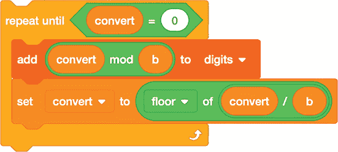

*图 A-1：转换为基数* b

对于基数 11 或 12，检查 `convert mod b` 是否为 `10` 或 `11`，如果是，则在将结果添加到 `digits` 列表之前，替换为 `T` 或 `E`。

*图 A-2：将数字组合成一个字符串*

#### 挑战 1.2

图 A-3 显示了一些适用于基数 11 或基数 12 的代码。你可以添加更多情况以支持基数 16。

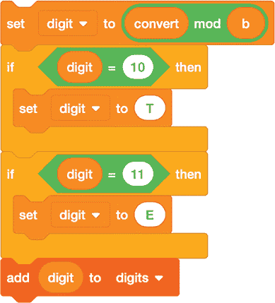

*图 A-3：将字母替换为数字*

当你从二进制转换为十六进制时，每四个二进制数字（从最不重要的位开始，或者说最右边的位）相当于一个十六进制数字。例如，二进制的 1011 转换为十六进制的 E。

#### 挑战 1.3

你可以通过向列表中添加新项来扩展它。假设你已经要求用户指定列表的起始值、变化值（存储在变量 `change` 中）以及列表的长度（存储在变量 `length` 中）。图 A-4 显示了一些代码，用于根据指数增长和线性增长计算列表中的剩余值。每种类型的增长都有自己的列表。

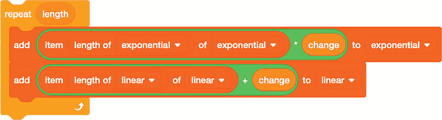

*图 A-4：比较指数增长和线性增长*

#### 挑战 1.4

使用线性增长，计算到 Scratch 的绝对最大数值将需要漫长的时间，但使用指数增长（参见挑战 1.3），你可以非常迅速地达到目标。例如，通过倍增，只需要 1,024 步。Scratch 能表示的最大数字约为 1.08 ⋅ 10³⁰⁸；超出这个范围，报告的值为`Infinity`。图 A-5 展示了如何达到这个数值。

#### 挑战 1.5

解决这个挑战的最佳方法是将 IEEE 表示中的 64 位二进制数字当作字符串处理。幸运的是，Scratch 舞台上有足够的空间显示一个包含 64 个字符的变量的完整值。图 A-6 对字符进行了编号（按十个一组），以展示屏幕的宽度，尽管你实际二进制表示时只会使用字符 0 和 1。

*图 A-5：通过倍增达到无限*

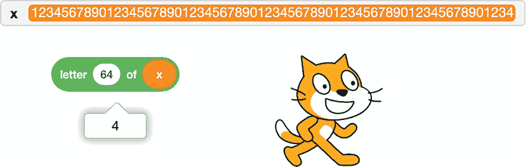

*图 A-6：舞台上有足够空间显示 64 位。*

将二进制表示视为字符串，可以通过`letter of`块提取单个位。你可能希望将这些位存储在一个列表中，这样更容易操作它们。

#### 挑战 1.6

要计算 3^(*n*)，你需要做的就是将`replace item`块 ❶中的乘数从`2`改为`3`，见图 1-13。图 A-7 显示了更新后的块。

*图 A-7：计算 3 的幂而不是 2 的幂*

#### 挑战 1.7

确保在将答案从五位数字块的列表转换回字符串时，较小的数字被适当填充 0。例如，如果“数字”是 435，它应该变成 00435 然后再与字符串连接。你可以通过几个 `if` 块来实现这一点。

#### 挑战 1.8

从提示一个数字开始。将其视为字符串，并通过逐个取出字符串中的字符（从最右边的字符开始，即最低位数字）来创建一个数字列表。对第二个数字也做类似的处理。将两个列表中相应的数字相加，并且如果有进位，将其分开存储，以便加到下一对数字上。如果数字位数不同，可以通过在较小的数字的数字列表中填充 0 来完成加法运算。

### 第二章：探索可除性和质数

#### 挑战 2.1

图 A-8 显示了一个自定义块，可以在无限循环中使用，既用于 Scratch Cat 的回合，也用于筛选你的答案，以检查你是否正确找到模式。它检查一个数字是否能被 5、7 或 35（即 5 和 7 同时）整除，并将该数字“转化”为适当的短语。

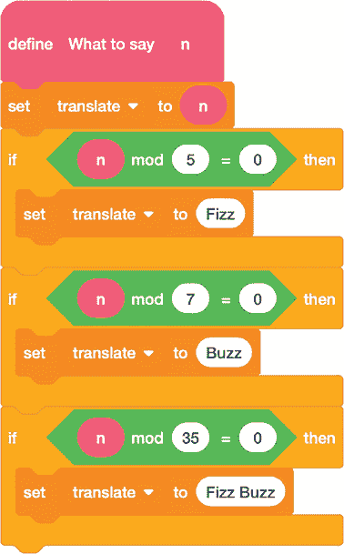

*图 A-8：用于玩 Fizz-Buzz 的块*

#### 挑战 2.2

为了计算交替数字和，最好将输入数字 `n` 视为字符串，就像我们在 图 2-2 的除九法程序中所做的那样。然后，`n` 的每个数字可以当作字符逐个提取并单独处理，使用 `letter i of n`。为了在加法和减法之间交替，可以创建一个名为 `plus minus` 的变量，并在每个数字之后将其乘以 `-1` 来切换其值，从而在 `1` 和 `-1` 之间切换。图 A-9 提供了一些起步的代码。

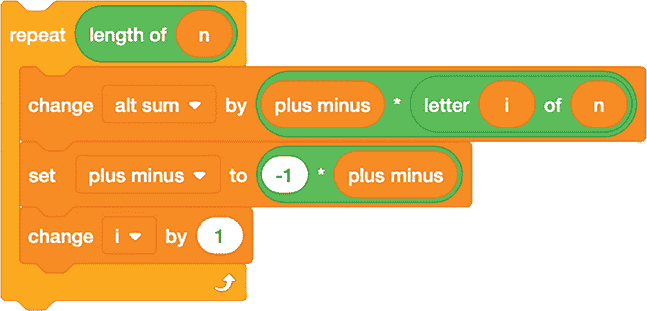

*图 A-9：使用交替数字和来测试是否能被 11 整除*

#### 挑战 2.3

图 A-10 中的代码计算了多少随机数能被 9 整除。

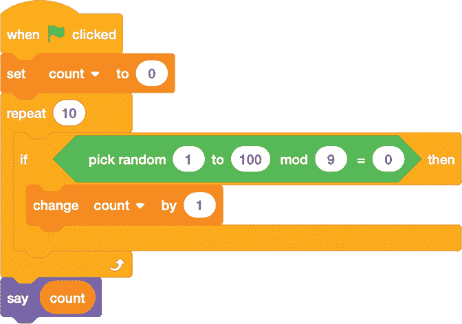

*图 A-10：测试随机数是否能被 9 整除*

不过，这是一个有点技巧性的问题。你可能认为约有 1/9 的数字能被 9 整除，但在从 1 到 100 这个特定范围内，虽然有 100 个数字，只有 11 个是 9 的倍数，所以实际的概率是 11/100，比 1/9 稍小。尽管如此，由于样本量很小，很难察觉到这个差异。

#### 挑战 2.4

在除九法程序的末尾，变量 `x` 保存着“校验位”。如果把数字当作字符串来处理，并使用 `join` 块，就可以轻松地将该校验位加到原始数字上，正如 图 A-11 所示。

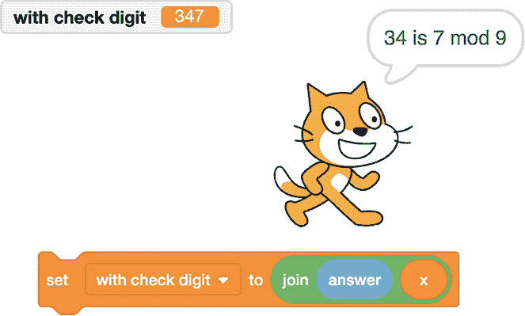

*图 A-11：给数字添加“校验位”*

Scratch Cat 不需要通过校验位说出答案。你可以只让变量 `with check digit` 在舞台上可见。

#### 挑战 2.5

除九法无法帮助捕捉置换错误，因为无论数字顺序如何，数字之和始终相同。

#### 挑战 2.6

表 A-1 显示了随着上界增加，素数比率如何变化。

**表 A-1：素数的比率**

| **上界** | **素数数量** | **比率** |
| --- | --- | --- |
| 10 | 4 | 0.4 |
| 100 | 25 | 0.25 |
| 1,000 | 168 | 0.168 |
| 10,000 | 1,229 | 0.1229 |
| 100,000 | 9,592 | 0.09592 |

素数的相对数量似乎在减少。

#### 挑战 2.7

你需要在筛选输出中寻找连续的 `false`。从 188,030 开始，有连续的 77 个 `false`。

#### 挑战 2.8

图 A-12 显示了一段代码，用来扫描 `primes` 列表中的双胞胎素数。

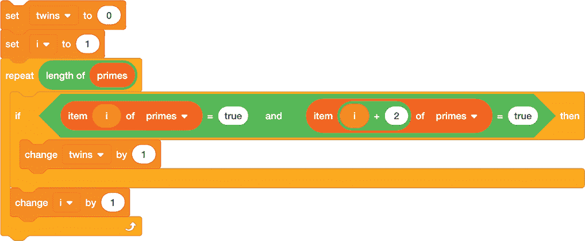

*图 A-12：寻找双胞胎素数*

#### 挑战 2.9

最简单的方法可能是创建一个新列表，其中每个条目包含原始`primes`列表中的六个连续数字，并将它们作为字符串连接在一起。当你在 Scratch 舞台上查看生成的列表时，它将看起来像一个具有六列的表格。然而，你需要小心格式设置，以确保每一列中不同长度的数字对齐得很好。（请参阅第 21 项目和第五章，了解如何实现这种格式设置的示例。）

第 2 列包含所有对 6 取模为 2 的数字，它们能被 2 整除。第 4 列和第 6 列的元素也都能被 2 整除，而第 3 列的元素能被 3 整除。这意味着，素数只能出现在第一行之后的第 1 列和第 5 列。

#### 挑战 2.10

如在“破解代码”部分讨论的那样，你可以使用 Scratch 的感知模块中的`timer`块来跟踪运行时间（详见第 39 页和第 9 项目）。在开始计算时设置一个名为`timer1`的变量，完成后设置一个名为`timer2`的变量，然后计算差值（`timer2 - timer1`），以查看已过去的时间，单位为秒。

如果你正在尝试计时某些非常快速的操作，可能很难分辨出计算机在处理你的问题时花费了多少时间，以及它花费在后台任务上的时间是多少。为了得到更准确的估算，你可以让计算机重复执行你的问题若干次——比如 100 次——然后将总的经过时间除以次数，得到每次运行的平均时间。

#### 挑战 2.11

你可以为图 2-17 中的自定义`gcd`块添加一个步骤计数器，以查看算法执行了多少次循环。图 A-13 展示了更新后的块定义。

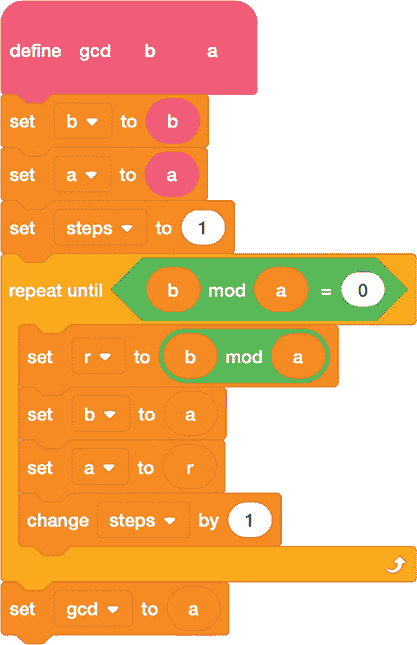

*图 A-13：计算欧几里得算法完成所需的步骤数*

当商较小时时，算法需要更长的时间，因此保持商为 1 可以形成一个漂亮的余数模式。从 3 = 1 ⋅ 2 + 1 开始，接着是 5 = 1 ⋅ 3 + 2，8 = 1 ⋅ 5 + 3，以此类推。你将在第四章再次看到这个模式！

### 第三章：通过素因数分解拆分数字

#### 挑战 3.1

要找到一个完美数，只需检查除数和代码的结果是否等于原始输入数字（第 12 项目，图 3-8）。事实证明，任何偶数完美数 *n* 都满足以下方程，其中 2^(*p*) – 1 是一个素数：

*n* = 2^(*p* – 1)(2^p – 1)

当 *p* = 2 时，方程给出完美数 6。当 *p* = 3 时，方程给出 28。当 *p* = 5 时，方程给出 496，而当 *p* = 7 时，方程给出 8,128。

没有人知道是否存在奇数完美数。

#### 挑战 3.2

图 A-14 展示了一些代码，用于识别一个数字是完美数、过剩数还是缺乏数。将其添加到图 3-8 中除数和程序的末尾。注意，由于除数和包括原始数字`answer`，我们首先减去`answer`以跟踪`适当除数的总和`❶。

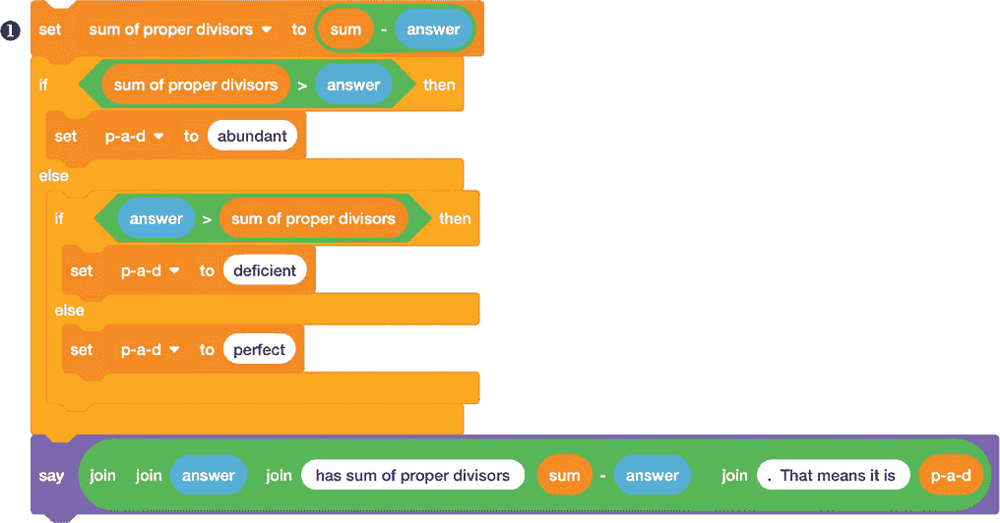

*图 A-14：确定一个数字是完美数、过剩数还是缺乏数*

现在您需要编写一个计数例程，该例程循环直到某个上限，自动将数字输入到除数和程序中。使用三个变量来跟踪过剩数、完美数和缺乏数的数量，每当发现每种类型的数字时，增加相应的变量。10 以内没有过剩数，但 100 以内有 22 个，1000 以内有 246 个。10 以内有 9 个缺乏数，1000 以内有 751 个。

#### 挑战 3.3

该代码为 0 指数给出了正确的答案，即使底数为 0。

#### 挑战 3.4

图 A-15 展示了图 3-7 的修改，允许使用正指数或负指数。

#### 挑战 3.5

图 A-16 展示了如何在计算 *τ*(*n*) 时保存指数列表。该代码替换了项目 11 代码中的原始`repeat`循环（见图 3-6）。

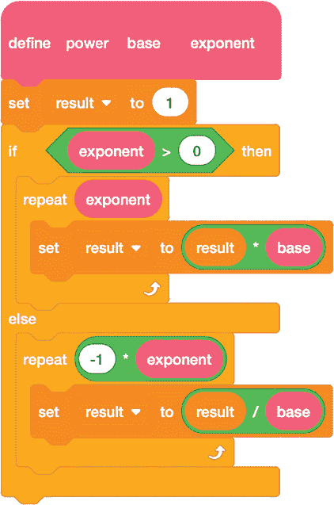

*图 A-15：处理正指数或负指数*

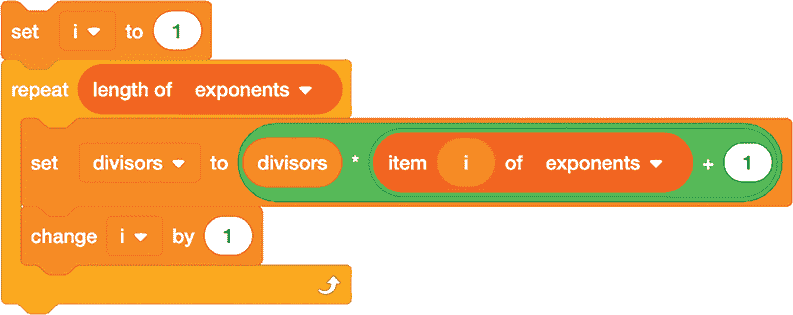

*图 A-16：保存* 指数 *列表*

在计算 *σ*(*n*) 时，您可以使用相同的索引变量`i`，同时遍历素因子和指数。

#### 挑战 3.6

图 A-17 中的自定义块使用一个布尔变量`primeQ`来跟踪其答案。我们首先将`primeQ`设置为`true`，然后通过循环改变其值为`false`，如果`p`可以被任何数字整除。我们只需要查找不超过`p`的平方根的除数。

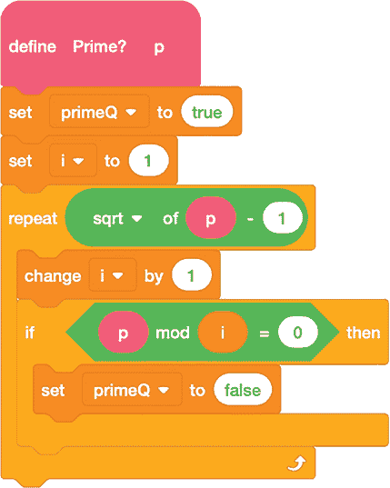

*图 A-17：测试一个数字是否为素数*

您可以通过在第一个`false`之后退出，来让图 A-17 中的代码运行得更快。

#### 挑战 3.7

图 A-18 展示了一个块，用于找到`n`之后的下一个素数。

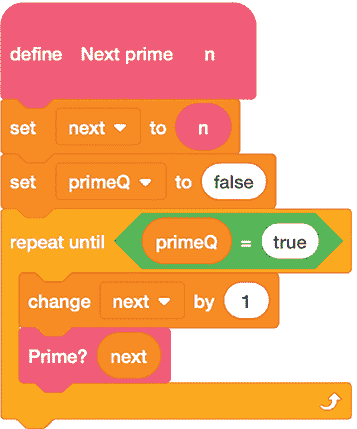

*图 A-18：寻找下一个素数*

该块从`n`开始向前推进，将值传递到挑战 3.6 中的素数检查块，直到它达到一个使`primeQ`为`true`的数字。

#### 挑战 3.8

想象内轮所走的轨迹是直线而不是环的内部。每次完整旋转时，环会在直线轨迹上添加 96 个齿。96 个齿和 *b* 个齿的最短公共轨迹包含 LCM(*b*, 96) 个齿——这时，轮子会回到起点，绘制完成。每 *b* 个齿就确定一个点，因此总共有 LCM(*b*, 96) / *b* 个点。

#### 挑战 3.9

你可以通过挑战 3.6 中的自定义积木来完成此挑战。

#### 挑战 3.10

为了比较分解方法，你可以使用图 2-19 中的计时器黑客。对于小于 flintmax 的数字，试除法通常更快，但如果被分解的数字 *n* 是一个双素数，且两个素因子都接近 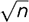，那么费马分解法可能会更快。

#### 挑战 3.11

这里是一些通用代码，使用 Pen 扩展来用像素绘制舞台，这些像素的颜色值（0 为白色，1 为黑色）来自二进制消息。我们将从图 A-19 中的`initial setup`积木开始。

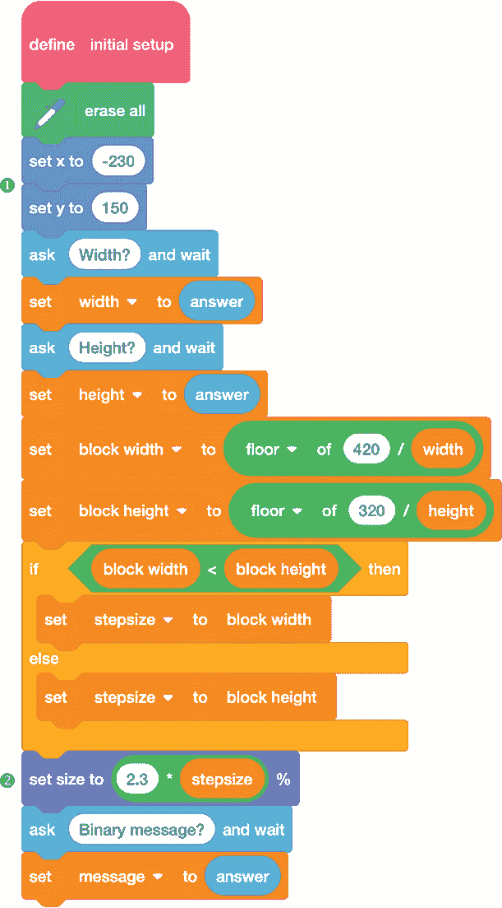

*图 A-19：准备绘制消息*

这个积木首先将起始坐标设置为舞台的左上角附近的位置❶。然后，它会询问`width`和`height`，即你希望消息包含的列数和行数。接下来，它通过将舞台的总宽度和高度分别除以消息的宽度和高度来确定每个块的大小。将通过在适当的像素位置添加印章来绘制消息的精灵是一个 9×9 的黑色方块，该方块会被缩放以适应正在绘制的网格➋。

图 A-20 中的代码完成了绘制消息的工作。

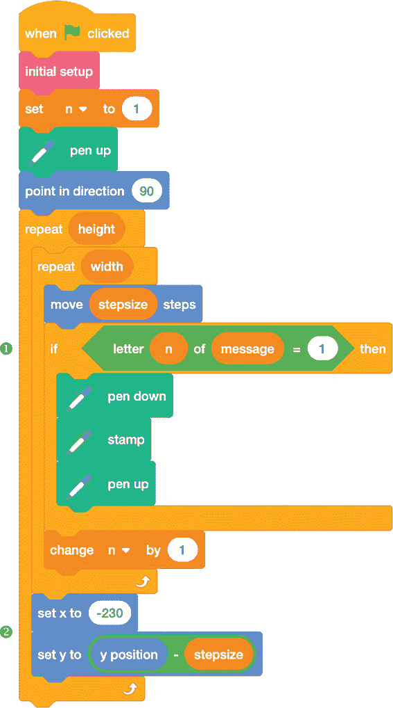

*图 A-20：绘制消息*

我们通过两个循环来指定消息的矩形大小，一个循环处理`height`，另一个循环处理`width`。`message`是一个比特串（0 和 1）。我们使用变量`n`逐位查看消息，为每个为 1 的比特绘制印章❶。在每行的末尾，我们将光标移动到下一行的开始位置➋。

你可以使用这个程序通过复制并粘贴 Arecibo 消息的 1,679 位来绘制其内容，或者如果你愿意，也可以手动输入它们。或者，你可以在“3-PC11 二进制消息到像素” Scratch 项目中测试该程序，该项目由 rumpus88366 创建（* [`scratch.mit.edu/projects/771257850`](https://scratch.mit.edu/projects/771257850) *），如图 A-21 所示。

*图 A-21：一个测试消息*

当消息作为一个七列五行的矩形绘制时，它会生成一个更简单的输出（见图 A-22）。我们称之为 *S*，代表 *Scratch*！

*图 A-22：可视化测试消息*

你可以以各种方式扩展这个程序。例如，程序可以只要求输入消息，并对消息的长度进行因式分解，以找到矩形的适当尺寸，假设该长度是双素数。

### 第四章：在序列中寻找模式

#### 挑战 4.1

Lucas 序列的开始是 2, 1, 3, 4, 7, 11, 18, 29, 47, …… Lucas 数字（用 *l* 表示）和斐波那契数字（用 *f* 表示）之间有很多有趣的关系。例如：

*f[n]* [– 2] + *f[n]* = *l[n]*

#### 挑战 4.2

为了从 *f*[1] 向后扩展斐波那契数列，我们需要理解 *f*[0]、*f*[-1]、*f*[-2] 等等。我们可以从 *f*[0] 应该是我们需要加到 *f*[1] = 1 才能得到 *f*[2] = 1 的数开始。因此，*f*[0] = 0。为了保持递推关系，我们需要 *f*[-1] = 1，*f*[-2] = -1，*f*[-3] = 2，依此类推。它是原始的斐波那契数列，但每隔一个值为负数。

图 A-23 中的程序使用了一系列 `if` 语句来报告给定索引的斐波那契数，包括负索引。

*图 A-23：计算正负斐波那契项*

最初的几个 `if` 语句处理了序列中索引从 -2 到 +2 的初始值。对于其他索引，自定义的 `Fibonacci` 块计算斐波那契数，假设索引是正数。对于奇数负索引，结果会被转换为负数。

#### 挑战 4.3

在 flintmax 之前的最后一个值出现在第 78 行。结果报告为 `Infinity` 之前的最后一个值出现在第 1,476 行。

#### 挑战 4.4

要生成系数，你需要知道序列中第 0、1 和 2 项的值。我们分别称这三个值为 *r*、*s* 和 *t*。（在第四章中，我们大多讨论的是以第 1 项开始的序列，但它们也可以有第 0 项。）我们可以将这三个值看作是二次多项式函数 *f* (*x*) = *ax*² + *bx* + *c* 在 *x* 等于 0、1 和 2 时的结果。

想想当 *x* 等于 0 时，二次多项式会发生什么：

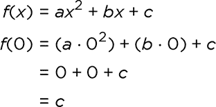

系数 *a* 和 *b* 被消去，只剩下 *c*。因此我们称为 *r* 的序列第 0 项的值，也必须是 *c* 的值。那么 *x* = 1 的情况呢？

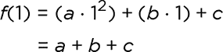

这告诉我们，序列中的第 1 项，也就是我们称之为 *s* 的项，是三个系数的和。那么 *x* = 2 时呢？

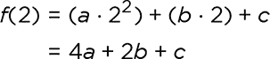

这相当于序列中的第 2 项，也就是我们称之为 *t* 的项。

通过一点代数运算，我们可以利用这些结果写出 *a*、*b* 和 *c* 的单独公式。它们是：

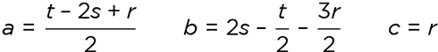

在你的程序中，你将从一个数列中取出第 0、1、2 项，并将它们代入这些公式作为变量 `r`、`s` 和 `t`。对于五边形数列，你应该得到 *a* = 3/2，*b* = -1/2，*c* = 0。

这种巧妙的数学技巧，用来通过二次多项式的前几个值来确定系数，被称为 *未定系数法*。

#### 挑战 4.5

这是一个巧妙的方式，要求找出你能找到的最长的连续合成数集。你在挑战 2.7 中解决了这个问题。

#### 挑战 4.6

图 A-24 修改了 项目 1 的十进制到二进制转换器，以生成一组二进制数。新的 `有多少个 1？` 块计算每个二进制数中 1 的个数，并将结果存储在一个单独的列表中，从而创建出所需的序列。

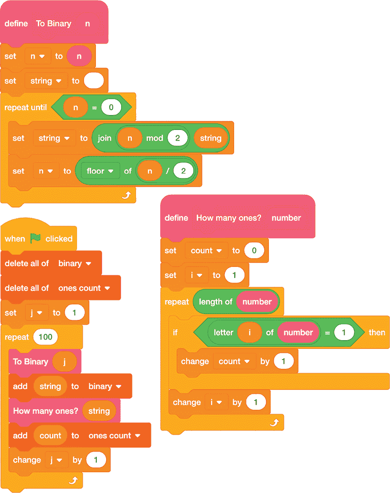

*图 A-24：计算二进制数中的 1 的个数*

思考这个数列的一种方式是将其视为由 1、2、4、8、... 等元素构成的块。（每个块的长度是 2 的幂。）要获得下一个块，首先复制前一个块，然后在此基础上再复制一份前一个块，但每个元素加 1。例如：

+   第一块是 1。

+   第二块是 1、1 + 1（或者 1、2）。

+   第三块是 1、2、1 + 1、2 + 1（或者 1、2、2、3）。

+   第四块是 1、2、2、3、1 + 1、2 + 1、2 + 1、3 + 1（或者 1、2、2、3、2、3、3、4）。

这个数列的一个有趣特点是它包含了自身的副本。如果你只看位置 2、4、6、8、10、... 的元素，你会发现它们与原始数列完全相同！

#### 挑战 4.7

斐波那契数列再次出现在第一次、第二次及更高次差分中。

#### 挑战 4.8

类似于斐波那契数列，2 的幂次再次出现在第一次、第二次及更高次差分中。两者的底层指数增长使得它们的差分呈现出相同的模式。

#### 挑战 4.9

第三差分是常数，第四及更高次差分为 0。对于平方数列，第二差分是常数，值为 2 ⋅ 1 = 2，而对于立方数，第三差分是常数，值为 3 ⋅ 2 ⋅ 1 = 6。这是另一个值得检查的模式！

### 第五章：从数列到数组

#### 挑战 5.1

每当 *n*! 的末尾有一个零时，就表示有一个因子是 10。因子 10 来自因子 5 和因子 2。由于因子 2 很多，因此更容易计算因子 5 的个数。每隔五个数就会有一个 5 的倍数，它为 *n*! 贡献一个因子 5。直到 `n`，总共有 `floor of n/5` 个 5 的倍数。此外，还有来自更高次方的因子 5 的额外因子。例如，每隔 25 个数就会有一个 25 的倍数，贡献一个额外的因子 5；每隔 125 个数就会有一个 125 的倍数，贡献又一个额外的因子 5。图 A-25 中的程序第一次通过 `repeat until` 循环时只计算因子 5，然后通过循环的额外周期来计算来自更高次方因子 5 的额外因子。

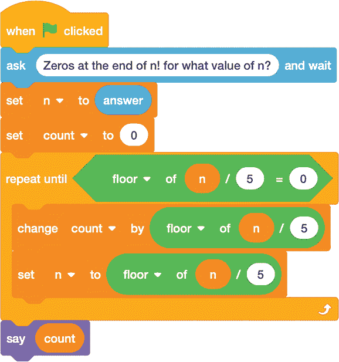

*图 A-25：计算 n 阶乘末尾的零的个数*

程序报告显示 25 的阶乘末尾有六个零。

#### 挑战 5.2

你可以改编来自项目 19 的行生成程序（图 5-7），在计算出行之后提取行条目。图 A-26 展示了一个自定义块，用于计算该行并提取 *k* 位置的条目。你也可以像我们在项目 18 中做的那样（图 5-1）通过阶乘的商来进行计算，但这种方法在处理更多行时能提供更准确的结果。

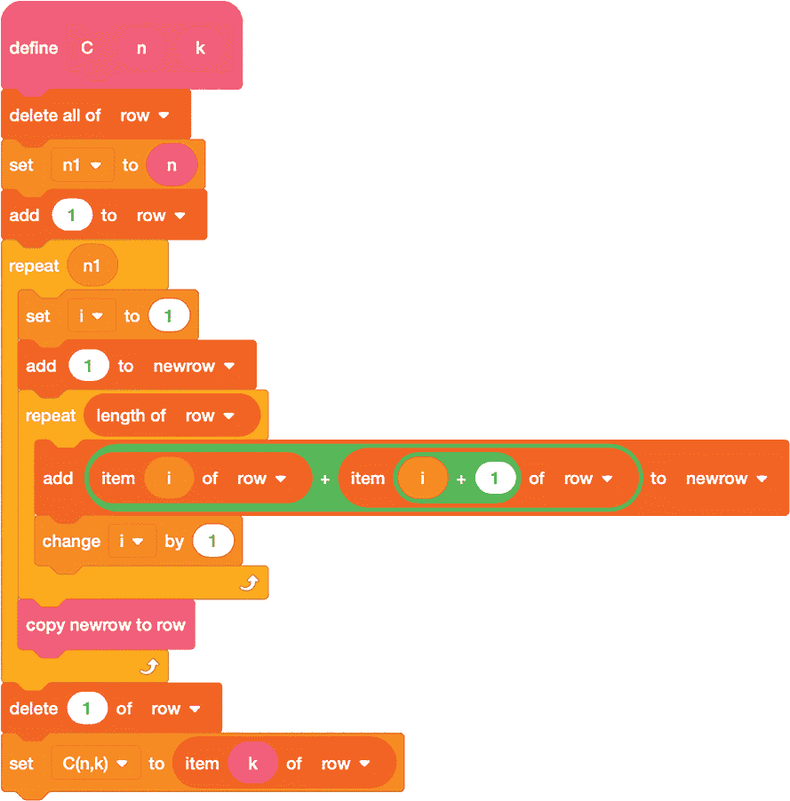

*图 A-26：计算特定的二项式系数*

你需要重复调用这个自定义块，用连续的`n`值，每次保持`k`为`2`不变，将每组结果添加到它自己的列表中。你应该会发现，*C*(*n*, 2) 对角线上的数字就是三角形数字。

#### 挑战 5.3

诀窍是对每个值取模 2，这样偶数变成 0，奇数变成 1。图 A-27 显示了前 32 行帕斯卡三角形模 2 的一种解释。在这里，1 被可视化为黑色方块，0 则为空白空间。

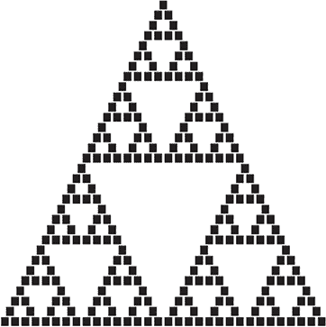

*图 A-27：帕斯卡三角形模 2*

结果的模式被称为谢尔宾斯基三角形。这是一个著名的*分形*例子，一种在不同尺度上重复的模式。

#### 挑战 5.4

你可以使用来自项目 9 的自定义`gcd`块（参见图 2-17）来筛选行和列索引，然后在表格中只包含那些行和列索引都与模数互质的条目。图 A-28 显示了代码的更新。

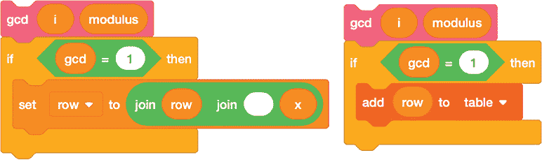

*图 A-28：将运算表限制为与模数互质的行和列*

左侧的堆栈用于`Make index row`块的定义（参见图 5-15），取代`repeat modulus`循环中的`set row`块。右侧的堆栈则放入主程序堆栈（参见图 5-17），替换当前的`add row to table`块。

通过这些更改，模 12 的乘法表的显示效果如图 A-29 所示。

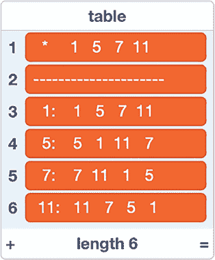

*图 A-29：模 12 的简化乘法表*

#### 挑战 5.5

你可以修改项目 12 中的自定义`power`块（参见图 3-7），使其与模运算一起工作，从而接受一个基数和一个指数并计算该基数的适当幂，模`p`。然后，你可以构建一个自定义的布尔块，测试一个特定的数字`n`是否是一个特定素数`p`的原根。图 A-30 展示了这两个块。

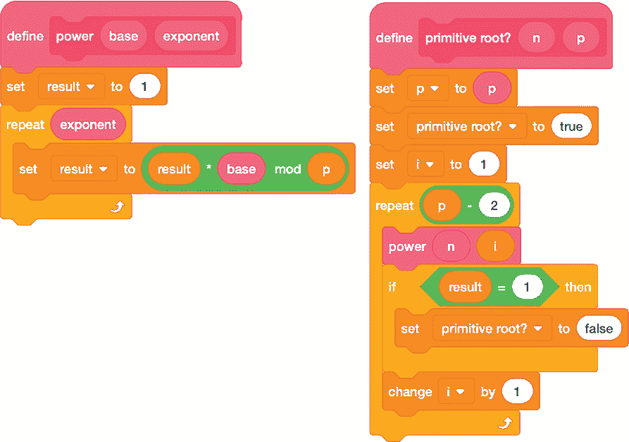

*图 A-30：寻找原根*

`primitive root?`块中的循环会到达`p - 2`，因为如果此时还没有找到一个`n`的幂等于 1，那么最后一个幂将是 1，`n`将是一个原根。

有了这些组件，主程序就是一个循环，用于询问一个素数并找到第一个可以作为原根的数字。作为后续，你可以考虑的两个数学问题是：为什么素数必须有原根，以及是否所有复合数都有原根。

#### 挑战 5.6

你可以精简图 5-15 中的`Make index row`块，去除格式化表格时的索引行和适当填充空格的工作。然后，修改图 5-16 中的自定义`pad`块，在`x`之前插入逗号，而不是一个或多个空格。

你可能还想在将每一行添加到表格之前，去除每一行开头的初始逗号。你可以通过另一个自定义块来完成这个操作。Scratch 并没有像处理列表元素那样让我们处理字符串中的字符，所以你可以像图 A-31 所示，从第二个字符开始重写字符串。

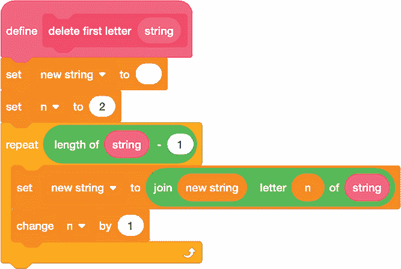

*图 A-31：从字符串中移除第一个字符*

### 第六章：制作代码，并破解它们

#### 挑战 6.1

在你喜欢的绘图程序中绘制一个字母环，类似于图 A-32。将其导入 Scratch 作为标记为`Outer Wheel`的精灵。

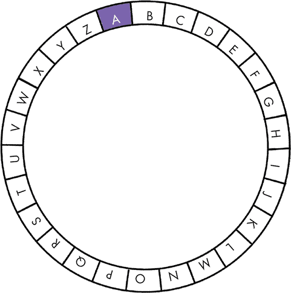

*图 A-32：字母环*

现在，缩小`Outer Wheel`精灵，制作一个足够小以适应其中的精灵，并将其标记为`Inner Wheel`。你需要的唯一代码是一些操作小精灵的代码，如图 A-33 所示。

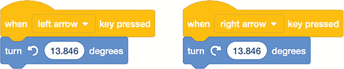

*图 A-33：每次旋转* 内轮 *一个字母*

这段代码将内轮旋转到左侧或右侧。13.846 度的角度是 360 / 26，因此每次按键都会使内轮相对于外轮移动一个字母。

#### 挑战 6.2

H 变成 I，A 变成 B，L 变成 M（见图 A-34）。

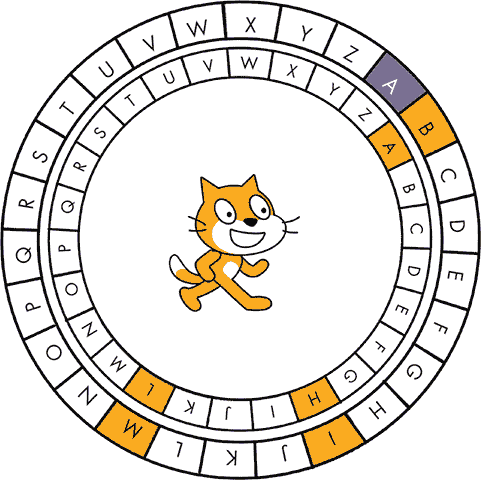

*图 A-34：将 “HAL” 移位 1*

#### 挑战 6.3

*是的* 用法语是 *oui*。你的解码环可以通过移位 16 来翻译这个单词：Y 变成 O，E 变成 U，S 变成 I（见图 A-35）。遗憾的是，它的神奇翻译能力并不能延伸得太远！

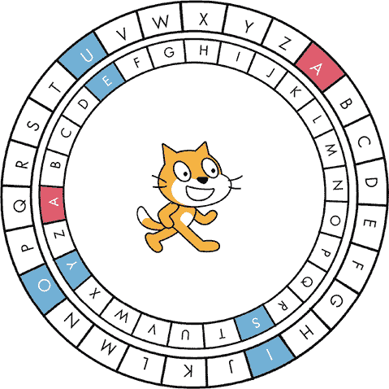

*图 A-35：YES？*

#### 挑战 6.4

这是项目 23 中的程序（见图 6-9）的工作。移位 16 后，解密得到消息：“THERE WILL BE A HOT TIME IN THE OLD TOWN TONIGHT！”

#### 挑战 6.5

问题在于，由于操作顺序的关系，乘法在执行线性变换代码时发生在移位之前。如果你尝试同时撤销两者，乘数也会作用于移位，导致移位结果错误。这就是我们最初将解密过程分为两步进行的原因，以强制在乘法之前先撤销移位。

如果 *s* 是原始的移位因子，那么解决方法是取 –*s* 并将其乘以模逆（对字母表大小取模）。然后，使用该结果作为解密的新移位因子，同时将模逆作为新的乘数。这样，当乘数应用时，逆元会相互抵消，从而得到你想要的移位。

#### 挑战 6.6

图 A-36 中的程序实现了这一点。在提示输入 `modulus`（字母表的大小）和 `multiplier`（乘数）后，它调用我们自定义的 `gcd` 模块（来自图 2-17）来确保存在模逆。如果不存在模逆，程序将退出，否则它将通过试错法计算出逆元❶。然后，程序会提示输入 `shift` 并计算出逆变换的移位 ➋。

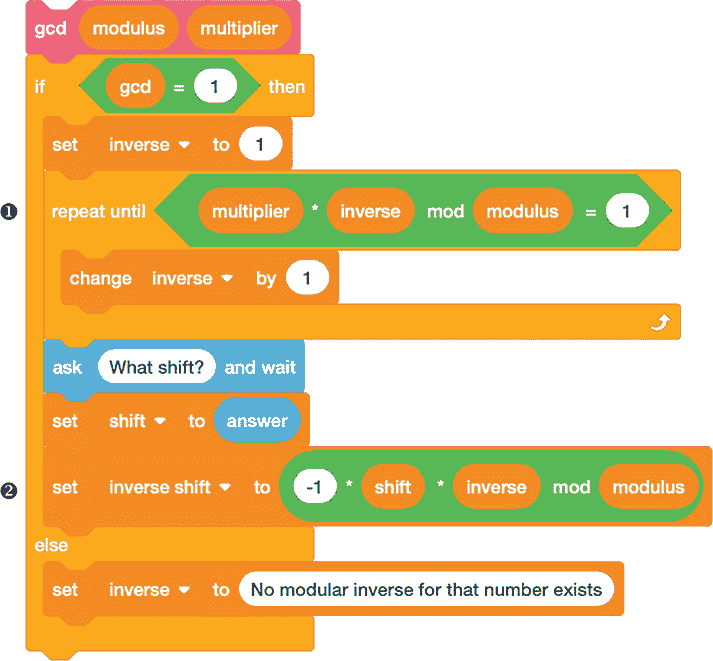

*图 A-36：寻找数字以撤销线性变换密码*

#### 挑战 6.7

如果乘数与字母表的大小不是互质的，那么打乱的字母表将不完整。一些字母会重复出现，其他字母则完全不会出现。另外，也没有模逆，因此无法进行解密。

#### 挑战 6.8

你可以重用本章前面写的一些代码来完成这个挑战，包括图 6-2 中的`Alphabet`块来构建`alphabet`列表，以及图 6-19 中的`Scramble`块来混淆字母表。你还需要一个`Initialize`块来设置`alphabet`列表并提示输入消息（你不需要提示输入移位和乘数，因为你将自己生成所有可能的移位和乘数），以及我们老朋友`gcd`块来自项目 9（图 2-17）。图 A-37 展示了新代码。

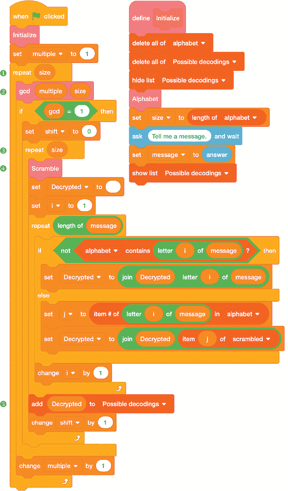

*图 A-37：生成所有可能的线性变换解密*

外部的`repeat`循环遍历所有可能的乘数❶，而内部的`repeat`循环遍历该乘数的所有可能移位➌。这两个循环共同生成所有可能的线性变换，利用`Scramble`根据当前的`multiple`和`shift`参数来混淆字母表 ➍。每个可能的消息通过逐个字符构建在`encrypted`变量中，然后加入到可能的解码列表 ➎。在探索给定的乘数之前，`gcd`测试 ➋确认乘数和字母表大小是互质的。这表示乘数有模逆元素，因此乘数是有效的。

#### 挑战 6.9

混淆字母表的一种简单方法是将每个字母与一个随机字母交换。图 A-38 展示了一个使用自定义`swap`块来实现这一功能的程序。注意，你需要一个额外的变量`x`来暂时保存交换的其中一个值。

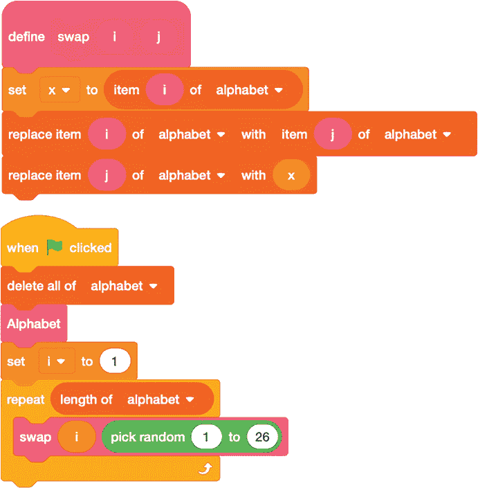

*图 A-38：随机混淆字母表*

如果你希望在舞台上看到整个混淆后的字母表，你可以从`alphabet`列表构建一个字符串，逐个字符地添加（见图 A-39）。

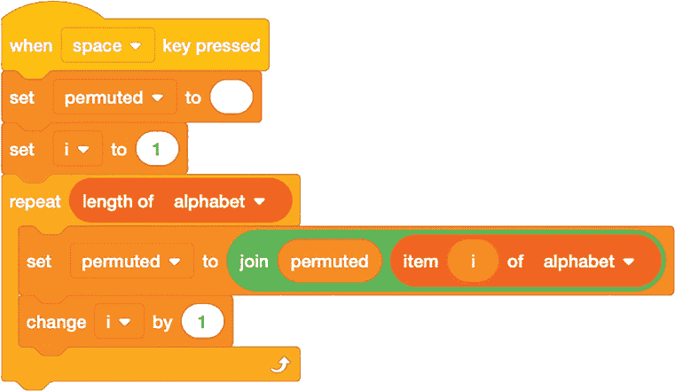

*图 A-39：将混淆后的字母表视为一个字符串*

#### 挑战 6.10

从扩展版的`gcd`代码开始，如图 A-40 所示，该代码会记住商和余数，分别存储为`qlist`和`rlist`。

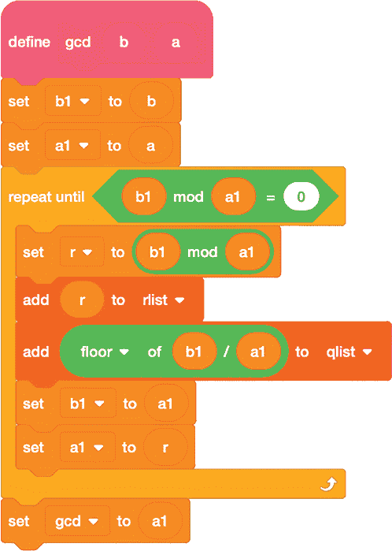

*图 A-40：列出欧几里得算法中的商和余数*

现在你可以对余数进行线性组合，从而表示最大公约数。当你从底部开始替代时，你最终会得到一个由原始数字`a`和`b`构成的线性组合，从而得出最大公约数。图 A-41 展示了这一过程。

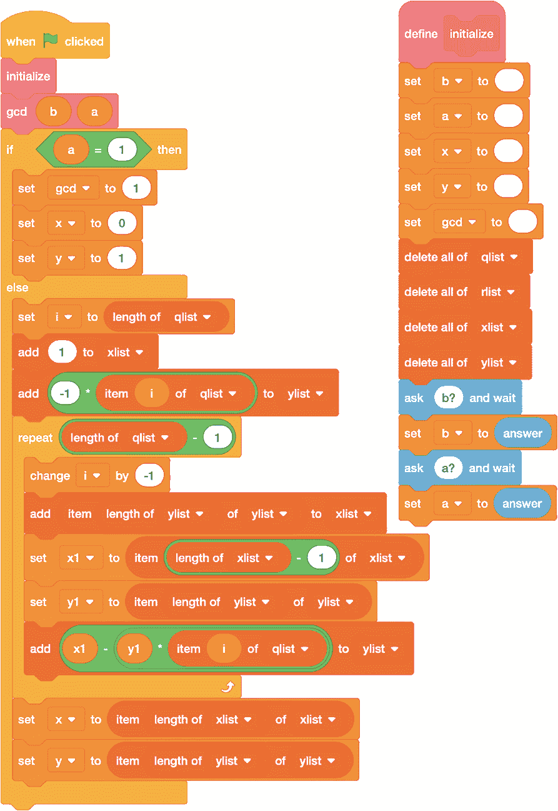

*图 A-41：求解* x *和* y

举个例子，如果你要求程序使用*b* = 26 和*a* = 17，你最终会得到`x = 2`和`y = -3`。这意味着（2 ⋅ 26）–（3 ⋅ 17）= 1，这告诉你–3 ⋅ 17 ≡ 1 mod 26。所以你可以使用–3，或者 26 – 3 = 23，作为 17 的模逆元素。图 A-42 展示了这种情况的输出。

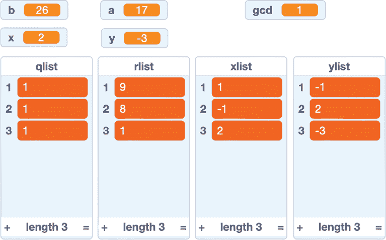

*图 A-42：识别 –3（或 +23）为 17 的模逆元素*

#### 挑战 6.11

该程序的逻辑在其主要部分中，见图 A-43。

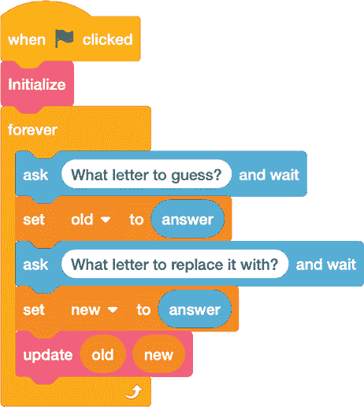

*图 A-43：猜字母并查看它如何适配*

自定义的`Initialize`块要求解决一个密码谜题，并设置舞台显示，展示谜题和解答的形状。然后，`forever`循环要求猜测谜题中的一个字母，并决定它应该替换成什么。如果将解答保持为一个单独字符的列表，而不是一个字符串，那么处理猜测会更容易。因此，有一些背景代码用来在显示的`Solution`和隐藏的`Solution list`之间进行相互转换。此项记录工作在`update`块中完成，如图 A-44 所示。

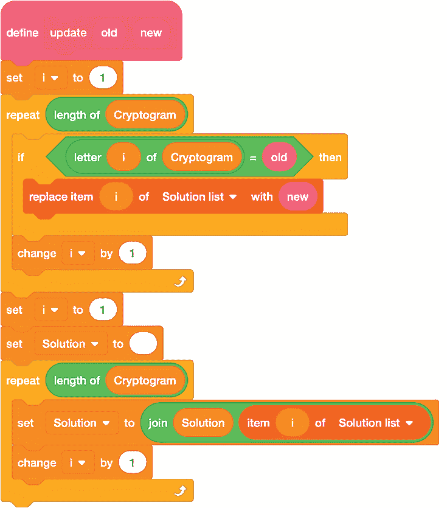

*图 A-44：更新解答*

#### 挑战 6.12

图 A-45 展示了一种快速判断字符是否为字母的方法。布尔变量`letterQ`对于大写或小写字母设置为`true`，否则为`false`。（`contains`块不关心大小写。）

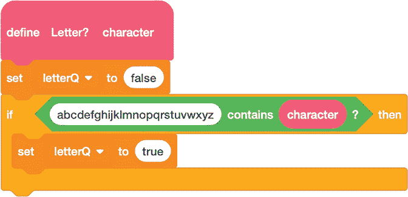

*图 A-45：字母测试*

一旦你有了这个块，你就可以用它逐个测试字符串中的每个字符。只保留那些使`letterQ`值为`true`的字符。

### 第七章：计数实验

#### 挑战 7.1

图 A-46 中的程序使用替代递推列出了卡塔兰数。

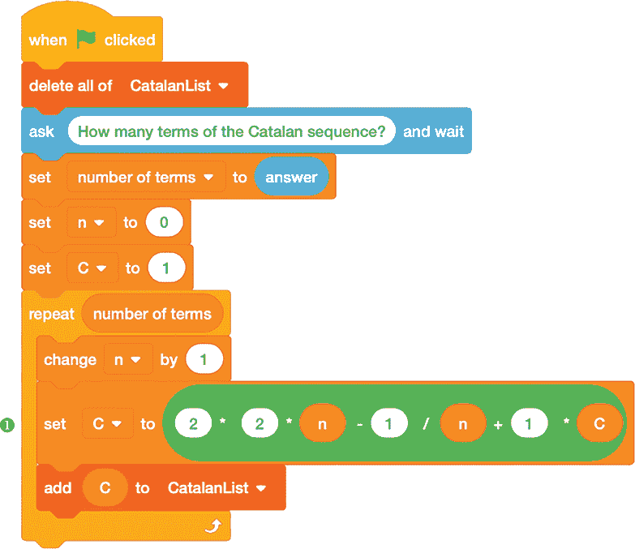

*图 A-46：另一个卡塔兰递推*

计算在`repeat`循环❶内实现。请注意，公式是一个单项递推，这意味着我们只需要*C*（*n* – 1）来计算*C*。这意味着我们可以不断使用`C`变量，而不必查找列表中之前的值。此外，项*C*(0)根本不需要包含在列表中，因此从一开始列表的索引号就是正确的。这个递推能够产生直到 flintmax 的准确值。

#### 挑战 7.2

该程序的输入将是由项目 28（图 7-1 至 7-3）生成的`Catalan`列表中的一行，由正斜杠（`/`）和反斜杠（`\`）字符组成。假设你已将其中一行提取到`input pattern`变量中。然后，你可以使用图 A-47 中的代码绘制该模式。

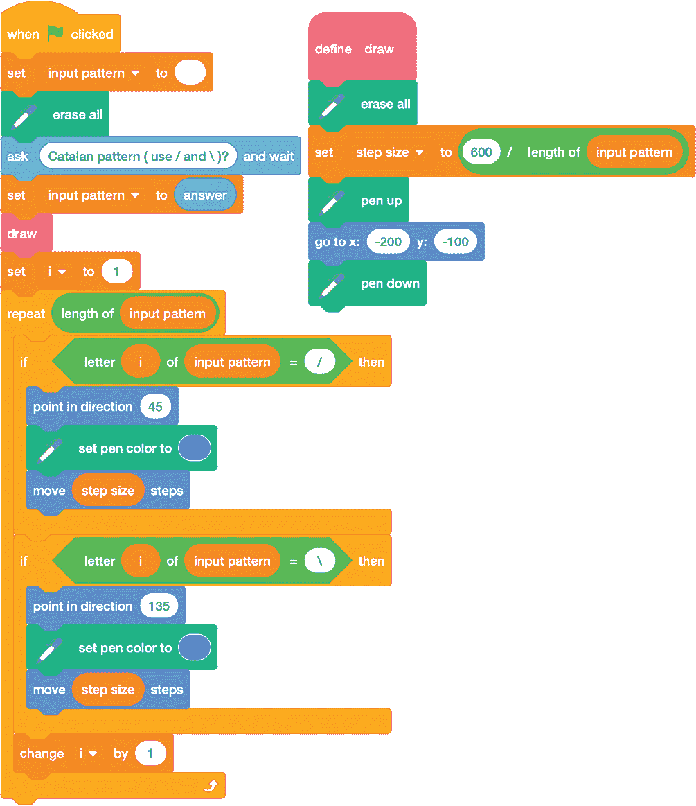

*图 A-47：可视化卡塔兰路径*

自定义的 `draw` 块设置了 `步长`，使得绘图能够合适地适应舞台。然后，主栈中的 `repeat` 循环使用字符作为绘制图形的食谱，忽略 `输入模式` 中除了斜杠之外的所有字符。它会为每个正斜杠绘制一条向上的对角线，为每个反斜杠绘制一条向下的对角线。

#### 挑战 7.3

需要注意的模式是，第 *n* 个卡塔兰数是 *C*(2*n*, *n*) / (*n* + 1)。

#### 挑战 7.4

你需要做的就是将每个 `/` 替换为左括号，每个 `\` 替换为右括号。为了将括号标注为字母（将标签放在左括号后、右括号前），使其看起来像一个乘法问题，最简单的做法是通过 `Catalan` 列表中的每个字符串进行两遍处理。第一次遍历将每个斜杠替换为适当的括号，并为字母添加一个占位符符号（图 A-48 中的代码使用了 `+` 符号）。第二次遍历可以将每个占位符替换为字母表中下一个未使用的字母。

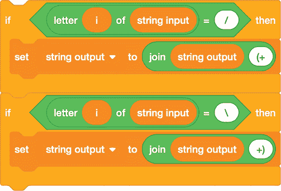

*图 A-48：用括号表示卡塔兰数*

图 A-49 显示了给定输入字符串的输出结果。

*图 A-49：* 漂亮的输出 *变量将字母替换为加号。*

#### 挑战 7.5 和 7.6

假设一个划分是由加号连接的加数组成的字符串，就像我们在图 7-15 中看到的列表那样。我们还假设加数是按递增顺序排列的。由于你需要查看每个加数，第一步可以是将字符串转换为一个由单个加数组成的列表，称为 `parts`。然后，你可以定义自定义块来报告布尔值，如果列表中没有偶数元素（比如，`oddpartsQ`），并且如果列表中没有重复的元素（比如，`distinctpartsQ`）。输出可能如下所示：图 A-50。

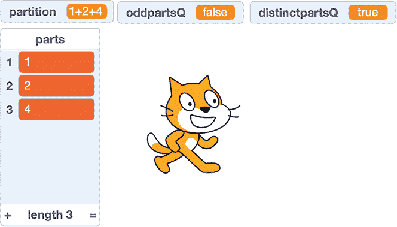

*图 A-50：测试所有奇数和所有不同的加数*

数学家莱昂哈德·欧拉（Leonhard Euler）提出了一个有趣的观察，欧拉是欧拉项目的名字来源，他发现：所有奇数加数的 *n* 的划分数量与所有不同加数的 *n* 的划分数量相同。

#### 挑战 7.7

拉马努金做出了另外两个与此相关的观察：任何一个比 7 的倍数多 5 的数的划分数量都能被 7 整除，任何一个比 11 的倍数多 6 的数的划分数量都能被 11 整除。例如，*P*(19) = *P*(2 ⋅ 7 + 5) = 490，是 7 的倍数，而 *P*(17) = *P*(1 ⋅ 11 + 6) = 297，是 11 的倍数。

### 第八章：三份圆周率

#### 挑战 8.1

内切三角形的周长等于 3，因此我们应将 *b*（下界）设为 3 / 2。外接三角形的周长等于 6，因此 *a* 应该是其一半，即 3。图 A-51 展示了这些新的起始值。

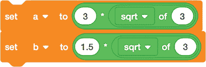

*图 A-51：内切和外接三角形的起始值*

如图 A-52 所示，使用这些起始值运行程序的结果， 从第二行开始，确实与使用六边形起始值运行程序的结果相同。

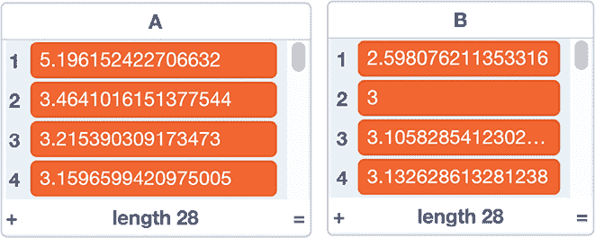

*图 A-52：从三角形开始的输出的前几行*

#### 挑战 8.2

你只需修改图 8-11 中的两个 `set` 块 ➋，即可选择随机的非整数坐标。更新后的块如图 A-53 所示。

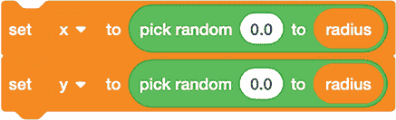

*图 A-53：随机选择非整数坐标*

这段代码不仅仍然可以处理非整数，还能提供更好的 *π* 近似值。

#### 挑战 8.3

图 A-54 展示了一个循环，用于计算系列的部分和，直到给定的项数。

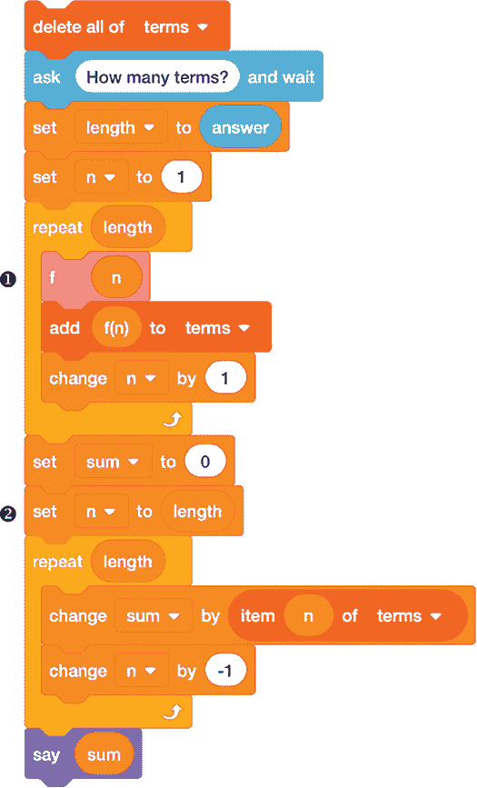

*图 A-54：计算 π²/6 的部分和*

这里有两个技巧需要注意。首先，我们使用一个自定义块来计算系列的 *n* 项 ❶。这使得代码容易调整以研究其他系列。在此情况下，该自定义块计算 1/*n*²，如图 A-55 所示。

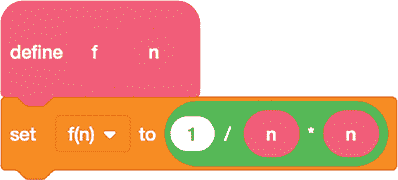

*图 A-55：计算求和的一个项*

第二个技巧是，一旦我们生成了 *n* 项的系列列表，我们可以通过从最后一项加到第一项来求它们的和 ➋。这是必要的，因为该系列由递减项组成，如果将较小项加到之前（较大项）的和中，某些后续项的小数部分可能会被抹去。

如果你运行这个程序，并逐渐增加项数，你会接近 *π*²/6 的值，大约是 1.644934。

#### 挑战 8.4

你可以重用挑战 8.3 中用于求和系列前 *n* 项的代码来解决这个问题。你只需为计算每一项定义一个不同的自定义块，如图 A-56 所示。

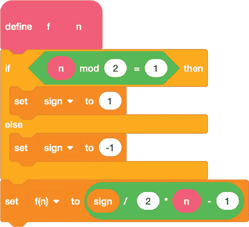

*图 A-56：计算 π/4 的求和项*

这一次，所添加的项是奇数整数，而不是平方数，并且符号在每一项之间交替变化。因此，你需要引入一个新变量 `sign`，使其在每一项之间在 `1` 和 `-1` 之间切换。

目标值大约是 0.785398，但交替级数通常收敛得很慢，所以可能需要一些时间才能到达该值。将此值乘以 4 就能得到*π*的近似值。

#### 挑战 8.5

挑战 8.3 中的级数在 202 项之后始终正确报告*π*的前三位数字。对于挑战 8.4 中的交替级数，必须经过 626 项，前三位数字才稳定。

#### 挑战 8.6

与项目 31 中的随机抽样代码不同，在这里你不能使用非整数坐标（参见挑战 8.2），因为计算 GCD 需要整数。不过，你仍然可以使用`pick random`模块来生成随机格点。代码图 A-57 中有一个使用随机选择的格点坐标的循环。

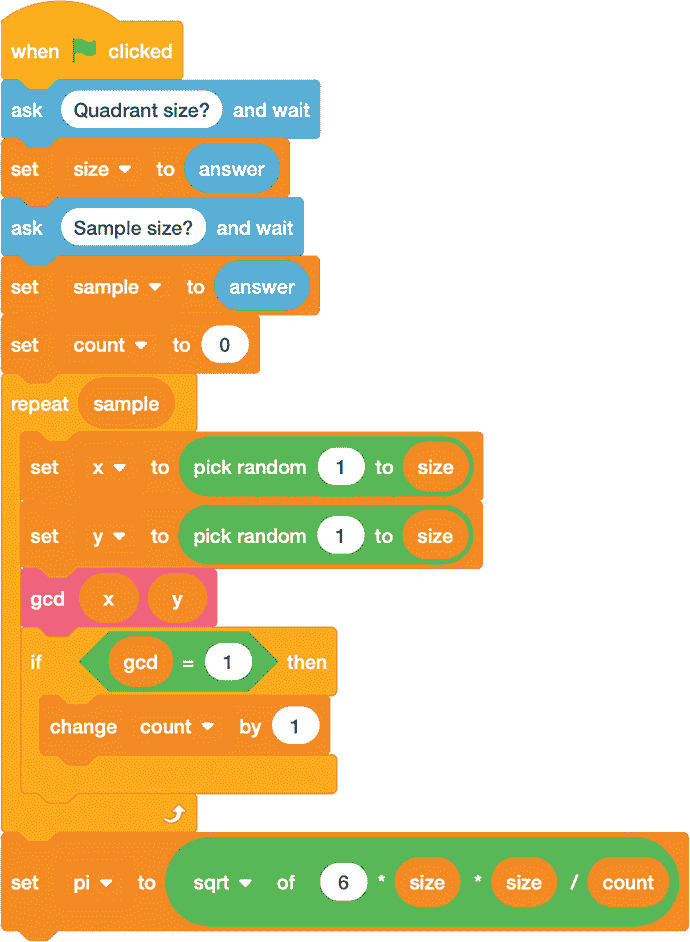

*图 A-57：随机采样格点*

它提供了*π*的近似值，精度与使用图 8-13 中的代码进行穷举枚举得到的值差不多。

### 第九章：接下来做什么？

#### 挑战 9.1

图 A-58 展示了一个程序，该程序查找任意两个数的倍数之和，直到达到指定的限制。

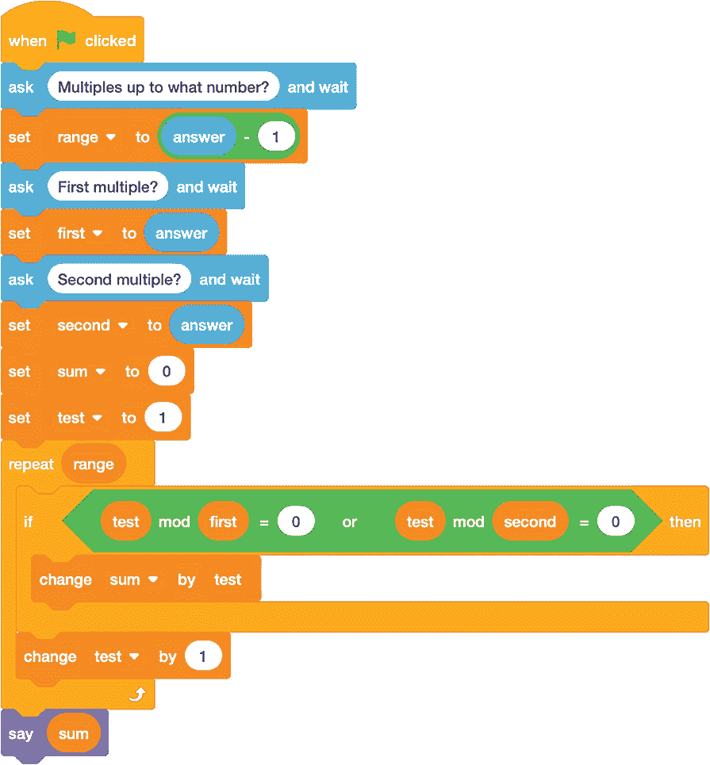

*图 A-58：找到任意两个倍数的和*

与我们在项目 33 中将`3`和`5`的值硬编码到程序中的做法不同，这里我们从用户那里获取两个值，并将其作为`first`和`second`变量进行引用。

#### 挑战 9.2

你可能认为只需要将两个数字相乘就可以得到修正值，但如果这两个数字不是相对质数，这种方法就不适用了。相反，你需要找到这两个数字的最小公倍数（LCM）（对于相对质数来说，最小公倍数恰好等于它们的积）。使用我们在项目 9 中提供的`gcd`代码来计算最小公倍数非常简单（见图 2-17），因为* b *和* a *的最小公倍数是* b *和* a *的积除以它们的最大公约数（GCD），正如我们在第三章中所指出的那样。

图 A-59 展示了一个更新后的程序，该程序使用三角数技巧和最小公倍数进行包含-排除法，求解任意两个数的倍数之和。

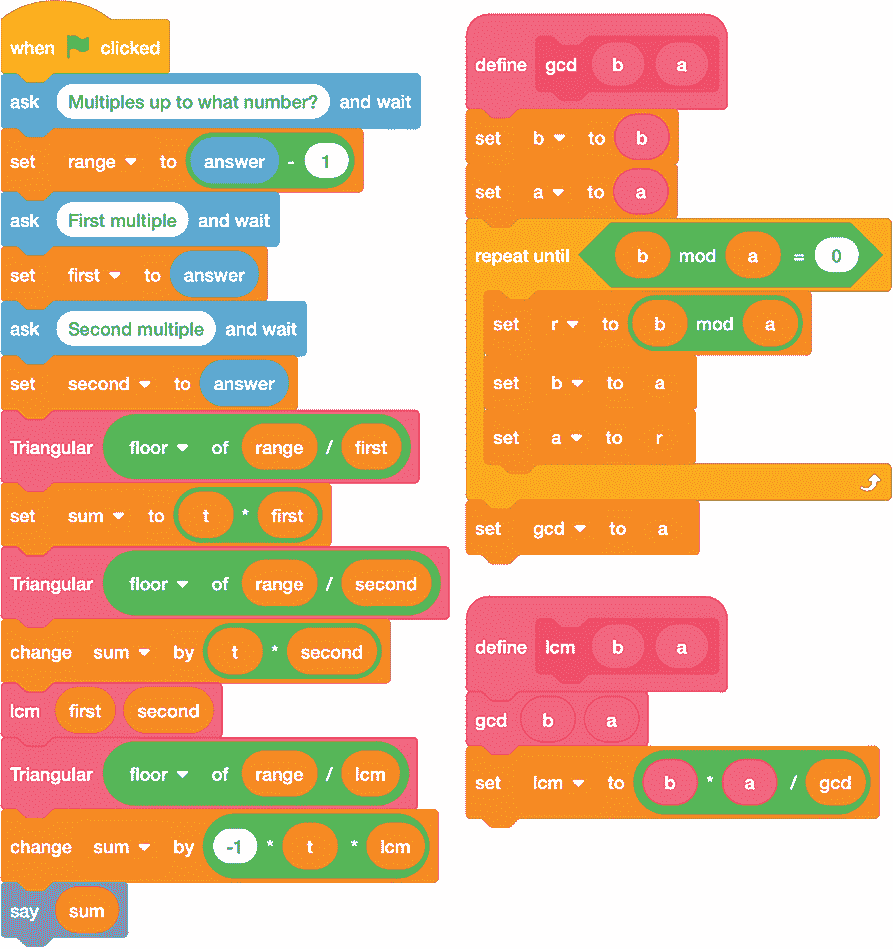

*图 A-59：求任意两个数倍数的和*

我们使用一个自定义的`lcm`模块，它首先调用我们可靠的`gcd`模块，然后基于结果计算最小公倍数。

#### 挑战 9.3

如果倍数是*a*、*b*和*c*，首先分别加上*a*、*b*和*c*的倍数，然后减去*a* ⋅ *b*、*a* ⋅ *c*和*b* ⋅ *c*的倍数。最后，再加上*a* ⋅ *b* ⋅ *c*的倍数。
