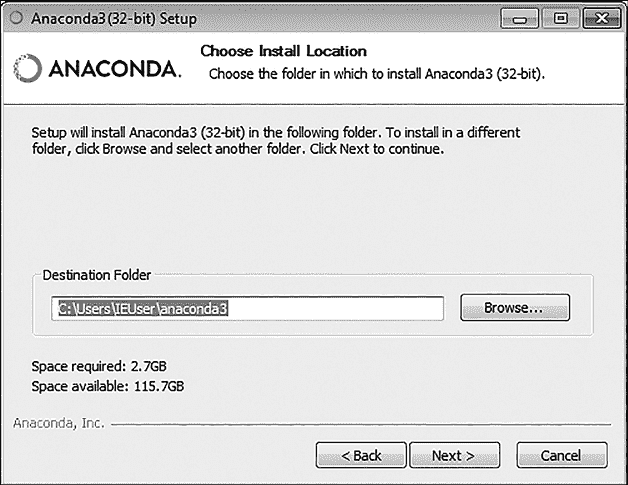
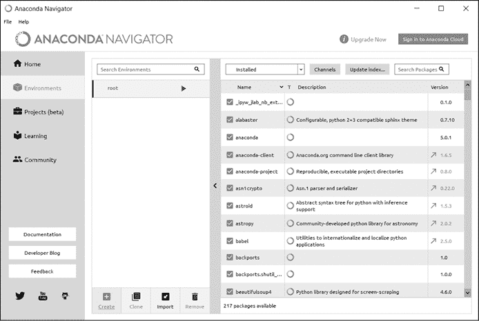
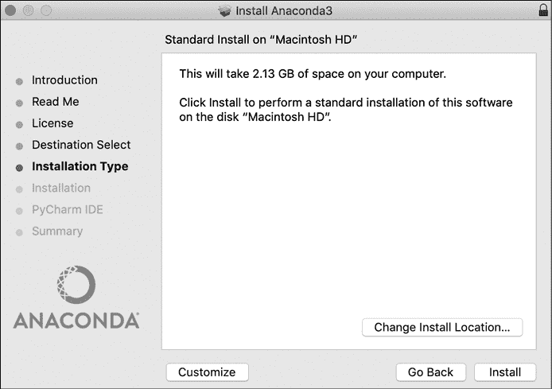

# 第三章：设置环境


让我们从设置编程环境开始，后续我们将在本书中一直使用这个环境。Python 足够灵活，可以在多种平台上运行，因此我无法涵盖所有可能的安装和配置选项。话虽如此，由于我们将分析的一些问题可能在计算上比较昂贵，我假设你是在笔记本或台式电脑上进行实验，而不是在平板或手机上。一颗多核 CPU 将帮助加速一些处理过程。虽然这不是必须的（而且我也不会使用它们），一些库也可以利用现代 GPU，因此我鼓励你尝试使用它们。最后，一些操作可能会消耗大量内存。我建议至少有 4GB 的 RAM 可用，但最好是 8GB 或更多。对于每个环境，你必须平衡实现成本与生成解决方案所需的时间。在第十三章，我们将讨论如何将问题分布到多个小平台上进行处理。

我将介绍两种设置：一种是简单设置，另一种是高级设置。如果你是 Python 编程新手，我建议你从简单设置开始，它使用 Anaconda 进行包和环境管理，并安装一个名为 Spyder 的集成开发环境（IDE）。Spyder IDE 专门针对数学和科学应用进行了优化，是即将到来的项目的绝佳选择。

如果你熟悉环境和包管理的细节，并且已经配置了 Python 环境，那么高级设置将介绍如何使用虚拟环境将你的实验工作区与其他生产工具隔离，以及如何手动安装所需的包。

## 使用 Anaconda 进行简单环境配置

我们将从安装 Anaconda 开始，Anaconda 是一个平台，旨在轻松管理多个 Python 环境，即使是没有系统管理背景的人也能使用。Anaconda 将使安装我们所需的包变得简单，随着时间的推移进行更新，并确保环境依赖关系保持一致。Anaconda 专门为数据科学和机器学习工作流设计。Linux、Windows 和 macOS 都有可用的安装程序。请前往 Anaconda 的分发页面（[`www.anaconda.com/distribution`](https://www.anaconda.com/distribution)），并下载适用于你平台的最新安装程序版本。

现在让我们一起看看 Linux、Windows 和 macOS 的安装说明。

### Linux

从 Anaconda 链接下载的文件实际上是一个帮助下载和配置必要包的 shell 脚本。你*不*应该以管理员身份运行此脚本（例如在 Debian 上使用 `su`）。首先，在安装脚本所在的目录中打开终端。你可以使用以下命令来执行安装程序：

```
$ **chmod +x** `Anaconda3-202X.0X-Linux-x86_64.sh`**;**
$ `./Anaconda3-202X.0X-Linux-x86_64.sh`**;**
```

要开始安装，你需要使用 `chmod +x` 标记此脚本为可执行文件。确保更改脚本的名称，使其与下载的版本匹配。然后，你可以使用默认的 shell 解释器运行安装程序。在设置过程中，你需要确认一些安装选项。在大多数情况下，默认选项已经足够好。如果你计划更改任何默认设置，请花时间阅读文档——某些选项可能会带来意想不到的后果。安装完成后，你可以使用新安装的 conda 工具验证一切是否正常。打开一个新的终端并执行以下命令：

```
$ **conda info** 
```

你应该会看到类似以下的输出：

```
 active environment : base
    active env location : /home/dreilly/anaconda3
            shell level : 1
       user config file : /home/dreilly/.condarc
 populated config files : 
          conda version : 23.`X`
    conda-build version : not installed
         python version : 3.`X`
       virtual packages : __glibc=2.23
       base environment : /home/dreilly/anaconda3  (writable)
           channel URLs : https://repo.anaconda.com/pkgs/main/linux-64
                          https://repo.anaconda.com/pkgs/main/noarch
          package cache : /home/dreilly/anaconda3/pkgs
                          /home/dreilly/.conda/pkgs
       envs directories : /home/dreilly/anaconda3/envs
                          /home/dreilly/.conda/envs
               platform : linux-64
             user-agent : `<platform-user-agent-string>`
                UID:GID : 1000:1000
             netrc file : None
           offline mode : False
```

这里有一些有用的信息。首先是 `user config file`，即用户配置文件的位置。编辑这个文件可以让你个性化 Anaconda；如果你计划在 Anaconda 中做大量工作，值得了解一下。接下来是 `conda version` 和 `python version` 两项。将 `conda version` 与最新的 Anaconda 版本进行比较，确保你拥有最新的工具。`python version` 是 Anaconda 在创建环境时会使用的默认 Python 解释器。你可以为每个环境设置特定的 Python 版本，但确保默认设置为你首选的版本，可以节省一些时间，尤其是当你忘记在创建环境时指定版本时。

`channel URLs` 字段告诉你当 conda 尝试安装新包时，远程位置的检查点。修改这个列表时要小心。如果添加了不可信的源仓库，攻击者可能会用恶意版本替换一个合法的包，比如 pandas，这会带来安全风险。定期检查这个字段，以确保它不包含任何未识别的渠道，也是一个好主意。`package cache` 字段显示 Anaconda 会把已安装库的包信息存储在哪里。由于多个环境可能会请求相同版本的包，Anaconda 会构建一个已知包的缓存，以加快未来的安装速度，并减少类似环境的创建时间。最后要注意的是 `envs directories` 字段，它告诉你 Anaconda 会在系统的哪个位置存储与定义每个环境相关的文件，包括安装的包版本的副本。如果你需要排查特定环境中的包冲突，知道这些信息的位置会很有用（尽管 conda 也有帮助处理的工具）。

此时，你的基础环境已经设置完成，可以开始配置你的研究环境了。你可以跳到本章后面 “设置虚拟环境” 部分。

### Windows

当你为 Windows 机器运行 Anaconda 安装脚本时，你将看到一个典型的 Windows 风格的安装提示，类似于 图 1-1。



图 1-1：Windows 上的 Anaconda 安装程序

选择你希望基本应用程序所在的目录。如果你的系统有一个大容量的二级硬盘和一个较小的主固态硬盘（SSD），确保将 Anaconda 安装在更大的硬盘上。随着多个环境和解释器以及软件包版本的增加，它可能会随着时间的推移变得相当庞大。

安装程序的其余部分会引导你配置 Anaconda。对于大多数情况，默认设置通常是可以的。如果你计划更改任何默认设置，请花时间阅读文档——某些选项可能会带来意想不到的后果。你可能需要授权安装程序进行更改（通过用户帐户控制弹出窗口）。在某些情况下，当图形界面尝试启动时，你可能会收到错误信息。你通常可以通过明确告诉 conda 去哪里找到正确的可执行文件来修复这个问题。打开运行提示框（在大多数键盘上，你可以使用快捷键 win-R），输入 `cmd.exe`，然后按回车。进入你安装 Anaconda 的目录下的 *scripts* 子目录。例如，如果你使用了图 1-1 中的安装目录，那么 *scripts* 目录的路径将是 *C:\Users\IEUser\anaconda3\scripts*。然后像这样进入该文件夹：

```
$ **cd** `C:\Users\IEUser\anaconda3\scripts`
```

然后运行以下命令：

```
$ **activate root**
$ **conda update -n root conda**
```

第一个命令告诉 Anaconda 激活根环境，该环境是在安装过程中创建的，包含默认的 Python 版本和一些基本的软件包。第二个命令告诉 Anaconda 更新根环境中的 conda 应用程序版本。你将被要求按 Y 来确认更新，之后 Anaconda 会安装最新版本的 conda。最后，你可以使用更新后的 conda 版本来更新根环境中的所有软件包，如下所示：

```
$ **conda update --all**
```

再次，你将被要求通过按 Y 来确认更新。在设置和更新完成后，你可以访问类似于图 1-2 中的 Anaconda Navigator 界面。



图 1-2：Anaconda Navigator 界面

Navigator 界面可用于软件包管理、虚拟环境管理等。它是管理你的 Anaconda 安装的指挥中心。尽管 Windows 安装确实可以访问 conda 工具（毕竟图形界面背后依赖的就是它），但大多数用户无需直接使用它，因为所有最有用的工具都已被封装在一个友好的界面中。Windows 安装的一个优点是创建虚拟环境的简便性。只需点击 **Environments** 标签，然后点击 **Create**。为你的新环境输入一个名称，并选择适当的解释器。就这样！现在你可以跳到“设置虚拟环境”部分。

### macOS

当你运行从 Anaconda 链接下载的 *.pkg* 文件时，你应该会看到类似于图 1-3 的界面。



图 1-3：Anaconda 安装界面

安装程序的其余部分将引导你完成 Anaconda 的配置。默认设置通常适用于大多数情况。如果你计划更改任何默认设置，请花时间阅读文档——有些选项可能会带来意想不到的后果。

请注意，推荐的 IDE（Spyder，稍后介绍）在 macOS 上并不原生支持。不过，你可以通过 port 包管理器安装。如果你使用的是 macOS 系统，可以选择跳过本章描述的 Spyder 设置，选择一个专为你的系统设计的 Python IDE。查看或运行代码示例并不需要 Spyder 的高级功能，因此任何现代 IDE 都足够用了。

## 设置虚拟环境

任何在 Python 中工作足够长时间的人都见识过在一个空间内处理多个项目时不可避免的混乱。不同的包会要求相同依赖项的不同版本。一个项目需要与另一个项目不同的解释器。这可能会变得非常混乱，而且通常直到为时已晚，你才会意识到自己做出了糟糕的选择，而你需要花上整个周末来解决这个问题。

为了避免所有的头痛和浪费时间，你可以将你的项目分解到独立的虚拟环境中。你可以将虚拟环境看作是一个独立的 Python 世界。一个虚拟环境中的包对其他虚拟环境中的包完全不知情。解释器会自动切换到适合该环境的版本。生活重新变得和谐。在你偏好的终端中，输入以下命令，让 conda 为你的项目创建一个新的环境。

```
$ **conda create -n** `env_name`**python=3.**`X` **anaconda**
```

这里的 `env_name` 是你想为环境命名的名称；根据需要修改它。你可以使用 `python=``version` 语法指定 Python 版本。示例中会将 Python 3.*X* 解释器配置为新环境的默认解释器。按 Y 继续。Anaconda 会将 Python 解释器和所有相关库复制到 *environments* 子目录中。该目录的确切路径将取决于你的操作系统和 Anaconda 的安装位置。在我的系统中，路径为 */home/dreilly/anaconda3/envs/researchenv/*。

现在花点时间定位这个目录，并记下文件夹的完整路径。稍后你将需要这个路径来正确配置 IDE。要激活你新的虚拟环境并开始在其中工作，在终端中输入以下命令：

```
$ **conda activate** `env_name`
```

当你激活 Anaconda 虚拟环境时，管理应用程序会修改操作系统的底层环境变量，以适应项目之间的隔离。`PATH`、`PYTHONPATH` 和其他变量会被更新，指向你创建的特定隔离 Python 设置。你的终端提示符应该会改变，告诉你当前正在使用哪个虚拟环境。你也可以通过检查 `conda info` 命令来验证设置。

```
$ **conda info -e**
```

结果应该是列出你当前定义的所有虚拟环境，并在当前活动的环境旁边标注一个星号。

## 通过 Anaconda 安装 IDE

Spyder ([`www.spyder-ide.org`](https://www.spyder-ide.org)) 是一个用 Python 编写的科学和数学编程环境，专为 Python 设计。它由一群专注的程序员、科学家、工程师和数据分析师设计，旨在满足他们工作的需求。Spyder IDE 最棒的一点是，它可以通过 Anaconda 安装。你可以通过终端运行以下命令来安装：

```
$ **conda install -c anaconda spyder**
```

安装完成后，你可以通过命令 `spyder` 从控制台启动 IDE。

现在你已经设置好了虚拟环境和编码环境，你几乎准备好了！你可以给自己加两分，然后跳到本章的 “Jupyter Notebooks” 部分。

## 高级设置

使用以下设置，你可以通过虚拟环境将实验工作与生产工作空间隔离。它假设你已经正确安装了 Python 3，并且熟悉使用 pip 工具安装包。为了方便，你可以在本书的 GitHub 仓库中找到一个 *setup.py* 脚本。

### 设置 virtualenv

virtualenv 是一个 Python 包管理器，用于隔离不同项目的依赖。使用 virtualenv 可以避免全局安装 Python 包，这样可能会破坏系统工具或导致其他项目中依赖库的不一致。你将通过 pip 工具安装 virtualenv。请输入以下命令：

```
$ **python -m pip install --user virtualenv**
```

根据你的安装方式，在 Windows 机器上，你可能需要将命令更改为以下内容：

```
$ **py -m pip install --user virtualenv**
```

安装完 virtualenv 模块后，你可以创建虚拟环境。这个过程的细节这些年有所变化，但核心思想保持不变。从 Python 3.9 开始，这种方法是创建虚拟环境的首选方法：

```
$ **python -m venv** `path_to_new_environment`
```

### 不通过 Anaconda 安装 IDE

你可以根据操作平台以多种方式安装 Spyder IDE。Debian Linux 用户可能更倾向于通过 apt-get 安装，而不是通过 Anaconda 安装。Spyder 的官方 Debian 包可以在 Debian 包仓库中找到：

```
$ **sudo apt-get install spyder3**
```

这将把 spyder3 应用安装到 */usr/bin/anaconda3*。你可以通过以下命令验证该位置：

```
$ **which spyder3**
```

虽然可以通过 pip 安装 Spyder，但不推荐这样做（安装过程可能比较复杂）。有关更多信息，请参考 Spyder 安装指南 ([`docs.spyder-ide.org/installation.html`](https://docs.spyder-ide.org/installation.html))。

如果你使用的是 Windows，可以通过 Anaconda Navigator 获取 Spyder IDE，并附带一套其他实用的库。在“首页”标签下，你会看到一些与 Anaconda 集成的应用程序示例。点击**安装**按钮来开始安装过程。安装完成后，“安装”按钮会被“启动”按钮替代，点击后即可启动 IDE。

WinPython ([`winpython.github.io`](https://winpython.github.io)) 是另一个科学 Python 发行版，类似于 Anaconda，它包含了最常用的科学软件包和工具库。不过有一个显著的区别是，它缺少像 Anaconda 的 conda 工具那样的包管理工具。正是因为缺少这种对初学者友好的工具，最终让我决定在本书中使用 Anaconda。如果你已经在使用 WinPython，你仍然可以跟随本书中的项目，但如果你是从头开始搭建新环境，我强烈建议你选择 Anaconda。

## Jupyter Notebooks

恭喜——此时你的开发环境已经完成！不过，还有一个你可以选择安装的工具，它将帮助你更好地使用本书，那就是 Jupyter notebook 服务器。本书中的多个项目配有交互式的 Jupyter notebooks，包含有关数学公式的更多细节、关于图形创建的讨论以及一些可以加速你自己应用开发的模板代码。如果你按照 Debian Linux 上的 Anaconda 安装方式进行操作，那么好消息是：你已经安装了 Jupyter notebook 服务器。如果你是在 Windows 上安装的 Anaconda，可以通过 Anaconda Navigator 获取该应用程序。进入**首页**标签，点击 Jupyter Notebook 应用下的**安装**按钮。当“安装”按钮变为“启动”按钮时，你就准备好了。

你也可以通过以下 pip 命令手动在虚拟环境中安装 Jupyter：

```
$ **pip install --upgrade pip**
$ **pip install jupyter**
```

然后，你可以使用以下命令从终端启动一个 notebook 服务器：

```
$ **jupyter notebook**
```

或者在 Windows 上，你也可以像之前提到的那样，直接通过 Anaconda Navigator GUI 启动 notebook 服务器。无论哪种方式，Jupyter 都会打开一个 web 浏览器，显示你运行命令所在目录的内容。你可以使用网页界面创建新的 notebooks 或打开现有的 notebooks。

如果你对交互式笔记本的概念不太了解，我鼓励你抓住这个机会，了解它们的全部内容。Jupyter 是一个 Web 应用程序，允许你创建和共享包含实时代码、可视化效果以及 HTML 或更紧凑的 Markdown 语法格式化文本的文档。通过结合 Markdown、代码和输出，我们可以在一个地方自动生成漂亮的报告、信息丰富的分析以及工作中的概念验证。代码片段可以独立运行，但数据在不同代码块（称为*单元格*）之间持续存在。

在编写和测试项目中单独函数时，我经常使用笔记本，因为我可以一次配置变量，然后反复测试该函数，而不需要重新运行其他任何代码。正如你将看到的，我在编写这些章节时也广泛使用了它们，以生成大多数图表和代码块。能够独立运行某些代码片段在我调整和渲染图形时非常方便。

## 总结

规划和构建一个稳固的 Python 环境可能不是世界上最令人兴奋的阅读话题，但确保所有工具都到位并准备好工作，将使得进入书中的其余部分变得更加简单。无论你选择了使用 Anaconda 的简单路径，还是选择了使用 virtualenv 的更高级路径，你现在应该已经有了一个独立的区域，可以跟随接下来的项目中的代码。下一章，我们将通过整理整个书中使用的编程和数学语法来完成最后的整理。如果你已经非常熟悉 Python，并且能区分你的 sigmas 和 deltas，可以直接跳到第三章。
