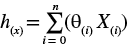
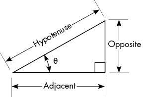
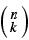
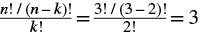
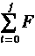
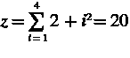
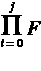
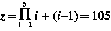

# 编程与数学约定


现在你已经有了一个工作环境，我们来讨论一下我们将使用的编程语言。本书假设你对编程概念如循环、变量、条件语句和函数有基本的了解，因此本章并不打算作为 Python 的全面介绍。相反，它旨在说明一些更细微的要点，这些要点将帮助你理解本书中的示例以及其他教程中的示例。当然，本书的编程内容主要集中在实现研究论文中的数学概念，因此我们对这类材料中使用的符号有一个共同的理解同样非常重要。

## 语法构造

虽然本书并不打算作为 Python 编程的入门教材，但在深入之前，你应该熟悉一些有用的语法构造。平衡使用这些高级特性非常重要，以保持代码的可读性和易理解性。在本书的项目中，我使用了本节中描述的构造，以简化代码。如果你还在学习 Python，刚开始可能会觉得某些语法有些令人生畏，但一旦你在自己的代码中使用这些构造几次后，你会惊讶于没有它们你是如何完成工作的！

### 列表推导

当你需要通过遍历一些代码来创建一个值的列表（或字典）时，理解构造非常有用。最简单的使用场景是对列表中的每个元素应用一个函数。例如，假设你有一个字符串列表，叫做`names`，你想将它转换为大写。你可以使用类似下面的循环：

```
names = ["bob","mike","tom","mary"]
names_2 = []
for n in names:
    names_2.append(n.upper())
```

但是，这种方法也有一些缺点。首先，它需要两个列表：一个用于输入（`names`），一个用于输出（`names_2`）。当你有非常大的复杂对象列表时，像这样为了简单的改变而复制整个列表到内存是低效的。你可以添加更多的代码，用`names_2`的内容覆盖`names`，然后显式地释放`names_2`所占用的内存，但那样做既麻烦又让代码显得混乱。这引出了第二个问题：代码占用了比必要更多的行。在复杂的应用中，你可能需要维护数百个函数。保持代码简洁能在编写和修改大型代码库时节省时间。你可以将整个过程浓缩成一行代码，像这样：

```
names = [n.upper() for n in names]
```

在列表推导式中，第一个变量定义了结果列表中将存储的内容。在这种情况下，`n` 是我们要转换为大写的字符串，因此是 `n.upper`。我们通过右边的 `for` 语句定义 `n` 的值，该语句会遍历 `names` 列表并选择每个 `n`。然后，结果列表会直接赋值给 `names` 变量，覆盖其先前的值，并自动释放循环所使用的内存。我们可以在语句末尾添加一些条件逻辑来过滤结果。例如，假设我们想根据每个字符串的首字母是否是 `m` 来过滤 `names` 列表。你可以像下面这样写一个循环块：

```
m_names_upper = []
names = ["bob","mike","tom","mary"]
for n in names:
    if n.startswith("m"):
        m_names_upper.append(n.upper())
```

现在，在 `for` 循环的每次迭代中，我们有一个条件语句来检查字符串是否以 `m` 开头，如果是，它会将大写版本追加到 `m_names_upper` 列表中。然而，这种方法和之前的循环示例有相同的缺点，而且占用了更多的空间！这段代码也可以通过列表推导式缩短为一行：

```
m_names_upper = [n.upper() for n in names if n.startswith("m")]
```

我们在列表推导式语句的末尾添加了一些条件逻辑来过滤结果；同样，只有当 `n` 以 `m` 开头时，我们才会添加 `n.upper`。

这两个例子会产生相同的输出；哪个更简单或者更容易解释是可以争论的，所以你选择的方式通常是个人偏好的问题。请注意，你可以在列表推导式中添加 `else` 条件来控制 `if` 返回 `False` 时发生的情况。在条件逻辑为 `False` 的情况下——例如，当一个函数期望两个列表具有相同的长度，以便对其中的值进行配对操作——你可能希望向输出列表添加一个静态值，而不是完全排除该元素。假设我们想要将所有名字不以 `m` 开头的人重命名为 `marcus`。使用传统的循环结构，这需要在 `if` 块之后添加一个 `else` 块来处理插入值。我会跳过这一部分，因为我们都见过 Python 中的 `else` 块（希望如此），而我们现在讨论的是列表推导式。向列表推导式添加额外的 `else` 子句会改变语法，使得 `if...else` 逻辑出现在 `for` 循环逻辑之前，像这样：

```
m_names = [n if n.startswith("m") else "marcus" for n in names]
```

如你所见，`if` 语句紧跟在要存储的变量 `n` 后面。然后，你添加 `else` 条件，它定义了在 `if` 语句为 `False` 时将添加到输出列表 `m_names` 中的值。在这个例子中，如果一个名字以 `m` 开头，它将被添加到输出列表中；否则，字符串字面量 `marcus` 将会被添加。

列表推导式有许多更实际的用途，你将在本书和其他示例的代码中看到它们的身影，因此最好熟悉它们以及它们如何转化为更传统的循环代码结构。同样，理解列表推导式的局限性也很重要。如果你的条件选择逻辑比较复杂，你可能需要考虑将其抽象为一个单独的函数。然后，你可以在列表推导式中使用该函数，并将其应用于每个元素（这种方法你也会在本书中看到）。列表推导式本身的唯一真正限制是，你只能应用一个条件语句，并且每次迭代结束时的输出必须是可以包含在 Python 列表对象中的内容。

### 字典推导式

字典是 Python 中最常见的数据结构之一。它们用于从简单的键/值配对到处理复杂的用户定义类等各种场景。幸运的是，字典也非常容易使用，我们刚才讨论的关于列表推导式的很多概念同样适用于定义字典对象，尽管你在实际应用中可能会遇到的例子较少。作为说明，考虑以下代码，它将一个键的列表与一个值的列表合并：

```
keys = ['Red','Blue','Green','Yellow']
values = [1,2,3,4]
out = {}
for i in range(len(keys)):
    out[keys[i]] = values[i]
```

再次强调，字典推导式的强大功能使我们能够将这段代码缩短为一行：

```
out = {keys[i]: values[i] for i in range(len(keys))}
```

你可能会注意到，列表推导式和字典推导式的语法之间只有少数几个差异。Python 的开发者这样做是为了使它们之间的关系更容易理解。如果你理解了列表推导式，那么你就理解了 90% 的字典推导式。需要记住的两点是：字典是使用大括号 `{}` 来定义的，而不是方括号，并且 `for` 关键字前的左侧部分表示一个键和值，用冒号分隔。在这里，我们将键定义为名为 `keys` 的列表中的第 *i* 个值。我们通过使用相同的索引 *i* 从第二个列表 `values` 中为该键分配值。然后我们定义一个 `for` 语句，使用 `range` 函数循环遍历从 0 到 `keys` 列表长度之间的整数值。这是一个假设 `keys` 和 `values` 列表长度相同的函数示例。如果 `keys` 的长度大于 `values`，当尝试访问 `values` 中一个不存在的索引时，代码会引发错误。

你也可以使用一个函数来定义键变量和值变量，像这样：

```
out = {keys[i].upper(): float(values[i]) for i in range(len(keys))}
```

在这个示例中，我们修改了之前的代码，使所有的键都被转换为大写字母，所有的值都被转换为`float`。当然，我们可以将这些函数替换为任何符合我们需求的函数。只要每个函数的返回结果能够作为常规 Python 字典中的键或值，就可以使用该函数。与列表推导式一样，这里的条件逻辑也有一个注意事项。如果需要更复杂的逻辑，应该考虑将键和值的定义提取到一个独立的函数中，像这样：

```
out = {k: v for k,v in my_logic(keys)}
```

这里的键和值是通过函数调用`my_logic(keys)`的返回值来定义的。这个函数的具体作用并不重要；重要的是，函数返回的是一个包含元组（或嵌套列表）的列表，每个元组包含两个元素。每个元组中的第一个元素将被视为键`k`，第二个元素则是对应的值。这就是字典推导式的小秘密：它们其实只是伪装成字典的列表推导式！你可能已经意识到这一点，因为`range`函数也会生成一个列表。当你希望对列表中的每个项执行某个函数，并将结果作为字典保存，关联每个项及其函数调用结果时，这是一个非常方便的快捷方式。

### 打包与解包

Python 内建的`zip`函数返回一个元组迭代器，其中第*i*个元组包含从每个传入参数中提取的第*i*个元素。假设你想将之前存储在`names`中的姓名列表与分别存储在`keys`和`values`中的颜色和数字列表结合起来。`zip`函数将允许你高效地生成这些组合，以元组列表的形式，并且只需一行代码：

```
a = zip(names, keys, values)
print(list(a))
```

变量`a`现在持有一个`zip`对象，当它被转换为列表时，将包含像`("bob","Red",1)`这样的三元组。需要注意的是，传入列表的顺序很重要，因为从左到右的处理顺序是保证的。还需要留意，迭代器会在最短的输入耗尽时停止。解包是`zip`函数的逆操作，但它是 Python 的一种行为，而不是一个需要调用的函数。例如，你可以像下面这样解包`zip`对象`a`中第一个元组的三个值：

```
person, key, value = list(a)[0]
```

这一行代码将`a`中第一个元组的三个值分配给等号左侧的三个变量（从左到右的顺序）。你必须确保变量的数量与元组中的元素数量一致，否则代码将抛出异常。打包和解包在你需要在应用程序中传输数据时非常有用。与其定义多个变量来保存三个输出列表，我们可以应用`zip`函数来返回一个单一的`zip`对象，这样可以保留三个列表之间的关系。然后，你可以遍历结果，并根据需要将值解包到不同的变量中。

你看到的其余代码将是标准的 Python 代码。当我们在项目中使用特定库时，我会指出相关的语法。

接下来，我们将深入探讨数学符号的精彩世界。正如你将看到的，理解所使用的符号在高级数学中扮演着至关重要的角色。它提供了一种灵活的速记形式，使得公式更容易记住。不幸的是，与编程类似，这些符号可以具有多重含义。数学符号通常具有双重性质，因为它们既可以表示正在进行的数学操作，也可以表示执行这些操作的变量。

## 数学符号

数学符号是一个棘手的领域，尤其是当你试图在文本中涵盖多个领域时。原因是许多数学符号是*重载*的，这意味着它们有许多可能的含义，要知道适用的是哪一种含义，就需要查看上下文。一个完美的例子是希腊字母θ。在机器学习文献中，θ通常指的是为一组数据计算出的特征权重集。这个“假设”函数常见于机器学习的前几周，通常会讲解线性回归模型。



然而，在几何学和三角学中，θ通常用作“角度”变量——例如，在图 2-1 所示的勾股定理中。



图 2-1：使用θ表示角度（度数）的勾股定理

在可能的情况下，我坚持使用该领域内主流材料中使用的符号。在符号出现重载的情况下，我会附上意图含义的解释。

### 布尔符号

在应用数学中，你会看到最常用（也是最常被忽视）的一项概念就是布尔代数。*布尔*是一种原始数据类型，在任何给定时刻，它只能承载两个可能的值之一。该值由与之相关的*逻辑语句*决定。例如，我们可以问两个数字，*x* 和 *y*，是否相等。这个问题的答案始终是“是”或“否”，取决于输入值。永远不会出现第三种答案。

布尔符号通常以*真值表*的形式表示。为了节省空间，我没有在本书中包含完整的真值表；你可以在网上找到许多关于这些表的优秀参考资料。我们将重点讨论用于编写逻辑语句的符号以及如何解释它们。表 2-1 涵盖了每个主要的布尔代数符号及其直观意义，并提供了将逻辑应用于语句的示例。

表 2-1：布尔逻辑示例

| **符号** | **含义** | **示例** |
| --- | --- | --- |
| 与：A ∧ B | 只有当 *A* 和 *B* 都为 `True` 时，整个语句才为 `True`。在代数中，*A* × *B* 或者仅为 *AB*。 | *猫是哺乳动物* 与 *飞机会飞* 为 `True`，因为两个语句都是 `True`。如果任何一个语句为 `False`，整个语句就会是 `False`（等于 `0`）。 |
| 或：A ∨ B | 只要 *A* 或 *B* 或者 *A* 和 *B* 中的任何一个为 `True`，整个语句就是 `True`。在代数中，*A* + *B*。 | *猫是狗* 或 *鸟是猫* 为 `False`，因为 *A* 和 *B* 都不是 `True`。如果其中任何一个语句改为 `True`，结果就会改变。 |
| 非：¬ A, À | 当语句 *A* 为 `False` 时，该语句为 `True`。它是一个反转器，输出其输入的相反值。 | 如果 *A* 代表语句 *猫是鱼*，这可以写作 *非猫是鱼*。*非猫是鱼* 为 `True`，因为语句 *猫是鱼* 为 `False`。 |
| 异或：A ⊕ B | 如果 *A* 或 *B* 其中之一为 `True`，但 *A* 和 *B* 都不是 `True`，则该语句为 `True`。在代数中，( AB̀ ) + ( ÀB )。 | *衬衫是红色的* 异或 *衬衫是蓝色的* 为 `True`，如果衬衫是红色或蓝色，但不是同时是红色和蓝色。 |

这些看似简单的组件可以通过链式布尔语句来描述人类已知的最复杂的系统。了解布尔表达式中的操作顺序和括号的使用非常重要。运算符优先级与传统代数相同，但功能较少。括号内的运算优先进行，然后是所有的 AND 条件（乘法），最后是 OR 语句（加法）。否定操作在操作的最终步骤中处理，因此无需特别处理。传统上，我们从左到右评估多个括号。

大多数运行时环境，比如 Python 的解释器，会在一旦语句的真假能够确定时就停止评估。它们不会继续检查那些已不再影响结果的其他语句。例如，逻辑语句

( 猫会飞 ∧ 狗会吠 )

会首先检查 *猫会飞* 语句。由于这是 `False`，第二个语句的值不会影响 AND 语句的结果。Python 会判断整个语句为 `False`，而无需检查 *狗会吠* 的条件。为了理解 Python 如何解析更复杂的逻辑语句，我们来看另一个例子。语句

( 猫叫 ∧ 狗吠 ) ⊕ ( 鱼会游 ∧ ¬鸟会飞 )

在解释器中按如下方式评估。首先，括号内的语句

( 猫叫 ∧ 狗吠 )

被评估。它为 `True`，因为它包含的两个语句都为 `True`（猫会叫且狗会吠）。由于第二组括号仍然可能影响结果（XOR 操作总是要求我们评估两边），

( 鱼会游 ∧ ¬鸟会飞 )

接下来进行求值。*鸟飞*的否定使得第二个陈述为 `False`（*鸟飞*是 `True`，所以 *NOT 鸟飞* 是 `False`）。现在我们求解 XOR 操作

( AB̀) + ( ÀB )

其中 *A* 是第一个括号组的结果，*B* 是第二个括号组的结果。我们可以通过递归应用操作符优先级轻松解决这个问题。

( 1 × 0̀) + ( 1̀ × 0 ) = ( 1 × 1 ) + ( 0 × 0 ) = ( 1 + 0 ) = 1

我们将 `1` 解释为整体陈述

( 猫叫 ∧ 狗叫 ) ⊕ ( 鱼游 ∧ ¬鸟飞 )

是 `True`，这符合我们的预期，因为 XOR 运算要求条件中恰好有一个为 `True`，结果才为 `True`。

### 集合符号

在数学中，我们通常想表示一组对象，而不是单个对象。例如，我们可能会说，所有去同一所学校的学生构成一个 *集合*。每个学生在集合中只会出现一次。

我们可以表示学生集合 *S*。(我将遵循使用大写字母的英文变量名表示集合的惯例，尽管有一些例外)。这定义了哪些元素是或不是集合的一部分。这通常称为 *成员规则*。现在我们有了成员的定义，我们可以表示元素 *i* 是否在集合中 (*i* ∈ *S*)，或者当然，它不在集合中 (*i* ∉ *S*)。在这个例子中，*i* ∉ *S* 与“所有不是该学校学生的东西”在语法上等价。当处理多个集合时，我们可能感兴趣的是哪个集合包含某个元素 (*S* ∋ *i*)。假设我们为区内每个学校创建了一个集合，那么这就相当于问，“某个学生在哪所学校就读？”表 2-2 描述了本文中使用的符号。

表 2-2：集合符号示例

| **符号** | **含义** | **示例** |
| --- | --- | --- |
| i ∈ S | 布尔值：集合 *S* 中的元素 *i*。 | 3 在奇数集合中为 `True`。4 在奇数集合中为 `False`。 |
| i ∉ S | 布尔值：集合 *S* 中不包含元素 *i*。 | 3 不在奇数集合中为 `False`。4 不在奇数集合中为 `True`。 |
| S ∋ i | 布尔值：集合 *S* 包含元素 *i*。 | 奇数集合包含 7 为 `True`。汽车集合包含自行车为 `False`。 |
| A ∩ B | 乘积：i ∈ A 且 i ∈ B。所有同时在集合 *A* 和集合 *B* 中的元素。 | 会生成一个集合，包含所有同时满足 *A* 和 *B* 的元素。如果 *A* 是所有动物的集合，*B* 是所有哺乳动物的集合，那么猫可以出现在这个乘积中，因为它既是动物集合中的元素，又是哺乳动物集合中的元素。 |
| A \ B | 乘积： ( i ∈ A 且 i ∉ B ) + ( i ∈ B 且 i ∉ A )。所有在集合 *A* 中但不在集合 *B* 中的元素，加上所有在集合 *B* 中但不在集合 *A* 中的元素。 | 所有与安全相关的、不涉及医疗技术的主题，加上所有与医疗技术相关的、不涉及安全的主题。 |
| A ∪ B | 并集：i ∈ A ∨ i ∈ B。所有在集合 *A* 中或集合 *B* 中或两个集合中都有的项目。 | 所有是加油站或杂货店或同时是加油站和杂货店的地方。 |
| p ⊂ S, p ⊆ S | 布尔值：子集 *p* 中的所有项目都在超集 *S* 中。如果 *p* 可以包含 *S* 中的所有成员，则使用 ⊆。 | 门锁的子集是所有安全设备超集的一部分，这是`True`。 |
| p ⊄ S | 布尔值：子集 *p* 中的一个或多个项目不在超集 *S* 中。 | [梨子，葡萄，岩石] 不是食物的子集，这是`True`。 |
| ∀ p ∈ S F | 对于集合 *S* 中的所有项目 *p*，应用函数 *F*。 | 对于房间里的所有人，说“你好”。 |
|  或 nCk | 从 *n* 个元素中选取 *k* 个元素的无序组合的数量。读作“从 *n* 中选择 *k*。” | 从 [Ron, Tom, Ann] 中选择两个名字： |

最后，有一些保留集合由于在文献中频繁出现，已经被赋予了标准化符号。你可以在表 2-3 中找到它们的列表。

表 2-3：保留集合

| **符号** | **成员规则** |
| --- | --- |
| ∅ | 空集。常在算法中作为参数使用（例如广度优先搜索）。 |
| ℤ | 所有整数的集合（1，2，3，……） − ∞ 到 ∞。也可以用于具有定义成员参数的整数子集（例如所有 3 的倍数）。 |
| ℝ | 所有实数的集合（0.25，1.0，2.3，……）。通常仅使用 0.0–1.0 以及一个缩放因子。 |

### 属性字符

特殊属性符号是数学家喜欢对符号进行多重赋义的另一种情况。它们在公式中用于表示变量、函数输出、集合等的特殊条件。它们还用于区分可能共享一个字母（暗示它们相关）的相关变量。例如，(*y* – *ŷ*) 常用来表示某个回归函数的实际值与预测值之间的差异。变量 *ŷ* 表示预测值，差异越接近 0，表示预测越准确。这种表示法让我们直观地理解这些变量之间的关系，同时通过属性字符区分出特别关注的变量。

当文本中使用属性字符时，它将伴随一个描述，说明该字符在该上下文中的预期含义。

### 希腊字母和函数

最后，让我们讨论使用希腊字母表示不同变量、函数等的方式。我已经提到过其中一个符号，theta（θ），以及它的解释是如何根据上下文来决定的。你可能已经熟悉其他一些符号了。有些符号会比较固定使用，比如 pi（π），它总是表示圆的半径的一半。其他符号，比如 alpha（α），则会使用得更加自由。为了保持清晰性，我们将讨论这些符号在包含它们的每个公式中的含义。表 2-4 列出了使用符号缩写表示的一些常见函数。

表 2-4：函数表示法示例

| **名称/符号** | **常见解释** | **示例** |
| --- | --- | --- |
| ABS &#124;A&#124; | *A* 的绝对值。也可以是向量或数组的长度（数组中包含的项数）。 | &#124; [ a,b,c ] &#124; = 3 或 &#124; 3 − 5 &#124; = 2 |
| SUM  | 对函数 *F* 从 *i* 到 *j* 执行若干次的和。 |  |
| PROD  | 对函数 *F* 从 *i* 到 *j* 执行若干次的乘积。 |  |

## 摘要

学会解读这些符号，并记住如何应用它们，是概念验证工程中最具挑战性的部分。从现在开始，我们将进行的数学内容相当简单。如果你已经完成了代数课程，并且知道如何进行加法、减法、乘法和除法，那么接下来的项目你应该能够轻松理解。

在接下来的章节中，我们将开始讨论数学理论的重要领域，并构建项目来证明它们的实用性。每个理论章节和附带的项目旨在说明安全研究人员可以立即应用在工具开发中的一些理论。这些内容并不是为了成为某一理论或特定安全话题的全面论述。希望通过这些项目的完成，你能开始看到应用编程数学概念对安全工作和日常生活的巨大影响。
