# 第五章：使用图论保障网络安全


图论是安全分析师工具箱中一个强大但常被忽视的工具。*图*是一种数学结构，显示了事物之间的关系（称为*边*或*连接*），这些事物被称为*节点*或*顶点*，而图论提供了一套用于分析这些不同、通常相互关联的关系的算法。尽管安全是一个技术性很强的话题，但其核心依然是关于关系：计算机与网络、用户与系统、信息片段之间的关系，等等。通过将计算机网络或社交网络建模为图，你可以检查关系的组成，例如，确定哪些计算机对一个企业的通信至关重要，或哪些员工最可能转发垃圾邮件，并且会转发给谁。了解哪些节点（机器或员工）带来最大风险，能够帮助你智能地分配安全资源。

本章首先讨论图论在信息安全中的多种应用，然后介绍图论本身的理论。我们将涵盖图的类型，如何高效地在 Python 中创建它们，以及你可以在它们上执行的一些有趣的测量。接下来的第四章到第六章将带你逐步应用你在这里学到的内容，分析计算机网络和社交网络，这两种网络是你作为安全工程师最常遇到的类型。我们将回答诸如哪个计算机在网络中接收了最多的数据，哪个成员在小组中最具影响力，以及信息可能如何在社交网络中传播的速度等问题。

## 图论在安全应用中的作用

在我们讨论如何实际应用图论之前，让我们先看看图 3-1 中的一个简单旅行图例。

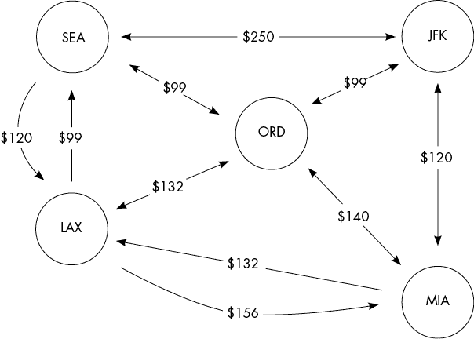

图 3-1：旅行图

如前所述，图是由节点和边定义的。在这个例子中，节点（圆圈）代表主要城市的机场，边（箭头）代表两个城市之间机票的费用。这样的图可以帮助你节省旅行成本。例如，如果你想从西雅图到纽约，你可以先飞从 SEA 到 LAX，再飞到 MIA，最后飞到 JFK，总费用为 396.00 美元。你也可以选择从 SEA 飞到 ORD，再到 JFK，费用为 198.00 美元，或者直接从 SEA 飞到 JFK，费用为 250.00 美元。

我不知道你怎么样，但我每次飞行时不仅仅考虑费用，还会考虑旅行时间。除了每次旅行的费用，你还可以利用这个图来确定两个城市之间的最少中途停留次数。停留次数越少，旅行的时间就越短。正如你所看到的，即使是一个简单的图也可以包含大量的信息。

在分析计算机网络时，攻击者和防守者的第一步是了解“地形”。这意味着，在构建出周围可用资源的图形之前，他们无法开始任何攻击或防御工作。创建这种图形的一种方式是将计算机定义为节点，将网络连接定义为边；这在大多数网络图中很常见。在接下来的项目中，我们将从原始数据包捕获中建模一个计算机网络。在这个定义中，节点将是单独的计算机，边将表示一台机器何时向另一台机器发送数据包。

同样，分析社交网络可以揭示关键人物和关系，比如那些会转发垃圾邮件的员工，或者犯罪组织中的重要成员。你可以利用这些信息来针对或保护网络中的成员（取决于你的工作）。例如，FBI 利用卧底特工获取有关有组织犯罪家庭的信息，然后建立一个社交网络图，确定关键人物，并尝试将其逮捕。如今，随着社交媒体的普及，任何有笔记本电脑的业余侦探都可以建立一个惊人精确的组织（或个人）社交网络图，并利用这些信息针对关键成员以实现自己的目的。

研究人员还应用图论，用它来绘制如蜂窝网络和云计算等技术。例如，学者们提出了应用最短路径算法（类似于限制图 3-1 中机场停留次数的方式）来选择穿越表示 5G 蜂窝网络的图形中的安全路线。这项研究分析了消息如何在网络的物理层（OSI 模型）中从一个点传播到另一个点。^(1) 在第四章中，我们将在从数据包数据绘制计算机网络时使用类似的分析模型。其他现代研究则集中于绘制云中托管的组件之间的逻辑关系。通过映射代码使用和典型的虚拟机管理程序负载活动，科学家们提出了一种正式的方式来描述虚拟化平台的云安全问题。^(2)

图论也应用于*开放源代码情报（OSINT）*，简而言之，它通过收集公开可用的信息来获取目标的情报。一个名为 Maltego 的应用程序会爬取公开网页，寻找相关的术语、电子邮件地址、地点、机器以及其他细节，并创建一个图形，显示它们在线上的出现位置，如图 3-2 所示。在 2017 年的 DEF CON 年度信息安全大会上，Andrew Hay 做了一场关于图论在 OSINT 应用中的精彩入门演讲。

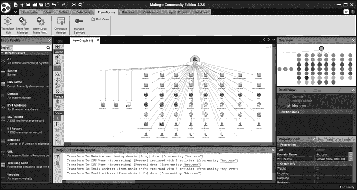

图 3-2：图论在情报收集中的应用

像 Maltego 这样的应用程序将这些逻辑上不同类型的网络融合到一个图中，从而得出非常有趣的洞察。在一个例子中，我的团队能够定位到两个不同论坛用户之间的隐秘通讯渠道。尽管这些论坛由不同的公司运营，但它们托管在同一服务器上。用户 A 加入了 X 网站，而用户 B 加入了 Y 网站。然后，通过操控论坛软件，两名用户能够利用本地文件的读写操作，在底层服务器上传递消息。如果我的团队只检查了社交网络连接，我们可能会被难住，但当我们将社交网络信息和底层机器网络的信息结合起来时，我们意识到这两个账户可以访问相同的硬件。当然，你不必依赖其他人的工具；一旦你了解了内部工作原理，你可以制作自己的 OSINT 收集工具，配上既美观又实用的图形显示。

图还可以用来描述如何通过采取某些行动从一个状态过渡到另一个状态。例如，你可以通过移除门上的锁从相对安全变为完全不安全。在这个定义中，安全和不安全被称为 *状态*，而移除锁则是将你从一个状态转换到另一个状态的 *动作*，称为 *过渡*。图 3-3 显示了这样一个图，称为 *状态机图*，它描述了攻击者在环境中移动的潜力。第六章 将详细讲解状态机。

你可以这样解释这个图：如果你在互联网上，想要接管目标组织中的一名员工的系统，你可以尝试对其客户服务团队进行钓鱼攻击。当你获得一名愿意配合的员工后，你将向他们发送一个远程控制的恶意载荷。然后你将进入该员工的系统，但你可能仍然需要执行某种特权提升操作，才能完全接管系统。你还可以看到，这只是你可以采取的实现目标的一个路径。

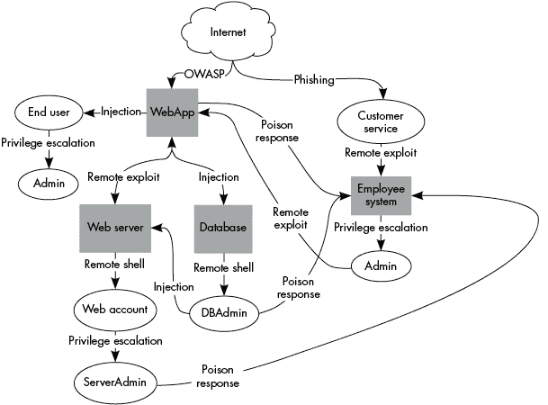

图 3-3：状态机图

现在你对图论的应用有了大致了解，让我们来讨论一下它背后的数学原理。

## 图论简介

一个图 *G* 包含节点集 *V* 和边集 *E*。信息通过一组不重复的边在节点之间传递，这组边将节点连接在一起，称为 *路径*。一个节点可以将信息转发给任何与其直接相连的节点；接收节点是发送节点的 *邻居*。按照惯例，我将边表示为一个元组 (*u*, *v*)，其中 *u* 是源节点，*v* 是终端节点，且 *u* 和 *v* 都属于 *V* 且唯一（不等价）。我们可以用集合表示法写成如下：

E ⊆ ( u, v ) ∈ V 2 ∧ u ≠ v

有时候图中的一条边会指向同一个节点（这打破了我的*u* ≠ *v*假设）；这被称为*自环*。例如，如果你创建一个包含递归函数的程序中的函数调用图，那么会有一条边从递归函数离开，并直接指向它本身。自环并不常见，但一旦出现，它们会使分析变得复杂，需要专门的算法，因此我建议在你对图论的基础知识非常熟悉之前，尽量避免处理自环。

根据图的类型，边可能是双向的（*无向图*）或单向的（*有向图*）。如果通信的方向对当前问题很重要，就使用有向图；否则，使用无向图。在实际应用中，无向图通常处理起来更快，因为你假设（*u*, *v*）=（*v*, *u*）。不过，很多问题描述需要有向边。例如，在图 3-1 的旅行图中，从 LAX 飞往 MIA 的费用与从 MIA 飞往 LAX 的费用不同，因此我们需要在这两个节点之间使用有向边来捕捉方向信息。

一条边可能包含*边属性*，即除了它连接的两个节点之外的额外信息。节点也可以包含额外的信息，称为*节点属性*。当这些属性用于排名节点或边时，它们被称为节点或边的*权重*，而包含权重的图称为*加权图*。在某些情况下，你甚至可能需要为连接两个节点添加多个边（称为*边的多重性*），以考虑不同的边属性或权重。我将在本章后面单独讨论边的多重性，但现在我们可以扩展图 3-1 中的旅行图，来做一个简单的示例。假设我们发现有多趟航班从 SEA 飞往 LAX。我们可以选择为每个额外的航班添加一条边，并将其费用作为权重。为所有城市对添加这些边会让我们了解哪些机场有更多的旅行选择。我们将在接下来的章节中使用多条边、边属性和加权图，以有意义的方式推动我们的研究。

*简单图*是无权重、无向的图，且不包含自环或边的多重性。*非简单图*（或不太常见的*伪图*）包含自环或多条边，它们占大多数实际中你会遇到的有趣图的类型。

图 *G* 的 *环* 是 *E* 的一个非空子集，形成一条路径，使得路径的第一个节点与最后一个节点相同，且路径中没有其他节点重复。这是说，路径形成了一个闭合的循环。自环是图环的一种特殊情况，其路径长度严格为 1。*有向图* 是指至少包含一个图环的图。如果图中没有环（没有闭环），则该图是 *无环* 的。

在深入讨论理论之前，让我们先来看看如何通过编程构建这些图对象。在下一节中，我们将介绍当前 Python 图形的事实标准库 NetworkX。使用这个库中的工具将帮助你构建本书中的示例，并按自己的节奏玩转理论。NetworkX 的文档也是理解每个函数背后理论的一个很好的参考。

## 在 NetworkX 中创建图

你可以使用 NetworkX（它包含大多数图算法的实现）和 Pyplot（Matplotlib 库的一部分）来生成并显示一个无向图。示例 3-1 创建了一个有七个节点和六条加权边的图，并将其显示出来。

```
❶ import networkx as nx
from matplotlib import pyplot as plt

❷ G = nx.Graph()  # Create the default Graph object
❸ G.add_node('f') # Adds a node manually
G.add_node('g') # Adds another node manually
❹ G.add_edge('a', 'b', weight=0.6) # Will add missing nodes
G.add_edge('a', 'c', weight=0.2) # and connecting edges
G.add_edge('c', 'd', weight=0.1) # Weight is one type of edge attribute
G.add_edge('c', 'e', weight=0.7)
G.add_edge('g', 'c', weight=0.8) 
G.add_edge('f', 'a', weight=0.5) 
❺ pos = nx.layout.spring_layout(G, seed=42) # Try to optimize layout 
nx.draw(G, pos, with_labels=True, font_color='w')
plt.show()
```

示例 3-1：创建一个基本的加权无向图

首先，我们导入构建和显示图形所需的两个库 ❶。（将 NetworkX 别名为`nx`，将 Pyplot 别名为`plt`，这是网络示例中的常见约定。）然后，我们使用 NetworkX 的 `Graph` 构造函数 ❷ 创建一个基本的无向图。以这种方式定义的图会返回一个空图（没有节点或边）。

为了手动定义图的结构或 *拓扑*，我们可以添加节点或边。要向图中添加节点，我们使用 `graph.add_node` 函数 ❸，并传入一个参数作为节点的标识符（例如，在查找时）。在这个例子中，ID 是字符串字面量 `f`，但 ID 可以是任何能作为 Python 字典键的对象（例如元组）。`graph.add_edge` 函数接受两个节点和可选的边属性作为参数，直接将边添加到图中 ❹。如果 `a` 或 `b`（或者两者，如此例）在图中不存在，NetworkX 会在添加边之前帮助你添加缺失的节点。对于有向图，你传递给 `graph.add_edge` 的节点顺序决定了边的方向：边从第一个节点开始，到达第二个节点。

图形的真正优势在于它们的视觉解读，因为人类往往能在信息中通过视觉发现模式，这是其他方式难以做到的。NetworkX 支持多种显示图形信息的选项，包括 Matplotlib 和 Graphviz。在这个示例中，我们使用 NetworkX 内置的布局函数之一 `nx.layout.spring_layout` ❺ 来布局图形，它利用弹簧运动的物理模型来定位节点。节点的初始位置是随机生成的，但你可以传入 `seed` 参数使图形可复现，这在你想与他人分享研究结论时非常重要。最终的节点位置存储在字典 `pos` 中，结构为 `{node ID: (``x-coordinate``, ``y-coordinate``)}`。函数 `nx.draw` 使用这些节点位置创建一个绘图对象，Matplotlib 显示结果图形。`nx.draw` 的附加参数 `labels` 和 `font_color` 控制图形的外观，见 图 3-4。

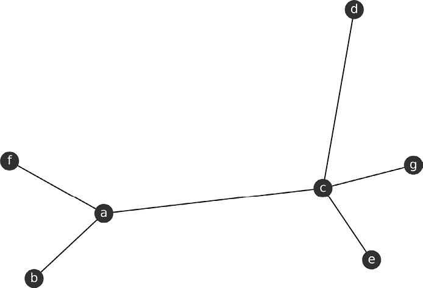

图 3-4：一个无向图

如果你移除 `seed` 参数并重新运行代码，图形可能会有所不同，但它与 图 3-4 中的图形在数学上是等效的。

现在我们有了一种编码和可视化图形的方法，让我们来看一些你可以在分析中使用的有趣度量。

## 发现数据中的关系

在本节中，我们将考察一些最常用的图形属性，这些属性能帮助我们洞察数据中的潜在关系。这些属性以统计关系的形式表现出来，例如两个节点之间可能路径数与图中总路径数的比率。通常我们关心的是了解哪些节点与其他节点隔离，节点之间的最短或最长可能路径是什么，以及从特定起始节点可以到达多少个不同的节点。有数十种可能的图形属性可供探索，但有些属性仅适用于某些类型的图形，而另一些则是这些更一般属性的特定应用场景。这里描述的属性将为你理解接下来三章的项目提供所需的所有知识，但这并不是一个完整的列表。

### 衡量节点重要

在安全性中，一个关键概念是衡量不同资产的重要性，无论是人类还是机器，以及破坏它们可能对整个组织运营产生的影响。为此，我们需要一种衡量哪些节点处于关键位置的方法。*紧密度*衡量两个节点相对于图中其他连接的连通性。

当你在图中的所有节点上应用接近度时，你实际上是在测量每个节点的某种*中心性*（大致上是“重要性”）。图中定义了几种类型的中心性。选择使用哪种类型取决于你试图分析的网络的行为和结构。^(3)有时你无法预先知道哪种中心性度量最适合你的问题。在这些情况下，先从较简单的度量（如接近中心性）开始，然后再尝试其他更复杂的度量。我们将介绍两种中心性：介于中心性和度数中心性。

#### 寻找促进连接的节点

*介于中心性*将连接其他节点的节点视为图中更中心的节点。考虑一个计算机网络，如图 3-5 所示，其中一些系统充当代理，将用户连接到数据库。

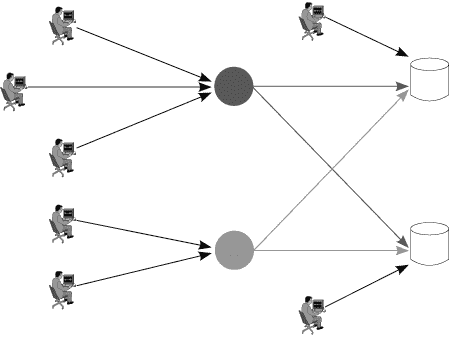

图 3-5：一个简单的代理网络

介于中心性将灰色代理节点的评分大大高于其他任何节点（如用户和数据库），因为七个用户中的五个必须通过两个代理之一才能到达任一数据库。顶部的浅灰色圆圈位于六条路径之间（3 个用户 × 2 个数据库 = 6 条路径），底部的深灰色圆圈位于四条路径之间（2 个用户 × 2 个数据库 = 4 条路径）。此外，由于这五个用户必须通过各自的代理才能访问数据库，中心性进一步得到增强。

从正式的角度来看，节点*u*的介于中心性是从节点*s*到节点*t*的所有最短路径的比率之和，这些路径必须通过节点*u*（记作σ[(][*s*][,] [*t*])），与节点*s*和节点*t*之间所有最短路径的总数（记作σ[(][*s*][,] [*t*][)]）相比，适用于所有*s* ≠ *u* ≠ *t*的路径。将这一切汇总起来如下所示：

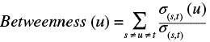

介于中心性分数可以归一化到图中节点的数量*G*。归一化函数对于无向图为 2 / ((*n* – 1)(*n* – 2))，对于有向图为 1 / ((*n* – 1)(*n* – 2))（其中*n*是图中节点的数量）。这种差异源于方向性对归一化的影响。对于无向图，在两个节点之间添加一条边会影响这两个节点的介于中心性分数，因此它的影响是有向图中相同边的两倍（后者仅影响一个节点，即源节点）。计算具有五个节点的有向图和无向图的归一化分数如下所示：

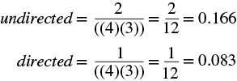

与某些其他中心性度量（如接近中心性）不同，NetworkX 中的介于中心性是否归一化是可选的，可以通过布尔关键字参数`normalized=True`来指定。列表 3-2 展示了我们如何检索在列表 3-1 中生成的图的介于中心性分数。

```
b_scores = nx.betweenness_centrality(G, normalized=True)
nx.set_node_attributes(G, name='between', values=b_scores)
print(G.nodes["c"]["between"])
```

清单 3-2：在清单 3-1 中创建的图的中介中心性

该示例图的归一化结果应约为 0.8。在图 3-4 中，共有 15 条最短路径连接所有节点对（排除以*c*作为起始或结束节点的对）。在这 15 条路径中，12 条路径在某些点上经过*c*（12 / 15 = 0.8）。该示例的 Jupyter 笔记本展示了如何通过循环遍历节点对并计算包含目标节点的最短路径数量，手动计算中介中心性分数。

中介中心性在信息安全和网络分析中有许多应用，因为它表示一个节点在多大程度上促进了其他节点之间的通信。例如，在计算机网络中，一个具有高中介中心性的节点将对网络流量有更多的控制，因为更多的数据包最终会经过它。因此，中介中心性也可以用来识别在网络流量中进行检查的合适位置。另一个应用是理解社交网络中的关键故障点，我们将在第六章中进一步讨论。

#### 测量节点连接数

中心性还可以通过节点拥有的邻居数量来衡量；这被称为*度中心性*。直观地说，度中心性偏向于那些与图中其他节点连接数量较多的节点。（中介中心性可以视为度中心性的一个特定衡量标准。）

对于无向图，度中心性计算为与节点*u*直接连接的所有节点的比例。你通常会看到节点*u*的邻居标注为*Γ*[(][*u*][)]。

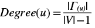

记得在书本开头的数学入门部分，节点集合的绝对值（例如|*V*|）与集合中节点的数量相同。我们从*V*的长度中减去 1，以考虑到节点*c*不能是其自身的邻居。无向度中心性通过`nx.degree_centrality`来计算，如清单 3-3 所示。粗体部分显示了与清单 3-2 相比所需的少量更改。

```
**d_scores = nx.degree_centrality(G)**
nx.set_node_attributes(G, name=**'degree'**, values=**d_scores**)
**print(G.nodes["c"]["degree"])**
```

清单 3-3：带有来自清单 3-2 更改的度中心性（粗体部分）

这段代码的输出应约为 0.66，这意味着节点*c*与图中三分之二的节点是邻居。如图 3-4 所示，节点*c*有四个邻居，除去*c*，总共有六个节点可能是*c*的邻居。于是我们得到 4 / 6 = 2 / 3 = 0.66，这与`nx.degree_centrality`的结果一致。

对于有向图，度数中心性度量被分为两个部分。第一个部分涉及指向节点的边，称为*入度中心性*。第二个部分涉及从节点指向其他节点的边，称为*出度中心性*。每个度量的计算方法与度数中心性相同，只不过它只考虑符合指定方向的边的子集。我们将这些边的集合表示为

( u → ) = E( u, )

对于出度和

( u ← ) = E( ,u )

对于入度。清单 3-4 创建了清单 3-1 的有向版本，然后计算了图中每个节点的入度和出度中心性。

```
❶ **G = nx.DiGraph() # Create the default Graph object**
G.add_edge('a', 'b', weight=0.6)
G.add_edge('a', 'c', weight=0.2)
G.add_edge('c', 'd', weight=0.1)
G.add_edge('c', 'e', weight=0.7)
G.add_edge('g', 'c', weight=0.8) 
G.add_edge('f', 'a', weight=0.5) 
❷ i_scores = nx.in_degree_centrality(G)
❸ o_scores = nx.out_degree_centrality(G)
nx.set_node_attributes(G, name='in-degree', values=i_scores)
nx.set_node_attributes(G, name='out-degree', values=o_scores)
print(G.nodes["c"]["in-degree"], G.nodes["c"]["out-degree"])
```

清单 3-4：创建有向图以衡量入度和出度中心性

为了使图变为有向图，我们将生成器`nx.Graph`替换为`nx.DiGraph` ❶。然后，我们使用`nx.in_degree_centrality` ❷和`nx.out_degree_centrality` ❸来获得各自的度量值。代码的结果应该是两个值都为 0.33。如果你检查数据，你会发现节点*c*有两条入边和两条出边，总共有六条边。对于每个度量来说，计算公式是 2 / 6 = 1 / 3 = 0.33。如果你尝试在无向图上运行清单 3-4，你会得到一个`NetworkXError`类型的错误，因为入度和出度是特定于`nx.DiGraph`和`nx.MultiDiGraph`对象的。

度数度量的家族允许我们在计算得分时指定信息流的方向，而接近中心性和介数中心性度量则假设了方向性。为了理解为什么这很重要，考虑分析与*分布式拒绝服务攻击（DDoS）*相关的网络流量。DDoS 攻击通过将超出目标机器处理能力的流量发送到网络或特定目标，从而阻塞合法用户的访问。随着数据包从一个系统传输到另一个系统，它们在图中形成有向边。在目标节点处，可以看到入度中心性突然增加，这可以让脚本自动检测并响应这一威胁。通过包括信息流的方向，通常可以为你的图提供更有意义的背景。

### 分析团体以追踪关联

调查人员使用*团体分析*来追踪不同群体之间的关联，这些群体通常不会主动提供成员名单。通过收集谁与谁在交流（有时还包括何时交流），你可以发现相互连接的簇，或者称为团体。从理论上讲，图*G*中的一个团体*β*是*V*的一个子集，其中每个节点都与子集中的其他节点相邻。可以把它看作是一群已经彼此见过面的朋友，或者是一群所有计算机都已连接的计算机集群。一些资料可能将这些构造称为*完全子图*。图 3-6 展示了一个包含不同团体的无向图。

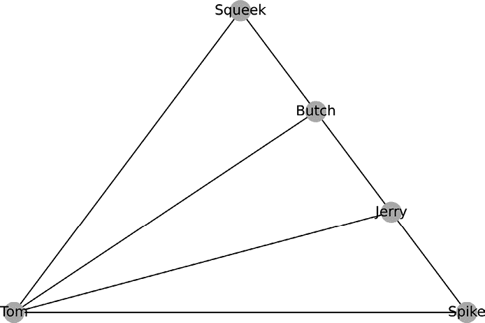

图 3-6：卡通人物图

一个节点可能出现在零个或多个团体中。例如，在图 3-6 中的图中，Tom 出现在三个团体中：Tom、Spike 和 Jerry；Tom、Butch 和 Jerry；以及 Tom、Squeek 和 Butch。列表 3-5 创建了来自图 3-6 的图，并计算了每个节点的团体成员得分。

```
clique_graph = nx.Graph()
clique_graph.add_edges_from(
    [
        ("Tom", "Jerry"),("Butch", "Jerry"),("Spike", "Jerry"),
        ("Spike", "Tom"),("Tom", "Squeek"),("Tom", "Butch"),
        ("Squeek", "Butch")
    ]
)
clq = nx.algorithms.number_of_cliques(clique_graph)
tot = nx.algorithms.graph_number_of_cliques(clique_graph)
for m in clq:
    print(m, (clq[m]/tot))
```

列表 3-5：创建图 3-6 中的卡通人物团体图

调用`nx.algorithms.number_of_cliques`可以统计每个节点所属的团体数，你可以用它来轻松找到所在团体最多的节点。为了找到图中团体的总数，我们使用`nx.graph_number_of_cliques`。然后，我们可以将每个节点的团体数和总团体数结合起来，创建一个归一化的评分，用于确定网络中的关键促进者。运行此示例代码的输出应为：

```
{'Tom': 1.0, 'Jerry': 0.66, 'Butch': 0.66, 'Spike': 0.33, 'Squeek': 0.33}
```

Tom 在每个团体中，Jerry 和 Butch 分别出现在三分之二的可能团体中，而 Spike 和 Squeek 只出现在三分之一的可能团体中。显然，Tom 是这个网络中最著名的成员。在社交网络中，如公司或有组织的犯罪集团，出现在最多团体中的成员对于促进操作至关重要。如果我们想要破坏这个组织的活动，去除 Tom 将大大有助于实现这一目标。你还可以通过衡量网络中的团体成员关系，识别那些充当网络中其他分隔部分之间网关的节点。

函数`nx.algorithms.number_of_cliques`查找每个节点所属的*最大*团体的数量——即所有节点互相连接的最大节点组。在无向图中，任何两个相邻的节点都可以视为一个团体，并且在任何图中，包含四个或更多节点的团体包含三个和两个节点的团体，因此，处理最大团体时考虑到了这些子团体。

你可以使用`nx.find_cliques`函数列举图中的所有最大团体，如列表 3-6 所示。

```
cliques = list(nx.find_cliques(clique_graph))
print(cliques)
```

列表 3-6：从有向图创建团体列表

结果是一个`Generator`对象，这是 Python 3 中内置的对象类型。你可以直接使用它，也可以将其转换为`list`。我们将在第五章中看到一个实际应用，通过使用`nx.find_cliques`查找团体，当我们从帖子构建社交网络图时。

### 确定网络的连通性

图可以是连通的或不连通的。*连通*图是指每一对节点（*u*，*v*）之间都有某种连接路径（*ρ*）。因此，如果任何一对节点（*u*，*v*）没有连接路径（*ρ*），则图*G*是*不连通*的。判断一个图是否连通的唯一方法是检查每一对节点，看看它们是否不连通。我们可以使用集合符号和布尔代数来简洁地写出这一点：

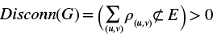

一个布尔语句，如 *ρ*(*u*, *v*) ⊄ *E*，如果为真则返回 `1`，否则返回 `0`，因此这个方程实际上会计算所有断开节点对。在实际应用中，我们不需要继续搜索 *G* 中的所有剩余节点对，因为一旦我们发现一个缺失的边，就知道它是一个断开的图。然而，我们只能在检查了每一对节点并且没有发现断开的节点对时，才能说图是连通的。你可以自己通过图 3-1 中的图来判断它是连通图还是断开图。

图 3-7 展示了图 3-6 的图扩展成一个断开的图。


图 3-7：一个断开的图

断开的图由两个或更多不同的部分组成，这些部分称为*连接组件*（或简称*组件*）。正式来说，一个无向图 *G* 的连接组件 *ϕ*i* 是一个子图，其中每对节点 (*u*, *v*) 都由路径 *ρ*(*u*, *v*) ∈ *E* 连接（对于第 *i* 个组件子图中的路径，标注为 *ρ*(ϕ[*i*], *u*, *v*)）。此外，ϕ 中的节点不能与超集 *V* 中的其他节点连接。例如，图 3-7 展示的图有两个连接组件：一个包含卡通人物，另一个包含前乐队成员。

### 使用图的边来捕获重要细节

我们将要检查的最后一个图的属性是我之前提到过的边的多重性。这个属性在你知道如何利用它为分析带来的灵活性后非常强大。在许多实际应用中，比如下一章的包分析项目中，节点之间可能有多条边，这些边包含我们希望保留进行分析的有价值的信息。

例如，绘制 TCP 握手图需要在两个节点之间绘制多个定向边。连接的机器（也叫做*客户端*）向目标机器发送同步请求（一个 SYN 包），这在图中创建了一条从 *u* 到 *v* 的定向边。目标机器随后会发送一个确认响应，并同时请求同步（一个 SYN-ACK 包），这会在图中创建一条从 *v* 回到 *u* 的定向边。（在无向图中，这个响应会被视为第一次边的重复。）最后，连接的机器发送给目标机器自己的确认包（一个 ACK 包），这会在图中创建第二条从 *u* 到 *v* 的定向边。图 3-8 展示了两种不同的系统组之间的 TCP 握手数据所构成的相同图的两个版本。

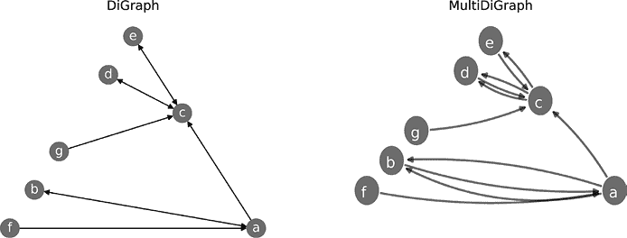

图 3-8：比较单边图和多边图

左侧是一个标准的`DiGraph`表示法，它将两个节点之间的重复通信视为一条单一的有向边。仅通过检查这个图，你无法确定哪些节点参与了 TCP 握手。右侧是相同数据的`MultiDiGraph`表示法，它为每次通信发生保留一条边。通过检查这个图，你可以很容易看出节点*c*发起了与节点*d*的类似握手的交换。节点*a*也发起了与节点*b*的握手。

处理边的多重性有两种思路。第一种思路认为你应该根据它们的权重ω（以及可能的其他属性）将多条边总结为一条边，像这样：

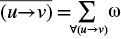

如果组成边是无权重的，那么权重就是组成复合边的边的数量：

( u → v ) ω = | ( u → v ) | ∈ E

在处理有向图时，这种总结必须考虑到边的方向性。（如果你在边的属性中使用复杂值——例如范围，这需要专门的处理来进行总结——你最好在代码中实现自己的边总结定义。）

第二种思路是将每条边单独绘制，只有在分析时才总结这些边。这样做可以保留更多的底层结构。例如，考虑网络数据包中的时间戳信息。如果你像前面的例子那样将边总结为一条边，你就无法看到边创建的顺序。保留每条边使你可以按时间戳对它们的创建顺序进行排序，并寻找有趣的模式，比如边中的呼叫和响应对。

在图中处理边的多重性没有统一的对错方法。正确的方法通常是两种思路的结合，正如我们将在下一章看到的那样。

## 总结

图论的力量在于节点和边的灵活解释。节点代表的是人、计算机、城市，还是完全不同的事物？边是衡量物理距离，还是衡量无形的关系？这些问题的答案都是肯定的。不过要注意：这种感知自由是一把双刃剑。因为节点和边的定义并不严格，所以你可以创建一个图，其边和分析与现实之间没有任何有意义的关系。一个例子是使用代表计算机的节点和代表计算机所在城市之间物理距离的边。我们通常不会考虑互联网消息的传播距离是基于物理距离，而是基于消息在到达目的地之前需要经过多少个网络“跳”。在接下来的三章中，我将更深入地解释信息的不同解释的正当性，因为结果的含义，例如接近中心性，依赖于边的权重的含义，并需要一定的上下文才能理解。

这里涵盖的理论只是冰山一角。理查德·特鲁多（Richard Trudeau）所著的《图论导论》（Dover，2001）是一本非常优秀的资源。4 如果你在寻找更高级的讨论，可以参考马滕·范·斯廷（Maarten van Steen）于 2010 年出版的《图论与复杂网络：导论》一书。5 两本书都使这些话题易于理解，数学内容也易于跟随。如果你更关注安全方面，可以查阅 2020 年 12 月发表于《信息安全与应用期刊》上的论文“图论在安全中的应用：物联网网络中安全解决方案的定性部署”，该论文使用图论分析物联网网络设备的安全性，并确定监控设备流量的合适位置。6

在接下来的两章中，我们将通过研究计算机网络和人类社交网络，将这些理论概念付诸实践，学习哪些节点对网络至关重要，哪些信息正在交换，以及关于基础图结构的其他重要见解。最终的图论项目将在第六章中给出，你将获得模拟网络随时间变化所需的工具。一旦你理解了这些概念和解释，你所能获得的洞察力将使图论成为你分析工具库中最强大、最灵活的武器之一。
