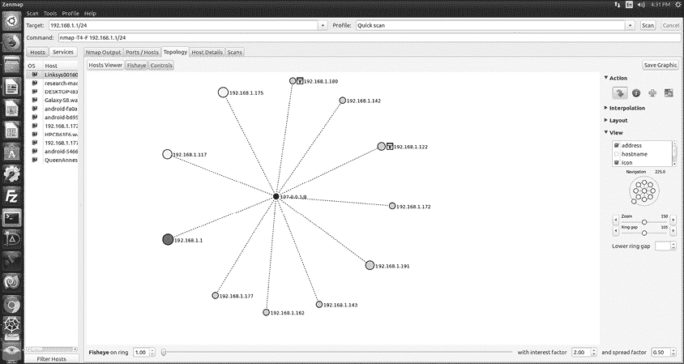
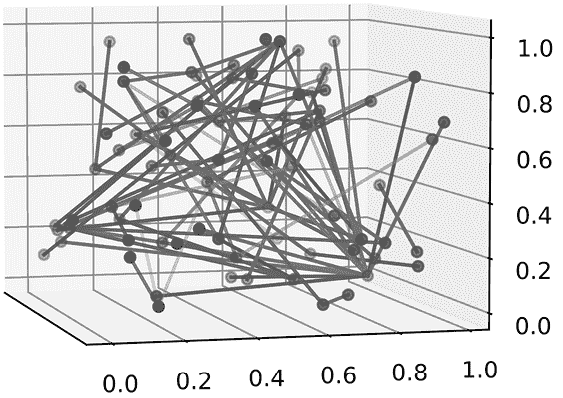
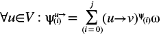
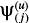
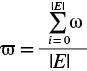
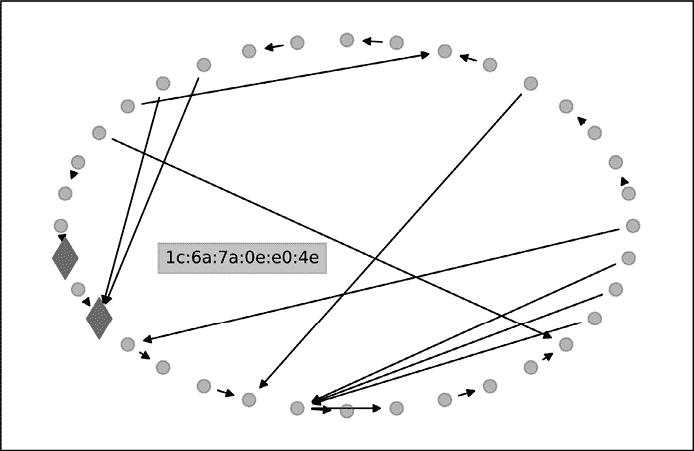
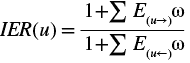

# 第六章：构建网络流量分析工具


对于我们的第一个项目，让我们从一个熟悉的主题开始。在安全领域，我们大多数人都至少花过一些时间分析数据包和监控网络流量。在本章中，我们将应用上一章讨论的概念——多边缘有向图、中心性和信息交换——来构建我们自己的网络流量分析工具。我们将使用捕获的网络数据来构建图形，计算一些指标以了解观察到的流量的属性，然后使用中心性度量来找出每台机器在做什么。

当我们谈论网络上的系统时，我们通常会想到它们最常见的使用场景。有些机器在网络上是为了提供文件服务，另一些则用于路由电话流量，还有一些则代表网络用户。通过弄清楚机器所扮演的角色，我们可以对每台机器产生的流量类型做出合理的猜测。

我们将使用信息交换比率来确定哪些机器正在创建和接收最多的某种类型的流量；这将帮助我们确定常规的流量水平，从而识别潜在威胁。最后，我们将开始捕获和分析周围的网络流量，使用一个概念验证工具从实时数据包捕获中生成图形。

让我们从一个示例网络图开始。

## 网络拓扑可视化

大多数基于 GUI 的数据包分析工具，如 WireShark 或 Zenmap，都允许你可视化网络拓扑，将数据包分析与图论结合起来推断网络结构信息。图 4-1 展示了我在研究网络上捕获的一个示例。



图 4-1：来自 Zenmap 的示例网络拓扑视图

回顾一下第三章，其中*V*表示所有顶点，*E*表示所有边；*V*和*E*结合形成图*G*。在图 4-1 中，*V*中的每个节点代表一个在网络上生成流量的系统。*E*中的每条边是由观察到的数据包定义的通信路径。节点和边都有从解析的数据包字段中提取的属性；我们将利用这些属性进行进一步分析。从我的研究网络图中，我们可以推断出我的机器能够与位于同一局域网段的 11 台其他机器进行连接。

一般来说，我们可以将此图解读为展示我的研究网络中计算机之间的通信关系。我们可以使用这个关系图来推断出关于预期和意外行为的结论（例如，为什么你的咖啡壶会向你的打印机发送网络流量）。这在安全系统中非常有用，正如你所预料的那样。

大多数传统的网络监控工具依赖*签名检测*来分类恶意流量，在这种方式下，监控工具会扫描出表示威胁的行为，例如一个包的发送者 IP 是已知的指挥与控制服务器。通常，这些签名有两种形式。第一种，也是最常见的，是*妥协指示符（IoC）*，它代表恶意软件执行的独特操作。顾名思义，IoC 可以帮助识别系统是否已被入侵。例如，如果一位研究分析员发现某个新的恶意软件变种在其设置过程中试图联系特定的 URL，那么网络管理员可以在他们的监控软件中添加一条规则，阻止访问该 URL 的流量，并发出潜在感染的警报。问题在于，IoC 方法依赖于对行为的先前了解，这些行为具有足够的独特性，可以高概率地识别感染并且低概率地误报。这些行为可能需要几个小时的人力研究来识别，而对于恶意软件作者来说，仅需几分钟时间即可在下一个变种中进行更改。需要跟踪的 IoC 数量令人震惊，而将它们应用到所有网络流量中，有时会导致系统变得极为缓慢。

我们可以通过第二种类型的签名检测来解决这个问题，恰当地命名为*异常检测*。这种签名依赖图论的元素来创建一组被认为是“正常”行为的网络指标。在实时流量分析中，如果这些值之一超出了定义的范围（通常包括一个可接受的偏差），操作员将会收到警报。通过将图论应用于网络流量，你可以设计出能够检测并应对异常流量的系统，而不依赖于以前见过的样本。然后，你可以进一步定义一个系统，根据生成的警报类型自动做出响应。

要将我们讨论的理论转化为异常检测系统，我们首先需要弄清楚如何将网络流量数据转化为可以分析的图形表示。我们还需要添加另一个库来提取我们想要的数据，并以有意义的方式将其输入到 NetworkX 中。

## 将网络信息转换为图形

我们将使用 Python 库 Scapy 从数据包捕获文件（即 *pcap* 文件）中提取信息，然后利用第三章中的概念基于这些信息创建图表。Scapy 是 Python 版本的瑞士军刀，用于数据包操作，提供了捕获、分析、构建和传输网络数据包的工具。Scapy 甚至可以用来快速定义全新的网络协议。Scapy 基于平台特定的数据包捕获库工作。在 Linux 上，这是 libpcap，通常在大多数现代 Linux 平台上默认安装；它在基于 BSD 的发行版和 macOS 上也默认安装，而在其他基于 Linux 的发行版上，通常也默认安装稳定版本。在 Windows 上，你需要安装如 WinPcap（现已弃用）或 Npcap（[`npcap.com`](https://npcap.com)）这样的替代库。如果你在 Windows 机器上使用过其他数据包分析工具，如 WireShark，可能已经安装了其中一个库。

我们将从 *network_sim.pcap* 文件中读取数据包，该文件可以在本书的 GitHub 仓库中下载。我们的目标是识别网络中那些表现出异常行为的机器，即与正常“预期”行为不同的机器。我们将分析这些数据包，识别数据中的机器，了解它们之间的通信情况，以及发生了什么类型的通信。为此，我们将应用一些网络协议知识，并用大量的统计分析方法来分析数据包图。

### 构建通信图

捕获文件包含由 Snort 收集点记录的流量（[`www.netresec.com/?page=ISTS`](https://www.netresec.com/?page=ISTS)）。该捕获文件包含来自 80 个唯一 *媒体访问控制（MAC）* 地址的 139,873 个数据包。MAC 地址是由制造商烧录到网络接口卡（*NIC*）硬件内存中的唯一标识符。简化来说，NIC 的工作是将数据物理传输到网络上的下一个设备（通常是某种类型的路由器或交换机）。如果你使用以太网电缆，NIC 会将电信号沿电缆传输。如果你使用无线 NIC，数据将通过某种接收器和发射器组合广播。当你在家或咖啡店连接到网络时，NIC 会将其 MAC 地址发送给路由器，路由器会根据该 MAC 地址为系统分配一个 IP 地址。如果路由器之前没有见过这个 MAC 地址，它会分配下一个空闲的 IP 地址；但如果该机器之前已分配过 IP 且该 IP 仍然有效，路由器通常会再次分配相同的 IP 地址。然而，有时之前的 IP 地址已被分配给另一个 NIC，因此路由器会为这个曾经见过的 MAC 地址分配一个新的 IP。

我们将使用每个参与数据包传输的设备的源 MAC 地址和目标 MAC 地址作为图中的边标识符。然而，机器在连接之间完全更换网卡的可能性较小，因此 MAC 地址应该保持不变。通过使用 MAC 地址来识别每台机器，我们将能够在不同的 IP 地址之间识别同一网卡，从而构建出一个相对准确的通信图，避免在机器的 IP 地址发生变化时产生混淆。

现在我们知道了可以用来识别系统的数据，我们可以专注于我们感兴趣的网络数据类型。由于有近 140,000 个数据包可用，我们希望进行筛选，以减少数据中的噪音并提高处理效率。此时，你对网络协议的知识将发挥作用。网络流量中可能存在数十种，甚至数百种不同的网络协议。通过理解不同协议及其可能的使用场景，你可以更快速地聚焦于感兴趣的数据。我们没有足够的篇幅深入讲解数据包分析，因此我建议你阅读章节总结中列出的优秀书籍，以了解良好的数据包过滤器在安全分析中的强大作用。

示例文件包括以下协议组成的数据包：

+   TCP：137,837

+   UDP：2,716

+   ICMP：297

+   其他：1,352

我们的分析将重点关注 TCP 和 UDP 数据包（这两种是常见网络通信中使用的主要数据包类型，例如网页流量）。TCP 和 UDP 是建立在 IP 层之上的，因此我们将忽略没有 IP 层的数据包，从而筛选出除了这两种协议以外的数据包。我们还将提取 IP 地址和端口。端口号在我们讨论通信类型时非常重要，因为许多软件（如数据库和 Web 服务器）往往会使用默认端口号，因此它们在数据包中的存在可以帮助我们猜测通信双方可能使用的系统。通过收集这些 IP 地址信息，我们可以分析哪些 MAC 地址与多个 IP 地址配对。这可以让你了解，仅仅使用 IP 地址作为标识符可能引入多少错误。

### 构建图

在 Listing 4-1 中，我们将数据包数据加载到一个 `MultiDiGraph` 中。

```
import networkx as nx
from scapy.all import rdpcap, IP, TCP, UDP

❶ net_graph = nx.MultiDiGraph()
❷ packets = rdpcap('network_sim.pcap')
❸ for packet in packets:
  ❹ if not packet.haslayer(IP):
        # Not a packet to analyze.
        continue
  ❺ mac_src = packet.src        # Sender MAC
    mac_dst = packet.dst        # Receiver MAC
  ❻ ip_src = packet[IP].src     # Sender IP
    ip_dst = packet[IP].dst     # Receiver IP
  ❼ w = packet[IP].len          # Number of bytes in packet
  ❽ if packet.haslayer(TCP):
        sport=packet[TCP].sport # Sender port
 dport=packet[TCP].dport # Receiver port
  ❾ elif packet.haslayer(UDP):
        sport=packet[UDP].sport # Sender port
        dport=packet[UDP].dport # Receiver port
    else:
        # Not a packet to analyze.
        continue
    # Define an edge in the graph.
  ❿ net_graph.add_edge(
        *(str(mac_src), str(mac_dst)),
        ip_src=ip_src,
        ip_dst=ip_dst,
        sport=sport,
        dport=dport,
        weight=w
    )
print(len(net_graph.nodes))
```

Listing 4-1：从 pcap 文件填充图

`net_graph` `MultiDiGraph` 变量❶将通过 `rdpcap` ❷ 加载的 pcap 文件进行填充，`rdpcap` 是 Scapy 的一个函数，能够读取 pcap 文件并返回 Scapy `packet` 对象列表，这些对象存储在 `packets` 变量中。为了只筛选 TCP 和 UDP 数据包，我们会遍历每个 `packet` 对象❸，并检查它是否定义了 `IP` 层❹。如果定义了，我们将从基础数据包中提取源和目标 MAC 地址，分别使用 `packet.src` 和 `packet.dst` ❺，这会给我们一些边缘属性。

Scapy `packet`对象以层的方式存储每个封装在数据包中的协议属性，像 MAC 地址这样的以太网卡数据存储在基础层中。我们通过类似字典的索引访问额外的层级：例如，`IP`层中的源 IP 地址和目标 IP 地址分别在`packet[IP].src`和`packet[IP].dst` ❻中。我们提取这些信息作为边属性。为了根据每个数据包发送的字节数来加权边，我们将`packet[IP].len`属性 ❼保存在`w`中，并稍后将其存储在边的`weight`属性中。使用`weight`作为属性名称，NetworkX 将自动识别并在分析中使用它。通过数据包的 IP 层长度来加权每个边是估算机器间传输数据量的简单方法。

最后，我们检查数据包是否有`TCP` ❽或`UDP`层 ❾。我们需要进行这个额外的检查，因为并非所有带有 IP 层的数据包都是来自 TCP 或 UDP 协议。例如，互联网控制消息协议（ICMP）数据包也有 IP 层信息，但它们的格式与 TCP 或 UDP 数据包不同。

如果数据包中存在 TCP 或 UDP 层，我们提取源端口和目标端口；否则，我们跳过该数据包。我们使用收集到的属性作为边属性，并将 MAC 地址作为节点 ID ❿，为每个符合条件的数据包创建一个边。最后，我们可以打印出`net_graph`对象的长度，这将告诉我们创建了 80 个节点。图 4-2 展示了网络数据的三维图形表示。



图 4-2：网络的三维表示

我已经使用`nx.random_layout`函数生成了这个图的坐标值，作为目前的占位符，因为我们还没有定义要寻找的内容。该函数默认只生成* x *和* y *值，但你可以传递参数`dim=3`，让它生成三维坐标。我们将进行其余的分析时使用 2D，但我想展示大多数人思考的图的样子——三维的。能够像这样轻松地以三维形式展示复杂的网络，节省了大量时间。即使这个图看起来很复杂，你已经能从中感知到通信中的重要节点。例如，位于上方中央区域的一个节点，有很多边连接到图中其他节点。不过，除了这些非常基础的观察外，你不会获得太多的深刻见解。

节点数量和复杂的交互使得自动化图分析方法非常适用。利用我们已经掌握的理论，我们将把这个图解开，变成有组织且富有信息的子图。你将运用新学到的边过滤和求和技巧，发现哪些节点在使用有趣的协议（如 HTTP 和 HTTPS）进行通信。我们将检查哪些机器通过出度连接的度量与大量其他机器进行联系，最后，我们将探索一个概念验证程序，允许你捕获并分析自己网络中的数据包。

## 识别可疑的机器行为

让我们在网络数据的背景下重新审视“接近度”这一概念。既然我们记录了数据包的目标端口，并将边的权重定义为相应数据包中传输的字节数，那么我们对网络提出的第一个自然问题是：“哪些机器在使用哪些协议进行通信？”如果我们假设某些目标端口的流量属于某种协议或应用（例如，80 端口用于 HTTP，或 22 端口用于 SSH），那么这个任务等同于问：“哪个节点向给定端口发送的数据量最多（按数据包字节数计算）？”我们的简化假设实际上是网络工具（如 Nmap）中快速协议指纹识别的基础，所以我在这里做出这个假设是很有根据的。我们可以更正式地将协议使用的问题重新表述为：

> 给定一组协议 Ψ，确定哪个节点具有协议 Ψ[(][*i*][)]的最高加权出度。

实际上，调查人员在检查网络操作时，常常会问这样一个问题：如何识别表现异常的机器（即偏离观察到的平均值的机器），因此将这一过程自动化是有意义的。

### 端口数据量的子图

你可以通过首先创建一个仅包含类型为 Ψ[(][*i*][)]（例如 SSH）边的子图，然后测量子图中每个节点的加权出度，简单快速地调查给定端口的数据量。清单 4-2 为清单 4-1 中的代码添加了一个辅助函数，用于为任意端口号创建子图。

```
def protocol_subgraph(G, port):
    o_edges = [(u,v,d) for u,v,d in G.edges(data=True) if d["dport"] == port]
    if len(o_edges) < 1:
        return None
    subgraph = nx.DiGraph()
    subgraph.add_edges_from(o_edges)
    return subgraph
```

清单 4-2：一个协议子图辅助函数

函数`protocol_subgraph`接受图和端口号作为参数，收集所有表示流量*到*该端口的边，并创建一个简单的有向图。使用条件语句`if d["dport"] == port`的列表推导式将边集修剪为仅包含感兴趣的边。然后，它创建一个`DiGraph`对象，并通过`nx.add_edges_from`将修剪后的边集添加到图中。正如我之前提到的，这也会将节点添加到图中。因为 NetworkX 会自动对`DiGraph`中相同两个节点之间的多条边的`weight`属性进行求和，所以`subgraph`中每条边的`weight`属性将表示两台设备之间所有数据包的字节总数。

然后，我们可以使用`nx.out_degree`函数检查返回的子图中每个节点的外向流量。清单 4-3 展示了如何获取端口 80 的相关信息。

```
dG = protocol_subgraph(net_graph, 80)
out_deg = dG.out_degree(weight='weight')
sorted_deg = sorted(out_deg, key=lambda x: (x[1], x[0]), reverse=True)
print(sorted_deg[0])
```

清单 4-3：查找具有最多外向流量的单协议机器

首先，我们调用清单 4-2 中定义的辅助函数，传入在清单 4-1 中创建的`MultiDiGraph`和感兴趣的端口（在此示例中为`80`），然后我们调用`out_degree`函数，该函数返回子图中每个节点的外部边的原始计数。为了将行为更改为返回求和后的边权重，我们显式传递`out_degree`的`weight`参数。通常，NetworkX 会自动识别`weight`参数，但在我测试代码时，出于某些原因，它并没有识别。添加显式引用`weight`属性解决了该问题。

为了找到在端口 80 上发送最多数据的设备，我们使用`sorted`函数对结果进行排序。`key`参数传入一个用于排序复杂对象（如元组或字典）的函数。我们传入一个 lambda 函数，它接受一个形如`（节点 ID，外度权重）`的元组，并按`（外度权重，节点 ID）`的顺序对项进行排序，因此节点首先按外度排序；如果存在平局，节点 ID 会作为决胜负的标准。`reverse`选项将项按降序排序（默认是升序）。排序后的列表中的第一个项现在具有最高的外度，正如你在代码输出中应该看到的那样：

```
('1c:6a:7a:0e:e0:41', 592)
```

由于我们的目标是识别有趣或异常的网络活动，例如在 SSH 和 HTTP 等关键服务上的网络外向活动突然增加，我们希望列出协议，并确定每个协议中具有最高加权外度的节点。这相当于



该方法定义了一个 |*V*| × *j* 矩阵（也称为二维数组，适合代码员），其中 *j* 是要检查的协议数量。该条目  存储了协议 *j* 对于节点 *u* 的边的总权重。

在清单 4-4 中，我们再次利用了清单 4-2 中的`protocol_subgraph`函数来回答“哪些机器具有最高的加权通信？”这个问题，涵盖了四个常见的端口：HTTP、数字专用网络信令系统（DPNSS）、Metasploit RPC 守护进程的默认端口（Armitage 团队服务器也使用该端口）以及 HTTPS。

```
psi = [80, 2503, 55553, 443]
for proto in psi:
    dG = protocol_subgraph(net_graph, proto)
    out_deg = dG.out_degree(weight='weight')
    sorted_deg = sorted(out_deg, key=lambda x: (x[1], x[0]), reverse=True)
    print(proto, sorted_deg[0])
```

清单 4-4：定位具有最高外向流量的多协议机器

对于`psi`中的每个端口号，我们创建一个协议子图`dG`；然后，对于子图中的每个节点，我们计算所有外度边的权重总和。一旦计算出当前协议中所有节点的权重，我们按权重升序对得分进行排序，并打印出每个结果集中的第一个项。

这是该函数的输出：

```
80 ('1c:6a:7a:0e:e0:41', 592)
2503 ('00:26:9e:3d:00:2a', 949)
55553 ('1c:6a:7a:0e:e0:41', 52)
443 ('00:0c:29:ac:42:4b', 678)
```

每一行输出都给出了端口号、节点地址以及每个协议中流量最多的节点的出度得分。作为安全研究人员，第一个应当引起你注意的是端口 80 和端口 55553 的节点是相同的。这一点很有趣，因为端口 55553 被之前提到的渗透测试软件使用，而端口 80 通常代表未加密的网页流量。这可能表示某种扫描器，在探测未加密的网页内容并将数据报告回 Metasploit 服务器。如果我在调查该网络中的可疑用户，我会开始深入挖掘`1c:6a:7a:0e:e0:41`的行为。

另一个值得关注的项目是端口 2503 上的 DPNSS 流量可能表明存在*私人分支交换机(PBX)*，即组织内部使用的私人电话网络。`00:26:9e:3d:00:2a`很可能是某种 IP 语音(VoIP)电话，但你需要进一步调查以确认这一假设。VoIP 是一种有趣的协议，因为如果安全措施不当，攻击者可以窃听通话、注入音频到电话会议中、重新路由或阻止通话，甚至以其他方式干扰连接的电话系统。

### 识别异常流量水平

为了找出哪个节点接收了某个协议最多的数据，我们可以使用`protocol_subgraph`函数中的接收端口，并改为衡量入度。问题是，如何确定接收的流量量是否正常或可疑。为此，我们通过将每条边的权重求和并除以协议子图中的边数，来估算网络上入站流量的平均值：



如果我们假设某协议的流量是正态分布的（意味着大多数系统在特定协议下接收的流量是相似的），我们可以使用*z-score*公式，将检测到的使用量与平均值进行比较，根据其与平均入站流量ϖ的差异是否由正常变异引起，给节点打分。我们可以选择我们希望多有信心（通常在 80 到 99.9%之间），即变异不是偶然的。更高的置信水平意味着更多的变异会被视为“正常”，而更少的数据会被标记为异常，或者更简单地说，观察值与期望值之间的差异必须多大，才能被认为是“奇怪的行为”。列表 4-5 展示了如何为 HTTP 协议子图实现这一点。

```
from scipy import stats
import numpy as np
protoG = protocol_subgraph(net_graph, 80)
in_deg = list(protoG.in_degree(weight='weight'))
scores = np.array([v[1] for v in in_deg])
❶ z_thresh = stats.norm.ppf(0.95) # 95% confidence
in_degree_z = stats.zscore(scores)
❷ outlier_idx = list(np.where(in_degree_z > z_thresh)[0])
nodes = [in_deg[i][0] for i in outlier_idx]
print(nodes)
```

列表 4-5：使用 z-score 识别异常值

我们首先从 SciPy 库中导入`stats`模块，并将 NumPy 库导入为`np`。接下来，通过将源图和 HTTP 端口 80 传递给我们在示例 4-2 中定义的`protocol_subgraph`函数，来定义协议子图`protoG`。然后，我们使用`protoG.in_degree`函数计算加权入度。我们使用一个名为`scores`的 NumPy 数组来存储加权入度得分。接下来，我们根据选择的置信水平查找*z*阈值；在这个例子中，我们选择 95%的置信水平，相关的*z*阈值是 1.645 ❶。这个值表示我们用来区分正常数据和异常数据的标准差数。

使用这一组数据，我们通过`stats.zscore`函数计算协议子图中每个节点的 z-score，并将其保存到`in_degree_z`中。z-score 的值以 0 为中心，因此负值代表入度加权低于平均值的节点。由于目前我们不关注流量低于平均水平的系统，所以我们只保留那些大于我们通过`np.where(in_degree_z > z_thresh)`设置的阈值的得分，并将这些得分称为离群值。

结果是一个包含单个元素的嵌套列表，因此我们取第 0 个元素，它是一个包含`scores`数组中高于阈值的值索引的 NumPy 数组 ❷。我们将其保存到一个名为`outlier_idx`的列表中。最后，我们通过查找`outlier_idx`中的每个元素在`in_deg`中的对应项，将索引转换为节点 ID。

我们运行代码并发现两个有趣的节点 ID，我们有 95%的把握，它们在端口 80 上的流量明显高于其他节点：

```
['7c:ad:74:c2:a9:a2', '1c:6a:7a:0e:e0:4e']
```

图 4-3 展示了端口 80 的协议子图，使用的是入度度量。



图 4-3：网络上 HTTP 流量的协议子图

图中的每个节点都在端口 80 上发送或接收了数据包。黑色菱形节点表示示例 4-5 返回的感兴趣节点。带标签的节点具有最高的入度：在端口 80 上有三个不同的入站连接。圆形灰色节点的入度在端口 80 流量的正常范围内。

从安全角度来看，这两个问题（哪个系统发送了最多某种类型的流量，以及哪些系统接收了统计学上显著数量的某种类型的流量）使我们能够评估网络中节点的行为。通过在一段时间（例如两周）内测量正常、无入侵的流量，然后与实时捕获的流量进行比较，您可以找到行为变化（无论是流量量变化还是执行的操作），这些变化可能表明发生了安全泄露。例如，如果您知道`00:26:9e:3d:00:2a`绝对不是一个 VoIP 电话，那么突然发出的连接到电话网络的行为可能会引起警觉。至少，您应该联系该机器的操作员，以了解为什么这种行为发生了变化。

### 检查机器在网络上的交互

作为一名安全分析师，您可能有兴趣了解机器如何在网络中以不同但相关的方式进行交互。您可能会提出一些与协议无关的问题，例如“哪个机器联系了最多的其他机器？”或者“哪个机器吸收的信息最多？”在我的网络中，通常不同机器之间几乎没有互相通信（例如，我的 3D 打印机不应该与我的监控摄像头控制器通信），唯一的例外是我的节点，它会定期连接到所有这些机器。通过检查我的网络中的邻居，您很快就会发现我在运行哪个节点。而且您可能已经猜到，由于它隐性地倾向于那些是许多不互联节点的邻居的机器，我在介入中心性上的得分也会很高。

测量系统之间交换的信息量是识别试图从网络中窃取数据的机器及其窃取来源的另一种方法。在信息交换分析中，您可能会定位到作为信息存储库的机器（例如文件服务器和数据库），这些机器通常接收的信息比发送的多。另一类则是数据流服务器，它们产生的数据远多于接收的数据。为了开始这一分析，我们首先将问题更正式地表述，然后开发代码来进行调查。

#### 确定请求节点

第一个问题可以更正式地表述为：

> 对于*G*中的所有节点，找到具有最多外向邻居的节点。

我称这个节点为“请求节点”，因为它的行为像一个在社区里逐门逐户推销产品或收集签名的人。网络扫描器（如 Nmap）会对它在网络上找到的任何机器创建外向连接，这使得运行这些工具的机器在我们的分析中会显得特别突出。我们可以通过将两个节点之间的多个边缘汇总为单一边缘，然后计算每个节点的外度来找到我们问题的答案，如 Listing 4-6 所示。

```
dG = nx.DiGraph()
dG.add_edges_from(net_graph.edges(data=True))
out_deg = dG.out_degree()
out_deg = sorted(out_deg, key=lambda x: (x[1], x[0]), reverse=True)
u, score = out_deg[0]
print(u, score)
```

Listing 4-6：查找具有最多外部连接的机器

我们将`MultiDiGraph` `net_graph`中的所有边添加到一个新的有向图`dG`中，这样 NetworkX 就可以将节点之间的多个边总结为一条具有合并`weight`属性的单一边。然后，我们使用总结后的图中的出度来找到具有最大值的节点，通过将列表按降序排序并选择第一个节点。正如我之前提到的，平局节点将根据节点 ID 的字母顺序进行排序。我们从分组中创建一个网络图，并通过节点 ID 的字典顺序进行排序。

Listing 4-6 中的代码将识别出节点`1c:6a:7a:0e:e0:44`作为具有最多外部连接的节点，它与网络中的 13 个其他节点相连。Jupyter 笔记本中的代码*Chapter 4 - Packet Analysis with Graphs.ipynb*（在补充材料中）将把这些机器收集成一个子图，类似于 Figure 4-4 所示的样子。


Figure 4-4：具有最多外部连接的节点的图示

你可以看到左侧显示了生成流量的节点，带有向外的箭头，并且它与 13 个通信过的系统在所谓的*外壳布局*中展开（因为它看起来像一个海贝壳）。

你通常会在识别出一个可疑机器之后执行这样的分析作为后续步骤。通过检查该机器联系过的系统类型，你可以更深入了解潜在攻击者的技能、动机和工具。如果继续进行此分析，下一步将是收集与每条边相关的分组，并使用你喜欢的分组分析方法进行分析。

#### 确定吸收最多数据的节点

接下来，我们要找出吸收（接收的数据多于发送的数据）最多数据的机器，也就是信息交换比率最大的节点。*信息交换比率（IER）*可以数学地表示为给定节点的入度权重与出度权重的比率：



直观地说，一个每接收三字节数据、发送一字节数据的机器，其比率大致为 3:1。一个生成的分组比消耗的更多的机器，其比率则是倒数，即 1:3（每接收一个字节，发送三个字节）。这个公式通过在分子和分母上加 1 来避免计算中的 0。NetworkX 并没有提供一个方便的函数来计算信息交换比率，因此我们在 Listing 4-7 中创建了一个函数，用于计算每个节点的比率。

```
def exchange_ratios(G):
    res = []
  ❶ for u in G.nodes.keys():
      ❷ out_edges = G.out_edges(u, data=True)
        in_edges = G.in_edges(u, data=True)
        if len(out_edges) > 0:
          ❸ out_w = 1 + sum([d["weight"] for u,v,d in out_edges])
        else:
          ❹ out_w = 1
        if len(in_edges) > 0:
            in_w = 1 + sum([d["weight"] for u,v,d in in_edges])
        else:
            in_w = 1
      ❺ ier = in_w / out_w
        res.append((u, ier))
    return sorted(res, key=lambda x:(x[1], x[0]))
```

Listing 4-7：用于计算所有 IER 的函数

我们首先遍历输入图中的所有节点 ID ❶，并为当前节点调用`graph.out_edges`和`graph.in_edges`函数 ❷。对于具有大于零的出度边数量的节点，我们使用列表推导式收集权重，并立即将这个权重列表传递给`sum`函数，再加上 1 以得到总和 ❸。对于出度为`0`的节点，我们赋予其一个基础值`1` ❹。（没有入边和出边的节点将得到 1 / 1 = `1` 的值。）一个只有一个入边且没有出边的节点将得到 2 / 1 的分数，依此类推。我们对入边进行相同的处理，然后将两个权重总和相除，得到当前节点的 IER ❺。最后，我们返回一个元组列表，按比例值升序排序。如果要按降序排序，只需在调用`sorted`时使用参数`reverse=True`。

我们可以调用`exchange_ratios`函数，如清单 4-8 所示。

```
❶ ier_scores = exchange_ratios(net_graph)
❷ z_thresh = round(stats.norm.ppf(0.99),3)
❸ ier_z = stats.zscore([s[1] for s in ier_scores])
❹ outlier_idx = list(np.where(ier_z > z_thresh)[0])
❺ ier_outliers = [ier_scores[i] for i in outlier_idx]
print(ier_outliers)
```

清单 4-8：查找具有最高信息吸收比的节点

这段代码与清单 4-5 非常相似，在那里我们测量了每个节点的入度 z 分数。我们首先调用之前创建的`net_graph`对象上的`exchange_ratios`函数，并将返回的元组列表存储到`ier_scores`变量 ❶。接着，我们定义我们用于 z 分数测试的置信度阈值 ❷。99% 的置信度（四舍五入到小数点后三位）将认为值超过均值 2.326 个标准差的数据是异常值。为了生成 z 分数列表，我们传入一个仅包含`ier_scores`列表中每个元组的分数元素的列表 ❸。我们使用`np.where`函数查找 IER 值的 z 分数大于我们定义的阈值的位置索引 ❹。最后，我们使用返回的索引在`ier_scores`列表中查找相应的节点和 IER 分数 ❺。当我运行这段代码时，得到如下输出：

```
[('01:00:5e:7f:ff:fa',18570.0),('ff:ff:ff:ff:ff:ff',35405.0),('01:00:5e:00:00:fb',46026.0)]
```

这三个节点的 IER 分数，我们可以 99% 确定它们超出了该网络正常变异范围。我们可以放心地忽略`ff:ff:ff:ff:ff:ff`结果，它是网络的*广播地址*。程序可以将数据包发送到此地址，以告知网络将数据包广播到网络中的所有机器。我们预计广播地址会有最高的 IER，因为它不应该生成任何自身的流量。我们发现，吸收比最高的节点是`01:00:5e:00:00:fb`，每生成一个字节就吸收了 46,026.0 字节。需要注意的是，领先节点的分数 46,026.0 是下一个最高异常值`01:00:5e:7f:ff:fa`的两倍多（忽略广播地址）。

吸收大量网络数据的节点在多个安全方面都很有趣。首先，一个比平均值更高的 IER 的节点可能正在下载大量文件；这样的下载通常从发送一到两个数据包请求文件开始，然后接收大量包含实际文件数据的数据包。下载大量数据本身不一定是危险的，但它可能表明有人在爬取网络寻找敏感信息。它也可能是发生泄露后试图窃取数据的表现。因此，值得调查 IER 变化的原因。

我希望到现在为止，我已经激起了你对网络图中隐藏结构的好奇心。这是识别可疑机器的一个很好的起点，但仍然有很多内容需要你自己去探索。例如，前面我们识别出了可疑机器`1c:6a:7a:0e:e0:41`。你能从数据中判断出这台机器有多少个不同的 IP 地址吗？也许构建一个子图，展示它们随时间的通信情况，会让你更深入地了解它们的行为。

你也可以尝试应用我们在第三章讨论的团体分析技术，看看能否找到任何通信簇。首先，问问自己：“什么样的网络场景会在计算机之间创建一个团体？”然后查看网络中是否有任何团体支持或反驳这个假设。这种猜测-再测试的模式是所有应用科学的核心。我自己并没有在数据中进行这方面的调查，所以你可能会找到一些你自己独特的、有趣的见解。获得这些自发的见解，才是真正应用数学到安全话题中的力量和奖励。

## 概念验证：网络流量分析

为了继续将图论应用于网络流量分析，你可以下载公开的 pcap 文件，或者从你周围的网络捕获数据包（当然，需要获得许可！），然后从捕获的文件构建图并尽情分析。许多研究人员面临的困难不在于应用分析，而在于首先构建图。你已经在示例 4-1 中看到了一个例子，因此你已经走在了前面！因此，我将在本章结束时提供一个证明，展示如何实际弥合野外数据和漂亮的可分析图之间的差距。这个概念验证从之前捕获的文件或从网络接口读取的实时数据生成图，然后将图保存为边列表文件，你可以将其加载到其他分析脚本中。我鼓励你下载这个概念验证，进行实验，然后将其整合到更大的工具中，特定于你的应用程序。

你将需要*packet_analysis/packet_analysis.py*文件，该文件包含定义命令行接口（CLI）的代码，以及*packet_analysis/graph_funcs.py*文件，该文件包含我们目前讨论的函数和一些其他有用的函数。`pcap_graph`函数定义了一个函数包装器，用于清单 4-1 中的代码，它允许你传入一个数据包列表进行处理。`save_packet`函数是一个便捷函数，用于使用 Scapy 的`wrpcap`（*write pcap*的缩写）函数将捕获的数据包数据附加到指定的 pcap 文件中。一旦文件被写入，你可以使用`file_to_graph`函数通过 Scapy 的`rdpcap`（*read pcap*的缩写）函数加载捕获的数据。然后，你将使用`pcap_graph`函数将数据包数据转换为`MultiDiGraph`对象进行分析，如下代码所示：

```
def file_to_graph(pcap_file):
    packets = rdpcap(pcap_file)
    new_graph = pcap_graph(packets)
    return new_graph
```

一旦图形对象创建完成，你可以使用`save_graph`函数（这是 NetworkX 的`write_weighted_edgelist`函数的封装器）将加权边表示写入文件。将数据包捕获存储为边列表可以减少图形的加载时间。与其在每次分析运行时将数据包转换为边，不如一次性创建基础图并在未来的分析中加载它（而不是 pcap 数据）。这种工作流程被称为*写一次，读多次*（或*WORM*，源自同名的数据存储术语）。

每当我进行概念验证时，我都会放弃华丽的用户界面，通常会在我想测试的代码周围包装一个命令行界面（CLI）。保持简单可以让你专注于核心概念，而不会被显示问题或无关的交互问题分散注意力。本章的概念验证使用了 optparse 库来创建一组数据包捕获选项，你可以用来配置捕获多少数据包、你希望从哪里捕获它们，等等。首先，打开命令行控制台，导航到*packet_analysis/*目录，并运行

```
$ **python packet_analysis.py -h**
```

这应该会显示用于运行概念验证的可用选项，如清单 4-9 所示。

```
Usage: packet_analysis.py [options]
Options:
  -h, --help show this help message and exit
  -i IFACE, --iface=IFACE The network interface to bind to       (required, -i all for all)
  -c COUNT, --count=COUNT Number of packets to capture                         (default 10)
  -r RAW_FILE, --raw-out=RAW_FILE File to save the captured packets to       (default None)
  -s GRAPH_FILE, --graph-out=GRAPH_FILE File to save the created graph to        (required)
  -l LOAD_FILE, --load=LOAD_FILE Pcap file to load packets from
```

清单 4-9：概念验证运行选项

如你所见，`-h`选项对应帮助。默认情况下，optparse 包含此选项，并会打印出你为每个选项定义的帮助消息。如果你放下一个项目一段时间后再回来，这些帮助消息会是一个很好的提醒。其余的选项和实现它们的逻辑存储在*packet_analysis.py*文件中。

要从所有网络接口捕获一定数量的数据包，然后将它们保存为图形表示，可以使用类似下面的命令：

```
$ **python packet_analysis.py -i all -c 100 -s my_test.edges**
```

`-i`（`--iface`）选项接受一个接口名称作为字符串。在特殊情况下，字符串`all`表示 Scapy 会尝试绑定到所有可用的网络接口。`-c`（`--count`）选项定义在退出嗅探器之前要捕获的数据包数量。这个选项在你的程序中并非严格必要，但在原型设计时，它有助于保持文件大小可管理。最后，`-s`（`--graph-out`）选项指定你希望输出加权边列表文件的位置，该文件是在调用`nx.write_weighted_edgelist`函数时生成的。一旦你将数据包捕获图保存为加权边列表，你可以通过使用`nx.read_weighted_edgelist`将其重新加载到图中，供自己的分析脚本使用：

```
G = nx.read_weighted_edgelist("my_test.edges", create_using=nx.DiGraph)
```

默认情况下，NetworkX 会从边列表创建一个无向图。要创建一个有向图，你需要在`create_using`参数中传入`nx.DiGraph`。

你还可以使用概念验证来从现有的 pcap 文件创建加权边列表文件，这对于事后分析非常有用。要将*net_sim.pcap*文件转换为加权边列表文件，你可以将`-l`（`--load`）参数与`-s`参数结合使用，如下所示：

```
$ **python packet_analysis.py -l network_sim.pcap -s sim_test.edges**
```

概念验证还支持从特定接口捕获数据包并将其保存到 pcap 和边列表文件中。通过同时执行这两个操作，你可以保留更多信息。你可以直接从边列表开始创建未来的图，而无需先转换 pcap 文件，但仍然可以将 pcap 数据发送到其他工具。以下命令展示了如何将`-r`（`--raw-out`）参数与其他参数结合使用，以便同时创建 pcap 文件和图。这在从实时流量捕获时最为有用（否则你已经有了 pcap 文件）。要捕获流量，脚本需要权限将网卡设置为混杂模式，这是大多数系统上的受限功能，因此你需要在 Linux 和 macOS 上以 root 用户身份运行以下命令，或者在 Windows 上以管理员帐户运行。（如果你在 Anaconda 中运行设置，你需要使用特权帐户创建虚拟环境，以便能够以正确的权限运行脚本。）

```
$ **python packet_analysis.py -i** `eth0` **-c 100 -s my_test.edges -r cap_test.pcap**
```

在运行此命令时，确保将`eth0`更改为你机器上的接口。如果你使用的是 Windows 系统，可能很难找到正确的设备名称。如果你只使用一个网络接口，最简单的方法是使用`-i all`选项。结果将是一个包含所有原始数据包信息的附加文件。

这种方法占用的存储空间是所有选项中最多的。所需的存储量取决于捕获的包数量以及为每个边存储的信息量。在进行大规模捕获（例如，超过 2000 个数据包）时，务必监控机器的存储容量。你可以使用`-c`标志来设置捕获的数据包数量。或者，你可以将结果文件发送到云存储位置，并可能将捕获数据汇总以进行真正的大数据分析。我们将在第十三章中进一步讨论云部署。

## 总结

本章为你构建未来的网络分析工具提供了一个良好的起点。你现在应该能够轻松地将网络加载为图形，使用一些统计分析找到有趣的节点，并重新组织数据以适应你的问题。你已经看到如何在概念验证代码中捕获源数据的实际例子。现在是时候展开你自己的研究了。你可以向边属性中添加更多信息（例如，创建时间），将其扩展到处理其他协议层（ICMP 是一个不错的起点），并进行许多其他有用的改进。一旦你熟悉了如何将数据包数据转换为可度量的图形，并使用 NetworkX 进行操作，你可以参考有关计算机网络结构的研究，这些研究丰富且通过搜索引擎易于访问，从而扩展你的分析。

例如，如果你有兴趣将图论应用于理解云计算中的资源使用，可以查阅 Kanniga Devi Rangaswamy 和 Murugaboopathi Gurusamy 的研究论文《图论概念在计算机网络中的应用及其在云计算资源供应问题中的适用性——综述》^(1)，该论文还包含了与图论相关的资源列表以及所涉及理论的描述。我认为，仅这一部分就使得该论文成为必读之作。

正如你在本项目的第一章中看到的那样，将理论转化为实践的关键在于提出明确的问题。例如，协议使用问题使我们能够识别网络中的潜在威胁。像*《实用数据包分析》*^(2)（克里斯·桑德斯著）和*《攻击网络协议》*^(3)（詹姆斯·福肖著）这样的书籍可以为你提供更具体的网络剖析知识，帮助你提出更好的数据问题。在阅读这些书籍时，思考你所学习的工具和技术如何依赖于我们在此应用的原则。或许你会找到一种独特的方式，来分析一个你感兴趣的网络协议。

在下一章中，我们将告别这个数字秩序的世界，进入一个定义不那么明确的社交网络世界，并提出问题，这些问题将彻底重新定义我们对图的理解。
