# 第八章：分析社交网络以防止安全事件


在过去的三章图论内容中，我们根据网络在特定时刻的快照构建了图；也就是说，我们使用的是固定的历史数据。但是，回顾过去并响应事件总是让白帽子比黑帽子慢一步。如果我们想了解数据捕获的时间之前或之后发生了什么，我们需要新的分析技术。未来需要*预测分析*，这是一门数学分支，旨在根据一组已知的观察数据统计地确定未来或过去事件的可能性。目标是阻止安全事件在发生之前就被解决。然而，要实现这一点，我们需要一种方法来预测事物随时间的变化。我们将使用一种特定的算法——蒙特卡罗模拟，来模拟尚未发生的网络活动。虽然本章在社交网络分析的背景下介绍了这一主题，但蒙特卡罗模拟适用于各种不同的主题和网络类型。例如，我曾使用蒙特卡罗模拟预测对手接下来会攻击哪台机器。

在这里，我们将尝试预测以下关于社交网络的问题的答案：

+   信息从给定节点传播的距离有多远？

+   哪些节点正在受到其他节点的影响？

+   哪些连接可能会被切断，从而中断两个节点之间的信息流动？

从安全角度看，这些问题评估社交网络在面对对抗行为时的韧性。它们问：“打破人们之间的关联有多容易？”公司问这些问题是为了确定他们是否能承受失去关键员工、设施或供应商的打击。执法部门在评估犯罪集团时也会问这些问题。^(1) 犯罪分子也会在选择网络钓鱼和其他社会工程攻击目标时问这些问题。^(2)

本章将从定义和构建蒙特卡罗模拟开始。我们将讨论如何应用不同级别的随机性来替代未知数。然后，我们将利用我们构建的蒙特卡罗模拟，预测信息如何在社交网络中传播，从第五章的先前观察数据出发。最后，在本章的概念验证中，我们将看到如何修改我们的模拟，以考虑对抗行为。在本章结束时，你将能够运用图论知识，并将蒙特卡罗模拟应用于预测自己社交网络中不同情境的结果。

## 使用蒙特卡罗模拟预测攻击

为了让本章其余部分有意义，我们需要在已经涵盖的图论基础上增加一些理论内容。具体来说，我一直在提到*模拟*这个词，但并没有真正定义它。一般来说，模拟是对现实世界过程的受控仿真。模拟依赖于模型来描述模拟环境中存在的关键特征和行为。模拟代码充当模型的管理者，选择各种操作并在每一步应用它们以推动模型的发展。现代模型和模拟通常使用 C 和 Python 等编程语言的组合来设计，其中 C 用于关键功能，而用户友好的 Python 语法则用于其余部分。幸运的是，所有底层的 C 代码已经为我们处理好了，所以我们可以专注于 Python 接口。

理论上，任何可以简化为数据和方程的现象都可以在计算机上进行模拟。然而，在实践中，模拟是困难的，因为大多数现实世界的过程都受到几乎无限多种因素的影响，而这些因素是无法全部考虑到的。

蒙特卡罗模拟是一种在给定约束条件下，快速收集有关某些看似随机（或者至少难以预测）变量统计数据的方法。与其他预测方法不同，蒙特卡罗模拟基于一组预估的值范围来预测一组结果，而不是依赖固定的输入值。你可能见过蒙特卡罗模拟的结果，这种结果常以风暴路径图的形式展示（有时被称为*意大利面模型*）。蒙特卡罗模拟在由于随机变量干扰无法确定不同结果的概率时最为有用。蒙特卡罗模拟通过对随机样本进行多次测试，来实现特定结果。它还有助于解释风险和不确定性在预测和预报模型中的影响，因为随机变量的值是通过以前记录的值的分布来选择的。随机值的方差越大，模拟中不同结果的方差也就越大。原则上，蒙特卡罗方法可以用于研究任何具有概率解释的问题。

在安全环境中，我使用了蒙特卡罗模拟来预测并阻止攻击。为了实现这一点，我编写了一些规则，模拟了攻击者之前的决策，并运行了成千上万次的模拟来预测攻击者将会在哪里结束。我的团队创建了一个网络图（类似于上一章中的那个），在其中我们综合考虑了访问难度和机器对攻击者的吸引力（从数据或横向移动的角度来看）。然后，我们进行了模拟，攻击者从我们知道已被攻击的随机机器开始，使用随机过程来判断攻击者是否能够成功地从一台机器移动到另一台。

我们有额外的规则来定义攻击者如何选择机器等，但我们试图回答的问题很简单：经过六天的积极利用，哪些机器被感染的概率最高？用数学术语来说，大数法则告诉我们，通过对某些随机变量的期望值进行积分，可以通过取该变量的独立样本的经验均值（有时叫做*样本均值*）来进行近似。通俗来说，我们网络仿真测试中被感染概率最高的机器，很可能就是那些实际感染概率最高的机器。这就是我们对“预测”未来的定义：我们可以在一定程度上有信心地陈述每种结果的统计概率。不幸的是，这意味着事情并不总是会按照预测的结果发生。

建模变化要求我们首先有一种方法来描述什么可以发生，什么不能发生。我们将使用一种叫做有限状态机的数学构造来处理这个任务。接着，我们需要为我们的仿真创建一个虚拟世界。NetworkX 将通过提供我们的社交网络图来扮演这个角色。最后，我们需要某种方法来记录不同的事件，以便进行分析。这就是蒙特卡洛算法真正开始发挥作用的地方。让我们从定义每个部分开始，然后通过一些不同的仿真将它们结合起来。

### 有限状态机

*有限状态机*（*FSM* 或简称 *状态机*）是一个假设的机器，在任何给定时刻只能处于有限数量的状态中的一个，其中一个*状态*是变量的独特配置。如果你想象一块有三个开关的电路板，每种可能的开关配置就代表电路板的一个可能状态。它之所以叫做*有限*状态机，是因为你可以计算出可能的状态数目。在这个示例的开关板中，如果每个开关可以处于两个可能的位置，那么总共有八种可能的配置，或者说状态，开关板可以处于其中。如果你把这些开关看作是二进制中的位，你可以表示从 000 到 111 的值，或者从 0 到 7 的十进制值。状态机可以响应某些外部*输入*或决策（例如翻动电路板上的一个开关）从一个状态转换到另一个状态。状态之间的变化叫做*过渡*。

正式地，一个状态机 *M* 由五元组 *M* = (Ξ, *S*, *S*[0], δ) 定义，其中包含有限个可能的输入（Ξ，*输入字母表*）、所有可能状态的集合（*S*）、初始化状态（*S*[0]），其中 *S*[0] ∈ *S*，以及每个有效状态转换之间的条件 δ。我们可以将状态机表示为一个有向图，其中每个节点是机器的潜在状态，每条边是从状态 *u* 到状态 *v* 所需的输入。图 6-1 显示了一个简单的有限状态机图，包含五个状态和四个转换输入。

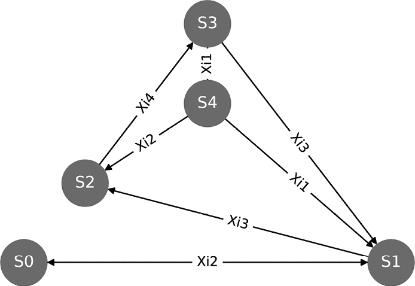

图 6-1：一个简单的有限状态机

看这个图，你可能会感到困惑；毕竟，我刚才说过有四个转换，但这里有九条边（*S*[0] 和 *S*[1] 之间以及 *S*[3] 和 *S*[4] 之间的双向边算作两条）。这是因为相同的输入可能在多个转换中使用。图 6-1 中的输入 Ξ[3] 和 Ξ[2] 就是这种情况的例子：Ξ[2] 被用来在 *S*[0] 和 *S*[1] 之间转换，也在 *S*[4] 和 *S*[2] 之间转换，而 Ξ[3] 可以用来从 *S*[3] 转换到 *S*[1]，或者从 *S*[1] 转换到 *S*[2]。把输入 Ξ[2] 想象成一个动作，比如翻动一个特定的开关。根据你当前所处的状态，翻动开关的动作可能会把你带到不同的状态。如果你在 *S*[0] 中翻动开关，你会到达 *S*[1]。如果你在 *S*[4] 中翻动开关，你会到达 *S*[2]。输入没有改变——它仍然是 Ξ[2]——这说明了输入和状态之间的一个重要关系：相同的输入可能会导致到达不同的状态，具体取决于当前的状态。

*有限状态机（FSM）可以是*确定性的*，意味着每个转换都有一个单一的保证结果，或者是*随机的*，意味着输入的结果受随机性影响，并且不保证每次都会产生相同的结果。为了说明这两种类型的有限状态机之间的区别，想象一下捡起一支铅笔。在一个确定性的世界中，试图捡起铅笔总是会成功——或者在有限状态机的术语中，就是转换到你拥有铅笔的状态。而在一个随机的世界中，捡起铅笔可能会有一定的失败概率 0 < *p* < 1。如果你未能捡起铅笔，你将进入与成功时不同的状态。也许你把铅笔掉到地板上，现在你处于那个状态。这是一个非常简单的例子，但关键是随机有限状态机允许随机性影响结果。这对于概括复杂交互的描述非常有用，因为你不需要理解背后的机制，你只需要衡量可能结果的统计分布，就能近似同样的现象。

你会经常看到在同一个有限状态机（FSM）中混合使用确定性和随机输入。例如，在图 6-1 中的 FSM 中，Ξ[4]是确定性的。如果你处于*S*[2]状态，输入Ξ[4]会保证将你转换到*S*[3]状态，没有其他可能的结果。另一方面，Ξ[1]是随机的：如果你处于*S*[4]状态并选择了动作Ξ[1]，你可能会到达*S*[1]或*S*[3]。如果没有给出这些结果的概率，通常认为它是均匀随机的。如果给出了概率，则使用概率分布在加权随机选择函数中进行选择。NetworkX 有用于标记边的参数，这在显示概率时很有用，或者正如我在这里做的那样，显示转换名称。你可以在附带的 Jupyter notebook 中看到这些代码的示例。关于使用 FSM 的更详细示例，我强烈推荐查看 Wolfram Alpha。

现在你对 FSM 结构有了更好的理解，我们继续探讨如何利用它，借助一种名为随机游走的算法宝石。随机游走允许我们反复为 FSM 选择随机输入，以基于我们定义的规则自动化这些选择的模拟。

### 网络建模与随机游走

用数学术语来说，*随机游走*是一系列在系统内随机选择的步骤（或转换），在经过若干步之后会导致一个随机的最终状态。我喜欢用游客在陌生城市中漫游的比喻。他们可能会走上一段街道，决定转左，再走几个街区，然后决定转身回头。按照定义，这些游走是无规律且不可预测的。随机游走模型的不同版本已经被应用于从经济学到神经学的研究课题，现在也用于信息安全！

我们将应用这种方法来建模人们如何相互传递信息并最终利用网络。然后，我们可以利用这些信息来探索如果改变一些参数（例如攻击者接管一个或多个通信线路）时会发生什么，而无需冒着实际干扰网络的风险。在状态机中随机选择一系列转换，经过*n*步（*T*(*n*)）后，系统的状态会根据输入结果更新。随后的决策必须基于新状态，并且在所有状态下并非所有动作都是有效的。从给定状态的有效转换集合用Ξ[(][*S*][)]表示。在每一步中，从Ξ[(][*S*][)]中选择一个转换并将其附加到*T*(*n*)中。我们可以将其表示为：

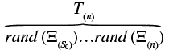

状态被更新后，过程会重复，直到所有*n*步都已完成，或者没有剩余的有效状态转换。最终的*终态*是将*T*(*n*)中定义的随机游走应用于状态机*M* (*M* × *T*(*n*) = *S*(Tn*))的结果。

作为一个具体的例子，假设我们定义一个简单的状态机。想象你站在一个大空房间的中心，这是初始状态，*S*[0]。地板上有一个 7×7 的方格，房间中的位置可以表示为笛卡尔平面上的位置元组（*x*，*y*）（你的位置是*S*[0] = (4, 4)）。你可以每次移动一步，向前、向后、向左或向右。给定一组任意的指令，你可能会站在房间的任何方格上；因此，每个方格可以视为*S*中的一个潜在状态。输入[*前进*，*后退*，*左*，*右*]构成了输入字母表Ξ。图 6-2 中的两个图展示了相同的均匀随机漫步，左边是二维，右边是三维，步数为*n* = 10。

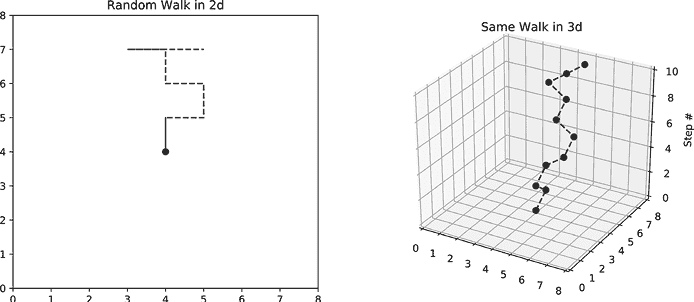

图 6-2：二维和三维随机漫步示例

在 3D 示例中，第三个维度是时间（你在房间里移动时实际上不会开始悬浮）。

与均匀随机漫步不同，其中每个输入的发生概率相等，在*偏置随机漫步*（或仅称为*偏置漫步*）中，一个或多个输入的发生概率可能会高于其他输入。在偏置漫步中，我们将Ξ扩展为一组元组：(*输入*，*概率*)。^(3)在每一步中，我们从列表中选择一个输入，使用加权随机选择函数，也就是遵循我们传递给它的概率分布的函数。我们稍后会构建一个这个的版本，但现在的关键是，偏置漫步允许你将关于行为概率的任何先验信息添加到你的模型中。例如，如果你知道有一个恶意行为者在寻找财务信息，你可能会选择将模型的行为偏向于那些有权限访问该类信息的网络节点。

到目前为止，我们已经介绍了什么是状态机，以及如何使用状态机来模拟一系列的选择。由于随机漫步代表在随机状态机（FSM）中做出的一组选择，你可以重新运行模拟，结果可能会有所不同。即使是偏置随机漫步，每次迭代的结果也许会更加可预测，但仍然不完全相同。如果结果总是相同的，那么系统将是确定性的，分析起来也不会有趣。我们感兴趣的是分析模拟结果之间的差异。重复的随机模拟是蒙特卡洛模拟的定义特征，因此在下一节中，我们将通过定义如何运行每个测试并以有意义的方式收集结果，来完成我们的算法。一旦我们获得了拼图的最后一块，我们将开始使用蒙特卡洛模拟预测社交网络的一些可能的未来状态。

### 蒙特卡洛模拟

我们可以通过简单的掷硬币例子来说明随机游走与蒙特卡洛模拟之间的关系。如果我们掷一枚硬币，并且它落在正面，那么我们从硬币上学到了什么呢？嗯，我们知道在样本量极小（仅为 1）的情况下，硬币会落在正面。那么，你认为这些信息对于预测未来掷硬币结果有多大帮助呢？你能否预测这是公平的硬币还是有陷阱的硬币？答案是不能。这个单一结果并不特别有用——至少现在还不。为了得到更清晰的图景，我们需要将这个测试重复进行较多次，并记录每次的结果。假设我们再掷 99 次硬币，结果每次都落在正面。那么这个结果远远超出了大约 50%的预期，我们就可以断定这枚硬币肯定不公平。

这种情况类似于随机游走和蒙特卡洛模拟之间的关系。蒙特卡洛模拟是*重复采样算法*的一个子集，它通过多次重复测试来收集统计分布。蒙特卡洛模拟与其他重复采样算法的不同之处在于，它通过重复随机游走来简化在状态机中模拟复杂的交互过程。FSM 中的随机游走就像一个单一的测试——一次掷硬币、一场太空漫步或其他某种单一事件。然后，蒙特卡洛算法会在此基础上增加一层，将这个测试重复进行多次，以收集大量样本数据，从而对未来结果做出准确预测。

*蒙特卡洛模拟的一个主要应用是在通用博弈游戏（GGP）领域。GGP 研究者的目标是找到一种通用算法，能够玩任何任意但定义明确的游戏。想想像深蓝（Deep Blue）或更近期的 Alpha Go 这样的系统，但它被设计用来玩国际象棋和*围棋*，以及西洋跳棋、井字游戏、*风险*、*战舰*等其他游戏。这个研究领域也扩展到单人游戏（即所谓的益智游戏），例如*河内塔*。这个自动化系统被称为*玩家*，需要从一系列潜在动作中决定下一个有效的动作。这个过程被称为*目标导向规划*。在具有大量潜在状态的状态机中（例如国际象棋比赛），全面搜索所有选项并得出结论是不可行的。因此，玩家需要一种策略，快速权衡可能的选项，以识别有利的选择。蒙特卡洛模拟是研究人员成功应用的一种方法^(4)，它通过将每场游戏简化为一个有限长度的随机游走，穿越潜在的游戏状态，然后反复测试这些游走的结果，以达到某个目标条件。*

正如我所提到的，安全性往往归结为一个研究人员的进攻知识与另一个研究人员的防守知识之间的对抗。博弈论将这种情况称为零和多人博弈。*零和*指的是一种情况，即为了让一个玩家赢得积分，另一个玩家必须失去等量的积分。简单来说：如果你赢了，我就必须输，反之亦然。国际象棋是零和博弈最著名的例子，但我们也可以在许多对抗性互动中看到这些条件，比如安全性问题。为了绕过你的安全防护，你的安全防护必须被突破。为了阻止我，你的安全控制必须失败。像斯坦福大学这样的学府已经开设博弈论课程，帮助人们分析他们的安全态势。也有研究人员使用博弈论来模拟攻击与防守场景。^(5) 在我看来，将博弈论程序化地应用于信息安全研究是从现有工具自然发展而来的，而开始这一过程的最简单方式就是使用蒙特卡罗仿真。

当然，这种简化可能会带来一些代价。由于选择的随机性质，蒙特卡罗仿真可能会错过明显的有利决策。你可以通过调整随机游走的次数，以及每次随机游走的最大长度，来略微调节模型的准确性。图 6-3 展示了一个蒙特卡罗仿真示例，类似于图 6-2 中的随机游走。

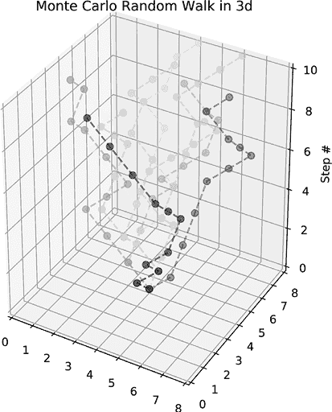

图 6-3：随机游走蒙特卡罗仿真

每次游走的路径会有不同的阴影色调，这样你就可以看出它们的重叠部分。它们都从同一个位置开始，但随后会沿着不可预测的路径走。

我们将要看的蒙特卡罗仿真是一种依赖于 *k* 次长度为 *n* 的随机游走算法，通过状态机 *M* 来获得结果列表 ζ*R*。结果是每次随机游走得到的终态列表：

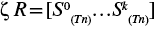

为了方便起见，我还输出了每个随机游走所经过的路径：


选择 *n* 和 *k* 的值既需要领域知识，也需要统计理论和艺术的结合。对于 *n*，我们需要选择一个足够大的值，使得我们的模型能够到达有趣的结果状态，而不会产生大量重复数据。对于有大量潜在转移和状态的状态机，你可能需要选择一个 *n* 值，平衡足够长的路径与合理的程序运行时间。我们的状态机有少量的潜在转移，并且通常会很快到达终态，所以 10 到 20 步之间的小值就足够了。

选择一个好的*k*值与机器中潜在状态的数量密切相关。你希望尽可能多次运行模拟，以收集支持结果主张的统计数据，因此可能的结果越多，你就越希望多次运行模拟。当你将这样的项目投入生产时，可以使用统计方法来计算确切的样本量，以证明实证主张，这叫做*样本量确定*。在这里，我们的模拟只有相对较少的终端状态，并且我们只是尝试证明系统的有效性，因此，进行 10 到 25 次运行就足够进行测试。

## 社交网络模拟

为了回答关于社交网络的研究问题，我们将编写我们自己的*Matrix*式世界，其中模拟的用户将根据我们设定的系统规则生活。我们选择的规则代表了用户在模拟世界中可以做出的所有决策。我所使用的规则基于数据中已经存在的观察结果（例如，哪些用户曾经沟通过，沟通的主题是什么），以及 2009 年发布的某些链接预测理论的简化版本。^(6) *链接预测理论* 试图描述图中的边缘是如何以前形成的，并利用这些信息来预测未来如何形成。

我们设计有限状态机（FSM）规则的目标是准确模拟哪些用户可能会建立连接、解除与其他用户的关联，或将信息传递给他们的连接。接下来，我们将研究如何通过增加一个旨在破坏网络的对立者来增强模拟。这使我们进入了“如果”的模拟领域。如果人力资源部门的负责人突然离开公司会怎么样？如果办公室的路由器崩溃了呢？你会开始看到到处都可以应用模拟的机会。阅读完这个实现后，思考一下我们建立的规则和假设，以及如何通过更加现实的约束和行为来改进模拟。

### 用户互动建模

为了回答“信息从某个节点传播的范围有多远？”这个问题，我们可以模拟一个消息*q*在网络中通过从一个用户传递到另一个用户的方式传播，并确定可能接收到该消息的用户数量。我们将通过为消息生成偏置的随机游走来模拟用户之间的交互，从而让消息在节点间传播。假设，目前为止一次只有一份消息副本存在。（处理消息的多个副本请参见“信息流建模”）可以将其想象为一份预算报告在办公室内流转。每个员工阅读报告后，决定是否将其转发给某个同事。由于报告内容敏感，没人被允许复印，因此任何时刻只有一个人可以持有该信息。通过选择一个起始节点并允许消息按概率传播，我们可以模拟报告可能遵循的路径，然后统计最终接收到报告的独特节点数量。所有游走完成后，接收到信息的独特节点的平均数量可以看作是从选定的起始节点开始，信息可能传播到的节点数量。

对于蒙特卡洛模拟，你必须定义作为系统核心的状态机。社交网络图中的节点（即用户）代表消息在有限状态机（FSM）中可能占据的状态。边表示状态之间的潜在转移（基于用户之间的过去通信）。在我们模拟的开始，这些边将保持静态，我们将检查当前时刻网络的状态。（在本章的概念验证中，边会发生变化，以模拟用户在网络中建立和断开连接。）最后，输入字母表定义了有效的过渡操作，模拟节点之间的交互（例如，一个用户将消息传递给另一个用户）。定义 FSM 的输入和转移类似于定义有效的选择以及选择的时机。针对第一个问题，即节点之间传递的信息，输入字母表是[*发送*, *传递*]，表示用户在接收到信息后可能采取的两种操作。

首先，我们将初始状态*S*[0]定义为持有消息的出度最高的节点，这样模拟就能在不同的模拟中最大程度地覆盖更多独特的节点。稍后，我们会衡量从不同节点开始的效果。在任何给定时刻，持有消息的节点是*u*(*q*)。

在随机游走的每一步中，节点*u*(*q*)会均匀地从两个可能的输入 Ξ = [*发送*, *传递*] 中选择一个。选择输入的先验概率为：

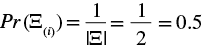

*Pr* (Ξ[*(Send)*])表示*Send*的概率。如果*u*(*q*)选择*Send*，则*q*将被传递给*u*(*q*)的一个均匀随机选择的邻居（我仍然将一个节点的邻居表示为Γ[*(u)*]）。如果选择*Pass*，则*u*(*q*)在该步骤中不做任何操作。

给定邻居*v*被选中的先验概率是：

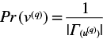

这里 v ∈ Γ(u(q))。简单来说，这意味着每个邻居的起始概率是相等的。一个节点的邻居越多，任何一个邻居接收消息的概率就越低。例如，如果*u*(*q*)有三个邻居（|Γ(u(q))| = 3），那么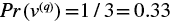。你也可以将其写成条件概率（*Pr*(*A*|*B*)):

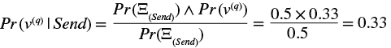

该公式表示，在输入为*Send*的情况下，某个特定邻居接收到消息的概率为 0.33，即 33%。

假设不考虑*Send*为选定输入的情况下，消息传播的总体概率定义在前一个公式的分子中。直观地，你可以将其视为每个事件单独发生的概率。更准确地说，消息传播到给定邻居的独立概率（假设有三个邻居）是：

Pr (u(q) → v ) = Pr ( Ξ( Send ) ∧ v(q) ) = 0.5 × 0.33 = 0.165

在生成随机游走之前，我们需要设置仿真环境，如 Listing 6-1 所示。

```
❶ XI = ["send", None]
❷ k = 10
n = 10
out_deg = G.out_degree()
valkey_sorted = sorted(out_deg, key=lambda x: (x[1], x[0]))
❸ S0 = valkey_sorted[-1][0]
```

Listing 6-1：蒙特卡洛仿真初始化代码

该代码依赖于图*G*已使用 Listings 5-2 和 5-4 中的方法进行填充。假设图*G*已经填充完成，我们从输入字母表`XI`开始，其中*Send*使用`None`表示 ❶，仿真次数`k` ❷，以及每次仿真的步数`n`。为了设置起始状态`S0` ❸，我们选择出度最高的节点。

延续 Listing 6-1，Listing 6-2 展示了一个确定性的、均匀随机的消息传递蒙特卡洛仿真算法实现。

```
from random import choice
❶ R = []
❷ for i in range(k):
  ❸ message_at = S0
    Tn = []
  ❹ for j in range(n):
        if choice(XI) is not None:
          ❺ gamma_uq = list(nx.neighbors(G, message_at))
          ❻ if len(gamma_uq) > 1:
                vq = choice(gamma_uq)
                Tn.append((message_at, vq))
                message_at = vq
            elif len(gamma_uq) == 1:
 vq = gamma_uq[0]
                Tn.append((message_at, vq))
                message_at = vq
          ❼ else:
                conc = "Message terminated at node %s in %d steps"
                print( conc % (message_at, len(Tn)))
                break
  ❽ R.append((message_at, Tn))
tot = 0
❾ for end, path in R:
    uniq = unique(path)
    tot = len(uniq) - 1
❿ print(S0, (tot / len(R)) / (len(G.nodes.keys()) - 1))
```

Listing 6-2：确定性消息传递蒙特卡洛仿真

首先，我们初始化结果列表`R` ❶，然后使用嵌套的`for`循环 24 执行`k`次随机游走，每次游走最多执行`n`步。

每次游走从节点`S0` ❸开始。在每一步，我们收集当前选定节点的邻居 ❺。如果只有一个邻居，则自动选择该邻居。然而，如果存在多个邻居 ❻，我们使用`choice`函数从中均匀地随机选择一个邻居，然后更新`message_at`变量。如果消息最终到达一个没有出度的节点 ❼，我们将该节点记录为结果，并用`break`结束游走。在每次游走结束时，我们将终止节点`Tn`添加到结果列表 ❽。

我们将可能的*信息流距离*（或*IFD*）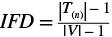总结为每条路径中独特节点的平均数量（不考虑起始节点）❾，然后通过`G`中的节点总数（同样不考虑起始节点）❿来标准化 IFD，并将其输出到屏幕上。`unique`函数简单地将路径减少为仅包含唯一条目的列表。（你可以在本章补充材料的*MonteCarloSimulations.ipynb*笔记本中的第二个单元格中查看我是如何实现的。你也可以选择使用库中某个版本的代码，例如 NumPy 的`unique`。）

如果你运行 Listing 6-2 中的代码几次，你会注意到输出结果不一致。虽然*S*[*0*]是确定性的，但从那里开始的路径是随机的。你可以通过将`vq = choice(gamma_uq)`调用替换为一个确定性选择方法（例如，总是将*q*传递给邻居节点*u*（*q*）的出度最高的节点），使得这个模型完全确定性。这将是模拟已知的特定行为模式的一个好选项。

要实现一个带有偏置行走的模拟，而不是均匀随机行走，你可以向`XI`中添加另一个已经存在的元素。通过这样做，你改变了每个输入变量被选择的相对概率。例如，向列表中添加另一个`"send"`将使*Send*的概率是*Pass*的两倍：

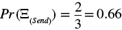

为了对每个输入的概率（偏置）进行更精细的控制，可以将简单的`choice`函数替换为一个可以处理`{action: probability}`定义字典的函数。（请参见本章末尾的概念验证部分以获取示例。）

恭喜你，你已经使用蒙特卡洛模拟定义了第一个预测模型！这是一个简化的模型，我们依赖均匀选择来生成随机性，并使用一些基本动作，如发送和传递，来描述网络中某个任意消息可能发生的情况。尝试从不同的用户那里启动消息，看看它如何影响消息的传递步骤数以及最终的位置。我们称之为*简单模型*，因为我们没有包含有关网络历史、消息内容或用户偏好的任何具体信息。我们假设每个节点都有相同的概率将任何消息发送给它能联系到的任何其他节点。虽然像这样的简化假设使代码更容易编写和解释，但它们以牺牲准确性为代价。在下一节中，我们将扩展模型，加入更多关于消息和用户的细节，以更准确地预测我们已经观察到的数据流在网络中的可能流动。

### 基于主题的影响建模

为了回答“哪些节点受到其他节点的影响？”这个问题，我们将扩展第五章中基于话题的影响调查。回想一下，我们之前通过测量用户与包含相同话题的其他消息的互动，使用超链接引导话题搜索算法（HITS）来衡量每个用户对某一话题的潜在兴趣。如果我们将当前模型以某个特定消息话题（如环境）为基础进行重新构建，我们可以将中心节点和权威信息融入到我们的状态机模型中，从而控制信息交换的概率。在这种情况下，我们将使用用户的 HITS 分数来确定消息被转发的概率，这个概率是基于消息内容的，而不是简单地假设所有消息对于所有用户的转发概率都是相同的。

以这种方式建模消息传播假设用户更有可能转发他们之前已转发过的类似消息。已经转发过涉及特定话题的帖子用户，比没有转发过的用户拥有更高的该话题权威分数，这意味着他们更有可能收到关于该话题的消息。如果你考虑一下在社交网络上看到的内容，你可能会发现人们分享和重新分享的信息中有一个相当常见的主题（这是你可能想稍后挑战的假设之一）。有些人选择分享商业新闻；有些人分享艺术和娱乐；还有些人分享安全相关的内容。

让我们更新之前的实现，比较不同消息类型（*qx*）的传播方式，这样我们就可以检查不同用户的兴趣，并预测他们未来最有可能转发哪些消息。如果你在为这个网络设计病毒性消息攻击，分析不同的话题并选择传播最远的那个是有意义的。从防御的角度来看，你可以反向分析这条消息，并追踪恶意消息的可能来源。我们将保持用户之间的影响力定义不变（也就是说，用户转发一条消息时，受到了该消息的某种程度影响），但我们的节点将选择要转发的消息，而不是使用*发送*操作。操作的方式没有改变，因此我选择保持名称，但重新命名可能有助于在你的模型中保持影响方向的清晰。

清单 6-3 展示了运行基于话题的消息传递蒙特卡洛模拟的代码：

```
import graph_funcs as ext
qx = "environment"
❶ hG = term_subgraph(qx, post_df)
hub_scores, auth_scores = nx.hits(hG, max_iter=1000, tol=0.01)
hub_max = max(hub_scores.values())
S0_i = list(hub_scores.values()).index(hub_max)
❷ S0 = list(hub_scores.keys())[S0_i]

for i in range(k):
    uq = S0
    Tn = []
    for j in range(n):
      ❸ send_msg = ext.hub_send(hub_scores[uq])
        if send_msg:
          ❹ vq = ext.scored_neighbor_select(hG, uq, auth_scores)
            if vq is None:
                conc = "Message terminated at node %s in %d steps"
                print( conc % (uq, len(Tn)))
                break
            else:
                Tn.append((uq, vq))
              ❺ uq = vq
    R.append((uq, Tn))
ended_at = {}
❻ for end, path in R:
    if end in ended_at.keys():
        ended_at[end] += 1
    else:
        ended_at[end] = 1
return (S0, ended_at)
```

清单 6-3：基于话题的消息传递蒙特卡洛模拟

这段代码打印一个元组`(S0, {node: termination_count})`，使用与清单 6-1 中定义的相同的`k`和`n`值，以及基于清单 6-5 中代码的`term_subgraph`函数❶。

在此模拟中，*S*[0] ❷ 是所选主题的最大中心度节点（*S*[0] = *max*(*hub*(*qx*)(*G*)))，而*Pr* (Ξ[*(Send)*]) 是消息类型 *x* 对应的*u*(*q*)的中心度分数：*Pr* (Ξ[*(Send)*]) = *hub**(qx)*。`hub_send`函数（在*graph_funcs.py*文件中定义，随书附带）接受`uq`的中心度分数并返回`uq`是否转发该消息❸。`hub_send`函数基于另一个函数`weighted_choice`，该函数也包含在*graph_funcs.py*文件中。在Ξ中仍然只有两种可能的动作，因此*Pass*的概率等于 1 减去*Send*的概率：*Pr* (Ξ[*(Pass)*]) = 1 – *Pr* (Ξ[*(Send)*])。选择给定邻居的概率是该邻居的归一化权威分数，基于消息类型*qx*（*Pr*(*v*(*qx*)) = *auth*(*qx*)(*v*)）。

如果消息已发送，我们使用`scored_neighbor_select`函数（同样在*graph_funcs.py*文件中定义，并基于`weighted_choice`函数）选择邻居❹。如果返回了邻居，我们将在路径`Tn`中添加发送者和接收者之间的边，并更新消息的位置❺；否则，我们通过`break`语句终止模拟。

如果我们假设一条消息在一个节点结束会产生一些影响，我们可以计算消息结束在特定用户处的次数，并认为具有最高计数的节点最有可能受到给定用户发出的消息类型的影响。这直观地意味着该用户可能最终会在某个时刻转发这条消息。可以说，所有的路都通向家。为了找到这个节点，我们遍历结束位置并统计结果，构建`{node: termination_count}`字典❻，然后打印结果。这构成了蒙特卡洛模拟的一个运行。

我们希望收集多个运行结果并对其进行平均，以获得最准确的预测，因此我们将代码封装在一个名为`run_sim_2`的函数定义中，该函数将接收主题列表和 Mastodon 帖子数据作为参数。（你可以在*MonteCarloSimulation.ipynb*笔记本的第 4 个单元格中看到`run_sim_2`函数。）最后，我们返回源节点和包含消息终止用户的字典，以便我们可以收集结果，直到准备好进行分析。让我们在循环中调用这个新定义的函数来收集合理的样本大小。列表 6-4 展示了如何收集样本并对其进行平均，以便得到最终输出。

```
all_runs = {}
started_at = ""
❶ for run_i in range(0, 10):
  ❷ started_at, results = run_sim(["environment"], post_df)
  ❸ for ks in results:
        if ks in all_runs.keys():
            all_runs[ks] += results[ks]
 else:
            all_runs[ks] = results[ks]
❹ for node in all_runs.keys():
    if node != started_at:
        print("%s influenced %s an average of %.2f times" % (
            started_at, node, all_runs[node]/10
        ))
```

列表 6-4：平均蒙特卡洛模拟结果

以下是对模拟 10 次运行结果的平均值：

```
gutierrezjamie influenced iwatkins an average of 1.80 times
gutierrezjamie influenced hartmanmatthew an average of 2.20 times
gutierrezjamie influenced shannon42 an average of 0.90 times
gutierrezjamie influenced daniel99 an average of 0.70 times
gutierrezjamie influenced garciajames an average of 1.00 times
gutierrezjamie influenced grosslinda an average of 0.30 times
```

使用这些结果，我们可以断言用户`gutierrezjamie`最有可能在环境话题上影响`hartmanmatthew`。这里重要的不是数字本身，而是数字的相对大小，因此你也可能得出结论，`shannon42`比`grosslinda`更可能三倍转发该信息。当然，这只是一次小规模模拟的结果。在像信息流和影响力这样复杂的话题上进行十次模拟显然不足以得出定论。为了增强影响力的论断，通过增加*k*（使用之前提到的统计方法）并对结果进行平均，重复多次模拟。通常，模拟的可能结果越多，应该运行的次数也越多。不过，这里也有收益递减的规律。你需要通过分别更新*k*和*n*的值，来实验不同的模拟次数和时长。

我们将要检查的代码的最后部分是`term_subgraph`函数，它在列表 6-3 中被调用。列表 6-5 中的函数接受一个感兴趣的术语，并搜索底层数据以找到所有相关帖子。

```
def term_subgraph(term, df):
    dat_rows = df[df["text"].str.contains(term)]
    dat_replies = df[df["in_reply_to_id"].isin(dat_rows["id"].values)]
    hG = nx.DiGraph()
    for idx in dat_replies.index:
        row = dat_replies.loc[idx]
        hG.add_edge(row["in_reply_to_screen_name"], row["user_screen_name"])    
    return hG
```

列表 6-5: 基于术语定义子图

该函数接受我们感兴趣的搜索词和我们之前定义的`post_df` `DataFrame`对象。使用`str.contains`函数，我们将数据筛选为仅包含搜索词的文本列的行。然后，我们通过搜索`in_reply_to_id`列中的相关帖子 ID，收集这些帖子的回复，并将其存储在名为`dat_replies`的`DataFrame`中。接下来，我们定义一个`DiGraph`对象来保存生成的图数据，并将其存储在名为`hG`的变量中。我们遍历`dat_replies`的索引列表，对于每个条目，查找与该索引关联的行。我们使用该行的`in_reply_to_screen_name`和`user_screen_name`来创建图中的边，展示在感兴趣话题上的影响方向。一旦循环完成，我们返回已完成的子图。

现在我们已经定义了所有基本代码，我们可以开始改进我们的简单模型。在下一部分，我们将介绍如何通过资源分配使我们的消息行为更加现实。

### 建模信息流

到目前为止，我们的模拟将消息视作一个从节点到节点移动的单一对象，就像一个包裹被送到一个地址一样。但如果消息可以同时传递给多个用户呢？我们的模型对于单个副本的消息是适用的，但如果我们能够找到一种方法，更直观地将信息流动通过网络建模就更好了。想想看：你不会只发送一个生日派对邀请函并要求每个被邀请者把消息传递给列表上的下一个人；你会将多个邀请函发送给你希望出席的人。每个被邀请者可能会邀请另一个人一同前往派对，这样消息就会同时沿着网络进一步传播。为了建模这种类型的信息流动，我们需要改进我们的状态机，使其处理多个副本的消息。

为了模拟多个 *q* 副本可以存在的情况，我们可以将消息传递重新表述为网络中资源流动的问题。通过这样做，我们可以弄清楚两个人在过去交流了多少信息，并用这个作为他们未来可能交流的一个指标。*资源分配 (RA)* 是一个最初提出用来描述机场连接性与旅行能力之间非线性关系的模型。^(7) 我们将使用相同的原理来量化信息交换的质量，随着消息在网络中的传播。

一般来说，RA 描述了两个节点 (*u*, *v*) 之间潜在的资源流动，其中 *v* 不是 *u* 的邻居，但它们通过一个有向路径相连 (*v* ∉ *Γ*[(][*u*][)] ∧ ρ(*u*→*v*) ∈ *E*)。假设有一个有向图中的节点 *u* 拥有一个单位的资源，并将这些资源均匀分配给所有的直接邻居，那么分配给网络中任何成员的资源就是 *u* 和 *v* 之间每条路径末端资源的总和：

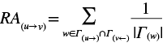

你可以将这个值看作是在节点 *u* 的分配情况下，节点 *v* 的重要性。如果 |ρ(*u*, *v*)| > 2，那么这个过程会对所有节点进行重复，直到有一定数量的资源到达 *v*。因此，你可以将这个值看作是 *u* 通过分配网络提供给 *v* 的资源量。

作为一个具体的例子，假设你正在调查一个犯罪组织，该组织销售从伪造者那里购买的假冒商品。这个假设中的组织老板购买了 100 箱仿冒手袋（即*S*[0]的初始资源量）。然后，他将这些商品分配给他的四个高级手下，每人分得 25 箱。最后，每个手下将他们的 25 箱商品分配给他们街角的商店。如果每个手下与 5 个店面有联系，那么每个店面将收到 5 箱商品。如果犯罪老板失去其中一个店面，损失将仅占他库存的 5%。这是一个非常简化的模型，假设每个节点和路径可以均匀地传递相关资源。然而，实际情况并不总是如此。

从形式上讲，前面公式中的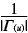部分被称为*流函数*，它模拟了传递或接收资源的特定行为类型。使用这个流函数，资源会均匀地分配给节点*u*的所有邻居，就像假冒商品的箱子一样。NetworkX 内置了几种不同的流函数。遗憾的是，它们并没有为这里定义的有向图实现。当你从研究转向应用时，你通常需要负责扩展代码库，填补像这样的缺失定义。*graph_funcs.py*文件包含了有向资源分配的代码，所以你可以使用它来进行实验。

通过将 HITS 算法的历史分析与资源分配的同步流结合起来，我们可以创建一个有价值的模型，能够基于之前的观察模拟用户行为。你应该能够在这个状态机和蒙特卡洛仿真框架上进行扩展，模拟各种有趣的现象，不仅仅是在社交网络中，而是涵盖整个信息安全主题。

在下一节中，我们将进入一个概念验证应用，它将带我们更深入地了解应用博弈论和蒙特卡洛仿真，通过模拟在我们的社交网络平台上的对抗性对决。准备好迎接挑战吧！

## 概念验证：干扰信息流

本章的最终问题——“可以切断哪些连接以破坏两个节点之间的信息流？”——是一个非常有趣的安全话题。有许多场景，其中破坏信息流向特定节点子集的流动可能会带来灾难性的后果。想象一下，一个医院依赖单一的电力来源。要切断医院的任何电源插座，你只需切断医院与电源之间的唯一连接。这是一个*单点故障*，为了避免这种情况，医院会部署多点连接到电网，并安装备用发电机以应对更严重的中断。许多家庭网络也存在这种设计缺陷。要切断路由器后面所有连接的设备，只需要切断路由器前端的连接。在社交网络中，就像在企业中一样，类似的故障点经常发生。公司常常有被称为“关键员工”^(8)的人，他们承担着其他员工无法胜任的角色，或拥有公司运营所需的深奥知识。关键员工启发了本章概念验证的证明：通过蒙特卡洛模拟来建模在一个发展中的社交网络中破坏信息流动的潜力。

在本章剩余部分，我们将构建一个模拟，假设我们的社交网络正受到一个邪恶外部敌人的攻击。我们将使用一些现代互联网诞生时所用的分析技术，看看破坏我们的社交网络会有多困难。有时候，扮演坏人也挺有趣的！

### 建模一个演化中的网络

在静态网络中，你可以找到一组边，当这些边被移除时，会将两个节点分开（你稍后将看到一种生成该列表的方法），但这并未考虑到网络的适应性，例如将另一名员工进行跨职能培训，让他掌握关键员工的深奥知识，从而缓解单点故障。为了模拟一个演化中的网络，我们将模拟一个两人轮流制的游戏场景，其中一名玩家试图将信息从起始用户传递到终端用户，而其对手则试图阻止该信息到达终端。为了使游戏更复杂，网络本身会在每一轮变化，因为用户会转发其他用户的信息或断开与曾经连接的人的联系。玩家 1 在网络及其所有用户中行动，而玩家 2 则充当对抗力量。玩家 1 的目标是将信息*u*从源节点(*u*A)发送到汇节点(*v*[Ω])。玩家 2 的目标是通过选择性地移除网络中的路径，阻止该信息到达汇节点。游戏分为三个阶段：网络适应、信息移动，最后是对抗性移动（按此顺序）。

如果*q*到达*v*[Ω]，或者当没有路径可以完成传输时，游戏结束：

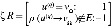

该方程可以转化为方便的辅助函数，见示例 6-6。

```
def check_win(G, uq, omega):
  ❶ if uq != omega and nx.has_path(G, uq, omega):
        return None
  ❷ elif uq == omega:
        return 1
  ❸ elif not nx.has_path(G, uq, omega):
        return -1
```

示例 6-6：检查终止条件

该函数接受图对象、当前持有消息的节点 ID 和目标节点的 ID。如果这两个节点不同且它们之间有路径 ❶，游戏没有结束，因此代码返回`None`（即没有赢家）。如果两个节点不相同且当前节点与目标节点之间没有路径 ❸，则玩家 2 已成功隔离消息，函数返回`-1`。如果这两个 ID 匹配 ❷，则消息已到达目标节点，函数返回`1`。

### 通过网络传递消息

第二个辅助函数`weighted_choice`，如示例 6-7 所示，将用于加权随机选择下一个接收消息的节点。

```
def weighted_choice(scores):
    totals = []
    running_total = 0
  ❶ for w in scores.values():
        running_total += w
        totals.append(running_total)
  ❷ rnd = random() * running_total
    for i in range(len(totals)):
      ❸ if rnd <= totals[i]:
            key = list(scores.keys())[i]
            return key
```

示例 6-7：用于偏向行走的加权随机选择函数

输入参数`scores`是一个字典，格式为`{item: weight}`，为每个可能被选择的项目分配一个权重。 （权重不需要加总为 1；只有值的相对大小才重要。）`totals`列表将实数空间在 0 和权重总和之间分割 (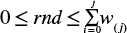)，其分割的大小与所代表项目的权重成正比，通过将每个项目加到`running_total`中，并在每个项目添加后记录运行总和 ❶。所有权重的总和然后会缩放一个随机值 ❷，使其落入某个分区，而该分区决定了选择哪个项目 ❸。权重较大的项目映射到较大的分区，这意味着这些项目更有可能被选择，因此这就是“加权随机选择”。

以一个具体例子为例，输入字典为`{"A":1,"B":2,"C":3}`。在第一次循环执行后，`totals`列表包含`[1,3,6]`，而`running_total`为`6`。随机实数值`rnd`（介于 0 和 1 之间）通过`random`函数选择，然后乘以`running_total` ❷以产生随机选择的权重百分比。随机值`1.0`表示最大权重，在此情况下为：

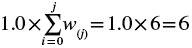

我们可以通过计算分配给键的数轴空间来验证断点是否准确反映我们的输入权重，这个空间称为其*key space*。这些应等于 1 / 6 = 0.166，2 / 6 = 0.333 和 3 / 6 = 0.5，分别对应于键 `A`、`B` 和 `C`。我们通过将键的下选择边界减去其上选择边界来找到键空间。为了选择键 `A`，`rnd` 必须小于或等于大约 0.166（0.166 × 6 = 0.996）。为了选择键 `B`，`rnd` 需要介于 0.166 和 0.5 之间（0.5 × 6 = 3），这意味着键 `B` 的键空间为 (0.5 – 0.166 = 0.333)。我们可以将 `B` 的键空间除以 `A` 的键空间，以获得相对大小比较（0.333 / 0.166 = 2.006），这意味着键 `B` 的键空间是键 `A` 的两倍，正如我们要求的那样。最后，`rnd` 必须大于 0.5 且小于或等于 1.0 才能选择键 `C`。键 `C` 的键空间为 (1 – 0.5 = 0.5)。你可以继续这个键空间的逻辑，证明分配给 `C` 的空间是分配给 `A` 的三倍（0.5 / 0.166 = 3.0），并且是分配给 `B` 的键空间的 1.5 倍（0.5 / 0.333 = 1.5）。希望这有助于说明我们的输入字典中的值如何控制在随机选择过程中创建的键空间的大小。我们将在证明过程中大量依赖 `weighted_choice` 函数，因此花时间详细理解它是值得的。

### 测量信息流量

网络中某些节点之间的连接可能能够承载比其他连接更多的信息。例如，在社交网络中，某些成员可能更有效地传播信息，就像公司中的关键员工一样。在社交网络中，两个节点之间的信息流量并不是简单地可以测量的，它取决于你的研究问题。在我们的模拟游戏中，边的容量是指给定帖子中的字符数（最大 500 个字符，在写作时为止）。

通过向*E*中的边添加一个名为*capacity*的属性，该属性表示在单位时间内通过特定边传输的最大信息量，我们可以使用*最大流，最小割定理*来比较删除不同子集边对网络整体流量和电容的影响。^(9) 我们将在改进玩家 2 时深入了解这个定理，但目前只需知道，它使我们能够模拟一个资源在网络中扩散的过程，而不是像之前看到的那样从一个点移动到另一个点。

现在是时候退后一步，记住这一切对我们来说的重要性了。我们的最终目标是测试敌人破坏网络通信的难易程度。最大流、最小割定理为我们提供了测试两个节点是否仍能通信所需的信息（因为两个节点之间仍然有一条路径）。它还帮助我们确定哪些割对敌人来说更有利或不利，同时为敌人提供了一种快速判断其选项的方法。了解最大流、最小割理论的攻击者，可能比攻击随机通信通道的攻击者更有可能破坏网络。我们将在接下来的游戏中通过实现两个版本的敌人来检验这一假设，并比较他们能造成的破坏。

### 游戏如何运作

这款游戏其实非常简单。玩家 1（白帽）的目标是将消息从网络一侧的节点传送到网络另一侧的节点。为此，他们可以使用整个网络。在每回合中，他们会在网络中移动消息，试图到达接收节点。如果消息成功从源节点传输到接收节点，他们就赢了。虚拟桌子另一边是玩家 2（黑帽）。他们的任务是以任何代价阻止这个消息。在每回合中，他们将选择从网络中删除一条边。玩家 2 赢得胜利的条件是他们成功地切断网络，使得消息无法到达接收节点。

#### 网络演变

社交网络很少有静态的拓扑结构：即使在你尝试测量它们时，链接和成员身份也在不断变化。网络适应阶段通过允许边的创建或删除来模拟拓扑的演变。这意味着新的路径可能会突然打开，旧的路径可能会自行消失。双方玩家都无法完全信任网络按预期运作。我选择将这一部分作为玩家 1 的回合来实现，因为在这种情况下他们是网络管理员。在每回合中，玩家 1 会从输入字母表中选择一个输入动作，针对每个没有持有消息的节点（∀*u*^((¬)^(*q*)^) ∈*V wrs*(Ξ)，其中 *wrs*(Ξ) 是前面定义的加权随机选择函数）。Listing 6-8 显示了加权输入字母表，包括使用 `connect` 和 `disconnect` 来创建和解除边，或者像之前一样选择 `pass`。

```
XI = {
    "connect": 2,
    "disconnect": 1,
    "pass": 2
}
```

Listing 6-8：没有消息的节点的加权输入

`XI`中的权重描述了网络随时间的趋势。这些值创造了一个网络随时间增长的情形，因为`connect`和`pass`的每个单独权重为 40%（2 / 5 = 0.4），合计 80%的选择空间，而`disconnect`只有 20%。如果选择`connect`，节点将与另一个节点建立新边（即它收到来自另一个节点的回复），这意味着我们需要一种方法来选择它们连接的用户。我选择基于*优先连接*来实现这一点，优先连接的概念是，具有更多连接的用户比那些连接较少的用户更可能建立新连接。在我们的网络中，这意味着接收到来自许多其他用户回复的节点（具有较大的外度）更可能收到那些回复许多用户的用户的回复（具有较高的入度）。(即使当前节点不倾向于接收很多回复，它仍然更可能从一个更活跃的用户那里获得回复。)^(10)

严格来说，两个节点（*u*，*v*）的*无向优先连接（UPA）*分数是它们邻居长度的乘积：

UPA( u, v ) = |Γ( u )| × |Γ( v )|

为了考虑我们网络图的方向性，我们可以使用*有向优先连接（DPA）*定义*u*的出邻居和*v*的入邻居：

DPA( u → v ) = |Γ( u → )| × |Γ( v ←)|

Listing 6-9 展示了加权随机连接函数，该函数将从 Listing 6-12 中显示的玩家 1 逻辑中调用。

```
def wrs_connect(G, u):
    scores = {}
  ❶ for i in range(len(G.nodes.keys())):
        v = list(G.nodes.keys())[i]
        if v == u:
            continue
      ❷ dpa_score = G.out_degree(u) * G.in_degree(v)      
        scores[v] = dpa_score
  ❸ return weighted_choice(scores) # Previously defined choice function
```

Listing 6-9: 一个有向优先连接加权随机选择

函数`wrs_connect`以图和连接的节点作为输入，并遍历图中的每个 ID ❶来计算输入节点与每个其他节点之间的 DPA 分数 ❷（跳过输入节点使用`continue`）。`weighted_choice`函数使用`scores`字典来选择一个节点进行连接 ❸：

vconn = wrs( [ DPA( u( ¬ q ), ¬ u )] ∀ ¬ u ∈ V )

如果选择`disconnect`，用户将与发送给他们最少信息的另一个用户断开联系（根据前面定义的容量来衡量）。`G.in_edges`中每个边的`capacity`属性在加权随机选择过程中用于选择一个邻居来断开联系。Listing 6-10 展示了计算给定节点的容量和选择权重的代码。

```
def ncap_weights(G, u):
    u_in = list(G.in_edges(u, data=True))
    n_capacity = {}
  ❶ for v,u,d in u_in:
        n_capacity[v] = d["capacity"]
  ❷ Q = 1 + max([itm[1] for itm in list(n_capacity.items())])
  ❸ n_weight = {k: (Q - n_capacity[k]) for k in n_capacity.keys()}
    return (n_capacity, n_weight)
```

Listing 6-10: 节点的容量加权

我们首先遍历节点的入边集合中的邻居数据 ❶，并将其收集到`n_capacity`字典中。如果我们没有提前将多个边合并（通过使用`DiGraph`而不是`MultiDiGraph`），我们需要先对每个入边的容量进行求和：

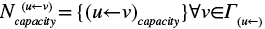

我们在选择过程中对容量较低的 *N*[*capacity*] 边赋予更高的权重，然后通过从修正值 *Q* = 1 + *max*(*N*[*capacity*] ) ❷ 中减去这些容量来反转容量，从而得到加权公式  ❸。

例如，如果 *max*(*N*[*capacity*]) = 10 ⇔ *Q* = 11，则带有 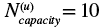 的边将获得权重 `1` (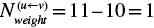)，而带有 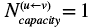 的边将获得权重 `10` (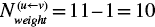)。

我们将为给定节点设置返回值为元组 (*N*[*capacity*] , *N*[*weight*] )。`n_capacity` 和 `n_weight` 都是以邻接节点 ID 为键的字典。Listing 6-11 中的 `wrs_disconnect` 函数使用 `n_weight` 字典来选择最不重要的邻居来断开与 `u` 的连接。

```
def wrs_disconnect(G, u):
  ❶ u_in = list(G.in_edges(u))
    if len(u_in) < 1:
        return None
  ❷ caps, scores = ncap_weights(G, u)
    if scores is not None:
      ❸ return ext.weighted_choice(scores)
```

Listing 6-11: 一个加权随机断开函数

如果节点 `u` 没有入边（意味着它没有入度邻居可以断开连接），则函数返回 `None` ❶，结果与 `pass` 相同。如果找到多个边，则使用 Listing 6-10 中的函数 ❷ 计算所有入邻居的容量分数。此函数返回的键是要断开连接的邻居 (*v*[*disconn*] = *wrs*(*N*[*weight*] )) ❸。然后，在 Listing 6-12 中的玩家 1 逻辑中，边 (*u*^((¬)^(*q*)^) ← *v*[*disconn*] ) 被移除。

#### 移动信息

在网络演化阶段之后，游戏进入信息传递阶段，此时唯一可能的输入是`send`。如果当前持有信息的节点 *u*(*q*) 与目标节点 *v*[Ω] 之间存在边，则信息沿着该边传递，玩家 1 获得胜利。否则，计算 *u*(*q*) 和 *v*[Ω] 之间的路径，并将信息沿这些路径中的一条传递到下一个节点，路径的选择是随机的。

Listing 6-12 中的代码处理玩家 1 的回合，包括网络适应和信息传递两个阶段。函数 `player_one_turn` 以图、持有信息的节点和目标节点作为参数，返回接收信息的节点以及图的更新状态。

```
def player_one_turn(G, uq, omega):
  ❶ if G.has_edge(uq, omega):
        return (omega, G)
    caps = [d["capacity"] for u,v,d in G.edges(data=True)]
  ❷ avg_cap = sum(caps) / len(caps)

  ❸ for u in list(G.nodes.keys()):
        if u == uq:
            try:
              ❹ paths = list(nx.all_shortest_paths(G, u, omega))
            except nx.exception.NetworkXNoPath:
                return (uq, G)
          ❺ path = choice(paths)
            pass_to = path[1]
        else:
          ❻ act = ext.weighted_choice(XI)
          ❼ if act == "pass":
                continue
          ❽ elif act == "connect":
                v_conn = wrs_connect(G, u)
                G.add_edge(u, v_conn, capacity=avg_cap)
          ❾ else:
                v_disconn = wrs_disconnect(G, u)
                if v_disconn is None:
                    continue
                G.remove_edge(v_disconn, u)
  ❿ return (pass_to, G)
```

Listing 6-12: 定义玩家 1 回合逻辑

如果 `uq` 和目标节点 `omega` 之间存在边 ❶，我们将信息传递给 `omega`。这将结束回合（并且游戏结束），玩家 1 获胜！否则，我们计算图的平均容量 ❷，该值将作为网络适应过程中添加的新边的容量。这使得平均值在每一回合之间变化，取决于上一个网络适应阶段是否删除了边（如果有的话）。

为了执行网络适应和消息传递，我们对图中的每个节点进行遍历 ❸。对于*u*（*q*），我们尝试找到它与目标节点之间的有效路径 ❹（消息传递阶段）。如果此尝试失败并出现`nx.exception.NetworkXNoPath`，函数将返回，回合结束，玩家 2 获胜，因为消息无法到达目标节点。否则，我们使用`choice`函数随机选择一条路径 ❺，并将消息传递到路径中的第一个节点。

对于所有其他节点，我们使用加权随机函数和 Listing 6-8 ❻中定义的`XI`字典选择一个操作。如果选择`pass`，代码会使用`continue`关键字跳到下一个节点 ❼。如果返回`connect`，我们使用 Listing 6-9 中的`wrs_connect`函数形成一条新边 ❽。否则，选择了`disconnect`，我们使用 Listing 6-11 中的`wrs_disconnect`函数从图中移除一条边 ❾。最后，我们返回接收节点和更新后的图 ❿。

#### 破坏网络

然后玩家 2 选择从网络中移除一条边，试图破坏消息的流动。蒙特卡罗仿真的一个优点是能够随着时间的推移比较不同的策略。为了说明这一点，我们将比较两种策略，看看玩家 2 如何实现他们的目标。在第一种策略中（Listing 6-13），玩家 2 从*E*中均匀地随机选择一条边：

```
def player_two_random(G):
  ❶ e = choice(list(G.edges()))
  ❷ G.remove_edge(*e)
  ❸ return G
```

Listing 6-13: 玩家 2 的随机实现

这将作为一个良好的基准，因为它最接近真正的随机行走。代码随机选择 ❶，然后移除 ❷ 图中的一条边；接着我们返回更新后的图 ❸。

这种策略的结果可以看作是一个零控制，就好像对手只是盲目地开始移除东西，完全不知道他们所影响的内容。在我们使用这种简单策略演示仿真并收集基准网络性能之后，我们将查看第二种策略，其中玩家 2 根据网络的流动信息选择其操作，以造成最大的破坏。

一旦玩家 2 完成选择破坏的边，回合就结束了。如果没有玩家获胜，下一回合开始，游戏继续进行，直到其中一位玩家成功达到目标。

在下一节中，我们将介绍如何选择起始节点和结束节点。在更大的网络中（比如你在实际应用中可能会遇到的网络），拥有自动化任务的方法，例如寻找数据，将在运行你的第一个仿真之前节省大量的手动探索时间。

### 游戏目标

在将所有这些内容结合成一个功能完整的仿真之前，让我们先来看一下`shortest_path_scores`辅助函数，见 Listing 6-14，它返回所有不直接连接的节点对的平均路径长度列表。

```
def shortest_path_scores(G):
    pairs = []
  ❶ for u, v in nx.non_edges(G):
        if u == v:
            continue
        if not nx.has_path(G, u, v):
            continue
 ❷ uv_paths = list(nx.all_shortest_paths(G, u, v))
      ❸ avg_len = sum([len(p) for p in uv_paths]) / len(uv_paths)
        pairs.append(((u, v), len(uv_paths), avg_len))
    sorted_scores = sorted(
        pairs,
      ❹ key=lambda kv: (kv[2], kv[1], kv[0]),
        reverse=True
    )
    return sorted_scores
```

Listing 6-14: 为加权选择创建平均长度得分

`for`循环❶调用 NetworkX 函数`nx.non_edges`获取所有可能的节点组合，这些组合没有直接连接的边，检查两个节点 *u* 和 *v* 是否不同，并且检查它们之间是否存在一条或多条路径。如果任一条件不满足，我们将跳过该节点对，使用`continue`关键字。否则，我们使用`nx.all_shortest_paths`函数列出游戏开始时源节点和汇节点之间的所有潜在路径❷，然后计算平均路径长度❸，并将其附加到`pairs`列表中。一旦所有节点对处理完成，我们根据平均路径长度对结果进行降序排序，若平均路径长度相同，则根据节点 *u* 的 ID 排序，最后按节点 *v* 的 ID 排序❹。

在清单 6-15 中，我们将这些得分与`weighted_choice`函数结合，随机选择源节点和汇节点对，同时偏向那些具有更多路径或较长路径的节点对，而不是具有较少或较短路径的节点对。我选择这种方法是为了确保模拟有足够的路线来保持游戏的趣味性。你可以根据模拟中的其他参数选择源节点和汇节点，甚至可以扩展模拟，测试所有可能的源节点和汇节点组合。

### 游戏模拟

最后，到了将所有这些函数结合成一个完整游戏的时候，代码见清单 6-15。我们将运行游戏模拟 25 次，每次使用一对不同的源节点和汇节点。每次运行将生成 *k* 次随机游走，每次游走代表玩家 1 和玩家 2 之间的一局游戏，并统计每个玩家的获胜次数。*k* 次得分的平均值即为该轮游戏的总得分。使用不同的源节点和汇节点，而不是一遍又一遍地运行相同的场景，将使我们对整个网络有更好的理解。代码清单 6-15 假设你已经构建了图（使用类似清单 6-3 的代码）。

```
path_scores = shortest_path_scores(G)
k = 10 # Number of random walks
n = 10 # Number of steps in each walk
❶ path_weights = {(p[0][0], p[0][1]): p[2] for p in path_scores}
played = []
for r in range(25): # Run the simulation 25 times
  ❷ selected = weighted_choice(path_weights)
    while selected in played:
        selected = weighted_choice(path_weights) # Avoid repeated selection
 played.append(selected)    # Track new pair
    alpha = selected[0]        # Source node
    omega = selected[1]        # Sink node
    game_res = []              # Results from k random walks
  ❸ for i in range(k):         # Perform k random walk simulations
        newG = G.copy()        # Copy the graph to maintain the original state
        now_at = alpha
      ❹ for j in range(n):     # Perform at most n steps in each walk
          ❺ w = check_win(newG, now_at, omega)
            if w is not None:
                game_res.append(w)
                break
          ❻ now_at, newG = player_one_turn(newG, now_at, omega)
          ❼ if not check_win(newG, now_at, omega):
              ❽ newG = player_two_random(newG)
  ❾ tally = sum(game_res)
    avg = tally / len(game_res)
    print("\t Average %.4f" % avg)
```

清单 6-15：主要的游戏模拟函数

在运行模拟组之前，我们首先使用`shortest_path_scores`（清单 6-14）❶获取节点之间的平均路径长度列表，接着将返回的平均路径长度转换为`path_weights`列表（即平均路径长度较长的节点获得更高的权重），然后选择一对节点（该对节点即为`path_weights`返回的键值）❷。如果该对节点及其相关路径已经在模拟中使用过（由`played`列表追踪），我们将选择另一个节点对。从选中的节点对及路径中，我们确定源节点和汇节点，即`alpha`和`omega`。

一旦我们找到了有效的源节点和汇节点对，就执行*k*次随机游走。`for`循环的每次迭代❸构成一次完整的游戏，在图的副本(`newG`)上进行，以保持比赛之间的原始拓扑结构。每次*n*步随机游走❹为两位玩家生成最多*n*轮，并在每个阶段 57 检查胜利条件。每局游戏的结果都会添加到`game_res`中。这个循环的每次迭代都算作游戏中的一次完整回合。

一旦*k*次游走完成，我们通过求和`game_res`来统计胜利（玩家 1 胜利得 1 分，玩家 2 胜利得–1 分）❾，然后取平均值`tally`作为*k*次游走的总得分。

运行 Listing 6-15 中的代码以查看 25 次模拟的结果。每次测试（最外层的`for`循环）产生的平均值可能会有很大差异，正如你从这个代码片段中可以看到的那样：

```
Average 0.7600
Average 0.2800
Average 0.6000
Average 0.1200
Average -0.5200
Average 0.6800
Average -0.7600
`--snip--`
Average 0.9200
Average 0.8400
Average -0.3600
Average 0.5200
Average 0.6000
Average 0.2000
Average -0.5200
```

`0.0`的得分意味着两位玩家赢得的比赛数相同。正数平均值表示玩家 1 比玩家 2 赢得更多。这个值越接近`+1`，比赛就越倾向于玩家 1。相反，当得分低于 0 时，情况则相反。`-1`的平均得分表示玩家 2 赢得了每一场比赛。

最后一步是总结所有测试的结果。我们可以通过将各个平均值相加，然后除以测试的数量来完成。我们将其称为*总体均值*。总体均值的好处有两个。首先，它将所有测试总结为一个可以解读的数字，而不是一系列测试结果。其次，总体均值应该相对稳定，相较于个别运行结果中观察到的值。如果我们重新运行代码，可能会得到不同的单个测试结果。不过，总体均值应该保持相对稳定。

在分析模型三次时，我得到了总体平均值 0.2160、0.2320 和 0.1808。当然，在统计学中我们会处理不确定性，因此一个更好的总体均值衡量标准是我们认为实际总体均值将落在的数字范围，这取决于我们期望的置信度水平。为了做到这一点，我们使用`scipy.stats.t.interval`函数，传入我们的模拟结果和期望的置信区间（称为*alpha 参数*），并将其作为浮动值传入。结果是一个元组，包含我们预测实际总体均值会落在其中的上下限。例如，我运行了 6,250 次模拟，我可以有 95%的信心认为当前配置下的模拟的真实总体均值将在 0.1078 和 0.2225 之间，这意味着玩家 1 有轻微的优势。当前设计似乎稍微偏向防守方，因为其增长和对手缺乏智能。

现在我们已经为我们的网络建立了基准性能，让我们看看是否可以通过让对手观察网络并选择要切断的路线来提高他们的机会。然后我们可以比较两个模拟的结果（以预测的总体均值为标准），看看我们的改变是否显著影响了玩家 2 破坏网络的机会。

### 对玩家 2 的改进

让我们看看如果给玩家 2 更多的智能会发生什么。在这个版本中，玩家 2 使用更新后的图和当前消息位置，移除一条对消息位置和目标之间路径重要的边（这对人类玩家来说是一个相对直观的策略）。

为了将这一策略编码化，玩家 2 将使用最大流最小割定理。最大流最小割分析是现代 TCP/IP 网络创建的推动力之一。该协议将消息分割成称为 *数据包* 的小块，然后根据响应时间和承载能力为不同部分的传输选择不同的路线。该设计的基本思想是，必须拆除网络中很大一部分，才能将两个远程节点相互断开。需要移除的节点列表被称为 *割集*。我们模拟游戏中的对手将利用割集信息执行保罗·巴兰（Paul Baran）在其研究中关注的那种攻击（[`www.rand.org/about/history/baran.list.html`](https://www.rand.org/about/history/baran.list.html)）——也就是选择性地针对并移除通信通道以破坏网络。

简而言之，最大流最小割定理告诉我们两个关键信息。首先，最大流部分描述了在两个节点（*u*，*v*）之间所有路径上可以流动的最大资源量。最小割部分描述了从网络中移除最少数量的边，以切断两个节点之间的所有路径。更正式地说：给定两个节点（*u*，*v*），最大流最小割定理告诉你需要移除的最少边集合的总容量，以使得两个节点之间没有路径（割集）。一个割是一个图的划分 *G*（*S*，*T*），使得 *u* 在 *S* 中，*v* 在 *T* 中。

最大流最小割定理中定义的 *容量约束* 限制了每条边在每个模拟步骤中的流量，流量必须小于或等于该边的最大容量：

（u → v）流量 ≤ （u → v）容量

定理的 *保守约束* 说明流入每个节点的量等于流出该节点的量：

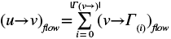

再次简化来说：每个节点都会发送它收到的所有资源；它不会为自己保留任何资源。这个约束适用于所有节点，除了 *u*α 和 *v*[Ω]。就我们的模拟而言，这意味着任何转发消息的用户都能接收到该帖子包含的所有信息，而如果有人从他们那里转发消息，那个人也会接收到相同的信息量。源节点和汇节点由于它们在流中的位置，需特殊处理。源节点就像一个水龙头，能够向网络添加一定量的资源，因此没有资源流入源节点，只有流出。在我们的图中，这与一个可能收到大量转发但不太可能自己转发的人（具有高出度和低入度的节点）同义。相反，汇节点就像一个海绵，吸收从网络传来的信息而不传递出去。任何到达汇节点的信息都会被吸收。

列表 6-16 中的 `nx.minimum_cut` 函数使用最大流最小割定理来确定两个节点（*u*，*v*）之间的最小割值，以及由割产生的分割，结果以元组（`cut_value`，`partition`）的形式返回。`partition` 是一个元组（`reachable`，`unreachable`）表示从 *u* 可以到达和不能到达的节点。回顾之前的定义，割将图划分为两个部分，如果移除 `cutset`，这两个节点就会在不同的、断开的组件中。

```
def player_two_turn(G, uq, omega):
  ❶ cut_value, partition = nx.minimum_cut(G, uq, omega)
    reachable, unreachable = partition
    cutset = set()
  ❷ for u, nbrs in ((n, G[n]) for n in reachable):
        cutset.update((u, v) for v in nbrs if v in unreachable)
  ❸ if len(cutset) >= 2:
        cut = choice(list(cutset))
        G.remove_edge(*cut)
  ❹ elif len(cutset) == 1:
        cut = list(cutset)[0]
        G.remove_edge(*cut)
    return G
```

列表 6-16：通过增加智能来更新玩家 2

我们首先计算 *u*（*q*）和 *v*[Ω] 之间的 `cutset` ❶。为了将 `partition` 元组转换为 `cutset`，我们遍历 `reachable` 集合中的邻居对 ❷。对于集合中的每个节点，我们遍历它们在图中的所有邻居。如果它们的邻居在 `unreachable` 集合中找到，那么 `reachable` 集合中的节点与 `unreachable` 集合中的节点之间的边属于 `cutset`。当我们通过这种方式处理完所有节点后，就能得到所有断开两个节点所需的边。如果集合中只有一条边，玩家 2 选择这条边进行移除 ❹。否则，玩家 2 从 `cutset` 中随机选择一条边，同样依赖于 `choice` 函数 ❸。

这个输出展示了重新运行模拟并采用新策略对玩家 2 的结果：

```
Average -0.9200
Average -1.0000
Average -1.0000
Average -1.0000
Average -0.6000
Average -0.8400
Average -1.0000
`--snip--`
Average -1.0000
Average -0.9200
Average -0.9200
Average -1.0000
Average -1.0000
Average -0.3600
Average -0.9200
```

在分析了修改后的玩家 2 在 6,250 次模拟中的表现后，我得到的总体均值为 -0.8144，并且可以 95% 确信，修改后的玩家 2 在模拟中的总体均值介于 -0.9484 和 -0.6803 之间。当你在自己的机器上运行代码时，可能会看到稍有不同的结果（记住，我们在处理很多随机性），但整体趋势应该保持一致。看起来这个简单的策略将模拟的结果大大倾向于玩家 2，即使网络增长仍然倾向于玩家 1。

我们总是有可能错误地声称我们改善了玩家 2 的获胜机会。由于我们无法模拟每个可能的结果，我们永远无法百分之百确定我们的总体均值是否准确。那么，我们如何确保这个结果不是某种随机偶然现象呢？事实是，我们只能在一定范围内确保这一点。我们必须接受我们无法确切知道的现实。这就提出了一个重要问题：我们需要思考我们愿意接受多少风险，以避免得出错误结论。当你在实际环境中进行分析时，错误结论的后果往往是现实的。你应该选择一个与风险相匹配的置信水平，以防万一你错了。风险越高，你需要的置信度就应该越高。一旦你选择了期望的置信水平，你可以通过从 100 减去所需的置信水平来将其转换为 t 检验的阈值。例如，我希望非常确定我们的结果不是偶然的，因此我将置信水平设置为 99%，这意味着我们愿意接受 1%的概率得出错误结论。我们现在可以使用这个阈值来检验我们是否提高了玩家 2 的获胜机会。

更正式地，我们可以陈述假设，改变玩家 2 的逻辑显著降低了总体均值（*h*[1] = μ[0] > μ[1]）。那么零假设是，随机样本的均值将等于或小于修改后的玩家均值（*h*[1] = μ[0] ≥ μ[1]）。我们可以使用一种叫做*双样本 t 检验*的统计方法来比较这组结果的总体均值。这个 t 检验量化了两个样本的算术均值之间的差异。一个常见的应用是检验一个新过程或治疗方法是否优于现有的过程或治疗方法。在我们的案例中，我们将使用它来确定两个总体均值之间的差异是否足够显著，以声称我们为玩家 2 所做的改变确实提高了他们的获胜机会。

该概念验证使用了`scipy.stats.ttest_ind`函数来运行此检验。结果是一个具有名为`pvalue`属性的对象。p 值量化了在零假设为真的情况下，观察到与测试值相同或更极端值的概率。我们将这个数字与 1%的阈值进行比较，以确定我们是否对结果有足够的信心来拒绝零假设。在这种情况下，我已运行了十几次测试，每次玩家 2 的得分显著低于支持我们 99%确定的结论，即我们对玩家 2 的改变提高了他们的获胜机会。我们可以如图 6-4 所示，直观地展示两个概率分布，以了解这一变化带来了多大的影响。

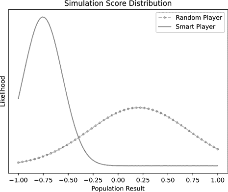

图 6-4：比较概率分布

这个图表展示了随机玩家模型和改进后的玩家 2 模型的所有可能测试结果的概率。浅灰色虚线代表随机玩家模型的基准表现。深灰色实线则是改进后的玩家模型的表现。大峰值和急剧下降出现在–0.8 附近，表明改进后的玩家表现更为一致，并且可以以较大差距赢得大部分比赛。事实上，使用改进后的玩家 2 代码，任何一系列测试的平均值达到–0.25 的可能性极低。我们可以将其解释为，选择性地移除边缘有潜力大幅干扰该网络中的信息流动。

你可以使用命令`python mcs_multiplayer.py`在书籍附带材料的*第六章*目录中运行概念验证。每次执行时，代码会运行一组针对两种玩家类型的模拟，然后计算人口均值并通过单尾 t 检验进行比较。它将输出一行，告诉我们是否可以拒绝原假设，最后它会生成一个类似于图 6-4 的图表进行分析。作为一个练习，尝试调整`XI`中的权重，更多地偏向新连接，看看这是否会影响结果并对玩家 1 有利。你还能对玩家 1 做哪些其他改动，以提高他们防御网络的能力？

## 总结

本章介绍的概念——蒙特卡罗模拟、有限状态机、随机游走、加权选择——结合过去三章的基础图论，构成了一套极其灵活的工具，远远超出了社交网络分析的范畴。通过为模拟定义有限状态机、分析重复模拟以确定特定结果的可能性、修改模拟以获得不同的结果和见解，以及建模图形如何随着时间演变，你可以通过模拟环境潜在变化来定量评估安全风险。

我在群体流动动态中经常应用蒙特卡罗模拟。预测人们如何在区域内移动，他们会在哪里聚集，以及他们如何响应不同类型的障碍物而改变这些移动方式，是规划有效物理安全控制的关键之一。我们将在第三部分的艺术画廊问题中进一步讨论这一点，但你或许已经有了一些如何利用我们所学内容来解决这一任务的想法。

然而，这仅仅是蒙特卡罗模拟的开始。通过改变每个模拟步骤中的逻辑，你可以模拟网络中的各种独特行为。设计一个合适的模拟既是一门艺术，也是一门科学，所以不要害怕拓展思路，探索一些大胆的模拟想法。

为了帮助你继续前进，本章附带的 Jupyter 笔记本包含了用于显示二维和三维随机游走的代码，你可以使用这些代码来可视化你开发的模拟。通常，看到结果的可视化分布可以带来有趣的发现（例如，路径总是穿过某一个点）。通过将随机游走显示代码与补充材料中的动画代码结合，你甚至可以创建模拟的视频。

在你探索相关文献时，你会发现关于如何在蒙特卡罗模拟中选择“最佳移动”的众多高级讨论。正如你在概念验证中所看到的，参数的微小变化可能对结果产生重大影响。了解每个模型变化的原因和影响非常重要，这样你才能制定更准确的评估，并对你模拟的网络得出有根据的结论。

你可以通过斯坦福大学的在线课程了解更多关于 GGP 理论和算法的内容（[`ggp.stanford.edu`](http://ggp.stanford.edu)）。这些模型中的几个非常适用于各种信息安全任务，如风险分析、预算规划和事件响应。如果你想了解更多关于信息流的内容，可以查看研究论文《小组中的冲突与分裂的信息流模型》，^(11) 该文描述了一个用于测量信息流并检测社交网络中情绪不平衡的正式过程。**
