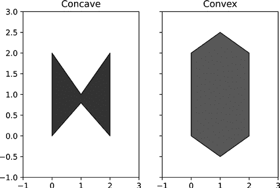
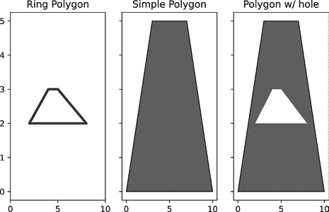
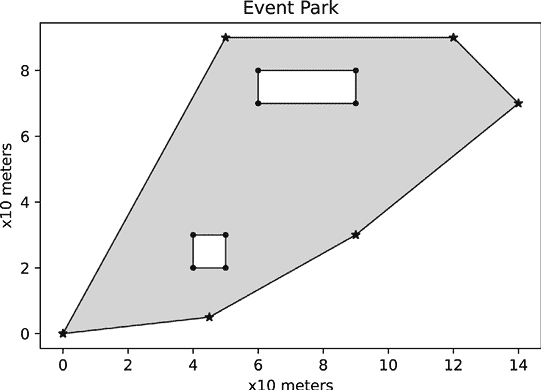
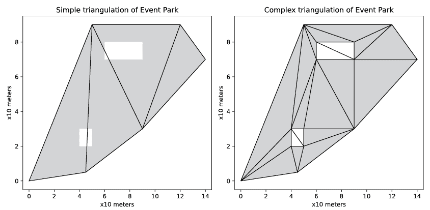
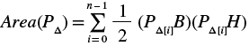
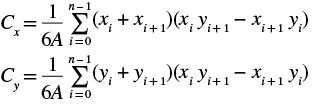
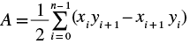
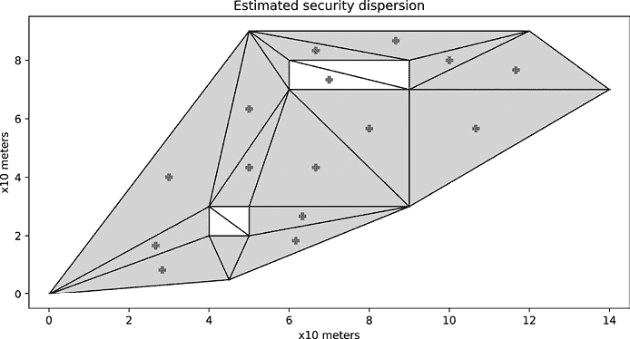

# 使用几何改善安全实践


当你想到现代安全性时，几何学可能不会立刻浮现在脑海里。然而，利用计算机算法解决经典的几何问题，如线段长度、形状面积和物体交集，可以帮助你分析空间关系，而这些分析反过来可以指导你的安全实践。这个领域被称为*计算几何*。

在接下来的几章中，我们将把几何应用于将数据与物理世界联系起来的问题，并利用几何规则。在第八章中，我们将利用形状的特性，通过你可能听说过的过程——位置三角测量，使用手机数据和 MapBox 地图定位一个假想的犯罪嫌疑人。然后，在第九章中，我们将戴上资源规划的帽子，使用我最喜欢的几何算法之一——Voronoi 镶嵌，来看紧急服务（如消防站）的分布。最后，在第十章中，我们将探索使用几何进行人脸识别。

但首先，我们需要更一般地讲解计算几何。我们将从本章开始，通过 Python 示例讲解基本理论。我们将使用一个叫做 Shapely 的 Python 库，它可以抽象化很多常见的任务，例如定义形状和检查两个形状是否在任何点上接触或重叠。

## 描述形状

几何是数学中相对直观的领域之一。如果我给你展示一个形状并让你标出它是正方形、三角形还是圆形，你甚至不需要刻意思考形状的定义；你会“知道”对应的名称。将几何直觉编码到计算机中却并非易事。因此，在我们讨论如何分析形状之前，我们需要一种方式，将形状描述为程序能够理解的数据格式。接下来，我们需要为每种我们希望能够识别的形状定义一系列数学检查。幸运的是，大部分繁重的工作已经通过 Python 的 Shapely 库为我们完成了。在本节中，我们将使用 Shapely 定义一些我们需要理解的关键形状，以便后续的项目能够理解。我们将从形状的基本构建块开始：点和线。从这里开始，我们可以构建越来越复杂的形状表示，组合形状形成 2D 模型，并查看 Shapely 提供的一些有趣分析功能。

### 点与线

我们从一个空的宇宙开始，表示为二维笛卡尔平面。这个世界中只有两种类型的对象：一个点和一个线段。*点*表示平面上的一个精确位置，使用常见的 (*x*, *y*) 坐标系统。*线段*是无限长线的一部分；它由两个不同的端点界定，并包含线段之间的每个点。理论上，在两个端点之间有无限多个点；但在实际应用中， distinct points 的数量受到平台或编程语言浮动点精度的限制。Python 支持 17 位小数精度，这对于我们的任务来说已经足够了。

在 Shapely 中，你通过告诉库点的 *x* 和 *y* 值来定义一个点，参见 Listing 7-1。

```
from shapely.geometry import Point
point_a = Point(2.0, 4.0)
point_b = Point(0.0, 0.0)
```

Listing 7-1: 在 Shapely 中定义一个点

这段代码在我们的笛卡尔平面上创建了两个 `Point` 对象：`point_a` 在 (2.0, 4.0) 处，`point_b` 在 (0.0, 0.0) 处。

要创建一个线段，我们可以调用 Shapely 中的 `LineString` 类，并传入起始点 (*x*, *y*) 和终点 (*x*, *y*)。我们可以传入元组或 `Point` 对象。Listing 7-2 显示了如何从头开始或从之前创建的两个点创建一个 `LineString` 对象。

```
from shapely.geometry import LineString
line = LineString([(2.0, 4.0), (0.0, 0.0)])
line2 = LineString([point_a, point_b])
```

Listing 7-2: 从 `Point` 对象创建 `LineString`

在 Listing 7-2 中定义的两个线段从库的角度来看是相同的，因此你可以自由选择适合你代码的语法。如果你打算在整个应用中重复使用相同的点，首先创建 `Point` 对象会使代码更简洁、易懂。

点和线段是形状的最基本构建块。让我们来看一下如何将它们组合起来定义更复杂的形状，称为多边形。

### 多边形

通过以各种配置组合点和线段，我们可以构建多边形，如正方形、星形，甚至是非常接近的圆形近似图形。在几何学中，多边形 *P* 是由有限数量的点构成的平面图形，这些点通过线段连接，形成一个闭合链条。*闭合链条*意味着序列中的第一个点和最后一个点始终相同，因此这组线段总是通过连接回原点来结束。构建 *P* 时使用的线段可以互换地称为 *边*、*侧* 或 *面*。沿着 *P* 边界的点通常称为该形状的 *顶点*（单数 *顶点*）。Listing 7-3 显示了如何使用 Shapely 库创建一个多边形。

```
from shapely.geometry import Polygon
poly_a = Polygon([(0, 0), (10, 0), (7, 5), (3, 5)])
poly_b = Polygon([point_a, point_b, (10, 0), point_a])
```

Listing 7-3: 从 `Point` 对象创建 `Polygon`

首先，我们导入`Polygon`类，它允许我们像在列表 7-2 中定义`LineString`对象一样定义多边形。与`Polygon`类的主要区别在于，Shapely 会在没有显式定义形状边界的情况下自动创建一个额外的点来闭合形状（如`poly_a`）。第二个对象`poly_b`展示了如何在定义多边形周长时混合`Point`对象和硬编码值。它还演示了如何通过包含一个最终与初始点相匹配的点来显式闭合多边形。记住：尽可能显式定义比隐式定义更好。

*规则*多边形是所有角度和边长都相等的多边形。任何不满足此条件的多边形（大多数多边形）都被认为是*不规则*的。*简单*多边形只有一个边界，且在任何点都不会与自身相交。*复杂*多边形有一个或多个相交的边，使得形状扭曲自我。许多关于简单多边形的规则不适用于复杂多边形，因此我们将避免使用它们。

多边形可以是非常复杂的形状，具有数百条边和顶点，但所有可能的多边形都可以分为两类之一。*凸*多边形是指所有内部角度都小于 180 度的多边形。多边形的所有顶点都将指向外部，远离形状的内部。*凹*多边形是指任何不符合凸形定义的多边形。一个简单的经验法则是，如果你可以仅使用左转逆时针绕着整个形状的周长行走，那么形状是凸的。如果你必须右转才能到达下一个顶点，那么形状是凹的。图 7-1 展示了它们的区别。



图 7-1：凹形与凸形的区别

左边的形状有两个点，周长向内部移动（1, 1）和（0.8, 1）。如果你逆时针沿着这个形状的周长行走，当你到达这两个点中的任何一个时，你都必须右转。右边的形状没有任何指向内部的顶点。你确实可以逆时针绕着整个形状行走，只需要左转，所以它是凸形的。

类似于你可以通过组合点和线段来创建基本形状，你也可以通过组合简单多边形和一种叫做*线环*多边形（简称*环*或*孔*）来在内部创建空洞。图 7-2 展示了将简单多边形与环组合的结果。



图 7-2：比较多边形类型

一个环形多边形*rph*（图 7-2 中的最左侧图像）是一个空心形状，没有实心区域。它完全由沿其定义边界的点和线段组成，即图像中的粗黑色轮廓线。

一个简单的多边形*P*（中图）是一个实心平面区域，包含其边界内的所有点以及沿着定义周长的所有点，如中间的黑色形状所示。

带孔的多边形（右图）将左侧的环形多边形与中间的简单多边形结合起来。为了将两者合并，我们从*P*的点集中减去环形中的点（*P*2 = *P*1 ∉ *rph*）。落在环形内的点会被排除在整体多边形的几何形状之外。

列表 7-4 展示了我们如何在图中构建三种不同类别的多边形。

```
from shapely.geometry import Polygon, LinearRing
poly_a = Polygon([(0, 0), (10, 0), (7, 5), (3, 5)])
poly_hole = LinearRing([(2, 2), (8, 2), (5, 3), (4, 3)])
rbus_b_holed = Polygon(poly_a, [poly_hole])
```

列表 7-4：在 Shapely 中创建带孔的多边形

我们定义了主要的多边形`poly_a`，与列表 7-3 中一样，使用其边界顶点来定义。为了定义环形多边形`poly_hole`，我们创建了一个`LinearRing`对象，通过传入定义其周长的顶点。我们通过将这两种形状合并成一个新的`Polygon`对象来创建最终的多边形。`poly_hole`对象被放入一个列表中，以支持在同一个多边形中使用多个孔。孔不能相互交叉，也不能与多边形的外部交叉；它们只能在一个点上相接。Shapely 并不会阻止你创建无效的特征，但当你尝试对其进行操作时，它会抛出异常。

通过结合单个点、线段、多边形和孔，我们可以开始以足够的精度模拟周围的物理空间，以便它能发挥作用。我们可以使用复杂的多边形来定义空间的边界，并在复杂多边形内部使用孔来表示由于障碍物人们无法通行的区域。我们将在“场景：规划音乐会的安全”部分深入讨论这一点，但首先，让我们先了解一些最佳实践，帮助您的代码顺利运行。

### 顶点顺序

当你创建一个形状时，顶点的顺序很重要。标准做法是按逆时针顺序（在 Shapely 中为`ccw`）传递顶点，围绕形状的周长。确保点按已知顺序排列可以大大加快一些操作的计算速度——例如检查某个点是否在形状内或多边形是否为凸形。Shapely 提供了一些函数来帮助处理这一点。在列表 7-5 中，我们检查一个对象是否为逆时针方向，如果不是，则转换它的点顺序，使其变为逆时针方向。

```
ring = LinearRing([(0,0), (1,1), (1,0)])
print(ring.is_ccw)
new_ring = LinearRing(list(ring.coords)[::-1])
print(new_ring.is_ccw)
```

列表 7-5：检查和修复顶点顺序

我们从创建一个`LinearRing`对象开始。你可以在一张坐标纸上验证，顶点的顺序从左到右，形成一个顺时针方向的三角形描述。我们可以使用 Shapely 通过打印布尔属性`is_ccw`来检查顶点是否按逆时针顺序排列，结果将为`False`。为了将列表转换为逆时针顺序，我们使用 Python 的列表反转（`[::-1]`），它会将坐标按相反顺序添加到一个新列表中，然后将重新排序后的列表赋给一个名为`new_ring`的新`LinearRing`对象。打印`new_ring`上的`is_ccw`将返回`True`，确认新的顺序确实是逆时针的。

现在你可以以计算机能够处理的方式描述形状，让我们来看看一些常见的操作，这些操作在几何分析安全问题时会反复使用。在下一节中，我们将介绍一些有用的算法，用于计算面积、确定重叠和交集，以及计算不规则形状的周长。

## 场景：为音乐会规划安全措施

了解计算几何理论的最佳方法是将其应用于场景中，所以假设你被要求为在当地公园举办的音乐会规划安全措施。你需要决定为活动分配多少安保人员，并确定他们的站位，同时向活动协调员提供安全的参会人数建议。图 7-3 展示了从上空视角看公园的布局。



图 7-3：带孔的公园多边形

多边形的轮廓代表了围绕公园的高围栏。公园底部附近的小方块是一个信息亭，参会者无法进入，因此我们从可用区域中减去它。公园顶部附近的矩形是舞台，参会者也无法进入，因此我们也将其移除。剩余的灰色区域是参会者可以进入的公园部分。我们将计算这个区域的面积，然后用结果来确定可以安全舒适地参加活动的人数。

### 计算安全容纳人数限制

要计算像公园这样的不规则形状的面积，首先我们必须将该形状分解为一组简单形状，如三角形，然后将每个组合形状的面积相加。将形状分解的过程称为*镶嵌*，涉及使用一个或多个几何形状，称为*瓦片*，在平面上进行覆盖，要求没有重叠和空隙。图 7-4 展示了两种为公园空间进行三角形镶嵌的方法。



图 7-4：简单多边形的三角形镶嵌和带孔多边形

左边的简单方法对基础多边形进行镶嵌，并暂时忽略孔洞。你可以计算出这个形状的总面积，然后减去两个限制区域的面积。我在早期使用手动方法做过这种计算。右边的方法则使用 Shapely 的 `triangulate` 函数对包含孔洞的复杂形状进行镶嵌（不要与我们在第八章中将要讨论的位置三角测量混淆）。我们可以通过将每个灰色三角形的 *n* 个面积相加来找到总面积：



这里，*P*[Δ[][*i*][]]*B* 和 *P*[Δ[][*i*][]]*H* 分别是第 *i* 个三角形的底边和高度测量值，位于 *P*[Δ] 中。

幸运的是，我们不需要担心手动镶嵌，只为找出复杂形状的面积。Shapely 库会在你创建形状时自动处理所有这些工作。列表 7-6 展示了如何创建公园形状并计算参与者可用的面积。

```
park = Polygon([(0,0), (4.5,0.5), (9,3), (14,7), (12,9), (5,9)])
info_booth = LinearRing([(4,2), (5,2), (5,3), (4,3)])
stage = LinearRing([(6,7), (9,7), (9,8), (6,8)])
event_shape = Polygon(list(park.exterior.coords), [info_booth, stage])
event_area = event_shape.area*10
print (f"{event_area} m² usable area")
```

列表 7-6：创建复杂的公园形状并计算面积

我们首先创建最外层的 `Polygon` 来表示活动空间的边界。然后，我们为舞台和信息亭分别创建一个 `LinearRing` 对象。接下来，我们创建一个表示场地可用空间形状的复杂多边形。该库为多边形提供了一个 `area` 属性，该属性会尊重我们在创建时传入的任何孔洞。

当你处理像公园这样非常大的形状时，常见的做法是应用一个缩放因子——也就是说，将整个形状按某个已知常数缩小，以使得数字更易于处理。在图 7-3 和 7-4 中，1 个单位等于 10 米，或者说缩放因子是 0.1，因此通过将 `event_shape.area` 乘以 10，可以调整结果以适应地图的缩放。`print` 语句的输出是：

```
635.00 m² usable area
```

现在我们知道了可用面积，可以计算出能够安全容纳的参与者人数。列表 7-7 展示了如何通过将可用面积除以每个参与者所需的空间来转换为参与者人数。

```
import math
safe_capacity = int(math.floor(event_area / 0.75)) # 8ft sq
max_capacity = int(math.floor(event_area / 0.37))  # 4ft sq
print("Comfortable capacity: %d people" % safe_capacity)
print("Maximum safe capacity: %d people" % max_capacity)
```

列表 7-7：基于可用面积计算容纳能力

多年前，我为包含坐席和站立的与会者混合的活动定下了每人 0.75 平方米（大约 8 平方英尺）的标准面积。（后来我发现其他人对类似场景得出了大致相同的数字。）我们将`event_area`乘以 0.75，以找到可以舒适容纳与会者的最大人数，同时为一些人留出坐在毯子上的空间，而另一些人可以四处走动。为了找到一个区域内可以安全站立的最大人数，我们可以将间距大致减半，变为每人 0.37 平方米，约为 4 平方英尺。现在，我们可以将活动区域乘以 0.37，来找出场地的“站立区”最大容量`max_capacity`。这种紧密的间距就像站在一个拥挤的走廊里：你几乎要碰到其他人了，但还没有。代码的输出应为：

```
Comfortable capacity: 846 people
Maximum safe capacity: 1716 people
```

为了估算活动所需的安保人员数量，我们将 846 名与会者四舍五入为 900 人。根据经验，我使用一个 60:1 的比例，即每 60 名与会者配备 1 名安保人员，在这种情况下，900 / 60 = 15。 但是，900 人包括所有将进入活动区域的人，包括安保人员，所以在实际情况下，你实际上需要反向四舍五入，建议的最大舒适容量为 830 名与会者，同时根据更高的观众数量（900 人）估算安保人员数量。

在将这个公式应用于一些实际场地之后，你会发现你的舒适人数通常低于消防部门安全规范推荐的人数，这是故意的。消防部门的数字关注的是在紧急情况下能安全疏散的人数，与人群安保或舒适性无关。你还会发现活动协调员通常会选择你建议的数字和消防部门允许的数字之间的某个数值（因此在规划人员时向上四舍五入，而在推荐与会人数时向下四舍五入）。

### 确定安保人员的部署位置

现在我们知道了需要多少安保人员，接下来我们来确定他们的部署位置。我们将使用镶嵌技术，并结合另一种常见的操作——*质心定位*，它找到一个与多边形所有边界顶点等距的点（即*质心*）。一个凸形物体的质心总是位于物体区域内部。一个凹形物体的质心可能位于物体外部，但由于我们首先进行的是镶嵌，每个生成的三角形都是凸形的，因此质心将位于边界内。

*P*的质心 = [(*x*0, *y*0)，(*x*1, *y*1)，……，(*xn –* 1, *yn* – 1)] 是点 C(*x*，*y*)，其中



*A*是*P*的有符号面积，通过*鞋带算法*计算得出：



*P*中的点需要按顺序沿着周边排列才能使该方法有效。如果顶点的顺序是逆时针方向，面积将为负值；否则，面积为正值。在任一情况下，*C*[(][*x,y*][)]的绝对值都是正确的。我们可以利用这一信息，将每个警卫部署在还未分配警卫的、面积最大的三角形的质心位置。清单 7-8 展示了如何实现这一点。

```
from shapely.ops import triangulate
tess = triangulate(event_shape)
area_dict = {i: tess[i].area for i in range(len(tess))}
sort_areas = sorted(area_dict.items(), key=lambda x: x[1], reverse=True)
sec_points = [tess[t[0]].centroid.coords[0] for t in sort_areas[:15]]
```

清单 7-8: 基于质心的人员分布算法

我们首先通过`triangulate`函数从清单 7-6 中三角化`event_shape`对象。结果是一个由`Polygon`对象组成的集合，表示构成该形状的三角形（记作*P*[Δ]）。然后，我们使用字典推导式创建一个可排序的三角形索引和对应面积的列表。我们使用`sorted`函数按值对`area_dict`进行排序。使用降序排列（`reverse=True`）使我们能够使用前 15 个三角形质心的坐标来估算安保人员的合理分布。图 7-5 展示了结果的部署计划。



图 7-5: 安保人员的质心部署

三角剖分与图 7-4 中展示的完全相同。灰色的加号符号是每个选定三角形的质心。正如你所看到的，这个相对基础的算法结果相当不错。无论你站在场地的哪个位置，都不会离一个或多个安保站点太远。使用这种分散方法可以确保安保人员能够快速响应，无论他们被需要在哪里。唯一的问题是它将一名警卫安排到了场地中不可用的区域，正好是舞台上！我们将在“改进警卫部署”部分中看到如何改进这个算法，并修正该警卫的位置，但现在，我们先来看一个有用的分析工具，它可以帮助我们规划和安排步巡。

### 估算警卫巡逻时间

周边长度是估算巡逻时间的一个好方法。为了简化假设，我们假设巡逻事件周边的守卫不计入我们已经布置的 15 名守卫。在这种情况下，我们可以安排一个未布置的守卫位置进行巡逻，但这会改变场地内安保与观众的比例（尽管只有轻微的变化）。暂时假设我们在周边有另外两名守卫，他们不计入参与人数。一个守卫位于一个固定点（例如，主入口处），另一个则在周边巡逻。为了安全，巡逻守卫应该与固定守卫有安排好的签到时间。问题是，正常的巡逻应该需要多长时间。这时周边长度就派上了用场。对于一个多边形，其周边长度是构成该图形的各条线段长度之和。为了计算绕公园走一圈需要多长时间，我们可以将外周边的长度除以守卫的预估步行速度。列表 7-9 展示了如何计算这个时间。

```
perimeter_len = event_shape.exterior.length*10
walk_time = perimeter_len / (1.1 * 60)
print ("%.2f meter perimeter" % perimeter_len)
print ("%.2f minutes" % walk_time)
```

列表 7-9：计算守卫巡逻时间

复杂形状如`event_shape`对象的外部`length`属性是一个`LinearRing`对象，代表该图形最外层的各个点。为了得到围栏周围的实际距离，我们将`LinearRing`的长度属性乘以缩放因子。接下来，我们需要估算守卫的步速。根据维基百科，行人过马路的平均步速大约是每秒 1.4 米（m/s），即每小时约 3.1 英里（mph）。我们可以假设我们的安保人员走得稍慢一点（毕竟他们在巡逻时要观察周围的情况）。我们将步速设为每秒 1.1 米，即每小时约 2.5 英里。为了得到每分钟的步速，我们将每秒的步速乘以 60。然后，我们通过时间 = 距离 / 步速来计算`walk_time`。从列表 7-9 得到的结果应该是：

```
362.03 meter perimeter
5.49 minutes
```

我们可以利用这些信息来支持一种政策，即巡逻守卫应每 5.49 分钟在周边的某个特定地点签到。实际上，如果你没有在大约 6 分钟内收到签到，你应该联系巡逻人员。

### 改进守卫布置

现在让我们通过添加*共址*的概念来改进我们在列表 7-8 中的警卫部署，*共址*指的是两个物体在笛卡尔平面上占据相同的空间。通过共址，我们能够判断警卫是否被部署在场地的不可用区域。Shapely 提供了多个函数——如`contains`、`intersects`、`overlaps`、`touches`和`distance`——来检查几何对象之间的关系。每个函数都需要第二个对象作为参数，并回答其名称所暗示的问题。例如，`contains`用来检查 B 对象是否完全位于 A 对象的内部。如果 B 的任何点位于 A 的外部，而 B 的至少一个点位于 A 的内部，则结果为`True`。还有一个逆向关系函数`within`，即`A.contains(B) = B.within(A)`。Shapely 的文档中对每个函数的解释都非常详细。

列表 7-10 扩展了列表 7-8 中的代码，使其不再将警卫站设置在舞台上。

```
finalized = []
❶ s2 = Polygon(stage)
i2 = Polygon(info_booth)
for guard_station in sec_points:
    i = 0
    new_station = Point(guard_station)
    while any([
      ❷ (s2.contains(new_station)),
        (i2.contains(new_station))
    ]):
        `--snip--`
      ❸ new_area = sort_areas[15+i]
        i += 1
        poss = tess[new_area[0]].centroid.coords[0]
        if poss not in sec_points:
            new_station = poss
            new_station = Point(poss)
    finalized.append(list(new_station.coords[0]))
```

列表 7-10：重新分配警卫站到可用区域

由于`LinearRing`对象是空心的，它们实际上不包含其边界内的点，因此我们需要首先将`stage`和`info_booth`对象更改为`Polygon`对象❶。多边形被假定为填充的，因此在调用`contains`函数时，位于其边界内的任何点都将返回`True`❷。通过遍历`sec_list`中的每一组坐标，我们可以将其转换为`Points`并检查舞台或信息亭的多边形是否包含该点。如果是，我们可以将其重新分配到其他未被占用的三角形上，从第 16 个三角形（索引 15）开始，并将警卫站分配到新的位置❸。我们重复这个过程，直到找到一个可用的三角形为止。图 7-6 展示了运行改进代码后的结果。


图 7-6：改进后的安全部署结果

当你将图 7-6 与图 7-5 进行对比时，可以看到警卫站从舞台区域移动到了信息亭下方的空旷区域。这个改变将所有 15 名警卫都安排到了场地的可用区域，确保优先将警卫安排到最大的未保护区域。结合这些信息与出席建议和预定的巡逻路线，我们已经为事件的安全计划打下了良好的基础。我们可以根据对场地、活动及其他相关因素的了解，进一步细化这个基本建议，形成一个完整的安全策略，策略中应包括更多安全人员的应急计划和观众溢出区域。

## 总结

计算几何学在安全中的力量在于能够将物理特征编码为机器可以理解的形式：如点、线段和多边形。一旦你对特征进行了编码，你就可以计算面积、质心位置、周长和对象关系来分析安全问题。你已经看到如何使用几何学描述像公园这样的物理空间，并有效地安排安全人员。你还看到了如何将形状结合起来，通过孔对象制作更复杂的表示。最后，我们还介绍了一些在实际应用中常见的其他常用函数。Shapely 库中还有许多其他可用函数，但本章中展示的这些代表了在几何问题分析中你需要执行的大部分工作。

正如你将在接下来的三章中看到的，我们可以将这些操作结合起来，创造出其他非常有趣的安全工具。仍然有很多研究等待你深入探索。几何学在安全行业中有着悠久的历史，许多研究问题可以重新表述，使得你能够将几何算法应用于其中。当然，这些内容甚至没有涉及到密码学中的几何学，而那是一个独立的领域，需要一本书来深入探讨。如果你对这个领域感兴趣，可以查阅论文《几何密码学：通过角平分法进行身份识别》。^(1) 如果你对如何将几何算法应用于隐私问题感兴趣，你可以研究隐私保护计算几何学领域。

让我们继续探索计算几何学，这次的主题是地理位置数据。在下一章中，我们将结合 MapBox 和 OpenCellID 数据，三角定位一个手机的位置。
