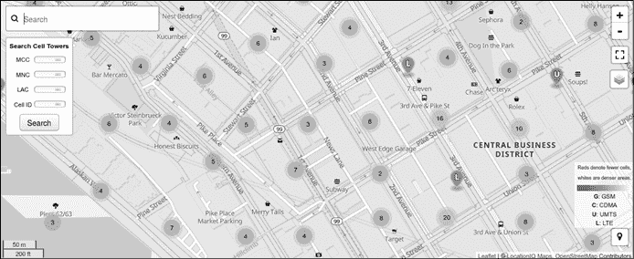
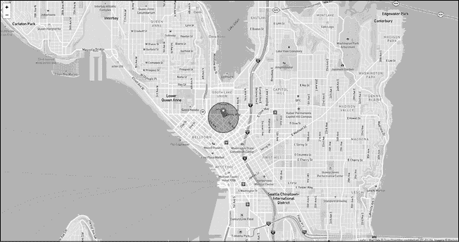
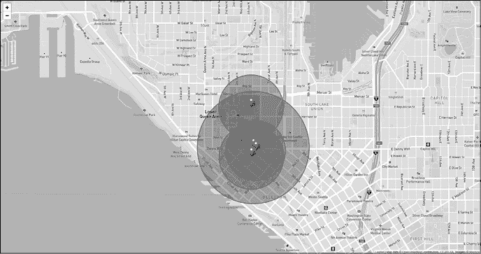
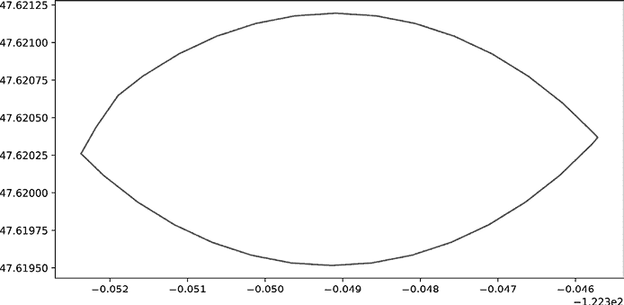
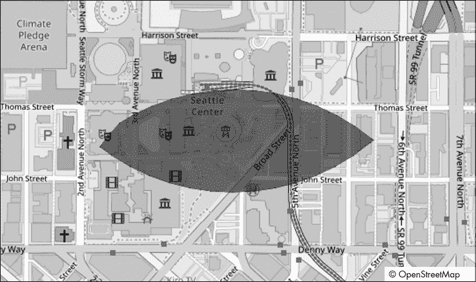
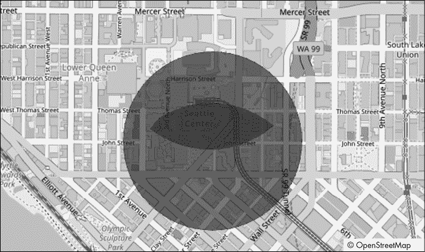

# 使用数字信息跟踪人们在物理空间中的位置


让我们继续讨论计算几何学的话题，谈到一个有点争议的话题：使用数字信息跟踪人们在物理空间中的位置。全球的执法机构依赖手机追踪来定位和逮捕嫌疑人，这一点已不再是秘密。你可能认为这需要他们获得搜查令，然后从无线提供商那里传唤 GPS 记录，但事实并非总是如此，也不一定严格需要。利用公开可用的信息和基本的几何学，你可以（在某种程度上）准确地定位一部没有 GPS 的手机所在的区域。只要它连接到蜂窝或无线网络，你就有很好的机会定位它。

三角定位过程依赖于知道几个信息：首先，位置——即物理的纬度和经度——以及大量无线网络枢纽的配置，如手机基站；其次，这些设备的大致广播范围；最后，手机在一组网络中可以通信的信号强度。这看起来可能是一个难题，但前两个问题已经由 Unwired Labs 的团队通过他们的 OpenCellID 服务为我们解决了。第三个问题将在下一节中讨论。

一旦你对数据有了基本的了解，我们将探讨一些围绕这个项目的伦理影响。之后，我们将更详细地介绍 OpenCellID API，并讨论如何找到单个基站的位置，使用 API 的地理位置求解器获取地址和准确度估计。

## 收集蜂窝网络数据

有几种方法可以从手机获取网络信息，从复杂的硬件攻击到使用内置工具的非常简单的方法。硬件攻击超出了本书的范围，但你可以查看《*Android 安全内部*》^(1) 和《*Android 黑客手册*》^(2)，了解关于 Android 手机的这方面内容，也可以参考《*iOS 黑客手册*》^(3)，了解 Apple 设备的相关信息。

我们需要的网络接口数据看起来非常简单且无害，以至于几乎每个在手机、平板电脑、笔记本电脑或其他支持无线功能的设备上运行的应用程序都能获取到。如果你像我一样，可能会对哪些应用程序可以直接访问你的位置信息非常挑剔，但几乎每个应用程序都有内置的理由要求网络访问：更新。不幸的是，这意味着这些应用程序可以看到哪些网络是可见的，以及它们的信号强度。多亏了 OpenCellID API，这些信息几乎和拥有 GPS 信号一样有效，因此，如果你能利用这些应用程序的某个漏洞，可能会用它来获取这些信息。

作为一个实验，你可以尝试手动扫描你所在区域的蜂窝网络。大多数手机都有一个手动选择蜂窝网络的选项。要找到它，可以搜索手机的型号和“手动选择蜂窝网络”。市面上还有很多应用可以执行此任务，尽管我更倾向于在下载任何应用之前，先使用手机自带的功能。可以说，从这一点开始，我假设你通过某种合法方式能够访问设备的网络数据。我还提供了在开发示例时使用的样本数据，供你跟随学习，即使你无法访问任何设备也可以进行操作。

在本项目中，我们将使用 OpenCellID API，所以我们先花一点时间来讨论它是什么，以及为什么我们要使用它。OpenCellID API 是一项在线服务，存储有关蜂窝网络基站的信息，如位置和网络类型。*基站*通常是人们所说的蜂窝网络的塔。技术上来说，我们通常看到的塔部分仅仅承载了物理天线；实际操作的大脑部分位于天线底部附近。这些箱子包含了必要的硬件和应用逻辑，用来将设备的流量引导到蜂窝网络提供商的网络基础设施并最终到达目的地。在本章的其余部分，我将交替使用*基站*和*塔*这两个术语。

在创建一个免费账户并获得 API 访问令牌后，你将通过在线 REST API 获取数据。除了跟踪物理位置之外，关于蜂窝网络的公开可访问数据在许多安全应用中也很有用。如果你在任何大城市地区旅行，手机会在塔与塔之间切换。通常这一过程会在后台无缝进行，且发生的原因有几个。蜂窝网络通过让设备连接到其他塔来不断平衡流量。当一个基站检测到其流量过载时，它可能会指示新的设备连接到其他塔来处理流量。你的手机还会被编程为优先连接信号最强的基站，然后根据需要依次连接其他信号较弱的基站。你的设备在这些塔之间的切换可能会为攻击者提供机会，诱使他们通过一个足够强的信号，在附近的设备之间插入一个恶意的基站（他们控制应用逻辑的基站）。当你的手机在不同塔之间切换时，公开的已知基站列表能够帮助确保你的设备只连接到合法的蜂窝网络。OpenCellID 的在线门户([`opencellid.org`](https://opencellid.org)) 也可以用来探索某一地理区域内可用的数据。

图 8-1 显示了来自 OpenCellID 的西雅图派克市场区域的地图，数据来自其在线门户。



图 8-1：派克市场区域的网络数据

这张图片是从 OpenCellID 主网站获取的。灰色圆圈表示 OpenCellID 拥有信息的无线电簇。圆圈中央的数字显示了该簇中有多少个无线电设备。你还可以看到一些带字母标签的图钉。这些是单一的网络实例，字母表示用于通信的无线电类型。地图右下角的关键字展示了四种主要的网络类型：GSM、CDMA、UMTS 和 LTE。与本节内容相关的 Jupyter notebook 里有更多关于每种网络类型的详细信息。

这四种网络类型构成了我们将用来根据固定无线电位置集来定位设备的核心基站。还有一种网络类型在地图上没有显示，那就是 Wi-Fi 路由器，在某些情况下，你也可以使用 Wi-Fi 路由器获得更精确的定位结果。问题是，与蜂窝网络塔相比，Wi-Fi 路由器是短暂的。它们可能会关闭，或者更糟的是（对我们来说），在 OpenCellID 数据库没有更新的情况下被重新定位，这会让我们的分析陷入困境。在示例数据中，我们将坚持使用蜂窝基站，但你一定可以自己探索 Wi-Fi 选项。有些在线服务，如 WiGLE ([`www.wigle.net`](https://www.wigle.net))，它们类似于 OpenCellID，但专注于 Wi-Fi 网络。

每个基站都有一个唯一的国家代码和网络 ID。数据中包含有关网络类型的有效范围估算值，例如大多数 CDMA 天线的有效范围是 1 公里；还包括天线的大致经纬度、其他验证信息，以及更多内容。通过获取几个可见的网络基站并查看它们的服务覆盖区域，我们应该能够确定设备可能位于的地球小部分区域。为此，我们将根据网络类型创建表示每个基站服务区域的多边形。然后，我们将把这些多边形彼此叠加，并使用 Shapely 库的 `intersection` 和 `difference` 函数找出所有网络共享的区域。

在深入数据的细节之前，我们应该考虑一些隐私问题。作为安全研究人员，我们做出的决策可能会以意想不到的方式对社会的大部分隐私和安全产生负面影响。在下一节中，我们将讨论在进行任何与设备跟踪相关的项目之前需要考虑的一些事项。

## 跟踪设备和人员的伦理

在某些方面，罪犯反而轻松。罪犯不必考虑他们行为的伦理或道德影响。他们是否让目标面临更高的风险，通常不会是他们关注的重点。另一方面，白帽子黑客在获取或使用位置信息时，必须考虑伦理以及通常涉及的法律障碍。在过去，我通过远程管理工具从公司拥有的设备上获得了类似于本项目数据的记录，这些设备是在员工的笔记本电脑或手机丢失后才得到的。然而，即使这种看似出于善意的使用，也是一个伦理灰色地带。在美国，关于员工隐私权的界限并不明确。^(4) 很容易说，“如果公司拥有一个系统，他们有权追踪和监控它，”但如果人们在非工作时间携带工作系统（比如我自己经常做的事情）呢？有些公司甚至要求管理人员在空闲时间——甚至是度假时——也要随身携带工作手机。这些公司没有技术手段来阻止追踪员工的私人时间，而且法律模糊不清，因此这纯粹变成了一个伦理问题。当涉及到企业实体时，许多人害怕被迫相信它们的伦理行为！

理解这种技术的工作原理，以及如何将其道德地应用于提高安全性而不损害隐私，是我们作为研究人员和分析师的责任。在阅读完这一章后，花些时间查阅你所在地区的相关法律，也许更重要的是，思考一下你认为这种技术的适当和不适当的使用方式。^(5)

对于我们的项目，我使用一台 Android 平板电脑收集了关于我自己的数据。作为数据主体，我知道数据的收集并且允许自己，作为作者，在写作此材料的有限范围内使用这些数据。这里的关键点是，数据主体（我）已经被告知并且给出了同意。获取知情同意进行分析可以在开始之前避免很多伦理风险。如果你在知情同意的范围之外应用这种追踪技术（例如在执法或军事应用中），你必须自己决定适用哪种伦理原则。

现在我们已经讨论了设备追踪的伦理问题，尤其是与我们项目的各种潜在应用相关的问题，我们可以进入问题的核心部分。在下一部分，我们将深入探讨 OpenCellID API，介绍如何调用 API、返回数据的结构，以及如何将这些信息处理成相关的形状对象。

## OpenCellID API 结构

从技术上讲，OpenCellID 是一个 RESTful API，使用客户端密钥来识别用户。要访问 OpenCellID 数据，你需要注册其中一个 API 密钥。它是免费的且易于操作：你只需要提供一个电子邮件和使用案例（如“研究”），然后你将获得一个字母数字密钥。你的账户每天有 5000 次请求的限制，但对于大多数应用来说，这已经足够。如果你聪明地缓存响应，你应该能将这些请求分散得更开。

API 支持两种常见的工作流。*地理定位*是将纬度和经度信息转化为地球上的位置，例如“123 Main Street, Seattle, WA”。地理定位在安全领域内外都经常出现，因此熟悉这个过程是个好主意。*地理编码*则是反向操作：你获取一个地址并返回该位置的纬度和经度。我们主要会使用 API 中的地理定位部分，但值得注意的是，OpenCellID 还提供 API 调用，帮助显示地图以及监控你的使用情况。在你开发自己的应用时，你将希望利用这些额外的功能。

清单 8-1 展示了一个简单的 API 请求结构。

```
payload = {
  ❶ "token": "alphanumeric_code",
  ❷ "radio": "cdma",
    "mnc": 120,
  ❸ "mcc": 310,
  ❹ "cells": [{
      ❺ "lac": 23319,
        "cid": 192337670
    }],
  ❻ "address": 1
}
```

清单 8-1：API 有效负载的结构

每个请求都需要包含你在注册时获得的字母数字`token` ❶。`radio`字段 ❷标识我们正在查看的设备的主要网络类型。设置此字段并不会限制你在`cells`字段 ❹中传递的无线电类型，`cells`字段代表设备可以看到的基站。我们稍后会再次讨论`cells`字段，但首先，让我们讨论一下如何标识和分组网络。

每个国家都会分配一个三位数的*移动国家代码（MCC）*。实际上，大多数国家都会分配几个 MCC，以便将地理区域划分为更小的区域，从而更容易管理任何一个地区的流量。为了唯一标识一个移动用户的网络，MCC 与*移动网络代码（MNC）*组合成*家庭网络标识（HNI）*，将这两部分信息拼接成一个字符串。

在清单 8-1 中，设备的 MCC 为 310 ❸（这是分配给北美的七个 MCC 中的第一个，编号为 310-316），MNC 为 120，因此 HNI 为 310120。通过 HNI，OpenCellID 可以确定设备属于哪个服务提供商和网络段，当它向 API 发送查询时，你可以从你正在测试的设备上提取此信息，或者传递一些默认的网络 MCC 和 MNC，这也是我们在这个项目的代码中所做的。如果你查找清单 8-1 中的 HNI，你会看到它属于北美的 Sprint Spectrum 网络([`imsiadmin.com/assignments/hni`](https://imsiadmin.com/assignments/hni))。

现在，回到`cells`字段，我们看到一个嵌套 JSON 对象的列表。我们可以向 OpenCellID 发送 1 到 7 个无线电标识符，以帮助更准确地定位。如果需要，你甚至可以联系 Unwired 的开发团队来增加这个数量（但这不太可能）。

数据的下一个部分包含了我们希望检索信息的无线电。我们发送的无线电对象可以是任何支持的无线电类型的混合。我们通过两个数字来标识每个无线电，这两个数字基于其物理位置。蜂窝网络被划分为多个地理区域，每个区域可以支持 1 到 65,534 个基站。每个地理区域分配一个唯一的*位置区域码 (LAC)*。类似于电话号码的区号，LAC 大致描述了基站所在的位置。第二个数字是*小区 ID (CID)*，它标识 LAC 内的每个独立基站❺。你可以把 LAC 和 CID 分别想象成邮政编码和街道地址。它们共同作用，为网络中的每个基站创建一个唯一的标识符。最后，`address`字段❻告诉 API 返回可读的地址以及其他结果字段。如果你不需要地址，可以通过排除该字段来节省一些字节。

列表 8-2 定义了一个名为`lookup_tower`的 Python 函数，用于将列表 8-1 中的单个无线电负载发送到 API。

```
def lookup_tower(payload):
    url = "https://us1.unwiredlabs.com/v2/process.php"
    response = requests.request("POST", url, data=json.dumps(payload))
        return json.loads(response.text)
```

列表 8-2：调用 API 并解码响应的函数

在运行任何内容之前，让我们首先验证此处提供的 URL（`https://us1.unwiredlabs.com/v2/process.php`）是否仍然是最新的，并且适合我们的使用场景。Unwired 在全球范围内托管多个 API 端点，因此可能有一个更靠近你或者流量更少（有助于减少延迟）的端点。你可以通过访问 Unwired Labs API 列表[`unwiredlabs.com/api`](https://unwiredlabs.com/api)，然后从左侧选项中选择“Endpoints”来执行此操作。然后，你可以复制地理上最靠近你的 API 端点的 URL。

我们必须在将 JSON 负载传递给请求库之前，将其转换为字符串对象。为此，我们在 JSON 负载上调用`json.dumps`（简写为*dump string*）函数。我们通过`data`参数将该函数传递给请求库。返回的`response`对象将是一个 JSON 对象，以文本形式传输，除非发生错误，在这种情况下，我们将得到一段糟糕的 HTML 块，且在尝试解码`response.text`属性时，函数会失败。为了避免这种情况，我们应该扩展生产代码，在调用`requests.request`时使用`try...catch`块或其他安全网。

列表 8-3 展示了响应的格式。

```
{
    "status":string,
    "balance":int,
    "lat":float,
    "lon":float,
    "accuracy":int,
    "address":string
}
```

列表 8-3：单基站 JSON 查询响应

状态字符串将在请求成功时为`"ok"`，如果 API 检测到问题，则为`"error"`。`balance`字段保存当天剩余的请求次数。我们可以使用`lat`（纬度）、`lon`（经度）和`accuracy`字段将塔定位到地图上。最后，如果传递`address=1`参数，`address`字段将作为字符串保存该信息。图 8-2 展示了清单 8-3 中绘制在地图上的结果。



图 8-2：显示塔范围

地图区域显示的是塔所在的城市——西雅图。图像中央的深灰色圆圈显示了塔的覆盖区域，灰色圆圈中央的图钉代表塔的精确经纬度。每一条白色的交叉线代表城市街道。你可以看到，一个塔的最大覆盖区域相当大——至少有几个街区。如果我们只有这一座塔来定位设备，那我们就得覆盖大量的区域！在下一节中，我们将看到如何通过地理定位多个塔并使用 GeoPandas 和 Shapely 库找到它们重叠的服务区域来进一步缩小区域。

## 概念验证：从附近的基站定位设备

我们已经了解了如何与 OpenCellID API 交互，以获取我们数据中塔的信息。现在是时候将这些知识结合起来，制作一个应用程序，通过塔的位置来定位设备。我们将扩展清单 8-2 中的`lookup_tower`函数，以定位从测试设备中恢复的塔列表。我们用来测试应用程序的数据可以在本章的补充材料中的*cellular_networks.json*文件中找到。

图 8-3 展示了从示例数据中获取的四个塔在地图上的布局。



图 8-3：塔信号重叠

你的眼睛可以轻松地找到所有信号重叠的区域，但对于计算机来说，确定这一点并不那么容易。因此，我们的目标是通过编程识别地图上所有四个塔重叠的区域，并使用 Shapely 生成一个有限的搜索区域。然后，我们将把我们的结果与 OpenCellID API 返回的定位猜测进行比较，看看哪个更准确。

### 收集塔位置

我们的第一步，如清单 8-4 所示，是使用清单 8-2 中的`lookup_tower`函数收集每个塔的位置数据。

```
with open("cellular_networks.json") as f:
    cells = json.load(f)["cells"]
tower_locs = []
❶ for c in cells:
  ❷ payload["cells"] = c
  ❸ tower_loc = lookup_tower(payload)
  ❹ tower_locs.append(tower_loc)
```

清单 8-4：收集塔的地理位置信息

在加载数据后，我们创建一个`for`循环来遍历每个单元格❶。我们需要单独传递每个基站，以便获取其地理位置信息；否则，我们将根据你传递给 API 的基站作为参考信息来返回一个位置猜测。我们将从清单 8-1 中加载的单元格内容替换为从*networks.json*文件中加载的基站信息❷。在生产应用中，这将是你从设备中恢复的、你想要追踪的信息。接下来，我们调用`lookup_tower`函数❸并将结果存储到一个名为`tower_locs`的列表中❹。

现在我们有一个包含 JSON 对象的列表，每个对象包含每个基站的地理位置信息，形式为经纬度坐标。这与一种标准对象格式 GeoJSON 非常相似，许多不同语言的程序都能理解这种格式。为了使我们的数据更加灵活和标准化，我们完成将数据转换为 GeoJSON 格式。我们可以通过使用 pandas 数据科学库和它的姐妹库 GeoPandas 来简单地完成这一点，GeoPandas 增加了对几何坐标和操作的支持。清单 8-5 展示了如何将 JSON 数据转换为 GeoJSON 格式。

```
import pandas as pd
import geopandas as gpd

tower_df = pd.DataFrame(tower_locs)
tower_df.drop(["status", "balance"], axis=1, inplace=True)
geo_df = gpd.GeoDataFrame(
    tower_df,
    geometry=gpd.points_from_xy(tower_df.lat, tower_df.lon)
)
```

清单 8-5：从基站位置创建`GeoDataFrame`

首先，我们将 JSON 对象列表转换为传统的 pandas`DataFrame`，这样我们可以在下一行清理掉任何不必要的字段。我们将删除`status`和`balance`字段，因为它们对分析没有任何帮助。接下来，我们使用 GeoPandas 的`GeoDataFrame`类将`tower_df`转换为更适合的地理定位数据，其中包含一个特别的字段，恰如其名，叫做`geometry`，用于保存`DataFrame`中每一行的几何表示。在这种情况下，我们使用`tower_df`中的`lat`和`lon`列来定义`Point`对象，这些对象将存储在`geometry`列中。GeoPandas 的`points_from_xy`函数接受 x 和 y 坐标并返回一个`Point`对象，GeoPandas 可以用它将形状对象与数据关联起来。你可以在*OpenCell_API_Examples.ipynb*笔记本的第二个单元格输出中查看`geo_df`数据的结构。

### 将地理坐标点转换为多边形

我们将把这些`Point`对象转换为表示圆形的多边形，但 Shapely 并不关心特定的坐标系统或单位，因此我们首先需要将纬度和经度转换为原生的(*x*, *y*)坐标，然后再转换回来。这需要一些复杂的代码来存储中间结果并跟踪单位。它依赖于 pyproj（Python 投影的缩写）和 functools 库来实现。functools 库用于*高阶函数*，即作用于或返回其他函数的函数。例如，它包括修改调用结构或将低效的调用流程转化为更现代和高效的流程的函数。考虑以下示例：

```
# A normal function
def complex(a, b, c, d, x):
    print(f"you sent in {a},{b},{c},{d},{x}")
```

`complex`函数接收五个必需的参数，并使用格式化字符串打印所有参数。但如果我们知道，在我们的用例中，我们总是会使用相同的前四个参数调用`complex`，而`x`是唯一需要更改的参数呢？在这种情况下，我们可以使用部分函数副本来简化调用方式。*部分函数*允许我们为函数固定某些参数，并生成一个新的函数，我们可以在不包含这些固定参数的情况下调用它。在这里，`functools.partial`允许我们创建`complex`函数的一个简化版本，如下所示：

```
import functools
# A partial function that simplifies the previous one
simple = functools.partial(complex, 1, 1, 2, 3)
simple(5)
```

`simple`函数现在包含了`complex`函数的副本，前四个参数已静态定义为`1`、`1`、`2`和`3`。现在，调用`simple`函数时传入任何值，都会将该值作为`x`参数传递给`complex`函数。调用`simple`函数并传入值`5`现在等同于调用`complex`函数，并传入`1`、`1`、`2`、`3`和`5`，正如我们从代码的输出中看到的那样：

```
you sent in 1,1,2,3,5
```

我们将使用`functools.partial`函数来程序化地创建两个新的函数，处理坐标转换。为此，我们将使用 pyproj 库，它旨在内部转换不同的坐标系统。`Proj`类可以将地理坐标（纬度，经度）转换为本地地图投影（*x*，*y*）坐标，反之亦然，这正好符合我们的需求。列表 8-6 展示了我从相关的 GIS Stack Exchange 帖子中找到并修改的函数。^(6)

```
import pyproj
from functools import partial
from shapely.geometry import Point 
from shapely.ops import transform

def get_shapely_circle(x):
    lat = x["lat"]
    lon = x["lon"]
    radius = x["accuracy"]
  ❶ az_proj = "+proj=aeqd +R=6371000 +units=m +lat_0={} +lon_0={}"
  ❷ wgs84_to_aeqd = partial(
        pyproj.transform,
        pyproj.Proj("+proj=longlat +datum=WGS84 +no_defs"),
        pyproj.Proj(az_proj.format(lat, lon))
    )
  ❸ aeqd_to_wgs84 = partial(
        pyproj.transform,
        pyproj.Proj(az_proj),
        pyproj.Proj("+proj=longlat +datum=WGS84 +no_defs"),
    )
❹center = Point(float(lon), float(lat))
❺point_t = transform(wgs84_to_aeqd, center)
 ❻ buffer = point_t.buffer(radius)
    # Get the polygon with lat lon coordinates.
  ❼ circle_poly = transform(aeqd_to_wgs84, buffer)
    return circle_poly

❽ geo_df["geometry"] = geo_df.apply(get_shapely_circle, axis=1)
```

列表 8-6：将地理坐标点转换为地理多边形

我们定义了`az_proj`（即*方位投影*）字符串，其中包含所有将传递给投影代码的变量 ❶。最重要的变量有`+proj`，它告诉库使用一种被称为*方位等距投影（AEQD）*的方法来转换坐标；`+R`，它保存地球的半径（单位为米）；以及`+units`，它告诉代码该数值单位为米，但更一般地，它告诉库应该转换到哪些单位。我们每次调用时唯一需要更改的两个变量是`lat_0`和`lon_0`，它们定义了坐标系中的(0, 0)点。当前，我们的数据使用*世界大地测量系统（WGS）*坐标。WGS 84 是美国国防部定义的全球地理信息参考系统标准，也是全球定位系统（GPS）的参考系统。如果你更习惯使用国际地面参考系统（ITRS），它也是兼容的。^(7)

在`wgs84_to_aeqd`和`aeqd_to_wgs84`函数中，我们创建了`pyproj.transform`函数的一个部分拷贝❷。`functools.partial`函数将`pyproj.transform`函数的前两个参数冻结。在`aeqd_to_wgs84`函数中注意到，两个对`Proj`类的调用是反向的。这是因为`pyproj.transform`函数的前两个参数分别定义了当前和目标的坐标表示方式。反转这两个输入会反转转换方向，在这种情况下是从原生坐标转换回地理坐标❸。由于我们正在创建`transform`函数的简化版本，我们冻结这两个参数，以适应我们所需的转换方向。`pyproj.transform`函数的其余参数定义了需要转换的* x *和* y *值。我们将这些参数保持未冻结，并在稍后调用函数时传递。

现在我们已经定义了两个转换函数，我们从经纬度创建一个`Point`对象❹。Shapely 期望的顺序与你可能预期的相反。如果你尝试通过`geometry`列直接传递坐标，你将遇到错误`"latitude or longitude exceeded limits."`。`shapely.transform`函数（与`pyproj.transform`函数不同）将一个用户定义的函数应用于 Shapely 对象的所有坐标，并从变换后的坐标返回相同类型的新的几何对象。我们将使用`shapely.transform`函数，通过之前定义的`wgs84_to_aeqd`函数将点转换为原生坐标❺。Shapely 点有一个`buffer`函数，用于在点周围添加一定量的空间。本质上，给定一个点和所需的缓冲区空间量，Shapely 生成一组新的点，表示缓冲区边界的位置。我们可以使用它生成一个圆形，表示每个塔的近似覆盖区域。由于我们在 AEQD 转换函数中将单位定义为米，我们也可以传递缓冲区区域的半径（以米为单位）。这很方便，因为 OpenCellID API 返回的`accuracy`字段的单位也是米。准确度字段中的值描述了纬度和经度的误差。通过将半径设置为无线电的精度来调用`buffer`，可以创建一个多边形，表示塔的位置的估计。

信号覆盖区域的准确计算有点复杂。如果我们想要非常精确地计算，我们可以计算波传播，但那时我们需要知道塔的类型、功率等级、塔的高度以及任何主要障碍物。事实上，精度字段也为信号强度提供了一个有用的估算。塔的位置精度通常是给定类型塔的最佳信号覆盖范围的 30%到 50%。假设目标位于大都市区域，30%到 50%也是信号衰减的合理猜测，特别是在我们对塔或周围的景观没有更多了解的情况下。因此，我也喜欢将精度字段作为覆盖区域的快速估算❻。通过将精度作为半径传递给`buffer`函数，我们定义了一个圆，其边界将表示塔的可能覆盖区域。实际上，塔可能并不在圆心位置，但它会位于圆内的某个地方。这意味着实际的覆盖区域可能会根据塔周围区域的地形和建筑结构稍微大一些或小一些，但这将为我们的概念验证提供一个不错的起点。

此时，我们已经为每个塔的*x*和*y*位置定义了一个圆形多边形，表示其覆盖的服务区域的近似值，但表示多边形外壳的点目前处于原生地图坐标系中。为了将其转换为大地坐标，我们再次调用`shapely.transform`，这次使用`aeqd_to_wgs84`函数❼，并返回结果。

最后，我们调用`apply`函数来获取`geo_df`中每一行的`get_shapely_circle`函数结果（设置`axis=1`表示按行操作而非按列操作），并使用结果覆盖数据中的原始`geometry`列，生成新的多边形❽。

### 计算搜索区域

在上一节中，我们解决了项目中的第一个大难题。现在，我们可以将塔的纬度和经度以及精度估算值转换为表示该塔潜在服务区域的几何对象。我们还将几何体外壳周围的点转换回可用于地图的纬度和经度坐标。我们的下一步是找到这些多边形重叠的地理区域，或者更正式地说，*A*∩(*B*, *C*, . . . , *N*)，其中*A*、*B*、*C*等代表之前步骤中创建的多边形。为此，我们将借用来自 Stack Overflow 的部分代码^(8)，该代码执行重复的布尔运算以找到*A*与其他每个多边形的交集。让我们从定义一个函数开始，处理最简单的情况：返回两个多边形*A*和*B*的差异和交集。

清单 8-7 展示了划分代码。

```
EMPTY = GeometryCollection()
def partition(poly_a, poly_b):
    if not poly_a.intersects(poly_b):
        return poly_a, poly_b, EMPTY
    only_a = poly_a.difference(poly_b)
    only_b = poly_b.difference(poly_a)
    inter = poly_a.intersection(poly_b)
    return only_a, only_b, inter
```

清单 8-7：将多边形划分为差异和交集元素

首先，我们检查最简单的情况：当多边形*A*与多边形*B*没有任何交集时。在这种情况下，我们直接返回两个多边形，并附加一个空的`GeometryCollection`对象。如果两个多边形之间有重叠，我们需要返回三件事。首先，我们返回两个差集，即多边形*A*不与*B*重叠的部分，反之亦然。这两个差集分别存储在`only_a`和`only_b`中。然后，我们还需要返回这两个多边形的交集，可以使用 Shapely 的`intersection`函数找到交集。

Listing 8-7 中的代码将用于解决交集问题的主要函数中，该函数使用了一种稍微修改过的*扫描线算法*，这是一种非常著名的方法，用来高效地处理任意大小的形状集合，并进行一些布尔操作（例如并集和交集）。我们不是在每个点上停下，而是扫过整个多边形，并将其与所有先前已知的多边形进行比较。每对多边形及其子几何体将被反复收集并进行比较，以查看*A*的哪些部分与其他多边形重叠。这些重叠将被视为几何体的子集，并依次进行检查。

Listing 8-8 显示了主要函数。

```
def cascaded_intersections(poly1, lst_poly):
  ❶ result = [(lst_poly[0], (0,))]
    for i, poly in enumerate(lst_poly[1:], start=1):
        current = []
        while result:
            r_geo, res_idxs = result.pop(0)
          ❷ only_res, only_poly, inter = partition(r_geo, poly)
          ❸ for geo, idxs in ((only_res, res_idxs), (inter, res_idxs + (i,))):
                if not geo.is_empty:
                    current.append((geo, idxs))
      ❹ curr_union = cascaded_union([elt[0] for elt in current])
        only_poly = poly.difference(curr_union)
      ❺ if not only_poly.is_empty:
            current.append((only_poly, (i,)))
        result = current
      ❻ for r in range(len(result)-1, -1, -1):
            geo, idxs = result[r]
          ❼ if poly1.intersects(geo):
                inter = poly1.intersection(geo)
                result[r] = (inter, idxs)
 else:
                del result[r]
    only_poly1 = poly1.difference(cascaded_union([elt[0] for elt in result]))
  ❽ only_poly1 = eliminate_small_areas(only_poly1, 1e-16*poly1.area)
    if not only_poly1.is_empty:
        result.append((only_poly1, None))
    return [r[0] for r in result]

❾ polys = list(geo_df["geometry"])
❿ results = cascaded_intersections(polys[0], polys[1:])
```

Listing 8-8: 用于多边形级联交集的扫描线算法^(9)

首先，我们创建`result`字段，使用列表中的第一个多边形进行交集检查 ❶。然后，我们遍历其余的多边形列表，使用 Listing 8-7 中的`partition`函数生成所有多边形(*B*, . . . , *N*)的交集和差集 ❷。对于这些交集，我们检查几何体，确保没有空的几何体对象被传递 ❸。一旦我们创建了所有这些子几何体，我们可以进行级联并集操作，生成多边形*A*的剩余部分。这代表了与其他多边形没有交集的*A*形状 ❹。如果它非空，我们将其添加到当前的结果列表中 ❺。

接下来，我们再次遍历生成的交集 ❻，查看其中哪些与主多边形*A*也有交集 ❼。我们重复此过程，直到不再有交集需要检查。有时，交集操作会产生一些微小的多边形，这些其实只是一些伪影，我们可以将其丢弃。为此，我们有一个第二个函数，它将每个交集多边形的面积与第一个多边形的面积进行比较；如果小于 1*e* – 16 × `A.area`，该多边形将被移除。剩余的多边形将被重新赋值给`only_poly1`变量 ❽（我们稍后将讨论`eliminate_small_areas`函数）。最后，我们检查剩余的多边形列表是否为空。如果不为空，我们将其添加到存储在`result`变量中的结果列表中。

现在我们可以调用 `cascaded_intersections` 函数，传入由 `geo_df` 数据中 `geometry` 列存储的塔服务区形状数据列表。我们创建一个包含在示例 8-6 中生成的塔服务区形状数据的列表，并将其赋值给 `polys` 变量❾。我们将 `polys` 列表中的第零个多边形作为第一个参数传递给 `cascaded_intersections` 函数。这将是算法考虑交集的主要多边形（多边形 *A*）。我们将列表的其余部分作为第二个参数（多边形 *B*–*N*）传递给 `cascaded_intersections` 函数，告诉它这些多边形可能与多边形 *A* 相交。`cascaded_intersections` 函数返回一个感兴趣的几何形状列表，我们将其赋值给 `results` 变量❿。

`results` 的第零个元素将是多边形 *A* 的剩余部分，即没有与任何其他多边形相交的部分。第一个元素将是多边形 *A* 与所有其他多边形的交集。其余元素将取决于多边形的布局，但将遵循模式（*A*⋂*B* ∉ *CD*, *A*⋂*BC* ∉ *D*...）。我们只需要第一个元素，即所有多边形的交集，但其他结果也可以供你自行探索。我们可能使用这个输出的一种方式是打印出交集结果的纬度和经度的最小值和最大值。这为我们提供了一个完全封闭交集多边形几何形状的边界框。我们可以相当简单地找到这个搜索区域：

```
x,y = results[1].exterior.xy
print(f"""Search bounded area:
({min(y)}, {min(x)})
to
({max(y)}, {max(x)})""")
```

首先，我们创建两个变量 `x` 和 `y`，用来保存各自的坐标值列表。记住，我们已经将坐标转换为纬度和经度，因此现在需要做的就是打印出每个列表的最小值和最大值，以找到我们搜索区域的纬度和经度范围。测试塔的代码输出如下：

```
Search bounded area:
(47.61858939197041, -122.35438376445335)
to
(47.6221396080296, -122.34381687278278)
```

输出中的坐标表示左下角和右上角的坐标，可以用来围绕由级联交集函数产生的多边形形成一个边界框。我们可以将这些信息提供给地面团队，供他们前往该区域进行搜索。

示例 8-8 中的代码依赖于 `eliminate_small_areas` 函数，与之相比，这个函数非常简单易懂。示例 8-9 展示了去除任何潜在伪影多边形的代码。

```
def eliminate_small_areas(poly, small_area):
  ❶ if isinstance(poly, Polygon):
        if poly.area < small_area:
            return EMPTY
        else:
            return poly
  ❷ assert isinstance(poly, MultiPolygon)
  ❸ l = [p for p in poly if p.area > small_area]
  ❹ if len(l) == 0:
        return EMPTY
  ❺ if len(l) == 1:
        return l[0]
  ❻ return MultiPolygon(l)
```

示例 8-9：去除小面积多边形

首先，我们使用`isinstance`检查传入的多边形是否为单一多边形的实例❶。如果是，我们检查该多边形的面积是否小于`small_area`参数。如果是，我们返回一个空的`GeometryCollection`；否则，返回该多边形实例。如果传入的`poly`参数不是单一多边形的实例，我们断言它必须是`MultiPolygon`的实例（本质上是一个多边形列表）。如果断言失败（比如你不小心传入了一个字典），代码将引发异常❷。在`MultiPolygon`的情况下，我们使用列表推导式检查每个单独多边形的面积与`small_area`参数的关系❸。如果结果列表的长度为 0❹，则在去除伪影后没有多边形，因此我们返回`EMPTY`。如果列表中仅剩一个多边形对象❺，我们将其作为单个多边形实例返回；不需要再传递一个额外的`MultiPolygon`对象。如果列表中剩下多个多边形，我们将它们全部返回为一个`MultiPolygon`对象❻。

在调用`cascading_intersections`函数后，我们可以绘制结果中的第一个项目，查看标识出的搜索区域。图 8-4 展示了代表所有塔楼交集的多边形。



图 8-4：所有四个塔楼的交集作为一个多边形

如果你将图 8-4 中的多边形形状与图 8-3 中的重叠区域进行比较，你会发现它们非常相似，这意味着我们已经实现了通过程序识别感兴趣区域的目标。我们可以将这些坐标以原始形式传递给任何 GPS 设备，以创建一个更精确的边界搜索区域。

### 为调查员绘制搜索区域

我们还可以将结果叠加到地图上，以查看我们应该传递给调查员的搜索区域，如图 8-5 所示。



图 8-5：结果搜索区域

该多边形直接覆盖了被称为西雅图中心的区域，这是太空针的所在地。事实上，当我采集样本数据时，我正站在太空针脚下，接近搜索区域的中心。现在，让我们将我们的结果与 OpenCellID API 提供的结果进行比较，如图 8-6 所示。



图 8-6：位置估算比较

浅灰色的外圈显示了由 OpenCellID API 提供的基于四个示例塔楼中三个塔楼的搜索区域（实际上，在移除一个塔楼后，它变得更为准确）。靠近中心的深灰色区域是我们使用基本计算几何方法生成的搜索区域。如你所见，我们已经显著减少了整体搜索区域。此外，值得一提的是，OpenCellID 的结果中心位于我们搜索区域的边缘，这意味着我的实际位置远离搜索区域的中心。

### 缩小搜索区域

使用基站数据永远不会像 GPS 那样准确或可靠，但我们仍然可以应用一些技术来改善结果。通过改善信号覆盖，你将获得更准确的搜索区域。它们可能实际上更小，但你的信心会更高，从而实现更好的资源利用。

为了进一步缩小搜索区域，你可以利用该区域内的 Wi-Fi 网络（如果有的话）。我不会依赖 Wi-Fi 来找到初始搜索区域，但它们是缩小已定义搜索区域的一个好选择。我是 WiGLE 数据库的粉丝，用于 Wi-Fi 搜索，但正如我之前提到的，OpenCellID API 也支持 Wi-Fi 天线。通过结合这两个 API（以及你可能找到的任何其他 API），你会提高找到有位置信息可用的网络的机会。你可以利用这些网络的有限范围来大幅缩小搜索区域，有时甚至可以缩小到单个建筑物。美国联邦通信委员会（FCC）曾研究过使用这种 Wi-Fi 地理定位作为一种帮助紧急服务调度员找到不知自己位置的来电者的选项。

如果你能够从想要定位的设备捕获到必要的信息，你也可以选择使用信号最弱的基站。理想情况下，你会找到几个信号较弱的基站。通常，这些基站是距离最远的，因此会创建最小的重叠区域。不过，这纯粹是启发式方法，因为弱信号也可能表示较近的基站，且存在更多的障碍物。如果你能捕获多个天线（例如 12 个不同的基站），可以尝试通过每次测试三到四个天线的组合来采取迭代方法。你可以比较结果搜索区域，并确定一种搜索区域热图，其中最可能的地方是那些出现在最多多边形交集中的位置（或者如果你更喜欢的话，就是重叠区域的重叠部分）。

## 总结

在安全背景下，地理定位的力量是无法被过分强调的。在一个充满手机、不断发展的智慧城市和物联网（IoT）扩展的世界里，人们始终被网络传输所包围。如你所见，无畏的研究人员、企业霸主或积极的黑客可以利用这些信息将其转化为物理位置。结合 Wi-Fi 接入点通常以公司名称命名这一常见商业做法，这就成了一个令人恐惧的精确跟踪工具。在你将这种类型的跟踪系统应用到研究环境以外之前，有很多伦理和法律问题你需要考虑。

有几个数据集鼓励用户通过一种叫做*战争驾驶*的方式，贡献他们所在地区塔楼的最新信息。尽管这个名字有些反社会（源自黑客历史），但战争驾驶其实只是环绕某个地区，记录可见的网络。一些人甚至将录音设备附加在户外动物身上，这样当动物四处游荡时，它也在为主人贡献网络地图。^(10)

然而，并非一切都充满了阴霾和末日感。在下一个项目中，我们将探讨如何应用相同的原则，将物理位置转化为几何数据，帮助城市规划新的紧急服务。我们将重新审视拼贴话题，并讨论我最喜欢的几何算法之一，Voronoi 图。
