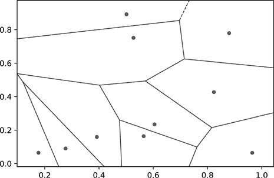
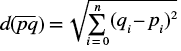
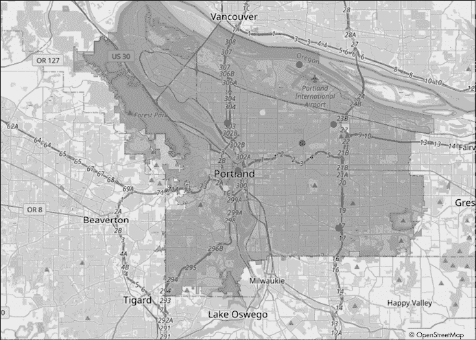
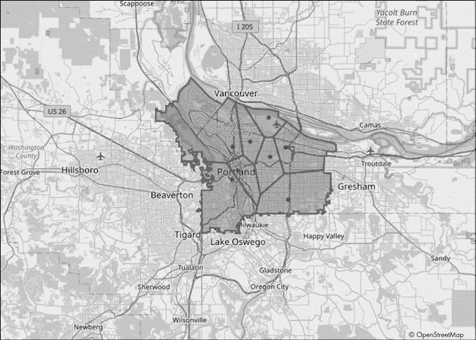
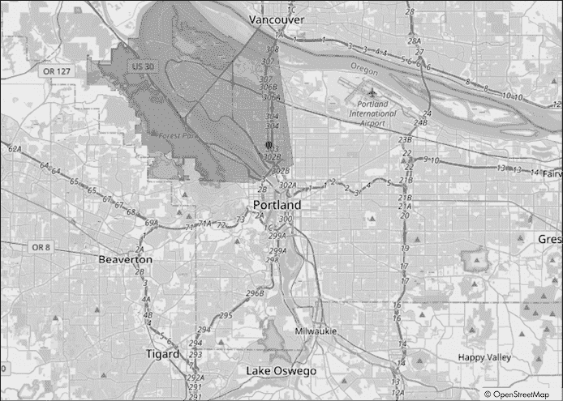

# 计算几何在安全资源分配中的应用


在企业安全工作中，你将经常被要求协助进行各种基础设施规划和部署任务，这些任务更多地涉及提供安全性，而非我们通常认为引导信息安全的传统 CIA（三要素：保密性、完整性、可用性）三元组。但不用担心——凭借你正在收集的数学工具，你将能够适应不断变化的挑战，并在其中蓬勃发展。本章我们将重点介绍计算几何中最常用的工具之一，也是我个人最喜欢的算法之一：Voronoi 镶嵌。

我们将帮助俄勒冈州波特兰市规划新消防站的位置，利用现有消防站的位置来进行风险评估。我选择这个项目是因为它展示了如何将应用安全概念扩展到其他领域；同样类型的分析可以应用于警察局、医院、汉堡店或任何其他分布在城市、州、国家或地理区域的公共资源，使其成为你工具箱中最灵活的分析工具之一。

这是高层次的计划：首先，我们将创建一个表示城市的多边形，然后在多边形内放置一些点，表示当前消防站的位置。接着，我们将城市划分成更小的多边形，代表每个消防站所负责的区域。最后，我们将比较这些小多边形的面积，确定哪个消防站负责覆盖的面积最大，并根据需要推荐新消防站的设置，以提高该区域的响应时间。在过程中，我们将研究 Voronoi 镶嵌，并讨论我们实现的一些限制。到本章结束时，你应该能够扎实地理解如何使用计算几何进行资源分配计划。你还应该能够熟练地使用 OpenStreetMaps API 来获取和处理地理空间信息，这将使你能够将资源规划扩展到任何所需的地理范围。

## 使用 Voronoi 镶嵌进行资源分配

你在第七章中已经看到过镶嵌的应用，当时我们将安全资产部署在公园周围。在那个例子中，我们基于多边形的顶点将平面划分成三角形，然后在这些区域中放置一个点，表示守卫。我们预期守卫会对任何发生在他们区域内的事件做出响应。*Voronoi 镶嵌*则是反向工作的，我们有一组点（称为*种子*或*生成器*），这些点分布在平面上，我们希望将区域划分为包含单一点的区域。请看图 9-1，它展示了一个 Voronoi 镶嵌的示例。



图 9-1：随机生成的 Voronoi 镶嵌

灰色圆圈代表了 10 个随机选取的（*x*，*y*）坐标，这些坐标作为我们 Voronoi 镶嵌的生成器。每条线段代表平面上距离两个或多个生成器等距的位置。线上的点与多个生成器点的距离相同，因此我们将它们标记为生成器之间的边界。标记完所有生成器之间的边界后，我们就得到了一个多边形的马赛克。每个多边形代表平面上的一个子区域。在每个多边形区域中都有一个生成器点，因此我们可以根据哪个生成器点离平面上任意一个不在边界线段上的点最近来对其进行分类。

在第七章中的公园示例中，这就像是将警卫分布到公园中，然后根据他们的位置将公园划分为各自的责任区域。以这种方式处理问题在很多情况下都非常有用，特别是在检查已经到位或无法轻易移动的资源分布时。

严格来说，Voronoi 镶嵌将平面划分为空间区域，其中每个区域的所有点都比任何其他生成器更接近该区域的生成器。与两个或多个生成器等距的点定义了区域之间的边界。为了对消防站项目执行 Voronoi 镶嵌，我们需要定义一个*度量空间 X*，这只是一个集合（在此情况下，是一个由 2D 多边形定义的平面上的生成器点集合）和一个作用于该集合的度量函数（这里是一个计算点间距离的*d*函数）。我们的度量空间——也就是我们将进行镶嵌的平面——受到城市边界形状的限制。生成器点将是当前站点的位置，负责划分城市的责任区域。边界数据和生成点都需要处于同一坐标系统中。我们不再像之前的项目那样手动投影坐标，而是利用一个专门构建的库叫做 geovoronoi，它在后台处理坐标的前后投影。

## 概念验证：分析消防站覆盖范围

这个项目的概念验证相当简单。我们的目标是开发一个应用程序，通过 Voronoi 镶嵌来程序化地定义波特兰市的消防服务区域分布。我们希望程序能找到面积最大的服务区，并将其作为推荐的拆分区域。为此，我们需要定义三项信息。首先，我们需要表示我们计划分析的区域的形状数据，在本例中是波特兰。我已经将这部分数据包含在书籍附录材料中的*portland_geodata.json*文件里。你也可以通过像 OpenStreetMap API 这样的网络服务获取数据，这也是我最初获取数据的方式。其次，我们需要定义生成点的位置，在这个项目中，生成点是波特兰各消防站的地址。我已经将我在此次分析中使用的 10 个地址包含在书籍附录材料中的*station_addresses_portland.csv*文件里。第三，我们需要定义在执行 Voronoi 镶嵌时用于测量点之间距离的函数。*

*一旦我们定义了这三项信息，就可以进行 Voronoi 分析了。接下来，我们只需找到生成的区域中面积最大的那个；为了实现这一点，我们将再次依赖 Shapely。我们将从讨论距离函数开始。加载区域形状和生成点是有趣的数据检索任务，但距离函数定义了区域之间边界的计算方式，因此这是大部分数学“魔法”发生的地方。*

### 定义距离函数

度量空间包含距离函数 *d*(*p*, *q*)，该函数用于确定平面中两点之间的距离。算法通过这个方式来决定哪些点属于哪个区域。距离函数有几种选择：曼哈顿距离、切比雪夫距离、绝对差的和、平方差的和等等。每种都有其优缺点，因此我们将选择最基本、最直观的选项——欧几里得距离，或口语上称为“鸟飞直线”。

两点 *p* 和 *q* 之间的欧几里得距离是连接它们的线段（pq）的长度。如果我们将纬度和经度视为笛卡尔坐标系中的坐标，就可以将这个问题视为一个二维欧几里得几何问题，我们可以使用勾股定理来解决：



其中 *n* 是问题映射到的维度数，或者更一般地说，是定义一个点的向量的长度。所以，如果你在处理 10 维问题，每个点将由一个长度为 10 的向量来定义。在我们的例子中，我们有两个维度，因此 *n* = 2。我们只需要对终点和起点之间的差值进行平方，将两个维度的平方差求和，然后对结果取平方根。

在这个场景中，欧几里得距离有一个缺点：实际上，你很少能直接穿越一个地理区域而不考虑像树木和建筑物这样的障碍物。此外，像消防车这样的车辆受到街道的限制，并且受交通和其他条件的影响，这些因素决定了它们到达目的地的路径。我鼓励你在我的简化基础上进行扩展，以便在你自己的实现中使结果更加准确和有用。现在，我们已经定义了开始深入探讨问题所需的一切。是时候开始收集定义几何平面所需的数据，从城市边界的形状开始。

### 确定城市形状

为了获取表示平面边界的多边形，我喜欢使用 OpenStreetMap 团队提供的一个名为 Nominatim 的网页工具（[`nominatim.org`](https://nominatim.org)）。其简单且免费的界面允许你获取几项重要信息，如地点 ID、名称的本地化拼写等。你可以直接在网站上查看这些信息，或者请求 JSON 响应以便在你自己的程序中解析，正如我们在这里所做的那样。清单 9-1 展示了如何请求这些信息。

```
import urllib, requests, json
base = "https://nominatim.openstreetmap.org/search.php"
f = {"q": "Portland OR", "polygon_geojson":1, "format":"json"}
q = urllib.parse.urlencode(f)
resp = requests.get("%s?%s" % (base, q))
resp_data = json.loads(resp.text)[0]
```

清单 9-1：通过 Nominatim 获取俄勒冈州波特兰市的 JSON 数据

当我们调用 Nominatim API 时，`q` 参数包含我们要搜索的查询字符串；在这里，我们将其设置为包含城市名称和州缩写的字符串，`"Portland OR"`。`polygon_geojson` 参数告诉 API 返回表示城市边界的多边形的 geoJSON 形式。这是我们目前最感兴趣的部分，因为它获取了我们定义城市边界所需的形状数据。`format` 参数告诉 API 我们希望以何种格式返回响应数据。每当 JSON 可选时，它是 Python 的一个不错选择，因为它将解析后的数据处理得像字典一样。我们需要将参数字典编码成可以附加到 URL 的字符串，使用 `urllib.parse.urlencode` 函数。然后，我们将查询字符串作为 GET 请求的一部分提交，并使用 `json.loads` 函数解析响应的文本值。返回的值应该是一个列表，包含一个或多个代表与查询匹配的地方的条目。在这种情况下，应该只有一个结果，代表波特兰市。图 9-2 展示了该多边形。


图 9-2：波特兰市的多边形

灰色区域表示该市的市政边界。这是需要由城市消防服务保护的部分。我们需要将坐标转换为形状，但首先让我们将数据格式化为 geoJSON，如清单 9-2 所示。

```
city_gj = {
  "type": "FeatureCollection",
  "features": [
      {
          "type": "Feature",
          "geometry": resp_data["geojson"],
          "properties": {
            "name": "City Boundary"
          }
      }
  ]
}
```

清单 9-2：将坐标转换为 geoJSON 特征集合

这里的数据结构是 geoJSON 对象的顶级定义，该对象的 type 属性为`FeatureCollection`，表示可以在适当命名的`features`键下嵌套特征列表。每个特征是一个嵌套的 JSON 对象，类型为`Feature`。每个特征需要一组坐标来定义其几何形状；在这里我们使用`resp_data["geojson"]`，即在清单 9-1 中从 API 返回的 geoJSON。我们还可以添加更多属性来存储自定义信息，这些信息可以用于组织或为我们的分析提供支持。`properties`键后面跟着一个嵌套的字典，定义了属性名称和值，其中字典的键表示属性名称，值表示属性值。键仅限于字符串字面量，但值可以是任何合法的 JSON 对象，因此你可以在附加到特征的属性信息上进行非常有创意的操作。

下一步，如清单 9-3 所示，是将结果 geoJSON 信息转换为存储在`GeometryCollection`中的`shape`对象。

```
from shapely.geometry import GeometryCollection, shape
city_shape = GeometryCollection(
    [shape(f["geometry"]).buffer(0) for f in city_gj["features"]]
)
city_shape = [geom for geom in city_shape][0]
```

清单 9-3：将城市几何转换为 Shapely 形状集合

首先，我们通过传入组成集合的几何对象列表来创建一个`GeometryCollection`。我们使用列表推导遍历在清单 9-2 中创建的`city_gj`变量中的每个要素。对于每个要素，我们将几何参数传递给`shape`构造函数。结果是一个`shape`对象，表示 geoJSON 要素的坐标。有些城市由多个多边形表示，因此此函数将遍历构成城市的所有多边形，并将每个多边形转换为一个`shape`对象。`city_shape`现在是一个包含单个`MultiPolygon`对象的`GeometryCollection`。我们可以使用另一个列表推导访问`MultiPolygon`。由于只有一个项目，我们可以通过索引`0`从列表中提取它。如果你有更多`MultiPolygon`对象需要处理，应该遍历每个对象。`city_shape`变量中的`MultiPolygon`数据现在表示我们将使用我们定义的度量空间进行镶嵌的平面。现在是时候获取车站的位置来创建我们的发电机列表了。

### 收集现有消防站的位置

如前所述，我们将使用现有消防站的地理位置作为我们分析中的区域发电机。书籍附赠材料中提供的文件*station_addresses_portland.csv*包含了市区内 10 个消防站的名称和地址。pandas 库提供了一个方便的函数，可以将 CSV 文件中的数据加载到`DataFrame`中，如清单 9-4 所示。

```
import pandas as pd
stations_df = pd.read_csv("station_addresses_portland.csv", names=[
    "name", "street", "city", "state", "zip"
])
stations_df["addr"] = stations_df.apply(row_to_str, axis=1)
```

清单 9-4：将数据快速而简便地加载到`DataFrame`中

虽然有专门用于处理 CSV 数据的库，但我更倾向于利用 pandas 的内置 `read_csv` 函数，因为它灵活且已经包含在我常用的库中。当我为这个项目准备数据时，我手动使用 Google Maps 汇总了车站地址列表。我没有添加标题行，这就是为什么我们通过 `names` 参数传入一个列名列表。在实际的咨询工作中，我会期待客户提供地址，因此你可能需要调整文件解析方式，以匹配提供的数据格式。接下来，我们创建一个方便的 `addr` 列，将完整的街道地址作为字符串存储，通过应用一个名为 `row_to_str` 的函数，该函数简单地返回 `street`、`city`、`state` 和 `zip` 列的值，使用空格分隔。我们传递 `axis=1` 告诉 pandas 我们想要将函数应用于整行，而不是列中的所有值。我们将使用 `addr` 列来简化地理位置 API 的搜索。

一旦我们将地址收集到 `DataFrame` 中，我们可以再次利用 OpenStreetMaps API（通过 geocoder 库）将这些地址转换为地理坐标点。在清单 9-5 中，我们定义了 `locate` 函数，将单个地址转换为位置数据。

```
import geocoder
def locate(addr):
  ❶ g = geocoder.osm(addr)
    data = g.json
  ❷ if data is None:
        return None
  ❸ return {
        "address": data["address"],
        "lat": data["lat"],
        "lon": data["lng"],
        "osm_id": data["osm_id"]
    }
```

清单 9-5：将地址转换为地理坐标点

调用 API 的主要工作被 `geocoder.osm` 函数 ❶ 抽象化处理。传入查询字符串（在本例中为地址）会返回一个包含 API 响应的对象。库在响应对象上提供了一个方便的 `json` 参数。如果 JSON 响应为 `None` ❷，我们返回 `None` 以表示 API 未能找到任何与输入查询相关的内容。如果返回了 JSON 对象，我们提取包含重要信息的子集，例如纬度和经度，并将其作为字典 ❸ 返回。我们还会记录 `osm_id`，以便在未来进行快捷查找或在多个结果中选择。

为了收集所有车站的坐标点，我们将在一个循环中调用 `locate` 函数，对每个地址进行处理，并将结果存储为一个列表。由于我们之前已经从车站数据创建了一个 `DataFrame`（清单 9-4 中的 `stations_df` 变量），我们可以利用 pandas 的 `apply` 函数来处理幕后繁琐的工作。然后，我们将位置数据转换为独立的 `GeoDataFrame` 对象。清单 9-6 展示了如何进行转换。

```
import geopandas as gpd
locations = stations_df["addr"].apply(locate)
locations = [a for a in list(locations) if a is not None]
loc_df = pd.DataFrame(locations)
geo_df = gpd.GeoDataFrame(
    loc_df,
    geometry=gpd.points_from_xy(loc_df.lat, loc_df.lon)
)
```

清单 9-6：从车站位置创建 `DataFrame`

在我们调用`apply`之后，`locations`变量包含了一个字典对象的列表，每个字典代表一个火车站，存储了我们分析所需的地理坐标。我们筛选掉位置为`None`的实例，然后使用这些数据创建一个名为`loc_df`的地点`DataFrame`。最后，我们可以将这个常规的 pandas `DataFrame`转换成一个更合适的 GeoPandas 库中的`GeoDataFrame`对象。图 9-3 展示了结果在地图上的显示。



图 9-3：作为点的消防站位置

之前定义的多边形内的黑色圆圈显示了站点位置。如果你数一下地图上的位置，只有 10 个站中的 8 个是显示出来的。`locate`函数未能找到两个地址的坐标。如果这个项目是用于生产环境，我们可能需要从多个来源获取坐标，以提高成功的概率。你也可以手动查找这些坐标，或者请客户提供缺失的信息。现在，我们将从分析中删除这两个地址，继续进行下去。

现在我们已经收集了所有必要的数据，可以开始执行实际的镶嵌操作了。

### 执行 Voronoi 分析

一如既往，Python 中有多种执行 Voronoi 镶嵌的选项，但在处理地理信息时，最简单的选择是名为 geovoronoi 的库，它为我们处理坐标投影和边界工作。它接收一组坐标，并使用 SciPy 后台计算 Voronoi 区域。在典型的 Voronoi 图的边缘，区域边界会延伸到无穷大，这通常不是我们想要的行为，因此 geovoronoi 库允许我们使用周围区域的形状（在这个例子中，是城市的多边形形状）来裁剪 Voronoi 区域，使其适应提供的形状，从而使边缘区域变得有限。该库还使用 Shapely 来管理形状操作，使其非常适合这个项目。

清单 9-7 展示了如何使用该库与之前收集的数据一起创建镶嵌。

```
import numpy as np
from geovoronoi import voronoi_regions_from_coords
points = np.array([[p.y, p.x] for p in list(geo_df["geometry"])])
poly_shapes, pts, poly_to_pt = voronoi_regions_from_coords(
    points, city_shape
)
```

清单 9-7：将地址转换为地理坐标点

第一步是使用列表推导将表示消防站的点转换为 NumPy 数组，遍历之前创建的`geo_df` `DataFrame`对象的`geometry`列。然后，我们可以调用 geovoronoi 库中的`voronoi_regions_from_coords`函数，将点数组（`points`）作为第一个参数，将边界多边形（`city_shape`）作为第二个参数。

该函数的结果是一个包含三项有用信息的元组。`poly_shapes`变量包含一组 Shapely `Polygon`对象，表示在 Voronoi 网格生成过程中创建的多边形区域的形状。`pts`变量包含一组`Point`对象，表示生成器的坐标。如果你还没有使用 GeoPandas 或其他方法创建它们，这些信息会很方便。`poly_to_pt`变量包含一个嵌套列表，其中每个`poly_shapes`中的区域都有一个列表，表示该区域内生成器的索引。索引指示哪些生成器属于此 Voronoi 区域。通常情况下，这个区域只有一个点，因为多个消防站不应共享相同的位置，但也可能存在多个生成器点具有相同位置的情况。在这种情况下，所有这些点都会在`poly_to_pt`中被索引。

图 9-4 显示了创建的区域以及每个区域的生成器。



图 9-4：一个 Voronoi 网格，显示了每个站点的责任区域

八个区域由黑色轮廓划分。每个多边形内部的区域可以视为生成该区域的消防站的简单责任区域（AOR）。之所以称之为简单，是因为它没有考虑到可能影响响应站点选择的障碍物（例如水体）。尽管如此，这些信息仍然是构建模型的一个良好起点。我们可以看到，位于城市中心附近的消防站分布，使得边缘站点拥有最大的 AOR。从视觉上看，左上角的 AOR 似乎最大，但我们可以使用`area`参数轻松验证这一点，如 Listing 9-8 所示。

```
winning = 0
winner = -1
❶ for i in range(len(poly_shapes)):
    ps = poly_shapes[i]
    if ps.area == winning:
      ❷ if isinstance(winning, int):
            winner = [winner, i]
        elif isinstance(winning, list):
            winner.append(i)
  ❸ elif ps.area > winning:
        winner = i
        winning = ps.area
```

Listing 9-8：找到最大的 AOR

我们首先遍历`poly_shapes`变量中的每个形状，按照列表长度进行迭代 ❶。这样迭代可以让我们在函数执行过程中跟踪索引。在一些罕见的情况下，可能会有多个区域具有相同的面积。遇到这种情况时，我们将`winner`变量转换为列表，并跟踪所有平局情况 ❷。在更常见的情况下，两个区域的面积不相等，因此我们检查当前区域的面积是否大于当前获胜区域的面积 ❸。如果是这样，我们更新`winning`值和`winner`索引。一旦所有区域都被检查过，`winner`变量将包含一个或多个区域索引，我们可以利用这些索引在`poly_shapes`中查找形状（或多个形状）。我们也可以用它来查找`poly_to_pt`中的站点（或多个站点）。

图 9-5 显示了将区域绘制到地图上的结果，以及负责该区域的站点位置。



图 9-5：最大区域及其生成器位置

再次强调，深灰色区域代表了关注区域，而深灰色圆圈显示了响应的消防站位置。因此，你可以合理地认为，在该区域内的某个位置增设一个消防站，将改善该地区的响应时间和资源可用性。

你可以通过导航到本章的附加材料目录并运行*Emergency_service_poc.py*脚本来运行概念验证代码，方式如下：

```
python Emergency_service_poc.py
```

一旦代码完成加载数据并进行 Voronoi 分析，它将打开一个浏览器标签页，访问*http://127.0.0.1*，该页面通过 Plotly 和 MapBox API 展示解决方案。

## 算法的局限性

在本章中，我们仅专注于问题的地理部分，这是一个很好的起点。然而，这种狭窄的范围确实存在一些局限性。我之前已经提到过距离函数的局限性，但如果你在现实中被要求做出类似的建议，还需要考虑其他因素。

其中一个问题是，并非所有消防站的装备都相同。有些消防站配备更多的消防车，有些配备不同类型的专业设备（比如用于勘察大面积森林的飞机，或者用于进行港口巡逻的船只）等等。设备的多样性意味着不同的消防站可能更适合处理不同的问题。如果将一座专门装备的消防站设置在不需要这些设备的地区，那将是资源的极大浪费。资源分配的另一个问题是，有些消防站更适合应对较大的区域。例如，一座有着广阔区域且拥有 10 辆消防车的消防站，可能比一座区域较小但仅有两辆车的消防站更有效地进行巡逻。你可以通过添加更多关于消防站资源和专业化的信息来改进这一分析。在创建 Voronoi 区域时，你需要向市内相关人员咨询新消防站的装备计划，并将其考虑进分析中。

最后的考虑因素是，消防站并不会看见这些边界。一个地区的火灾可能也会带来来自附近地区的响应人员。消防部门尽力将任何给定区域的负载分配到两个或更多的消防站，以便更快速地控制大型火灾。火灾越大，所需的资源就越多，因此可能需要将一个地区的资源调配到另一个地区来提供帮助。严格划分区域为 AORs（责任区域）可能会导致你建议一个完美分配 AOR 的消防站位置，但仍然无法让新站点在有意义的方式上帮助现有站点。

为了避免这个局限性，我建议进行多次分析。对于数据中的每个站点，你可以通过一次移除一个站点并重新计算区域，检查其他站点如何影响其所在区域。这类似于在问，“如果站点 B 无法响应，站点 A 的职责将如何变化？”通过叠加结果区域，你将看到哪些站点承担了更多的共享责任，因为该区域在移除所有其他站点后，其面积变化最大。一个承担了大量共享责任的站点可能会遭受设备疲劳或身体疲惫，因此你可以建议将位于过度负担站点附近的其他站点调动，以更好地分配负载。同样，承担最多共享责任的站点可能拥有合适的设备和人员来处理额外的工作。

所有这些内容旨在向你展示，尽管 Voronoi 图非常有用，但它们并不总是最终的答案。与所有分析一样，你对模型添加的准确性和细节越多，结果在现实世界中的适用性就越强。在进行任何类型的资源分析时，了解这些资源如何与其所在区域以及彼此之间相互作用同样重要。这样做将使你能够为模型做出明智的选择，并克服这一基本框架的一些局限性。

## 总结

在本章中，我们介绍了最著名的计算几何算法之一——Voronoi 镶嵌。我们看到它如何应用于与资源分布相关的现实问题，并且如何根据问题的需求进行扩展。我们还讨论了该实现的一些局限性，以及你可以自行改进的方式。我希望你能将这个框架加以拓展，以适应你自己的项目。

有大量优秀的研究材料，涉及这些镶嵌的不同应用，从安全到神经学，涵盖了所有领域。我建议你阅读研究论文《使用 Voronoi 镶嵌合理化警察巡逻区域》^(2)，这是另一个将此分析应用于改善紧急服务的例子。作为安全分析员，你会发现许多机会来展示你的资源分布知识。在本书的最后部分，我们将重新审视镶嵌，以规划艺术画廊问题的安全资源分布。

在下一章，我们将通过我最喜欢的项目之一——人脸识别系统，来总结我们对计算几何在安全领域应用的探索。尽管其规模和几何结构与我们迄今为止处理的任何内容截然不同，但基本思想是相同的。我们将继续使用 Shapely 来处理几何部分，但现在我们将加入一些机器学习的元素，这将为我们提供所需的工具，以便构建实现面部特征程序化识别所需的高度复杂分析。*
