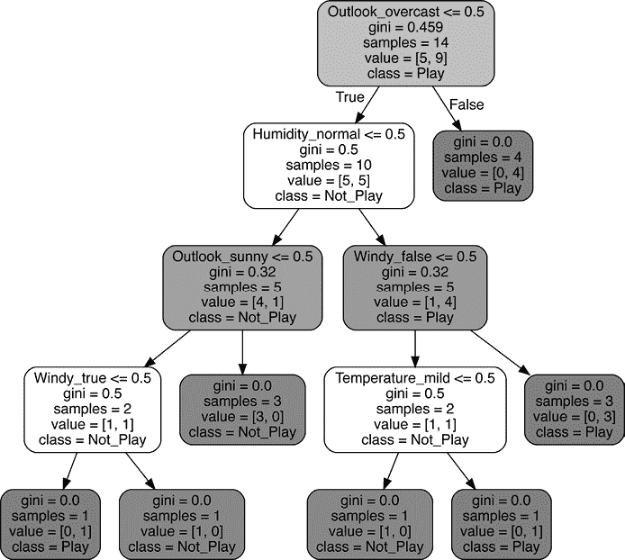
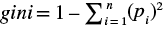
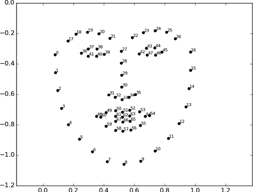
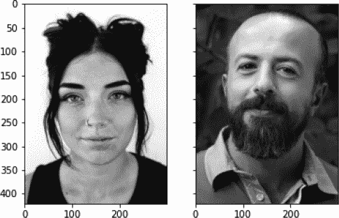
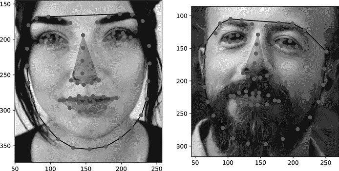
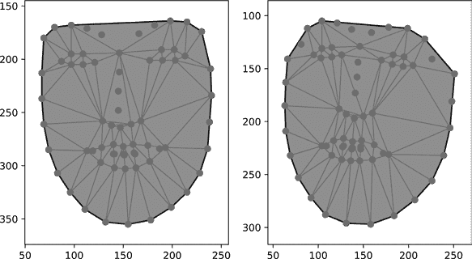
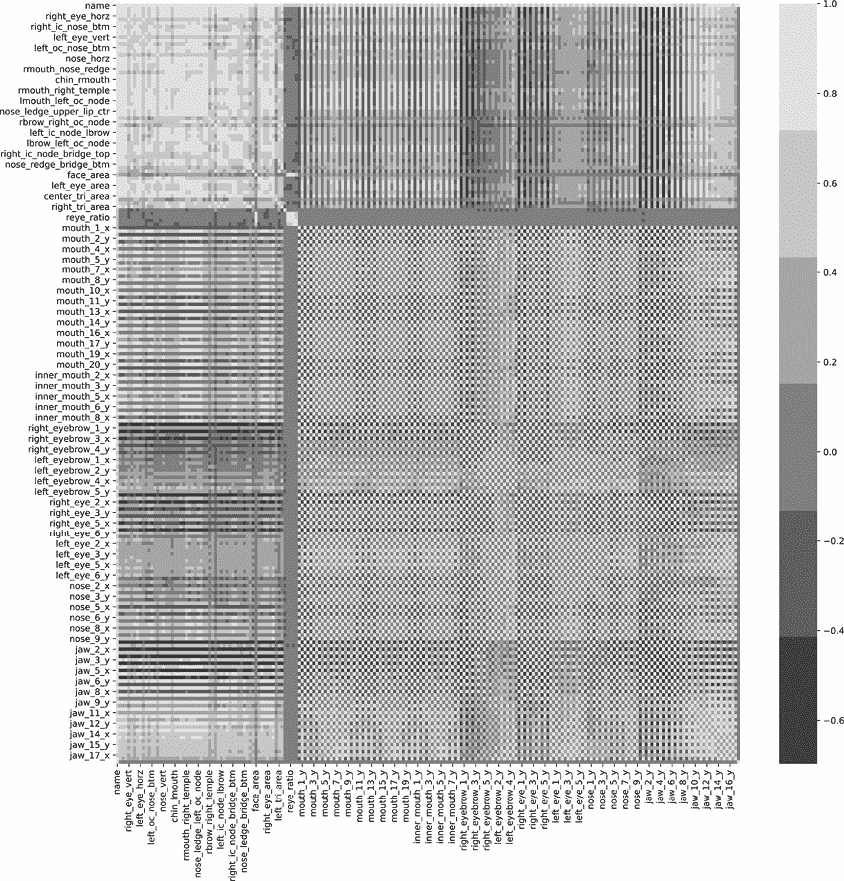

# 第十二章：面部识别的计算几何学


让我们抛开资源分配的世界，看看计算几何学如何帮助你进入另一个领域：面部识别。*面部识别*是检查面部特征并确定其是否与先前见过的面部匹配，并且如果匹配的话，匹配的程度。大多数婴儿在三到四个月大时就能识别熟悉的面孔，但不幸的是，仅仅因为婴儿能做到这一点并不意味着这很容易，至少对计算机来说并非如此。我们需要结合计算几何学和机器学习算法，以便我们的程序能够达到类似的水平。

我们将从简要介绍面部识别开始本章。然后，我们将介绍主要的算法，并像往常一样，将其应用于概念验证中，涵盖加载、清理和建模存储在面部图像数据库中的数据。我们将处理数据库中的每一张图像，提取最重要的面部特征，以确定图像中的人是谁，然后我们将利用这些信息建立一个模型，将一张前所未见的面部图像与相应的人匹配。

为了实现这一点，我们将依赖各种机器学习（ML）工具。ML 算法旨在通过两大类解决方案来识别或“学习”输入数据与输出值之间的关系：无监督学习和监督学习。

在*监督学习*中，我们向算法提供一组输入数据，并提供我们希望程序为这些输入学习的正确输出（称为其*类别*）。在我们的案例中，输入数据将是一个面部的几何特征，而我们想要预测的类别是与之相关的人的姓名，这使得这是一个*离散分类*问题。如果我们想要预测的类别值是一个连续的数字（例如房子的价格），这将被称为*回归*问题（你可能已经熟悉线性回归，它是统计学中的一个概念）。

*无监督学习*旨在发现先前未知的关系，主要通过根据不同的输入将数据进行聚类，以发现有趣的分组。因为我们在开始时不知道目标是什么，所以下无监督学习有时也被称为*探索性分析*。在这个项目中我们不会做太多的无监督学习，所以我会把这个话题留给你自己深入研究。当你完成本章后，你应该能熟练处理图像数据，提取几何面部特征，并训练监督学习分类器，用于你自己的面部识别项目。

## 面部识别在安全中的应用

今天，面部识别在安全领域的应用并不难找到。面部识别系统已经成为生活中广泛应用且被普遍接受的一部分。已经从这项技术中受益的行业包括零售商店、赌场、手机制造商和执法机构。然而，这并非一直如此。这项技术的核心自 1960 年代以来一直在缓慢进展，当时伍德罗·威尔逊·布莱德索（Woodrow Wilson Bledsoe）发明了一种方法，允许人们通过电子表面和导电笔手动编码面部几何形状。使用导电笔，用户可以标记出一组标准化的面部特征，如鼻梁、眉毛和下巴。然后，程序会测量这些点和形状之间的几何关系，并创建输入面部的几何图。数据随后会与先前记录的面部痕迹数据库进行比较，以确定与该面部最匹配的人的姓名。当然，这种方法既耗时又容易出错。在接下来的四十年里，研究人员通过定义更多的标准化测量点和使用图像分析技术自动识别面部照片中的这些关键点，持续改进算法。

直到本世纪初，面部识别才开始从科幻小说和研究实验室走向现实。2001 年 1 月发生了一个备受关注的案例，当时佛罗里达州坦帕市使用面部识别系统记录并分析了超级碗 XXXV 上每位观众的面部，希望能够发现那些有逮捕令的罪犯。该程序被认为成功地识别出了几名出席的轻微犯罪分子，但由于高昂的成本和大量的误报，整体上被视为失败。更糟的是，它引发了包括电子前沿基金会（Electronic Frontier Foundation）和美国公民自由联盟（American Civil Liberties Union）在内的隐私倡导团体的强烈反弹。^(1)

尽管负面宣传没有显著减缓这项技术的发展，但它却未能阻止技术的快速增长。佛罗里达州再次因成为首批将面部识别技术作为警察接受工具的州之一而登上新闻。2009 年，皮内拉斯县警长办公室宣布了一项程序，允许警察访问佛罗里达州公路安全和机动车辆管理局的照片档案。两年内，估计有 170 名副警长配备了可以立即与数据库中的面部进行交叉验证的摄像头。此后，廉价的处理能力、不断降低的数据存储成本以及大量的面部数据集，使得这项技术从政府项目进入了安全程序员的工具箱。我们将在下一节 “面部识别研究的伦理问题” 中讨论更多隐私和伦理方面的问题。

现在，你可以以一台普通相机的成本建立一个有效的面部识别系统（$20 至 $40 的树莓派摄像头模块非常适合这个用途），再加上一些云处理费用。我将在概念层面保持平台无关，但每个主要的云服务提供商都有一些产品，可以让你将我们所编写的代码转换为一个分布式可扩展的版本（我们将在第十三章中进一步讨论云部署）。

最难的部分是收集图像数据库。为了获得一个良好的面部识别数据集，你需要在不同的光照条件和不同的面部姿势下拍摄同一个人的多张照片。面部特征需要具有可区分性，因此对比度也很重要。我们将在本章稍后的“处理图像数据”部分进一步讨论图像质量。目前需要记住的是，数据集中图像的质量将对机器学习算法区分面部的能力产生重大影响。旧的、模糊的、颗粒感强、对比度低的照片会让这一过程变得更加困难，甚至可能变得不可能。

我们将使用由埃塞克斯大学计算机科学与工程系发布的面部识别数据集。^(2) 数据集中的一部分（标注为*faces94*）相对静态。研究人员让受试者坐在距离摄像机固定的位置，并要求他们在拍摄一系列图像的同时讲话。讲话引入了面部表情的变化，这使得底层的分类算法能够理解个体面部形状的变化，并有更大的机会正确分类输入图像，即使面部姿势是算法之前未见过的。数据集的第二部分（标注为*faces95*）则更加动态，通过要求受试者向摄像机走近，从而在拍摄一组 20 张图像时引入了尺度、视角和光照的变化。向前移动使得后续照片中的头部看起来更大，也改变了面部的投影阴影和高光。最后，这些图像的背景是一块红色的窗帘，这也增加了难度，因为不完美的表面可能使算法在检测面部特征的边缘时面临挑战。能够在这些变化的情况下正确分类面部，将使你的程序在实际环境中更可靠地运行，因为你可能无法每次都获得一个清晰、稳定的图像，背景也可能不总是坚固或静止的。

## 面部识别研究的伦理

在继续之前，我们来谈谈人脸识别研究的伦理问题。能够根据人脸图像自动识别一个人有许多潜在的用途和滥用方式。人脸识别软件可以被急救人员用来在灾难发生后识别受害者，或者被独裁者用来识别政治活动家。作为分析师和开发人员，在处理人脸识别项目时，你必须非常小心。你永远不知道你的软件最终会落入谁的手中。

首先，你应该熟悉所有可能适用于你情况的隐私法律。像欧盟的《通用数据保护条例》这样的国际法规认为生物识别数据，如人脸分析模型，是*个人可识别信息*，因此要求在其收集、处理和存储过程中实施更严格的安全控制。由于错误率高且在身份错误识别时可能造成严重后果，一些美国城市（如马萨诸塞州的波士顿）甚至禁止警方使用人脸识别技术。了解适用于你项目的法律和法规，将帮助你更轻松地应对其他伦理问题。避免隐私方面伦理和法律问题的最佳方式是获得被纳入数据中的人的知情同意。我强烈建议你拒绝任何无法或不允许收集知情同意的项目。

除了明显的滥用行为外，还有一些更难以察觉的伦理问题。种族和族裔偏见仍然是开发人脸识别模型时的关键关注点。人脸识别算法通常能达到 90%以上的平均分类准确率，但研究人员已表明，这一错误率在不同人口群体中并不均等。几项独立测试发现，面部识别的最低准确率通常出现在 18 至 30 岁之间、肤色较深的黑色女性身上。这些无意的偏见是数据收集者在技术和社会选择中所做决策的结果。比如相机镜头类型、数据收集地点等决策，都会对数据中人口的整体代表性产生微妙但明确的影响。

尽管有这些伦理问题，我仍然将这个面部识别项目放在这里，因为我认为它提供了一个极好的学习机会。我们将使用公开可用的数据，这些数据是在个人同意并知晓图像将用于像我们这样的研究的情况下收集的，这是完全符合伦理的。我选择的数据集相对较小，代表了有限数量的人群。这可能导致我们做出过于乐观的性能预测，因此我们不希望将其用于开发任何类型的生产系统。不过，它会作为一个很好的起点。我们可以用它来说明工作流程，甚至测试算法的某些部分。当你准备为一个真实项目开发面部识别系统时，你将拥有知识和工具来收集一个真正能准确反映人类多样性的数据集。

## 面部识别算法

尽管我们使用的是机器学习算法，但面部识别过程的核心与 Bledsoe 在 50 多年前创建的过程仍然非常相似。我们将使用 68 个面部特征点来为面部数据库创建几何图，随后利用这些图来训练机器学习算法，将输入的面部图像与之前见过的面部进行比较，并预测最接近的匹配。一般而言，面部识别是一个*计算机视觉*问题：它涉及教计算机识别编码在视觉数据中的信息，如图片和视频。这也属于*多类分类*问题的范畴，其中需要预测的类别来自三种或更多的潜在分类。当多类算法运行时，它会将输入与为每个类别记录的数据进行比较，并确定输入最可能属于哪个类别。我们将把数据集中的每个人当作我们感兴趣的类别，输入则是包含已分析过的个体面部的图像。我们将使用的算法是监督学习算法；再次强调，这意味着在训练我们的算法或模型时，它将访问正确分类的列表，并利用该列表纠正先前的错误并改进未来的预测。

存在大量潜在类别（最终分析中有 222 个独特个体），而每个类别的样本量相对较小（每个个体约有 20 张图片），这使得我们的目标更加困难。为了解决这个问题，我们将为每张图片收集大量统计数据，并让算法决定哪些测量子集能够提供最佳的决策能力。

### 使用决策树分类器

分类是通过一个叫做*随机森林分类器*的算法处理的，它是*决策树分类器*的扩展版本。决策树算法有许多优点：它们训练速度快，能生成易于理解的模型，并且在面部识别等多分类问题中表现良好。我们通过一个经典示例来说明它们是如何工作的。假设我们想编写一个程序，根据天气预测某人在某一天是否可能出去打高尔夫球。决策树是这类问题的理想选择，因为它将生成一系列规则，我们可以用这些规则来检查某一天的天气情况。请参考图 10-1 中的决策树。



图 10-1：高尔夫决策树示例

在图 10-1 中，你可以看到每个分支表示数据中的一个布尔决策（例如`Outlook_overcast <= 0.5`）。阅读决策树时，从最顶部的框（称为*根节点*）开始，沿着正确的逻辑分支向下，直到到达最底部的框（称为*叶节点*或*叶子*）。一些关于生成决策的底层数据统计信息会列在布尔决策下方。每一行（在数据科学术语中称为*实例*）都会一次性通过决策树，直到它到达某个叶节点；在这个过程中，算法会记录数据如何影响树的生长。最简单的统计信息是`samples`。这是在创建过程中，经过此决策点的总行数。

在图 10-1 中，你可以看到根节点收到了 14 个数据样本。由于这是根节点，它处理了数据集中的每一行，因此这也可以被解释为算法开始时的数据摘要。你可以看到`values`统计中的每个类别的计数。对于数据中每个可能的类别，有一个整数表示该类别中的行数。在我们的示例中，有两个潜在的类别，`Not_Play`和`Play`。再次查看根节点，你可以看到值`[5,9]`，这意味着这 14 个样本中，有 5 个属于`Not_Play`类别，9 个属于`Play`类别。

`gini`统计信息包含*基尼不纯度*系数，你可以将其看作是到达该节点的类别分布的度量，称为该节点的*纯度*。正式地，基尼不纯度系数可以写作



其中 *n* 是数据中类别的数量，*p*[*i*] 是实例被分类为第 *i* 类的概率。节点的结果得分范围在 0 到 1 之间。如果节点中的所有实例都属于单一类别，则该节点是完全纯净的，Gini 得分为 0。得分为 1 表示实例类别是随机分布的，无法预测。介于这两个极端之间的得分表示某种程度的类别纯度，得分越低，纯度越高（因此对于决策目的越好）。目标是找到只包含单一类别数据的纯叶节点（Gini 得分为 0）。这意味着导致该叶节点的逻辑能够在类别之间做出完美的决策。

要查看这个例子，请沿着根节点的`False`分支（在图 10-1 中向下和向右）进行操作。你可以通过观察没有布尔表达式的框顶部分，并且没有从中延伸出来的分支来判断这是一个叶节点。`class`统计量显示了每个节点的多数类；在处理这样的叶节点时，我们可以将其视为到达该点的数据的可能类别。考虑到这一点，我们可以逻辑地解读这个分支为“如果天气是阴天，则预测`Play`类”，因为我们处理的是布尔值（0 或 1），而决策标准是`Outlook_overcast > 0.5`。`samples`和计数以及`values`统计量显示有四个样本到达了这个叶节点，且所有样本都是`Play`类。

在图 10-1 中，所有叶节点都只有单一类别，因此这是一个完全纯净的树。当然，通常情况下并非如此，可能会有一两个来自其他类别的异常值（称为*离群点*）出现在一个叶节点中，而该叶节点的主要类别却是另一类。在这种情况下，你可以尝试找到更多的数据划分，以提高每个叶节点的纯度，但最终你必须接受性能为“足够好”，因为很难找到一个完美的划分。

在我们的面部识别问题中，我们将通过将输入的面部信息转换为几何信息，然后将这些信息传递到决策树中，直到到达叶节点，在该叶节点使用多数类来预测最可能匹配输入面部的主体。虽然算法所做的布尔决策比`Outlook_overcast > 0.5`更复杂，但原则是相同的。

传统决策树的问题在于，它容易受到数据初始条件和配置的影响，因为它按顺序处理样本。对同一数据的洗牌版本重新运行相同的决策树算法，很可能每次都会生成显著不同的树。这意味着，如果你计划使用决策树，你需要用不同的数据组合训练多个版本，以确保性能是可重复的（在此上下文中，*性能*指的是预测每个类别的准确度）。这促使研究人员设计了随机森林。随机森林算法通过半随机化的起始数据（称为*自助法*）反复创建单独的决策树。为了分类一个新的数据样本，该实例会沿着每棵生成的树传递，结果的类别预测会被统计。最后，所有树的猜测中多数的类别被预测为最可能的分类。

通过不同数据组合生成大量决策树将有助于确保整体预测不太容易受到任何给定树的起始条件的影响。我们将在开始构建概念验证模型时更详细地讨论随机森林，但在此之前，我们需要先确定如何收集所需的数据。让我们先来看看如何将一张面部图片转化为一组几何数据。在接下来的部分，我们将讨论如何找到重要的面部特征并将它们转换为数值表示。

### 表示面部几何形状

定义我们的面部识别应用程序的第一步是弄清楚如何将一张面部图像划分为可测量的形状。我之前提到过，我们将使用图像中的 68 个点来标记面部特征。为了节省开发时间并通过更少的前期编码实现我们的目标，我们将利用一个先前训练好的机器学习模型，`shape_predictor_68_face_landmarks`（[`dlib.net`](http://dlib.net))^(3)，它可以识别正面人脸上的兴趣点。图 10-2 显示了大致标出在面部上应落的位置的 68 个点。



图 10-2：由算法生成的面部兴趣点（图片来源：[`i.stack.imgur.com/OBgDf.png`](https://i.stack.imgur.com/OBgDf.png)）

几何特征图包括下巴轮廓（点 0–16）、左右眉毛（点 17–21 和 22–26，分别）、鼻子（桥部为点 27–30，底部为点 31–35）、左右眼睛（点 36–41 和 42–47，分别）以及嘴巴（嘴唇外部为点 48–59，内部为点 60–67）。当算法接收到一张面部图像时，它会调整每个点的位置，尝试与输入面部的定位相匹配。我们将使用这些点的调整位置来创建 Shapely 形状，代表不同的面部特征。然后，我们将计算一些关于面部的几何统计信息，例如眼睛之间的距离、鼻子的长度等，以创建面部的统计表示。 清单 10-1 显示了如何加载模型。

```
import dlib
detector = dlib.get_frontal_face_detector()
predictor = dlib.shape_predictor(
    "facial_model/shape_predictor_68_face_landmarks.dat"
)
```

清单 10-1：加载面部关键点检测器

该模型是 dlib 库的一部分，dlib 将多个 C++ 函数封装为 Python 代码，允许你利用 C++ 的计算速度进行科学计算，同时使用 Python 友好的语法来处理其他部分。`get_front_face_detector` 函数返回一个先前训练的模型，用于基于称为 *方向梯度直方图 (HOG)* 的方法来检测图像中的人脸。该检测器计算图像局部区域中梯度方向的出现次数，这意味着它一次只检查一小块像素区域；这类似于人类用放大镜查看图片时，聚焦于某些细节区域（只不过在此情况下像素没有变形）。`get_front_face_detector` 函数的输出是一个 `(``index``, ``rectangle_coordinates``)` 元组列表，每个元组对应一个检测到的人脸。我们将这些信息存储在一个名为 `detector` 的变量中，供预测器帮助聚焦于人脸。实际的面部特征位置由形状预测器处理，该预测器接收包含某个物体（在本例中是人脸）的图像区域，并输出一组定义物体姿态的点位置。为了加载预测器，我们告诉 dlib 我们感兴趣的模型路径，在本例中是 *facial_model/shape_predictor_68_face_landmarks.dat*。

在定义了面部检测器和关键点检测器组件后，我们可以开始处理图像了。对于面部识别系统（以及其他任何预测算法）来说，确保测试图像与训练图像的处理方式完全相同是非常重要的；否则，处理方式的差异可能会以不可预测的方式破坏结果。接下来的部分将描述一段模块化的代码，我们可以在概念验证中使用它来处理训练数据的创建和测试图像的处理，这两个过程独立于建模功能。

### 处理图像数据

处理图像数据的方法有很多种，这样预测算法就能基于其信息构建模型；然而，它们都有一个共同的目标，那就是将数据转换为标准化格式。你打算如何预测人脸，决定了在将图片转换为特征集之前，是否需要进行某些处理步骤。例如，你可以选择通过为每个颜色通道（红色、绿色和蓝色）分别创建预测器来保留颜色信息，这样的话你就不需要像这里一样将图像转换为灰度图像。无论最终的处理计划如何，一些操作都是相当常见的。诸如将图像裁剪为面部区域或调整图像大小等操作有助于确保所有样本一致地缩放，并且特征最终会在一定程度上标准化。清单 10-2 显示了处理 *.jpeg* 文件格式图像的函数。

```
import cv2
import imutils
def process_jpg(file_path):
    img = cv2.imread(file_path)
    image = imutils.resize(img, width=300)
    return cv2.cvtColor(image, cv2.COLOR_BGR2GRAY)
```

清单 10-2：处理单个 *.jpeg* 图像的函数

我们首先定义了 `process_jpg` 函数。我们需要的唯一参数是 *.jpeg* 图像的路径，存储在 `file_path` 中。我们使用 cv2（*计算机视觉 2* 的缩写）库的 `imread` 函数将文件读取为一个数据数组，表示每个颜色通道的像素值。然后，我们使用 `imutils.resize` 函数调整图像数据的大小。我们将图像缩放到宽度为 300 像素，使用 `width` 参数；图像的高度会根据新的宽度计算，以避免扭曲特征。最后，我们使用 `cv2.cvtColor` 函数将调整大小后的图像数据转换为灰度图像，并返回结果。（我选择将图像数据转换为灰度图像，因为颜色信息不会帮助我们进行几何分析。）

图 10-3 显示了一个示例结果。



图 10-3：处理过的面部图像，准备进行分析

你可以看到，我们返回的是宽 300 像素、高 450 像素的灰度图像。注意，面部特征没有被扭曲；这是因为我们使用的缩放方法。我们将使用这两张图像来举例说明接下来的过程。两张图像的对比度都不错，面部特征没有被遮挡（如墨镜、帽子或浓妆），因此它们是很好的候选图像。同时，两张图像也有一些区域最终会证明对算法来说更具挑战性，正如你所看到的那样。

在我们继续处理图像之前，通过调整图像的大小并将其转换为灰度图像，可以确保我们获得一致且可重复的样本，这样就能避免图像质量、比例和光照等方面的细微差异。这个步骤只是开始。你应该考虑应用其他图像转换（例如增加亮度或调整对比度）来为算法提供最佳的分析成功机会。在下一部分，我们将处理过的图像带入实际操作，开始定位和分析面部特征。

### 定位面部标志

现在我们已经将图像处理步骤定义为一个函数，可以在面部标志定位代码的开头调用它，以确保我们处理的是调整大小后的灰度图像。接下来的任务，见清单 10-3，是编写一个函数，定位我们将用于定义面部其余结构的面部标志。

```
from imutils import face_utils
def locate_landmarks(image_file):
  ❶ gray = process_jpg(image_file)
  ❷ clone = gray.copy()
  ❸ rects = detector(clone, 1)
    feature_coordinates = {}
 ❹ for (i, rect) in enumerate(rects):
      ❺ shape = predictor(clone, rect)
      ❻ shape = shape_to_np(shape) # See PoC code
      ❼ for (part_name, (i, j)) in face_utils.FACIAL_LANDMARKS_IDXS.items():
            if len(rects) >= 2:
                feature_coordinates[part_name] = []
            for x, y in shape[i:j]:
              ❽ feature_coordinates[part_name].append((x, y))
        face_points = []
        for n in feature_coordinates.keys():
          ❾ face_points += feature_coordinates[n]
      ❿ feature_coordinates[part_name] = face_points
    return feature_coordinates
```

清单 10-3：在图像中定位特征标志

`locate_landmarks` 函数只接受一个文件路径作为参数。然后，我们通过调用清单 10-2 中的`process_jpg`函数，从文件参数获取处理后的图像❶。我更喜欢在图像的副本上工作❷，以避免不小心用修改后的图像覆盖原图。复制图像后，我们使用在清单 10-1 中创建的`detector`来定位输入中每张脸的矩形区域❸。结果是一个包含面部索引和对应矩形区域坐标的元组列表。对于示例数据，列表中将只有一个矩形，但你可以扩展该函数以处理未来项目中多个面部的情况。

接下来，我们遍历矩形列表❹，并将每个矩形传递给在清单 10-1 中设置的`predictor`❺。结果是一个包含点坐标的列表，按照图 10-1 中所示的顺序排列。我们使用`shape_to_np`函数❻，这是一个简单的辅助函数，用于将形状的(*x*, *y*)坐标转换为 NumPy 数组。

```
def shape_to_np(shape, dtype="int"):
    coords = np.zeros((68, 2), dtype=dtype)
    for i in range(0, 68):
        coords[i] = (shape.part(i).x, shape.part(i).y)
    return coords 
```

在这里，我们创建一个名为`coords`的零数组，它是一个 NumPy 数组，用于存储 68 个坐标对。接下来，我们遍历`shape.part`列表中的所有索引。对于每个部分，我们从`x`和`y`属性创建一个元组，并将该元组分配到`coords`数组的相应索引中。一旦收集完所有坐标对，我们返回包含这些元组的数组。

在清单 10-3 中，为了方便后续操作，我们构建了一个以特征名称为键的字典，字典中包含定义该特征的点列表。`face_utils.FACIAL_LANDMARKS_IDXS.items`函数❼返回一个包含元组的列表，该元组提供了特征名称和定义`shape`中对应特征的起始和结束索引的嵌套元组。我们遍历这些定义，并在`feature_coordinates`字典中创建相应的条目❽。如果图像中有多张人脸，面部的索引编号将附加到特征名称后面，以便区分它们。

接下来，我们创建一个包含所有面部数据点的列表，并将其附加到一个列表中❾；这个列表将在概念验证中用于计算面部的凸包。从形式上讲，*凸包*是包含一组点的最小凸多边形，使得该集合中的每个点都位于该多边形内部或其边界上。记得在第七章中提到，凸多边形是所有内部角小于 180 度的多边形。你可以将凸包想象成如果你把一根橡皮筋拉紧围绕所有点的外部，你所得到的结果。

最后，我们将生成的列表添加到`feature_coordinates`字典中❿。

图 10-4 展示了对我们两张测试图像运行算法的结果。



图 10-4：地标检测结果

灰色的点表示算法认为每个面部特征的位置。整个面部区域的黑色轮廓表示生成的凸包。如你所见，程序做得相当不错。大部分情况下，点正确地定位了我们要寻找的地标。程序表现不佳的地方是无法找到左图中女性的下巴线，因为她的深色头发与背景的对比度比下巴线与背景的对比度更加明显。她面部的测量值会出现偏差，除非每次偏差的方式完全相同，否则会导致不良的训练数据。

尽管这个人的下巴被胡须遮住，算法还是更好地找到了下巴线。但算法未能正确找到鼻子的边缘。虽然与实际位置之间的差异相当小，而且虽然这会影响一些测量值，但整体面部形状保持了比例，因此生成的训练数据仍然可用。在进行这些测试并检查结果几个月后，你将能够查看一张图像，并大致估算出根据你定义的处理步骤，地标检测器的表现如何。

在调用`locate_landmarks`函数后，你应该会得到一个以特征名称为键的字典，这样你就可以使用人类友好的名称来引用点集。例如，要创建表示左右眼的多边形，可以使用以下代码：

```
from shapely import Polygon
leye = Polygon(feature_coordinates["left_eye"])
reye = Polygon(feature_coordinates["right_eye"])
```

然后你可以使用 Shapely 来测量形状之间的最小距离：

```
dist = reye.distance(leye)
```

或者，你可以测量两只眼睛之间区域的差异：

```
diff = abs(reye.area – leye.area)
```

你可以使用许多其他潜在的特征，但我们将在下一节开始构建训练数据集时进一步讨论这些内容。现在我们已经定义了所需的功能，可以开始构建面部识别系统的概念验证部分。

## 概念验证：开发面部识别系统

这个项目的概念验证分为两部分。第一部分从面部图像集构建训练数据。在这里，我们将为每张图像做准备，并定义需要收集的统计数据。这正是计算几何学能帮助我们的地方。图像处理步骤可能需要几分钟时间（如果数据集更大，可能会更长），因此将这些计算单独处理并将结果存储到文件中，供以后处理是有意义的。这样可以避免反复运行昂贵的计算。它还使得向数据集中添加新图像变得更容易。我们无需重建整个数据集来重新训练模型，只需要在重新训练前处理新图像即可。请注意：试图在内存中处理所有这些图像是不可行的。我们需要逐个处理文件，以便保持内存使用在可控范围内。你将在本章后面看到如何操作。

概念验证的第二部分定义了机器学习算法，并使用先前计算的统计数据进行训练。我们将使用一种称为*留一法（LOO）*的交叉验证过程多次测试该算法。在每个数据类上运行一次验证，LOO 算法从该类中选择一张图像，将其从训练数据中排除（因此得名）。然后，模型将在剩余的数据上进行训练。训练完成后，我们将给它选定的图像进行分类，并计算每个类别的结果，以估算整体表现。LOO 验证方法的主要优势在于，它为训练算法提供了最多的信息，因为在训练前只移除一个实例。由于每个人脸的图像数量有限，我们需要给训练算法尽可能好的成功机会。

### 面部统计数据

概念验证的第一部分位于*facial_recognition_poc_1.py*文件中。它包含了你迄今为止所看到的代码，但我们会对其进行扩展，创建最终的训练数据集。关于面部结构的统计信息收集，你可以采取多种方法。我最初的尝试是以不同的方式网格化面部，并衡量不同部分的预测能力。图 10-5 显示了最佳得分的方法，并将其应用于两个示例面部。



图 10-5：自动面部网格化的结果

网格化将鼻子、眼睛和口腔内部部分视为主面部多边形中的孔。这种方法的主要问题是，许多相似的三角形并未对结构知识提供任何贡献（例如，构成下巴的所有三角形）；这导致所有面部的相似变量数量过多。另一个问题是，网格化并没有包含所有感兴趣的形状。例如，从两个眼睛的外侧点和下巴底部创建三角形将显示整个头部的倾斜。既然这种方法不起作用，我为什么还要告诉你呢？因为必须认识到，试错是必需的。思考方法失败的原因，可能比思考它为何有效更具启发性！

在我的研究中，我发现了一篇来自面部识别科学工作组（FISWG）的论文，出色地描述了标准面部统计数据。^(4) 最终，我将策略从自动网格化改为明确地定义 62 个大多来自参考资料的测量值。为了帮助在代码中定义这些测量，您可以创建一些变量来按名称表示关键点。例如：

```
nose_btm = feature_coordinates["nose"][6]
bridge_top = feature_coordinates["nose"][0]
upper_lip_ctr = feature_coordinates["mouth"][3]
lower_lip_ctr = feature_coordinates["mouth"][9]
chin_ctr = feature_coordinates["jaw"][8]
r_temple = feature_coordinates["jaw"][0]
l_temple = feature_coordinates["jaw"][16]
```

你可以使用这些点以某种方式创建测量，使得几个月后重新回到代码时，仍然能够理解哪些变量与面部的哪些点相关。清单 10-4 展示了概念验证中的度量样本。

```
from shapely import LineString
face_dict = {}
❶ face_dict["tri_area"] = Polygon([r_temple, chin_ctr, l_temple]).area
❷ face_dict["face_vert"] = LineString((chin_ctr, bridge_top)).length
face_dict["bow"] = LineString((upper_lip_ctr, nose_btm)).length
❸ face_dict["bow_ratio"] = face_dict["face_vert"]/face_dict["bow"]
```

清单 10-4：使用 Shapely 定义几何统计数据

我们收集的三大类统计数据分别是面积、距离和比率。面积度量将一组面部关键点转换为一个多边形对象，然后记录该形状的`area`属性❶。距离度量从两个或多个点创建一个`LineString`对象，然后记录其`length`属性❷。比率是派生的度量，比较两个之前创建的度量值。例如，在这里我们比较了上唇到鼻底之间的线长（俗称“丘比特之弓”）与面部的总垂直高度（从下巴到鼻顶的高度）❸。比率应当仅比较相同类型的统计数据。两个面积的比率或两个距离的比率是有意义的，但距离与面积的比率在这个上下文中没有多大意义。

除了 62 个显式度量外，我还将 x 坐标和 y 坐标作为单独的特征包含在数据中，每张图像共计 214 个数据点。我们将让模型构建算法在本章的“特征工程”部分决定哪些特征最具信息量，但现在，定义更多的统计数据意味着有更高的机会发现一些有意义的特征。

### 内存管理

如前所述，尝试在内存中处理所有这些图像并不可行。图像包含大量信息，试图同时打开大量图像进行处理会迅速填满内存缓冲区。相反，概念验证一次只打开一张图像并计算所有统计数据。它保存数据并立即关闭图像，然后转到下一张图像。列表 10-5 展示了循环的结构。

```
❶ image_paths = get_image_files("faces95", image_paths)
face_collection = []
for image_file in image_paths:
  ❷ feature_coordinates = locate_landmarks(image_file)
  ❸ if len(feature_coordinates.keys()) < 8:
        continue
 `--snip--`
  ❹ face_series = pd.Series(face_dict)
    face_collection.append(face_series)
❺ faces_df = pd.DataFrame(face_collection)
❻ faces_df.to_csv("facial_geometry.csv")
```

列表 10-5：遍历图像文件进行处理

`get_image_files`函数是概念验证中的另一个辅助函数，它递归地遍历目录结构，收集所有文件名，排除以*.txt*结尾的文件❶。完成这一操作后，我们会遍历结果列表中的每个文件路径，并将其传递给我们在列表 10-3 中定义的`locate_landmarks`函数❷。数据集中的一些图像不够清晰，导致地标检测器无法找到所有特征。在这种情况下，特征字典将没有正确数量的键，我们可以跳过任何进一步的处理❸。该片段是我们将在列表 10-4 中展示的方法中添加所有面部统计信息的地方。

一旦所有数据点创建完成，我们将字典转换为 pandas `Series` 对象 ❹，并将其附加到人脸集合中。所有图像处理完成后，我们从 `Series` 对象列表中创建一个 `DataFrame` ❺。最后，我们将结果保存到 *.csv* 文件中，以供以后使用 ❻。运行脚本将通过创建一个由几何统计数据派生的数据集来结束概念验证的第一部分。我们将使用这些数据来训练接下来两部分中开发的分类器。

### 数据加载

到此为止，我们已经创建了几何数据集并将其保存为 *.csv* 文件。概念验证的第二阶段位于文件 *face_recognition_poc_2.py* 中，从加载之前创建的数据到 pandas 开始。示例 10-6 展示了如何加载 *facial_geometry.csv* 并为关联计算准备数据。

```
import pandas as pd
❶ faces_df = pd.read_csv("facial_geometry.csv")
❷ faces_df.drop(["Unnamed: 0", "file"], inplace=True, axis=1)
❸ faces_df["category"] = faces_df["name"].astype("category")
❹ cat_columns = faces_df.select_dtypes(["category"]).columns
❺ faces_df[cat_columns] = faces_df[cat_columns].apply(lambda x: x.cat.codes)
❻ name_map = faces_df[["name", "category"]].set_index(["category"])
```

示例 10-6：为训练准备 *facial_geometry.csv* 数据

我们首先调用 pandas 的 `read_csv` 函数来获取上一阶段的数据 ❶。文件创建后会生成一个 `Unnamed` 索引行，我们将其删除以节省内存 ❷。下一步是定义 `category` 变量。`name` 字段包含一个随机分配的假名，以使数据看起来真实，同时仍然保护数据主体的隐私。这一列是我们感兴趣的预测目标，但 pandas 默认将其视为文本字符串，因此我们使用 `astype` 函数将其转换为 `category` 类型的分类列 ❸。我们使用 `select_dtypes` 函数收集所有分类列的名称。结果是 `faces_df` 中具有 `category` 类型的列名列表 ❹。目前 `category` 列应该是唯一的结果，但通过这种方式引用所有分类变量会更加方便，如果将来你希望添加更多分类信息。

因为 pandas 会自动为从分类列派生的每个类别分配一个数字索引，我们使用 `apply` 函数用该数字索引覆盖 `category` 列的内容 ❺。为了方便起见，我们创建了一个查找表，以便通过复制 `faces_df` 中的 `name` 和 `category` 列并将它们保存到另一个 `DataFrame` 对象 `name_map` 中来转换类别 ID 与名称之间的映射 ❻。

这就是我们的数据加载代码的全部内容。此时，我们已经加载了之前创建的*facial_geometry.csv*文件，并将类别（即主题名称）转换为 pandas 能够理解的格式。下一步是保留一个*真实保留集*，即在特征工程、训练和性能评估阶段从未使用过的数据实例。我选择了三个实例作为保留集的大小，以便模型训练部分有足够的数据来学习模型。机器学习的一个主要问题是研究人员不小心让算法直接或间接访问测试数据的答案；这样会使模型产生偏见，导致它在测试集上表现优秀，但在实际应用中可能会严重失败。

举个例子，假设所有的主题都有 20 张图片，除了为真实保留集保留的三个主题，它们在数据中只剩下 19 张图片。如果算法可以访问每个主题的图片数量，它就能将列表缩小到这三个主题，尽管这些信息在生产系统中可能不适用，因为主题的照片数量可能不同。因此，为了确保我们的结果没有被污染，算法将从不同类别中保留三个样本（来自三个人的各一张照片），以测试最终模型。使用真实保留集相当于测试三张从未见过的照片，这与生产需求的测试非常接近。

在列表 10-7 中，我们创建了三实例的保留集。

```
from random import choice
real_test = {}
while len(real_test) < 3:
  ❶ name = choice(list(faces_df["name"].unique()))
    if name not in real_test.keys():
      ❷ group = faces_df[faces_df["name"] == name]
      ❸ real_test[name] = choice(group.index.to_list())
❹ index_list = [r[1] for r in real_test.items()]
❺ real_X = faces_df.iloc[index_list]
❻ faces_df.drop(index_list, inplace=True)
```

列表 10-7：随机选择一个真实的保留数据集

我们使用`choice`函数从唯一名称的列表❶中随机选择一个主题名称。对于真实数据，最好通过 ID 来做，因为在公司数据集中，两个人有相同名字的概率相当高。幸运的是，我们在样本数据中不需要担心这个问题，因为这些名字是使用 faker（一个生成看起来真实数据的库）随机生成的，因此名字相同的概率要低得多。如果选中的主题已经在保留集中了，我们会继续随机选择名称，直到找到一个不在保留集中的主题。

接下来，我们为随机选择的主题❷收集所有实例。我们再次使用`choice`函数从实例组❸中选择一个随机的实例索引。结果是一个以主题名称为键的字典，值表示随机选择的实例索引。一旦收集到索引，我们使用列表推导式从字典中收集所有的索引❹。然后，我们将实际的实例数据从`faces_df`对象复制到一个单独的`DataFrame`❺。最后，我们从`faces_df`中删除这些实例，以便它们不会在关联矩阵计算中被使用❻。

### 特征工程

现在图像处理已完成，接下来是进行实际的模型训练代码。对于这个概念验证部分，我们将应用特征工程和机器学习到我们之前生成的面部数据中。我们的目标是生成一个预测模型，能够根据以前未处理的包含面部的图像来识别主体，该图像是我们之前分析过几何形状的（使用在清单 10-7 中创建的保留集）。为了实现这一目标，我们需要从数据集中去除多余的噪音，以便我们的算法可以专注于真正有用的测量。这就是特征工程的作用。

在任何机器学习项目中，特征工程是最重要的步骤之一，它涉及对数据中不同变量与我们希望预测的类别值之间的关系进行数学分析，以确定哪些变量能提供最有用的信息。你能预测到有用信息的能力，直接取决于可用数据的质量和数量。如今，数据不足几乎不再是问题。相反，我们通常拥有关于某个主题的大量数据，人工判断哪些数据对结果真正重要几乎是不可能的。重要的关系可能会被无用数据的噪音淹没。为了解决这个问题，研究人员使用一个或多个特征工程算法，根据特征对我们希望预测的某个值（在本例中是与面部相关的主体名称）的贡献来评分特征。我们将应用三个步骤，逐步缩小特征集，仅保留那些我们确信对模型准确性有贡献的特征。

#### 关联矩阵

一种流行的特征评分方法是*关联矩阵*，它用于确定在一大列表中特征之间的相关性。运行关联算法的结果是一个*n* × *n* 的矩阵，其中*n*是数据中特征的数量。每个单元格包含由列和行定义的两个特征之间的相关性评分。图 10-6 展示了面部数据的部分关联矩阵。



图 10-6：特征关联矩阵

变量与自身之间的相关性始终为 1.0，因此可以忽略这些实例。我们最感兴趣的是那些与我们希望预测的特征具有高度相关性的特征。请注意，相关性是以绝对值计算的，这样负相关和正相关就能被视为同等重要。将高度相关的变量一起考虑，提供了最佳的机会来正确预测感兴趣的值。

正常的相关性方法的局限性在于，你必须关联一些连续的（实数）数值。在这种情况下，我们希望测量连续变量与离散的类别变量（一个主体的名字）之间的相关性，因此标准的相关性度量方法不起作用。相反，我们使用了一种名为 Theil’s U 的相关性评分来计算矩阵，它能够处理类别数据，代码来自 Shaked Zychlinski 的博客文章（[`towardsdatascience.com/the-search-for-categorical-correlation-a1cf7f1888c9`](https://towardsdatascience.com/the-search-for-categorical-correlation-a1cf7f1888c9)）。所有的函数都位于*nominal.py*文件中，并附有作者原始的操作说明，因此我将重点介绍如何将`association`函数集成到我们的面部识别系统中。

清单 10-8 展示了我们如何计算关联矩阵。

```
import nominal
assoc_matrix = associations(
    faces_df,
    nominal_columns=cat_columns,
    theil_u=True,
    return_results=True
)
```

清单 10-8：计算特征集的关联矩阵

来自*nominal.py*文件的`association`函数接受一个`DataFrame`对象来进行计算；在这里就是`faces_df`。你需要传入一个类别列的列表。此时，之前在清单 10-6 中定义的`cat_columns`变量派上了用场；即使我们添加了更多的类别信息，也不需要编辑代码。为了使用 Theil’s U 进行计算，我们必须将`theil_u`参数设置为`True`。默认情况下，`association`函数只是将结果显示到屏幕上，但我们希望使用这些数据来程序化地选择用于模型的特征，因此我们将`return_results`参数设置为`True`，以便将结果也作为矩阵返回。

现在，我们已经为每个特征计算了关联分数，可以将最高的预测因子（那些与`category`列具有较高关联分数的特征）收集到一个列表中，这样我们可以将结果与接下来的两个特征工程步骤进行比较。一种迭代的方法是从 10 个表现最好的特征开始，看看是否可以训练出一个有效的模型。继续每次增加 5 到 10 个特征，直到找到产生可靠模型的最小特征数量。另一种方法（也是我偏好的方法）是为你想保留的特征设置一个预测阈值，具体方法如下：

```
assoc_matrix = assoc_matrix[abs(assoc_matrix["name"]) > 0.95]
key_features = [k for k in assoc_matrix["name"].index]
```

选择去除特征的标准既是艺术也是科学。经过一些反复试验后，我发现可以保留那些得分高于 0.95 的特征，并且最终模型依然表现良好。`key_features`变量包含了与`name`列相关性分数大于 0.95 的 19 个列名；这包括`name`和`category`列，它们的分数为 1.0，正如我之前提到的。

然而，关联矩阵仅仅是预测能力的一个指标。为了真正确定我们选择的是最佳特征集，我们将运行另一个特征选择算法，并比较两个算法中表现最好的特征，查看哪些特征出现在两个列表中。这些特征将有很大的机会提高我们预测的准确性。

#### 互信息分类

如果一种关联度量很好，那两种应该更好，对吧？在这种情况下，我们可以应用第二种特征排名方法，以便获得更多的洞察，帮助我们找出哪些特征最有用。*互信息（MI）*分数是一个非负值，衡量特征之间的依赖关系。当两个随机变量完全独立时，其值为 0。较高的值表示较高的依赖性。^(5) 清单 10-9 展示了如何使用 scikit-learn 计算 MI。

```
from sklearn.feature_selection import mutual_info_classif
contributing = mutual_info_classif(
    faces_df.drop(["name", "category"], axis=1),
    faces_df["category"],
    discrete_features="auto",
    n_neighbors=7
)
```

清单 10-9：计算每个特征的 MI 贡献

第一个参数是我们想要计算 MI 分数的特征矩阵。为了避免污染数据，我们通过内联调用 `drop` 函数从特征集中删除 `name` 和 `category` 特征，这不会从实际数据中删除列，只是删除传入算法的临时特征列表。下一个参数是实例类别列表，用于内部训练分类器；我们传递 `faces_df["category"]`，因为它包含我们感兴趣的类别数据，我们希望找到与之相关的 MI 分数。您可以将 `discrete_features` 参数设置为一个特征标签列表，以显式将其视为离散值，或者像我们在这里做的那样，将其设置为 `auto`，让算法尝试自动检测离散特征。计算结果是使用最近邻分类器得出的，因此可能需要一些试错来找到适合的邻居数量。迭代方法可以帮助您找到该参数的最佳设置。经过几次测试，我选择了七个邻居。调用 `mutual_info_classif` 的结果是一个与 `faces_df` 数据中的列顺序相同的值列表。

如之前所述，我们可以通过选择所有 MI 分数大于 1 的特征来收集表现最好的特征。然后，我们将其与通过关联矩阵生成的关键特征列表进行比较，从而创建一个更加精简的特征列表，这些特征在预测 `category` 列的值时非常有用。清单 10-10 展示了如何进行操作。

```
results = zip(
    faces_df.drop(["name", "category"], axis=1).columns,
    contributing
)
mi_scores = [f for f,v in results if v >= 1]
reduced_features = [k for k in mi_scores if k in key_features]
```

清单 10-10：查找最佳特征列表之间的重叠

`zip` 函数将数据中的列名与我们在示例 10-9 中定义的 `contributing` 变量的结果结合起来，创建一个元组列表，结构为 `(``列名``,` `MI 得分``)`。然后，我们使用列表推导式将结果过滤为一个列名列表，列名的得分大于或等于 1.0。最后，我们将 `key_features` 列表中的列名与 `mi_scores` 列表中的列进行比较。任何在这两个列表中的列都会进入 `reduced_features` 列表，这代表了那些在关联性和互信息方面对我们想要预测的分类变量都得分良好的特征。此时，应该只剩下九个列，因此如果我们愿意，可以在这里停止。我们将数据集从超过 200 个特征减少到仅剩 9 个。在实践中，你可能能依赖这些特征进行可靠的建模，但我喜欢稍微挑战一下——看看我们能做到多极端。我们再做一次特征工程，看看是否能进一步集中预测能力。

#### 相关性比率

在统计学中，*相关性比率*是衡量个体类别内部统计分布（在本例中为同一个人照片的几何描述）与整个样本或总体分布（数据集中所有照片的几何描述）之间关系的一个度量。该度量被定义为代表每种变化的两个标准差的比率，或者是一个特征在类别内的变异性与其在整个数据集中的变异性的比率。理想的特征应该在单一类别内有较低的方差，但在类别之间有较高的方差。

直观来说，这与我们想要具有对一个人一致性，但在不同人之间有所差异的特征是一样的。一个例子是眼睛外部点之间的距离。对于一个人来说，我们期望这个测量值相对一致，但我们期望两个不同人之间的测量值会有更大的差异。

示例 10-11 展示了如何为 `faces_df` 数据计算相关性比率。

```
etas = {}
for feat in faces_df.columns.to_list():
    if feat not in ["category", "name"]:
      ❶ etas[feat] = correlation_ratio(faces_df[feat], faces_df["category"])
❷ sorted_rank = sorted(etas.items(), key=lambda kv: kv[1])
reduced_key_features = []
for f in sorted_rank[-21:]:
  ❸ if f[0] in reduced_features:
        reduced_key_features.append(f[0])
```

示例 10-11：计算特征的相关性比率

`correlation_ratio` 函数❶也位于*nominal.py*文件中。它接受一个`Series`对象，表示我们想要评分的特征，以及另一个`Series`对象，表示分类特征。其值在 0 到 1 之间的实数范围内，0 表示无法通过特征的测量来确定类别，而 1 表示可以完全确定类别。我们将结果值赋给一个以列名为键的字典。一旦所有特征都被评分，我们使用`sorted`函数对字典进行排序。结果是一个元组列表，结构为`(``列名``,` `值``)`，按从最差到最好进行排序❷。我们遍历最后 21 个条目，将每个列名与`reduced_features`列表进行比较。如果某个列名同时出现在两个列表中，它就会被放入最终的特征集`reduced_key_features`中❸。结果是数据中四个最具预测能力的特征列表：

```
['outer_eyes', 'nose_area', 'face_horz', 'center_tri_area']
```

这些特征在所有三种特征选择方法中都是表现最好的特征，强烈表明它们具有分类数据的能力。在接下来的步骤中，我们只会使用这四个特征来训练我们的模型。在生产系统中，您可以利用这些信息来减少第一阶段收集的统计数据的数量。显然，我在第一阶段定义的大多数测量数据对于区分数据中的面孔并不必要，但刚开始时你通常无法知道哪些是有用的，因此收集大量数据点并让算法完成工作可以揭示出意想不到的关系。需要特别注意的是，这些特征是针对这个数据集的。你不能仅仅在一个图像集上进行特征选择，并期望这些特征能够完美地转移到其他任何图像数据集上。

### 模型训练

现在，数据终于准备好进行建模了。我们将使用在特征工程中选出的四个特征创建减少后的数据集。然后，我们通过对数据进行简单分类器评分来建立零假设。最后，我们将使用随机森林分类器构建真正的模型，进行最初从一开始就保留的三个图像的最终分类。

#### 数据拆分

第一步是将数据拆分为训练集和测试集。Listing 10-12 定义了这两个数据集以及处理测试数据生成的对象。

```
from sklearn.model_selection import LeaveOneOut
X = faces_df[reduced_key_features]
y = faces_df["category"]
loo = LeaveOneOut()
splits = list(loo.split(X))
```

Listing 10-12: 创建训练集和测试集拆分

传统上，变量`X`用于表示测试数据（其中不包含分类信息）。在这里，我们只取`faces_df`数据中定义在`reduced_key_features`中的特征子集来定义`X`。我们使用变量`y`来保存来自`category`列的相应类别信息。最后，我们使用`LeaveOneOut`类中的`split`方法创建`X`数据的*n*个副本（其中*n*是不同类别的数量）。结果是一个包含形式为`(``训练索引``,` `测试索引``)`的元组列表，称为`splits`。在 LOO 验证方案中，每个拆分都会从数据集中移除不同的图像进行测试，因此测试索引将始终包含一个单一的实例 ID，而训练索引将包含其余的部分。如前所述，LOO 验证方法为算法提供了最多的训练信息。它也更接近系统在生产中使用的方式，其中会将一个主体面部的图像与面部数据库进行比较。

#### 建立基线

为了建立基线得分，我们首先建模一个或多个*虚拟分类器*，这些分类器使用非常简单的预测方法（如随机猜测或猜测多数类）来建立一个最差情况的性能得分。示例 10-13 展示了与 scikit-learn 分类器一起工作的 API。

```
from sklearn.dummy import DummyClassifier
from sklearn.model_selection import cross_val_score
❶ dc = DummyClassifier(strategy="uniform")
scores = []
hits = 0
misses = 0
for train_index, test_index in splits:
  ❷ X_train, y_train, = X.iloc[train_index], y.iloc[train_index]
  ❸ X_test, y_test, = X.iloc[test_index], y.iloc[test_index]  
  ❹ cvs = cross_val_score(dc, X_train, y_train, cv=4)
  ❺ score = sum(cvs) / 4 # Default cv value
    scores.append(score)
  ❻ dc.fit(X_train, y_train)
  ❼ y_pred = dc.predict(X_test)
  ❽ if y_test.values[0] == y_pred:
        hits += 1
    else:
        misses += 1
❾ print((sum(scores) / len(scores))*100)
❿ print((hits / (hits+misses))*100)
```

示例 10-13：训练一个基线虚拟分类器

我们使用来自 scikit-learn 的`DummyClassifier`类（它与实际分类器具有相同的 API）来定义基线模型。传递`uniform`参数❶会创建一个将随机从可能类别集中猜测类别的模型。我们遍历之前定义的拆分，以从相应的索引列表中创建训练和测试实例。`X_train`和`y_train`变量❷用于训练模型（如果模型需要训练的话），而`X_test`和`y_test`变量❸则用于对结果模型进行评分。

我们使用`cross_val_score`函数❹来获取拆分的先验性能估计。该函数接受一个分类器对象和训练数据集的两个部分。`cv`参数设置用于验证模型的折数。默认是五折，但数据中包含一个只有四张图片的类别，因此如果我们不将其设置为`4`，Python 将输出一堆警告。该函数使用传入的分类器对象执行四折交叉验证。为了获取四个折中的平均得分，我们将得分相加并除以折数❺。我们将平均得分保存到一个列表中，以便在循环完成后进行分析。

接下来，我们使用训练数据❻来拟合`DummyClassifier`对象。*拟合*分类器是对模型进行训练的正确术语。当我们为我们的虚拟分类器执行此操作时，内部没有发生任何事情，但在下一步使用更复杂的分类器时，这是正确的工作流程，因此最好遵循这一惯例。

最后，我们使用拟合后的分类器来预测来自`y_test`数据集❼的结果，这是 LOO 算法保留的那张图片。`predict`函数的结果是算法认为数据属于的类别。我们将预测类别与实际类别❽进行比较，并相应地增加命中或失误的计数。

一旦循环完成，我们通过将`scores`列表的所有元素相加，并除以列表的长度来计算平均交叉验证得分❾。结果是交叉验证的平均得分的平均值，这是一个不错的现实世界表现指标。在我的测试中，`DummyClassifier`的准确率大约为 0.4%。为了验证性能估计，我们还计算命中与失误的比率❿。在我的测试中，实际得分略低于 0.6%（在 4,457 次机会中命中了 26 次）。这个结果作为我们接下来结论的零假设（如果你不熟悉假设检验，可以查看这篇文章：[`www.statisticshowto.com/probability-and-statistics/hypothesis-testing`](https://www.statisticshowto.com/probability-and-statistics/hypothesis-testing)）。如果我们的实际分类器能够做到比 0.6%正确分类更好，那么模型在正确性方面就超出了随机巧合的范围。

#### 实现随机森林

现在是时候实现随机森林分类器了。由于所有 scikit-learn 分类器共享相同的 API，因此代码在清单 10-13 中的虚拟分类器代码基础上几乎没有变化。清单 10-14 展示了变化部分。

```
from sklearn.ensemble import RandomForestClassifier
from random import randint
❶ rfc = RandomForestClassifier(
    n_estimators=100, min_samples_split=5, min_samples_leaf=3
)
❷ for i in range(50):
    split_i = randint(0, len(splits))
  ❸ while split_i in chose:
        split_i = randint(0, len(splits))
    chose.append(split_i)
`--snip--`
```

清单 10-14：决策树算法定义

我们不再定义虚拟分类器，而是使用来自 scikit-learn 的`ensemble`模块中的`RandomForestClassifier`类❶。*集成*分类器内部使用多个分类器，并将它们的预测聚合为单一的预测。在这种情况下，每个内部分类器都是通过对输入数据进行随机采样训练的随机树——因此叫做随机*森林*。

`n_estimators`参数定义了要训练的内部分类器数量。`min_samples_split`参数定义了用于训练内部分类器的最小实例数。`min_samples_leaf`参数告诉随机森林，在考虑一个有效叶节点时，至少需要多少样本。将该参数设置为较高值将开始自动修剪决策树中不太有用的逻辑分支。如果你回顾一下图 10-1 中的决策树，你会看到树的最底部的叶节点每个只有一个样本。由于数据集本身就很小，这样是可以的，但如果叶节点的样本数很低，而数据量又很大，那很可能意味着该逻辑分支并没有比其他覆盖更多样本的叶节点提供更多的信息。你可以通过手动或自动参数调整来找到一个最优配置。

第二个改动是使用`randint`函数来随机选择拆分❷，而不是按顺序遍历所有拆分。我选择了 50 个随机拆分，并没有什么特殊原因；我鼓励你找一个更合适的数字。我们使用`while`循环确保该拆分没有被用来训练随机森林❸。

从这一点开始，代码与之前的虚拟分类代码相同（你可以对比*Facial_Recognition_notebook2_Modeling.ipynb*笔记本中的第 23 和 25 行来看这一点）。只需确保将`dc`对象引用重命名为`rfc`。这样，代码就应该准备好运行了。我的测试结果给出了五倍交叉验证估算的性能为 76.5%，测试集的表现为 72%（50 次机会中有 36 次正确）。虽然 72%的准确率看起来可能并不是特别好，但考虑到我们仅使用四个几何特征来预测正确结果，这已经相当令人印象深刻了！

#### 测试保留图像

对于模型的最终验证，我们将给它三个真实的保留图像，看看它是否能够预测正确的对象。记住，这些图像到目前为止没有被任何代码部分使用过，因此对模型来说是完全新的。考虑到之前 72%的准确率结果，合理的猜测是结果应该是三个可能结果中有两个或三个正确。清单 10-15 展示了我们如何在保留图像上运行训练好的分类器。

```
real_y = real_X["category"]
test_X = real_X[reduced_key_features]
rfc = RandomForestClassifier(
    n_estimators=100, min_samples_split=5, min_samples_leaf=3, random_state=42
)
rfc.fit(X, y)
y_pred = rfc.predict(test_X)
print(list(zip(y_pred, real_y)))
```

清单 10-15：使用真实保留数据进行测试

`category`列来自`real_X`数据集，定义了我们希望预测的正确类别。我们通过从`real_X`数据集中提取`reduced_key_features`子集来定义`test_X`数据。然后，我们像之前一样创建`RandomForestClassifier`对象。当我们拟合模型时，我们使用的是整个数据集，但不包括真实的保留集。然后，我们在`test_X`数据上调用`predict`函数。结果是一个类索引的列表，应该与`real_y`列表中的三个索引匹配。为了方便比较，我们可以使用`zip`函数将这两个列表结合并打印出来。

这是我在写这个过程时的测试结果：

```
[(25, 25), (122, 122), (174, 174)]
```

完美的得分！需要注意的是，由于算法的随机性，你的结果在不同的运行中会有所不同。我的测试中的虚拟分类器得分在 0.2%到 0.6%之间，而`RandomForestClassifier`的得分通常超过 72%。如果你得到一个奇怪的结果，比如保留集没有正确分类的情况，试着重新运行代码。以 72%的期望精度来看，仍然有 28%的概率一个保留图像会被错误分类，有 7.8%的概率两个会被错误分类（0.28² = 0.078），而且有 2.2%的概率算法会错误分类所有三个保留图像（0.28³ = 0.022）。

到目前为止，我们已经证明了我们的概念是可行的。你可以优化这个过程，以提高算法的准确性和可靠性，但我们已经证明，我们确实可以利用计算几何学来构建一个可用的面部识别系统。显然，结果并非偶然，因为基准分类器的表现极其糟糕，所以我们已经实现了从之前未见过的图像中正确预测三个人物的目标。

除了准确性，你还应该考虑加入预测的置信度度量。我们通过预测单一类别的方式被称为*硬分类*。它的问题在于，无论是否有理由相信预测准确，你总会得到一个预测结果。你也可以选择使用*软分类器*，它预测一个测试实例属于数据中任何给定类别的概率。在拟合分类器之后，你可以使用 scikit-learn 的`predict_proba`函数，替代标准的`predict`，以获取类似概率的得分列表。通过检查这些得分，你可以了解算法在预测中的“确定程度”。你可以调整随机森林分类器以获得更好的概率得分，并设置阈值置信度来接受或拒绝某一分类。你可以在*Facial_Recognition_notebook2_Modeling.ipynb*笔记本中，在“软预测”标签下看到使用概率预测的示例。

我们概念验证的最后一步是将我们的工作保存以供未来使用。在下一节中，我们将介绍以适合现代生产环境部署的方式保存和重新加载训练好的模型。

### 模型持久化

如果每次想对人脸图像进行分类时都必须重新训练模型，那将不切实际。从任何现实的面部数据库中训练这样的模型将需要在单台机器上耗费数小时。幸运的是，我们可以存储训练模型的结果，然后将该保存的状态加载到一个或多个处理应用程序中，而不必直接在数据上重新训练它们。

scikit-learn 的模型持久化文档 ([`scikit-learn.org/stable/model_persistence.html`](https://scikit-learn.org/stable/model_persistence.html)) 推荐使用一个名为 joblib 的库来处理将数据存储为 *pickle* 格式。正如你所知道的，pickle 是 Python 最流行的数据序列化和存储库，能够将复杂的 Python 对象存储到磁盘文件中。joblib 库包括两个函数，`dump` 和 `load`，它们是对 pickle 库的便捷封装。以下代码使用 `joblib.dump` 函数将训练好的模型保存到名为 *trained_facial_model.pkl* 的文件中：

```
import joblib
joblib.dump(rfc, "trained_facial_model.pkl")
```

现在，我们只需调用 `joblib.load` 函数，就可以将之前训练好的模型加载到另一个程序中：

```
import joblib
loaded_model = joblib.load("trained_facial_model.pkl")
```

从这一点开始，你可以像处理之前训练的 `rfc` 模型一样处理 `loaded_model` 对象。如果你对 `loaded_model` 对象运行 `type` 函数，你会看到 `<class 'sklearn.ensemble._forest.RandomForestClassifier'>`。

将训练好的模型保存为 pickled 对象的一个主要好处是，我们将模型的训练过程与模型的使用过程分开。当我们需要将新数据（例如新人的面部图像）加入到模型中时，我们可以重新运行模型训练代码，而不会中断任何正在进行的分析。从训练过程完成的那一刻起，所有加载该模型的未来代码运行都可以使用更新后的模型，从而实现无缝更新。

最后，关于安全性的一点：众所周知，反序列化一个精心构造的恶意对象可能会导致任意代码执行。由于 `joblib.load` 函数只是封装了 `pickle.load` 函数，因此对它来说也是如此。为了降低风险，你绝不应该从不信任的来源反序列化或加载对象。当你在生产中开发一个加载 pickled 模型的应用程序时，必须确保在反序列化模型之前添加某种类型的数据完整性检查。

## 总结

在这一章中，我们探讨了开发一个功能性面部识别系统所需的所有步骤，结合了我们在计算几何方面的知识和一定的机器学习原理。通过一些调整和进一步的测试，你肯定能够提高系统的性能。通过将这里使用的几何信息与其他非几何分析方法（如色彩图表直方图、小波变换或特征脸）结合起来，你可以将性能提升至 95%以上。一些研究人员报告称，准确率高达 99.96%（截至 2020 年，误差率为 0.04%）。^(6) 这是在美国国家标准与技术研究院（NIST）为面部识别系统供应商评分而开发的测试集上的最佳条件下取得的成绩。

提高准确度和置信度阈值对于你计划将这些面部识别系统应用于安全环境中至关重要。将一个不在数据中的面孔误识别为在数据中的面孔——换句话说，误报——可能导致意外认证一些非常敏感的信息。研究人员在测试条件下证明的另一个潜在安全风险是使用照片或专门设计的面具绕过面部识别系统。^(7) 显然，在这一领域仍然有很多研究和改进的空间。为了继续开发该系统，你可以将所有元素整合到一个处理管道中，使用像 TensorFlow 或 Spark 这样的平台将计算负载分配到多台计算机上，并开始自己解决（或攻击）这些问题。你还可以将这些原理应用到其他图像分类领域，如指纹分析或软件故障分析。

这标志着我们在计算几何领域的冒险之旅结束了。我希望最后三个项目能向你展示它作为工具的灵活性。很多时候，将问题的全部或部分转化为几何表示可以帮助你更好地理解其本质。还有大量的理论等待你自己去探索。通过你在这里学到的基础知识，剩下的部分将变得更加容易理解，并能应用于有意义的安全应用中。

在本书的下一部分“艺术画廊问题”中，我们将再次使用一些计算几何，帮助分析房间的形状和资源的分布，类似于我们如何应用 Voronoi 镶嵌分析波特兰消防站的分布。我们现在就开始吧！
